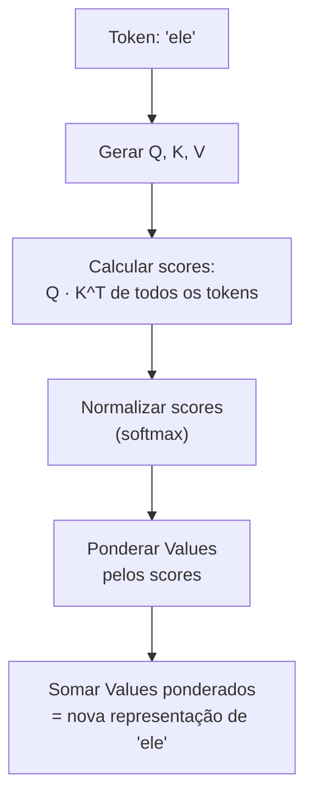
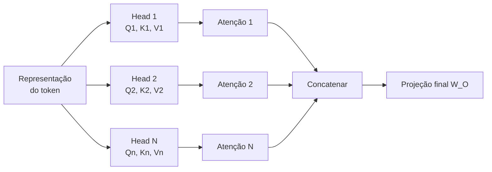
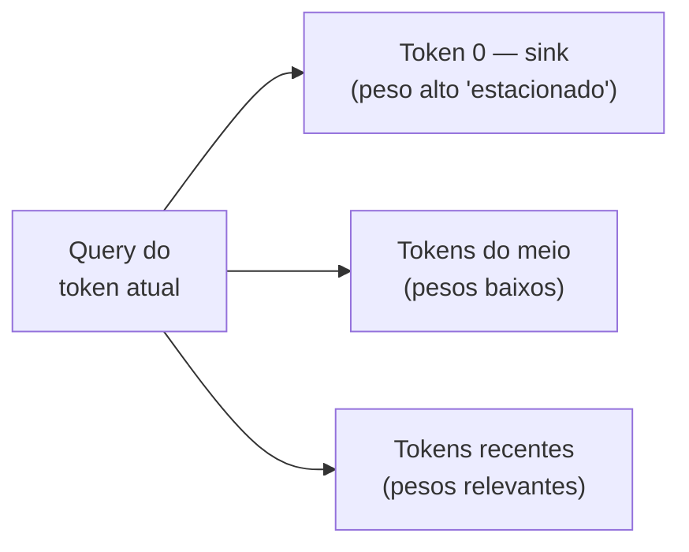
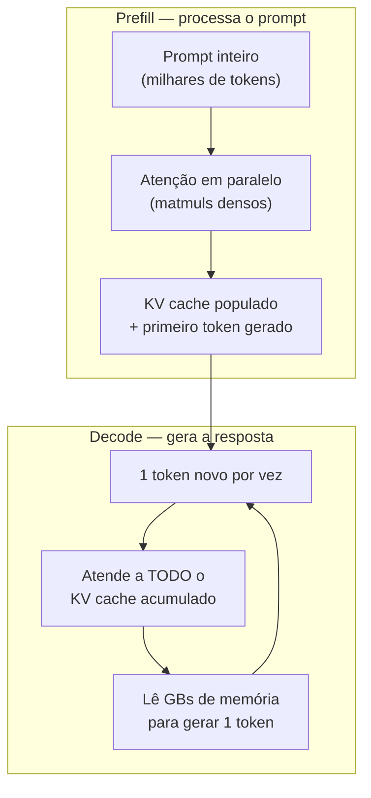

# Atenção e o mecanismo transformer

> [!abstract] TL;DR
> O mecanismo de atenção é o coração dos LLMs. Ele permite que cada token "olhe" para todos os outros tokens no contexto simultaneamente, calculando pesos de relevância via Query-Key-Value. Multi-head attention faz isso em paralelo com diferentes "lentes". É isso que torna LLMs capazes de entender contexto, resolver referências e processar sequências inteiras de uma vez — e também é o motivo pelo qual contexto longo é caro.

## O que é

O **[[Dicionário de IA#transformer|Transformer]]** é a arquitetura de rede neural introduzida por Vaswani et al. em 2017 no paper *"Attention Is All You Need"*. Antes dele, modelos de linguagem usavam RNNs (Recurrent Neural Networks) que processavam texto sequencialmente — uma palavra por vez, da esquerda para a direita. Isso era lento e perdia informação em distâncias longas.

O Transformer substituiu a recorrência por **[[Dicionário de IA#attention|atenção]]** — um mecanismo que permite processar todos os tokens de uma sequência **em paralelo**, calculando a relação de cada token com todos os outros.

## Por que importa

A atenção explica diretamente:

- **Por que LLMs são bons em contexto** — cada token é enriquecido pelo contexto de todos os outros
- **Por que contexto longo custa caro** — a atenção escala quadraticamente: O(n²) com o tamanho da sequência
- **Por que GPUs são necessárias** — a paralelização massiva da atenção é perfeita para hardware paralelo
- **Por que "lost in the middle" acontece** — os pesos de atenção podem se diluir em contextos muito longos

## Como funciona

### A intuição: "quem é relevante pra mim?"

Considere a frase: *"O animal não atravessou a rua porque **ele** estava cansado."*

Quando o modelo processa "ele", o mecanismo de atenção calcula:

- Alta atenção para "animal" (é a referência provável)
- Baixa atenção para "rua" (irrelevante para "ele")
- Atenção moderada para "cansado" (descreve "ele")

O resultado: a representação de "ele" é enriquecida com informação de "animal".
### Os três vetores: Query, Key, Value

Para cada token, o modelo cria três vetores através de multiplicação por matrizes de pesos aprendidas:

| Vetor         | Papel                      | Analogia                 |
| ------------- | -------------------------- | ------------------------ |
| **Query (Q)** | "O que estou procurando?"  | A pergunta de busca      |
| **Key (K)**   | "O que eu ofereço?"        | O índice de um documento |
| **Value (V)** | "Qual é minha informação?" | O conteúdo do documento  |


> [!question] Q, K e V vêm todos do mesmo token?
> Na **self-attention** (o que roda dentro de um LLM) sim: Q, K e V são três projeções **do mesmo conjunto de tokens** — a sequência atende a si mesma. Existe também a **cross-attention**, usada em arquiteturas encoder-decoder (tradução, alguns modelos multimodais): ali o Q vem de uma sequência (ex.: o texto sendo gerado) e K/V vêm de outra (ex.: a imagem ou o texto-fonte). LLMs decoder-only modernos usam só self-attention mascarada; a cross-attention reaparece quando há duas sequências distintas para casar.

### O cálculo passo a passo



1. **Score** = Q(ele) · K(cada_token)ᵀ — produto escalar que mede similaridade
2. **Normalização** = softmax(scores / √d_k) — transforma em probabilidades que somam 1
3. **Output** = Σ (score_i × V_i) — média ponderada dos Values

> [!question]- O que é esse softmax — e por que não um `argmax`?
> Os dois são parentes do `max`, e a diferença explica metade da atenção. O **`argmax`** responde "qual o maior?" e devolve **só o vencedor** — útil pra *decidir*, mas descontínuo: um empurrãozinho nos scores ou não muda nada, ou faz o vencedor pular de posição. Sem derivada útil, não dá pra treinar com gradiente.
>
> O **softmax** é o `max` "amolecido" (*soft*). Ele pega os scores crus e devolve uma lista do mesmo tamanho que (a) é toda positiva e (b) **soma exatamente 1** — viram proporções. A fórmula: exponencia cada score (`e^x`, que garante positividade e amplifica diferenças) e divide pela soma de todos.
> $$\text{softmax}(x_i) = \frac{e^{x_i}}{\sum_j e^{x_j}}$$
> Ex.: `[1,2 , 3,8 , 0,5]` → `[0,07 , 0,90 , 0,03]`. O índice que o `argmax` escolheria leva 90%, mas os outros **não zeram** — e é isso que importa: a atenção quer *misturar* vários Values numa média ponderada, não escolher um só. Sendo suave e diferenciável, o softmax ainda permite calcular gradiente e treinar.
>
> Os dois têm um botão de "dureza", a **temperatura**: dividir os scores por um número pequeno antes de exponenciar deixa o softmax "pontudo" (quase `argmax`); por um grande, "achatado" (quase uniforme). No limite `T → 0`, **softmax vira argmax**. É literalmente o mesmo botão que o `√d_k` mexe aqui na atenção e que a "temperature" do playground mexe na camada final (linha do `Linear + Softmax`). Origem do nome: a *distribuição de Boltzmann* da física (~1900), onde `T` é temperatura de verdade; o termo "softmax" foi cunhado por John Bridle em 1989 para redes neurais.

A divisão por √d_k (dimensão das keys) evita que os scores fiquem muito grandes, o que tornaria o [[Dicionário de IA#softmax|softmax]] muito "pontudo" (concentrado em um único token).

> [!question]- Por que dividir por √d_k, e não por d_k ou por nada?
> Conforme d_k cresce, o produto escalar Q·K soma mais termos e sua **variância** cresce proporcionalmente a d_k — ou seja, o desvio-padrão cresce com √d_k. Dividir por √d_k traz essa variância de volta para ~1, mantendo os scores numa faixa onde o softmax tem gradiente saudável. Dividir por d_k corrigiria demais (encolheria os scores até quase uniformes); não dividir deixaria o softmax **saturar** — vira quase um `argmax`, e aí o gradiente some e o treino emperra. É um ajuste de escala estatístico, não um número mágico.

> [!example]- Uma passada de atenção com números de verdade
> Vamos atender "ele" a dois tokens — "animal" e "rua" — com vetores de dimensão 2 (d_k = 2) para caber na cabeça.
>
> **Vetores já projetados:**
> - Q(ele) = [1, 0]
> - K(animal) = [1, 0]  ·  K(rua) = [0, 1]
> - V(animal) = [10, 0]  ·  V(rua) = [0, 10]
>
> **1. Scores (Q·Kᵀ):** score(animal) = 1·1 + 0·0 = **1** · score(rua) = 1·0 + 0·1 = **0**
> **2. Escala (÷√2 ≈ ÷1,41):** [0,71 , 0]
> **3. Softmax de [0,71 , 0]:** e^0,71 ≈ 2,03 · e^0 = 1 → pesos ≈ **[0,67 , 0,33]**
> **4. Output (média ponderada dos V):** 0,67·[10, 0] + 0,33·[0, 10] = **[6,7 , 3,3]**
>
> A nova representação de "ele" puxou ~⅔ de "animal" e ~⅓ de "rua" — porque a Query de "ele" estava alinhada com a Key de "animal". Inverta K(animal) para [0, 1] e o resultado se inverte: é assim que pesos aprendidos redirecionam para onde a atenção flui.

### Fórmula canônica

$$\text{Attention}(Q, K, V) = \text{softmax}\left(\frac{QK^T}{\sqrt{d_k}}\right)V$$

### A máscara causal — por que o modelo não pode "espiar o futuro"

Se a atenção deixa cada token olhar para todos os outros em paralelo, surge um problema no treino: prever o próximo token vira trapaça se o modelo já enxerga a resposta à frente. A solução é a **máscara causal** (*causal mask*).

Antes do softmax, os scores Q·Kᵀ de todas as posições **futuras** são zerados — tecnicamente, setados para −∞. Como o softmax de −∞ é 0, cada token fica matematicamente proibido de atender a qualquer token à sua direita: só "vê" a si mesmo e ao passado.

> [!info] É isso que define um modelo *decoder-only*
> Um Transformer "decoder-only" (GPT, Llama, etc.) é, na prática, **definido por essa máscara**. Ela vale tanto na geração token-a-token quanto no prefill do prompt inteiro — por isso o modelo consegue treinar todas as posições de uma sequência **em paralelo** e mesmo assim manter a regra "só o passado conta". O que é paralelo é o *cálculo* (todas as posições de uma vez), não o *alcance* (cada token enxerga apenas para trás). Encoders bidirecionais como o BERT não usam essa máscara — aí sim cada token vê todos os outros.

### Multi-Head Attention

Em vez de calcular atenção uma vez, o modelo faz isso **N vezes em paralelo** (geralmente 32-128 "heads"). Cada head aprende a detectar um tipo diferente de relação:

| Head   | Pode aprender a detectar               |
| ------ | -------------------------------------- |
| Head 1 | Referências pronominais (ele → animal) |
| Head 2 | Relações sintáticas (sujeito → verbo)  |
| Head 3 | Padrões de código (variável → tipo)    |
| Head N | Outros padrões emergentes              |

Os outputs de todos os heads são concatenados e projetados para produzir a representação final:



> [!question]- Se o modelo divide a dimensão entre N heads, cada head não fica "burro"?
> Cada head opera num subespaço de dimensão d_model/N (ex.: d_model = 4096 e 32 heads → 128 por head). Individualmente é mais pobre, sim — mas a aposta é que **especialização vence capacidade bruta**: um head de 128 dims focado em correferência rende mais que um head de 4096 tentando capturar tudo de uma vez. A concatenação no fim recompõe a dimensão cheia, e a projeção W_O aprende a misturar os subespaços. Não é fatiar por fatiar: é fatorar um problema grande em vários menores e independentes que rodam em paralelo.

### Attention sinks — o paradoxo do primeiro token

O softmax tem um efeito colateral estrutural: os pesos de atenção **precisam somar 1**. Quando a query de um token não encontra match forte em nenhum token anterior, o modelo ainda é obrigado a alocar essa atenção em algum lugar — e despeja nos **primeiros tokens** da sequência. Como eles são visíveis a quase todos os tokens subsequentes (natureza autoregressiva), o treinamento os converte em [[Dicionário de IA#attention sink|attention sinks]]: tokens que recebem atenção alta sem carregar semântica proporcional.



A consequência de produção é contraintuitiva: **remover os primeiros tokens do [[Dicionário de IA#KV cache|KV cache]]** (como faria uma sliding window ingênua) **destrói a qualidade do modelo** — não por perder contexto antigo, mas por remover uma fração enorme do denominador do softmax, desestabilizando a distribuição de atenção inteira. O StreamingLLM explora exatamente isso: mantém permanentemente os 4 primeiros tokens e desliza a janela para o resto, processando 4M+ tokens com estabilidade.

### A complexidade quadrática

O cálculo Q·Kᵀ compara cada token com todos os outros:

| Tokens no contexto | Comparações       | Custo relativo |
| ------------------ | ----------------- | -------------- |
| 1.000              | 1.000.000         | 1x             |
| 10.000             | 100.000.000       | 100x           |
| 100.000            | 10.000.000.000    | 10.000x        |
| 1.000.000          | 1.000.000.000.000 | 1.000.000x     |

É por isso que contextos de 1M tokens exigem hardware especializado e otimizações como **[[Dicionário de IA#FlashAttention|FlashAttention]]**, **paged attention**, e **[[Dicionário de IA#KV cache|KV cache]]**.

> [!question]- Se a atenção é O(n²), como modelos de 1M de tokens existem?
> Por uma pilha de truques que atacam ângulos diferentes da mesma conta — nenhum resolve sozinho:
> - O **FlashAttention** derruba a *constante* (não materializa a matriz N×N na memória lenta).
> - A **sparse/hybrid attention** quebra o próprio O(n²), fazendo a maioria das camadas olhar só localmente.
> - O **KV cache** + GQA/MLA fazem a memória caber.
> - A **paged attention** elimina o desperdício de alocação.
>
> É a combinação que torna 1M de tokens economicamente viável — cada peça aparece detalhada nas seções abaixo.

### As duas fases da atenção: prefill e decode

A mesma fórmula de atenção roda sob duas físicas completamente diferentes durante a [[Dicionário de IA#inference|inferência]]:



| Fase | O que acontece | Gargalo |
| ---- | -------------- | ------- |
| **[[Dicionário de IA#prefill\|Prefill]]** | O prompt inteiro é processado em paralelo — matmuls densos sobre milhares de tokens | **Compute-bound**: 90-95% de utilização de GPU (H100) |
| **Decode** | Cada token novo atende a todo o KV cache acumulado | **Memory-bound**: a intensidade aritmética cai ~2 ordens de magnitude; o limite vira o [[Dicionário de IA#memory bandwidth bottleneck\|memory bandwidth bottleneck]] |

Essa divisão explica fatos de produção que parecem desconexos:

- **[[Dicionário de IA#TTFT (time-to-first-token)|TTFT]] e tokens/s são métricas independentes** — uma mede o prefill, a outra o decode
- **Batching grande melhora o throughput do decode** (amortiza as leituras de memória), mas não acelera o prefill de uma request individual
- **Provedores fazem prefill-decode disaggregation** — GPUs separadas e otimizadas para cada fase

### O KV cache — o monstro de memória que governa a inferência

Você acabou de ver que o decode é *memory-bound*. O **[[Dicionário de IA#KV cache|KV cache]]** é a razão exata disso — e entender essa única estrutura explica metade da engenharia de inferência moderna.

**O problema.** Na geração autoregressiva, cada token novo precisa atender a *todos* os anteriores — ou seja, precisa das Keys e Values de todo o passado. Sem cache, a cada passo o modelo recomputaria K e V da sequência inteira: gerar o token 1.000 recomputaria 999 pares K/V; o token 1.001, mais 1.000... um desperdício O(n²) só para reconstruir o que já se sabia.

**A solução.** Computa-se K e V de cada token **uma única vez**, quando ele entra, e guarda-se na memória da GPU. Cada token novo só calcula o *seu* Q, K, V; os K/V antigos vêm do cache. O custo de gerar um token cai de O(n²) para O(n) — ao preço de carregar o cache inteiro da memória a cada passo. É *exatamente* esse carregamento que torna o decode memory-bound.

> [!question]- Por que cachear K e V, mas não o Q?
> Porque o Q de um token é usado **uma vez só**: no passo em que esse token é gerado, para perguntar ao passado. Depois disso, ninguém mais consulta o Q dele. Já o K e o V de cada token são consultados por **todos os tokens futuros** — então vale a pena guardá-los. Cachear o Q não economizaria nada.

**O custo.** O cache cresce **linearmente** com o contexto, e a conta é brutal:

$$\text{KV por token} = 2 \times L \times n_{kv} \times d_{head} \times \text{bytes}$$

(o 2 é um para K e outro para V; L = número de camadas; n_kv = número de KV heads; bytes = 2 em FP16/BF16).

| Modelo | Config | KV/token | Cache p/ 100k tokens |
| ------ | ------ | -------- | -------------------- |
| Llama 2 70B (MHA) | 80 cam · 64 heads · d=128 | ~2,5 MB | **~250 GB** |
| Llama 3 70B (GQA) | 80 cam · **8** KV heads · d=128 | ~0,31 MB | ~31 GB |

Uma H100 tem 80 GB. O KV cache de um único contexto de 100k tokens em MHA puro **não cabe na placa** — e é por isso que toda a engenharia de inferência gira em torno de encolher esse cache. As próximas otimizações (GQA, MLA, paged attention) são, no fundo, ataques diferentes a essa mesma linha.

### MHA → MQA → GQA → MLA: a corrida para encolher o KV cache

Olhe de novo a fórmula do cache: `2 × L × n_kv × d_head × bytes`. L e d_head são fixos pela arquitetura. A única alavanca real é **n_kv** — quantos conjuntos de Key/Value o modelo precisa guardar. Boa parte da evolução da atenção nos últimos anos é uma briga por esse número.

| Variante | Como compartilha K/V | KV cache | Trade-off |
| -------- | -------------------- | -------- | --------- |
| **MHA** (Multi-Head) | Cada head tem seu próprio K/V | Máximo (n_kv = n_heads) | Qualidade máxima, cache máximo |
| **MQA** (Multi-Query) | *Todos* os heads dividem **um** K/V | Mínimo (n_kv = 1) | Cache despenca, qualidade cai em escala |
| **GQA** (Grouped-Query) | Grupos de heads dividem K/V | Intermediário (n_kv = grupos) | O dial entre MHA e MQA |
| **MLA** (Multi-head Latent) | Comprime K/V num vetor latente low-rank | Menor que MQA | Cache mínimo *e* qualidade acima do MHA |

- **MHA** é o original: 32 heads → 32 conjuntos de K/V no cache. Caro.
- **MQA** foi a primeira pancada: e se *todos* os heads consultassem o mesmo K/V? O cache encolhe ~n_heads vezes. O problema: com um único K/V o modelo perde nuance e degrada conforme cresce.
- **GQA** é o meio-termo que venceu: divide os heads em poucos grupos (ex.: 32 heads em 8 grupos), cada grupo com seu K/V. Pega quase toda a economia do MQA sem a queda de qualidade. É o padrão de [[06 - Modelos chineses — DeepSeek, Qwen, Kimi, GLM|Qwen]], Llama 2/3 e Mistral.
- **MLA** muda a estratégia: em vez de cortar heads, **comprime** Key e Value juntos num vetor latente de baixa dimensão antes de cachear, e os reconstrói na hora da atenção. Cache menor que o do MQA e, surpreendentemente, qualidade *acima* do MHA — a compressão funciona como um gargalo regularizador. É a aposta da família [[06 - Modelos chineses — DeepSeek, Qwen, Kimi, GLM|DeepSeek]] (V2/V3).

> [!question]- Dá para ligar GQA num modelo já treinado em MHA?
> Não dá para simplesmente "ativar" — mas dá para converter com *uptraining*: agrupam-se os K/V heads (média dos pesos) e re-treina-se com uma fração pequena do compute original (~5%) para o modelo se reacomodar. Foi assim que o Llama 2 ganhou suas versões GQA. Trocar a arquitetura de atenção não é de graça, mas é muito mais barato que treinar do zero.

### Otimizações modernas (2026)

| Otimização | O que faz | Ganho |
| ---------- | --------- | ----- |
| **FlashAttention 4** | Reorganiza computação para minimizar I/O de memória; novo online softmax pula ~90% do rescaling (Hot Chips 2025) | Até 22% mais rápido que o kernel cuDNN em GPUs Blackwell |
| **KV Cache** | Cacheia Key/Value de tokens já processados para evitar recomputação | Essencial para geração autoregressiva |
| **[[Dicionário de IA#GQA (Grouped-Query Attention)\|Grouped Query Attention (GQA)]]** | Compartilha Keys/Values entre múltiplos heads | Reduz memória 2-8x |
| **[[Dicionário de IA#MLA (Multi-head Latent Attention)\|MLA (Multi-head Latent Attention)]]** | Comprime K/V num vetor latente low-rank antes de cachear; reconstrói na hora da atenção (DeepSeek-V2/V3) | KV cache ~1 ordem de grandeza menor que multi-head puro |
| **Paged Attention** | Gerencia KV cache como "páginas" de memória virtual | Permite batching eficiente (vLLM) |
| **Sparse Attention** | Cada token atende apenas a um subconjunto relevante | Reduz O(n²) para O(n·√n) ou O(n·log(n)) |
| **DSA (DeepSeek Sparse Attention)** | Heads leves selecionam quais tokens recebem atenção plena | Sparse attention treinável, em produção (V3.2-Exp) |

#### FlashAttention desempacotado — atenção que evita a memória lenta

A tabela trata o FlashAttention como "reorganiza a computação". Vale abrir, porque o insight é contraintuitivo e cai em entrevista.

> [!question]- Se a atenção é O(n²) em FLOPs, por que dizem que o gargalo é memória, não compute?
> Porque numa GPU moderna os FLOPs são baratos e a *memória é lenta*. O custo dominante da atenção não é multiplicar matrizes — é **escrever a matriz N×N de scores na HBM** (a memória principal da GPU: vasta, mas lenta) e lê-la de volta para o softmax. Para n grande, esse tráfego de bytes domina o relógio, não a aritmética.

A GPU tem duas memórias: a **HBM** (dezenas de GB, lenta) e a **SRAM** (poucos MB, ~10x mais rápida, on-chip). A atenção ingênua materializa a matriz N×N inteira na HBM. O FlashAttention nunca faz isso:

1. **Tiling** — corta Q, K e V em blocos pequenos que cabem na SRAM e computa a atenção bloco a bloco, on-chip. A matriz N×N completa nunca toca a HBM.
2. **Online softmax** — como cada bloco vê só um pedaço da linha, o softmax é calculado *incrementalmente*, carregando estatísticas correntes (o máximo e a soma) que são reajustadas a cada bloco novo. O resultado é **matematicamente idêntico** ao softmax sobre a linha inteira.
3. **Recomputação no backward** — em vez de guardar a matriz de atenção para o gradiente, o treino a **recomputa** a partir de Q/K/V na SRAM. Troca um pouco mais de FLOPs por uma redução enorme de tráfego de memória.

O resultado: mesmo cálculo, resultado **exato** (não é aproximação), porém com memória **linear** em n e parede de relógio menor. É por isso que a armadilha lá embaixo está certa — FlashAttention não muda a qualidade, só a *física* da execução.

A fronteira 2025-2026 é a **sparse attention treinável** — não mais um truque aplicado só na inferência, mas esparsidade aprendida durante o treino. O NSA (*Native Sparse Attention*, fev/2025) treina o modelo já esparso com kernels hardware-aligned; o DSA (DeepSeek-V3.2-Exp, set/2025) usa um *lightning indexer* — heads leves que pontuam quais tokens merecem atenção plena — com kernels atingindo 640 TFlops no prefill. O GLM5 (2026) já adota DSA. A aposta: quebrar o O(n²) sem perder qualidade, tornando contexto de 1M tokens economicamente viável.

Uma rota paralela à esparsidade é a **atenção híbrida (local + global)**. Em vez de toda camada pagar o O(n²), o modelo intercala camadas de *sliding window* — onde cada token só atende a uma janela local fixa — com uma minoria de camadas de atenção global, que costuram o contexto inteiro. O Gemma 2 alterna 1:1 (janela de 4096 tokens); o GPT-OSS usa janelas bem menores (128 tokens) entre as camadas globais. A maior parte do trabalho fica local e barata; só algumas camadas pagam o custo quadrático. Cuidado com a dosagem: janelas pequenas demais ou camadas globais de menos degradam a qualidade — o modelo perde alcance de longo prazo. Note que isso é diferente do StreamingLLM lá de cima: aqui a esparsidade local é **treinada na arquitetura**, não um remendo aplicado só na inferência.

### Positional encoding — atenção não sabe ordem

A atenção pura é **permutation-invariant**: os scores Q·Kᵀ não mudam se você embaralhar os tokens. Sem informação posicional, "cão morde homem" e "homem morde cão" produziriam as mesmas representações. É por isso que todo Transformer injeta posição nos [[Dicionário de IA#embedding|embeddings]] — e a forma de fazer isso evoluiu:

- **Posicional absoluto** (paper original) — soma um vetor de posição ao embedding. Simples, mas generaliza mal além do comprimento visto no treino.
- **[[Dicionário de IA#RoPE (Rotary Position Embedding)|RoPE]]** (padrão moderno) — em vez de somar, **rotaciona pares de dimensões de Q e K** por um ângulo proporcional à posição. O produto escalar Q·K passa a codificar **distância relativa** naturalmente: o que importa é "quão longe", não "em qual posição absoluta".
- **[[Dicionário de IA#YaRN|YaRN]]** (extensão de contexto) — reescala as frequências do RoPE (interpolação rampada + temperatura de atenção) para esticar a janela além do comprimento de pretraining, usando ~10x menos tokens de treino que métodos anteriores. É assim que modelos treinados em 4K chegam a 128K+.

### A arquitetura completa do Transformer

```mermaid
graph TD
    A[Input Tokens] --> B[Token Embeddings + Positional Encoding]
    B --> C[Layer 1]
    subgraph "Transformer Layer (repete N vezes)"
        C --> D[Multi-Head Self-Attention]
        D --> E[Add & Normalize]
        E --> F[Feed-Forward Network]
        F --> G[Add & Normalize]
    end
    G --> H[..."Layer N"]
    H --> I[Linear + Softmax]
    I --> J[Probabilidade do próximo token]
```

Cada camada combina:

1. **Self-attention** — captura relações entre tokens
2. **Feed-forward network** — processa cada token independentemente (onde fica o "conhecimento" armazenado)
3. **Residual connections + layer norm** — estabilizam o treinamento em redes profundas

> [!warning]- O diagrama acima é *post-norm* — e quase nenhum LLM moderno usa isso
> O paper original normaliza **depois** de somar o resíduo (*post-norm*, o "Add & Normalize" do diagrama). Parece detalhe de ordem, mas em redes profundas o post-norm trava: gradientes explodem ou somem, e o treino só converge com *warm-up* cuidadoso de learning rate — num teste de 29 camadas, o post-norm sequer convergiu.
> Praticamente todos os LLMs modernos (GPT-3, Llama, PaLM) inverteram para **pre-norm**: normalizar *antes* do sub-layer, deixando a conexão residual como um "atalho limpo" para o gradiente fluir até as primeiras camadas. O preço é uma leve perda de fidelidade representacional, mas a estabilidade compensa.
> De brinde, a norma deixou de ser LayerNorm e virou **RMSNorm**: só reescala (não centraliza nem aprende *bias*), o que corta um parâmetro por camada e sai mais barato. É o padrão da família Llama em diante.

### A Feed-Forward Network — onde mora o conhecimento

A atenção recebe toda a atenção (trocadilho intencional), mas ~⅔ dos [[Dicionário de IA#parameters / weights|parâmetros]] de um Transformer estão na **FFN** — a rede feed-forward que vem depois da atenção em cada camada. Se a atenção é o mecanismo de *roteamento* (quem fala com quem), a FFN é a *memória* (o que se sabe).

Ela é deceptivamente simples — roda em cada token de forma independente:

$$\text{FFN}(x) = W_{down} \cdot \text{ativação}(W_{up} \cdot x)$$

- **Up-projection** — expande a dimensão do token, tipicamente para `d_ff ≈ 4 × d_model` (ex.: 4096 → 16384).
- **Ativação** não-linear — GELU no GPT, **SwiGLU** na família Llama.
- **Down-projection** — comprime de volta para d_model.

Esse "incha → processa → comprime" é onde os fatos ficam guardados: estudos de interpretabilidade mostram que as camadas FFN funcionam como uma memória chave-valor, com neurônios específicos ativando para conceitos específicos (*"a capital da França é…"*). A atenção **move** informação entre posições; a FFN **transforma** a informação de cada posição com base no que aprendeu no pré-treino.

> [!question]- Então o custo de um LLM é tudo atenção?
> Só em contexto longo. Para sequências curtas, a **FFN domina os FLOPs** — ela roda em todo token e é ~4x mais larga que o modelo. A atenção, sendo O(n²), só ultrapassa a FFN quando n fica grande. Por isso otimizar atenção (FlashAttention, sparse) importa para contexto longo, mas a contagem de parâmetros e o custo de prompts curtos são governados pela FFN — exatamente o que o [[07 - Dense vs Mixture-of-Experts|Mixture-of-Experts]] ataca ao tornar a FFN esparsa.

## Armadilhas

- **"O modelo lê da esquerda pra direita"** — na geração sim, mas durante o processamento do input, self-attention vê todos os tokens simultaneamente.
- **"Atenção = compreensão"** — atenção é correlação estatística. O modelo pode dar peso alto a um token por razões estatísticas, não semânticas.
- **Ignorar o custo quadrático** — duplicar o contexto quadruplica o custo de atenção. É por isso que context engineering importa tanto.
- **"Flash Attention muda a qualidade"** — não. FlashAttention é matematicamente equivalente à atenção padrão. Só reorganiza a computação para ser mais eficiente em hardware.
- **Confundir [[Dicionário de IA#parameters / weights|parâmetros]] com atenção** — os pesos das camadas feed-forward (não a atenção) são onde o "conhecimento factual" do modelo reside. Atenção é o mecanismo de busca/organização.

## Veja também

- [[01 - O que é um LLM]] — contexto geral da arquitetura
- [[03 - A janela de contexto]] — a consequência prática da atenção
- [[07 - Dense vs Mixture-of-Experts]] — como MoE modifica as camadas feed-forward
- [[06 - Modelos chineses — DeepSeek, Qwen, Kimi, GLM]] — MLA e DSA em produção
- [[12 - Streaming, batching e latência]] — prefill, decode e TTFT na prática
- [[03 - Context rot e atenção diluída]] — quando a atenção dilui em contextos longos

## Referências

- **Vaswani et al.** — *Attention Is All You Need* (NeurIPS, 2017). O paper fundador.
- **Dao, Tri** — *FlashAttention: Fast and Memory-Efficient Exact Attention with IO-Awareness* (2022). A otimização que viabilizou contextos longos.
- **Ainslie et al.** — *GQA: Training Generalized Multi-Query Transformer Models from Multi-Head Checkpoints* (Google, 2023). Grouped Query Attention.
- **3Blue1Brown** — *Attention in transformers, visually explained* (YouTube, 2024). Explicação visual excelente.
- **Karpathy, Andrej** — *Let's build GPT from scratch* (YouTube, 2023). Implementação completa com atenção.
- **Xiao et al.** — [*Efficient Streaming Language Models with Attention Sinks*](https://arxiv.org/abs/2309.17453) (2023). O paper dos attention sinks e do StreamingLLM.
- **Peng et al.** — [*YaRN: Efficient Context Window Extension of Large Language Models*](https://arxiv.org/abs/2309.00071) (2023). Extensão de contexto via reescala do RoPE.
- **Dao, Tri** — [*FlashAttention-4: Algorithm and Kernel Pipelining Co-Design*](https://tridao.me/blog/2026/flash4/) (2026). O kernel de atenção mais otimizado para Blackwell.
- **Yuan et al.** — [*Native Sparse Attention: Hardware-Aligned and Natively Trainable Sparse Attention*](https://arxiv.org/abs/2502.11089) (2025). Sparse attention treinável (DeepSeek).
- **Towards Data Science** — [*Prefill Is Compute-Bound. Decode Is Memory-Bound.*](https://towardsdatascience.com/prefill-is-compute-bound-decode-is-memory-bound-why-your-gpu-shouldnt-do-both/) (2025). As duas físicas da inferência.
- **MachineLearningMastery** — [*A Gentle Introduction to Attention Masking in Transformer Models*](https://machinelearningmastery.com/a-gentle-introduction-to-attention-masking-in-transformer-models/) (2024). A máscara causal que define modelos decoder-only.
- **Why Pre-Norm Became the Default in Transformers** — [Medium](https://medium.com/@ashutoshs81127/why-pre-norm-became-the-default-in-transformers-4229047e2620) (2025). Pre-norm vs post-norm e a adoção de RMSNorm.
- **Gemma Team** — [*Gemma 2: Improving Open Language Models at a Practical Size*](https://arxiv.org/abs/2408.00118) (Google, 2024). Atenção híbrida local/global intercalada (sliding window + global).
- **Analytics Vidhya** — [*How KV Caching Makes Modern LLMs Fast?*](https://www.analyticsvidhya.com/blog/2025/11/kv-caching-guide/) (2025). A matemática do KV cache e por que ele domina a memória no decode.
- **DeepSeek-AI** — [*DeepSeek-V2: A Strong, Economical, and Efficient Mixture-of-Experts Language Model*](https://arxiv.org/abs/2405.04434) (2024). Multi-head Latent Attention (MLA) e a compressão low-rank do KV cache.
- **Geva et al.** — [*Transformer Feed-Forward Layers Are Key-Value Memories*](https://arxiv.org/abs/2012.14913) (EMNLP, 2021). Evidência de que o conhecimento factual reside nas camadas feed-forward.
