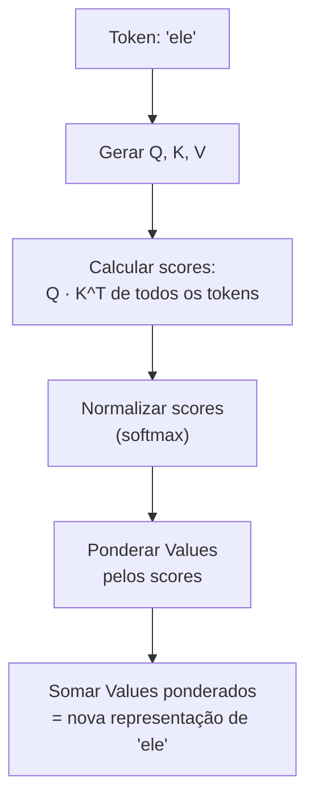
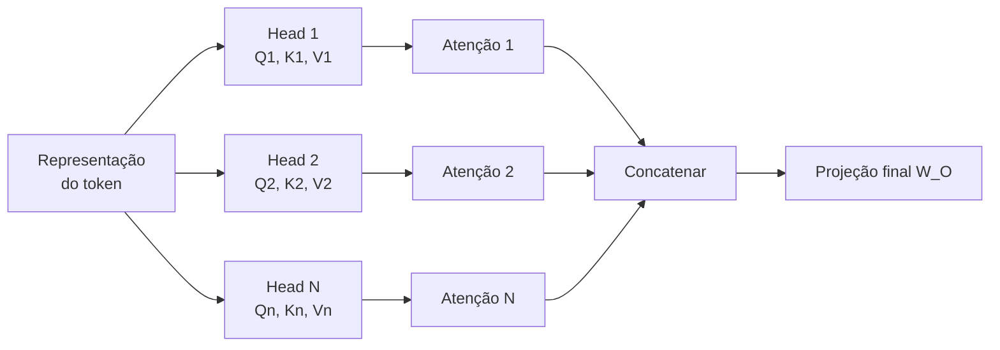
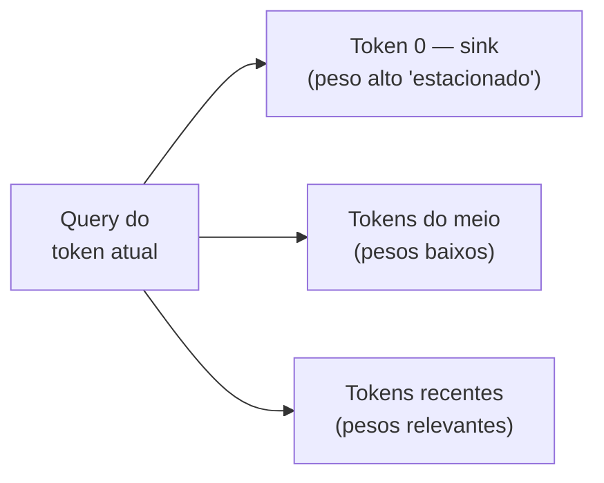
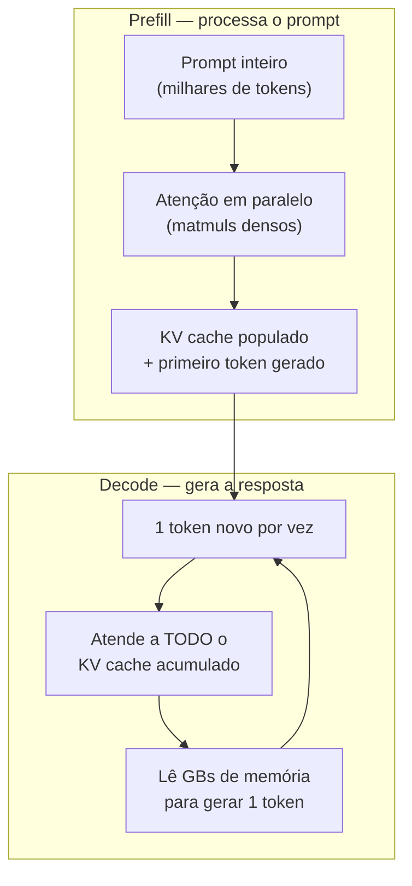

# Atenção e o mecanismo transformer

> [!abstract] TL;DR
> O mecanismo de atenção é o coração dos LLMs. Ele permite que cada token "olhe" para todos os outros tokens no contexto simultaneamente, calculando pesos de relevância via Query-Key-Value. Multi-head attention faz isso em paralelo com diferentes "lentes". É isso que torna LLMs capazes de entender contexto, resolver referências e processar sequências inteiras de uma vez — e também é o motivo pelo qual contexto longo é caro.

## O que é

O **[[Dicionário de IA#transformer|Transformer]]** é a arquitetura de rede neural introduzida por Vaswani et al. em 2017 no paper *"Attention Is All You Need"*. Antes dele, modelos de linguagem usavam RNNs (Recurrent Neural Networks) que processavam texto sequencialmente — uma palavra por vez, da esquerda para a direita. Isso era lento e perdia informação em distâncias longas.

O Transformer substituiu a recorrência por **[[Dicionário de IA#attention|atenção]]** — um mecanismo que permite processar todos os tokens de uma sequência **em paralelo**, calculando a relação de cada token com todos os outros.

## Por que importa

A atenção explica diretamente:

- **Por que LLMs são bons em contexto** — cada token é enriquecido pelo contexto de todos os outros
- **Por que contexto longo custa caro** — a atenção escala quadraticamente: O(n²) com o tamanho da sequência
- **Por que GPUs são necessárias** — a paralelização massiva da atenção é perfeita para hardware paralelo
- **Por que "lost in the middle" acontece** — os pesos de atenção podem se diluir em contextos muito longos

## Como funciona

### A intuição: "quem é relevante pra mim?"

Considere a frase: *"O animal não atravessou a rua porque **ele** estava cansado."*

Quando o modelo processa "ele", o mecanismo de atenção calcula:

- Alta atenção para "animal" (é a referência provável)
- Baixa atenção para "rua" (irrelevante para "ele")
- Atenção moderada para "cansado" (descreve "ele")

O resultado: a representação de "ele" é enriquecida com informação de "animal".

### Os três vetores: Query, Key, Value

Para cada token, o modelo cria três vetores através de multiplicação por matrizes de pesos aprendidas:

| Vetor         | Papel                      | Analogia                 |
| ------------- | -------------------------- | ------------------------ |
| **Query (Q)** | "O que estou procurando?"  | A pergunta de busca      |
| **Key (K)**   | "O que eu ofereço?"        | O índice de um documento |
| **Value (V)** | "Qual é minha informação?" | O conteúdo do documento  |

### O cálculo passo a passo



1. **Score** = Q(ele) · K(cada_token)ᵀ — produto escalar que mede similaridade
2. **Normalização** = softmax(scores / √d_k) — transforma em probabilidades que somam 1
3. **Output** = Σ (score_i × V_i) — média ponderada dos Values

A divisão por √d_k (dimensão das keys) evita que os scores fiquem muito grandes, o que tornaria o softmax muito "pontudo" (concentrado em um único token).

### Fórmula canônica

$$\text{Attention}(Q, K, V) = \text{softmax}\left(\frac{QK^T}{\sqrt{d_k}}\right)V$$

### Multi-Head Attention

Em vez de calcular atenção uma vez, o modelo faz isso **N vezes em paralelo** (geralmente 32-128 "heads"). Cada head aprende a detectar um tipo diferente de relação:

| Head   | Pode aprender a detectar               |
| ------ | -------------------------------------- |
| Head 1 | Referências pronominais (ele → animal) |
| Head 2 | Relações sintáticas (sujeito → verbo)  |
| Head 3 | Padrões de código (variável → tipo)    |
| Head N | Outros padrões emergentes              |

Os outputs de todos os heads são concatenados e projetados para produzir a representação final:



### Attention sinks — o paradoxo do primeiro token

O softmax tem um efeito colateral estrutural: os pesos de atenção **precisam somar 1**. Quando a query de um token não encontra match forte em nenhum token anterior, o modelo ainda é obrigado a alocar essa atenção em algum lugar — e despeja nos **primeiros tokens** da sequência. Como eles são visíveis a quase todos os tokens subsequentes (natureza autoregressiva), o treinamento os converte em [[Dicionário de IA#attention sink|attention sinks]]: tokens que recebem atenção alta sem carregar semântica proporcional.



A consequência de produção é contraintuitiva: **remover os primeiros tokens do [[Dicionário de IA#KV cache|KV cache]]** (como faria uma sliding window ingênua) **destrói a qualidade do modelo** — não por perder contexto antigo, mas por remover uma fração enorme do denominador do softmax, desestabilizando a distribuição de atenção inteira. O StreamingLLM explora exatamente isso: mantém permanentemente os 4 primeiros tokens e desliza a janela para o resto, processando 4M+ tokens com estabilidade.

### A complexidade quadrática

O cálculo Q·Kᵀ compara cada token com todos os outros:

| Tokens no contexto | Comparações       | Custo relativo |
| ------------------ | ----------------- | -------------- |
| 1.000              | 1.000.000         | 1x             |
| 10.000             | 100.000.000       | 100x           |
| 100.000            | 10.000.000.000    | 10.000x        |
| 1.000.000          | 1.000.000.000.000 | 1.000.000x     |

É por isso que contextos de 1M tokens exigem hardware especializado e otimizações como **[[Dicionário de IA#FlashAttention|FlashAttention]]**, **paged attention**, e **[[Dicionário de IA#KV cache|KV cache]]**.

### As duas fases da atenção: prefill e decode

A mesma fórmula de atenção roda sob duas físicas completamente diferentes durante a inferência:



| Fase | O que acontece | Gargalo |
| ---- | -------------- | ------- |
| **[[Dicionário de IA#prefill\|Prefill]]** | O prompt inteiro é processado em paralelo — matmuls densos sobre milhares de tokens | **Compute-bound**: 90-95% de utilização de GPU (H100) |
| **Decode** | Cada token novo atende a todo o KV cache acumulado | **Memory-bound**: a intensidade aritmética cai ~2 ordens de magnitude; o limite vira o [[Dicionário de IA#memory bandwidth bottleneck\|memory bandwidth bottleneck]] |

Essa divisão explica fatos de produção que parecem desconexos:

- **[[Dicionário de IA#TTFT (time-to-first-token)|TTFT]] e tokens/s são métricas independentes** — uma mede o prefill, a outra o decode
- **Batching grande melhora o throughput do decode** (amortiza as leituras de memória), mas não acelera o prefill de uma request individual
- **Provedores fazem prefill-decode disaggregation** — GPUs separadas e otimizadas para cada fase

### Otimizações modernas (2026)

| Otimização | O que faz | Ganho |
| ---------- | --------- | ----- |
| **FlashAttention 4** | Reorganiza computação para minimizar I/O de memória; novo online softmax pula ~90% do rescaling (Hot Chips 2025) | Até 22% mais rápido que o kernel cuDNN em GPUs Blackwell |
| **KV Cache** | Cacheia Key/Value de tokens já processados para evitar recomputação | Essencial para geração autoregressiva |
| **[[Dicionário de IA#GQA (Grouped-Query Attention)\|Grouped Query Attention (GQA)]]** | Compartilha Keys/Values entre múltiplos heads | Reduz memória 2-8x |
| **[[Dicionário de IA#MLA (Multi-head Latent Attention)\|MLA (Multi-head Latent Attention)]]** | Comprime K/V num vetor latente low-rank antes de cachear; reconstrói na hora da atenção (DeepSeek-V2/V3) | KV cache ~1 ordem de grandeza menor que multi-head puro |
| **Paged Attention** | Gerencia KV cache como "páginas" de memória virtual | Permite batching eficiente (vLLM) |
| **Sparse Attention** | Cada token atende apenas a um subconjunto relevante | Reduz O(n²) para O(n·√n) ou O(n·log(n)) |
| **DSA (DeepSeek Sparse Attention)** | Heads leves selecionam quais tokens recebem atenção plena | Sparse attention treinável, em produção (V3.2-Exp) |

A fronteira 2025-2026 é a **sparse attention treinável** — não mais um truque aplicado só na inferência, mas esparsidade aprendida durante o treino. O NSA (*Native Sparse Attention*, fev/2025) treina o modelo já esparso com kernels hardware-aligned; o DSA (DeepSeek-V3.2-Exp, set/2025) usa um *lightning indexer* — heads leves que pontuam quais tokens merecem atenção plena — com kernels atingindo 640 TFlops no prefill. O GLM5 (2026) já adota DSA. A aposta: quebrar o O(n²) sem perder qualidade, tornando contexto de 1M tokens economicamente viável.

### Positional encoding — atenção não sabe ordem

A atenção pura é **permutation-invariant**: os scores Q·Kᵀ não mudam se você embaralhar os tokens. Sem informação posicional, "cão morde homem" e "homem morde cão" produziriam as mesmas representações. É por isso que todo Transformer injeta posição nos embeddings — e a forma de fazer isso evoluiu:

- **Posicional absoluto** (paper original) — soma um vetor de posição ao embedding. Simples, mas generaliza mal além do comprimento visto no treino.
- **[[Dicionário de IA#RoPE (Rotary Position Embedding)|RoPE]]** (padrão moderno) — em vez de somar, **rotaciona pares de dimensões de Q e K** por um ângulo proporcional à posição. O produto escalar Q·K passa a codificar **distância relativa** naturalmente: o que importa é "quão longe", não "em qual posição absoluta".
- **[[Dicionário de IA#YaRN|YaRN]]** (extensão de contexto) — reescala as frequências do RoPE (interpolação rampada + temperatura de atenção) para esticar a janela além do comprimento de pretraining, usando ~10x menos tokens de treino que métodos anteriores. É assim que modelos treinados em 4K chegam a 128K+.

### A arquitetura completa do Transformer

```mermaid
graph TD
    A[Input Tokens] --> B[Token Embeddings + Positional Encoding]
    B --> C[Layer 1]
    subgraph "Transformer Layer (repete N vezes)"
        C --> D[Multi-Head Self-Attention]
        D --> E[Add & Normalize]
        E --> F[Feed-Forward Network]
        F --> G[Add & Normalize]
    end
    G --> H[..."Layer N"]
    H --> I[Linear + Softmax]
    I --> J[Probabilidade do próximo token]
```

Cada camada combina:

1. **Self-attention** — captura relações entre tokens
2. **Feed-forward network** — processa cada token independentemente (onde fica o "conhecimento" armazenado)
3. **Residual connections + layer norm** — estabilizam o treinamento em redes profundas

## Armadilhas

- **"O modelo lê da esquerda pra direita"** — na geração sim, mas durante o processamento do input, self-attention vê todos os tokens simultaneamente.
- **"Atenção = compreensão"** — atenção é correlação estatística. O modelo pode dar peso alto a um token por razões estatísticas, não semânticas.
- **Ignorar o custo quadrático** — duplicar o contexto quadruplica o custo de atenção. É por isso que context engineering importa tanto.
- **"Flash Attention muda a qualidade"** — não. FlashAttention é matematicamente equivalente à atenção padrão. Só reorganiza a computação para ser mais eficiente em hardware.
- **Confundir [[Dicionário de IA#parameters / weights|parâmetros]] com atenção** — os pesos das camadas feed-forward (não a atenção) são onde o "conhecimento factual" do modelo reside. Atenção é o mecanismo de busca/organização.

## Veja também

- [[01 - O que é um LLM]] — contexto geral da arquitetura
- [[03 - A janela de contexto]] — a consequência prática da atenção
- [[07 - Dense vs Mixture-of-Experts]] — como MoE modifica as camadas feed-forward
- [[06 - Modelos chineses — DeepSeek, Qwen, Kimi, GLM]] — MLA e DSA em produção
- [[12 - Streaming, batching e latência]] — prefill, decode e TTFT na prática
- [[03 - Context rot e atenção diluída]] — quando a atenção dilui em contextos longos

## Referências

- **Vaswani et al.** — *Attention Is All You Need* (NeurIPS, 2017). O paper fundador.
- **Dao, Tri** — *FlashAttention: Fast and Memory-Efficient Exact Attention with IO-Awareness* (2022). A otimização que viabilizou contextos longos.
- **Ainslie et al.** — *GQA: Training Generalized Multi-Query Transformer Models from Multi-Head Checkpoints* (Google, 2023). Grouped Query Attention.
- **3Blue1Brown** — *Attention in transformers, visually explained* (YouTube, 2024). Explicação visual excelente.
- **Karpathy, Andrej** — *Let's build GPT from scratch* (YouTube, 2023). Implementação completa com atenção.
- **Xiao et al.** — [*Efficient Streaming Language Models with Attention Sinks*](https://arxiv.org/abs/2309.17453) (2023). O paper dos attention sinks e do StreamingLLM.
- **Peng et al.** — [*YaRN: Efficient Context Window Extension of Large Language Models*](https://arxiv.org/abs/2309.00071) (2023). Extensão de contexto via reescala do RoPE.
- **Dao, Tri** — [*FlashAttention-4: Algorithm and Kernel Pipelining Co-Design*](https://tridao.me/blog/2026/flash4/) (2026). O kernel de atenção mais otimizado para Blackwell.
- **Yuan et al.** — [*Native Sparse Attention: Hardware-Aligned and Natively Trainable Sparse Attention*](https://arxiv.org/abs/2502.11089) (2025). Sparse attention treinável (DeepSeek).
- **Towards Data Science** — [*Prefill Is Compute-Bound. Decode Is Memory-Bound.*](https://towardsdatascience.com/prefill-is-compute-bound-decode-is-memory-bound-why-your-gpu-shouldnt-do-both/) (2025). As duas físicas da inferência.
