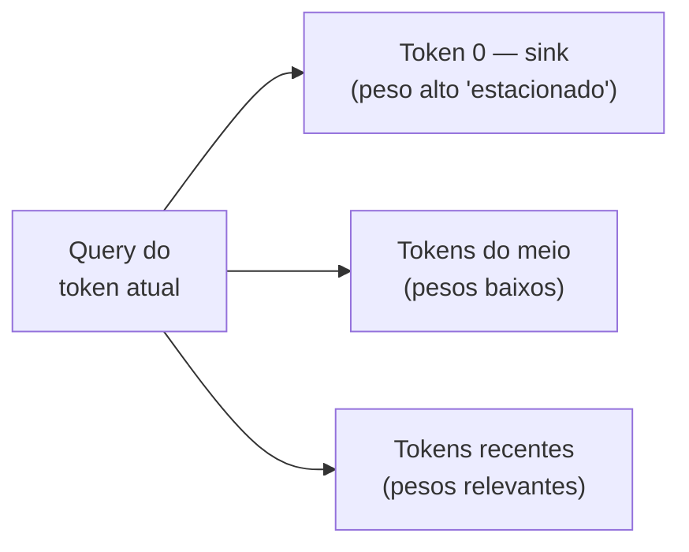

# Atenção eficiente — FlashAttention, sparse e híbrida

> [!info] Broto de [[04 - Atenção e o mecanismo transformer]]
> Nota **Magus**. Enquanto [[04a - KV cache, prefill e decode — a física da inferência|KV cache]] e [[04b - Encolhendo o KV cache — MHA, MQA, GQA, MLA|MHA→MLA]] atacam a **memória**, este broto ataca a **conta O(n²) em si** — como fazer a atenção custar menos sem mudar (ou quase) o resultado. Leia a [[04 - Atenção e o mecanismo transformer|nota-mãe]] antes; tudo aqui assume a fórmula `softmax(QKᵀ/√d_k)V`.

> [!abstract] TL;DR
> A atenção é O(n²), mas há duas famílias de ataque. A primeira mantém o resultado **exato** e só muda a *física da execução*: o **FlashAttention** nunca escreve a matriz N×N na memória lenta da GPU — calcula a atenção em blocos que cabem na memória rápida on-chip. A segunda família muda a *matemática*: a **sparse attention** faz cada token atender só a um subconjunto relevante (quebrando o O(n²)), e a **atenção híbrida** intercala camadas locais baratas com poucas camadas globais. Como pano de fundo, um efeito estrutural do softmax — os **attention sinks** — explica por que jogar fora os primeiros tokens do contexto destrói o modelo.

## Por que isso importa

Contexto de 1M de tokens não existe por causa de uma ideia só, mas de uma pilha de otimizações que atacam ângulos diferentes da mesma conta. O FlashAttention é hoje o kernel-padrão de fato — se você treina ou serve qualquer modelo, está usando. E a fronteira 2025-2026 (sparse treinável) é o que decide se janelas gigantes serão caras ou baratas na próxima geração.

## Attention sinks — o paradoxo do primeiro token

Comece por um efeito colateral estrutural do softmax, porque ele explica várias decisões adiante. O softmax obriga os pesos de atenção a **somarem 1**. Quando a query de um token não encontra match forte em nenhum token anterior, o modelo ainda é obrigado a alocar essa atenção em algum lugar — e despeja nos **primeiros tokens** da sequência. Como eles são visíveis a quase todos os tokens subsequentes (natureza autoregressiva), o treinamento os converte em **attention sinks**: tokens que recebem atenção alta sem carregar semântica proporcional. São o "ralo" onde a atenção sobrando escoa.

A consequência de produção é contraintuitiva: **remover os primeiros tokens do KV cache** (como faria uma *sliding window* ingênua) **destrói a qualidade do modelo** — não por perder contexto antigo, mas por remover uma fração enorme do denominador do softmax, desestabilizando a distribuição de atenção inteira. O **StreamingLLM** explora exatamente isso: mantém permanentemente os 4 primeiros tokens e desliza a janela para o resto, processando 4M+ tokens com estabilidade.

## FlashAttention — atenção que evita a memória lenta

> [!question]- Se a atenção é O(n²) em FLOPs, por que dizem que o gargalo é memória, não compute?
> Porque numa GPU moderna os FLOPs são baratos e a *memória é lenta*. O custo dominante da atenção não é multiplicar matrizes — é **escrever a matriz N×N de scores na HBM** (a memória principal da GPU: vasta, mas lenta) e lê-la de volta para o softmax. Para n grande, esse tráfego de bytes domina o relógio, não a aritmética.

A GPU tem duas memórias: a **HBM** (dezenas de GB, lenta) e a **SRAM** (poucos MB, ~10x mais rápida, on-chip). A atenção ingênua materializa a matriz N×N inteira na HBM. O FlashAttention nunca faz isso:

1. **Tiling** — corta Q, K e V em blocos pequenos que cabem na SRAM e computa a atenção bloco a bloco, on-chip. A matriz N×N completa nunca toca a HBM.
2. **Online softmax** — como cada bloco vê só um pedaço da linha, o softmax é calculado *incrementalmente*, carregando estatísticas correntes (o máximo e a soma) que são reajustadas a cada bloco novo. O resultado é **matematicamente idêntico** ao softmax sobre a linha inteira.
3. **Recomputação no backward** — em vez de guardar a matriz de atenção para o gradiente, o treino a **recomputa** a partir de Q/K/V na SRAM. Troca um pouco mais de FLOPs por uma redução enorme de tráfego de memória.

O resultado: mesmo cálculo, resultado **exato** (não é aproximação), porém com memória **linear** em n e parede de relógio menor. É por isso que "FlashAttention muda a qualidade" é mito — ele não muda nada do resultado, só a *física* da execução.

> [!info] FlashAttention 4 (2026)
> A versão mais recente reorganiza ainda mais o pipeline para GPUs Blackwell: um novo *online softmax* pula ~90% do rescaling (Hot Chips 2025), chegando a ~22% mais rápido que o kernel cuDNN. A ideia central — nunca materializar a matriz N×N — é a mesma desde 2022.

## Sparse e híbrida — quando a conta O(n²) é alta demais

O FlashAttention baixa a *constante*, mas a atenção ainda é O(n²). Para quebrar o próprio expoente, é preciso fazer cada token atender a **menos** tokens.

| Otimização | O que faz | Ganho |
| ---------- | --------- | ----- |
| **Sparse Attention** | Cada token atende apenas a um subconjunto relevante | Reduz O(n²) para O(n·√n) ou O(n·log n) |
| **Paged Attention** | Gerencia KV cache como "páginas" de memória virtual | Permite batching eficiente (vLLM) |
| **DSA (DeepSeek Sparse Attention)** | Heads leves selecionam quais tokens recebem atenção plena | Sparse attention treinável, em produção (V3.2-Exp) |

A fronteira 2025-2026 é a **sparse attention treinável** — não mais um truque aplicado só na inferência, mas esparsidade aprendida durante o treino. O **NSA** (*Native Sparse Attention*, fev/2025) treina o modelo já esparso com kernels hardware-aligned; o **DSA** (DeepSeek-V3.2-Exp, set/2025) usa um *lightning indexer* — heads leves que pontuam quais tokens merecem atenção plena — com kernels atingindo 640 TFlops no prefill. O GLM5 (2026) já adota DSA. A aposta: quebrar o O(n²) sem perder qualidade.

Uma rota paralela à esparsidade é a **atenção híbrida (local + global)**. Em vez de toda camada pagar o O(n²), o modelo intercala camadas de *sliding window* — onde cada token só atende a uma janela local fixa — com uma minoria de camadas de atenção global, que costuram o contexto inteiro. O **Gemma 2** alterna 1:1 (janela de 4096 tokens); o **GPT-OSS** usa janelas bem menores (128 tokens) entre as camadas globais. A maior parte do trabalho fica local e barata; só algumas camadas pagam o custo quadrático.

> [!warning] Cuidado com a dosagem
> Janelas pequenas demais ou camadas globais de menos degradam a qualidade — o modelo perde alcance de longo prazo. E note: a atenção híbrida aqui é **treinada na arquitetura**, diferente do StreamingLLM lá de cima, que é um remendo aplicado só na inferência.

## Veja também

- [[04 - Atenção e o mecanismo transformer]] — a nota-mãe: softmax, máscara causal, multi-head
- [[04a - KV cache, prefill e decode — a física da inferência]] — o ataque pela memória (prefill/decode/KV cache)
- [[04b - Encolhendo o KV cache — MHA, MQA, GQA, MLA]] — o ataque pelo tamanho do cache
- [[06 - A janela de contexto]] — a consequência: janelas de 1M tokens
- [[08 - Modelos chineses — DeepSeek, Qwen, Kimi, GLM]] — DSA e atenção esparsa em produção

## Referências

- **Dao, Tri et al.** — [*FlashAttention: Fast and Memory-Efficient Exact Attention with IO-Awareness*](https://arxiv.org/abs/2205.14135) (2022). A otimização que viabilizou contextos longos.
- **Dao, Tri** — [*FlashAttention-4: Algorithm and Kernel Pipelining Co-Design*](https://tridao.me/blog/2026/flash4/) (2026). O kernel de atenção mais otimizado para Blackwell.
- **Xiao et al.** — [*Efficient Streaming Language Models with Attention Sinks*](https://arxiv.org/abs/2309.17453) (2023). O paper dos attention sinks e do StreamingLLM.
- **Yuan et al.** — [*Native Sparse Attention: Hardware-Aligned and Natively Trainable Sparse Attention*](https://arxiv.org/abs/2502.11089) (2025). Sparse attention treinável (DeepSeek).
- **Gemma Team** — [*Gemma 2: Improving Open Language Models at a Practical Size*](https://arxiv.org/abs/2408.00118) (Google, 2024). Atenção híbrida local/global intercalada.
