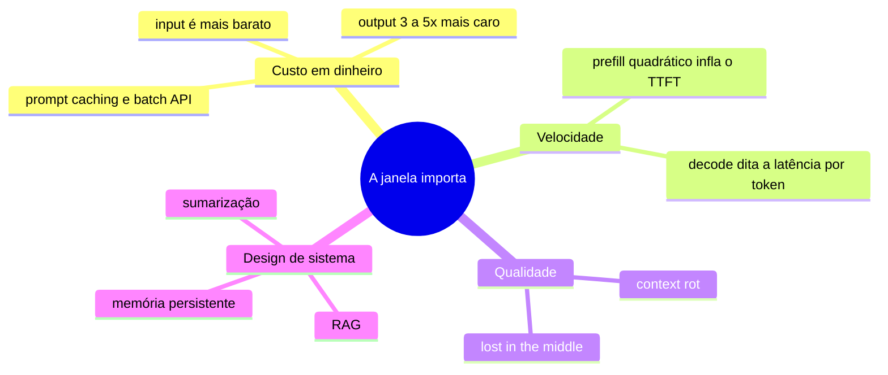
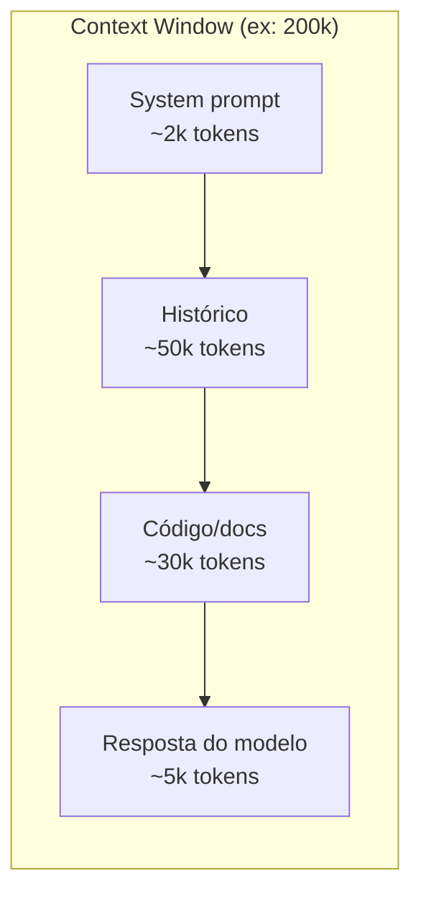
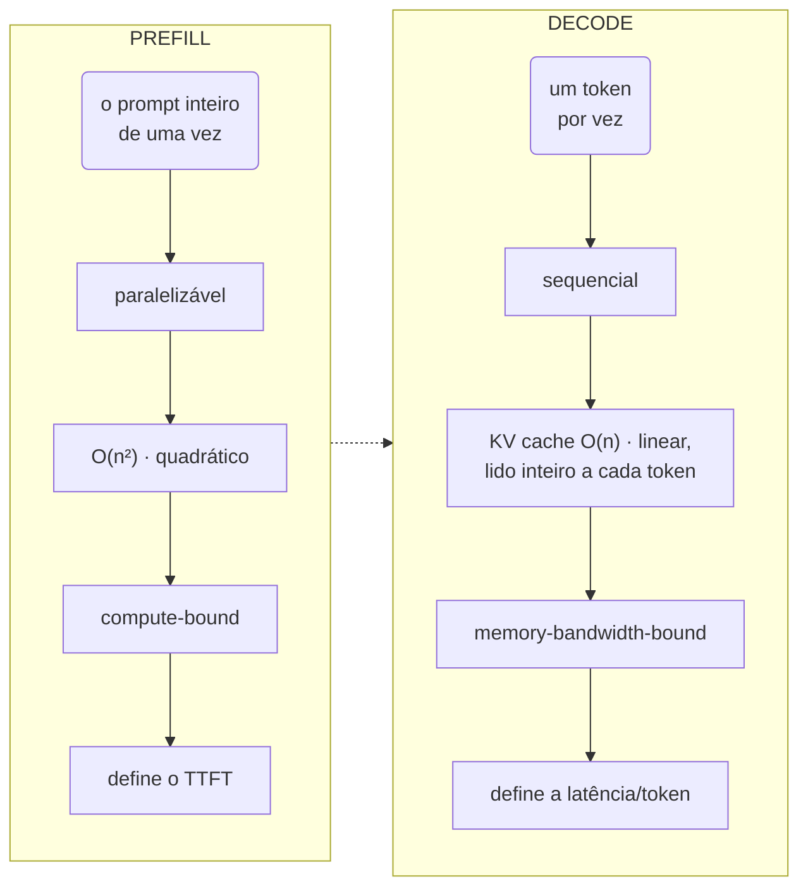
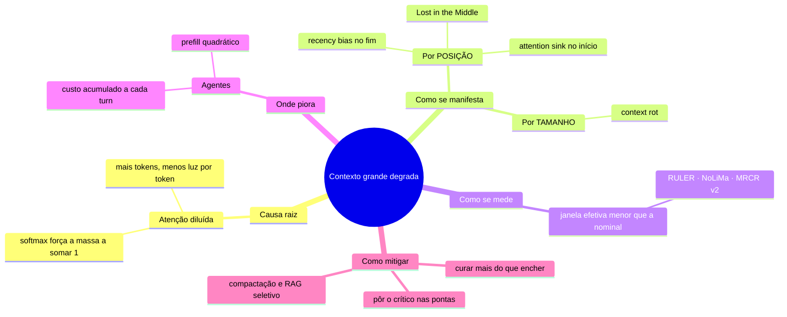
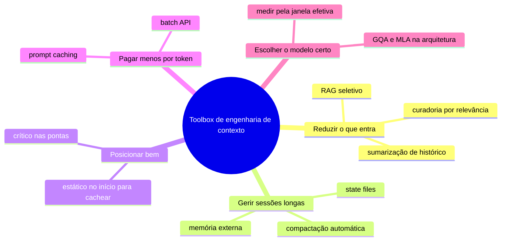
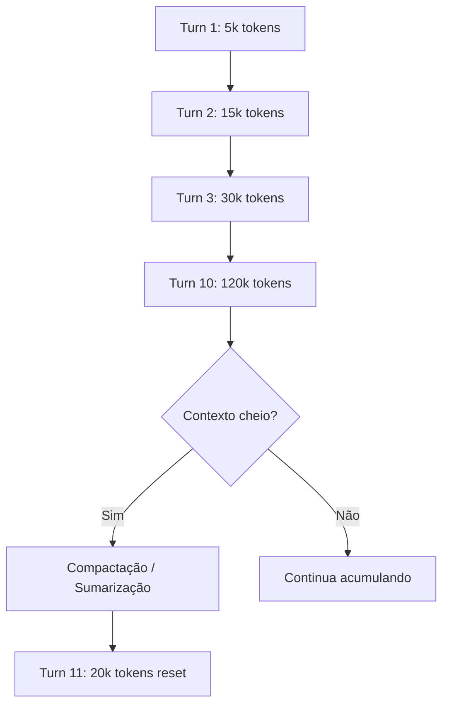

# A janela de contexto

> [!abstract] TL;DR
> A janela de contexto é o limite máximo de tokens que um LLM pode processar de uma vez — incluindo input (prompt, histórico, system instructions) E output (resposta gerada). Em 2026, janelas de 1M+ tokens são comuns nos modelos frontier, mas ter 1M de contexto não significa que o modelo é bom em usá-lo todo. Atenção degrada com distância, custo cresce linearmente, e contexto grande sem curadoria desperdiça dinheiro e qualidade.

## O que é
A **[[Dicionário de IA#Context window|janela de contexto]]** (context window) é a quantidade máxima de [[Dicionário de IA#Token|tokens]] que um [[Dicionário de IA#LLM (Large Language Model)|LLM]] consegue "ver" simultaneamente durante uma interação. Ela engloba **tudo**:

- System prompt e instruções
- Histórico de mensagens
- Documentos e código inseridos como contexto
- Tool definitions e respostas de ferramentas
- A resposta que o modelo está gerando

Quando o total excede o limite, dados antigos são **silenciosamente descartados** (truncamento) ou a API retorna um erro.
## Por que importa

1. **Custo direto** — cada token no contexto é cobrado como input token. Contexto de 100k tokens × $3/MTok = $0.30 por chamada
2. **Qualidade** — modelos perdem acurácia ao longo de janelas muito grandes. O fenômeno "lost in the middle" — informação no meio do contexto é a mais esquecida
3. **Velocidade** — TTFT (time-to-first-token) cresce com o tamanho do contexto porque a fase de prefill processa todos os input tokens
4. **Design de sistemas** — saber o tamanho do contexto determina se você precisa de RAG, memória persistente, ou sumarização

As quatro contas que a janela cobra, num mapa só:



## Como funciona
### Input tokens vs output tokens



| Tipo                                                        | Descrição                                               | Custo                                       |
| ----------------------------------------------------------- | ------------------------------------------------------- | ------------------------------------------- |
| **Input tokens**                                            | Tudo que você envia: prompt, histórico, contexto, tools | Mais barato (ex: $3/MTok no Claude Sonnet)  |
| **Output tokens**                                           | Tudo que o modelo gera: resposta, tool calls, reasoning | Mais caro (ex: $15/MTok no Claude Sonnet)   |
| **[[Dicionário de IA#Reasoning tokens\|Reasoning tokens]]** | Tokens internos de "pensamento" em modelos de reasoning | Cobrados como output, invisíveis ao usuário |

### O custo real do contexto: prefill, decode e KV cache
Por baixo do tampo, o tamanho do contexto cobra duas contas diferentes: a conta do **[[Dicionário de IA#prefill|Prefill]] (compute-bound)** e a conta da **Decode (memory-bound)**,

A fase de prefill, ou prefilling, é quando o modelo processa todo o contexto de uma vez antes de gerar o primeiro token de resposta, o [[Dicionário de IA#TTFT (time-to-first-token)|TTFT (time-to-first-token)]]. Pense assim: você manda um prompt gigante com documentos, código, histórico de conversa — o modelo lê tudo isso, constrói uma representação interna chamada de cache de atenção, e só depois começa a gerar tokens de resposta.

Esse processamento do contexto todo é caro computacionalmente porque a atenção — o mecanismo que permite o modelo entender relações entre tokens — precisa computar interações entre todos os tokens. Cada token precisa "olhar" para cada outro token, então quanto mais tokens no contexto, mais operações matemáticas precisam acontecer. Se você tem dez mil tokens no contexto, a atenção calcula relações de dez mil vezes dez mil. Portanto, o custo de atenção cresce **quadraticamente** com o número de tokens; é o que infla o [[Dicionário de IA#TTFT (time-to-first-token)|TTFT]] em prompts longos.

Depois disso vem o **Decode** — geração token a token. A fase de decode é quando o modelo gera tokens um por um, sequencialmente. Depois que terminou o prefill e tem o cache de atenção montado, o modelo pega esse cache e começa: gera o primeiro token, depois o segundo, depois o terceiro, e assim vai até terminar a resposta.

O gargalo aqui é o **[[Dicionário de IA#KV cache|KV cache]]**: estrutura na VRAM que guarda os vetores K/V de cada token já visto. 

> [!Info] O que é o KV cache.
  Lembra que na atenção cada token precisa "olhar" para todos os tokens anteriores? Para isso, cada token gera dois vetores: o K (key) e o V (value). Em vez de recalcular esses vetores de todos os tokens passados a cada novo token gerado, o modelo guarda eles prontos na VRAM. Esse armazenamento é o KV cache. É memória pura: "já calculei as keys e values desses mil tokens, deixa guardado aqui que vou reusar".

> [!info] Por que é o gargalo? 
> Porque a geração de tokens é sequencial. Você não consegue gerar o décimo token sem antes gerar o nono — são passos que precisam acontecer um após o outro. Na fase de prefill, o processamento era paralelizável, a GPU consegue fazer muita coisa de uma vez. Na decodificação, não. Cada passo depende do anterior. Portanto, o KV cache cresce **linearmente** com o contexto. Porém, a banda de memória da GPU é finita, logo é o [[Dicionário de IA#memory bandwidth bottleneck|gargalo de banda de memória]] que limita o throughput, não o compute.

> [!info] Por que cresce linearmente?
> Cada token novo adiciona um par K/V ao cache. Mil tokens, mil pares. Dois mil tokens, dois mil pares. Cresce em linha reta com o contexto — diferente do prefill, que era quadrático. Isso é importante: o cache em si não explode, ele cresce de forma comportada.
> 
> Agora o pulo do gato: o gargalo mudou de lugar. No prefill, o gargalo era compute — fazer as contas da atenção quadrática. No decode, o gargalo não é mais conta, é movimentação de dados. Para gerar cada token, a GPU precisa ler o KV cache inteiro da VRAM. Todo ele. A cada token.
> 
> Por que isso é o problema. A GPU tem uma quantidade absurda de poder de cálculo (compute), mas a velocidade com que ela lê dados da memória — a memory bandwidth, banda de memória — é limitada. No decode você está gerando um token de cada vez, então tem pouca conta para fazer, mas precisa varrer o cache todo da memória a cada passo. A GPU fica ociosa esperando os dados chegarem da VRAM em vez de estar calculando. É como ter um chef rapidíssimo, mas que precisa atravessar o depósito inteiro para pegar cada ingrediente — o gargalo não é a velocidade dele cortando, é a caminhada até a despensa.

E tem mais: cada novo token que você gera precisa de operações de atenção também, mas agora contra o cache que já existe. Então não é exatamente linear, mas é muito mais barato que o prefill porque você já tem o cache pronto. O verdadeiro gargalo é que a latência fica alta — demora muito tempo gerando token por token, mesmo que cada token individualmente seja rápido. É por isso que modelos rápidos como o 4o mini conseguem ser tão eficientes: eles otimizam essa fase de decode pesadamente.

Por isso é o gargalo de banda de memória que limita o throughput, não o compute. Quanto maior o contexto, maior o cache, mais dados para ler por token, mais lenta fica a geração. É exatamente o que torna o decode o gargalo de latência que comentamos antes.

Faz sentido o encadeamento? Prefill = limitado por compute (quadrático); decode = limitado por banda de memória (cache linear, mas lido inteiro a cada token).

> [!info]- Como o KV cache linear é domado na arquitetura
> O crescimento linear não conta a história toda: a *constante* dessa reta foi atacada no nível da **arquitetura**. **MQA** (Multi-Query Attention) faz todas as query heads compartilharem um único par K/V; **[[Dicionário de IA#GQA (Grouped-Query Attention)|GQA]]** usa grupos intermediários, cortando o KV cache em até ~8× (≈90% vs multi-head) com perda de qualidade quase nula e ~30–40% menos latência; **MLA** (Multi-Head Latent Attention, da DeepSeek) vai além, comprimindo K/V numa representação latente de baixo rank. É justamente isso que torna janelas de 1M economicamente viáveis — sem GQA/MLA, o KV cache de contexto longo estouraria a VRAM.

Por isso modelos de 1M+ não são só caros em dinheiro: são caros em VRAM e, em latência, pagam um pedágio quadrático no prefill que nenhum truque de **prompt** elimina. A ressalva mora na palavra *prompt*: na camada de **serving** o pedágio é parcialmente mitigável — *chunked prefill* fatia o processamento para não travar requests de decode concorrentes, *prefill esparso* explora padrões de atenção para pular blocos, e o *prompt caching* elimina o reprocessamento de prefixos repetidos. O que nenhuma técnica na camada de prompt muda é a complexidade quadrática de base.

Resumindo o contraste das duas fases num relance:



### Janelas de contexto em 2026

| Modelo            | Context window   | Output máximo | Nota                                    |
| ----------------- | ---------------- | ------------- | --------------------------------------- |
| GPT-5.4           | ~1.1M tokens     | ~64k tokens   | —                                       |
| Claude Opus 4.6   | 1M tokens        | 128k tokens   | Maior output do mercado                 |
| Claude Sonnet 4.6 | 200k tokens      | 64k tokens    | Custo-benefício para código             |
| Gemini 3.1 Pro    | 1M–2M tokens     | 64k tokens    | Suporte experimental a 2M               |
| DeepSeek V4       | 128k–163k tokens | 32k tokens    | Menor contexto, mas mais barato         |
| Qwen 3.6          | 1M tokens        | 64k tokens    | Foco em agentes                         |
| Llama 4 Scout     | 10M tokens       | —             | MoE com 16 experts, janela experimental |

> [!info] Pricing tier acima de 200k (legacy)
> Modelos antigos da Anthropic (Sonnet 4.5 e anteriores) cobravam tarifa **long-context** para prompts >200k input: ~$6/MTok input e $22.50/MTok output, contra $3/$15 da faixa padrão. Opus 4.6 e Sonnet 4.6 (e Opus 4.7) entregam 1M **no preço base** desde outubro de 2025 — o multiplicador 2x foi removido. Pegadinha: no tier legacy, cobra-se **tudo** no preço premium, não só o excedente — um prompt de 201k input custa o dobro do de 199k.

## Por que contextos grandes degradam a performance
> [!warning] Distinção crítica
> Ter 1M de contexto **não** é a mesma coisa que ter 1M de "memória de trabalho efetiva". 

> [!abstract] Ideia central 
> Aumentar a janela de contexto não é "de graça". Mesmo quando o modelo _cabe_ tudo na janela, a qualidade do que ele extrai do contexto cai conforme o contexto cresce — e cai de formas previsíveis, com posição e tamanho importando tanto quanto o conteúdo.

O mapa abaixo organiza a seção: separa a **causa raiz** dos **sintomas** (por posição e por tamanho), de como se **mede** e de como se **mitiga**.



### "[[Dicionário de IA#Lost in the Middle|Lost in the middle]]" e [[Dicionário de IA#context rot|context rot]]

O ponto de partida é um achado da **Stanford (Liu et al., 2023)**, no paper _"Lost in the Middle"_. Eles colocaram a mesma informação relevante em diferentes posições de um contexto longo e mediram o quanto o modelo conseguia recuperar. O resultado foi o famoso **padrão em U**:

- **Início do contexto** → recall alto (efeito de _primacy_)
- **Meio do contexto** → recall despenca
- **Final do contexto** → recall alto (efeito de _recency_)

> [!note] O que isso significa na prática 
> Se você enfia a informação crítica no meio de um prompt gigante, o modelo tende a "esquecer" dela — mesmo que ela esteja literalmente ali, dentro da janela. A informação não some; o modelo simplesmente presta menos atenção nela. A receita prática que sai disso: coloque o que mais importa **no começo ou no fim** do contexto.

A **Chroma Research (2025)** foi além. Testando **18 modelos frontier**, eles mostraram que a degradação não depende só da _posição_ — depende do _tamanho total_ do contexto. Cunharam o termo **context rot** (apodrecimento de contexto): a qualidade cai de forma mensurável **bem antes** de você chegar no limite anunciado.

> [!warning] O limite anunciado é marketing, não garantia Um modelo vendido com janela de 200k tokens pode já estar degradando perceptivelmente lá pelos **50k**. O número grande na ficha técnica diz onde o modelo _para de funcionar_, não onde ele _funciona bem_. São coisas diferentes.

E tem uma nuance importante sobre quando cada padrão domina:

> [!example] Posição × ocupação da janela
> 
> - **Contexto < 50% cheio** → vale o **padrão em U** (início e fim bons, meio ruim).
> - **Contexto > 50% cheio** → o **[[Dicionário de IA#recency bias|recency bias]]** assume o controle: o modelo passa a favorecer fortemente o **final**, depois o meio, e tende a **ignorar o início**.
> 
> Ou seja: à medida que você enche a janela, o "início privilegiado" do padrão em U vai perdendo força. O que era uma vantagem (informação no começo) vira ponto cego.

#### Por que o **[[Dicionário de IA#recency bias|recency bias]]** acontece?
O recency bias não vem de um único mecanismo; ele emerge de como o transformer é treinado e estruturado:
##### 1. O objetivo de treino premia o local
LLMs são treinados pra prever o próximo token. E o melhor preditor do próximo token quase sempre é... o token imediatamente anterior. Numa frase, a palavra seguinte depende muito mais das últimas 5 palavras do que do parágrafo de 3 páginas atrás. O modelo aprende, por bilhões de exemplos, que proximidade = relevância na maioria dos casos. Isso vira um prior embutido nos pesos: na dúvida, olhe pro que está perto do fim.
##### 2. A codificação posicional decai com a distância
O modelo precisa de algum mecanismo pra saber onde cada token está. O esquema dominante hoje é o [[Dicionário de IA#RoPE (Rotary Position Embedding)|RoPE]], que aplica rotações aos vetores de query/key proporcionais à posição. Uma propriedade do RoPE (e de variantes) é o decaimento de longo alcance: o produto interno entre tokens distantes tende a enfraquecer conforme a separação cresce. Resultado prático — tokens próximos da posição atual têm "afinidade" posicional maior por construção.
##### 3. A geração autorregressiva: o fim é o ponto de partida
Quando o modelo gera o token N, ele está literalmente na posição N. A query que ele usa pra consultar a [[Dicionário de IA#attention|attention]] é a do último token. Então o contexto recente é o vizinho imediato daquilo que está sendo computado agora — espacialmente e semanticamente o ponto de ancoragem da próxima decisão.

##### 4. O "fim" também é favorecido por outro motivo (o lado U)
Aqui vale separar duas coisas:

- Recency bias propriamente dito = favorecimento do fim → os 3 mecanismos acima.
- O começo também é favorecido (daí a curva em U do [[Dicionário de IA#Lost in the Middle|Lost in the Middle]]). Isso vem de outra fonte: [[Dicionário de IA#attention sink|attention sinks.]] Os primeiros tokens da sequência acumulam uma fração desproporcional da massa de atenção — funcionam como um "ralo" onde as cabeças de atenção despejam peso quando não têm nada específico pra olhar. Some isso ao recency bias e você tem as duas pontas fortes, meio fraco.

Por que isso importa na prática

É exatamente por isso que a engenharia de contexto recomenda:  
- conteúdo estático no início (system prompt, schemas) — pega o attention sink e viabiliza [[Dicionário de IA#Prompt caching|prompt caching]];
- a tarefa atual e as restrições críticas no fim — pega o recency bias;
- nunca enterrar o que importa no meio — é onde a atenção é mais fraca.

> [!question]- Qual a diferença entre *Lost in the Middle*, *recency bias* e *attention sink*?
> Os três falam de **posição no contexto**, mas em níveis diferentes: um é o *sintoma*, dois são as *causas*. Lado a lado:
>
> | | [[Dicionário de IA#Lost in the Middle\|Lost in the Middle]] | [[Dicionário de IA#recency bias\|recency bias]] | [[Dicionário de IA#attention sink\|attention sink]] |
> |---|---|---|---|
> | **O que é** | o *sintoma* observável (a curva em U inteira) | *causa* que favorece o **fim** | *causa* que favorece o **início** |
> | **Nível** | comportamento mensurável (de fora pra dentro) | viés mecanicista (de dentro pra fora) | viés mecanicista (de dentro pra fora) |
> | **Cobre** | as duas pontas **+ o vale** | só o fim | só o início |
> | **Por quê** | — (é o que se mede, não a causa) | treino premia o local + [[Dicionário de IA#RoPE (Rotary Position Embedding)\|RoPE]] decai com a distância | o softmax precisa "escoar" massa de atenção em algum lugar, e os primeiros tokens viram o ralo |
> | **Origem** | Liu et al. (2023) | — | Xiao et al. (2023), *StreamingLLM* |
>
> ```
>         acurácia
>           ▲
>           │ █                        █
>           │ █                        █
>           │  █                      █
>           │   █                    █
>           │     █      vale      █
>           │        █ ________ █
>           └──────────────────────────► posição
>             ↑           ↑           ↑
>          início        meio        fim
>        (attention    (negligen-   (recency
>          sink)        ciado)       bias)
>           └──────────┬────────────┘
>             Lost in the Middle
>             (a curva em U inteira)
> ```
>
> **Em uma frase:** *Lost in the Middle* é o **sintoma** (a curva em U que você mede); *recency bias* e *attention sink* são as **causas** — um puxa o fim, o outro o início, e o meio fica abandonado. Na prática: **começo e fim são privilegiados** — nunca enterre o que importa no meio (e lembre que o começo, além de bom, é [[Dicionário de IA#Prompt caching\|cacheável]]).
### [[Dicionário de IA#attention|Atenção]] diluída — a causa de fundo

Por que tudo isso acontece? A raiz está em como a atenção funciona. Para cada token gerado, o modelo distribui uma "massa de atenção" **fixa** entre todos os tokens do contexto (é a normalização do softmax — a soma sempre dá 1).

> [!info] A analogia do holofote Imagine um holofote de brilho fixo iluminando um palco. Com 5 atores no palco, cada um recebe bastante luz. Com 500 atores, a mesma quantidade de luz se espalha — cada ator fica mais escuro. A atenção é esse holofote: quanto mais tokens no contexto, **menos "luz" sobra para cada pedaço individual**. A resolução com que o modelo enxerga cada trecho cai.

Isso conecta diretamente com o "lost in the middle": não é que o modelo _decida_ ignorar o meio — é que, com a atenção espalhada por milhares de tokens, os trechos que não recebem reforço posicional (início/fim) simplesmente ficam abaixo do limiar de relevância.
### Custo acumulado — o problema específico de agentes
Até aqui falamos de _um_ contexto grande. Em **agentes**, o problema é dinâmico: o contexto **cresce a cada turn**. Cada ferramenta chamada, cada resultado retornado, cada raciocínio intermediário vai sendo empilhado no contexto da próxima iteração.

> [!danger] A bola de neve 
> Uma sessão de **50 turns** pode facilmente ultrapassar **200k tokens** de contexto acumulado. E aqui dois problemas se somam:
> 
> 1. **Custo de processamento** — lembre-se que o prefill cresce de forma quadrática com o tamanho do contexto. Contexto maior a cada turn = custo crescendo de forma acelerada.
> 2. **Context rot** — quanto maior o acúmulo, mais o modelo sofre da degradação descrita acima. O agente fica literalmente mais "burro" no turn 50 do que estava no turn 5, mesmo tendo _mais_ informação.

> [!tip] Por que isso justifica engenharia de contexto 
> É exatamente por causa desses dois fatores combinados que técnicas como **compactação de contexto, sumarização de histórico, RAG seletivo e gestão de memória** não são luxo — são o que mantém um agente funcional e barato ao longo de uma sessão longa. Encher a janela "porque cabe" é o caminho mais rápido para um agente caro e impreciso.

O catálogo de respostas — o que fazer, agrupado por objetivo:



---

> [!summary] Resumo em uma linha de cada conceito
> 
> - **Lost in the middle** → posição importa: meio do contexto é ponto cego.
> - **Recency bias** → quando a janela passa de ~50%, o modelo favorece o fim e abandona o início.
> - **Context rot** → tamanho importa: degrada antes do limite anunciado.
> - **Atenção diluída** → a causa raiz: massa de atenção fixa espalhada por mais tokens.
> - **Custo acumulado** → em agentes, contexto cresce a cada turn, somando custo quadrático e degradação.
### Janela nominal vs janela efetiva

Em 2026, a maioria dos modelos frontier anuncia 1M+ de contexto, mas benchmarks como **RULER** (NVIDIA), **NoLiMa** e **MRCR v2** mostram que a *janela efetiva* — onde o modelo realmente mantém acurácia — costuma ser **30–60 pontos** menor que a nominal em tarefas de recall multi-fato. Casos extremos:

- **Granite 3.1-8B**: 128k nominal, ~32k de [[Dicionário de IA#effective context length|effective context length]] (Red Hat, 2025).
- **Gemini 2.5 Pro**: 100% de recall até ~530k, queda a 99.7% em 1M (single-needle); cai mais em multi-needle.

Regra prática: a partir de ~25–50% da janela nominal, prepare-se pra degradação mensurável, especialmente em tarefas com várias âncoras de informação. "1M de contexto" virou marketing — engenharia séria mede effective context length pra carga real, não decora o número da spec sheet.
### Como modelos estendem contexto além do [[Dicionário de IA#pretraining|pretraining]]

Modelos não nascem com 1M de contexto: a maioria é pretrained em 4k–32k e depois **estendida** por técnicas que ajustam as **[[Dicionário de IA#position embeddings|position embeddings]]**:

- **[[Dicionário de IA#RoPE (Rotary Position Embedding)|RoPE]]** (Rotary Position Embedding) — codifica posição via rotação de vetores; é a base de Llama, Qwen, Mistral.
- **[[Dicionário de IA#YaRN|YaRN]]** (Yet another RoPE extensioN) — escala frequências do RoPE + ajuste de temperatura da atenção; estende contexto 2–4x com **10x menos tokens de treino** que métodos anteriores.
- **NTK-aware / Dynamic NTK** — interpolação suave das frequências, evitando colapso no extremo da janela.

A consequência prática: um modelo "1M tokens" pode ter sido pretrained em 32k e estendido via YaRN — funciona, mas a qualidade no fim da janela é uma função de quão bem a extensão foi treinada, não da janela nominal.

### O ciclo do contexto em agentes



Ferramentas como Claude Code e Cursor implementam **[[Dicionário de IA#context compaction|compactação automática]]** — quando o contexto se aproxima do limite, resumem o histórico e reiniciam com um contexto menor mas denso.

## Quando usar / quando não usar

| Cenário                            | Abordagem                                                                        | Contexto necessário      |
| ---------------------------------- | -------------------------------------------------------------------------------- | ------------------------ |
| Chat simples                       | Janela padrão                                                                    | <10k tokens              |
| Edição multi-arquivo               | Context com arquivos relevantes                                                  | 50k–200k tokens          |
| Análise de codebase inteiro        | [[Dicionário de IA#RAG (Retrieval-Augmented Generation)\|RAG]] + semantic search | Não cabe — use retrieval |
| Agente autônomo (longa sessão)     | Compactação + state files                                                        | Gerenciado ativamente    |
| Processamento de documentos longos | Modelo com 1M+ contexto                                                          | 200k–1M tokens           |

## Armadilhas

- **"Mais contexto = melhor resposta"** — falso. Contexto irrelevante dilui a atenção do modelo e aumenta custo sem melhorar qualidade. Curadoria > quantidade.
- **Ignorar o custo acumulado** — uma sessão de agente que roda 100 turns pode custar $10+ só em input tokens se o contexto não for gerenciado.
- **Confiar no truncamento silencioso** — quando o contexto excede o limite, o que é cortado depende da implementação. Pode ser justamente a informação mais importante.
- **"O modelo lembra tudo"** — não lembra. Cada chamada de API é stateless. O "histórico" é reenviado a cada turn, consumindo tokens de input.
- **Não distinguir input de output tokens** — output é 3-5x mais caro. Um modelo verboso que gera respostas longas custa muito mais que um conciso.

## Veja também

- [[02 - Tokens e tokenização]] — a unidade que mede a janela
- [[04 - Atenção e o mecanismo transformer]] — o motor que sofre quando a janela cresce
- [[12 - Pricing de APIs — como calcular custos]] — onde o custo do contexto vira fatura
- [[13 - Prompt caching e otimizações de API]] — como reduzir custo de contexto repetido
- [[14 - Streaming, batching e latência]] — como o tamanho do contexto afeta performance

## Referências

- **Liu et al.** — [*Lost in the Middle: How Language Models Use Long Contexts*](https://arxiv.org/abs/2307.03172) (Stanford, 2023). O paper que documentou o padrão U de atenção em contextos longos.
- **Chroma Research** — [*Context Rot: How Increasing Input Tokens Impacts LLM Performance*](https://research.trychroma.com/context-rot) (2025). Estudo com 18 modelos frontier mostrando degradação bem antes do limite nominal e mudança do padrão U para recency bias.
- **NVIDIA** — [*RULER: What's the Real Context Size of Your Long-Context Language Models?*](https://github.com/NVIDIA/RULER) (2024). Benchmark sintético que expôs o gap entre janela nominal e janela efetiva.
- **Adobe Research / Modarressi et al.** — [*NoLiMa: Long-Context Evaluation Beyond Literal Matching*](https://arxiv.org/abs/2502.05167) (ICML 2025). Benchmark que remove a sobreposição lexical entre needle e haystack; a 32k, 10 de 12 modelos caem abaixo de 50% do baseline curto.
- **Google DeepMind** — [*MRCR v2 — Multi-Round Coreference Resolution*](https://github.com/google-deepmind/eval_hub/tree/master/eval_hub/mrcr_v2). Benchmark sintético de recall multi-needle para medir generalização de comprimento em contexto longo.
- **Red Hat** — [*Unlocking the Effective Context Length: Benchmarking the Granite-3.1-8b Model*](https://www.redhat.com/en/blog/unlocking-effective-context-length-benchmarking-granite-31-8b-model) (2025). Granite-3.1-8B tem 128k nominal mas mantém performance confiável só até ~32k.
- **Peng et al.** — [*YaRN: Efficient Context Window Extension of Large Language Models*](https://arxiv.org/abs/2309.00071) (2023). Método de extensão de contexto via escala de frequências RoPE + temperatura da atenção.
- **Morph** — [*KV Cache Explained: Why It's the Most Important Optimization in LLM Inference*](https://www.morphllm.com/kv-cache-explained). Mecânica de prefill, decode e KV cache em inferência de LLMs.
- **Xiao et al.** — [*Efficient Streaming Language Models with Attention Sinks*](https://arxiv.org/abs/2309.17453) (ICLR 2024). Cunhou o conceito de *attention sink*: preservar os primeiros tokens recupera a performance em janelas deslizantes.
- **The New Stack** — [*Anthropic makes a pricing change that matters for Claude's longest prompts*](https://thenewstack.io/claude-million-token-pricing/) (2025). Mudança do tier 200k em modelos Claude 4.6.
- **Anthropic** — *Claude Model Card* (2026). Especificações de context window e output limits.
- **OpenAI** — *API Reference — Models* (2026). Documentação de context windows por modelo.
- **Google DeepMind** — *Gemini Technical Report* (2026). Detalhes da arquitetura de contexto longo.
- **General Compute** — [*Multi-Query and Grouped-Query Attention: Shrinking the KV Cache*](https://www.generalcompute.com/blog/multi-query-grouped-query-attention). Redução do KV cache no nível arquitetural — MQA, GQA e MLA.
- **elvex** — [*Reduce LLM Prefill Latency: Multi-Million Token Optimization*](https://www.elvex.com/blog/reduce-llm-prefill-latency-multi-million-token-inputs). Mitigações de prefill na camada de serving — chunked prefill e prefill esparso.
