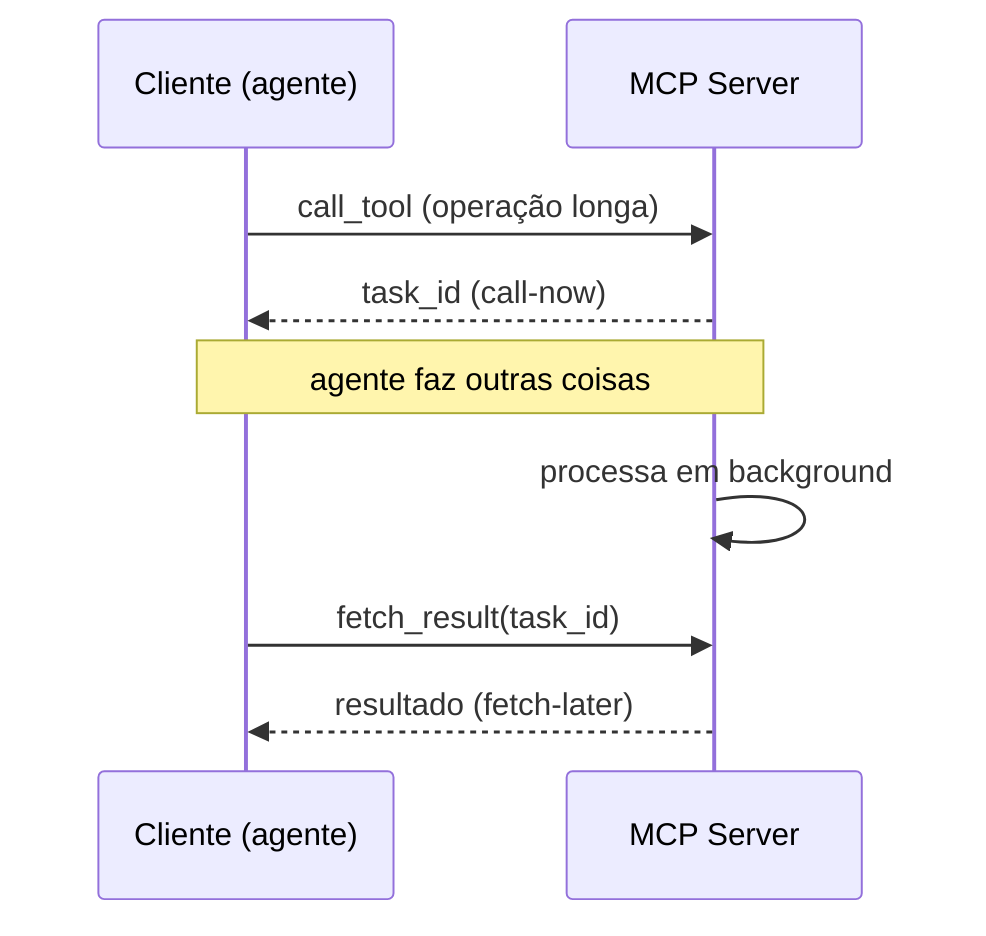

# Ecossistema 2026 — clients e integrações

> [!abstract] TL;DR
> [[Dicionário de IA#MCP (Model Context Protocol)|MCP]] virou padrão **inter-vendor** em 2025-2026. Suporte nativo: Claude Desktop, [[Dicionário de IA#Claude Code|Claude Code]], Cursor, Windsurf, Cline, Aider, Zed, Copilot Studio (Microsoft), ChatGPT Desktop (OpenAI), Codex, Gemini Code Assist (Google). Ecossistema de servers passa de 3000+ entradas no Awesome MCP Servers. Hosting managed disponível (Smithery, Anthropic-hosted beta). Em 2026, MCP é **infrastructure-grade** — não experimento.

## Os clients que falam MCP

### Anthropic (criadora)

| Client | Tipo | Suporte |
|---|---|---|
| **Claude Desktop** | App desktop | Nativo desde lançamento |
| **Claude Code** | CLI | Nativo |
| **Claude.ai (web)** | Web | Limitado (alguns servers via OAuth) |

### OpenAI

| Client | Tipo | Suporte |
|---|---|---|
| **ChatGPT Desktop** | App | Nativo (2025) |
| **Codex CLI** | CLI | Nativo |
| **OpenAI Assistants API** | API | Beta |

### Microsoft / GitHub

| Client | Tipo | Suporte |
|---|---|---|
| **GitHub Copilot Chat** | IDE | Nativo |
| **Copilot Studio** | Low-code platform | Nativo (workflows) |
| **Visual Studio Code** | IDE (via Copilot) | Nativo |

### Google

| Client | Tipo | Suporte |
|---|---|---|
| **Gemini Code Assist** | IDE | Nativo |
| **Gemini CLI** | CLI | Nativo |

### Comunidade / outros

| Client | Tipo |
|---|---|
| **Cursor** | IDE — early adopter, suporte excelente |
| **Windsurf** | IDE |
| **Cline** | VS Code extension |
| **Aider** | CLI |
| **Zed** | IDE (Rust) |
| **Warp** | Terminal |
| **RooCode** | VS Code extension |
| **Antigravity Kit** | Custom |

## A categorização Awesome MCP Servers

Em maio 2026, Awesome MCP Servers tem **3000+ entradas** organizadas em ~40 categorias. Top categorias por adoção:

```
Top 10 categorias (popularidade):
1. Filesystem & Git           (50+ servers)
2. Databases                  (80+ servers)
3. Dev tools (GitHub, etc)    (100+ servers)
4. Browser automation         (30+ servers)
5. Communication              (60+ servers)
6. Cloud (AWS, GCP, K8s)      (80+ servers)
7. Search & web               (40+ servers)
8. AI/ML (HuggingFace etc)    (50+ servers)
9. Productivity               (70+ servers)
10. Specialized domains       (varia)
```

## Marketplaces e discovery

### Awesome MCP Servers (github.com/punkpeye/awesome-mcp-servers)

Lista curated. Git commits + stars revelam manutenção. **Source primário** para descoberta.

### mcp.so

Marketplace web com:
- Search por categoria
- Reviews de users
- Install instructions copy-paste
- Version tracking

### smithery.ai

Discovery + install via CLI:

```bash
smithery search github
smithery install github
# Configura automaticamente no client
```

Vantagem: gerenciamento centralizado de versões.

### glama.ai/mcp/servers

Browse + monitoring + uptime tracking. Útil para servers HTTP+SSE em produção (saber se um server público está down).

## Hosting managed

### Smithery (smithery.ai)

Hosted MCP — você não roda server, smithery roda. Conecta via HTTPS. Free tier disponível.

```json
{
  "mcpServers": {
    "github-via-smithery": {
      "url": "https://server.smithery.ai/github",
      "headers": { "Authorization": "Bearer ${SMITHERY_TOKEN}" }
    }
  }
}
```

### Anthropic-hosted MCP (beta)

Anthropic está oferecendo MCP hosting em beta para servers oficiais.

### Cloudflare Workers MCP

Deploy de [[Dicionário de IA#MCP server|MCP server]] em CF Workers — cold start <50ms, free tier generoso.

## Standardization e governance

> [!info] Onde MCP está indo (2026)
> - **Spec versioning:** semver com RFC process
> - **OAuth 2.1** virou padrão para auth em HTTP+SSE
> - **MCP Foundation** (estilo Linux Foundation) discutida — ainda não formalizada
> - **Capabilities expansion:** sampling, elicitation, roots — recursos novos com backward compat

## Integrações com plataformas

### LangChain / LangGraph

```python
from langchain_mcp_adapters import MCPToolAdapter

mcp_tools = MCPToolAdapter.from_stdio(
    command=["npx", "-y", "@modelcontextprotocol/server-postgres", "..."]
).get_tools()

agent = create_agent(llm, mcp_tools)
```

### LlamaIndex

```python
from llama_index.tools.mcp import MCPToolSpec

mcp_spec = MCPToolSpec(server_url="http://localhost:8000/sse")
tools = mcp_spec.to_tool_list()
```

### Vercel AI SDK

```typescript
import { mcp } from "@vercel/ai-mcp";
const tools = await mcp.tools({ server: "..." });
```

Frameworks adaptam MCP em sua forma idiomática. Resultado: **escrever 1 server, qualquer framework consume**.

## Tendências 2026

### 1. Convergência com Agent SDKs

OpenAI Agents SDK, Anthropic Agent SDK, Google ADK — todos suportam MCP nativamente. Server vira unidade compartilhada.

### 2. Server marketplaces consolidam

Em 2024-2025: vários marketplaces fragmentados. Em 2026: smithery.ai e mcp.so emergem como dominantes.

### 3. Specialized servers para verticais

- **Legal MCP servers** (jurisprudência, contratos)
- **Medical MCP** (records, guidelines)
- **Financial MCP** (Bloomberg, market data)

Cada vertical com regulações próprias e auth complex.

### 4. MCP em IoT/edge

Edge devices (Raspberry Pi, smart home) expondo capabilities via MCP. Casa inteligente como MCP server.

### 5. WebMCP

Browser-based clients consumindo MCP servers. JavaScript SDK + WebSocket transport.

## Maturação do protocolo (2026)

Adoção em larga escala vira pressão de produção. As tabelas acima contam *quem* fala MCP; esta seção conta *como o protocolo está amadurecendo* sob esse peso. Dois marcos de 2026 importam: uma primitiva nova para trabalho assíncrono e um padrão de uso que economiza contexto. Ambos são camada de Protocols do [[03-Dominios/IA/Anatomia de Agents/11 - Harness engineering — a terceira camada|harness engineering]] — o MCP é onde o harness expõe ferramentas ao modelo.

> [!note] Contexto: 1 ano de MCP
> Em **25-nov-2025** o MCP completou um ano. Isso não é trivia: o protocolo saiu de "experimento da Anthropic" para padrão inter-vendor em doze meses. O que vem a seguir não é mais sobre *adotar* MCP — é sobre fechar as arestas que só aparecem quando milhares de servers rodam em produção.

### MCP Tasks (SEP-1686) — call-now, fetch-later

E quando uma tool demora minutos — um build, um scan, um job de dados? O modelo request/response padrão do MCP segura a conversa esperando a resposta. **MCP Tasks** (proposta SEP-1686) resolve isso com uma primitiva nova de comunicação **assíncrona** entre agentes: você dispara a operação agora e busca o resultado depois.

O padrão é literalmente *"call-now, fetch-later"*. O cliente chama a tool, recebe de volta um identificador de task em vez do resultado, e segue tocando outras coisas. Quando o trabalho termina, ele busca (ou é notificado). Isso também abre caminho para notificação **multi-agente**: um agente dispara, outro consome.



> [!warning] Status ambíguo — leia a fonte certa
> A GitHub issue do SEP-1686 está marcada como **"Accepted"**. Mas o roadmap autoritativo de 2026 do MCP chama Tasks de **feature experimental** e lista os gaps de lifecycle que ainda faltam fechar — citando textualmente *"retry semantics when a task fails transiently, and expiry policies for how long results are retained after completion."* Em produção, trate como experimental: o que acontece quando a task falha por causa transiente, e por quanto tempo o resultado fica guardado, ainda não está cravado.

### Code execution with MCP — chamar tools por código, não por contexto

Tem um custo escondido em ligar muitos servers: cada tool de cada server entra no contexto do modelo como definição. Dez servers viram milhares de tokens só de *descrições* antes de o agente fazer nada (o mesmo problema que a seção [[#1. Discovery overhead|Discovery overhead]] aponta).

Simon Willison documentou (4-nov-2025) um padrão que vira a chave: em vez de expor cada tool MCP diretamente ao modelo, o modelo **escreve código que chama as tools MCP**. As ferramentas viram uma API que o código consome, não cards no prompt.

Por que ajuda? Dois ganhos. Reduz o consumo de contexto — o modelo não carrega N definições de tool, carrega uma interface programática. E melhora **composição**: encadear, filtrar e iterar sobre chamadas vira código normal, não uma sequência de tool-calls manuais.

> [!tip] A regra de bolso
> Poucas tools → expor direto está ótimo. **Muitas** tools (dezenas, vários servers) → considere o padrão code-execution: o modelo orquestra via código e só as tools relevantes entram em jogo.

**Resumo:** em 2026 o MCP amadurece em duas frentes — Tasks (SEP-1686) traz assincronia "call-now, fetch-later" para operações longas e multi-agente (ainda experimental), e o padrão code-execution corta o custo de contexto quando há muitas tools.

## Casos comuns no mercado

### Caso 1 — Equipe interna com Internal API MCP

Empresa tem API internal complexa. Cria MCP server que expõe top 20 endpoints. Devs em Cursor/Claude Code falam com a API via natural language.

**Tool exemplo:** `query_ticket(ticket_id)` retorna dados estruturados.

### Caso 2 — Onboarding de docs com MCP

Docs corporativas em Notion/Confluence. MCP server faz search + read. Novos devs perguntam ao agent que cita docs com link.

### Caso 3 — Operações com aprovação humana

Devops MCP server com tools `restart_service`, `scale_deployment`, `rollback`. Cada tool requer aprovação humana (Slack approval) antes de executar. Audit log para compliance.

### Caso 4 — Vault de conhecimento pessoal (Codex Technomanticus)

Obsidian MCP server expondo notas do vault. Claude Code lê notas, sugere conexões, propõe novas notas. Acesso somente do owner.

## Limitations e desafios

### 1. Discovery overhead

Cliente carregando tools de 10 servers = list_tools × 10 + descrições. Pode aumentar context inicial em 5-10K tokens.

**Solução em 2026:** lazy discovery, capability negotiation.

### 2. Auth complexity

OAuth flow em CLI tools é UX ruim. Browser-based auth + token storage é fricção.

### 3. Versioning hell

Server v1 incompatível com client v3? Specs ajudam mas problemas existem.

### 4. Marketplace trust

Como saber se server "mcp-totally-safe-postgres" não é malicioso? Audit é responsabilidade do user.

## Métricas de adoção (2026)

| Métrica | Valor |
|---|---|
| Total servers no ecosystem | 3000+ |
| Top 10 servers — installs/mês | 100K-1M |
| Clients com suporte nativo | 15+ |
| % de coding agents com MCP | ~80% |
| Companies usando MCP em prod | 1000+ (Fortune 500) |

## Anti-patterns ao adotar

- **Instalar 20+ servers no mesmo client** — context rot na descoberta
- **Sem strategy de servers internal vs external** — supply chain confuso
- **Ignorar managed hosting** — operar tudo on-prem quando managed funciona
- **Não pin de versões** — auto-update introduzindo bugs
- **Adotar marketplace shady** — sem audit, virando supply chain attack

## Veja também

- [[01 - O que é MCP e por que importa]]
- [[04 - MCP servers oficiais e populares]]
- [[06 - MCP remoto — HTTP + SSE para times]]
- [[07 - Segurança em MCP]]
- [[Anatomia de Agents|07 - Frameworks 2026]]
- [[Agentes de Codificação]]

## Referências

- **Awesome MCP Servers** — *github.com/punkpeye/awesome-mcp-servers*
- **mcp.so** — marketplace
- **smithery.ai** — managed hosting
- **glama.ai/mcp** — discovery + monitoring
- **Anthropic** — *MCP ecosystem 2026 update* (blog)
- **Cloudflare** — *MCP on Workers* (developers.cloudflare.com)
- **MCP roadmap 2026** — [blog.modelcontextprotocol.io](https://blog.modelcontextprotocol.io/posts/2026-mcp-roadmap/) (2026). Roadmap autoritativo: chama Tasks (SEP-1686) de experimental e lista gaps de lifecycle (retry semantics, expiry policies).
- **Code execution with MCP (Simon Willison)** — [simonwillison.net](https://simonwillison.net/2025/Nov/4/code-execution-with-mcp/) (2025). Padrão de o modelo escrever código que chama tools MCP, reduzindo contexto e melhorando composição.
- **First MCP anniversary** — [blog.modelcontextprotocol.io](https://blog.modelcontextprotocol.io/posts/2025-11-25-first-mcp-anniversary/) (2025). MCP completa 1 ano (25-nov-2025); sinal de maturação do protocolo.
