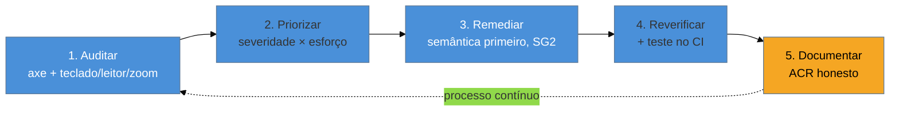

# Capstone: auditar e remediar um produto do zero

> [!abstract] TL;DR
> Este é o exercício que junta os quatro sub-galhos num único fluxo de trabalho real: pegar uma tela **inacessível**, **auditá-la** (SG3), **priorizar** os achados por severidade × esforço, **remediá-los** aplicando o que o SG2 ensinou, e **documentar** o resultado (SG4). O objetivo não é decorar mais nada — é ver o domínio inteiro operando junto sobre um caso concreto, do diagnóstico ao relatório. Ao fim, você tem o roteiro mental que aplica a qualquer produto que aterrissar na sua frente: o que olhar, em que ordem consertar, e como provar que consertou.

Chegamos ao fim. Você entende o ofício (SG1), sabe construir (SG2), sabe provar (SG3) e sabe sustentar e declarar (SG4). Falta ver tudo isso **funcionando junto** — porque na prática esses sub-galhos não são etapas separadas, são um único movimento contínuo. Vamos executá-lo sobre um caso.

## O cenário: uma tela de checkout inacessível

Imagine que você assumiu a manutenção de um produto e precisa avaliar a acessibilidade da tela mais crítica — o **checkout**. É um exemplo hipotético, mas cada problema abaixo é dos mais comuns do mundo real (os seis que concentram 96% das falhas, da nota 01). Eis o código que você encontra:

```html
<!-- A tela de checkout "pronta" que você herdou -->
<div class="header">
  <div class="logo" onclick="location='/'">🛒 LojaX</div>
</div>

<div class="checkout">
  <div class="titulo">Finalizar compra</div>

  <span>E-mail</span>
  <input type="text" class="campo" placeholder="E-mail">

  <span>Cartão</span>
  <input type="text" class="campo" placeholder="Número do cartão">

  <div class="opcoes">
    <div class="opcao selecionada" onclick="selecionar(this)">Cartão</div>
    <div class="opcao" onclick="selecionar(this)">Pix</div>
  </div>

  <div class="btn-pagar" onclick="pagar()">Pagar</div>
  <p class="erro" style="color:red; display:none">Erro no pagamento</p>
</div>
```

Para o olho, funciona. Vamos ver o que a auditoria revela.

## Passo 1 — Auditar (SG3)

Seguindo o método da nota 16: automático primeiro, depois manual.

**Passada automática (axe/Lighthouse).** Em segundos, ela aponta o mecânico:
- Inputs sem label associado (só `<span>` solto e placeholder).
- Provável falha de contraste no texto de erro vermelho e nos placeholders.
- `<html>` sem `lang` (fora do trecho, mas o axe pega).

**Passada manual (as três da nota 15).** É aqui que o grave aparece:
- **Só teclado:** o "logo", as "opções" e o botão "Pagar" são `<div onclick>` — **fora do tab order**. Você literalmente **não consegue finalizar a compra sem mouse**. Bloqueio total.
- **Leitor de tela:** os campos anunciam "campo de edição, em branco" (sem nome, nota 02). As opções de pagamento não se anunciam como selecionáveis. O botão "Pagar" nem é alcançado.
- **Zoom 400%:** (a verificar no CSS real) — layout com larguras fixas costuma estourar.

## Passo 2 — Priorizar (matriz severidade × esforço)

Aplicando a matriz da nota 16 aos achados:

| Achado | Severidade | Esforço | Quadrante |
|--------|-----------|---------|-----------|
| Botão "Pagar" e opções não operáveis por teclado | **Crítica** (bloqueia a compra) | Baixo (trocar `<div>` por `<button>`) | ① Faça já |
| Campos sem nome acessível | **Crítica** (não sabe o que preencher) | Baixo (associar `<label>`) | ① Faça já |
| Erro só em vermelho, não anunciado | Alta (não sabe que falhou) | Baixo (`aria-describedby`+`role`) | ① Faça já |
| Contraste de placeholder/erro | Média | Baixo (ajustar token) | ③ Oportunista |
| `lang` ausente no `<html>` | Baixa | Baixo | ③ Oportunista |

Todos caem em esforço baixo — típico de dívida de a11y que nasceu de escolher `<div>` em vez do elemento certo. O quadrante ① (crítico + barato) é quase tudo: **máximo impacto, mínimo custo**. Comece por ele.

## Passo 3 — Remediar (SG2)

Agora o SG2 inteiro entra em ação. A mesma tela, reconstruída:

```html
<header>
  <a href="/" class="logo">🛒 LojaX</a>            <!-- link de verdade, focável -->
</header>

<main class="checkout">
  <h1 class="titulo">Finalizar compra</h1>          <!-- heading real (nota 03) -->

  <label for="email">E-mail</label>                 <!-- label associado (nota 07) -->
  <input type="email" id="email" autocomplete="email">

  <label for="cartao">Número do cartão</label>
  <input type="text" id="cartao" inputmode="numeric"
         autocomplete="cc-number" aria-describedby="cartao-erro">

  <fieldset class="opcoes">                          <!-- grupo semântico (nota 07) -->
    <legend>Forma de pagamento</legend>
    <label><input type="radio" name="pgto" value="cartao" checked> Cartão</label>
    <label><input type="radio" name="pgto" value="pix"> Pix</label>
  </fieldset>

  <button type="submit" class="btn-pagar">Pagar</button>  <!-- botão nativo (nota 05) -->
  <p id="cartao-erro" class="erro" role="alert" hidden>   <!-- erro anunciado (nota 07) -->
    ⚠️ Não foi possível processar o pagamento. Verifique os dados do cartão.
  </p>
</main>
```

O que mudou, item a item — e de qual nota veio:
- **`<div onclick>` → `<button>`/`<a>`** (nota 05): role, foco e teclado voltam de graça. O bloqueio some.
- **`<span>` solto → `<label for>`** (nota 07): os campos ganham nome acessível.
- **Opções → `<fieldset>` + radios** (nota 07): o grupo se anuncia e é operável por teclado nativamente.
- **Erro → `role="alert"` + `aria-describedby` + texto + ícone** (notas 07/11): o leitor de tela **anuncia** o erro quando ele aparece, e não depende só da cor.
- **`type`/`autocomplete` corretos** (nota 07): teclado certo no mobile e preenchimento automático.

E os toques que faltam, do resto do SG2: garantir `:focus-visible` bem contrastado (nota 11), gerenciar o foco se o checkout for uma etapa de SPA (nota 06), e — se houvesse um modal de confirmação — usar `<dialog>` com restauração de foco (nota 08).

## Passo 4 — Verificar de novo e documentar (SG3 + SG4)

Remediar sem reverificar é fé, não engenharia. Rode as passadas de novo:
- **Teclado:** Tab agora alcança tudo, na ordem certa, com foco visível. A compra completa sem mouse. ✓
- **Leitor de tela:** cada campo anuncia nome + papel; o erro é falado ao surgir. ✓
- **Automático no CI:** adicione um teste Playwright+axe da tela de checkout (nota 14) para que essa correção **não regrida** — o gate da nota 17.

E documente, fechando com o SG4:
- Atualize o **ACR/VPAT** (nota 19) — os critérios 1.1.1, 1.3.1, 2.1.1, 4.1.2 que estavam "Does Not Support" agora são "Supports", com base nesta auditoria real.
- Se houver **dívida remanescente** (um widget de terceiro ainda inacessível), registre-a honestamente como "Partially Supports" com plano — nunca maquie.

## O roteiro que você leva para qualquer produto

Destilando o capstone num procedimento que cabe na cabeça e serve a qualquer tela:



A seta pontilhada de volta é o ponto que separa o profissional do amador: isto **não é um projeto com fim**, é um **ciclo**. Você não "termina" a acessibilidade; você a incorpora ao processo (nota 17) para que ela se mantenha a cada mudança. O capstone é o loop rodando uma vez; a maturidade é o loop rodando sempre.

> [!question]- Por onde começo num produto grande e todo inacessível?
> Pela matriz da nota 16, com um recorte de escopo (nota 16, passo 1): não tente "consertar o site". Escolha o **fluxo de maior valor** (quase sempre o que gera receita ou é obrigatório por lei — o checkout, o cadastro, o login) e rode o ciclo completo nele primeiro. Um fluxo crítico 100% acessível vale mais que o site inteiro 20% melhor, tanto para o usuário quanto para o risco legal (nota 18). Depois, expanda template a template. Impacto concentrado antes de cobertura difusa.

**Capstone em uma frase:** auditar → priorizar por severidade × esforço → remediar com semântica primeiro → reverificar e blindar no CI → documentar honestamente — o domínio inteiro é esse ciclo, rodado uma vez aqui e para sempre no processo maduro.

> [!tip] Vídeo — uma remediação real, do início ao fim
> [**Fixing Accessibility Issues Live: A Real-World Remediation Demo**](https://www.youtube.com/watch?v=cxstTRaUjvc) (AAArdvark, ~1h) — um walkthrough completo do ciclo deste capstone sobre um produto de verdade: auditar, encontrar as barreiras, priorizar e **consertar ao vivo**. Assista com o roteiro dos 5 passos ao lado; é este capítulo em vídeo.

## Armadilhas comuns

> [!warning] Tentar "consertar o site inteiro" de uma vez
> **O que acontece:** o time encara um produto grande e inacessível como um único mutirão, se perde na quantidade e não entrega nada utilizável.
> **Por quê:** cobertura difusa dilui o esforço; um site 20% melhor em tudo ainda tem todos os fluxos críticos quebrados.
> **Como evitar:** recorte o escopo (nota 16). Rode o ciclo completo primeiro no **fluxo de maior valor** (checkout, cadastro, login) e só então expanda template a template. Impacto concentrado antes de cobertura difusa.

> [!warning] Remediar e não reverificar
> **O que acontece:** o time aplica as correções e dá por encerrado, sem rodar teclado, leitor de tela e o axe de novo — e algumas "correções" não funcionam ou introduzem novos problemas.
> **Por quê:** remediar sem reverificar é fé, não engenharia. Uma correção de ARIA mal feita pode passar a mentir (nota 05); um foco realocado pode criar um trap.
> **Como evitar:** o passo 4 é obrigatório — refaça as três passadas manuais e adicione um teste automatizado no CI para a correção **não regredir**.

> [!warning] Tratar a auditoria como projeto com fim
> **O que acontece:** a remediação é feita uma vez, comemora-se, e a dívida volta a acumular no primeiro sprint de features seguinte.
> **Por quê:** acessibilidade não "termina" — cada mudança pode reintroduzir barreiras. Auditoria pontual é fotografia, não processo.
> **Como evitar:** feche o loop no processo (nota 17): a metade automatizável roda no CI continuamente; a auditoria manual completa volta nos marcos. O capstone é o ciclo rodado uma vez; a maturidade é rodá-lo sempre.

## Como explicar em inglês

> "Auditing a product is a five-step loop: **scope** it (which flows, which standard), run the **automated** pass, run the **manual** pass (keyboard, screen reader, zoom), **prioritize** every finding by **severity × effort**, and write an **actionable report**. Then you remediate — semantics first — reverify, and lock it in with a CI test so it can't regress. For a large, inaccessible product, I don't try to fix everything at once: I run the full loop on the **highest-value flow first** — the checkout or signup — because a fully accessible critical flow beats the whole site being marginally better, for both the user and legal risk."

| PT | EN |
|----|-----|
| auditar e remediar | audit and remediate |
| escopo | scope |
| severidade × esforço | severity × effort |
| achado acionável | actionable finding |
| reverificar | re-verify / re-test |
| fluxo de maior valor | highest-value flow |
| blindar no CI | lock in with a CI gate |
| dívida de acessibilidade | accessibility debt |

## O que vem a seguir

Este é o fim da trilha de Acessibilidade — você percorreu o ofício do modelo mental à conformidade. Daqui, os caminhos naturais:

- [[03-Dominios/Tecnologia/Acessibilidade/index|Índice do domínio]] — revisitar qualquer sub-galho.
- [[03-Dominios/Tecnologia/Acessibilidade/Sustentar e Conformidade/20 - A11y em entrevista|20 — A11y em entrevista]] — transformar este repertório em avaliação positiva numa entrevista sênior.
- [[03-Dominios/Tecnologia/HTML/07 - Acessibilidade I - fundamentos WCAG e navegação por teclado|HTML 07]] e [[03-Dominios/Tecnologia/HTML/08 - ARIA - roles, states, properties e live regions|HTML 08]] — a porta de entrada, que agora você lê com outros olhos.

## Fontes

- **W3C WAI** — [*WCAG-EM Report Tool*](https://www.w3.org/WAI/eval/report-tool/) — ferramenta para conduzir e documentar a auditoria completa do capstone.
- **The A11Y Project** — [*Checklist*](https://www.a11yproject.com/checklist/) — checklist prático que estrutura a passada de auditoria sobre qualquer produto.
- **GOV.UK** — [*How to do an accessibility audit*](https://www.gov.uk/service-manual/technology/testing-for-accessibility) — o fluxo auditar→priorizar→remediar em serviço real.
- **Deque** — [*axe-core*](https://github.com/dequelabs/axe-core) — o motor de auditoria automática do passo 1.
