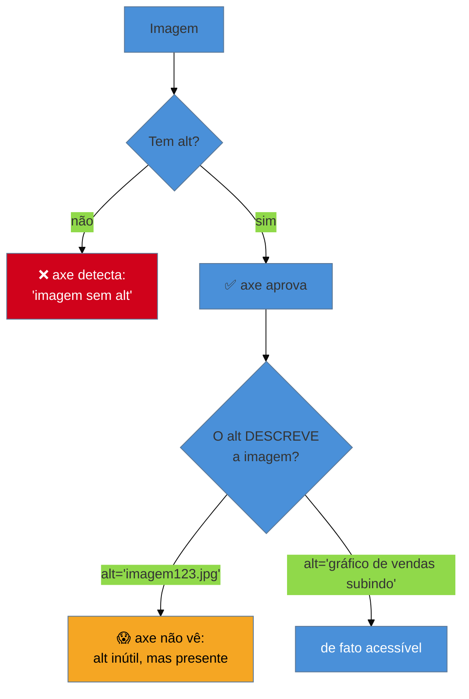

# Auditoria automatizada

> [!abstract] TL;DR
> Ferramentas automáticas — **axe** (o motor por trás da maioria), **Lighthouse** e **WAVE** — varrem uma página e apontam violações de WCAG em segundos. São indispensáveis: pegam o grosso das falhas mecânicas (contraste, `alt` faltando, campo sem label) sem esforço humano. Mas têm um **teto** que você precisa gravar: a automação detecta apenas **cerca de um terço a metade** dos problemas de acessibilidade. Ela verifica o que é *computável* ("existe um `alt`?"), não o que exige *julgamento* ("o `alt` descreve a imagem?"). Tratar "passou no axe" como "é acessível" é o erro que a nota 01 já avisava — a ferramenta é rede de segurança, não método.

O SG2 ensinou a construir. O SG3 ensina a **provar**. E o primeiro instinto — rodar uma ferramenta — é certo, desde que você saiba exatamente o que ela vê e o que ela é cega para ver. Começar pela automação é inteligente: é barata, rápida e pega os erros mais comuns do mundo (lembre dos seis que concentram 96% das falhas, na nota 01 — quase todos automaticamente detectáveis). Mas terminar na automação é o erro que produz sites "aprovados" e inutilizáveis.

## O que a automação vê bem

Ferramentas automáticas são excelentes no que é **verificável por regra**. Elas leem o DOM e a árvore de acessibilidade (nota 02) e checam condições objetivas:

- **Contraste de cor** — calculam a razão (nota 11) e sinalizam o que fica abaixo de 4.5:1. Fazem isso em massa, algo impossível de conferir a olho num site grande.
- **Atributos faltando** — imagem sem `alt`, campo sem label associado, botão sem nome acessível, `<html>` sem `lang`.
- **ARIA inválido** — um `role` que não existe, um `aria-*` mal escrito, um `aria-labelledby` apontando para um id inexistente.
- **Estrutura básica** — hierarquia de headings quebrada (h1→h3), landmarks ausentes, listas malformadas.

Nada disso exige julgamento humano — é presença/ausência, válido/inválido, número acima/abaixo do limiar. É exatamente onde a máquina supera o humano em velocidade e consistência.

## As três ferramentas que você vai usar

O mercado convergiu em torno de poucas ferramentas, e a maioria compartilha o **mesmo motor**:

| Ferramenta | O que é | Melhor para |
|-----------|---------|-------------|
| **axe-core** (Deque) | O *engine* open source de auditoria. Roda embutido em incontáveis outras ferramentas. | Ser a base de tudo — extensão, CI, testes de código |
| **axe DevTools** | Extensão de browser sobre o axe-core | Auditoria manual rápida durante o desenvolvimento |
| **Lighthouse** | Auditoria do Chrome (perf + a11y + SEO); a parte de a11y **usa axe-core** | Um score rápido no DevTools; visão geral |
| **WAVE** (WebAIM) | Extensão que **sobrepõe ícones** na própria página, mostrando onde estão os problemas | Ver os erros *no contexto visual* da página; ótimo didaticamente |

O ponto a interiorizar: **axe-core é o denominador comum**. A aba Accessibility do Lighthouse é axe por baixo; muitas ferramentas comerciais são axe por baixo. Isso é bom (um padrão de fato, bem mantido) e é um alerta (rodar Lighthouse *e* axe DevTools não te dá duas opiniões independentes — é o mesmo motor duas vezes). O WAVE é o mais diferente na apresentação: em vez de uma lista, ele desenha os problemas sobre a página, o que ajuda a *ver* a estrutura.

## O teto: por que a automação não basta

Agora o coração desta nota. A pesquisa da própria Deque — criadora do axe — e da comunidade converge num número desconfortável: testes automáticos detectam apenas em torno de **um terço a metade** dos problemas de acessibilidade de WCAG. A metade que falta não é obscura; é frequentemente a que **mais importa para o usuário**.

Por quê? Porque a máquina verifica o *computável*, não o *significativo*:

O diagrama mostra o buraco. O axe verifica que o `alt` **existe**; ele não tem como saber se o `alt` **descreve** a imagem. `alt="DSC_0042.jpg"` passa na automação e é inútil para quem usa leitor de tela. Os casos que só o humano pega:

- **Qualidade do texto alternativo** — `alt` presente mas sem sentido, ou que descreve a coisa errada.
- **Ordem lógica** — a ordem de foco faz *sentido*? A leitura linear conta a história certa? A máquina vê que há uma ordem; não julga se ela é lógica.
- **Rótulos significativos** — um botão nomeado "clique aqui" tem nome acessível (passa no axe) e é inútil para quem navega por lista de links.
- **Se o teclado realmente funciona** — o axe checa se elementos são focáveis; não verifica se o *fluxo* de teclado do seu combobox faz sentido (nota 09).
- **Legendas corretas** — vê que há um `<track>`; não confere se a legenda está certa e sincronizada.

> [!warning] "Passou no Lighthouse com 100" = acessível
> **O que acontece:** o time celebra o score 100 de acessibilidade do Lighthouse e considera a a11y resolvida. Um usuário de leitor de tela, semanas depois, não consegue usar metade da interface.
> **Por quê:** o score do Lighthouse reflete só as verificações automáticas (axe-core) — a metade computável do problema. Um `alt="foto"` inútil, uma ordem de foco ilógica e um combobox de teclado quebrado passam todos com nota máxima.
> **Como evitar:** leia o próprio Lighthouse — ele *avisa* que testes manuais são necessários e lista itens "a verificar manualmente". Score alto é piso, não teto. A metade que falta é a auditoria manual da nota [[03-Dominios/Tecnologia/Acessibilidade/Auditar e Testar/15 - Auditoria manual|15]].

## Onde a automação brilha de verdade: escala e regressão

Se a automação pega só metade, por que ela é indispensável? Porque essa metade é **grande, mecânica e recorrente** — e a máquina a cobre em **escala** e **continuamente**, coisa que nenhum humano faz. Um humano não confere o contraste de 1.257 elementos por página, em 200 páginas, a cada deploy. O axe faz isso em segundos.

O maior valor da auditoria automatizada não é o relatório pontual — é **rodar sempre**, pegando **regressões** antes que cheguem à produção. Um campo que perdeu o label num refactor, um contraste que quebrou numa mudança de tema: a automação flagra na hora. É exatamente por isso que ela pertence ao **código e ao CI**, não só à extensão de browser — e é para lá que a próxima nota vai.

**Auditoria automatizada em uma frase:** axe (e o Lighthouse/WAVE que o embutem) pega em segundos a metade mecânica das falhas — contraste, atributos, ARIA inválido — mas é cega para tudo que exige julgamento, então é o piso da auditoria, jamais o teto.

## O que vem a seguir

A automação só entrega seu valor de regressão quando roda **sozinha, o tempo todo** — no seu pipeline de testes. A próxima nota leva o axe para dentro do código: testes de componente que falham quando a acessibilidade quebra, e testes E2E que auditam a página inteira.

- [[03-Dominios/Tecnologia/Acessibilidade/Auditar e Testar/14 - Testes de a11y no código|14 — Testes de a11y no código]] — jest/vitest-axe, Testing Library, Playwright.
- [[03-Dominios/Tecnologia/Acessibilidade/Auditar e Testar/15 - Auditoria manual|15 — Auditoria manual]] — a metade que a máquina não vê.
- [[03-Dominios/Tecnologia/Acessibilidade/Construir Acessível/11 - Cor, contraste e visual acessível|11 — Cor e contraste]] — o que a automação mais detecta.

## Fontes

- **Deque** — [*axe-core*](https://github.com/dequelabs/axe-core) — o motor open source de auditoria por trás da maioria das ferramentas.
- **Deque** — [*The automated accessibility coverage question*](https://www.deque.com/automated-accessibility-testing-coverage/) — a análise da própria criadora do axe sobre quanto a automação de fato cobre.
- **WebAIM** — [*WAVE Web Accessibility Evaluation Tool*](https://wave.webaim.org/) — a ferramenta que sobrepõe os problemas no contexto visual da página.
- **Google** — [*Lighthouse Accessibility scoring*](https://developer.chrome.com/docs/lighthouse/accessibility/scoring) — a documentação que explicita que o score cobre só o automatizável.
