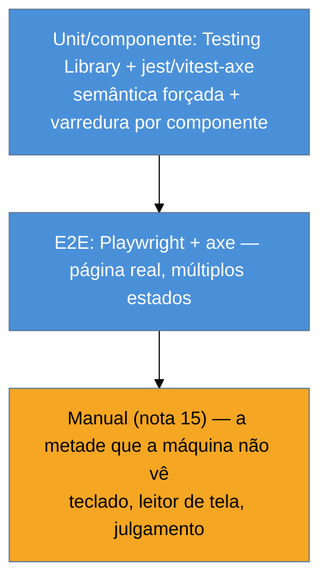

# Testes de a11y no código

> [!abstract] TL;DR
> Rodar o axe na extensão é pontual; rodar o axe **no código** é contínuo — e é o que transforma acessibilidade em algo que **não regride**. Três camadas se somam: (1) escrever testes com **Testing Library**, cuja API por `role`/`name` *força* semântica correta — se o teste consegue achar o botão pelo papel, é porque a árvore de acessibilidade está certa; (2) plugar **jest-axe/vitest-axe** para auditar o DOM renderizado de cada componente; e (3) rodar **axe via Playwright** para auditar páginas inteiras no navegador real. Nenhuma dessas substitui o teste manual (nota 15), mas juntas elas prendem a metade automatizável no CI, pegando quebras no pull request em vez de na produção.

A nota 13 terminou com uma promessa: o valor real da automação é rodar *sempre*, pegando regressões. Esta nota cumpre a promessa levando o axe para onde ele trabalha sozinho — a suíte de testes. E há uma surpresa boa no caminho: a forma **correta** de escrever testes de UI, com Testing Library, já é um teste de acessibilidade disfarçado, mesmo antes de você adicionar qualquer ferramenta de a11y.

Este território cruza com o galho de [[03-Dominios/Tecnologia/Testes JS/index|Testes JS]] — aqui o foco é a **lente de acessibilidade** sobre aquelas mesmas ferramentas.

## Testing Library: o teste que exige semântica

A biblioteca **Testing Library** (React Testing Library e as irmãs) tem uma filosofia que casa perfeitamente com a11y: *teste como o usuário usa*. E o usuário — inclusive o de leitor de tela — encontra elementos pelo que eles **são** e como se **chamam**, não pela classe CSS. Por isso a query recomendada é `getByRole`:

```js
// ❌ query frágil e cega para a11y: acha por implementação
const botao = container.querySelector('.btn-excluir');

// ✅ query por role + nome acessível: só passa se a árvore de a11y estiver correta
const botao = screen.getByRole('button', { name: /excluir item/i });
```

Repare no que o segundo teste **prova de graça**: para `getByRole('button', { name: /excluir/i })` encontrar o elemento, ele precisa ter role `button` (então é um `<button>` de verdade, ou tem `role` correto) **e** um accessible name que casa com "excluir" (nota 02). Se alguém trocar o `<button>` por uma `<div onClick>`, ou remover o `aria-label` do botão de ícone, **o teste quebra** — não porque você escreveu um teste de a11y, mas porque a query por role não acha mais o elemento. A acessibilidade vira efeito colateral de testar direito.

> [!question]- Então preciso de ferramenta de a11y, se a Testing Library já força semântica?
> Sim, porque elas cobrem coisas diferentes. A query por `role` prova que **aquele elemento específico** que o teste toca tem semântica correta — é pontual, do que o teste alcança. O **axe** varre o **DOM inteiro** renderizado e checa dezenas de regras (contraste, ARIA inválido, ids duplicados, ordem de headings) que nenhuma query individual cobriria. Testing Library te dá a11y **onde você testa comportamento**; jest-axe te dá a11y **em tudo que renderizou**. As duas se somam: uma força a semântica dos pontos de interação, a outra faz a varredura ampla.

## jest-axe / vitest-axe: auditando o componente renderizado

O passo seguinte é rodar o próprio axe contra o HTML que seu componente produz, dentro do teste unitário. Os pacotes `jest-axe` (para Jest) e `vitest-axe` (para Vitest) expõem o axe-core como uma asserção:

```js
import { render } from '@testing-library/react';
import { axe } from 'vitest-axe';
import { FormularioCadastro } from './FormularioCadastro';

test('formulário de cadastro não tem violações de a11y', async () => {
  const { container } = render(<FormularioCadastro />);
  const resultados = await axe(container);
  expect(resultados).toHaveNoViolations(); // falha listando cada violação encontrada
});
```

Quando esse teste falha, ele não diz só "falhou" — ele lista **cada violação** (qual regra, qual elemento, como consertar, link para a documentação). Um campo que perdeu o label, um contraste que quebrou, um `aria-labelledby` órfão: o teste vira vermelho no pull request, com o diagnóstico junto. É a regressão pega no ato, exatamente o que a nota 13 queria.

A prática de ofício: adicione uma asserção `toHaveNoViolations` em cada teste de componente que já existe. Custo marginal quase zero, e você ganha uma malha de a11y sobre toda a UI testada.

## Playwright + axe: a página inteira no navegador real

Testes unitários rodam num DOM simulado (jsdom/happy-dom), que não é um navegador de verdade — não tem layout real, não computa contraste com precisão, não roda em cima do CSS final. Para auditar a **página montada de verdade**, você sobe um nível para os testes end-to-end com **Playwright** (o assunto da nota [[03-Dominios/Tecnologia/Testes JS/14 - Playwright além do básico|Testes JS 14]]), plugando o axe via `@axe-core/playwright`:

```js
import { test, expect } from '@playwright/test';
import AxeBuilder from '@axe-core/playwright';

test('a página de checkout não tem violações WCAG A/AA', async ({ page }) => {
  await page.goto('/checkout');
  const resultados = await new AxeBuilder({ page })
    .withTags(['wcag2a', 'wcag2aa', 'wcag22aa'])   // escopo: os níveis que você mira
    .analyze();
  expect(resultados.violations).toEqual([]);
});
```

Aqui o axe roda no Chromium (ou Firefox/WebKit) real, sobre a página com todo o CSS, JavaScript e estado carregados — então o contraste é o de verdade, o layout é o de verdade. E como é Playwright, você pode auditar a página **em diferentes estados**: com o modal aberto, com o formulário em erro, após o dropdown expandir. Cada estado é um DOM diferente e merece sua auditoria.

## A pirâmide: onde cada teste mora

Somando as camadas, emerge uma pirâmide que espelha a de testes tradicional:



Muitos testes de componente (baratos, rápidos, rodam a cada save), alguns testes E2E por fluxo crítico (checkout, cadastro, login), e — coroando tudo, insubstituível — a auditoria manual. As duas camadas de baixo são o que você automatiza no CI; a de cima é humana e é a próxima nota.

> [!warning] `toHaveNoViolations` verde = componente acessível
> **O que acontece:** o time confia que, se os testes axe passam, o componente é acessível — e para de testar com teclado e leitor de tela.
> **Por quê:** jest-axe roda o mesmo axe-core da nota 13, com o mesmo teto de ~metade das falhas. Ele não julga qualidade de `alt`, lógica de foco nem fluxo de teclado. Um combobox com teclado quebrado pode passar liso.
> **Como evitar:** trate os testes de código como a **rede de regressão da metade mecânica** — valiosíssima, mas parcial. A cobertura só fecha com o teste manual da nota 15. Automação e manual são complementares, nunca substitutos.

**Testes de a11y no código em uma frase:** Testing Library força semântica correta nos pontos que você testa, jest/vitest-axe varre cada componente, e Playwright+axe audita a página real em vários estados — juntos prendem a metade automatizável no CI, mas não dispensam o humano.

## O que vem a seguir

Você automatizou tudo o que a máquina consegue ver. Resta a metade que ela não vê — e que só um humano com teclado, leitor de tela e julgamento alcança. É o teste que descobre se o `alt` faz sentido, se o foco conta a história certa, se o combobox é de fato usável. Sem ele, metade da acessibilidade fica por provar.

- [[03-Dominios/Tecnologia/Acessibilidade/Auditar e Testar/15 - Auditoria manual|15 — Auditoria manual]] — teclado, screen reader walkthrough, zoom 400%, o roteiro humano.
- [[03-Dominios/Tecnologia/Acessibilidade/Auditar e Testar/16 - Conduzir uma auditoria completa|16 — Conduzir uma auditoria completa]] — juntar automático + manual num relatório priorizado.
- [[03-Dominios/Tecnologia/Testes JS/14 - Playwright além do básico|Testes JS 14 — Playwright]] — a ferramenta E2E que esta nota usa, vista por inteiro.

## Fontes

- **Testing Library** — [*About Queries — Priority (getByRole)*](https://testing-library.com/docs/queries/about/#priority) — por que a query por role é a recomendada e como ela liga teste a acessibilidade.
- **jest-axe** — [*jest-axe*](https://github.com/nickcolley/jest-axe) — o matcher `toHaveNoViolations` para testes de componente (equivalente vitest-axe).
- **Deque** — [*@axe-core/playwright*](https://github.com/dequelabs/axe-core-npm/tree/develop/packages/playwright) — integração do axe com Playwright para auditar a página real.
- **Deque University** — [*Integrating axe into automated tests*](https://dequeuniversity.com/) — práticas de colocar auditoria de a11y no pipeline de CI.
