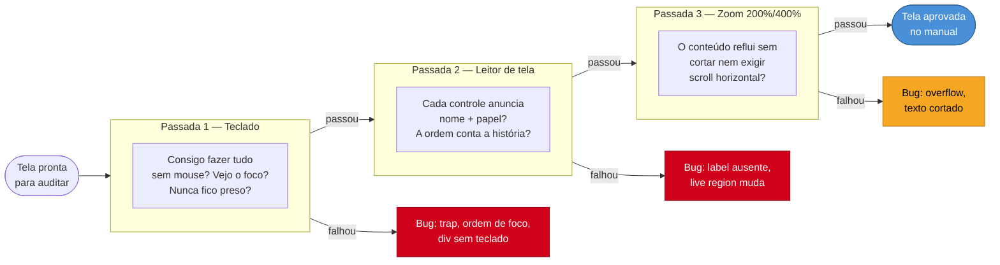

# Auditoria manual

> [!abstract] TL;DR
> A auditoria manual é a metade que a máquina não vê (nota 13) — e a boa notícia é que a maior parte dela não exige ser usuário de leitor de tela: exige um **roteiro** e disciplina. Três passadas cobrem o essencial: (1) **só teclado** — desconecte o mouse e tente usar a página inteira com Tab, Shift+Tab, Enter, Espaço, setas e Esc; (2) **leitor de tela** — atravesse os fluxos críticos ouvindo o que é anunciado (NVDA no Windows, VoiceOver no Mac/iOS); (3) **zoom a 200%/400%** — amplie e veja se o conteúdo reflui sem quebrar nem cortar. Se algo trava em qualquer uma delas, você achou um bug que nenhum axe pegaria.

Chegamos ao teste que separa acessibilidade real de acessibilidade no papel. As notas 13 e 14 automatizaram a metade mecânica; esta cobre a metade que exige *julgamento* — e, para a surpresa de muitos, a maior parte dela você pode fazer **hoje, sozinho, sem treinamento especial**. Não é preciso ser usuário avançado de leitor de tela para pegar 80% dos problemas graves. É preciso ter um roteiro e a paciência de segui-lo.

> [!tip] Vídeo — Accessibility Testing with the NVDA Screenreader
> [**Accessibility Testing with the NVDA Screenreader**](https://www.youtube.com/watch?v=Vx1vSd5uYS8) (Deque Systems, 20 min) — guia prático de instalação e configuração do NVDA (Speech Viewer, Focus Highlight, modos de navegação, atalhos avançados) e, no final, uma demonstração de como usar essas ferramentas para *testar* correções de acessibilidade — o passo a passo que a Passada 2 abaixo resume em texto.

## Passada 1: desconecte o mouse

O teste mais barato e mais revelador de acessibilidade cabe em uma frase: **tire a mão do mouse e tente usar sua aplicação só com o teclado**. Se você não consegue completar uma tarefa sem o mouse, nenhum usuário de teclado consegue — e nem quem usa switch, controle por voz ou leitor de tela (que navegam por teclado por baixo). O teclado é o denominador comum de quase toda tecnologia assistiva.

O roteiro da passada de teclado, tecla por tecla:

- **Tab / Shift+Tab** — percorre para frente e para trás. Cheque: *todos* os elementos interativos são alcançáveis? A **ordem** faz sentido (segue a leitura visual)? Você vê **sempre** onde o foco está (o indicador visível da nota 11)?
- **Enter / Espaço** — ativam botões e links. Cheque: tudo que parece clicável responde a essas teclas? (A `
` da nota 01 falha aqui — recebe o clique do mouse mas ignora o teclado.)
- **Setas** — dentro de widgets compostos (abas, menus, radiogroups): navegam como a APG manda (nota 08/09)?
- **Esc** — fecha modais, popovers, dropdowns?
- **A armadilha fatal** — existe algum ponto onde o foco **entra e não sai** com o teclado? Um *keyboard trap* (widget de terceiro, iframe, editor rico) é uma das piores falhas: o usuário fica preso e só o mouse o liberta — mouse que ele talvez não use. Procure ativamente por isso.

> [!question]- Como sei se a ordem de foco está "certa"?
> A regra: a ordem de tabulação deve seguir a **ordem de leitura visual** — em geral, de cima para baixo, da esquerda para a direita (ou o inverso em RTL). Se ao tabular o foco pula do topo para o rodapé e volta para o meio, o usuário de teclado navega numa montanha-russa e perde o modelo mental da página. Isso costuma acontecer quando o CSS (flex/grid `order`, posicionamento absoluto) reordena visualmente elementos **sem** reordenar o DOM — o olho vê uma ordem, o Tab segue outra (a do DOM). A correção é alinhar a ordem do DOM à ordem visual, não empurrar `tabindex` positivos (o anti-padrão da nota 06).

## Passada 2: ligue o leitor de tela

Esta é a que intimida — e não deveria. Você não precisa dominar o leitor de tela; precisa atravessar os **fluxos críticos** (login, busca, checkout, o caminho principal do produto) *ouvindo* e perguntando "isto faria sentido se eu não visse a tela?". Um roteiro mínimo para começar hoje:

- **Windows:** instale o **NVDA** (gratuito, a maior fatia combinada da nota 03) e use com o Chrome. Ligue com Ctrl+Alt+N.
- **Mac/iOS:** o **VoiceOver** já vem embutido (Cmd+F5 no Mac; três cliques no botão lateral no iPhone). Testar no iOS cobre o mobile, quase universal entre esses usuários.

O que ouvir em cada elemento, cruzando com as notas anteriores:

- **Cada controle se anuncia com nome + papel?** "Excluir item, botão" (bom) vs. só "botão" (o bug da nota 02). Passe por botões de ícone com atenção redobrada.
- **Os cabeçalhos formam um sumário?** Navegue por cabeçalhos (tecla `H` no NVDA) e veja se a estrutura conta a organização da página (nota 03).
- **Os formulários se explicam?** Entre em cada campo: ele anuncia o label? Anuncia se é obrigatório? Ao errar, o erro é **falado** (nota 07)?
- **As atualizações dinâmicas são anunciadas?** Quando um toast aparece ou a busca retorna resultados, o leitor de tela avisa? (As *live regions* que o [[03-Dominios/Tecnologia/HTML/08 - ARIA - roles, states, properties e live regions|HTML 08 — ARIA]] cobre.)
- **A ordem de leitura conta a história certa?** Ouça a página do começo: a sequência linear faz sentido, ou há conteúdo que só funciona pela posição visual?

Uma dica que muda a experiência do teste: **feche os olhos** (ou desligue o monitor) em um dos fluxos. É desconfortável, e é exatamente esse desconforto que te ensina o que seu usuário enfrenta o tempo todo.

## Passada 3: amplie tudo

A terceira passada testa **baixa visão** sem precisar simular nada — é só ampliar. Dois testes complementares:

- **Zoom do navegador a 200% e 400%** (Ctrl/Cmd + várias vezes). O critério **1.4.4 (Redimensionar Texto, AA)** exige que o conteúdo funcione a 200% sem perda; o **1.4.10 (Reflow, AA)** exige que a 400% (equivalente a ~320px de largura) o conteúdo **reflua numa coluna** sem exigir **rolagem horizontal**. Cheque: o texto some, se sobrepõe, é cortado? Aparece um scroll horizontal (o sinal clássico de reflow quebrado)?
- **Zoom só de texto / tamanho de fonte aumentado** — alguns usuários aumentam só a fonte do sistema. Layouts com alturas fixas em pixel "estouram" quando o texto cresce e passa a vazar do seu contêiner.

Esses testes pegam uma classe inteira de bugs de CSS que a automação não modela, porque dependem do *layout renderizado sob ampliação* — algo que só se vê ampliando de verdade.

## O roteiro condensado

Juntando as três passadas num checklist de bolso que você roda em qualquer tela antes de dar por pronta:

| Passada | Ferramenta | Pergunta central |
|---------|-----------|------------------|
| **Teclado** | só o teclado | Consigo fazer tudo sem mouse, vejo o foco, e nunca fico preso? |
| **Leitor de tela** | NVDA / VoiceOver | Cada controle se anuncia com nome+papel, e a ordem conta a história? |
| **Zoom** | browser 200%/400% | O conteúdo reflui sem cortar nem exigir scroll horizontal? |

> [!warning] Auditar só com automação e pular o manual
> **O que acontece:** a equipe roda axe/Lighthouse no CI, tudo verde, e entrega. Um teclado-trap num widget de terceiro, um `alt` sem sentido e uma ordem de foco caótica passam para produção.
> **Por quê:** esses três são invisíveis para a automação — exigem julgamento humano e interação real. São, não por acaso, dos problemas que mais impactam o usuário.
> **Como evitar:** as três passadas manuais são baratas (minutos por tela) e não-negociáveis para fluxos críticos. Automação encontra muitos problemas rápido; o manual encontra os que importam.

**Auditoria manual em uma frase:** três passadas — só teclado, leitor de tela nos fluxos críticos, e zoom a 200%/400% — cobrem a metade que a máquina não vê, e a maioria não exige nada além de um roteiro e disciplina.

## Casos práticos

**Cenário 1 — o keyboard trap que só aparece desconectando o mouse.** Um time integra um widget de calendário (date picker) de terceiro num formulário de checkout. Nos testes manuais de rotina, ninguém percebe nada de errado: o QA clica no campo de data com o mouse, escolhe o dia, segue em frente. Só quando alguém roda a Passada 1 — literalmente desconectando o mouse — descobre o problema: ao abrir o calendário com Enter e tentar sair com Tab, o foco fica preso circulando dentro do popup; Esc não fecha nada. Quem depende do teclado fica **preso** ali, sem alternativa. O bug é invisível para qualquer teste que use mouse em algum ponto do fluxo — inclusive testes manuais mal-desenhados que "esquecem" de tirar a mão do mouse na hora H. É por isso que a regra da Passada 1 é literal: desconecte o mouse de verdade, não apenas evite clicar.

**Cenário 2 — conteúdo cortado a 400% de zoom por largura fixa.** Uma página de checkout tem um resumo do pedido num painel lateral com `width: 380px` fixo em CSS. A 100% de zoom está perfeito. Só que o critério 1.4.10 (Reflow) é testado a 400% — equivalente a navegar num viewport de ~320px. Nesse zoom, o painel de 380px fixos não cabe: ou o navegador força scroll horizontal na página inteira, ou o conteúdo do painel é cortado sem aviso, escondendo o valor total do pedido. Ninguém "programou o bug" — ele emerge da combinação entre uma medida fixa em pixels e um nível de ampliação que o time nunca testou. É exatamente o tipo de falha que a Passada 3 existe para capturar: só aparece ampliando de verdade, no navegador, não lendo o CSS.

## Armadilhas comuns

> [!warning] Confiar só na automação e pular o manual
> **O que acontece:** a suíte de axe/Lighthouse do CI passa 100% verde e a equipe interpreta isso como "acessível". Keyboard traps, ordem de foco incoerente e reflow quebrado — que a automação não enxerga (nota 13/14) — vão para produção sem que ninguém tenha tentado usar a tela sem mouse ou sem olhos.
> **Como evitar:** trate o score de automação como piso, não teto. As três passadas manuais são obrigatórias em qualquer fluxo crítico antes de dar a tela por pronta.

> [!warning] Testar leitor de tela em um único software e achar que cobriu o caso
> **O que acontece:** o time testa só com VoiceOver (porque só tem Mac disponível) e considera o fluxo "validado para leitor de tela". Meses depois, um usuário de NVDA no Windows reporta que o mesmo formulário é inutilizável — um erro de validação que o VoiceOver anunciava automaticamente, o NVDA não anuncia da mesma forma.
> **Por quê:** leitores de tela diferem em como implementam ARIA, quando anunciam live regions e como navegam por landmarks — a nota 03 documenta essas divergências. Testar em um só cobre um comportamento, não o conjunto.
> **Como evitar:** para fluxos verdadeiramente críticos (login, checkout), teste em pelo menos dois pares leitor+navegador (ex.: NVDA+Chrome e VoiceOver+Safari). Fora deles, um teste bem feito num leitor já pega a maioria dos bugs estruturais.

> [!warning] "Eu vejo o indicador de foco" sem testar a ordem
> **O que acontece:** o desenvolvedor tabula a página, vê o contorno azul se mover, conclui "o foco está visível, então está acessível" — e nunca checa se a **sequência** em que o foco pula faz sentido.
> **Por quê:** o indicador visível (nota 11) e a ordem de foco (esta nota) são propriedades diferentes. CSS que reordena visualmente sem reordenar o DOM (flex/grid `order`, posicionamento absoluto) produz um foco perfeitamente visível que salta de forma caótica — o olho vê uma ordem, o Tab segue outra.
> **Como evitar:** não basta ver o foco; é preciso **narrar** a sequência em voz alta (ou anotar) e confrontar com a ordem de leitura visual, como descrito no callout da Passada 1.

> [!warning] Ignorar o zoom porque "ninguém usa isso"
> **O que acontece:** a auditoria cobre teclado e leitor de tela com rigor, mas pula a Passada 3 porque parece um teste "de nicho" — poucos usuários ampliam a tela, certo? A equipe descobre o contrário só quando um usuário de baixa visão (uma fatia grande e crescente da população, principalmente 60+) reporta que o checkout "desaparece" a 400%.
> **Por quê:** baixa visão é uma das deficiências mais comuns e menos testadas, justamente porque não exige nenhuma tecnologia assistiva exótica — só o zoom nativo do navegador, algo que qualquer testador consegue reproduzir em 10 segundos.
> **Como evitar:** trate a Passada 3 como não-negociável quanto as outras duas; ela é a mais barata das três (não exige instalar nada) e ainda assim é a mais frequentemente pulada.

## Como explicar em inglês

> In a senior interview, framing manual testing as a **structured, repeatable protocol** — not an ad-hoc "click around and see" — signals maturity. I'd say something like: *"Automated tools like axe catch maybe 30-40% of accessibility issues — the ones with unambiguous pass/fail rules. The rest require human judgment, so we run three manual passes on every critical flow: a keyboard-only pass to catch **focus traps** and verify **focus order**, a **screen reader walkthrough** with NVDA or VoiceOver to check that every control announces its name and role correctly, and a zoom pass at 200% and 400% to verify **reflow** — that content restacks into a single column instead of requiring horizontal scrolling. Each pass targets a class of bug the others can't see."* Naming the specific WCAG success criteria (1.4.10 Reflow, 2.1.2 No Keyboard Trap) when relevant shows you're not just testing by feel — you're testing against a spec.

| PT | EN |
|---|---|
| armadilha de teclado | keyboard trap |
| ordem de foco | focus order |
| passada de auditoria | testing pass |
| percurso com leitor de tela | screen reader walkthrough |
| reflow / refluir | reflow |
| ampliação / zoom | zoom / magnification |
| rolagem horizontal | horizontal scrolling |
| indicador de foco | focus indicator |
| fluxo crítico | critical flow / critical path |
| tecnologia assistiva | assistive technology (AT) |

## O que vem a seguir

Você tem agora as duas metades — automática (13/14) e manual (15). Falta o ofício de **orquestrá-las** num trabalho de verdade: definir escopo, combinar as ferramentas, e — o mais importante — transformar a lista bruta de achados num **relatório priorizado** por severidade e esforço, que o time consiga de fato executar. É o que fecha o SG3.

- [[03-Dominios/Tecnologia/Acessibilidade/Auditar e Testar/16 - Conduzir uma auditoria completa|16 — Conduzir uma auditoria completa]] — do escopo ao relatório priorizado.
- [[03-Dominios/Tecnologia/Acessibilidade/Fundamentos e Modelo Mental/03 - Leitores de tela e tecnologias assistivas na prática|03 — Leitores de tela]] — os modos de navegação que a passada 2 usa.
- [[03-Dominios/Tecnologia/Acessibilidade/Construir Acessível/06 - Gestão de foco em SPAs|06 — Gestão de foco]] — o que a passada de teclado testa.

## Fontes

- **W3C WAI** — [*Easy Checks — A First Review of Web Accessibility*](https://www.w3.org/WAI/test-evaluate/preliminary/) — o roteiro oficial de verificações manuais rápidas.
- **WebAIM** — [*Keyboard Accessibility*](https://webaim.org/techniques/keyboard/) — o teste de teclado e a caça a keyboard traps.
- **NV Access** — [*NVDA*](https://www.nvaccess.org/) — o leitor de tela gratuito recomendado para a passada 2 no Windows.
- **W3C** — [*Understanding SC 1.4.10: Reflow*](https://www.w3.org/WAI/WCAG22/Understanding/reflow.html) — o critério que a passada de zoom a 400% verifica.
