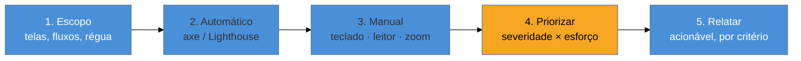

# Conduzir uma auditoria completa

> [!abstract] TL;DR
> Auditar não é rodar o axe e colar a saída num documento — é um **método** de cinco passos: definir **escopo** (quais telas e fluxos, contra qual régua), rodar a passada **automática** (nota 13/14) para varrer o mecânico, rodar a passada **manual** (nota 15) para pegar o que exige julgamento, e então — o passo que separa a auditoria útil da inútil — **priorizar** cada achado por **severidade × esforço** e escrevê-lo de forma **acionável** (onde, por quê, como corrigir, qual critério WCAG). Uma lista de 200 problemas sem prioridade paralisa o time; 200 problemas ordenados por "quanto machuca × quão caro é consertar" viram um plano.

Este é o capstone do SG3: você tem as ferramentas automáticas e o roteiro manual; agora precisa orquestrá-los num trabalho que um time consiga **executar**. Porque o produto de uma auditoria não é encontrar problemas — encontrar é fácil, o WebAIM Million encontra 50 milhões deles. O produto é um **relatório que gera conserto**. E a diferença entre um e outro está quase toda na priorização e na redação.

## O método em cinco passos

### Passo 1 — Escopo

Antes de tocar em qualquer ferramenta, defina os limites, senão a auditoria vira infinita e rasa:

- **O que auditar.** Não "o site inteiro" — os **fluxos e telas representativos**: os caminhos críticos (login, cadastro, checkout, a tarefa principal), mais uma amostra dos *templates* de página (uma de listagem, uma de detalhe, um formulário, o home). Se dez páginas usam o mesmo template, auditar uma cobre as dez.
- **Contra qual régua.** Quase sempre **WCAG 2.2 nível AA** (nota 04). Deixe explícito — muda quais critérios entram.
- **Em quais ambientes.** Que navegadores, que leitor de tela, desktop e/ou mobile. A régua realista da nota 03 (NVDA+Chrome, VoiceOver+iOS) costuma bastar.

### Passo 2 — Passada automática

Rode o axe (extensão ou o CI da nota 14) em cada tela do escopo. Colete as violações mecânicas: contraste, atributos faltando, ARIA inválido, estrutura de headings. Isso limpa o "ruído de fundo" rápido e barato, deixando você livre para gastar o tempo humano no que só o humano vê. **Não pare aqui** — este é o piso (nota 13).

### Passo 3 — Passada manual

Rode as três passadas da nota 15 (teclado, leitor de tela, zoom) nos fluxos do escopo. É aqui que aparecem os achados que importam e que a automação não viu: o keyboard-trap, o `alt` sem sentido, a ordem de foco caótica, o combobox de teclado quebrado. Anote cada um com **onde** ocorre e **o que** o usuário não consegue fazer.

## Passo 4 — Priorizar: a matriz severidade × esforço

Aqui está o passo que transforma achados em plano. Cada problema recebe duas notas independentes:

- **Severidade** — quanto machuca o usuário. Um **bloqueio** (impede completar uma tarefa: checkout inacessível por teclado) é crítico. Um **atrito** (dificulta mas há contorno: um `alt` genérico numa imagem decorativa) é baixo. Cruze com dois eixos: a *gravidade* da barreira (bloqueia totalmente vs. incomoda) e a *criticidade da tela* (o checkout pesa mais que a página "Sobre") — o mesmo raciocínio da nota 04.
- **Esforço** — quanto custa consertar. Trocar uma cor de token (baixo) vs. reescrever um widget inteiro para cumprir o contrato APG (alto).

Cruzando os dois, a ordem de ataque cai sozinha:

| | Esforço baixo | Esforço alto |
|---|---|---|
| **Severidade alta** | **① Faça já** — bloqueios baratos, o ROI máximo | **② Planeje** — bloqueios caros, entram no roadmap |
| **Severidade baixa** | **③ Oportunista** — conserte de passagem | **④ Depois** — atrito caro, o fim da fila |

O quadrante **①** (alta severidade, baixo esforço) é ouro: são as correções que removem barreiras reais por pouco trabalho — contraste de um token, um `aria-label` num botão de ícone, um label num campo. Comece sempre por ele. O erro comum é atacar por *facilidade* (consertar 50 alts decorativos triviais) enquanto o checkout segue inacessível — muito movimento, pouco impacto.

> [!question]- Severidade se mede pela conformidade WCAG (nível A vs AA) ou pelo impacto no usuário?
> Pelos dois, e eles quase sempre concordam. O **nível WCAG** é um bom proxy inicial de severidade — critérios de nível **A** costumam ser bloqueios totais (sem `alt`, sem teclado), enquanto **AA** refina. Mas o **impacto real no fluxo** é o desempate: uma falha AA no botão de "finalizar compra" é mais urgente que uma falha A numa nota de rodapé. Use o nível como primeira ordenação e o impacto no fluxo como ajuste fino. Nunca priorize por *nível* ignorando *onde* o problema está.

## Passo 5 — Relatar: o achado acionável

O mesmo problema pode virar uma linha inútil ou um ticket que se conserta em minutos. A diferença é a estrutura. Um achado acionável tem **cinco campos**:

> **[Crítico] Botão de excluir sem nome acessível — página de itens**
> - **Onde:** `/itens`, o botão de lixeira em cada linha da tabela.
> - **Problema:** o `<button>` contém só um ícone SVG sem texto; o accessible name computa vazio. Leitor de tela anuncia apenas "botão".
> - **Impacto:** usuário de leitor de tela não sabe o que o botão faz — não consegue excluir com segurança. **Bloqueio.**
> - **Critério WCAG:** 4.1.2 Nome, Papel, Valor (nível A).
> - **Como corrigir:** adicionar `aria-label="Excluir item"` ao botão e `aria-hidden="true"` ao SVG. Esforço: baixo.

Compare com a versão inútil: *"vários botões sem label"*. A primeira o dev conserta hoje; a segunda vira uma discussão sobre quais botões, onde, e por quê. Regras de redação:

- **Concreto e localizado** — a URL, o seletor, o elemento exato. "Em vários lugares" não é acionável.
- **Impacto na voz do usuário** — não "viola 4.1.2", mas "o usuário não consegue excluir". O critério entra como referência, não como a explicação.
- **Solução, não só diagnóstico** — proponha a correção. Você acabou de estudar o SG2 inteiro; use-o.
- **Agrupe por padrão, não por instância** — se o mesmo botão de ícone aparece em 40 telas, é **um** achado ("padrão de botão-ícone sem label, presente em X telas"), não 40. Isso mantém o relatório navegável e sinaliza que a correção é sistêmica (no componente compartilhado), não tela a tela.

## Auditoria pontual vs. contínua

Uma última distinção de maturidade. A auditoria completa deste capítulo é uma **fotografia** — o estado num momento. Ela é essencial para diagnosticar, mas se o time só audita de tempos em tempos, a dívida volta a acumular entre uma auditoria e outra. A meta madura é fazer a metade automatizável rodar **continuamente** (o CI da nota 14) e reservar a auditoria manual completa para marcos (um release grande, uma feature crítica, uma exigência de conformidade). Auditoria pontual encontra a dívida; processo contínuo impede que ela cresça — e esse salto do "auditar" para o "sustentar" é exatamente o próximo sub-galho.

**Conduzir uma auditoria em uma frase:** escopo → automático → manual → priorizar por severidade × esforço → relatar de forma acionável; o valor não está em achar problemas, mas em ordená-los e descrevê-los de um jeito que o time consiga consertar.

> [!tip] Vídeo — How to Run an Accessibility WCAG Audit: Step-by-Step for Beginners
> [**How to Run an Accessibility WCAG Audit: Step-by-Step for Beginners**](https://www.youtube.com/watch?v=L3qq69X0-6Y) (Stefany Newman — Accessibility Instructor, 50 min) — percorre na prática os mesmos passos deste capítulo: escolher o que avaliar, testar teclado e VoiceOver, e — o ponto mais raro em tutoriais — **como escrever o defeito** (22:53) e organizar o relatório numa planilha. Bom contraponto visual ao achado acionável de cinco campos descrito acima.

## Casos práticos

**Cenário 1 — o relatório que ninguém consegue usar.** Um freelancer roda o axe no site inteiro, exporta o CSV e entrega: 340 linhas, uma delas "vários botões sem `aria-label` em várias páginas". O time de dev abre o arquivo, não sabe por onde começar, não sabe quais botões, e o arquivo vira uma aba esquecida no navegador de alguém. Duas semanas depois, ninguém corrigiu nada — não porque o problema fosse difícil, mas porque o achado não dizia **onde**, **qual impacto** e **como corrigir**. Reescrito como achado acionável (like o exemplo do botão de excluir, passo 5), o mesmo problema vira um ticket de 20 minutos: "padrão de botão-ícone sem nome acessível, presente em 12 telas — componente `IconButton` compartilhado — adicionar prop `aria-label` obrigatória."

**Cenário 2 — priorizar por facilidade em vez de por severidade × esforço.** Um time recebe os achados de uma auditoria e, sob pressão de prazo, ataca os itens mais fáceis de fechar primeiro: trocar `alt=""` genérico em 30 imagens decorativas, ajustar espaçamento de foco em componentes pouco usados. Fecham 25 tickets na sprint — métrica de velocidade ótima. Só que o checkout, marcado como **[Crítico] Bloqueio** desde o dia 1 (o teclado não consegue ativar o botão "Finalizar compra" por causa de um `div` com `onclick` sem `role`/`tabindex`), continua aberto porque está no quadrante "severidade alta, esforço alto" — exige refatorar o componente para um `<button>` de verdade. O time confunde *volume de tickets fechados* com *impacto removido*. É exatamente o erro que a matriz do passo 4 existe para prevenir: contar tickets fechados não é o mesmo que reduzir dano ao usuário.

## Armadilhas comuns

> [!warning] Priorizar por facilidade, não por severidade × impacto
> Atacar primeiro o que é rápido de consertar (alts triviais, espaçamentos) e deixar bloqueios reais (checkout, login) para depois porque "são mais trabalhosos" inverte a lógica da matriz do passo 4. Volume de correções não é o mesmo que redução de dano — um quadrante ① pequeno vale mais que dez quadrantes ③ ou ④.

> [!warning] Relatar sem propor solução
> Um achado que só diagnostica ("o contraste está abaixo de 4.5:1") força o dev a pesquisar a correção do zero. Um achado acionável já traz a solução ("trocar `--text-secondary` de `#999` para `#767676`, esforço baixo") — você já estudou o SG2 inteiro; use-o na hora de escrever o relatório, não só na hora de codar.

> [!warning] Listar por instância em vez de agrupar por padrão
> Reportar "botão sem label na linha 12", "botão sem label na linha 45", "botão sem label na linha 78"... como 40 achados separados infla o relatório e esconde que o problema é **um só componente compartilhado**. Agrupe por padrão ("padrão de botão-ícone sem label, presente em 40 telas") — isso também sinaliza que a correção certa é no componente, não em cada tela.

> [!warning] Tratar a auditoria pontual como suficiente
> Auditar uma vez, arquivar o PDF e seguir desenvolvendo sem nenhum controle contínuo garante que a dívida de acessibilidade volta a crescer a partir do dia seguinte. A fotografia do passo 1-5 diagnostica o estado — mas só o processo contínuo (CI da nota 14, revisão em cada PR) impede que os mesmos problemas reapareçam a cada feature nova.

## Como explicar em inglês

> In an interview, don't describe an audit as "I ran a scanner and found some issues." Frame it as a method: *"I scope the audit to the critical user flows and one instance of each page template, run automated tools like axe to catch the mechanical violations, then do manual passes — keyboard-only, screen reader, zoom — because most real-world accessibility barriers are things a scanner can't detect. The step that actually makes the audit useful is prioritization: I score each finding by severity — does it block a task or just create friction — against remediation effort, and I always start with the high-severity, low-effort quadrant, because that's where you remove real pain for the least cost. And every finding in the report is actionable: where it is, what's broken, who it impacts, which WCAG criterion it violates, and how to fix it — never just 'several buttons are missing labels.'"* That last sentence is usually what separates a junior answer from a senior one — it shows you know the deliverable of an audit is a fixable plan, not a list of problems.

| PT | EN |
|---|---|
| Escopo | Scope |
| Severidade | Severity |
| Esforço (de correção) | Remediation effort |
| Achado acionável | Actionable finding |
| Bloqueio | Blocker |
| Atrito | Friction |
| Agrupar por padrão | Group by pattern |
| Auditoria pontual | One-off / point-in-time audit |
| Auditoria contínua | Continuous auditing |
| Priorizar | Prioritize / triage |

## O que vem a seguir

Isto fecha o SG3: você sabe construir (SG2) e sabe provar (SG3). Falta o que impede a dívida de voltar e o que a organização precisa declarar ao mundo: acessibilidade no processo de desenvolvimento, o cenário legal que torna tudo isto obrigatório, e como comunicar conformidade. É o SG4, o salto do técnico para o organizacional.

- [[03-Dominios/Tecnologia/Acessibilidade/Sustentar e Conformidade/index|SG4 — Sustentar e Conformidade]] — o próximo sub-galho.
- [[03-Dominios/Tecnologia/Acessibilidade/Sustentar e Conformidade/17 - A11y no ciclo de desenvolvimento|17 — A11y no ciclo de desenvolvimento]] — como a auditoria contínua vira processo.
- [[03-Dominios/Tecnologia/Acessibilidade/Auditar e Testar/15 - Auditoria manual|15 — Auditoria manual]] — a passada humana que o passo 3 executa.

## Fontes

- **W3C WAI** — [*WCAG-EM: Website Accessibility Conformance Evaluation Methodology*](https://www.w3.org/TR/WCAG-EM/) — a metodologia oficial de avaliação, base dos passos de escopo e amostragem.
- **W3C WAI** — [*Evaluation Tools and Reporting*](https://www.w3.org/WAI/test-evaluate/) — combinar avaliação automática e manual e reportar resultados.
- **Deque** — [*Prioritizing accessibility issues*](https://www.deque.com/blog/) — práticas de priorização por severidade e impacto no usuário.
- **GOV.UK** — [*How to do an accessibility audit*](https://www.gov.uk/service-manual/technology/testing-for-accessibility) — modelo de auditoria e relatório acionável testado em serviço público.
