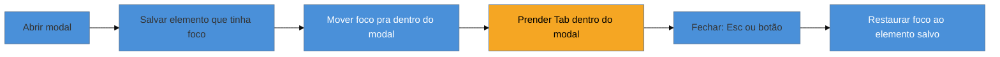

# Gestão de foco em SPAs

> [!abstract] TL;DR
> Numa página HTML tradicional, o navegador gerencia o foco de teclado para você: clicou num link, carregou outra página, o foco reinicia no topo. Numa SPA, **nada disso acontece** — a URL muda, o conteúdo troca, mas o foco fica preso onde estava (às vezes num botão que nem existe mais). Gerenciar foco vira responsabilidade *sua*, e são três os movimentos que você precisa dominar: **mover** o foco quando o conteúdo muda (troca de rota, abertura de modal), **prender** o foco dentro de um contexto modal (*focus trap*), e **restaurar** o foco ao ponto de origem quando esse contexto fecha. Errar qualquer um deles deixa o usuário de teclado literalmente perdido — o bug que abriu este domínio.

Chegou a hora de resolver, com as mãos, aquele modal da nota 01 que largava o usuário de teclado no escuro. E o problema é maior do que um modal: é toda a categoria de bugs que nasce quando você troca a navegação nativa do navegador pela navegação em JavaScript de uma *single-page application*.

Numa página multi-documento clássica, o foco é um problema resolvido — pelo browser. Você clica num link, o navegador descarrega a página, carrega a nova e **coloca o foco no início do documento**. O leitor de tela começa a ler do topo. Previsível, gratuito, invisível. Numa SPA, o roteador troca o conteúdo do `<main>` via JavaScript sem nunca recarregar o documento. Para o olho, "mudou de página". Para o **foco**, não mudou nada: ele continua exatamente onde estava — em cima do link que você acabou de clicar, que o React talvez já tenha desmontado. O usuário de teclado aperta Tab esperando explorar a nova tela e, em vez disso, cai num limbo.

## Pré-requisito: o que é focável, e o `tabindex`

Antes dos três movimentos, um alicerce rápido (aprofundado no [[03-Dominios/Tecnologia/HTML/07 - Acessibilidade I - fundamentos WCAG e navegação por teclado|HTML/07]]). Só alguns elementos são **focáveis por padrão**: links com `href`, botões, campos de formulário, `<select>`, `<textarea>`. Uma `<div>` ou um `<span>` **não** entram no *tab order*. O atributo `tabindex` controla isso, e seus três valores têm significados bem distintos:

| `tabindex` | Efeito | Quando usar |
|-----------:|--------|-------------|
| `0` | Entra no tab order, na ordem do DOM | Tornar focável um elemento customizado que precisa ser tabulável |
| `-1` | Focável **por script** (`.focus()`), mas fora do tab order | Alvos de foco programático: o container de uma rota, o topo de um modal |
| `> 0` | Fura a ordem natural, vai primeiro | **Quase nunca** — é anti-padrão, quebra a ordem lógica |

O `tabindex="-1"` é o herói silencioso desta nota: é ele que permite mover o foco *para* um elemento que o usuário não deveria tabular normalmente (como uma região de conteúdo), mas para onde você precisa mandar o foco via código.

## Movimento 1: mover o foco na troca de rota

Quando o roteador da SPA troca a tela, você precisa reposicionar o foco — senão o usuário de leitor de tela nem fica sabendo que a página mudou. A técnica canônica: dar `tabindex="-1"` ao container principal da nova rota e chamar `.focus()` nele após a renderização.

```jsx
// Ao navegar para uma nova rota, mova o foco para o heading/container da rota
function RouteContainer({ children }) {
  const ref = useRef(null);
  const location = useLocation();

  useEffect(() => {
    // após render da nova rota, joga o foco no topo do conteúdo
    ref.current?.focus();
  }, [location.pathname]);

  return (
    <main ref={ref} tabIndex={-1} aria-labelledby="titulo-pagina">
      {children}
    </main>
  );
}
```

Mover o foco para o `<main>` (ou, melhor ainda, para o `<h1>` da nova tela) faz o leitor de tela **anunciar o novo contexto** e reposiciona o teclado no começo lógico. É o que o browser fazia de graça na navegação multi-documento, agora reimplementado à mão.

> [!question]- Por que não mover o foco para o topo com `window.scrollTo(0,0)`?
> Porque rolar a página **não move o foco** — são coisas diferentes. `scrollTo` reposiciona o *viewport* visual; o foco de teclado continua no elemento antigo, invisível para quem enxerga mas ainda ativo para quem tabula. O usuário de leitor de tela não é avisado da mudança, e o próximo Tab parte do lugar errado. Rolar resolve o olho; só `.focus()` resolve o teclado. Numa SPA acessível você quase sempre precisa dos dois.

## Movimento 2: prender o foco (focus trap)

Aqui está o coração do bug do modal. Quando um modal (diálogo) abre, ele cobre o resto da página. Visualmente, o conteúdo de trás está inacessível — mas para o **teclado**, não: apertar Tab continua percorrendo os links e botões *atrás* do overlay, que o usuário não vê. O foco "vaza" para fora do modal, e o usuário de teclado se perde num conteúdo fantasma.

A solução é o **focus trap**: enquanto o modal está aberto, o Tab circula **apenas** entre os elementos focáveis dentro dele. Chegou no último e apertou Tab? Volta pro primeiro. Está no primeiro e apertou Shift+Tab? Vai pro último. O foco fica *preso* no modal, como deve ser.



Além de prender o Tab, um modal acessível precisa de duas coisas que o diagrama mostra: fechar no **Esc** (expectativa universal) e — crucialmente — tornar o resto da página **inerte** enquanto está aberto. É aqui que entra uma ferramenta relativamente nova e poderosa:

```html
<!-- o atributo `inert` remove TODO o conteúdo da árvore de foco e da AT -->
<div id="app" inert>
  <!-- página de fundo: não focável, invisível para leitor de tela -->
</div>
<div role="dialog" aria-modal="true" aria-labelledby="titulo-modal">
  <!-- modal: o único conteúdo interativo enquanto aberto -->
</div>
```

O atributo **`inert`** (hoje suportado em todos os navegadores modernos) é o jeito nativo de dizer "este ramo inteiro do DOM não existe para interação": nada dentro dele recebe foco, nada é lido pela AT. Aplicado ao fundo enquanto o modal abre, ele resolve o vazamento de foco de forma limpa — sem o *focus trap* manual em JavaScript que a comunidade precisou escrever por anos. (O `<dialog>` nativo do HTML e o atributo `aria-modal` também ajudam; a construção completa do modal está na nota [[03-Dominios/Tecnologia/Acessibilidade/Construir Acessível/08 - Padrões WAI-ARIA APG I|08]].)

## Movimento 3: restaurar o foco ao fechar

O movimento mais esquecido, e o que fecha o ciclo. O usuário abriu o modal a partir de algum lugar — o botão "Editar perfil", digamos. Quando o modal fecha, para onde vai o foco? Se você não fizer nada, ele **desaparece** (volta pro `<body>`), e o usuário de teclado é jogado de volta ao topo da página, tendo que tabular tudo de novo para reencontrar onde estava.

A regra: **antes de abrir**, guarde o elemento que tinha o foco; **ao fechar**, devolva o foco a ele.

```jsx
function useFocusRestore(isOpen) {
  const previouslyFocused = useRef(null);

  useEffect(() => {
    if (isOpen) {
      // guarda quem tinha o foco antes de abrir
      previouslyFocused.current = document.activeElement;
    } else {
      // ao fechar, devolve o foco ao botão de origem
      previouslyFocused.current?.focus();
    }
  }, [isOpen]);
}
```

Feito isso, a experiência fica costurada: o usuário aperta Enter em "Editar perfil", é levado para dentro do modal, faz o que precisa, fecha no Esc, e **reaparece exatamente no botão "Editar perfil"** — como se o modal fosse uma camada sobreposta e não um teletransporte. É a diferença entre um app que respeita o usuário de teclado e um que o abandona.

## Roving tabindex: um foco para um grupo

Há um padrão de foco que aparece em componentes compostos — um menu, um grupo de botões de rádio customizado, uma toolbar, uma lista de abas: o **roving tabindex**. A ideia inverte a intuição. Em vez de cada item do grupo estar no tab order (o que obrigaria o usuário a apertar Tab dez vezes para atravessar dez itens), **só um item** do grupo é tabulável por vez (`tabindex="0"`); os outros ficam com `tabindex="-1"`. O Tab entra e sai do grupo como uma unidade; **dentro** do grupo, a navegação é pelas **setas**.

```
Toolbar:  [ Negrito ]  [ Itálico ]  [ Sublinhado ]
tabindex:     0            -1             -1
              ↑ o único tabulável; setas movem o "0" entre os botões
```

Quando o usuário aperta a seta direita, você move o `tabindex="0"` para o próximo botão (e o `.focus()` junto), "rolando" (*roving*) o foco pelo grupo. É exatamente como um `<select>` nativo se comporta, e é o que a APG especifica para menus, abas e grids — padrões que as notas [[03-Dominios/Tecnologia/Acessibilidade/Construir Acessível/08 - Padrões WAI-ARIA APG I|08]] e [[03-Dominios/Tecnologia/Acessibilidade/Construir Acessível/09 - Padrões WAI-ARIA APG II|09]] detalham.

> [!warning] Foco em elemento que vai desaparecer
> **O que acontece:** você move o foco para um elemento que é removido do DOM logo em seguida (um item de lista que some após "excluir"). O foco cai no `<body>` e o usuário de teclado perde o lugar.
> **Por quê:** quando o elemento focado é desmontado, o navegador não sabe para onde mandar o foco e o devolve à raiz.
> **Como evitar:** antes de remover um elemento focado, decida explicitamente o próximo destino do foco (o item seguinte da lista, ou o container) e chame `.focus()` nele. Nunca deixe o foco "órfão".

**Gestão de foco em uma frase:** a SPA rouba do navegador o gerenciamento automático de foco, e você tem que devolvê-lo à mão — movendo o foco na troca de contexto, prendendo-o em modais e restaurando-o à origem.

## O que vem a seguir

Foco resolvido, o próximo território de construir é onde o usuário mais interage e mais é excluído: os **formulários**. Um campo sem label, um erro que só aparece em vermelho, uma mensagem de validação que o leitor de tela nunca anuncia — cada um desses é um foco de exclusão, e todos têm solução conhecida.

- [[03-Dominios/Tecnologia/Acessibilidade/Construir Acessível/07 - Formulários acessíveis de verdade|07 — Formulários acessíveis de verdade]] — labels, erros acessíveis, `aria-describedby`, agrupamento.
- [[03-Dominios/Tecnologia/Acessibilidade/Construir Acessível/08 - Padrões WAI-ARIA APG I|08 — Padrões WAI-ARIA APG I]] — o modal completo, onde foco, `inert` e `aria-modal` se juntam.
- [[03-Dominios/Tecnologia/Acessibilidade/Construir Acessível/10 - A11y em React e component libraries|10 — A11y em React]] — por que quase ninguém escreve focus trap na mão hoje (Radix, React Aria).

## Fontes

- **W3C WAI** — [*ARIA Authoring Practices Guide — Developing a Keyboard Interface*](https://www.w3.org/WAI/ARIA/apg/practices/keyboard-interface/) — a fonte normativa do roving tabindex e da gestão de foco em widgets.
- **MDN Web Docs** — [*The inert global attribute*](https://developer.mozilla.org/en-US/docs/Web/HTML/Global_attributes/inert) — o atributo nativo que substitui o focus trap manual.
- **Rob Dodson / A11ycasts** — [*What is focus?*](https://www.youtube.com/watch?v=EFv9ubbZLKw) — modelo mental de foco, tabindex e ordem de tabulação.
- **Smashing Magazine** — [*Managing Focus in SPAs*](https://www.smashingmagazine.com/2021/03/complete-guide-accessible-front-end-components/) — padrões de foco na troca de rota em aplicações client-side.
