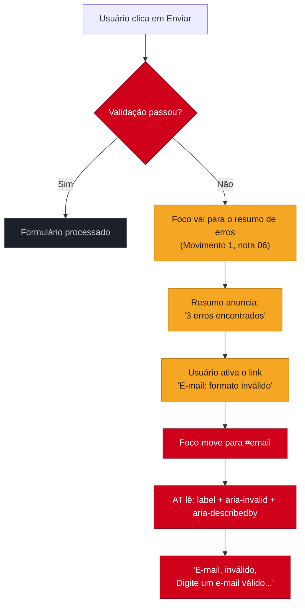

# Formulários acessíveis de verdade

> [!abstract] TL;DR
> Formulário é onde o usuário mais **age** — e onde a inacessibilidade mais **custa**, porque um checkout ou cadastro que exclui alguém exclui uma conversão inteira. Quatro coisas separam um formulário acessível de um bonito-mas-quebrado: todo campo tem um `<label>` **de verdade** (associado, não um texto solto), os campos relacionados são **agrupados** (`<fieldset>`/`<legend>`), os erros são **anunciados** ao leitor de tela e ligados ao campo (`aria-describedby` + `aria-invalid`), e o campo declara seu propósito (`autocomplete`) para preencher sozinho. Nenhum desses exige framework — é HTML que a maioria dos times simplesmente não escreve.

Você já viu o dado na nota 01: texto sem alternativa e contraste baixo dominam as falhas do mundo. Mas quando o assunto é *interação*, o formulário é o campo de batalha — e o placeholder cinza-claro fingindo ser label é o soldado caído mais comum. Vamos construir um formulário que funciona para quem preenche com o dedo, com a voz, com o teclado e com o leitor de tela.

## O label: a fundação que todo mundo pula

A regra é simples e quase sempre desrespeitada: **todo campo de formulário precisa de um `<label>` programaticamente associado**. "Associado" é a palavra-chave — um texto que *parece* um rótulo mas não está ligado ao campo não conta para nada.

```html
<!-- ❌ placeholder NÃO é label: some ao digitar, some para a AT em muitos casos -->
<input type="email" placeholder="E-mail">

<!-- ❌ texto solto ao lado: o olho associa, a AT não -->
<span>E-mail</span>
<input type="email">

<!-- ✅ label associado por `for`/`id`: o accessible name computa "E-mail" -->
<label for="email">E-mail</label>
<input type="email" id="email">

<!-- ✅ label envolvendo o campo: associação implícita, dispensa for/id -->
<label>E-mail <input type="email"></label>
```

Por que o label associado importa tanto? Três razões que se acumulam:

1. **Accessible name.** É o `<label>` que vira o *name* do campo na árvore de acessibilidade (nota 02). Sem ele, o leitor de tela anuncia "campo de edição, em branco" — campo o quê?
2. **Alvo de clique maior.** Clicar no `<label>` associado foca o campo. Isso amplia a área de toque — beneficia deficiência motora *e* qualquer um num celular, o *curb-cut effect* de novo.
3. **Voz.** Quem usa controle por voz diz "clicar em E-mail" — só funciona se o campo *se chama* E-mail.

> [!warning] Placeholder usado como label
> **O que acontece:** o texto de dica some no instante em que o usuário começa a digitar; se ele esquece o que era o campo, não tem como recuperar. Para muitas combinações de leitor de tela, o placeholder nem é anunciado como nome. **Por quê:** `placeholder` é uma *dica de formato*, não um rótulo — a especificação diz isso explicitamente. Seu contraste também costuma ser baixo demais (cinza sobre branco), falhando no critério 1.4.3. **Como evitar:** sempre um `<label>` visível e persistente. O placeholder, se usado, complementa ("ex.: nome@empresa.com"), nunca substitui.

## Agrupando campos relacionados: fieldset e legend

Alguns campos só fazem sentido **em conjunto** — um grupo de rádios para "forma de pagamento", os três campos de um endereço, as opções de um checkbox múltiplo. Para o olho, a proximidade visual já agrupa. Para o leitor de tela, que consome linearmente, é preciso dizer explicitamente onde o grupo começa e o que ele significa:

```html
<fieldset>
  <legend>Forma de pagamento</legend>
  <label><input type="radio" name="pgto" value="cartao"> Cartão</label>
  <label><input type="radio" name="pgto" value="pix"> Pix</label>
  <label><input type="radio" name="pgto" value="boleto"> Boleto</label>
</fieldset>
```

O `<legend>` vira o rótulo do grupo inteiro: o leitor de tela anuncia "Forma de pagamento, Cartão, botão de rádio, 1 de 3". Sem o `<fieldset>`, ele leria só "Cartão, botão de rádio" — o usuário ouve as opções soltas sem saber a *pergunta* que elas respondem. É a diferença entre entender e adivinhar.

## Erros que o leitor de tela realmente ouve

Aqui está o buraco mais sutil e mais frequente. O usuário submete, a validação falha, e a sua UI faz o de sempre: pinta a borda do campo de vermelho e mostra "E-mail inválido" em texto vermelho embaixo. Para quem enxerga, perfeito. Para quem usa leitor de tela, **não aconteceu nada** — a cor vermelha é invisível para a AT, e o texto de erro, se não estiver ligado ao campo, é só um parágrafo perdido que o usuário talvez nunca encontre.

Três atributos costuram o erro à experiência da AT:

```html
<label for="email">E-mail</label>
<input
  type="email"
  id="email"
  aria-invalid="true"
  aria-describedby="email-erro"
>
<p id="email-erro" class="erro">Digite um e-mail válido, como nome@empresa.com.</p>
```

- **`aria-invalid="true"`** marca o campo como errado *na árvore* — o leitor de tela anuncia "inválido" ao entrar no campo, não só a cor.
- **`aria-describedby="email-erro"`** liga o campo ao texto do erro: quando o foco entra no campo, a AT lê o rótulo **e** a descrição do erro junto. O erro deixa de ser um parágrafo órfão e vira parte do campo.
- **Nunca depender só da cor** (critério 1.4.1): a borda vermelha precisa vir acompanhada de texto, ícone ou ambos — quem tem daltonismo não distingue a borda vermelha da normal.

> [!question]- E se vários campos falham de uma vez? Como o usuário sabe?
> Duas camadas. No **campo**, o `aria-describedby`/`aria-invalid` que acabamos de ver. No **formulário**, um **resumo de erros** no topo — uma região que lista "3 erros encontrados: E-mail, Senha, CEP", com cada item sendo um link que **move o foco** para o campo correspondente. Ao submeter com erros, você move o foco para esse resumo (Movimento 1 da nota 06!). Assim o usuário de leitor de tela é avisado imediatamente de que falhou, sabe *quantos* e *quais* erros, e navega direto para cada um — em vez de tabular o formulário inteiro no escuro tentando descobrir o que deu errado.

## Autocomplete: o campo que se preenche sozinho

O atributo `autocomplete` é acessibilidade *e* usabilidade num só. Ao declarar o **propósito** de um campo (`autocomplete="email"`, `"name"`, `"tel"`, `"street-address"`), você permite que o navegador e as tecnologias assistivas preencham automaticamente com os dados que o usuário já tem salvos.

```html
<label for="nome">Nome completo</label>
<input id="nome" name="nome" autocomplete="name">

<label for="cep">CEP</label>
<input id="cep" name="cep" autocomplete="postal-code" inputmode="numeric">
```

Isso importa para acessibilidade por um motivo específico e até normativo: o critério **1.3.5 (Identify Input Purpose, AA)** exige que campos que coletam dados do usuário declarem seu propósito. Para pessoas com deficiência cognitiva ou de memória, preencher um formulário longo de cor é exaustivo e propenso a erro — o `autocomplete` remove esse fardo. E o `inputmode="numeric"` faz o teclado virtual do celular abrir já nos números para um CEP, poupando toques de todo mundo.

## O tipo certo de input faz metade do trabalho

Antes de qualquer ARIA, o **`type` correto** já entrega semântica, teclado adequado e validação nativa de graça — o princípio "semântica primeiro" da nota 05 aplicado a formulários:

- `type="email"` → teclado com `@`, validação de formato nativa.
- `type="tel"` → teclado numérico no celular.
- `type="url"`, `type="number"`, `type="date"` → cada um com seu teclado e sua validação.
- `required` → validação nativa e anúncio de campo obrigatório pela AT, sem `aria-required` manual.

A validação nativa do HTML (assunto do [[03-Dominios/Tecnologia/HTML/06 - Formulários II - validação nativa e UX|HTML/06]]) é acessível por construção — os browsers anunciam as mensagens de erro nativas à AT. Quando você desliga tudo isso para reimplementar validação em JavaScript, assume a responsabilidade de reconstruir a acessibilidade que jogou fora. Às vezes é necessário (mensagens customizadas, estilos consistentes); mas comece pelo nativo e só substitua o que precisar.

**Formulários acessíveis em uma frase:** label associado em todo campo, grupos com fieldset/legend, erros ligados ao campo por `aria-describedby`/`aria-invalid` e nunca só por cor, e `type`/`autocomplete` corretos para o navegador fazer o trabalho pesado.

> [!tip] Vídeo — The art of labeling (A11ycasts #12)
> [**The art of labeling -- A11ycasts #12**](https://www.youtube.com/watch?v=8dCUzOiMRy4) (Chrome for Developers, 14 min) — Rob Dodson mostra, no DevTools, exatamente o que muda na árvore de acessibilidade quando um `<label>` está associado versus quando é só um texto solto ou um placeholder. Ver o *accessible name* aparecer (ou ficar vazio) ao vivo fixa em segundos o que a seção acima explica em palavras.

## Fluxo de erro: do submit ao foco no campo

O texto acima descreve `aria-describedby`/`aria-invalid` campo a campo e o resumo de erros no topo (a resposta ao `[!question]`). O diagrama junta as duas camadas num fluxo só — do clique em "Enviar" até o usuário de leitor de tela pousar no campo certo:



O ponto do diagrama: **erro não é um evento visual, é um evento de foco**. Cada seta que sai de "não passou" move o foco de algum lugar — para o resumo, depois para o campo. Se seu formulário só troca cor de borda e mostra texto sem mexer no foco, metade dessas setas simplesmente não existe para quem usa teclado ou leitor de tela.

## Casos práticos

**1. O placeholder que sumia no meio do preenchimento.** Um formulário de cadastro usava `<input placeholder="Nome completo">` sem `<label>` — visualmente limpo, sem "poluição" de rótulos acima dos campos. No teste com leitor de tela, o campo era anunciado como "campo de edição, em branco": nenhuma pista do que preencher. Pior ainda para quem usa zoom de tela — ao ampliar 200%, o placeholder ficava cortado e o usuário via só um retângulo vazio depois de já ter digitado a primeira letra (o placeholder some ao digitar). A correção não mudou o visual: um `<label>` associado, posicionado via CSS para ficar compacto, resolveu os dois problemas ao mesmo tempo — a AT passou a anunciar o nome do campo, e o rótulo continuou visível depois que o usuário começava a digitar.

**2. O formulário longo que o resumo de erros salvou.** Um cadastro com quinze campos (dados pessoais, endereço, pagamento) validava tudo só no submit final. Sem resumo de erros, um usuário de leitor de tela que errasse o campo 3 tinha que navegar linearmente pelos quinze campos de novo, um a um, tentando descobrir por onde a AT anunciava "inválido" — um exercício de paciência que muita gente simplesmente abandona (é a mesma lógica do dado de abandono de carrinho que abre a nota 01). Depois de implementar o resumo de erros no topo com foco automático (o `[!question]` acima) e os links do resumo apontando direto para cada campo com problema, o mesmo teste passou de "não consigo achar o erro" para "sei exatamente quais três campos revisar" — sem mudar uma linha da lógica de validação, só da experiência de reportar o erro.

## Armadilhas comuns

> [!warning] Erro indicado só pela cor da borda
> **O que acontece:** o campo com problema fica com borda vermelha e o campo válido, cinza ou verde — nenhum texto, nenhum ícone, só a cor. **Por quê:** viola o critério **1.4.1 (Use of Color)**. Quem tem daltonismo (cerca de 1 em 12 homens) não distingue vermelho de cinza com confiança, e a cor é totalmente invisível para quem usa leitor de tela — que não "vê" bordas. **Como evitar:** sempre acompanhar a cor de um texto explícito (`aria-describedby`) e, se quiser reforço visual extra, um ícone. A cor é bônus, nunca o único canal.

> [!warning] `<label>` sem `for`/`id` — associação só visual
> **O que acontece:** o `<label>` existe no HTML, fica exatamente ao lado do campo, o layout parece perfeito — mas falta o par `for`/`id` (ou o envolvimento do input pelo label). Clicar no texto não foca o campo, e o leitor de tela não lê o rótulo ao entrar nele. **Por quê:** a associação programática entre label e campo não é automática por proximidade no DOM — precisa ser declarada. É o erro mais comum de auditoria: "parece certo" no navegador, falha em qualquer teste com AT. **Como evitar:** `for="id-do-campo"` no label + `id` correspondente no input, ou envolver o input pelo próprio `<label>` (associação implícita). Testar clicando no texto do rótulo: se o foco não vai para o campo, a associação está quebrada.

> [!warning] Validação em JavaScript que descarta a acessível nativa
> **O que acontece:** o time desliga `required`/`type="email"` e reimplementa toda a validação em JS puro para ter mensagens customizadas — e esquece de recriar `aria-invalid`, `aria-describedby` e o anúncio da mudança de estado. **Por quê:** a validação nativa do HTML já é acessível por construção (os browsers anunciam suas mensagens à AT de graça); reescrevê-la em JS sem repor essas peças é trocar acessibilidade grátis por acessibilidade que ninguém implementou. **Como evitar:** se precisar de validação customizada, mantenha o contrato: `aria-invalid="true"` no erro, `aria-describedby` apontando pro texto, e uma região com `aria-live` (ou o resumo com foco) anunciando que o estado mudou. Não é proibido sair do nativo — é proibido sair dele sem repor o que ele fazia.

## Como explicar em inglês

When I review a form for accessibility, I don't just check the visual polish — I check whether the label is *programmatically* associated with the input, whether related fields are grouped under a `fieldset` with a proper `legend`, and whether validation errors are actually wired to the field via `aria-describedby` and `aria-invalid`, not just painted red. A form that only looks right is worse than one that looks plain but works, because the "looks right" version passes every design review and still fails every screen reader user. My rule of thumb: never rely on a single channel — color alone, placeholder alone, visual proximity alone — to carry meaning; pair it with something the accessibility tree can pick up.

| PT | EN |
|---|---|
| rótulo associado | associated label |
| nome acessível | accessible name |
| agrupar campos | group fields |
| resumo de erros | error summary |
| ligar o erro ao campo | wire the error to the field |
| depender só da cor | rely on color alone |
| validação nativa | native validation |
| mover o foco | move focus |
| leitor de tela | screen reader |
| propósito do campo | input purpose |

## O que vem a seguir

Com foco e formulários resolvidos, você tem o que o HTML nativo oferece. Mas há componentes que o HTML **não** tem — abas, acordeões, diálogos, comboboxes — e para eles a comunidade padronizou receitas prontas de ARIA + teclado: os padrões da APG. É onde "ARIA por último" (nota 05) finalmente chega, com mapa e tudo.

- [[03-Dominios/Tecnologia/Acessibilidade/Construir Acessível/08 - Padrões WAI-ARIA APG I|08 — Padrões WAI-ARIA APG I]] — disclosure, accordion, tabs e o modal completo.
- [[03-Dominios/Tecnologia/Acessibilidade/Construir Acessível/09 - Padrões WAI-ARIA APG II|09 — Padrões WAI-ARIA APG II]] — combobox, menu, listbox, tree e grid.
- [[03-Dominios/Tecnologia/HTML/06 - Formulários II - validação nativa e UX|HTML 06 — Validação nativa]] — a validação do browser que esta nota recomenda não jogar fora.

## Fontes

- **W3C WAI** — [*Forms Tutorial*](https://www.w3.org/WAI/tutorials/forms/) — a referência oficial de labels, agrupamento, instruções e notificação de erros acessível.
- **MDN Web Docs** — [*The HTML autocomplete attribute*](https://developer.mozilla.org/en-US/docs/Web/HTML/Attributes/autocomplete) — os valores de propósito de campo e o critério 1.3.5.
- **GOV.UK Design System** — [*Error summary*](https://design-system.service.gov.uk/components/error-summary/) — o padrão de resumo de erros no topo, testado com usuários reais.
- **Adam Silver** — [*Form Design Patterns*](https://formdesignpatterns.com/) — livro de referência sobre formulários acessíveis e resilientes.
