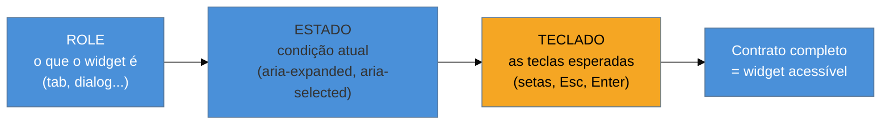

# Padrões WAI-ARIA APG I

> [!abstract] TL;DR
> Quando o HTML não tem o widget que você precisa — abas, acordeão, diálogo modal — você não inventa do zero: consulta o **ARIA Authoring Practices Guide (APG)**, o catálogo oficial do W3C que especifica, para cada widget, exatamente quais roles/states usar e **quais teclas** implementar. Esta nota cobre quatro padrões fundamentais em ordem de complexidade: **disclosure** (mostrar/esconder), **accordion** (vários disclosures coordenados), **tabs** (um painel por vez) e **modal dialog** (a peça que junta tudo o que a nota 06 ensinou sobre foco). O fio comum: cada padrão é um contrato de *role + estado + teclado* que você precisa cumprir por inteiro — meio contrato é pior que nenhum.

A nota 05 disse "ARIA por último". Este é o "por último" chegando. Você esgotou o HTML nativo, precisa de um componente que ele não oferece, e agora ARIA é a ferramenta certa. Mas ARIA à mão-livre é o que produz aquele dado assustador do WebAIM (páginas com ARIA têm o dobro de erros). A saída é não improvisar: o **APG** já resolveu esses widgets, testou com leitores de tela reais, e publicou a receita. Seu trabalho é seguir a receita inteira — não metade.

Cada padrão do APG é um contrato de três partes, e é útil ter esse esqueleto na cabeça antes dos exemplos:



## Disclosure: o mostrar/esconder honesto

O padrão mais simples, e a base de todos os outros. Um **disclosure** é um botão que revela ou oculta um trecho de conteúdo — um "Leia mais", um FAQ que expande, um menu que abre. A tentação é fazer com uma `<div onclick>` que dá `display:none`. O padrão correto usa um `<button>` de verdade com um único atributo de estado:

```html
<button aria-expanded="false" aria-controls="detalhes">
  Detalhes de entrega
</button>
<div id="detalhes" hidden>
  <!-- conteúdo revelado -->
</div>
```

O contrato inteiro:
- **Role:** `button` — de graça, por usar `<button>`. Operável por Enter/Espaço nativamente.
- **Estado:** `aria-expanded` alterna `"false"`/`"true"` a cada clique. É o que faz o leitor de tela anunciar "recolhido"/"expandido". **Este atributo é a alma do padrão** — sem ele, o usuário de AT não sabe se o conteúdo apareceu.
- **`aria-controls`** aponta para o id do conteúdo controlado (relação explícita).
- **Teclado:** nenhum extra — o `<button>` já traz Enter/Espaço.

Toda vez que o JavaScript troca o `hidden` do conteúdo, ele **precisa** trocar o `aria-expanded` na mesma ação. Estado visual e estado ARIA andam juntos — a regra da nota 05.

## Accordion: disclosures em coordenação

Um **accordion** é um conjunto de disclosures agrupados — uma pilha de seções em que cada cabeçalho expande seu painel. Tecnicamente, é o padrão disclosure repetido, com dois cuidados a mais:

- Cada cabeçalho de seção é um `<button>` com seu próprio `aria-expanded` e `aria-controls`, e — detalhe importante — esse botão fica **dentro de um heading** (`<h3><button>...</button></h3>`), para que a navegação por cabeçalhos do leitor de tela (a tecla `H` da nota 03) enxergue a estrutura do accordion.
- O teclado ganha extras opcionais recomendados pela APG: `Seta ↓`/`Seta ↑` movem entre os cabeçalhos, `Home`/`End` vão ao primeiro/último. É o **roving** entre cabeçalhos que a nota 06 introduziu.

> [!question]- Preciso mesmo de ARIA para um accordion? O `<details>`/`<summary>` do HTML não faz isso?
> Ótima intuição — e sim, para o caso simples, o par nativo **`<details>`/`<summary>`** é um disclosure/accordion acessível **de fábrica**, sem uma linha de ARIA. É "semântica primeiro" (nota 05) na veia: se você só precisa de expandir/recolher, use `<details>` e pare por aqui. Você recorre ao padrão ARIA do accordion quando precisa de comportamento que o `<details>` não dá: navegação por setas entre seções, "abrir um fecha os outros", animações controladas, ou integração com um design system. A pergunta honesta antes de escrever ARIA continua sendo "o nativo resolve?".

## Tabs: um painel por vez

O padrão **tabs** (abas) é onde a complexidade sobe e o roving tabindex vira obrigatório. Você tem uma fila de abas e, abaixo, um painel que troca conforme a aba selecionada. O contrato da APG:

```html
<div role="tablist" aria-label="Configurações da conta">
  <button role="tab" aria-selected="true"  aria-controls="p1" id="t1" tabindex="0">Perfil</button>
  <button role="tab" aria-selected="false" aria-controls="p2" id="t2" tabindex="-1">Segurança</button>
</div>
<div role="tabpanel" id="p1" aria-labelledby="t1">…perfil…</div>
<div role="tabpanel" id="p2" aria-labelledby="t2" hidden>…segurança…</div>
```

Repare em cada parte do contrato:
- **Roles:** `tablist` envolve as abas; cada aba é `tab`; cada painel é `tabpanel`. Esse trio não existe no HTML — é o caso legítimo de ARIA.
- **Estado:** `aria-selected="true"` na aba ativa. `aria-controls`/`aria-labelledby` ligam aba↔painel nos dois sentidos.
- **Teclado (o pulo do gato):** o Tab entra na tablist e para na **aba ativa** — só ela tem `tabindex="0"`, as outras `-1` (**roving tabindex** da nota 06). As **setas** movem entre as abas; o Tab, de novo, sai da tablist e vai para o painel. Ou seja: o usuário não tabula aba por aba; ele entra no grupo, escolhe com as setas, e tabula para fora.

Errar o teclado aqui é o erro clássico: gente que faz `role="tab"` mas deixa todas as abas tabuláveis, quebrando a expectativa de que abas se navegam por seta. O role promete um comportamento; o teclado tem que entregá-lo.

## Modal dialog: onde tudo se junta

O **modal dialog** é o padrão que costura esta nota com a 06 — é literalmente o modal que abriu o domínio, agora construído inteiro. O HTML moderno ajuda muito com o elemento nativo **`<dialog>`**, que resolve boa parte do trabalho:

```html
<button id="abrir">Editar perfil</button>

<dialog id="modal" aria-labelledby="modal-titulo">
  <h2 id="modal-titulo">Editar perfil</h2>
  <form method="dialog">
    <!-- campos... -->
    <button value="cancelar">Cancelar</button>
    <button value="salvar">Salvar</button>
  </form>
</dialog>

<script>
  const modal = document.getElementById('modal');
  document.getElementById('abrir').addEventListener('click', () => {
    modal.showModal(); // ✅ nativo: já prende foco, torna o fundo inerte, fecha no Esc
  });
</script>
```

O método `showModal()` do `<dialog>` nativo entrega, de graça, quase tudo que a nota 06 ensinou a fazer à mão:
- **Move o foco** para dentro do diálogo ao abrir.
- **Prende o foco** (*focus trap*) enquanto aberto — o Tab não vaza para o fundo.
- **Torna o resto da página inerte** automaticamente.
- **Fecha no `Esc`** sem código extra.
- Cria o *backdrop* estilizável via `::backdrop`.

O que ainda cabe a você: dar um **nome acessível** ao diálogo (`aria-labelledby` apontando pro título) e — a peça que o nativo *não* garante em todos os cenários — **restaurar o foco** ao botão de origem quando fecha (Movimento 3 da nota 06). Para muitos casos, `<dialog>` + esses cuidados basta, e você não precisa de biblioteca alguma.

> [!warning] `role="dialog"` numa div sem gerência de foco
> **O que acontece:** um "modal" feito com `<div role="dialog">` que aparece na tela mas deixa o foco no fundo, não fecha no Esc e não prende o Tab. Visualmente é um modal; para o teclado é uma armadilha.
> **Por quê:** o `role="dialog"` só muda o que a AT *anuncia* — ele não implementa nenhum comportamento de foco. O role é uma promessa; o comportamento é sua responsabilidade.
> **Como evitar:** prefira o `<dialog>` nativo com `showModal()`. Se precisar de uma div, replique os três movimentos da nota 06 por completo — mover, prender, restaurar — mais Esc e `aria-modal="true"`.

**APG I em uma frase:** disclosure, accordion, tabs e dialog são contratos de role + estado + teclado que o APG já especificou — cumpra o contrato inteiro, e prefira o nativo (`<details>`, `<dialog>`) sempre que ele resolver.

> [!tip] Vídeo — Modais acessíveis, na prática
> [**Accessible Modal Dialogs -- A11ycasts #19**](https://www.youtube.com/watch?v=JS68faEUduk) (Chrome for Developers, 13 min) — Rob Dodson percorre exatamente o contrato desta nota: `role="dialog"`, `aria-labelledby`, mover foco ao abrir, prender o Tab dentro do modal e restaurar foco ao fechar. Foi gravado antes do `<dialog>` nativo amadurecer, o que é útil por outro motivo: mostra na veia *tudo* que `showModal()` hoje resolve de graça — dá pra sentir o tamanho do atalho.

## Casos práticos

**Cenário 1 — accordion de FAQ: `<details>` primeiro, ARIA só se precisar.** Uma página de FAQ com 8 perguntas precisa expandir/recolher cada resposta. A implementação mais rápida — e mais robusta — é uma sequência de `<details><summary>Pergunta</summary><p>Resposta</p></details>`: nenhuma linha de JavaScript, nenhuma linha de ARIA, e o navegador já entrega toggle, teclado (Enter/Espaço no `<summary>`) e semântica para leitores de tela. O padrão ARIA de accordion (com `<h3><button aria-expanded>`, roving entre cabeçalhos) só entra em cena quando o design pede algo que o `<details>` não faz — por exemplo "abrir uma seção fecha as outras" (comportamento *exclusivo*, que exige coordenar o `aria-expanded` de todos os botões a cada clique) ou navegação por setas entre cabeçalhos. Regra prática: comece com `<details>`; migre para o padrão ARIA só quando o `<details>` te impedir de fazer algo específico que o produto exige.

**Cenário 2 — modal de edição com `<dialog>` nativo em vez de div + biblioteca.** Um formulário "Editar perfil" que antes era uma `<div class="modal">` posicionada com CSS, com um pacote de JS de terceiros só para gerenciar foco, ganha o mesmo comportamento trocando para `<dialog>` + `showModal()` (o código da seção anterior). O ganho não é só menos código: é que o focus trap, a inércia do fundo e o fechamento no `Esc` deixam de ser responsabilidade da sua lógica de aplicação e passam a ser contrato do navegador — uma classe inteira de bug ("Tab vazou para trás do modal", "Esc não fecha") deixa de existir porque a plataforma garante. O que sobra pra você fazer à mão é pouco e específico: `aria-labelledby` no título e restaurar o foco ao elemento que abriu o modal quando ele fecha.

## Armadilhas comuns

> [!warning] `aria-expanded` que não acompanha o estado visual
> **O que acontece:** o clique alterna a classe CSS que mostra/esconde o painel, mas o `aria-expanded` do botão fica travado em `"false"` — ou pior, nem existe. Visualmente o conteúdo abriu; para quem usa leitor de tela, o botão continua anunciando "recolhido".
> **Por quê:** os dois estados (visual e ARIA) são setados em lugares diferentes do código, e é fácil trocar um sem lembrar do outro — principalmente quando a lógica de toggle mexe direto no CSS/classList sem passar por uma função central.
> **Como evitar:** centralize o toggle numa única função que sempre muda os dois juntos (`hidden`/classe **e** `aria-expanded`) na mesma linha de execução, nunca em handlers separados.

> [!warning] Reimplementar accordion em ARIA quando `<details>` bastava
> **O que acontece:** um accordion inteiro construído com `<button>`, `aria-expanded`, `aria-controls` e JavaScript de toggle — para um caso de uso que é só "expandir uma seção por vez, sem exclusividade, sem navegação por seta".
> **Por quê:** o padrão ARIA parece "mais robusto" ou "mais profissional" por ter mais código, mas mais código com ARIA manual é mais superfície para o erro anterior (estado dessincronizado) acontecer. O `<details>` já resolve o caso simples sem essa superfície.
> **Como evitar:** aplique o teste da nota 05 — "o nativo resolve?" — antes de escrever um único `aria-*`. Só migre para o padrão ARIA quando o requisito específico (exclusividade, roving, animação controlada) não couber no `<details>`.

> [!warning] Tabs sem roving tabindex — todas as abas tabuláveis
> **O que acontece:** um `role="tablist"` corretamente montado, mas cada `<button role="tab">` mantém seu `tabindex` padrão (0). O usuário de teclado tabula aba por aba, uma de cada vez, em vez de entrar na tablist, mover com as setas, e tabular para fora.
> **Por quê:** o role `tab` promete ao leitor de tela um padrão de navegação por setas — é o comportamento que ele anuncia e que o usuário experiente de AT espera. Sem o roving tabindex (só a aba ativa com `tabindex="0"`, as demais `-1`, e as setas movendo entre elas), o widget tem a aparência de abas mas o comportamento de uma lista de botões comuns — quebra a expectativa que o próprio role criou.
> **Como evitar:** implemente o roving tabindex da nota 06 por completo: `tabindex="0"` só na aba selecionada, `-1` nas demais, e um handler de `keydown` que responde a `ArrowLeft`/`ArrowRight` (ou `ArrowUp`/`ArrowDown` em tabs verticais) movendo o foco e atualizando os `tabindex` a cada mudança.

## Como explicar em inglês

In an interview, this is a good place to show you know *when* to reach for ARIA instead of just *how*. Say something like: "Whenever I need a widget HTML doesn't ship natively — tabs, an accordion, a modal — I don't improvise the markup. I go to the ARIA Authoring Practices Guide, the W3C's reference implementation for each pattern, and I treat it as a three-part contract: the *role* that declares what the widget is, the *state* that tracks what's currently true — expanded, selected, open — and the *keyboard* behavior users expect once they see that role. Half a contract is worse than none, because a `role="tab"` that doesn't respond to arrow keys sets an expectation it then breaks. And before I write any of that by hand, I check whether the native element already covers it — `<details>` for a simple disclosure, `<dialog>` with `showModal()` for a modal — because the platform's focus trap and `Escape` handling are just fewer bugs than mine."

| PT | EN |
|---|---|
| APG (Guia de Práticas de Autoria) | Authoring Practices Guide (APG) |
| disclosure | disclosure |
| acordeão | accordion |
| painel de abas | tabpanel |
| lista de abas | tablist |
| roving tabindex | roving tabindex |
| diálogo modal | modal dialog |
| prender o foco | trap focus |
| tornar inerte | make inert |
| restaurar o foco | restore focus |

## O que vem a seguir

Estes quatro são os padrões de complexidade baixa a média. Faltam os pesos-pesados — os widgets com navegação bidimensional e edição, onde o teclado fica genuinamente intrincado: combobox com autocomplete, menu de aplicação, listbox, tree e grid. É o segundo volume do catálogo.

- [[03-Dominios/Tecnologia/Acessibilidade/Construir Acessível/09 - Padrões WAI-ARIA APG II|09 — Padrões WAI-ARIA APG II]] — combobox, menu, listbox, tree e grid.
- [[03-Dominios/Tecnologia/Acessibilidade/Construir Acessível/10 - A11y em React e component libraries|10 — A11y em React]] — as bibliotecas que implementam esses contratos por você (Radix, React Aria).
- [[03-Dominios/Tecnologia/HTML/08 - ARIA - roles, states, properties e live regions|HTML 08 — ARIA]] — o vocabulário de roles/states que estes padrões usam.

## Fontes

- **W3C WAI** — [*ARIA Authoring Practices Guide — Patterns*](https://www.w3.org/WAI/ARIA/apg/patterns/) — o catálogo normativo de todos os padrões, com exemplos e mapas de teclado.
- **MDN Web Docs** — [*The dialog element*](https://developer.mozilla.org/en-US/docs/Web/HTML/Element/dialog) — o `<dialog>` nativo e o comportamento de `showModal()`.
- **W3C WAI** — [*APG — Disclosure Pattern*](https://www.w3.org/WAI/ARIA/apg/patterns/disclosure/) e [*Tabs Pattern*](https://www.w3.org/WAI/ARIA/apg/patterns/tabs/) — os contratos completos de estado e teclado citados na nota.
- **Scott O'Hara** — [*Accessible components*](https://scottaohara.github.io/a11y_styled_form_controls/) — implementações de referência auditadas dos padrões.
