# A11y em React e component libraries

> [!abstract] TL;DR
> React não te dá acessibilidade nem te tira — ele é neutro, e é justamente essa neutralidade que produz tanta UI React inacessível (`<div onClick>` por toda parte). A boa notícia: para os widgets difíceis da nota 09, você **não** deve implementar o contrato ARIA à mão — bibliotecas **headless** (Radix, React Aria, Base UI, Headless UI) já entregam a lógica, o teclado, o foco e o ARIA testados, deixando o estilo por sua conta. A má notícia: **a biblioteca resolve o widget, não o app**. Você ainda é responsável por nomes acessíveis, ordem de foco na sua composição, semântica das suas próprias telas e por *não quebrar* o que a lib entrega. "Headless" mata 80% do problema; os 20% restantes continuam sendo ofício seu.

Você chegou ao SG2 sabendo construir foco, formulários e os padrões APG. Agora, o ambiente onde você realmente trabalha: React. E a primeira coisa a desfazer é a esperança de que o framework cuide da acessibilidade. Ele não cuida — e não deveria mesmo, porque a11y é sobre *semântica do que você renderiza*, e o React renderiza exatamente o que você mandar, `<div>` genérica inclusive.

## React é neutro — e neutro tende ao inacessível

JSX se parece com HTML, o que dá uma falsa sensação de que a semântica vem junto. Mas o React não te empurra para o elemento certo; ele aceita qualquer coisa. E a cultura do ecossistema — componentizar tudo, estilizar com facilidade — cria uma gravidade em direção à `<div>` clicável:

```jsx
// ❌ o "botão" que a nota 01 desmontou, agora em React
function BotaoExcluir({ onExcluir }) {
  return <div className="btn-perigo" onClick={onExcluir}>🗑️</div>;
  // sem role, fora do tab order, sem Enter/Espaço, sem nome acessível
}

// ✅ elemento nativo: role, foco, teclado e nome de graça — "semântica primeiro" em JSX
function BotaoExcluir({ onExcluir }) {
  return (
    <button type="button" className="btn-perigo" onClick={onExcluir}>
      <span aria-hidden="true">🗑️</span>
      <span className="sr-only">Excluir item</span>
    </button>
  );
}
```

Tudo o que você aprendeu nas notas 01–09 vale **igual** em React — é o mesmo HTML no fim do dia. O `<button>` continua sendo `<button>`; o accessible name ainda se computa pela mesma cascata; o foco ainda precisa ser gerenciado na troca de rota (a nota 06 já mostrou o `useEffect` que faz isso). React não muda as regras; ele só remove os freios, e cabe a você não acelerar ladeira abaixo.

## O que "headless" significa e por que muda o jogo

Aqui está a virada estratégica do SG2. A nota 09 concluiu: não escreva combobox, menu, listbox nem grid do zero. As **bibliotecas headless** (também ditas *unstyled* ou *primitives*) são a resposta. O nome descreve exatamente o que elas fazem: entregam a **cabeça** (a lógica) sem o **rosto** (o estilo).

Uma biblioteca headless resolve, para cada componente, tudo o que é difícil e invisível:

- **Navegação por teclado** completa (as setas, `Home`/`End`, typeahead da nota 09).
- **Gestão de foco** — roving tabindex, `aria-activedescendant`, focus trap em modais, restauração (a nota 06 inteira).
- **Semântica ARIA** — os roles, states e properties corretos do contrato APG.
- **Estado controlado/não-controlado**, RTL, e os edge cases que ninguém lembra.

E deixa por sua conta **exclusivamente o estilo** — você aplica suas classes, seu design system, seu Tailwind. Você fica com a aparência que quiser *e* com a acessibilidade que levaria dias para acertar. É o melhor dos dois mundos que a nota 05 (semântica) e a 09 (contratos) prometiam.

O diagrama abaixo é a linha divisória que vale a pena gravar: tudo que fica à esquerda, a lib headless entrega pronto; tudo à direita continua sendo seu ofício, biblioteca nenhuma resolve por você.

```mermaid
flowchart LR
    subgraph LIB["Biblioteca headless entrega"]
        direction TB
        A["Navegação por teclado<br/>(setas, Home/End, typeahead)"]
        B["Gestão de foco<br/>(roving tabindex, focus trap, restauração)"]
        C["Semântica ARIA<br/>(roles, states, properties do APG)"]
        D["Estado e edge cases<br/>(controlado/não-controlado, RTL)"]
    end

    subgraph DEV["Continua sendo seu ofício"]
        direction TB
        E["Nome acessível<br/>(título, aria-label do conteúdo)"]
        F["Composição e ordem de foco<br/>(entre widgets, troca de rota)"]
        G["Não quebrar o que veio pronto<br/>(div no lugar de elemento focável, role sobrescrito)"]
        H["Semântica das suas telas<br/>(headings, landmarks, formulários)"]
    end

    LIB -.->|"'headless' resolve o widget"| DEV

    style A fill:#4A90D9,color:#fff
    style B fill:#4A90D9,color:#fff
    style C fill:#4A90D9,color:#fff
    style D fill:#4A90D9,color:#fff
    style E fill:#F5A623,color:#000
    style F fill:#F5A623,color:#000
    style G fill:#D0021B,color:#fff
    style H fill:#F5A623,color:#000
```



```jsx
// exemplo com Radix: o contrato ARIA + teclado do "tabs" (nota 08) vem pronto
import * as Tabs from '@radix-ui/react-tabs';

<Tabs.Root defaultValue="perfil">
  <Tabs.List aria-label="Configurações">
    <Tabs.Trigger value="perfil">Perfil</Tabs.Trigger>     {/* role=tab, roving tabindex, setas */}
    <Tabs.Trigger value="seguranca">Segurança</Tabs.Trigger>
  </Tabs.List>
  <Tabs.Content value="perfil">…</Tabs.Content>            {/* role=tabpanel, ligado por aria */}
  <Tabs.Content value="seguranca">…</Tabs.Content>
</Tabs.Root>
```

## O cenário das bibliotecas (julho de 2026)

O ecossistema é vivo e se move rápido, mas dá para mapear as opções por *filosofia*:

| Biblioteca | Origem | Perfil | Quando escolher |
|-----------|--------|--------|-----------------|
| **Radix Primitives** | WorkOS (ex-independente) | 30+ primitivos headless, o que popularizou a categoria | Padrão sólido para a maioria dos times React |
| **React Aria** | Adobe | Os primitivos de a11y mais profundos; i18n e coleções complexas | Quando a11y/internacionalização são requisito de peso; aceita escrever mais código |
| **Base UI** | Criadores de Radix/Floating UI/MUI (mantida pela MUI) | Primitivos unstyled, chegou a v1.0 em 2026 | Camada de primitivos hoje das mais ativamente mantidas |
| **Headless UI** | Time do Tailwind CSS | Componentes de app comuns, alinhado a Tailwind | Já usa Tailwind e quer o básico rápido |
| **shadcn/ui** | Comunidade | Componentes copiar-colar (Tailwind) sobre Radix | Quer código no seu repo, sem dependência de runtime |

> [!info] Este mapa envelhece rápido — confira antes de decidir
> A camada de bibliotecas de UI se move mais depressa que a a11y em si. Em julho de 2026, o Radix foi **adquirido pela WorkOS** e a cadência de atualização de alguns componentes complexos (Combobox, multi-select) desacelerou; o **Base UI** (mantido pela MUI) emergiu como camada de primitivos das mais ativas, com v1.0 estável. Essas posições mudam de ano a ano. O que **não** muda é o critério de escolha abaixo — use-o para reavaliar sejam quais forem os nomes em alta quando você ler isto.

## "Headless" não é "acessível automaticamente"

O erro mais caro que um time comete ao adotar essas libs é achar que instalou acessibilidade. A biblioteca resolve o **widget**; ela não resolve o **seu app**. O que continua 100% seu:

1. **Nome acessível.** O componente `Dialog` da lib prende o foco lindamente — mas se você não passar um título ou `aria-label`, ele anuncia "diálogo" e nada mais. A lib dá o esqueleto; o nome é conteúdo seu.
2. **Composição e ordem de foco.** A lib acerta o teclado *dentro* do widget. A ordem de foco *entre* os seus widgets, o fluxo da sua página, o foco na troca de rota — tudo isso é composição sua, e a nota 06 continua valendo.
3. **Não quebrar o que veio pronto.** É assustadoramente fácil sabotar a acessibilidade da lib: passar um `<div>` onde ela esperava um elemento focável, sobrescrever um `role`, esconder com CSS um foco que ela expôs, aninhar errado. A lib te dá uma base correta; você pode estragá-la.
4. **A semântica das suas próprias telas.** Headings, landmarks, a estrutura do documento, os formulários da nota 07 — nada disso vem de uma biblioteca de widgets. É o HTML da sua aplicação, e é seu.

> [!warning] "Usamos Radix, então somos acessíveis"
> **O que acontece:** o time adota uma lib headless e para de testar a11y, presumindo que está resolvido. Auditoria posterior encontra contraste falho, headings fora de ordem, formulários sem label, nomes acessíveis vazios — nada disso é responsabilidade da lib. **Por quê:** bibliotecas de componentes cobrem a interação de *widgets*, que é uma fatia do WCAG. Contraste, estrutura, conteúdo alternativo e composição ficam fora do escopo delas. **Como evitar:** trate a lib como o que ela é — uma base correta para os widgets difíceis — e mantenha o teste (SG3) sobre o app inteiro. Ferramenta é rede de segurança, não método (nota 01).

## O caso especial: bibliotecas *estilizadas* vs *headless*

Uma distinção que evita escolhas ruins: nem toda "component library" é headless. Kits **estilizados** (Material UI, Chakra, e afins) vêm com aparência pronta *e* com acessibilidade em graus variados — alguns muito bons, outros irregulares. Já os **headless** entregam só o comportamento. E há bibliotecas que são **só estilo** (coleções de CSS/componentes visuais) e não prometem a11y nenhuma — adotar uma dessas achando que resolve acessibilidade é como comprar um carro sem motor porque a lataria é bonita. Antes de adotar qualquer uma, a pergunta é direta: *esta biblioteca documenta e testa acessibilidade, ou só entrega pixels?*

**A11y em React em uma frase:** o framework é neutro (e por isso tende ao inacessível); bibliotecas headless matam o custo dos widgets difíceis entregando lógica+teclado+foco+ARIA, mas nome acessível, composição, estrutura e "não quebrar" continuam sendo seu ofício.

> [!tip] Vídeo — por que trocar componentes próprios por React Aria
> [**Why You Should Use React Aria Components...**](https://www.youtube.com/watch?v=lTPh6NGLAmk) (Jolly Coding, 30 min) — percorre, na prática, exatamente a divisão desta nota: o que dói em construir um combobox/dropdown do zero em React e o que uma lib headless (React Aria, no caso) resolve de fato — versus o que continua sendo decisão de composição do seu app.

## Casos práticos

**Cenário 1 — o `<div onClick>` que passou no code review.** Um card de produto precisa ser clicável (abre a página de detalhe). Alguém escreve `<div className="card" onClick={abrirDetalhe}>…</div>` porque "visualmente já parece um card clicável" e o CSS de cursor `pointer` reforça a ilusão. Passa no review porque *funciona* com o mouse. Só que ninguém navegando por teclado chega até ali — o elemento não entra no tab order, não responde a `Enter`, e um leitor de tela o anuncia como texto solto, não como algo acionável. É o mesmo erro da nota 01, só que reencarnado em JSX: React não impediu, porque React não tem opinião sobre semântica — ele renderizou fielmente a `<div>` que foi pedida. A correção é trocar por `<button>` (ou, se precisa navegar, por um `<a>`/`<Link>`) e reaproveitar o estilo do card por cima do elemento certo.

**Cenário 2 — "adotamos Radix, então terminou".** Um time troca seus modais e menus caseiros por primitivos do Radix e comemora: "agora estamos acessíveis". Três meses depois, uma auditoria (SG3) encontra: contraste de texto abaixo de 4.5:1 no tema escuro, headings pulando de `h1` para `h4` na página de configurações, e dois formulários sem `<label>` associado — nenhum desses problemas tem relação com o Radix, porque nenhum deles é sobre *widget*. O Radix garantiu foco e teclado corretos dentro dos componentes que ele controla; a cor, a estrutura de heading e o markup dos formulários sempre foram, e continuam sendo, decisão da aplicação. Isso é exatamente o `[!warning]` "Usamos Radix, então somos acessíveis" acima, só que acontecendo de verdade em produção.

## Como explicar em inglês

In an interview, this is a distinction worth being precise about: headless UI libraries in React — Radix, React Aria, Base UI — solve *component-level* accessibility. They ship the keyboard interaction, focus management, and ARIA semantics for hard widgets like comboboxes and menus, tested against the APG patterns. What they don't solve is *application-level* accessibility: the accessible name you give each instance, the focus order across your page composition, whether your own markup breaks the contract the library shipped, and the semantic structure of your screens — headings, landmarks, form labels. Adopting a headless library is necessary but not sufficient; teams that stop testing after adopting one are the most common accessibility regression I've seen in React codebases.

| PT | EN |
|----|----|
| biblioteca headless | headless library |
| biblioteca de componentes | component library |
| nome acessível | accessible name |
| semântica | semantics |
| gestão de foco | focus management |
| não quebrar (o contrato) | not breaking (the contract) |
| composição | composition |
| ordem de foco | focus order |
| primitivos (unstyled) | (unstyled) primitives |
| estrutura do documento | document structure |

## O que vem a seguir

Faltam duas dimensões de construir que nenhuma biblioteca de widgets resolve porque não são sobre widgets: a **cor/contraste** (o critério nº 1 em falhas no mundo, e uma decisão de design que precede o componente) e a **mídia/movimento** (vídeo, animação, o que pisca). São as últimas paradas antes de aprender a *provar* que tudo isso funciona, no SG3.

- [[03-Dominios/Tecnologia/Acessibilidade/Construir Acessível/11 - Cor, contraste e visual acessível|11 — Cor, contraste e visual acessível]] — o critério 1.4.3 em profundidade.
- [[03-Dominios/Tecnologia/Acessibilidade/Construir Acessível/12 - Mídia e movimento|12 — Mídia e movimento]] — captions, `prefers-reduced-motion`, conteúdo que pisca.
- [[03-Dominios/Tecnologia/React/index|React — Ecossistema]] — o domínio de React, onde essas bibliotecas de UI também aparecem pela ótica de arquitetura.

## Fontes

- **Adobe** — [*React Aria*](https://react-spectrum.adobe.com/react-aria/) — documentação dos primitivos de acessibilidade mais profundos do ecossistema React.
- **Radix** — [*Radix Primitives — Accessibility*](https://www.radix-ui.com/primitives/docs/overview/accessibility) — como uma lib headless documenta os contratos ARIA/teclado que entrega.
- **GreatFrontend** — [*Top Headless UI libraries for React in 2026*](https://www.greatfrontend.com/blog/top-headless-ui-libraries-for-react-in-2026) — panorama atualizado das opções e do que "headless" cobre.
- **Base UI** — [*Base UI (MUI)*](https://base-ui.com/) — a camada de primitivos unstyled que atingiu v1.0 em 2026.
