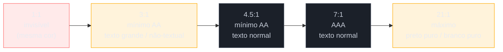
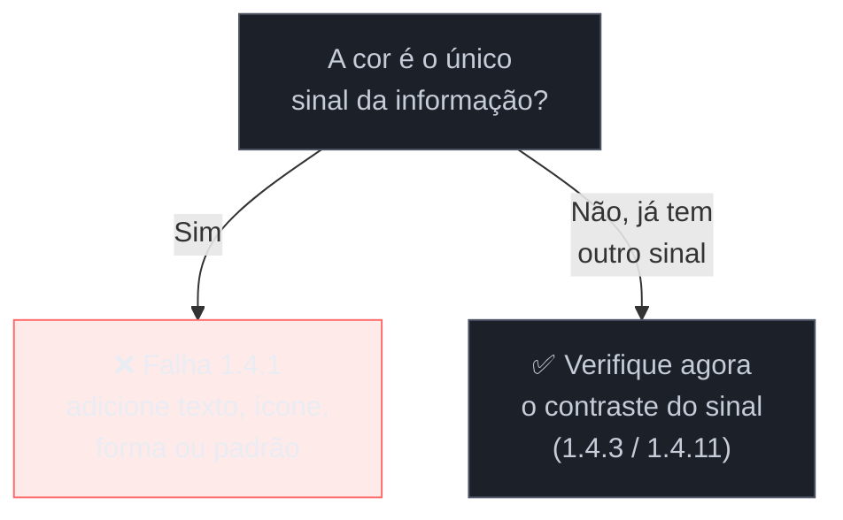

# Cor, contraste e visual acessível

> [!abstract] TL;DR
> Contraste baixo é o **problema de acessibilidade número um do mundo** — 79% das home pages falham nele (nota 01). Não é um detalhe de designer: é o critério **1.4.3 (AA)**, que exige razão de contraste de **4.5:1** para texto normal e **3:1** para texto grande. Ao lado dele, três regras visuais que times esquecem: **nunca codificar informação só na cor** (1.4.1), **contraste também para elementos não-textuais** — bordas de campo, ícones, foco (1.4.11), e um **indicador de foco visível e com contraste** (2.4.7 + 2.4.11/2.4.13 da 2.2). Tudo isso é decisão tomada no design tokens, antes do primeiro componente — consertar depois é repintar a casa inteira.

Este é o único capítulo do SG2 que começa antes do código, na paleta. E é o que mais rende, porque contraste é onde o mundo mais falha e onde o conserto é mais mecânico — desde que feito cedo. A nota 10 avisou: nenhuma biblioteca de widgets resolve cor, porque cor não é um widget, é uma decisão de sistema de design. Vamos torná-la uma decisão informada.

## Razão de contraste: o número que a lei cobra

Contraste, em acessibilidade, não é "achar que está legível" — é uma **razão calculável** entre a luminância da cor do texto e a do fundo, indo de 1:1 (texto invisível, mesma cor) a 21:1 (preto puro sobre branco puro). O WCAG define limiares no critério **1.4.3 Contraste (Mínimo), nível AA**:

| Conteúdo | Razão mínima (AA) | Razão AAA (1.4.6) |
|----------|------------------:|------------------:|
| Texto normal (< 24px, ou < 18.66px se negrito) | **4.5 : 1** | 7 : 1 |
| Texto grande (≥ 24px, ou ≥ 18.66px negrito) | **3 : 1** | 4.5 : 1 |

Texto maior precisa de menos contraste porque a forma da letra, sendo maior, já é mais fácil de distinguir — o limiar acompanha a legibilidade real. O número 4.5:1 não é arbitrário: foi calibrado para cobrir a perda de sensibilidade ao contraste típica de baixa visão moderada e do envelhecimento.

> [!question]- Contraste é para pessoas cegas?
> Não — e essa confusão faz o time despriorizar o item nº 1. Pessoas totalmente cegas usam leitor de tela e não veem cor nenhuma; contraste não as afeta. Contraste é para **baixa visão** (que é muito mais comum que cegueira total), para **daltonismo**, para o olho que **envelhece** (todo mundo, com o tempo), e para a situação — o *curb-cut effect* da nota 01 — de **qualquer pessoa lendo sob sol forte** num celular. Quando você conserta contraste, o maior grupo beneficiado é gente que enxerga, só que mal ou em condição ruim. É o critério mais "para todos" de todo o WCAG.

## A regra que o daltonismo impõe: cor nunca sozinha

O critério **1.4.1 (Uso de Cor, nível A)** diz algo simples e constantemente violado: a cor **não pode ser o único meio** de transmitir informação. Se a única diferença entre "válido" e "inválido" é verde vs. vermelho, quem tem daltonismo (cerca de 1 em 12 homens) não distingue nada.

```html
<!-- ❌ só a cor comunica o erro: daltônico não vê diferença -->
<input class="campo-erro"> <!-- borda vermelha, e nada mais -->

<!-- ✅ cor + texto + ícone: redundância que funciona para todos -->
<input class="campo-erro" aria-invalid="true" aria-describedby="e1">
<p id="e1">⚠️ E-mail inválido</p>
```

Os lugares onde essa regra mais pega:
- **Estados de formulário** — erro/sucesso precisam de texto ou ícone além da cor (conecta com a nota 07).
- **Gráficos e dashboards** — séries distinguidas só por cor excluem daltônicos; use padrões, rótulos diretos, formas.
- **Links no meio do texto** — se um link só se diferencia do texto por ser azul, quem não percebe o azul não sabe que é clicável. Sublinhado (ou outro sinal não-cromático) resolve.
- **"Campos em vermelho são obrigatórios"** — instrução que depende de perceber vermelho; adicione um asterisco ou a palavra "obrigatório".

## Contraste não é só do texto

Um ponto que a versão 2.1 do WCAG trouxe e que muitos ignoram: o critério **1.4.11 (Contraste Não-Textual, AA)** estende a exigência de contraste (mínimo **3:1**) para elementos **não-textuais** essenciais à compreensão ou operação:

- **Bordas de campos de formulário** — um input cuja borda cinza-clarinha mal se distingue do fundo é impossível de localizar para baixa visão.
- **Ícones significativos** — um ícone que carrega informação (o lápis de "editar", o X de "fechar") precisa de contraste com o fundo.
- **Estados de componentes** — o "ligado" de um toggle, a aba selecionada: se o único sinal é uma cor sutil, falha.
- **Indicadores de foco** — que ganham critério próprio, a seguir.

A lição de sistema: contraste é uma propriedade dos seus **design tokens**, não um ajuste por componente. Se as cores de borda, de ícone e de estado forem definidas com 3:1 em mente lá na base, todo componente nasce conforme. Se não, você caça violações uma a uma para sempre.

## Foco visível: o critério que a 2.2 reforçou

O usuário de teclado da nota 06 precisa **ver** onde o foco está — senão navega às cegas. É o que exige o **2.4.7 (Foco Visível, AA)**. E o pecado capital do CSS é justamente apagar esse indicador:

```css
/* ❌ o crime clássico: remove o foco "feio" e cega o usuário de teclado */
:focus { outline: none; }

/* ✅ substitua por um indicador melhor, nunca por nada */
:focus-visible {
  outline: 3px solid #1a56db;
  outline-offset: 2px;
}
```

Dois refinamentos importantes:
- **`:focus-visible`** (em vez de `:focus`) mostra o anel de foco para quem navega por teclado, mas não para cliques de mouse — resolvendo a queixa estética que leva os times a remover o foco. Você atende o teclado *e* mantém o visual limpo no mouse.
- A versão **2.2** endureceu esse território: **2.4.11 (Foco Não Obscurecido)** exige que o elemento focado não fique escondido atrás de headers fixos (o bug do modal, de novo), e **2.4.13 (Aparência do Foco)** define espessura e contraste mínimos para o indicador. Um anel de foco fininho e de baixo contraste tecnicamente "existe" mas não cumpre a função.

> [!warning] `outline: none` sem substituto
> **O que acontece:** o time remove o outline de foco porque "fica feio", e o usuário de teclado perde toda referência de onde está na página — navega apertando Tab no escuro. **Por quê:** o outline é o *único* sinal visual de foco para quem não usa mouse. Removê-lo sem repor é apagar a única bússola do usuário de teclado. **Como evitar:** nunca `outline: none` sozinho. Se o padrão do browser não agrada, desenhe um `:focus-visible` melhor — mais grosso, mais contrastado, com `outline-offset`. Remover é proibido; melhorar é bem-vindo.

## Dark mode e o futuro (APCA)

Dois pontos de fechamento sobre o visual:

- **Dark mode não é imune.** Tema escuro tem suas próprias armadilhas de contraste — texto cinza sobre fundo quase-preto costuma falhar tanto quanto no tema claro. E há um detalhe fino: branco puro (#FFF) sobre preto puro (#000) causa *halation* (o texto "vibra") para algumas pessoas, sobretudo com astigmatismo. A prática é usar um quase-branco sobre um quase-preto. Cada tema precisa passar no 1.4.3 por conta própria — teste os dois.
- **O horizonte: APCA.** O cálculo de contraste atual (a razão simples) é conhecido por imperfeições — ele julga mal certas combinações, especialmente em tema escuro. O **APCA** (*Accessible Perceptual Contrast Algorithm*), sendo experimentado para o WCAG 3.0 (nota 04), modela a percepção de contraste de forma mais fiel. Por enquanto é futuro: **o alvo legal e prático continua sendo o 1.4.3 (4.5:1) da WCAG 2.2**. Conheça o APCA para não se surpreender quando ele chegar, mas construa para a régua de hoje.

**Cor e contraste em uma frase:** contraste é o critério nº 1 em falhas e o mais "para todos" do WCAG — mire 4.5:1 no texto e 3:1 no resto, nunca comunique só por cor, e jamais apague o indicador de foco; tudo decidido nos design tokens, não por componente.

> [!tip] Vídeo — Como checar cores acessíveis
> [**How to check for accessible colors — A11ycasts #17**](https://www.youtube.com/watch?v=LBmLspdAtxM) (Chrome for Developers, 10 min) — Rob Dodson mostra, na prática, como usar o DevTools do Chrome para medir a razão de contraste de qualquer par de cores e ajustar até passar no 4.5:1/3:1 — o mesmo fluxo mental descrito nesta nota, só que com o mouse na mão.

## Escala de contraste e a decisão "só cor?"

A razão de contraste é uma reta contínua — 1:1 é invisível, 21:1 é o extremo teórico (preto puro sobre branco puro). Os limiares do WCAG marcam pontos nessa reta, e vale ter o mapa mental de onde cada um cai:



E antes mesmo de medir contraste, uma pergunta binária resolve boa parte dos casos do 1.4.1:



## Casos práticos

**Dashboard com séries só por cor.** Um painel de métricas mostra três linhas num gráfico — receita, custo, margem — cada uma numa cor diferente, sem legenda direta no gráfico, só uma legenda lateral pareando cor a nome. Funciona para quem enxerga cor normalmente. Para 1 em 12 homens com daltonismo, duas das três linhas podem parecer a mesma cor, e a leitura do gráfico simplesmente quebra — não é que fique "mais difícil", é que a informação desaparece. A correção é a mesma regra do 1.4.1 aplicada a gráfico: rótulo direto na ponta de cada linha (sem precisar caçar na legenda), ou padrões de traço (sólido/tracejado/pontilhado) somados à cor, ou marcadores de forma diferente em cada série.

**`outline: none` que cegou a navegação por teclado.** Um formulário de checkout teve o outline padrão do browser removido em um reset de CSS genérico (`* { outline: none; }`), porque "quebrava o visual" com o azul default do Chrome. Ninguém testou depois só com o teclado. Resultado: quem navega por Tab perde toda referência de onde está — clica errado, pula campos, ou trava sem saber usar mouse. A correção segue o padrão desta nota: trocar o reset cru por um `:focus-visible` desenhado (cor de marca, `outline-offset`, espessura de acordo com o 2.4.13), preservando o visual limpo no clique de mouse e devolvendo a bússola a quem usa teclado.

## Armadilhas comuns

> [!warning] `outline: none` sem substituto
> **O que acontece:** o time remove o outline de foco porque "fica feio", e o usuário de teclado perde toda referência de onde está na página — navega apertando Tab no escuro. **Por quê:** o outline é o *único* sinal visual de foco para quem não usa mouse. Removê-lo sem repor é apagar a única bússola do usuário de teclado. **Como evitar:** nunca `outline: none` sozinho. Se o padrão do browser não agrada, desenhe um `:focus-visible` melhor — mais grosso, mais contrastado, com `outline-offset`. Remover é proibido; melhorar é bem-vindo.

> [!warning] Texto secundário/placeholder cinza-claro demais
> **O que acontece:** "texto de apoio" — placeholder de input, legenda de campo, texto desabilitado — recebe um cinza-claro "discreto" que passa longe do 4.5:1, porque a hierarquia visual (destacar o principal, apagar o secundário) é perseguida a qualquer custo de contraste. **Por quê:** placeholder e texto secundário ainda são texto que carrega instrução ou contexto — o WCAG não abre exceção de contraste para eles só porque a intenção de design é "discreto". E placeholder tem um problema a mais: ele some quando o usuário digita, então também não pode ser a única fonte da instrução (conecta com o 1.3.1 da nota 07). **Como evitar:** hierarquia visual se faz com peso de fonte, tamanho e espaçamento — não com contraste abaixo do mínimo. Meça o cinza "discreto" no mesmo checker que mede o texto principal; se falhar o 4.5:1, escureça.

> [!warning] Branco puro sobre preto puro no dark mode
> **O que acontece:** o tema escuro usa `#FFFFFF` de texto sobre `#000000` de fundo — no papel, 21:1, contraste máximo possível — mas para parte dos usuários (sobretudo com astigmatismo) o texto parece "vibrar" ou borrar, um efeito chamado *halation*. **Por quê:** contraste máximo não é sinônimo de conforto de leitura; o WCAG mede legibilidade mínima, não confabilidade em pixels contíguos de luminância extrema — halation é um efeito óptico à parte, não capturado pela razão de contraste. **Como evitar:** em dark mode, prefira quase-branco (algo como `#E8E8E8`–`#F0F0F0`) sobre quase-preto (`#121212`–`#1A1A1A`) em vez dos extremos puros. Ainda passa folgado no 4.5:1 e evita o efeito de vibração.

## Como explicar em inglês

In an interview, this is the kind of detail that signals you've actually shipped accessible UI, not just read about it: you'd say something like *"Color contrast is the single most common accessibility failure on the web, so we treat it as a design-token decision, not a per-component fix — every text and border color pair is checked against WCAG's 4.5:1 ratio for normal text and 3:1 for large text and non-text elements like form borders and icons. We also never encode meaning in color alone — error states get an icon and text, not just a red border — and we replace `outline: none` with a deliberate `:focus-visible` style instead of just deleting the browser default, so keyboard users never lose track of where they are."* That single sentence covers 1.4.3, 1.4.1, 1.4.11 and 2.4.7 — the four criteria this note is built on — in language a non-accessibility interviewer will still follow.

| PT | EN |
|----|----|
| Razão de contraste | Contrast ratio |
| Indicador de foco | Focus indicator |
| Daltonismo | Color blindness / color vision deficiency |
| Contraste não-textual | Non-text contrast |
| Cor nunca sozinha | Color is never the only cue |
| Baixa visão | Low vision |
| Tema escuro | Dark mode |
| Efeito de vibração (halation) | Halation |
| Design tokens | Design tokens |
| Texto grande / texto normal | Large text / normal text |

## O que vem a seguir

Falta a última dimensão de construir: o conteúdo que não é texto nem widget — **vídeo, áudio e movimento**. Legendas para quem não ouve, alternativas para quem não pode ver a animação, e o respeito a quem sente mal-estar com movimento. Depois dela, o SG2 fecha e a trilha vira para *provar* que tudo isto funciona.

- [[03-Dominios/Tecnologia/Acessibilidade/Construir Acessível/12 - Mídia e movimento|12 — Mídia e movimento]] — captions, transcrições, `prefers-reduced-motion`, conteúdo que pisca.
- [[03-Dominios/Tecnologia/Acessibilidade/Auditar e Testar/13 - Auditoria automatizada|13 — Auditoria automatizada]] — as ferramentas que detectam falhas de contraste em massa.
- [[03-Dominios/Tecnologia/Acessibilidade/Fundamentos e Modelo Mental/04 - WCAG 2.2 pelo ofício|04 — WCAG 2.2 pelo ofício]] — o critério 1.4.3 no contexto da régua completa.

## Fontes

- **W3C** — [*Understanding SC 1.4.3: Contrast (Minimum)*](https://www.w3.org/WAI/WCAG22/Understanding/contrast-minimum.html) — a definição normativa das razões 4.5:1 e 3:1.
- **W3C** — [*Understanding SC 1.4.1: Use of Color*](https://www.w3.org/WAI/WCAG22/Understanding/use-of-color.html) — por que a cor nunca pode ser o único meio.
- **WebAIM** — [*Contrast Checker*](https://webaim.org/resources/contrastchecker/) — a ferramenta prática para calcular a razão de qualquer par de cores.
- **Myndex / APCA** — [*APCA in a Nutshell*](https://git.apcacontrast.com/documentation/APCA_in_a_Nutshell) — o algoritmo perceptual em experimentação para o WCAG 3.0.
