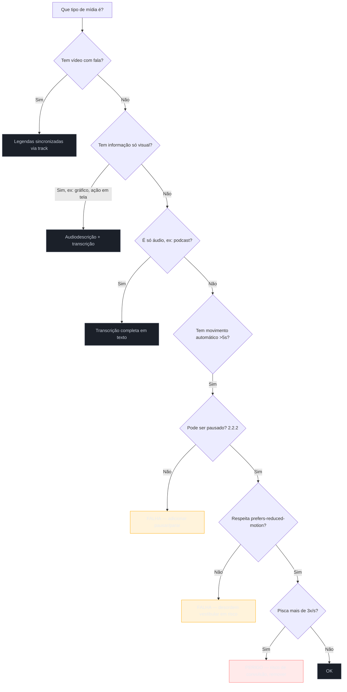

# Mídia e movimento

> [!abstract] TL;DR
> Todo conteúdo que não é texto precisa de uma **alternativa em texto ou controle equivalente**: vídeo precisa de **legendas** (para quem não ouve) e, idealmente, **transcrição** e **audiodescrição** (para quem não vê); áudio precisa de transcrição; nada com som pode depender só do som. E o **movimento** tem duas exigências firmes: animações longas ou automáticas precisam poder ser **pausadas** (2.2.2), e você deve respeitar `prefers-reduced-motion` de quem pediu menos movimento — porque para pessoas com desordens vestibulares, uma transição exuberante causa náusea real, não só incômodo. Acima de tudo: **nada pode piscar mais de 3 vezes por segundo** (2.3.1), sob risco de desencadear convulsões.

Última parada do SG2, e a que sai do território de texto e widgets para o de vídeo, som e animação. É onde a acessibilidade encontra o conteúdo mais rico — e onde a exclusão pode ser não só frustrante, mas fisicamente perigosa. Vamos do vídeo ao pixel que pisca.

## A regra-mãe: toda mídia precisa de alternativa

O princípio **Perceptível** do POUR (nota 04) tem um mandamento central: se a informação chega por um sentido, precisa haver um caminho para quem não dispõe daquele sentido. Traduzido para mídia:

| Mídia | Quem fica de fora sem alternativa | Alternativa necessária |
|-------|-----------------------------------|------------------------|
| Vídeo com fala | Surdos, ambiente sem som | **Legendas** (captions) sincronizadas |
| Vídeo com informação visual | Cegos, baixa visão | **Audiodescrição** + transcrição |
| Áudio / podcast | Surdos | **Transcrição** em texto |
| Imagem informativa | Cegos | Texto alternativo (`alt`, nota já vista no HTML) |

O WCAG detalha isso na diretriz 1.2 (critérios 1.2.1 a 1.2.5), mas a régra prática cabe numa frase: **nenhuma informação essencial pode existir só numa forma que exclua um sentido**.

## Legendas não são transcrição (e não são iguais entre si)

Três termos que os times confundem, e a confusão gera entrega errada:

- **Legendas (captions)** — texto **sincronizado** com o vídeo, sobreposto na hora certa. *Legendas para surdos e ensurdecidos (SDH/closed captions)* incluem não só a fala mas também sons relevantes ("[música tensa]", "[porta batendo]") — porque quem não ouve precisa saber que houve um som significativo, não só o que foi dito. Diferem das *legendas de tradução*, que só vertem a fala de um idioma para outro e presumem que você ouve o resto.
- **Transcrição** — o texto **completo** do conteúdo, num bloco à parte, **não** sincronizado. Serve para ler no lugar de assistir, para buscar (Ctrl+F), e é a única alternativa viável para conteúdo **só de áudio** (podcast). Beneficia também quem prefere ler a ouvir — *curb-cut effect*.
- **Audiodescrição** — uma faixa de narração que descreve o que acontece **visualmente** nas pausas do diálogo ("ela abre a carta e empalidece"), para quem não vê a tela. É a alternativa mais trabalhosa e a mais esquecida.

> [!question]- Legenda automática do YouTube já não resolve?
> Ajuda, mas não basta sozinha para conteúdo essencial. As legendas automáticas (ASR) erram nomes, termos técnicos, pontuação, e não marcam quem fala nem os sons não-verbais — e uma legenda errada pode ser pior que nenhuma, porque transmite informação falsa com aparência de confiável. Para conteúdo importante (um curso, um vídeo institucional, uma aula), a legenda automática é o **rascunho**, não a entrega: alguém revisa. Para conteúdo casual, a automática é um piso aceitável. A régua é a mesma de sempre — proporcional à criticidade do conteúdo.

No HTML, o elemento `<track>` embute legendas num `<video>` nativo:

```html
<video controls>
  <source src="aula.mp4" type="video/mp4">
  <track kind="captions" src="aula-pt.vtt" srclang="pt" label="Português" default>
</video>
<!-- + link para a transcrição completa em texto, próximo ao vídeo -->
```

## Movimento que pode ser pausado

Passando do conteúdo para a **interface animada**. Carrosséis que giram sozinhos, banners que deslizam, textos que rolam automaticamente — tudo que se move, pisca ou rola por mais de **5 segundos** e começa **automaticamente** cai no critério **2.2.2 (Pausar, Parar, Ocultar, nível A)**: o usuário precisa poder **parar** o movimento.

Por quê? Movimento automático prejudica vários grupos ao mesmo tempo: quem tem TDAH ou dificuldade de atenção é constantemente puxado pelo que se mexe; quem lê devagar não termina antes do carrossel trocar; quem usa leitor de tela pode ter o conteúdo mudando sob seus pés. Um carrossel sem botão de pausa é hostil a todos eles. A correção é banal — um botão pausa/play — e quase nunca implementada.

## `prefers-reduced-motion`: respeitando o sistema vestibular

Aqui está a exigência que mais surpreende quem nunca ouviu falar. Para pessoas com **desordens vestibulares**, movimento na tela — um *parallax* exuberante, um zoom brusco, uma transição de página que voa — pode causar **tontura, náusea e enxaqueca de verdade**, o mesmo mecanismo do enjoo de movimento. Não é preferência estética; é resposta fisiológica.

Os sistemas operacionais oferecem uma configuração de "reduzir movimento", e o navegador a expõe via *media query* `prefers-reduced-motion`. Respeitá-la é trivial e transforma a experiência de quem precisa:

```css
/* animação padrão, exuberante */
.card { transition: transform 300ms ease; }
.modal { animation: slide-in 400ms; }

/* para quem pediu menos movimento: corta ou reduz drasticamente */
@media (prefers-reduced-motion: reduce) {
  *,
  *::before,
  *::after {
    animation-duration: 0.01ms !important;
    animation-iteration-count: 1 !important;
    transition-duration: 0.01ms !important;
    scroll-behavior: auto !important;
  }
}
```

A boa prática de sistema: projete as animações como **enriquecimento** que pode ser removido sem quebrar a função. Se apagar todas as transições torna o app inutilizável, a animação estava carregando informação que deveria estar na estrutura. O critério relacionado **2.3.3 (Animação a partir de Interações, AAA)** formaliza isso, mas mesmo em nível AA respeitar a preferência é padrão de ofício hoje.

## O limiar perigoso: nada pisca acima de 3 Hz

Terminamos no critério mais sério de todo o WCAG, porque a falha aqui não é inconveniência — é **risco de saúde**. O critério **2.3.1 (Três Flashes ou Abaixo do Limiar, nível A)** proíbe qualquer conteúdo que **pisque mais de três vezes por segundo**, a menos que os flashes sejam pequenos e de baixo contraste.

O motivo é a **epilepsia fotossensível**: flashes rápidos, sobretudo em vermelho saturado e ocupando área grande da tela, podem **desencadear convulsões** em pessoas suscetíveis. Não é hipotético — há casos documentados de conteúdo web e até de ataques deliberados com GIFs piscantes contra pessoas com epilepsia.

> [!warning] Conteúdo que pisca acima de 3 vezes por segundo
> **O que acontece:** uma animação, GIF, vídeo ou efeito que pisca rápido (> 3 Hz) em área significativa da tela pode desencadear uma convulsão em quem tem epilepsia fotossensível. **Por quê:** o cérebro fotossensível responde a estímulos luminosos rápidos e rítmicos com atividade elétrica anormal. É um risco físico real, não um desconforto. **Como evitar:** não crie conteúdo que pisque acima de 3 vezes por segundo, ponto. Se receber mídia de terceiros (um anúncio, um GIF de usuário), teste com uma ferramenta como o **PEAT** (Photosensitive Epilepsy Analysis Tool) antes de publicar. Este é o critério onde "não sabíamos" não é desculpa aceitável.

**Mídia e movimento em uma frase:** toda mídia precisa de alternativa em texto (legenda, transcrição, audiodescrição), todo movimento automático precisa poder parar e respeitar `prefers-reduced-motion`, e nada — jamais — pode piscar mais de três vezes por segundo.

> [!tip] Vídeo — Desenhando animação e movimento acessíveis
> [**Designing accessible animation and movement on your website**](https://www.youtube.com/watch?v=r6W1hf7xcrs) (Pope Tech, 4 min) — curto e direto: por que movimento automático prejudica quem tem TDAH, dislexia ou desordem vestibular, e como aplicar `prefers-reduced-motion` na prática sem esvaziar a interface.

## Qual alternativa para qual mídia

O fluxo de decisão que evita o erro mais comum — escolher a alternativa errada (ou nenhuma) para o tipo de mídia:



## Casos práticos

**Carrossel institucional sem botão de pausa.** Uma home trocava de banner a cada 4 segundos, automaticamente, sem controle visível. Quem lia o segundo banner via o conteúdo sumir no meio da frase; um usuário de leitor de tela relatou que o foco "pulava" porque o DOM do carrossel era reconstruído a cada troca. A correção não exigiu redesenho: um botão pausa/play discreto no canto do componente, que já existia na biblioteca de carrossel usada — só não estava exposto na UI. Depois de ativado, o critério 2.2.2 passou a ser cumprido sem tocar em uma linha de CSS de animação.

**Transição *parallax* que virou motivo de reclamação.** Uma página de produto usava rolagem com camadas em velocidades diferentes (parallax) para dar profundidade. Um usuário reportou tontura e náusea ao navegar pela página no celular — um sintoma clássico de desordem vestibular reagindo a movimento visual desalinhado com o movimento físico esperado. A equipe não removeu o efeito (era decisão de marca), mas envolveu toda a lógica de parallax num bloco condicionado a `@media (prefers-reduced-motion: no-preference)`, deixando rolagem normal, sem camadas, para quem tem a preferência de sistema ativada. Zero reclamações depois — e zero retrabalho visual para quem não ativou a preferência.

## Armadilhas comuns

> [!warning] Legenda automática do YouTube tratada como entrega final
> **O que acontece:** um vídeo institucional ou de curso é publicado só com a legenda automática (ASR) gerada pelo YouTube, sem revisão humana. **Por quê:** a legenda automática erra nomes próprios, jargão técnico e pontuação, e não identifica quem fala nem sons não-verbais relevantes — ela é otimizada para "dar uma ideia", não para ser fiel. Para conteúdo essencial (treinamento, aula, comunicado oficial), uma legenda errada transmite informação falsa com aparência de confiável, o que é pior do que a ausência de legenda em alguns cenários. **Como evitar:** trate a legenda automática como rascunho, não como entrega. Revise manualmente (ou contrate revisão) antes de publicar conteúdo crítico; reserve a automática pura para conteúdo casual e de baixo risco.

> [!warning] Carrossel ou banner automático sem controle de pausa
> **O que acontece:** um componente troca de slide sozinho a cada N segundos, sem nenhum botão visível para parar, pausar ou ocultar o movimento — o padrão mais comum de violação do critério 2.2.2. **Por quê:** quem tem dificuldade de atenção é distraído pelo movimento contínuo; quem lê devagar nunca termina o slide antes da troca; e o conteúdo pode mudar sob o foco de quem navega por teclado ou leitor de tela, quebrando a previsibilidade da interface. **Como evitar:** todo movimento automático que dura mais de 5 segundos precisa de um controle equivalente a pausa/play, visível e operável por teclado. Muitas bibliotecas de carrossel já têm essa API pronta — o problema costuma ser não expô-la na UI, não a ausência da funcionalidade.

> [!warning] Conteúdo que pisca acima de 3 vezes por segundo
> **O que acontece:** uma animação, GIF, vídeo ou efeito que pisca rápido (> 3 Hz) em área significativa da tela pode desencadear uma convulsão em quem tem epilepsia fotossensível. **Por quê:** o cérebro fotossensível responde a estímulos luminosos rápidos e rítmicos com atividade elétrica anormal. É um risco físico real, não um desconforto. **Como evitar:** não crie conteúdo que pisque acima de 3 vezes por segundo, ponto. Se receber mídia de terceiros (um anúncio, um GIF de usuário), teste com uma ferramenta como o **PEAT** (Photosensitive Epilepsy Analysis Tool) antes de publicar. Este é o critério onde "não sabíamos" não é desculpa aceitável.

> [!warning] Animação sem fallback quando `prefers-reduced-motion` não é respeitado
> **O que acontece:** o time implementa animações vistosas de transição de página, hover e scroll, mas nunca testa (nem trata) a preferência de sistema `prefers-reduced-motion` — a interface se move do mesmo jeito para quem pediu menos movimento. **Por quê:** a preferência existe justamente porque parte dos usuários tem uma condição fisiológica (desordem vestibular) que responde ao movimento com náusea real, não só desconforto estético. Ignorá-la equivale a ignorar um requisito de acessibilidade ativo, não um "nice to have" de design. **Como evitar:** trate `@media (prefers-reduced-motion: reduce)` como parte do sistema de design, não como afterthought — um bloco CSS global (como o do exemplo acima) que zera `animation-duration`/`transition-duration` cobre a maior parte dos casos com uma implementação só. Teste ativando a preferência no SO ou emulando pelo DevTools do navegador.

## Como explicar em inglês

*When you're asked how you handle accessible media in an interview, the key move is distinguishing three alternatives that non-specialists tend to conflate: captions are time-synced text overlaid on video, a transcript is the full text on its own — the only viable alternative for audio-only content — and audio description is a narration track that fills in visually-only information during natural pauses in dialogue. On the motion side, the two things to name are the WCAG 2.2.2 pause requirement for anything that moves automatically for more than five seconds, and honoring the user's `prefers-reduced-motion` system setting, because for people with vestibular disorders, unexpected motion isn't just annoying — it can trigger real vertigo and nausea. And if you only remember one number, make it three: nothing on the page should flash more than three times per second, because that's the threshold tied to photosensitive epilepsy.*

| PT | EN |
|----|----|
| Legendas sincronizadas | Captions |
| Legendas para surdos e ensurdecidos | SDH / closed captions |
| Legendas de tradução | Translated subtitles |
| Transcrição | Transcript |
| Audiodescrição | Audio description |
| Movimento reduzido (preferência) | Reduced motion (preference) |
| Desordem vestibular | Vestibular disorder |
| Epilepsia fotossensível | Photosensitive epilepsy |
| Limiar de flashes | Flash threshold |
| Pausar, parar, ocultar | Pause, stop, hide |

## O que vem a seguir

Com esta nota, o SG2 fecha: você sabe construir foco, formulários, os padrões APG, a11y em React, cor/contraste e mídia. Sabe *fazer* acessível. Falta o rigor de *provar* que fez — porque "acho que está acessível" não é auditoria. O SG3 é dedicado a isso: as ferramentas automáticas e seus limites, os testes de a11y no código, e a auditoria manual que pega o que a máquina não vê.

- [[03-Dominios/Tecnologia/Acessibilidade/Auditar e Testar/index|SG3 — Auditar e Testar]] — o próximo sub-galho: provar que funciona.
- [[03-Dominios/Tecnologia/Acessibilidade/Auditar e Testar/13 - Auditoria automatizada|13 — Auditoria automatizada]] — axe, Lighthouse, WAVE e o teto da automação.
- [[03-Dominios/Tecnologia/Acessibilidade/Construir Acessível/11 - Cor, contraste e visual acessível|11 — Cor e contraste]] — a nota irmã sobre o outro lado do visual.

## Fontes

- **W3C** — [*Understanding SC 1.2.2: Captions (Prerecorded)*](https://www.w3.org/WAI/WCAG22/Understanding/captions-prerecorded.html) — a exigência de legendas e a distinção de audiodescrição (1.2.5).
- **W3C** — [*Understanding SC 2.3.1: Three Flashes or Below Threshold*](https://www.w3.org/WAI/WCAG22/Understanding/three-flashes-or-below-threshold.html) — o limiar de flashes e a epilepsia fotossensível.
- **MDN Web Docs** — [*prefers-reduced-motion*](https://developer.mozilla.org/en-US/docs/Web/CSS/@media/prefers-reduced-motion) — a media query e a implementação de movimento reduzido.
- **WebAIM** — [*Captions, Transcripts, and Audio Descriptions*](https://webaim.org/techniques/captions/) — as diferenças práticas entre os três tipos de alternativa de mídia.
