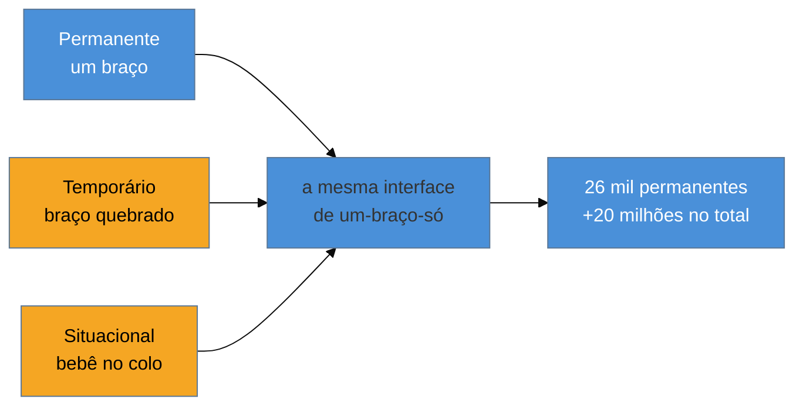

# A11y é ofício, não checklist

> [!abstract] TL;DR
> Acessibilidade não é uma etapa de QA no fim do sprint — é uma **decisão de implementação tomada em cada componente**. Tratá-la como checklist explica por que **94,8% das home pages** do mundo falham em WCAG mesmo com times competentes: o checklist chega tarde demais, quando a arquitetura já cristalizou a exclusão. Este é o primeiro deslocamento mental do domínio: parar de perguntar "isso passa no linter?" e começar a perguntar "**quem não consegue usar isto, e por quê?**". A recompensa não é só ética ou legal — é o *curb-cut effect*: o que você conserta para quem mais precisa melhora o produto para todo mundo.

Imagine que o time terminou a feature na sexta. Tudo funciona: você clica, preenche, envia, recebe o toast de sucesso. Na segunda, sobe pra produção. Três semanas depois, chega um chamado: um usuário não consegue finalizar o cadastro. Ele navega só por teclado — uma lesão no punho o impede de usar o mouse — e o foco do teclado, ao abrir o modal de confirmação, simplesmente *desaparece* atrás do overlay. Ele não vê onde está. Não há bug no sentido clássico: nenhuma exceção, nenhum log vermelho, nenhum teste quebrado. A feature está "pronta". E, ainda assim, está quebrada para uma fatia inteira de gente.

Esse chamado é o retrato do problema central deste domínio. A acessibilidade não falha por incompetência técnica; falha porque foi tratada como **verificação** (algo que se checa no fim) quando ela é **construção** (algo que se decide no começo). Quando o modal foi escrito, alguém escolheu uma `
` com `onClick` em vez de um elemento focável, escolheu não gerenciar o foco, escolheu não testar com o teclado. Cada uma dessas escolhas foi tomada *durante o código* — e nenhum checklist de sexta-feira desfaz uma arquitetura de segunda.

## O tamanho real do problema

Antes de falar de técnica, vale calibrar a escala. Segundo a Organização Mundial da Saúde, **1,3 bilhão de pessoas** — cerca de **16% da população mundial, uma em cada seis** — vive com alguma deficiência significativa. Isso não é um nicho. É um mercado do tamanho da China, e é gente que precisa comprar, estudar, trabalhar, se informar e usar governo digital como qualquer outra.

Agora o outro lado, o do produto que essas pessoas encontram. O relatório **WebAIM Million de 2025** — que roda uma auditoria automatizada nas um milhão de home pages mais acessadas do mundo — encontrou falhas de WCAG detectáveis em **94,8% delas**. E não são falhas exóticas: **seis problemas recorrentes concentram 96% de todos os erros**. Os dois campeões são banais — texto com contraste baixo demais (em 79% das páginas) e imagens sem texto alternativo (55%, das quais 44% são imagens que também são links, o que arrebenta a navegação de quem usa leitor de tela).

> [!question]- Se o problema é tão comum e tão básico, por que não está resolvido?
> Justamente porque é tratado como checklist. Contraste e `alt` são triviais de *checar* e triviais de *consertar isoladamente* — mas aparecem aos milhares porque a decisão foi empurrada pro fim. Ninguém audita 1.257 elementos (a complexidade média de uma home page hoje) um a um na sexta. A conta só fecha quando a acessibilidade entra *no momento em que cada elemento é escrito*. Checklist não escala; ofício sim.

## O mito do "usuário cego"

Quando um time ouve "acessibilidade", a imagem mental costuma ser uma só: uma pessoa cega usando leitor de tela. Essa imagem não está errada — está *incompleta*, e a incompletude é cara, porque faz o time subestimar quantas pessoas a exclusão atinge e por quais motivos.

A deficiência tem pelo menos quatro grandes eixos, e cada um exige coisas diferentes da interface:

- **Visual** — cegueira, baixa visão, daltonismo. Depende de leitor de tela, contraste, zoom, de *não* codificar informação só na cor.
- **Motora** — impossibilidade ou dificuldade de usar mouse; tremores; uso de switch ou controle por voz. Depende de tudo ser operável por teclado, de alvos de clique grandes, de não exigir gestos precisos.
- **Auditiva** — surdez, perda parcial. Depende de legendas, transcrições, de não usar som como único sinal.
- **Cognitiva** — dislexia, TDAH, deficiência intelectual, sobrecarga. Depende de linguagem clara, layout previsível, de não impor limites de tempo cruéis.

Reduzir tudo isso ao "usuário cego" é como reduzir "performance" a "tempo de carregamento": você conserta uma dimensão e acha que terminou.

## O espectro: permanente, temporário, situacional

Aqui está o deslocamento que mais muda a forma de pensar. A Microsoft, no seu framework de *Inclusive Design*, propõe enxergar cada deficiência como um **espectro** de três estados — não como um rótulo binário que a pessoa tem ou não tem.

Pegue o eixo motor, "usar um único braço":

| Estado | Duração | Exemplo |
|--------|---------|---------|
| **Permanente** | Para sempre | Pessoa com amputação de um braço |
| **Temporário** | Semanas/meses | Braço quebrado, engessado |
| **Situacional** | Minutos/horas | Pai ou mãe segurando um bebê no colo |

A interface que funciona com um braço só serve às três. O mesmo vale para os outros eixos: alguém cego / alguém em recuperação de cirurgia ocular / alguém dirigindo ao sol com o parabrisa estourando de luz. Alguém surdo / alguém com uma otite / alguém num bar barulhento.

> [!info] "Solve for one, extend to many"
> É o lema do Inclusive Design, e o número que o sustenta é eloquente. Nos EUA, cerca de **26 mil pessoas por ano** sofrem perda permanente de membro superior. Mas se você somar quem tem uma limitação **temporária ou situacional** do mesmo tipo, o número passa de **20 milhões**. Você desenha para os 26 mil; você entrega para os 20 milhões. A acessibilidade permanente é a *especificação de borda* que, uma vez atendida, cobre uma população enorme de casos transitórios que ninguém rotularia como "deficiência".

Esse é o antídoto contra o mito do usuário cego: a pessoa que se beneficia da sua interface acessível provavelmente é **você mesmo**, mês que vem, com o pulso torcido, o filho no colo, o metrô lotado, a tela ao sol. A deficiência não é uma categoria de "eles"; é uma condição que todo corpo humano visita, mais cedo ou mais tarde.

## O curb-cut effect: por que a11y melhora o produto para todos

O termo vem das calçadas. As **rampas de meio-fio** (*curb cuts*) — aquele rebaixo na esquina — foram uma conquista arrancada por ativistas em cadeira de rodas nos anos 1970. A intenção era estreita: permitir que cadeirantes atravessassem a rua. O efeito foi largo: hoje quem mais usa a rampa são carrinhos de bebê, malas de rodinha, carrinhos de entrega, pessoas com bengala, ciclistas, o skatista. Consertar a calçada para quem *não podia* usá-la melhorou-a para *todo mundo* que a usa.

O mesmo padrão se repete o tempo todo no digital, e reconhecê-lo é o que transforma acessibilidade de "custo de conformidade" em "alavanca de qualidade":

- **Legendas** foram feitas para pessoas surdas — e são usadas por quem assiste vídeo no transporte público sem fone, por quem aprende um idioma, por quem processa melhor lendo.
- **Contraste alto** foi feito para baixa visão — e salva todo mundo que olha o celular sob o sol.
- **Navegação por teclado** foi feita para quem não usa mouse — e é o atalho de todo usuário avançado, todo power user que odeia tirar a mão do teclado.
- **HTML semântico** foi feito para leitores de tela — e é exatamente o que o Google lê para ranquear a página. Acessibilidade e SEO técnico são, em boa medida, a mesma disciplina vista de dois ângulos.

Quando você entende o *curb-cut effect*, o argumento de negócio deixa de ser caridade e passa a ser engenharia: acessibilidade é robustez. Uma interface que sobrevive a "e se a pessoa não puder ver / ouvir / usar o mouse / ler rápido?" é uma interface que sobrevive a *contextos*, e contexto é onde o software real vive.

> [!tip] Vídeo — a origem das rampas de meio-fio
> [**Accessibility: The Curb Cut Effect**](https://www.youtube.com/watch?v=PJoax1Z1x4Y) (Extra Credits, 7 min) conta a história por trás do conceito e mostra, com exemplos de jogos e software, como projetar para a exclusão melhora o produto para todos. É a versão narrada do princípio desta seção.

## O caso de negócio, em três frentes

Se você precisar defender o investimento numa reunião, são três os eixos — e nenhum deles é "porque é bonito":

1. **Mercado.** 16% da população é dinheiro na mesa. Um fluxo de checkout que exclui quem usa teclado exclui uma fração real das conversões — e você nunca vê esse abandono no funil, porque a pessoa nem chega a virar erro logado.
2. **Risco legal.** Acessibilidade é lei em jurisdições-chave (ADA nos EUA, o *European Accessibility Act* na União Europeia, e correlatos). Processos por inacessibilidade são rotina, e o custo de remediar sob litígio é muito maior do que o de construir certo. (O mapa jurídico completo é assunto do [[03-Dominios/Tecnologia/Acessibilidade/Sustentar e Conformidade/18 - Cenário legal e normativo|SG4, nota 18]].)
3. **Qualidade e SEO.** Pelo *curb-cut effect*, o trabalho de a11y é também trabalho de semântica, de robustez e de rankeamento. Você não está gastando num nicho; está pagando dívida técnica que já estava lá.

## A virada: de checklist para ofício

Volte ao chamado do modal com foco perdido. A diferença entre os dois modos de pensar aparece inteira ali:

> [!example] Dois times, mesmo modal
> **Time-checklist:** escreve o modal com `
` e `onClick`, entrega, e na sexta roda uma ferramenta que aponta "faltou `role`, faltou gerência de foco". Abre um ticket de a11y. Ele entra no backlog. Envelhece. A exclusão vai pra produção enquanto o ticket espera.
>
> **Time-ofício:** ao *escrever* o modal, já pergunta "como isso é operado sem mouse?". Usa o elemento semântico certo, move o foco pra dentro do modal ao abrir, prende o foco lá dentro, devolve o foco ao botão de origem ao fechar. Não há ticket porque não há dívida. O custo marginal foi de minutos, tomados no momento em que o contexto estava fresco na cabeça de quem escrevia.

Nenhum dos dois times é mais inteligente que o outro. A diferença é **quando** a acessibilidade entra na conversa. Ofício é isso: a decisão certa tomada no momento certo, barata porque contextual, em vez da correção cara empurrada pro fim e feita às cegas.

Isso *não* significa abandonar ferramentas — axe, Lighthouse e testes automatizados são parte essencial do ofício, e o [[03-Dominios/Tecnologia/Acessibilidade/Auditar e Testar/index|SG3]] é dedicado a eles. Significa que a ferramenta é a *rede de segurança*, não o *método*. Ela pega os deslizes; ela não desenha a interface por você. Aliás, o próprio WebAIM Million mostra o limite de tratar a ferramenta como método: as páginas que *mais* usavam ARIA tinham **mais que o dobro** de erros das que não usavam — gente aplicando atributos de acessibilidade sem entender o ofício, e piorando as coisas. Sobre esse paradoxo, a nota [[03-Dominios/Tecnologia/Acessibilidade/Fundamentos e Modelo Mental/05 - Semântica primeiro, ARIA por último|05]] tem muito a dizer.

**A11y em uma frase:** não é uma coisa que você *checa* no produto pronto — é uma forma de *construir* que pergunta, a cada componente, quem ficaria de fora e por quê.

## Casos práticos

### Cenário 1: o checkout que perde 5% em silêncio
Um e-commerce percebe que a taxa de abandono no checkout é alta, mas o funil não mostra erro nenhum — nenhuma exceção, nenhum log. Uma auditoria descobre que o botão "Finalizar" é uma `
` com `onClick`: quem navega por teclado (por lesão, preferência ou tecnologia assistiva) **não consegue clicá-lo**. Não há "bug" registrável, mas uma fatia de clientes que chega até o fim simplesmente não completa a compra. O prejuízo é real e invisível — o retrato de por que a11y é decisão de construção, não verificação. (A remediação completa desse checkout é o [[03-Dominios/Tecnologia/Acessibilidade/21 - Capstone - auditar e remediar um produto do zero|capstone]].)

### Cenário 2: a legenda que virou padrão do produto
Um time adiciona legendas aos vídeos do onboarding "para conformidade". Meses depois, a analítica mostra que a **maioria** dos usuários assiste com legenda ligada — não por surdez, mas porque assistem no transporte, sem fone, ou porque leem mais rápido do que ouvem. A feature de acessibilidade virou a experiência preferida da base inteira: o *curb-cut effect* medido no próprio produto, transformando um "custo de conformidade" em melhoria de engajamento.

## Armadilhas comuns

> [!warning] Tratar a11y como fase de QA no fim do sprint
> **O que acontece:** a acessibilidade vira um ticket aberto na sexta, depois de a feature estar "pronta"; ele entra no backlog e envelhece enquanto a exclusão vai pra produção. **Por quê:** a arquitetura inacessível já cristalizou (a `
` no lugar do `<button>`, o foco não gerenciado). Corrigir depois é caro e feito às cegas; corrigir durante o código custa minutos. **Como evitar:** pergunte "quem não consegue usar isto?" *enquanto* escreve cada componente, não depois. A11y é decisão de implementação, não etapa de verificação.

> [!warning] Reduzir acessibilidade ao "usuário cego"
> **O que acontece:** o time projeta só pensando em leitor de tela e ignora deficiência motora, auditiva e cognitiva — e a maior parte da baixa visão, que nem usa leitor de tela. **Por quê:** a imagem mental do "usuário cego" é incompleta; a deficiência tem quatro eixos e um espectro (permanente/temporário/situacional) que atinge, em algum momento, quase todo mundo. **Como evitar:** pense no espectro. A pessoa que se beneficia da sua interface acessível é, muitas vezes, você mesmo mês que vem — de pulso torcido, filho no colo ou tela ao sol.

> [!warning] Enxergar a11y como caridade, não como robustez
> **O que acontece:** acessibilidade é vendida internamente como "a coisa certa a fazer" e perde toda priorização frente a features. **Por quê:** sem enquadramento de engenharia e negócio, a11y vira item moral opcional. Mas ela é robustez (sobrevive a contextos), mercado (16% da população), risco legal e SEO. **Como evitar:** defenda a11y com os três eixos de negócio — mercado, risco jurídico, qualidade/SEO — e o *curb-cut effect*. É gestão de risco e qualidade, não filantropia.

## Como explicar em inglês

> "Accessibility isn't a checklist you run at the end — it's a **build-time decision** made in every component. The question to ask while coding is *who can't use this, and why?* And it's not just about blind users: disability is a **spectrum** — permanent, temporary, and situational — so the person who benefits from an accessible interface is often a sighted user with a broken wrist, a baby in their arms, or a screen in bright sunlight. That's the **curb-cut effect**: what you fix for the few improves the product for everyone."

| PT | EN |
|----|-----|
| acessibilidade | accessibility (a11y) |
| ofício, não checklist | a craft, not a checklist |
| deficiência | disability |
| espectro (permanente/temporário/situacional) | spectrum (permanent/temporary/situational) |
| efeito rampa de meio-fio | curb-cut effect |
| pessoas com deficiência | people with disabilities |
| barreira | barrier |
| tecnologia assistiva | assistive technology |

## O que vem a seguir

Para tomar essas decisões durante o código, você precisa entender **o que o navegador realmente entrega** à tecnologia assistiva. Aquele modal com foco perdido não falhou na tela — falhou numa estrutura invisível que o browser monta em paralelo ao DOM e expõe aos leitores de tela. É essa estrutura, o *accessibility tree*, que transforma a11y de adivinhação em mecânica compreensível.

- [[03-Dominios/Tecnologia/Acessibilidade/Fundamentos e Modelo Mental/02 - O accessibility tree|02 — O accessibility tree]] — como o browser expõe a UI às tecnologias assistivas; o "DOM paralelo" que os leitores de tela leem.
- [[03-Dominios/Tecnologia/Acessibilidade/Fundamentos e Modelo Mental/04 - WCAG 2.2 pelo ofício|04 — WCAG 2.2 pelo ofício]] — os critérios por trás daqueles 94,8% de falhas, vistos por quem aplica, não por quem cataloga.
- [[03-Dominios/Tecnologia/HTML/07 - Acessibilidade I - fundamentos WCAG e navegação por teclado|HTML 07 — Fundamentos WCAG e teclado]] — a porta de entrada teórica de POUR e navegação por teclado.

## Fontes

- **World Health Organization** — [*Disability (fact sheet)*](https://www.who.int/news-room/fact-sheets/detail/disability-and-health) — fonte primária do número de 1,3 bilhão / 16% / 1 em 6.
- **WebAIM** — [*The WebAIM Million — 2025 report*](https://webaim.org/projects/million/2025) — auditoria anual de 1M de home pages; origem dos 94,8%, dos seis erros dominantes e do paradoxo do ARIA.
- **Microsoft Design** — [*Inclusive 101 Guidebook*](https://inclusive.microsoft.design/articles/inclusive-101-guidebook) — o framework do *Persona Spectrum* (permanente/temporário/situacional) e o "solve for one, extend to many".
- **Kat Holmes** — *Mismatch: How Inclusion Shapes Design* (MIT Press, 2018) — a base conceitual do *curb-cut effect* e da noção de "mismatch" como origem da exclusão.
