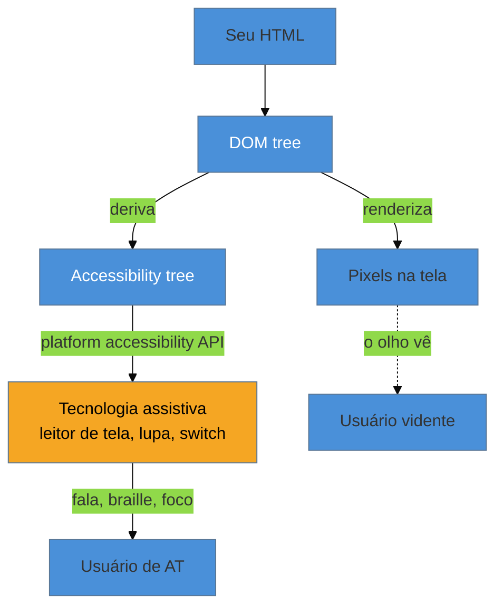

# O accessibility tree

> [!abstract] TL;DR
> O navegador não entrega a sua página ao leitor de tela do jeito que ela aparece na tela. Ele monta, **em paralelo ao DOM**, uma segunda árvore — o *accessibility tree* — onde cada nó relevante é reduzido a quatro coisas: **role** (o que é), **name** (como se chama), **state** (em que condição está) e **value** (que valor carrega). A tecnologia assistiva só enxerga essa árvore, nunca os seus pixels nem o seu CSS. Entender que essa árvore existe, e como o browser a calcula, é o que transforma acessibilidade de adivinhação ("por que o leitor de tela não fala isso?") em mecânica ("o *name* dessa `<div>` computou vazio — óbvio").

Na nota anterior, um modal deixava um usuário de teclado perdido. Mas há um irmão mais sutil desse bug, e ele aparece assim: você tem um botão lindo, redondo, com um ícone de lixeira, tudo perfeito na tela. Um usuário de leitor de tela chega nele com o teclado e ouve: *"botão"*. Só isso. Botão o quê? Deletar o quê? A informação que o olho capta num relance — "ah, é o botão de excluir" — simplesmente **não existe** para quem não vê o ícone. O botão está visualmente completo e semanticamente vazio.

Por que isso acontece? Porque o leitor de tela não olha para a sua tela. Ele lê uma representação da sua interface que o navegador construiu à parte — e naquela representação, o seu ícone de lixeira era só um `<svg>` decorativo sem nome. Para entender o bug, você precisa parar de pensar na tela e começar a pensar nessa árvore paralela.

## Duas árvores a partir de um HTML

Quando o navegador carrega uma página, ele já constrói uma árvore que você conhece: o **DOM**, a representação estruturada do seu HTML que o CSS estiliza e o JavaScript manipula. O que muita gente não sabe é que, a partir do DOM, o browser deriva uma **segunda** árvore, voltada exclusivamente para tecnologias assistivas: o *accessibility tree*.



Repare no ponto essencial do diagrama: o usuário de tecnologia assistiva e o usuário vidente **consomem saídas diferentes do mesmo DOM**. Um recebe pixels; o outro recebe a árvore de acessibilidade traduzida pela *platform accessibility API* do sistema operacional (a UIA no Windows, a AX API no macOS, a AT-SPI no Linux, a Accessibility API no Android). O leitor de tela conversa com essa API do sistema — não com o seu CSS, não com o seu layout, não com a sua bela cor de destaque.

A consequência é libertadora e assustadora ao mesmo tempo: **tudo o que é puramente visual é invisível para a AT**. Uma borda que "obviamente" indica foco, uma cor que "obviamente" indica erro, uma posição que "obviamente" indica hierarquia — nada disso chega à árvore de acessibilidade a menos que esteja codificado em *estrutura*, não em *aparência*.

## O que sobra de cada nó: role, name, state, value

Ao derivar a árvore, o browser **poda e traduz**. Nós puramente decorativos somem. Os que sobram são reduzidos a um punhado de propriedades. As quatro que você vai repetir a vida inteira:

- **Role (papel)** — *o que este elemento é*. Botão, link, cabeçalho, campo de texto, caixa de seleção, região de navegação. Vem de graça quando você usa o elemento HTML certo: um `<button>` tem role `button`, um `<a href>` tem role `link`, um `<nav>` tem role `navigation`. Uma `<div>` tem role... nenhum útil (`generic`). O role é o que o leitor de tela anuncia primeiro e é o que diz ao usuário *como interagir*.
- **Name (nome acessível)** — *como este elemento se chama*. É o texto que o leitor de tela fala para identificá-lo: "Excluir item", "Buscar", "E-mail". É a propriedade que estava **vazia** no nosso botão de lixeira. Como o browser calcula esse nome é a parte mais traiçoeira, e tem seção própria abaixo.
- **State (estado)** — *em que condição está agora*. Marcado/desmarcado, expandido/recolhido, selecionado, desabilitado, ocupado. É dinâmico: muda conforme o usuário interage. Um checkbox nativo reporta `checked`/`unchecked` sozinho; uma `<div>` fingindo ser checkbox reporta... nada, a menos que você diga.
- **Value (valor)** — *que valor carrega*. O conteúdo de um campo de texto, a posição de um slider, o valor de um `<progress>`.

> [!question]- Por que reduzir tudo a essas quatro coisas? Não se perde informação?
> Perde-se, deliberadamente — e é isso que torna a interface *navegável* sem visão. Um usuário vidente escaneia a tela inteira num piscar de olhos e escolhe onde olhar. Um usuário de leitor de tela consome a interface **linearmente**, um nó por vez, ouvindo. Se cada nó despejasse toda a sua aparência, a navegação seria insuportável. Role/name/state/value é o *mínimo suficiente* para saber, de cada elemento: o que é, como se chama, como está e o que carrega — que é exatamente o que você precisa para decidir se interage com ele. A poda não é perda; é o que torna a árvore utilizável.

## Como o browser calcula o *name* (e por que ele falha)

O *accessible name* é a propriedade que mais dá dor de cabeça, porque o browser tem um **algoritmo de precedência** para calculá-lo — o *Accessible Name and Description Computation*, uma especificação da W3C — e ele consulta várias fontes em ordem. Simplificando a cascata para os casos do dia a dia, o navegador tenta, mais ou menos nesta prioridade:

1. Um `aria-labelledby` apontando para outro elemento (o texto dele vira o nome).
2. Um `aria-label` direto no elemento.
3. O conteúdo "natural" — o texto entre as tags de um `<button>`, o `<label>` associado a um `<input>`, o `alt` de uma ``.
4. Atributos de fallback como `title`.

Volte ao botão de lixeira e o bug se explica sozinho:

```html
<!-- ❌ name computa VAZIO: não há texto, nem label, nem alt -->
<button>
  <svg><!-- ícone de lixeira --></svg>
</button>
<!-- leitor de tela anuncia: "botão" -->

<!-- ✅ name = "Excluir item": aria-label fornece o nome que o ícone não dá -->
<button aria-label="Excluir item">
  <svg aria-hidden="true"><!-- ícone de lixeira --></svg>
</button>
<!-- leitor de tela anuncia: "Excluir item, botão" -->
```

No primeiro caso, o browser percorre a cascata inteira e não acha nada: o `<svg>` não é texto, não há `aria-label`, não há `<label>`. O nome computa string vazia, e o usuário ouve só o role. No segundo, o `aria-label` fornece o nome, e o `aria-hidden="true"` no ícone diz ao browser "não desça nesta parte da árvore, é decoração" — evitando que ele tente (e falhe) descrever o desenho do SVG.

Esse é o padrão mental que você leva pra vida: quando um leitor de tela "não fala o que devia", quase sempre é o *name* que computou errado ou vazio. Você para de adivinhar e vai direto conferir a cascata.

## Vendo a árvore com seus próprios olhos

O accessibility tree não é abstrato — você pode inspecioná-lo agora. No DevTools do Chrome ou do Edge, abra o painel **Elements**, selecione um nó e vá na aba **Accessibility**. Ali o browser te mostra, para aquele elemento, o role calculado, o accessible name, de qual fonte o nome veio (`aria-label`? conteúdo? `<label>`?), e os estados. É a ferramenta que fecha o loop entre "o que escrevi no HTML" e "o que a AT recebe".

> [!info] O hábito que separa o time-ofício
> Times que tratam a11y como ofício abrem a aba Accessibility do jeito que abrem o Console: reflexo. Escreveu um componente interativo? Confere o role e o name na árvore antes de dar por pronto. É o equivalente a rodar o código antes de commitar — você não *supõe* que o name está certo, você *vê*. A auditoria manual completa (com esse hábito no centro) é assunto do [[03-Dominios/Tecnologia/Acessibilidade/Auditar e Testar/15 - Auditoria manual|SG3, nota 15]].

> [!tip] Vídeo — inspecionar a árvore no DevTools
> [**How to use Chrome's accessibility tree**](https://www.youtube.com/watch?v=pJL6qtfYkBo) (Pope Tech, 6 min) faz o passeio prático que esta seção descreve: abrir a aba Accessibility, ler o role e o accessible name computados, e ver de qual fonte o nome veio. Assista com o seu próprio DevTools aberto ao lado.

**Accessibility tree em uma frase:** é o "DOM que o leitor de tela lê" — uma árvore paralela onde cada nó vira role + name + state + value, e onde tudo que era só visual desaparece.

## Casos práticos

### Cenário 1: o ícone que não tinha nome
Um botão de "favoritar" com um ícone de coração passa em toda revisão visual, mas o leitor de tela anuncia só "botão". Abrindo a aba Accessibility, o dev vê o *name* computado como string vazia: o `<svg>` não é texto, não há `aria-label`, não há `<label>`. A correção é uma linha — `aria-label="Adicionar aos favoritos"` no botão e `aria-hidden="true"` no ícone — e o name passa a computar corretamente. O diagnóstico saiu da adivinhação ("por que não fala?") para a mecânica (name vazio na cascata).

### Cenário 2: o `<h2>` que virou aba e sumiu do sumário
Um time transforma cabeçalhos em abas com `<h2 role="tab">`. Resultado na árvore: o role `tab` **substitui** o role `heading`, e aquele texto desaparece da navegação por cabeçalhos do leitor de tela. Na aba Accessibility, o nó agora aparece como `tab`, não `heading` — a estrutura de sumário que o usuário de leitor de tela usava para escanear a página foi apagada sem ninguém perceber visualmente.

## Armadilhas comuns

> [!warning] Presumir que "está na tela" significa "está na árvore"
> **O que acontece:** informação transmitida só visualmente (uma cor de status, uma borda de erro, uma posição hierárquica) não chega ao leitor de tela. **Por quê:** a árvore de acessibilidade só carrega o que é *estrutura*, não *aparência*. CSS não entra na árvore. **Como evitar:** toda informação essencial precisa existir como estrutura (texto, role, estado ARIA), não apenas como estilo visual.

> [!warning] `aria-hidden="true"` num elemento focável
> **O que acontece:** você esconde da árvore um elemento que ainda recebe foco por teclado; o usuário tabula para um "buraco negro" que o leitor de tela não anuncia. **Por quê:** `aria-hidden` remove o nó da árvore, mas não do tab order — as duas coisas ficam dessincronizadas. **Como evitar:** nunca use `aria-hidden` em algo focável. Esconda o ícone decorativo (não-focável), não o controle.

> [!warning] Confiar no `title` como nome acessível
> **O que acontece:** um botão de ícone usa só `title="Excluir"` esperando que vire o nome — mas o `title` está no fim da cascata e tem suporte irregular entre leitores de tela. **Por quê:** o algoritmo de cálculo do nome prioriza `aria-labelledby`, `aria-label` e conteúdo antes do `title`; muitos leitores nem o anunciam. **Como evitar:** use `aria-label` (ou texto visível) para o nome; reserve o `title` para dicas complementares, nunca como rótulo principal.

## Como explicar em inglês

> "The browser builds a second tree alongside the DOM — the **accessibility tree** — and that's the only thing assistive technology sees. It reduces each node to four things: **role** (what it is), **name** (what it's called), **state** (its current condition), and **value**. Anything that's purely visual — a border, a color, a position — doesn't exist in that tree unless it's encoded as structure. When a screen reader 'won't announce something,' it's almost always the accessible **name** computing empty."

| PT | EN |
|----|-----|
| árvore de acessibilidade | accessibility tree |
| nome acessível | accessible name |
| papel / estado / valor | role / state / value |
| cálculo do nome acessível | accessible name computation |
| DOM paralelo | parallel tree / second tree |
| elemento decorativo | decorative element |
| esconder da árvore | hide from the tree (`aria-hidden`) |

## O que vem a seguir

Você já sabe *o que* a tecnologia assistiva recebe (a árvore) e *como* o browser a monta. Falta o outro lado da ponte: *quem* consome essa árvore e *como*. Um leitor de tela não lê a árvore em voz alta de cima a baixo — ele oferece modos de navegação, atalhos por tipo de elemento, e comporta-se de formas que surpreendem quem nunca usou um. Conhecer esse comportamento é o que impede você de construir uma árvore tecnicamente correta e mesmo assim insuportável de navegar.

- [[03-Dominios/Tecnologia/Acessibilidade/Fundamentos e Modelo Mental/03 - Leitores de tela e tecnologias assistivas na prática|03 — Leitores de tela e ATs na prática]] — quem lê a árvore e como; NVDA, VoiceOver, JAWS e seus modos de navegação.
- [[03-Dominios/Tecnologia/Acessibilidade/Fundamentos e Modelo Mental/05 - Semântica primeiro, ARIA por último|05 — Semântica primeiro, ARIA por último]] — por que o HTML certo já preenche role/name/state de graça, e ARIA mal usado corrompe a árvore.
- [[03-Dominios/Tecnologia/HTML/08 - ARIA - roles, states, properties e live regions|HTML 08 — ARIA]] — o vocabulário completo de roles, states e properties que alimentam a árvore.

## Fontes

- **W3C** — [*Accessible Name and Description Computation 1.2*](https://www.w3.org/TR/accname-1.2/) — a especificação normativa da cascata de cálculo do accessible name.
- **MDN Web Docs** — [*The accessibility tree*](https://developer.mozilla.org/en-US/docs/Web/Accessibility/Accessibility_tree) — visão de referência de como o browser deriva a árvore a partir do DOM.
- **Chrome for Developers** — [*Navigate the accessibility tree with DevTools*](https://developer.chrome.com/docs/devtools/accessibility/reference) — como inspecionar role/name/state na aba Accessibility.
- **The A11Y Project** — [*Assistive technologies*](https://www.a11yproject.com/) — panorama de como as ATs consomem a árvore via platform accessibility APIs.
