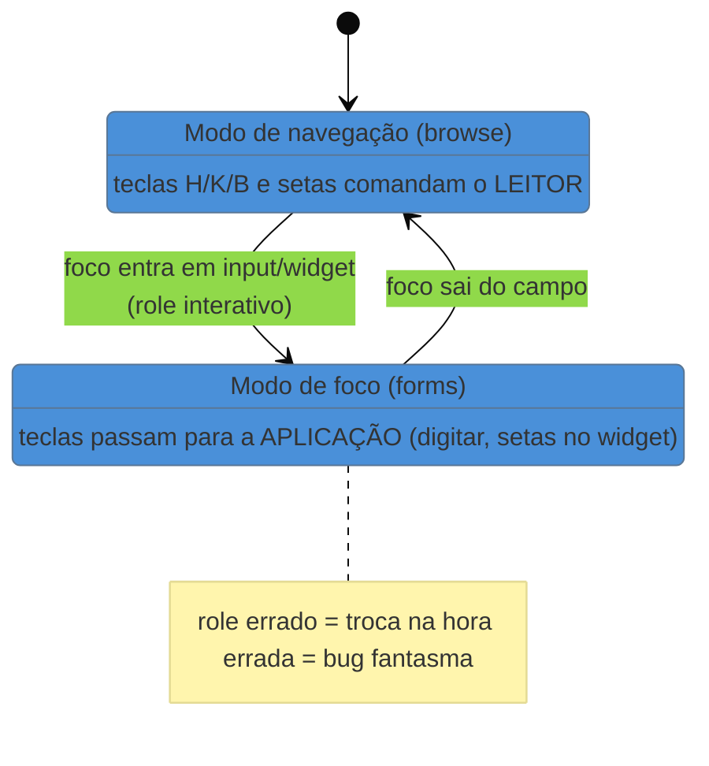

# Leitores de tela e tecnologias assistivas na prática

> [!abstract] TL;DR
> Um leitor de tela **não** lê a página de cima a baixo como um audiolivro. Ele oferece **modos** (um para ler texto corrido, outro para interagir com controles) e deixa o usuário **saltar por tipo de elemento** — pular de cabeçalho em cabeçalho, listar todos os links, ir direto às regiões de navegação. É assim, por atalhos estruturais, que uma pessoa cega "escaneia" uma página. A consequência para você: se a estrutura não existir na árvore de acessibilidade (cabeçalhos de verdade, landmarks, labels), esses atalhos não têm em que se apoiar, e a navegação vira um corredor sem portas. Além disso, o mundo real é plural — JAWS, NVDA e VoiceOver coexistem, a maioria dos usuários usa mais de um, e o comportamento varia entre eles.

Na nota anterior, você viu *o que* o browser entrega à tecnologia assistiva: a árvore de acessibilidade. Falta o outro lado — *quem consome essa árvore e como*. E aqui mora um mal-entendido que produz interfaces tecnicamente corretas e mesmo assim horríveis de usar: a ideia de que o leitor de tela lê a tela inteira, linearmente, e que basta "ter o conteúdo lá" para a pessoa acessá-lo.

Não é assim que funciona. Imagine ter que consumir todo site *ouvindo cada palavra, na ordem do código, sem poder pular nada*. Um portal de notícias levaria dez minutos só para chegar à primeira manchete, atravessando menu, banner, cookies e rodapé. Ninguém aguentaria. Por isso os leitores de tela não fazem isso — e entender o que eles fazem *no lugar* é o que separa construir para a AT de construir contra ela.

## O leitor de tela navega por saltos, não por leitura linear

A verdade libertadora: um usuário experiente de leitor de tela **quase nunca lê a página inteira**. Ele *escaneia* — só que, sem visão, escanear é saltar pela estrutura. Os saltos mais usados:

- **Por cabeçalho** — a tecla `H` (em NVDA/JAWS) pula de heading em heading. É o equivalente sonoro de correr os olhos pelos títulos de uma página. Se os seus `<h1>`–`<h6>` formam uma hierarquia coerente, o usuário tem um *sumário navegável*. Se você fez "títulos" com `
`, não há nada para saltar: o sumário não existe.
- **Por região/landmark** — saltar direto para a navegação, o conteúdo principal, o rodapé. Alimentado pelos landmarks (`<nav>`, `<main>`, `<header>`, `<footer>`) que você viu no HTML.
- **Por link e por formulário** — listar todos os links da página, ou tabular de campo em campo num formulário.
- **Por lista de elementos** — quase todo leitor de tela oferece um diálogo do tipo "mostre-me todos os links / todos os cabeçalhos / todas as regiões desta página", que o usuário abre para ter o mapa e escolher o destino.

> [!question]- Se o usuário salta por cabeçalhos, o que acontece quando pulo um nível (h1 → h3)?
> Você fura o sumário. O usuário que navega por `H` espera uma hierarquia lógica: um `<h1>` de página, `<h2>` de seções, `<h3>` de subseções. Se você pula de `<h1>` para `<h3>` porque "o `<h3>` era do tamanho visual que eu queria", o usuário de leitor de tela percebe um degrau faltando e não sabe se perdeu conteúdo. É por isso que **nível de cabeçalho é semântica, não tamanho de fonte** — o tamanho é problema do CSS; o nível é problema da estrutura. Confundir os dois é um dos erros mais comuns e mais invisíveis para quem enxerga.

## Os dois modos: navegação vs. foco

Aqui está o conceito que mais confunde quem nunca usou um leitor de tela — e que explica bugs aparentemente fantasmas. NVDA e JAWS operam em **dois modos** distintos, e alternam entre eles:

- **Modo de navegação** (*browse mode* / *virtual cursor*) — o padrão ao ler conteúdo. Nele, o leitor de tela **intercepta o teclado**: apertar `H`, `K`, `B`, setas etc. comanda o *leitor*, não a página. É o modo de "ler e escanear".
- **Modo de foco** (*focus mode* / *forms mode*) — ativado quando o usuário entra num campo de texto ou num widget interativo. Agora as teclas passam **para a aplicação**: digitar num `<input>`, usar as setas dentro de um `<select>` customizado. É o modo de "interagir e preencher".

O leitor de tela tenta trocar de modo automaticamente com base no *role* do elemento em foco. Entrou num `<input>`? Vira modo de foco. Saiu? Volta pro modo de navegação. E é exatamente aí que ARIA mal-usado cobra o preço: se você constrói um widget complexo com roles errados, o leitor de tela troca de modo na hora errada — o usuário aperta a seta esperando navegar e a página faz outra coisa, ou digita e o texto não entra. O bug não está "no leitor de tela"; está no fato de que a árvore mentiu sobre o que aquele elemento era.

## O mundo é plural: não existe "o" leitor de tela

Um erro caro é desenvolver testando com um único leitor de tela e presumir que os outros se comportam igual. Os dados da **pesquisa WebAIM com usuários de leitores de tela** (edição #10, virada de 2023 para 2024, mais de 1.500 respondentes) desenham um cenário fragmentado:

| Leitor de tela | Uso como principal | Plataforma |
|----------------|-------------------:|------------|
| **JAWS** | 40,5% | Windows (pago, caro, corporativo) |
| **NVDA** | 37,7% | Windows (gratuito, open source) |
| **VoiceOver** | 9,7% | macOS / iOS (embutido na Apple) |

Mas o número que muda a estratégia de teste é outro: **quase 72% dos usuários usam mais de um leitor de tela**, e 43% usam três ou mais. Quando você conta uso combinado (não só o principal), o NVDA aparece em 65,6% e o JAWS em 60,5% — eles se sobrepõem porque as pessoas alternam. E há mais: **86% usam Windows**, o Chrome domina os navegadores, e **91% também usam leitor de tela no celular** — no mobile, o VoiceOver (iOS) reina com 71% e o TalkBack (Android) vem com 35%.

> [!info] O que isso significa para o seu teste
> Você não precisa dominar os quatro. Precisa de uma **régua realista**: teste ao menos com **NVDA + Chrome** (gratuito, cobre a maior fatia combinada no Windows) e com **VoiceOver no iOS** (cobre o mobile, que é quase universal entre esses usuários). Testar em um só e presumir paridade é como testar só no Chrome e jurar que funciona no Safari — o comportamento *diverge*, sobretudo em widgets ARIA. A rotina de auditoria manual com esses leitores é o assunto da nota [[03-Dominios/Tecnologia/Acessibilidade/Auditar e Testar/15 - Auditoria manual|15, no SG3]].

## Leitor de tela não é a única tecnologia assistiva

Leitor de tela é o exemplo mais citado, mas o guarda-chuva das *assistive technologies* é largo, e cada uma pressiona a sua interface de um jeito:

- **Ampliadores de tela (screen magnifiers)** — para baixa visão. A pessoa vê só um pedaço ampliado da tela por vez. Layouts que espalham informação relacionada em cantos opostos, ou que mostram erros longe do campo que os causou, punem quem enxerga por uma janelinha.
- **Controle por switch** — para deficiência motora severa. A pessoa opera tudo com um ou dois botões, varrendo os elementos focáveis em sequência. Se algo não está na ordem de foco, para essa pessoa **não existe**.
- **Controle por voz** (Dragon, Voice Control) — a pessoa fala "clicar em Enviar". Isso só funciona se o botão *se chama* "Enviar" na árvore — o accessible name volta a ser protagonista.
- **Displays de braille** — convertem a saída do leitor de tela em braille tátil, linha a linha. Reforçam a importância de texto conciso e bem rotulado.

O fio que costura todas: elas dependem da **mesma árvore de acessibilidade** e das mesmas propriedades (role, name, state, value). Construir bem para o leitor de tela quase sempre serve as outras — o *curb-cut effect* operando dentro do próprio universo da a11y.

**Leitores de tela em uma frase:** não leem a tela linearmente — saltam pela estrutura (cabeçalhos, landmarks, links) e alternam entre um modo de ler e um modo de interagir, o que só funciona se a sua árvore de acessibilidade for honesta sobre o que cada elemento é.

> [!tip] Vídeo — ver (e ouvir) um leitor de tela em uso
> [**Screen Reader Demo — NVDA & TalkBack**](https://www.youtube.com/watch?v=ZYFd9t-omRY) (NCDIT) mostra pessoas reais navegando páginas por som — saltando por cabeçalhos, preenchendo formulários, atravessando um site sem ver a tela. Vale assistir aos primeiros minutos: é o jeito mais rápido de entender por que estrutura importa tanto. Se puder, feche os olhos enquanto ouve.

## Casos práticos

### Cenário 1: o portal de notícias sem cabeçalhos
Um portal usa `
` para todos os "títulos". Visualmente perfeito. Mas o usuário de leitor de tela aperta `H` para saltar de manchete em manchete e **nada acontece** — não há `<h1>`–`<h6>` para saltar. Sem o sumário navegável, ele é obrigado a ouvir a página inteira em ordem linear, atravessando menu, banner e cookies antes da primeira notícia. A correção é trocar as `
` por headings reais em hierarquia coerente; o custo visual é zero (o CSS controla o tamanho).

### Cenário 2: testar num leitor só e quebrar no outro
Um time desenvolve testando apenas VoiceOver no Mac e entrega. Em produção, usuários de NVDA+Windows (a maior fatia combinada) relatam que um widget de abas não navega por setas. O comportamento **divergiu** entre leitores — exatamente o que os 72% de usuários multi-leitor da pesquisa preveem. A régua realista teria pego: testar ao menos NVDA+Chrome e VoiceOver+iOS.

## Armadilhas comuns

> [!warning] Presumir que o leitor de tela lê a página de cima a baixo
> **O que acontece:** o time projeta assumindo leitura linear e não fornece estrutura de salto (cabeçalhos, landmarks), tornando a página exaustiva de navegar. **Por quê:** usuários experientes escaneiam por saltos estruturais, não ouvem tudo. Sem estrutura, os saltos não têm em que se apoiar. **Como evitar:** forneça hierarquia de cabeçalhos, landmarks (`<nav>`/`<main>`) e listas semânticas — os "atalhos" que o leitor de tela usa para escanear.

> [!warning] Pular níveis de cabeçalho por tamanho de fonte
> **O que acontece:** um `<h1>` é seguido por um `<h3>` porque "o `<h3>` tinha o tamanho visual certo", furando o sumário. **Por quê:** nível de cabeçalho é *semântica* (a hierarquia), não *tamanho* (problema do CSS). Um degrau faltando confunde quem navega por `H`. **Como evitar:** escolha o nível pela hierarquia lógica e ajuste o tamanho com CSS. Nunca use o número do heading para controlar aparência.

> [!warning] Testar com um único leitor de tela
> **O que acontece:** o produto funciona no leitor testado e quebra nos outros — sobretudo em widgets ARIA, onde o comportamento diverge mais. **Por quê:** JAWS, NVDA e VoiceOver se comportam diferente, e a maioria dos usuários usa mais de um. Um só leitor não representa a base. **Como evitar:** teste ao menos com NVDA+Chrome (maior fatia no Windows) e VoiceOver no iOS (cobre o mobile, quase universal).

## Como explicar em inglês

> "A screen reader doesn't read the page top to bottom like an audiobook. Experienced users **scan by jumping** — pressing `H` to move heading to heading, listing all links, jumping to landmarks. So structure isn't decoration; it's the navigation. Also, there isn't *one* screen reader: **JAWS, NVDA, and VoiceOver** coexist, most users use more than one, so I test with at least NVDA on Windows and VoiceOver on iOS — behavior diverges, especially in ARIA widgets."

| PT | EN |
|----|-----|
| leitor de tela | screen reader |
| modo de navegação / modo de foco | browse mode / focus (forms) mode |
| saltar por cabeçalho | jump by heading |
| navegar por landmark | navigate by landmark |
| tecnologia assistiva | assistive technology |
| ampliador de tela | screen magnifier |
| controle por voz / por switch | voice control / switch control |
| display de braille | braille display |

## O que vem a seguir

Você já tem o modelo completo do *como*: a árvore que o browser monta e as ATs que a consomem. Agora vem o *quanto* — os critérios objetivos que definem se uma interface é acessível "o suficiente". Esse é o território do WCAG, e o truque é encará-lo não como uma lista de itens a marcar (o erro que a nota 01 desmontou), mas como um conjunto de princípios que orientam decisão.

- [[03-Dominios/Tecnologia/Acessibilidade/Fundamentos e Modelo Mental/04 - WCAG 2.2 pelo ofício|04 — WCAG 2.2 pelo ofício]] — os princípios POUR e os níveis A/AA/AAA vistos por quem aplica.
- [[03-Dominios/Tecnologia/Acessibilidade/Fundamentos e Modelo Mental/05 - Semântica primeiro, ARIA por último|05 — Semântica primeiro, ARIA por último]] — por que o HTML certo já dá modo, role e name de graça.
- [[03-Dominios/Tecnologia/HTML/02 - Landmark elements e documento estruturado|HTML 02 — Landmark elements]] — os `<nav>`/`<main>`/`<header>` que alimentam a navegação por região.

## Fontes

- **WebAIM** — [*Screen Reader User Survey #10 Results*](https://webaim.org/projects/screenreadersurvey10/) — a pesquisa de referência sobre uso real de leitores de tela; origem de todos os percentuais desta nota.
- **NV Access** — [*NVDA User Guide*](https://www.nvaccess.org/files/nvda/documentation/userGuide.html) — documentação dos modos de navegação/foco e das teclas de salto (`H`, `K`, `D`).
- **Apple** — [*VoiceOver User Guide*](https://support.apple.com/guide/voiceover/welcome/mac) — o rotor e o modelo de navegação do leitor de tela da Apple (desktop e iOS).
- **MDN Web Docs** — [*Assistive technology (AT)*](https://developer.mozilla.org/en-US/docs/Glossary/Assistive_technology) — panorama das categorias de AT além do leitor de tela.
