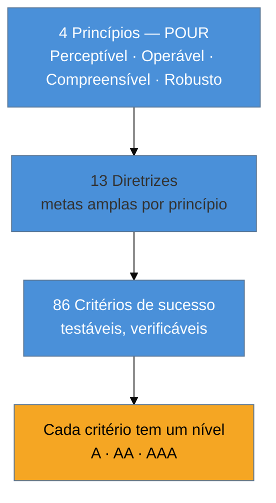

# WCAG 2.2 pelo ofício

> [!abstract] TL;DR
> WCAG é a régua que o mundo — inclusive a lei — usa para dizer se algo é acessível. Mas ela não é uma lista de tarefas: é uma **hierarquia** que vai de 4 princípios (POUR) a 13 diretrizes a **86 critérios de sucesso** testáveis, cada um marcado em **nível A, AA ou AAA**. O alvo prático, o que contratos e leis exigem, é **AA**. A nota [[03-Dominios/Tecnologia/HTML/07 - Acessibilidade I - fundamentos WCAG e navegação por teclado|HTML/07]] já ensinou o que é POUR; aqui o foco é *usar* WCAG como ferramenta de decisão e priorização — ler um critério, entender que problema humano ele codifica, e saber quais dos novos critérios da versão 2.2 mais pegam times desprevenidos.

Você vai ouvir "precisa estar em conformidade com WCAG" numa reunião, num contrato, num edital de licitação, num processo. E o reflexo errado — o reflexo-checklist que a nota 01 desmontou — é tratar isso como uma lista de 86 caixinhas a marcar no fim. O reflexo-ofício é outro: entender **o que WCAG é, como ela se organiza, e como cada critério traduz um problema humano real**, para poder decidir *durante o código* em vez de auditar *depois*.

## O que WCAG é (e o que não é)

WCAG — *Web Content Accessibility Guidelines* — é o padrão publicado pelo **W3C** que define, de forma testável, o que torna conteúdo web acessível. A versão vigente é a **2.2**, uma Recomendação oficial do W3C desde **outubro de 2023**.

Duas coisas que ela **não** é, e que evitam confusão:

- **Não é lei.** WCAG é um padrão técnico. O que acontece é que as *leis* de vários países (a ADA nos EUA por interpretação judicial, o *European Accessibility Act* na UE, a norma EN 301 549 na Europa) **apontam para WCAG** como a régua de conformidade. A lei diz "seja acessível"; WCAG diz "eis o que 'acessível' significa em critérios verificáveis". Esse elo jurídico é assunto da nota [[03-Dominios/Tecnologia/Acessibilidade/Sustentar e Conformidade/18 - Cenário legal e normativo|18]].
- **Não é um manual de como fazer.** WCAG diz *o que* precisa ser verdade ("o texto tem contraste suficiente"), não *como* implementar. O "como" vem das *techniques* do W3C e do ofício que este domínio inteiro ensina.

## A hierarquia: princípios → diretrizes → critérios → níveis

WCAG é uma pirâmide de quatro camadas. Entender a estrutura é o que permite navegar as 86 exigências sem se perder:

No topo, os **4 princípios (POUR)** — o conteúdo precisa ser **P**erceptível, **O**perável, **C**ompreensível e **R**obusto (detalhados no HTML/07). Abaixo, **diretrizes** que desdobram cada princípio em metas ("forneça alternativas em texto", "torne tudo operável por teclado"). Na base, os **critérios de sucesso** — as afirmações concretas e testáveis que você de fato verifica ("contraste de pelo menos 4.5:1 para texto normal"). Cada critério carrega um **nível de conformidade**.

## Os níveis A, AA, AAA: o que significam e qual é o alvo

Este é o ponto que mais gera decisão de produto, então vale destrinchar:

| Nível | O que representa | Exemplo de critério |
|-------|------------------|---------------------|
| **A** | O mínimo essencial. Sem isso, barreiras *bloqueiam totalmente* certos usuários. | Todo conteúdo não-textual tem alternativa em texto (`alt`). |
| **AA** | O padrão prático e o **alvo legal** quase universal. Remove barreiras significativas. | Contraste de texto ≥ 4.5:1; foco visível; conteúdo reflui em zoom. |
| **AAA** | O mais rigoroso. Nem sempre alcançável em toda página; alvo de contextos especializados. | Contraste ≥ 7:1; linguagem sem jargão; sem limites de tempo. |

> [!question]- Se AAA é "melhor", por que não mirar sempre AAA?
> Porque o próprio W3C diz que **não é possível** atingir AAA em todo tipo de conteúdo — alguns critérios AAA são incompatíveis com certos produtos (um site de notícias não consegue eliminar todo jargão; um app financeiro não consegue abolir limites de tempo de sessão por segurança). AAA é uma meta para *partes* críticas, não um alvo global. Por isso o mundo convergiu em **AA** como o contrato social da acessibilidade: rigoroso o bastante para remover barreiras reais, realista o bastante para ser exigível por lei. Quando alguém diz "conformidade WCAG" sem especificar, leia **"2.2 nível AA"**.

E um detalhe que confunde: os níveis são **cumulativos**. "Estar em AA" significa cumprir **todos** os critérios A **e** todos os AA. Não é "escolher o nível"; é "até onde a barra sobe".

## Lendo um critério como quem aplica

O salto de mentalidade acontece quando você para de ler o número do critério e começa a ler o **problema humano** que ele codifica. Pegue três:

- **1.4.3 Contraste (Mínimo) — AA.** Texto e fundo com contraste ≥ 4.5:1. *O problema humano:* baixa visão, e todo mundo sob sol forte. É o critério nº 1 em falhas no mundo (79% das páginas). Você não "checa contraste no fim"; você escolhe a paleta com isso em mente.
- **2.1.1 Teclado — A.** Toda funcionalidade é operável só por teclado. *O problema humano:* quem não usa mouse — deficiência motora, mas também o power user. É o critério que o modal da nota 01 violava.
- **4.1.2 Nome, Papel, Valor — A.** Todo componente de interface expõe seu name/role/value à AT. *O problema humano:* o botão de lixeira que anunciava só "botão". É literalmente o accessibility tree da nota 02 virado exigência normativa.

Repare no fio: cada critério que parecia burocrático é um dos problemas concretos que você já viu nas notas anteriores, agora com um número e um nível. WCAG não inventa exigências abstratas — ela cataloga as formas conhecidas de excluir gente.

## O que a versão 2.2 trouxe (e onde os times tropeçam)

A 2.2 acrescentou **nove critérios novos** sobre a 2.1 (chegando a 86), e removeu um antigo e problemático (o 4.1.1 *Parsing*, que os browsers modernos tornaram obsoleto). Vários dos novos são justamente os que pegam times desprevenidos, porque tratam de interações que "pareciam ok":

- **2.4.11 Foco Não Obscurecido (Mínimo) — AA.** Quando um elemento recebe foco por teclado, ele **não pode ficar totalmente escondido** atrás de headers fixos, cookie banners ou barras *sticky*. É exatamente o bug do modal, promovido a critério.
- **2.5.8 Tamanho do Alvo (Mínimo) — AA.** Alvos de toque/clique de pelo menos **24×24 pixels** (com exceções). *O problema:* dedos, tremores, telas pequenas. Ícones minúsculos colados um no outro falham aqui.
- **2.5.7 Movimentos de Arrastar — AA.** Toda ação que depende de *arrastar* (reordenar por drag, slider) precisa ter uma alternativa que **não** exija arrastar. *O problema:* quem não consegue executar um gesto contínuo e preciso.
- **3.3.8 Autenticação Acessível (Mínimo) — AA.** Login não pode depender de um **teste cognitivo** (resolver quebra-cabeças, transcrever CAPTCHA, decorar) sem alternativa. *O problema:* deficiência cognitiva, e a fadiga de todos nós com CAPTCHAs.
- **3.2.6 Ajuda Consistente** e **3.3.7 Entrada Redundante** — ajuda no mesmo lugar em todas as páginas; não obrigar o usuário a redigitar o que já forneceu no mesmo fluxo.

> [!info] Estado do padrão em julho de 2026 — leia se voltar aqui no futuro
> **WCAG 2.2 AA é o alvo agora e continuará sendo por anos.** A próxima versão, **WCAG 3.0**, ainda é *rascunho* (working draft): a *Candidate Recommendation* está prevista para o **4º trimestre de 2027** e a Recomendação final **não antes de 2028**. Além disso, WCAG 3.0 **não vai substituir** a 2.2 — as duas vão coexistir. A 3.0 muda o modelo (troca o binário passa/falha por uma pontuação graduada por *outcomes*, e experimenta um novo algoritmo de contraste, o APCA). A recomendação oficial e prática: **construa para 2.2 AA hoje**, trate 3.0 como programa de prontidão para o futuro, não como algo a esperar. Se você lê isto depois de 2027, confira se a 3.0 saiu de rascunho.

## WCAG como ferramenta de priorização, não de pânico

O medo de "86 critérios" some quando você usa a hierarquia a seu favor. Uma ordem de ataque que o ofício ensina:

1. **Comece pelos critérios de nível A** — eles são os *bloqueios totais*. Uma falha A pode tornar uma funcionalidade completamente inutilizável para um grupo; uma falha AAA é um desconforto. Severidade primeiro.
2. **Priorize os critérios que a realidade mais fura** — contraste (1.4.3), texto alternativo (1.1.1), teclado (2.1.1), nome/papel/valor (4.1.2). Os dados do WebAIM Million dizem onde a dívida se acumula; comece por lá.
3. **Cruze com o funil** — um critério violado no checkout dói mais que o mesmo critério violado numa página institucional. Severidade do critério × criticidade da tela = ordem de conserto. Essa lógica de "severidade × esforço" é o coração da auditoria priorizada da nota [[03-Dominios/Tecnologia/Acessibilidade/Auditar e Testar/16 - Conduzir uma auditoria completa|16]].

**WCAG em uma frase:** não é uma lista para marcar no fim — é uma hierarquia de princípios a critérios testáveis, mirando o nível **AA**, onde cada critério é um problema humano conhecido transformado em régua verificável.

> [!tip] Vídeo — o panorama do WCAG por um editor da spec
> [**A WCAG Overview — WCAG 2.1 and 2.0 Explained**](https://www.youtube.com/watch?v=rIebSHUZz_w) (Eric Eggert, 14 min) percorre a estrutura princípios→diretrizes→critérios→níveis por quem trabalha na própria especificação. É a versão comentada do mapa desta nota; vale para fixar o POUR e a lógica dos níveis A/AA/AAA.

## Casos práticos

### Cenário 1: priorizar por severidade num backlog de 80 critérios
Um time recebe um relatório com dezenas de violações e paralisa. Aplicando a hierarquia do WCAG, a ordem aparece: primeiro os critérios de **nível A** (bloqueios totais — sem `alt`, sem teclado), depois os **AA** mais furados na prática (contraste 1.4.3, nome/papel/valor 4.1.2), cruzando com a criticidade da tela (checkout antes de "Sobre"). Em vez de 80 tarefas soltas, um plano ordenado por "quanto bloqueia × onde".

### Cenário 2: o novo critério 2.4.11 pego numa revisão de design
Ao migrar para a régua 2.2, o time descobre que o menu *sticky* do topo cobre o elemento focado quando se tabula para uma seção — violação do novo **2.4.11 (Foco Não Obscurecido)**. É exatamente o bug do modal que perde o foco, agora com número de critério. A correção (ajustar `scroll-margin`/offset para o foco nunca ficar atrás do header) entra no design system, resolvendo em todas as telas de uma vez.

## Armadilhas comuns

> [!warning] Mirar AAA globalmente
> **O que acontece:** o time promete "conformidade AAA" e trava, porque vários critérios AAA são incompatíveis com o produto (jargão inevitável, limites de tempo por segurança).
> **Por quê:** o próprio W3C diz que AAA não é alcançável em todo conteúdo; é meta para *partes* críticas, não alvo global.
> **Como evitar:** mire **AA** como padrão (é o alvo legal quase universal) e aplique AAA pontualmente onde faz sentido.

> [!warning] Confundir nível de conformidade com prioridade de conserto
> **O que acontece:** o time conserta todos os A antes de qualquer AA, mesmo quando um AA está no checkout e o A está no rodapé.
> **Por quê:** o nível é um bom *proxy* inicial de severidade, mas o impacto no fluxo é o desempate. Uma falha AA no fluxo de receita dói mais que uma A numa página institucional.
> **Como evitar:** ordene por nível **e** por criticidade da tela (severidade × onde), não só pelo nível.

> [!warning] Tratar WCAG como lista de tarefas do fim
> **O que acontece:** os 86 critérios viram um checklist rodado na véspera do release, gerando milhares de violações impossíveis de conferir a tempo.
> **Por quê:** critérios como contraste e `alt` são triviais de checar isoladamente mas aparecem aos milhares — a conta só fecha se a decisão entra no momento em que cada elemento é escrito.
> **Como evitar:** use WCAG como guia de decisão *durante* o código, não como auditoria de fim. Cada critério é um problema humano a evitar, não uma caixa a marcar.

## Como explicar em inglês

> "WCAG is a **hierarchy**, not a checklist: four **POUR** principles — Perceivable, Operable, Understandable, Robust — break down into guidelines and then into **86 testable success criteria**, each tagged **A, AA, or AAA**. The practical and legal target is **AA**. I read each criterion as the human problem it encodes — 1.4.3 is contrast for low vision, 2.1.1 is keyboard operability — so it drives decisions while I build, instead of being a form I fill at the end."

| PT | EN |
|----|-----|
| critério de sucesso | success criterion |
| nível de conformidade (A/AA/AAA) | conformance level |
| perceptível/operável/compreensível/robusto | perceivable/operable/understandable/robust |
| diretriz | guideline |
| régua / alvo | benchmark / target |
| foco não obscurecido | focus not obscured |
| tamanho do alvo | target size |

## O que vem a seguir

Você tem o *modelo* (árvore + ATs) e a *régua* (WCAG AA). Falta o **primeiro mandamento de execução**, aquele que faz mais critérios passarem com menos esforço: usar o elemento HTML certo antes de alcançar qualquer atributo ARIA. É contraintuitivo o quanto do WCAG se cumpre "de graça" só por escolher `<button>` em vez de `
` — e o quanto ARIA mal-usado ativamente *quebra* a conformidade.

- [[03-Dominios/Tecnologia/Acessibilidade/Fundamentos e Modelo Mental/05 - Semântica primeiro, ARIA por último|05 — Semântica primeiro, ARIA por último]] — o princípio que fecha o SG1 e abre o caminho para construir.
- [[03-Dominios/Tecnologia/Acessibilidade/Construir Acessível/11 - Cor, contraste e visual acessível|11 — Cor e contraste]] — o critério 1.4.3 em profundidade, já no território de construir.
- [[03-Dominios/Tecnologia/HTML/07 - Acessibilidade I - fundamentos WCAG e navegação por teclado|HTML 07 — Fundamentos WCAG]] — POUR e navegação por teclado, a base que esta nota pressupõe.

## Fontes

- **W3C** — [*Web Content Accessibility Guidelines (WCAG) 2.2*](https://www.w3.org/TR/WCAG22/) — a Recomendação oficial vigente; fonte dos princípios, níveis e dos nove critérios novos.
- **W3C WAI** — [*WCAG 2 Overview*](https://www.w3.org/WAI/standards-guidelines/wcag/) — visão introdutória da estrutura princípios/diretrizes/critérios/níveis.
- **W3C WAI** — [*What's New in WCAG 2.2*](https://www.w3.org/WAI/standards-guidelines/wcag/new-in-22/) — o que a 2.2 acrescentou e removeu.
- **W3C** — [*WCAG 3 Introduction*](https://www.w3.org/WAI/standards-guidelines/wcag/wcag3-intro/) — status, timeline e o modelo de pontuação da futura versão 3.0.
