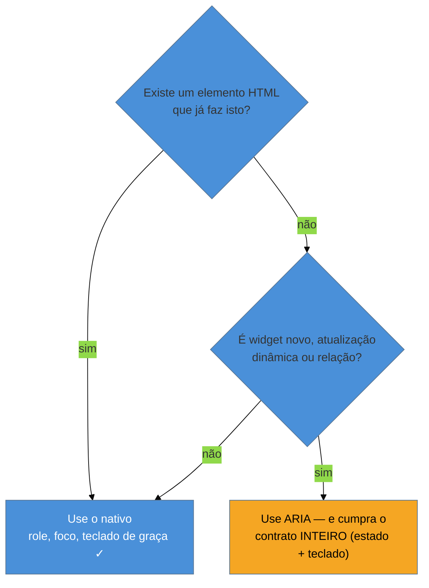

# Semântica primeiro, ARIA por último

> [!abstract] TL;DR
> A primeira regra do ARIA é **não usar ARIA**. Não porque ARIA seja ruim, mas porque o HTML certo já entrega role, name e state **de graça e sem bugs**, enquanto ARIA é uma promessa que *você* precisa cumprir na mão — e cumprir errado é pior que não prometer. Os dados provam: as páginas que mais usam ARIA têm **mais que o dobro** de erros de acessibilidade das que não usam. Este é o princípio que fecha o SG1 e governa todo o resto do domínio: alcance o elemento semântico primeiro (`<button>`, `<nav>`, `<input>`), e só recorra a ARIA quando o HTML genuinamente não tem o que você precisa. A gramática completa de ARIA vive no [[03-Dominios/Tecnologia/HTML/08 - ARIA - roles, states, properties e live regions|HTML/08]]; aqui você aprende *quando não* usá-la.

Chegamos ao fim dos fundamentos com o princípio mais contraintuitivo de todos — e o que mais economiza trabalho. A intuição de quem descobre acessibilidade é: "a11y é sobre adicionar atributos ARIA". É o oposto. A maior parte do trabalho de a11y é sobre **não precisar** de ARIA, porque você escolheu o elemento HTML que já faz o serviço.

Para ver por quê, volte ao botão de lixeira e ao modal das notas anteriores. Ambos os bugs nasceram da mesma escolha: usar uma `<div>` genérica onde existia um elemento semântico pronto. E a "correção" que muita gente aplica — empilhar ARIA na `<div>` até ela *fingir* ser um botão — é justamente o caminho que os dados mostram levar a mais bugs, não menos.

## A `<div>` genérica é uma folha em branco cara

Compare os dois caminhos para fazer um botão de "Salvar":

```html
<!-- ✅ HTML semântico: role, foco, teclado e ativação vêm DE GRAÇA -->
<button type="button" onclick="salvar()">Salvar</button>

<!-- ❌ div fingindo ser botão: você paga por CADA comportamento na mão -->
<div class="btn" onclick="salvar()">Salvar</div>
```

O `<button>` de uma linha já vem, de fábrica, com **tudo isto**:

- **Role `button`** na árvore de acessibilidade — o leitor de tela anuncia "Salvar, botão".
- **Foco por teclado** — está no *tab order* sem você fazer nada.
- **Ativação por `Enter` e `Espaço`** — o navegador dispara o clique nessas teclas automaticamente.
- **Estado desabilitado** semântico via `disabled`.
- **Estilos de foco** do sistema, integração com formulários, e por aí vai.

A `<div>`, por sua vez, é uma folha em branco. Para ela chegar ao *mesmo* patamar do `<button>`, você precisa, à mão: adicionar `role="button"`, adicionar `tabindex="0"` para entrar no tab order, escrever um listener de teclado que trate `Enter` **e** `Espaço` (e que não quebre a rolagem que o `Espaço` normalmente faz), gerenciar o estado `aria-disabled`... e provavelmente esquecer um desses passos. Cada linha de ARIA que você escreve é um comportamento que o `<button>` já te daria sem chance de erro.

> [!question]- Se a div dá tanto trabalho, por que tanta gente usa `<div onclick>`?
> Quase sempre por estética de CSS ("`<button>` é difícil de estilizar") ou por hábito de framework. Mas o `<button>` é *totalmente* estilizável — basta zerar a aparência padrão (`all: unset` ou um reset) e desenhar o que quiser. Você não troca a semântica pela aparência; você fica com as duas. Trocar `<button>` por `<div>` para "facilitar o CSS" é vender a acessibilidade por um problema que nem existe. Esse é o erro que a nota [[03-Dominios/Tecnologia/Acessibilidade/Construir Acessível/10 - A11y em React e component libraries|10, sobre component libraries]], retoma no contexto de React.

## As cinco regras do ARIA, destiladas

A W3C publica as *ARIA Authoring Practices* com cinco regras de uso. A primeira é tão importante que vale citá-la quase literal:

> **Regra 1 — Se você pode usar um elemento HTML nativo com a semântica e o comportamento que precisa, use-o, em vez de reaproveitar um elemento e adicionar ARIA.**

As outras quatro, em linguagem de ofício:

2. **Não mude a semântica nativa** a menos que seja realmente necessário. Não escreva `<h2 role="tab">` — você acabou de destruir o cabeçalho para fabricar uma aba. Use um elemento neutro.
3. **Todo controle ARIA interativo precisa ser operável por teclado.** Se você deu `role="button"` a algo, você *assinou um contrato* de que ele responde ao teclado como um botão. ARIA muda o que a AT *anuncia*; não muda o que o elemento *faz*.
4. **Não use `role="presentation"` nem `aria-hidden="true"` em elemento focável.** Você esconderia da AT um elemento que ainda recebe foco — o usuário de teclado tabula para um buraco negro que o leitor de tela não anuncia.
5. **Todo elemento interativo precisa de um nome acessível.** Voltamos ao *accessible name* da nota 02: sem name, o role não salva ninguém.

Note o que todas têm em comum: elas te empurram para **longe** de ARIA e para **perto** do HTML nativo. ARIA é a exceção, não a regra.

## "No ARIA is better than bad ARIA"

Esta frase é o mantra oficial da comunidade — e não é retórica, é medida. O relatório WebAIM Million de 2025 encontrou o resultado que deveria estar pregado em toda parede de time de frontend: as páginas que **usavam ARIA** tinham, em média, **57 erros de acessibilidade** — **mais que o dobro** das páginas que **não** usavam ARIA. E o uso de ARIA cresce ~18% ao ano.

Como algo *feito para* acessibilidade piora a acessibilidade? Porque ARIA é uma **promessa sem fiscal**. Quando você escreve `role="checkbox"`, você promete à árvore de acessibilidade que aquele elemento *é* um checkbox — com estado marcado/desmarcado (`aria-checked`), operável por teclado, sincronizado a cada interação. O browser **acredita em você e não confere**. Se você promete o role mas esquece de atualizar o `aria-checked` no clique, o leitor de tela anuncia "checkbox não marcado" mesmo depois de o usuário marcar. Você não deixou o elemento sem acessibilidade — você deixou o elemento **mentindo**, o que é pior, porque agora a AT propaga informação falsa com confiança.

> [!warning] ARIA que mente é pior que ausência de ARIA
> **O que acontece:** um widget com roles ARIA corretos mas estados dessincronizados anuncia o oposto do que está na tela — "recolhido" quando está expandido, "não selecionado" quando está selecionado. **Por quê:** o browser não valida as promessas do ARIA. Ele repassa o que você declarou para a árvore de acessibilidade, verdade ou não. O usuário vidente vê o estado real pela aparência; o usuário de AT recebe a declaração falsa. **Como evitar:** prefira o elemento nativo (`<input type="checkbox">` reporta seu estado sozinho, sem chance de dessincronizar). Se ARIA for inevitável, o estado ARIA e o estado visual precisam mudar **na mesma linha de código** — nunca um sem o outro.

## Quando ARIA é a ferramenta certa

Nada disto é "ARIA é ruim, nunca use". ARIA existe porque o HTML **não tem** vocabulário para tudo. Os casos legítimos, onde o nativo não alcança:

- **Widgets complexos que o HTML não oferece** — abas (*tabs*), árvores (*tree*), comboboxes com autocomplete, menus de aplicação. Não existe `<tabs>` nativo; aqui ARIA é o único caminho. (Os padrões prontos para esses casos são o SG2, notas [[03-Dominios/Tecnologia/Acessibilidade/Construir Acessível/08 - Padrões WAI-ARIA APG I|08]] e [[03-Dominios/Tecnologia/Acessibilidade/Construir Acessível/09 - Padrões WAI-ARIA APG II|09]].)
- **Atualizações dinâmicas** — avisar o leitor de tela que algo mudou fora do foco (um toast, um resultado de busca que chegou). É o papel das *live regions* (`aria-live`), que o HTML sozinho não expressa.
- **Relações que a estrutura não captura** — ligar um campo à sua mensagem de erro (`aria-describedby`), nomear uma região com o texto de outro elemento (`aria-labelledby`).
- **Complementar o nome acessível** quando o conteúdo visível não basta — o `aria-label="Excluir item"` do botão de ícone da nota 02.

A regra de bolso: **ARIA para o que o HTML não tem; HTML para tudo o que ele já tem.** E o teste honesto antes de escrever qualquer atributo ARIA é a pergunta "existe um elemento HTML que já faz isto?". Na maioria das vezes, existe.



**Semântica primeiro em uma frase:** o HTML certo entrega role, name, foco e teclado de graça e sem bugs — ARIA é a exceção cara e sem rede que só se justifica quando o nativo genuinamente não alcança.

> [!tip] Vídeo — a armadilha do ARIA em 2 minutos
> [**The ARIA Trap: Are You Falling For It?**](https://www.youtube.com/watch?v=ldSW_zxqUC0) (Easy A11y Guide, 2 min) resume, curto e direto, por que "adicionar ARIA" costuma piorar a acessibilidade e por que a primeira regra é não usá-lo. Um bom lembrete para colar na parede do time.

## Casos práticos

### Cenário 1: a `<div>` "botão" que custou uma reescrita
Um componente de botão do design system foi feito com `<div role="button" tabindex="0">` mais um listener de teclado — "para facilitar o CSS". Meses depois, descobre-se que o listener trata só `Enter`, não `Espaço`, e quebra a rolagem da página. Cada uso do componente herdou a falha. A correção definitiva foi trocar a base por `<button>` com `all: unset` no CSS: a semântica volta de graça, o CSS continua livre, e a dívida some de todas as telas de uma vez.

### Cenário 2: o checkbox que mentia
Um "checkbox" customizado usa `role="checkbox"` mas esquece de atualizar `aria-checked` no clique. Visualmente marca e desmarca; para o leitor de tela, anuncia sempre "não marcado". A árvore está *mentindo*. A lição: trocar pelo `<input type="checkbox">` nativo (que reporta o estado sozinho) ou, se ARIA for inevitável, mudar estado visual e `aria-checked` na mesma linha — nunca um sem o outro.

## Armadilhas comuns

> [!warning] Mudar a semântica nativa de um elemento
> **O que acontece:** você escreve `<h2 role="tab">` e destrói o cabeçalho para fabricar uma aba — o texto some da navegação por cabeçalhos do leitor de tela. **Por quê:** o role ARIA *substitui* o role nativo na árvore. Reaproveitar um elemento semântico apaga a semântica que ele já tinha. **Como evitar:** use um elemento neutro (`<div>`/`<span>`) como base do widget ARIA, nunca um elemento com semântica própria que você precisa preservar.

> [!warning] Dar role interativo sem implementar o teclado
> **O que acontece:** você adiciona `role="button"` ou `role="tab"` mas o elemento não responde às teclas esperadas — o leitor de tela anuncia um controle que não funciona. **Por quê:** ARIA muda o que a AT *anuncia*, não o que o elemento *faz*. Declarar um role é assinar um contrato de comportamento de teclado. **Como evitar:** todo controle ARIA interativo precisa ser operável por teclado como o nativo equivalente. Se você não vai implementar o teclado, use o elemento nativo.

> [!warning] Estado ARIA dessincronizado do estado visual
> **O que acontece:** o `aria-expanded`/`aria-checked`/`aria-selected` não acompanha a mudança visual, e a AT anuncia o oposto do que está na tela. **Por quê:** o browser não valida as promessas do ARIA; ele repassa o que você declarou, verdadeiro ou não. **Como evitar:** mude o estado ARIA e o estado visual na **mesma** ação de código. Melhor ainda: use o elemento nativo, que reporta o estado sozinho.

## Como explicar em inglês

> "The **first rule of ARIA is: don't use ARIA**. Native HTML gives you the right role, focus, keyboard handling, and state for free and without bugs, while ARIA is a promise *you* have to keep by hand — and getting it wrong is worse than not making the promise. The data backs this: pages that use ARIA average more than **double** the accessibility errors of pages that don't. So: semantics first, ARIA only when the platform genuinely lacks the element — a combobox, a tabs widget — and then I honor the whole contract: role, state, and keyboard."

| PT | EN |
|----|-----|
| semântica primeiro | semantics first |
| semântica nativa | native semantics |
| as cinco regras do ARIA | the five rules of ARIA |
| nome acessível | accessible name |
| operável por teclado | keyboard operable |
| widget complexo | complex widget |
| região dinâmica (live region) | live region |
| "nenhum ARIA é melhor que ARIA ruim" | "no ARIA is better than bad ARIA" |

## O que vem a seguir

Isto encerra o SG1: você tem o modelo mental (a11y é ofício, a árvore, as ATs), a régua (WCAG AA) e o mandamento de execução (semântica primeiro). A partir daqui a trilha sai do "entender" para o "**construir**". E o primeiro problema concreto de construir — aquele modal que perdia o foco lá na nota 01 — é a gestão de foco em aplicações dinâmicas, onde o HTML nativo já não resolve sozinho e o ofício de verdade começa.

- [[03-Dominios/Tecnologia/Acessibilidade/Construir Acessível/index|SG2 — Construir Acessível]] — o próximo sub-galho, onde a teoria vira componente.
- [[03-Dominios/Tecnologia/Acessibilidade/Construir Acessível/06 - Gestão de foco em SPAs|06 — Gestão de foco em SPAs]] — a primeira parada: foco em navegação client-side, focus trap, restauração.
- [[03-Dominios/Tecnologia/HTML/08 - ARIA - roles, states, properties e live regions|HTML 08 — ARIA]] — o vocabulário completo de ARIA, para quando o "por último" chegar.

## Fontes

- **W3C** — [*Using ARIA — Rules of ARIA use*](https://www.w3.org/TR/using-aria/) — a fonte normativa das cinco regras, incluindo a Regra 1 ("não use ARIA").
- **W3C WAI** — [*ARIA Authoring Practices Guide (APG)*](https://www.w3.org/WAI/ARIA/apg/) — os padrões de referência para os widgets que legitimamente exigem ARIA.
- **WebAIM** — [*The WebAIM Million — 2025 report*](https://webaim.org/projects/million/2025) — origem do dado de que páginas com ARIA têm mais que o dobro de erros.
- **MDN Web Docs** — [*ARIA*](https://developer.mozilla.org/en-US/docs/Web/Accessibility/ARIA) — referência prática de quando e como usar ARIA sem quebrar a semântica nativa.
