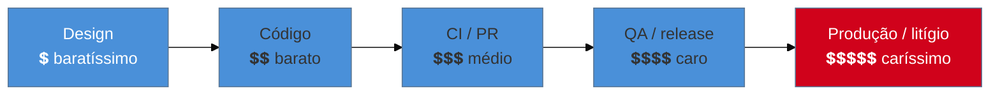

# A11y no ciclo de desenvolvimento

> [!abstract] TL;DR
> Auditoria pontual (SG3) encontra a dívida; **processo** impede que ela volte. Sustentar acessibilidade é embuti-la no ciclo de desenvolvimento em três pontos: no **design system** (componentes acessíveis por construção, para que a acessibilidade seja herdada, não reimplementada a cada tela), no **CI** (o axe da nota 14 como *gate* que barra o merge quando a a11y regride), e na **Definition of Done** (a11y como critério de conclusão de toda tarefa, não um épico separado que nunca chega). O princípio-mãe é o *shift-left*: quanto mais cedo no ciclo a acessibilidade entra, mais barata ela é — a mesma virada "checklist → ofício" da nota 01, agora escalada de indivíduo para organização.

Este sub-galho fecha a trilha respondendo à pergunta que o SG3 deixou no ar: como impedir que a dívida de acessibilidade, uma vez paga, volte a se acumular? A resposta não é "auditar com mais frequência" — é fazer com que a acessibilidade seja **estruturalmente difícil de quebrar**. É a diferença entre limpar a casa e parar de sujá-la.

## Shift-left: a economia de consertar cedo

Há uma curva de custo bem conhecida na engenharia, e a acessibilidade a obedece com rigor: **quanto mais tarde um problema é pego, mais caro é consertá-lo.**



Um contraste corrigido no **design token** custa uma mudança de cor. O mesmo contraste descoberto em **produção**, depois de aplicado em 200 componentes, custa um mutirão — e se virou processo judicial (nota 18), custa advogado. *Shift-left* é o nome da estratégia de empurrar a detecção para a **esquerda** dessa linha: pegar no design, no código, no PR — nunca deixar chegar à direita. Cada um dos três mecanismos a seguir é uma forma de shift-left.

## Mecanismo 1: o design system acessível

O ponto de maior alavancagem. Se os componentes-base da organização — o botão, o input, o modal, o dropdown — são acessíveis **por construção**, então toda tela montada com eles **herda** a acessibilidade sem que cada dev precise reimplementá-la. Um `<Button>` do design system que já traz o elemento nativo, o foco visível e o nome acessível certos é acessibilidade multiplicada por cada uso.

O inverso também é verdadeiro e assustador: um componente-base **inacessível** propaga a falha por todo o produto. Um `<Modal>` do design system sem gestão de foco (nota 06) quebra a acessibilidade de *toda* tela que o usa — a dívida vira sistêmica de uma vez. Por isso o design system é onde o investimento de a11y mais rende e onde a auditoria deve ser mais rigorosa: consertar o componente compartilhado conserta o produto inteiro (a lógica de "agrupar por padrão" da nota 16).

É também onde as bibliotecas headless da nota 10 se encaixam: construir o design system **sobre** primitivos acessíveis (Radix, React Aria) é herdar a acessibilidade dos widgets difíceis de uma fonte testada, em vez de reimplementá-la.

## Mecanismo 2: o gate de CI

O design system evita a maioria das falhas; o **CI** pega as que escapam, **antes** de chegarem à main. É o axe da nota 14, promovido de "teste que roda" a **gate que bloqueia**: se o pull request introduz uma violação de acessibilidade, o build falha e o merge trava — do mesmo jeito que um teste unitário quebrado ou um lint error travam.

```yaml
# no pipeline de PR: a auditoria de a11y como etapa que pode reprovar o merge
- name: Testes de acessibilidade
  run: npm run test:a11y      # vitest-axe nos componentes + playwright+axe nos fluxos
  # se houver violação nova, o job falha → PR fica vermelho → merge bloqueado
```

Duas decisões de ofício ao montar o gate:

- **Baseline vs. zero-tolerância.** Num produto legado com centenas de violações preexistentes, exigir "zero violações" trava tudo no primeiro dia. A estratégia realista é fixar um **baseline** (o estado atual) e falhar apenas em violações **novas** — a dívida velha é paga em ritmo planejado (a matriz da nota 16), mas nenhuma dívida nova entra. O número só pode cair.
- **O gate pega só a metade automatizável.** O CI barra regressões mecânicas (nota 13) — não substitui a passada manual (nota 15). Ele é a rede que impede a dívida *óbvia* de voltar; o julgamento humano continua nos fluxos críticos.

> [!warning] A11y como épico separado no backlog
> **O que acontece:** a acessibilidade vira um épico "Melhorias de A11y" no backlog, sempre despriorizado frente a features. A dívida cresce entre as raras vezes em que o épico sobe.
> **Por quê:** tratada como trabalho *à parte*, a11y compete com feature — e perde sempre. É o reflexo-checklist da nota 01 em escala de time: acessibilidade empurrada para "depois".
> **Como evitar:** a11y não é um épico; é uma **propriedade de cada tarefa**, como não ter bug e ter teste. Entra na Definition of Done (a seguir), não numa fila separada.

## Mecanismo 3: a11y na Definition of Done

O terceiro mecanismo é cultural e é o que amarra os outros dois. Se "pronto" (Definition of Done) inclui acessibilidade, então nenhuma tarefa é concluída deixando dívida para trás — a acessibilidade deixa de ser opcional por construção do processo. Uma DoD com a11y, na prática, adiciona à checklist de conclusão de cada tarefa:

- Passa na auditoria automática (o gate de CI está verde).
- Foi verificada com **teclado** (a passada 1 da nota 15 — minutos por tela).
- Componentes interativos novos têm nome acessível e o contrato APG correto (SG2).
- Conteúdo novo respeita contraste e não depende só de cor (nota 11).

O ponto não é criar burocracia — é tornar a a11y **parte do que significa terminar**, do mesmo jeito que "escrevi os testes" e "não quebrei o build" já são. Quando isso pega, o time para de *adicionar* acessibilidade e passa a *não removê-la*, que é infinitamente mais barato.

> [!question]- Precisa de um "especialista de a11y" no time, ou é responsabilidade de todos?
> As duas coisas, em camadas. A **responsabilidade é de todos** — cada dev roda a passada de teclado, cada designer escolhe contraste, cada PR passa no gate. Essa difusão é o que escala; um especialista gargalo não revisa mil PRs. Mas um ou poucos **campeões de acessibilidade** (*a11y champions*) agregam a expertise profunda: definem o baseline, curam o design system, treinam o time, conduzem as auditorias manuais complexas e são a referência para os casos difíceis. Especialista sem difusão vira gargalo; difusão sem especialista vira mediocridade consistente. A maturidade combina os dois: todos praticam o básico, campeões cuidam do avançado.

**A11y no ciclo em uma frase:** sustentar acessibilidade é embuti-la no design system (herança), no gate de CI (barra regressão) e na Definition of Done (parte de "pronto") — shift-left transformando o ofício individual da nota 01 em processo de organização.

## O que vem a seguir

Você sabe manter a acessibilidade tecnicamente. Falta entender **por que a organização é obrigada** a mantê-la — o cenário legal que transforma tudo isto de "boa prática" em "requisito com consequência jurídica". É o que dá peso de negócio a todo o resto.

- [[03-Dominios/Tecnologia/Acessibilidade/Sustentar e Conformidade/18 - Cenário legal e normativo|18 — Cenário legal e normativo]] — ADA, EN 301 549, EAA e o que a lei exige.
- [[03-Dominios/Tecnologia/Acessibilidade/Sustentar e Conformidade/19 - VPAT, ACR e comunicar conformidade|19 — VPAT/ACR]] — como declarar conformidade formalmente.
- [[03-Dominios/Tecnologia/Acessibilidade/Auditar e Testar/16 - Conduzir uma auditoria completa|16 — Auditoria completa]] — a auditoria pontual que o processo torna contínua.

## Fontes

- **W3C WAI** — [*Planning and Managing Web Accessibility*](https://www.w3.org/WAI/planning-and-managing/) — como integrar a11y ao processo organizacional e de desenvolvimento.
- **GOV.UK** — [*Making your service accessible: an introduction*](https://www.gov.uk/service-manual/helping-people-to-use-your-service/making-your-service-accessible-an-introduction) — a11y como responsabilidade de time e parte do ciclo.
- **Deque** — [*Shift-left accessibility*](https://www.deque.com/shift-left-accessibility/) — a economia de detectar problemas cedo no ciclo.
- **W3C WAI** — [*ARIA APG & Design Systems*](https://www.w3.org/WAI/ARIA/apg/) — construir componentes-base acessíveis para herança no design system.
