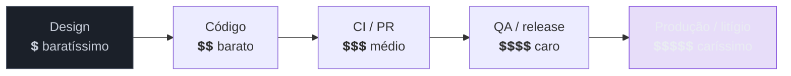

# A11y no ciclo de desenvolvimento

> [!abstract] TL;DR
> Auditoria pontual (SG3) encontra a dívida; **processo** impede que ela volte. Sustentar acessibilidade é embuti-la no ciclo de desenvolvimento em três pontos: no **design system** (componentes acessíveis por construção, para que a acessibilidade seja herdada, não reimplementada a cada tela), no **CI** (o axe da nota 14 como *gate* que barra o merge quando a a11y regride), e na **Definition of Done** (a11y como critério de conclusão de toda tarefa, não um épico separado que nunca chega). O princípio-mãe é o *shift-left*: quanto mais cedo no ciclo a acessibilidade entra, mais barata ela é — a mesma virada "checklist → ofício" da nota 01, agora escalada de indivíduo para organização.

Este sub-galho fecha a trilha respondendo à pergunta que o SG3 deixou no ar: como impedir que a dívida de acessibilidade, uma vez paga, volte a se acumular? A resposta não é "auditar com mais frequência" — é fazer com que a acessibilidade seja **estruturalmente difícil de quebrar**. É a diferença entre limpar a casa e parar de sujá-la.

## Shift-left: a economia de consertar cedo

Há uma curva de custo bem conhecida na engenharia, e a acessibilidade a obedece com rigor: **quanto mais tarde um problema é pego, mais caro é consertá-lo.**



Um contraste corrigido no **design token** custa uma mudança de cor. O mesmo contraste descoberto em **produção**, depois de aplicado em 200 componentes, custa um mutirão — e se virou processo judicial (nota 18), custa advogado. *Shift-left* é o nome da estratégia de empurrar a detecção para a **esquerda** dessa linha: pegar no design, no código, no PR — nunca deixar chegar à direita. Cada um dos três mecanismos a seguir é uma forma de shift-left.

## Mecanismo 1: o design system acessível

O ponto de maior alavancagem. Se os componentes-base da organização — o botão, o input, o modal, o dropdown — são acessíveis **por construção**, então toda tela montada com eles **herda** a acessibilidade sem que cada dev precise reimplementá-la. Um `<Button>` do design system que já traz o elemento nativo, o foco visível e o nome acessível certos é acessibilidade multiplicada por cada uso.

O inverso também é verdadeiro e assustador: um componente-base **inacessível** propaga a falha por todo o produto. Um `<Modal>` do design system sem gestão de foco (nota 06) quebra a acessibilidade de *toda* tela que o usa — a dívida vira sistêmica de uma vez. Por isso o design system é onde o investimento de a11y mais rende e onde a auditoria deve ser mais rigorosa: consertar o componente compartilhado conserta o produto inteiro (a lógica de "agrupar por padrão" da nota 16).

É também onde as bibliotecas headless da nota 10 se encaixam: construir o design system **sobre** primitivos acessíveis (Radix, React Aria) é herdar a acessibilidade dos widgets difíceis de uma fonte testada, em vez de reimplementá-la.

## Mecanismo 2: o gate de CI

O design system evita a maioria das falhas; o **CI** pega as que escapam, **antes** de chegarem à main. É o axe da nota 14, promovido de "teste que roda" a **gate que bloqueia**: se o pull request introduz uma violação de acessibilidade, o build falha e o merge trava — do mesmo jeito que um teste unitário quebrado ou um lint error travam.

```yaml
# no pipeline de PR: a auditoria de a11y como etapa que pode reprovar o merge
- name: Testes de acessibilidade
  run: npm run test:a11y      # vitest-axe nos componentes + playwright+axe nos fluxos
  # se houver violação nova, o job falha → PR fica vermelho → merge bloqueado
```

Duas decisões de ofício ao montar o gate:

- **Baseline vs. zero-tolerância.** Num produto legado com centenas de violações preexistentes, exigir "zero violações" trava tudo no primeiro dia. A estratégia realista é fixar um **baseline** (o estado atual) e falhar apenas em violações **novas** — a dívida velha é paga em ritmo planejado (a matriz da nota 16), mas nenhuma dívida nova entra. O número só pode cair.
- **O gate pega só a metade automatizável.** O CI barra regressões mecânicas (nota 13) — não substitui a passada manual (nota 15). Ele é a rede que impede a dívida *óbvia* de voltar; o julgamento humano continua nos fluxos críticos.

> [!warning] A11y como épico separado no backlog
> **O que acontece:** a acessibilidade vira um épico "Melhorias de A11y" no backlog, sempre despriorizado frente a features. A dívida cresce entre as raras vezes em que o épico sobe. **Por quê:** tratada como trabalho *à parte*, a11y compete com feature — e perde sempre. É o reflexo-checklist da nota 01 em escala de time: acessibilidade empurrada para "depois". **Como evitar:** a11y não é um épico; é uma **propriedade de cada tarefa**, como não ter bug e ter teste. Entra na Definition of Done (a seguir), não numa fila separada.

## Mecanismo 3: a11y na Definition of Done

O terceiro mecanismo é cultural e é o que amarra os outros dois. Se "pronto" (Definition of Done) inclui acessibilidade, então nenhuma tarefa é concluída deixando dívida para trás — a acessibilidade deixa de ser opcional por construção do processo. Uma DoD com a11y, na prática, adiciona à checklist de conclusão de cada tarefa:

- Passa na auditoria automática (o gate de CI está verde).
- Foi verificada com **teclado** (a passada 1 da nota 15 — minutos por tela).
- Componentes interativos novos têm nome acessível e o contrato APG correto (SG2).
- Conteúdo novo respeita contraste e não depende só de cor (nota 11).

O ponto não é criar burocracia — é tornar a a11y **parte do que significa terminar**, do mesmo jeito que "escrevi os testes" e "não quebrei o build" já são. Quando isso pega, o time para de *adicionar* acessibilidade e passa a *não removê-la*, que é infinitamente mais barato.

> [!question]- Precisa de um "especialista de a11y" no time, ou é responsabilidade de todos?
> As duas coisas, em camadas. A **responsabilidade é de todos** — cada dev roda a passada de teclado, cada designer escolhe contraste, cada PR passa no gate. Essa difusão é o que escala; um especialista gargalo não revisa mil PRs. Mas um ou poucos **campeões de acessibilidade** (*a11y champions*) agregam a expertise profunda: definem o baseline, curam o design system, treinam o time, conduzem as auditorias manuais complexas e são a referência para os casos difíceis. Especialista sem difusão vira gargalo; difusão sem especialista vira mediocridade consistente. A maturidade combina os dois: todos praticam o básico, campeões cuidam do avançado.

**A11y no ciclo em uma frase:** sustentar acessibilidade é embuti-la no design system (herança), no gate de CI (barra regressão) e na Definition of Done (parte de "pronto") — shift-left transformando o ofício individual da nota 01 em processo de organização.

> [!tip] Vídeo — The ROI of shift left accessibility
> [**The ROI of shift left accessibility**](https://www.youtube.com/watch?v=K8e4qAYg-Aw) (Deque, Kirstine Kennedy, 30 min) — a Deque é a mesma origem do axe (nota 14); o vídeo detalha, com números, por que corrigir cedo é mais barato que corrigir tarde — a curva de custo que abre esta nota, com o argumento de negócio por trás do shift-left.

## Casos práticos

**Cenário 1 — o `<Modal>` que quebrou o produto inteiro.** Um design system tinha um componente `<Modal>` amplamente adotado, mas sem gestão de foco: ao abrir, o foco não era movido para dentro do diálogo; ao fechar, não retornava ao elemento que o disparou (nota 06). Enquanto o modal era usado em uma ou duas telas, o impacto parecia pequeno. O problema é que o modal foi reaproveitado — como qualquer peça de design system deveria ser — em dezenas de fluxos: checkout, edição de perfil, confirmação de exclusão. Cada nova tela que adotou o componente **herdou a falha junto com a conveniência**. Quando a auditoria (SG3) finalmente pegou o problema, não havia "um modal quebrado" para consertar — havia um padrão sistêmico espalhado pelo produto inteiro. A correção, por outro lado, também foi sistêmica: um único ajuste no componente-base resolveu todas as instâncias de uma vez. É a mesma alavancagem em dois sentidos — o design system multiplica tanto o erro quanto o conserto (nota 16).

**Cenário 2 — o gate de CI com baseline num produto legado.** Um time herdou uma base de código com centenas de violações de acessibilidade acumuladas ao longo de anos — o tipo de dívida que a nota 16 descreve. Rodar o axe (nota 14) em modo "zero violações" travaria todo PR novo desde o primeiro dia, inviabilizando qualquer entrega. Em vez disso, o time capturou um **baseline**: o conjunto de violações existentes na data X, registrado como "conhecido, aceito por ora". O gate de CI passou a comparar cada PR contra esse baseline, falhando apenas quando o número de violações **subia**. Na prática, isso significou: nenhuma tela nova entrava com problemas de acessibilidade, mesmo que o legado ao redor continuasse imperfeito. A dívida velha foi sendo paga em paralelo, em sprints dedicados (a matriz de priorização da nota 16) — mas, a partir do dia em que o gate entrou no ar, a dívida **parou de crescer**. É a diferença entre estancar uma hemorragia e esperar cicatrizar tudo de uma vez.

## Armadilhas comuns

> [!warning] Exigir zero-violações num legado trava tudo
> **O que acontece:** o time ativa o gate de CI em modo estrito — qualquer violação de acessibilidade reprova o build — num produto que já tem centenas delas acumuladas. Todo PR passa a falhar, inclusive os que não tocam em nada relacionado a a11y. **Por quê:** o gate não distingue dívida herdada de dívida nova; ele só vê "violação existe: sim/não". Sem baseline, o critério é impossível de cumprir e o time aprende a ignorar o gate (ou a desativá-lo) — o pior desfecho possível. **Como evitar:** sempre fixar um baseline antes de ligar o modo bloqueante (ver Cenário 2). O gate deve travar **regressões**, não exigir perfeição instantânea.

> [!warning] Achar que o CI dispensa a passada manual
> **O que acontece:** o time vê o pipeline verde — "o axe não achou nada" — e conclui que a tela está acessível, pulando a passada de teclado (nota 15) e a checagem de nome acessível/contrato APG (SG2). **Por quê:** ferramentas automatizadas como o axe cobrem uma fração conhecida das falhas — as mecânicas e sintáticas (nota 13). Ordem de tabulação ilógica, foco perdido num fluxo complexo, texto alternativo que existe mas não faz sentido: nada disso é pego por uma varredura automática, porque exige julgamento humano sobre a experiência. **Como evitar:** tratar o gate de CI como piso, não teto. Verde no CI é pré-requisito para revisão manual, não substituto dela — os dois mecanismos (nota 15) continuam necessários.

> [!warning] Depender de um único especialista gargalo
> **O que acontece:** a organização contrata ou designa uma pessoa como "responsável pela acessibilidade" e passa a rotear toda dúvida, revisão e decisão de a11y por ela. O time para de desenvolver o próprio julgamento porque "isso é problema do especialista". **Por quê:** uma pessoa não escala para revisar cada PR de um time (ou de uma organização) inteiro. O especialista vira fila, a fila vira atraso, e o atraso vira pressão para pular a revisão — a acessibilidade regride exatamente onde deveria ser mais forte. **Como evitar:** distribuir o básico (a passada de teclado, o contraste, a DoD) para todo o time, e reservar o especialista — o *a11y champion* — para o avançado: curar o design system, definir o baseline, treinar, arbitrar os casos difíceis (ver a resposta ao `[!question]` acima).

## Como explicar em inglês

In an interview, this is the answer that signals you think about accessibility as an engineering process, not a one-off fix: "We treat accessibility as something the system enforces, not something a person remembers to do. Our design system components are accessible by construction, so any screen built with them inherits that — a broken `<Modal>` in the design system used to break focus management across the entire product, so we fixed it once, upstream. We also run an accessibility gate in CI: axe-core checks every PR, and on a legacy codebase we set a baseline so the gate only fails on **new** regressions, not the debt we inherited. Automated checks catch maybe half the issues, so accessibility is also part of our Definition of Done — every engineer does a keyboard pass before calling a ticket done. It's shift-left: catching problems in the design token or the PR is orders of magnitude cheaper than catching them in production."

| PT | EN |
|---|---|
| deslocar para a esquerda (no ciclo) | shift-left |
| porteiro / trava de qualidade no CI | CI gate |
| Definição de Pronto | Definition of Done (DoD) |
| sistema de design | design system |
| campeão de acessibilidade | a11y champion |
| linha de base (violações conhecidas) | baseline |
| regressão (nova violação) | regression |
| dívida (de acessibilidade) | (accessibility) debt |
| acessível por construção | accessible by construction / built-in accessibility |
| herdar (comportamento de um componente) | inherit |

## O que vem a seguir

Você sabe manter a acessibilidade tecnicamente. Falta entender **por que a organização é obrigada** a mantê-la — o cenário legal que transforma tudo isto de "boa prática" em "requisito com consequência jurídica". É o que dá peso de negócio a todo o resto.

- [[03-Dominios/Tecnologia/Acessibilidade/Sustentar e Conformidade/18 - Cenário legal e normativo|18 — Cenário legal e normativo]] — ADA, EN 301 549, EAA e o que a lei exige.
- [[03-Dominios/Tecnologia/Acessibilidade/Sustentar e Conformidade/19 - VPAT, ACR e comunicar conformidade|19 — VPAT/ACR]] — como declarar conformidade formalmente.
- [[03-Dominios/Tecnologia/Acessibilidade/Auditar e Testar/16 - Conduzir uma auditoria completa|16 — Auditoria completa]] — a auditoria pontual que o processo torna contínua.

## Fontes

- **W3C WAI** — [*Planning and Managing Web Accessibility*](https://www.w3.org/WAI/planning-and-managing/) — como integrar a11y ao processo organizacional e de desenvolvimento.
- **GOV.UK** — [*Making your service accessible: an introduction*](https://www.gov.uk/service-manual/helping-people-to-use-your-service/making-your-service-accessible-an-introduction) — a11y como responsabilidade de time e parte do ciclo.
- **Deque** — [*Shift-left accessibility*](https://www.deque.com/shift-left-accessibility/) — a economia de detectar problemas cedo no ciclo.
- **W3C WAI** — [*ARIA APG & Design Systems*](https://www.w3.org/WAI/ARIA/apg/) — construir componentes-base acessíveis para herança no design system.
