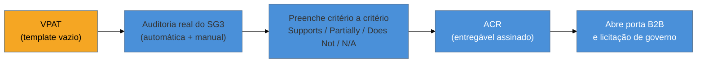

# VPAT, ACR e comunicar conformidade

> [!abstract] TL;DR
> Cumprir a lei (nota 18) é uma coisa; **declarar** que você cumpre, de forma verificável, é outra — e é o que fecha vendas B2B e passa em licitações. Dois artefatos fazem isso. O **VPAT** (*Voluntary Product Accessibility Template*) é o **formulário** padrão da indústria onde se documenta, critério WCAG por critério, o grau de conformidade do produto; preenchido e assinado, ele vira um **ACR** (*Accessibility Conformance Report*). A honestidade é o valor central: cada critério recebe "Supports / Partially Supports / Does Not Support / Not Applicable", e mentir num VPAT é responsabilidade contratual. Já o **accessibility statement** é a versão pública e amigável — uma página no seu site que declara o compromisso, o nível-alvo, os problemas conhecidos e como pedir ajuda.

Você auditou (SG3), sustenta (nota 17) e conhece a lei (nota 18). Falta a peça que conecta tudo isso ao mundo externo: **como uma organização comunica formalmente o quão acessível seu produto é**. Isso importa por uma razão concreta e sênior — em vendas corporativas e no setor público, ninguém acredita na sua palavra. O comprador (uma universidade, um órgão de governo, uma grande empresa) *exige um documento*, porque ele próprio tem obrigação legal de comprar acessível. Sem esse documento, você não entra na concorrência.

## O VPAT: o formulário que a indústria adotou

O **VPAT** é um template mantido pela **ITI** (Information Technology Industry Council) que se tornou o padrão de fato para documentar acessibilidade de um produto. Ele existe em **quatro edições**, para casar com o regime legal do comprador (a nota 18 explica cada régua):

| Edição do VPAT | Régua que documenta | Para quem exige |
|----------------|---------------------|-----------------|
| **VPAT WCAG** | WCAG (2.1 / 2.2) A, AA, AAA | Compradores privados, uso geral |
| **VPAT 508** | Seção 508 (revisada) | Governo federal dos EUA |
| **VPAT EU** | EN 301 549 | Mercado europeu |
| **VPAT INT** | As três combinadas | Fornecedores globais |

A estrutura interna é uma **tabela por princípio/critério**: para cada critério de sucesso do WCAG, uma linha com duas colunas essenciais — o **nível de conformidade** (a seguir) e **observações** que explicam *como* o produto atende ou *onde* falha. O documento não é marketing; é um inventário técnico item a item.

## A honestidade codificada: os quatro níveis

O coração do VPAT — e o que o torna confiável — é a escala de conformidade que cada critério recebe. São quatro termos, com significados precisos:

- **Supports** — o produto atende ao critério. Sem ressalvas.
- **Partially Supports** — atende em parte; há falhas. As observações **devem** dizer exatamente quais e onde.
- **Does Not Support** — não atende.
- **Not Applicable** — o critério não se aplica ao produto (ex.: um critério de vídeo num produto sem mídia).

> [!warning] "Supports" em tudo para fechar a venda
> **O que acontece:** o time preenche o VPAT marcando "Supports" em critérios que o produto não cumpre, para não perder o negócio. O comprador integra o produto, descobre as falhas em uso (ou numa auditoria), e agora há um documento assinado que **afirmava conformidade falsa**. **Por quê:** o VPAT é um documento com peso **contratual e de responsabilidade**. Uma declaração falsa não é otimismo — é exposição legal, quebra de contrato e dano de reputação, muito pior que um "Partially Supports" honesto. **Como evitar:** um VPAT honesto com "Partially Supports" bem explicados (o que falha, o impacto, o plano de correção) é **mais forte** que um "Supports" mentiroso — mostra que você conhece seu produto e leva a11y a sério. Compradores maduros preferem transparência a perfeição de fachada. Preencha com base na auditoria real do SG3, não no que você gostaria que fosse verdade.

## Do VPAT ao ACR

A confusão de nomes é comum, então vale fixar: o **VPAT** é o **template vazio** (o formulário em branco). Quando você o **preenche** com os dados reais do seu produto e o **publica/assina**, ele passa a ser um **ACR** — *Accessibility Conformance Report*. Na prática o mercado usa "VPAT" para os dois, mas tecnicamente: VPAT = formulário, ACR = formulário preenchido = o **entregável**.

Produzir um ACR honesto **depende inteiramente do SG3**: você não consegue dizer "Partially Supports, falha no critério 2.1.1 no widget de calendário" sem ter feito a auditoria automática e manual que descobriu isso. O ACR é, literalmente, a auditoria da nota 16 traduzida para o formato que o comprador entende. Auditoria ruim gera ACR falso; auditoria boa gera ACR confiável.

## O accessibility statement: a versão pública

O ACR é técnico, denso e voltado a compradores. Existe uma contraparte **pública e humana**: a **declaração de acessibilidade** (*accessibility statement*), uma página no seu site — geralmente linkada no rodapé — dirigida aos **usuários**, não a compradores. Um bom statement contém:

- **O compromisso e o nível-alvo** — "buscamos conformidade com WCAG 2.1 AA".
- **O estado atual honesto** — o que já é conforme e quais **problemas conhecidos** existem (sim, admitir limitações; é o mesmo princípio do "Partially Supports").
- **Um canal de contato** — como uma pessoa que encontrou uma barreira **pede ajuda ou reporta** o problema. Este é o item mais importante para o usuário: dá a ele uma saída quando algo não funciona.
- **A data da última avaliação** e as tecnologias/leitores de tela testados.

Em várias jurisdições (a Web Accessibility Directive europeia, por exemplo), o accessibility statement do setor público é **obrigatório** e tem formato definido. Mesmo onde não é exigido, ele sinaliza maturidade e oferece ao usuário com deficiência algo que quase nenhum site dá: reconhecimento e um caminho.

> [!question]- Admitir problemas conhecidos não é dar munição contra a empresa?
> É contraintuitivo, mas o oposto é verdade. Um statement (ou VPAT) que admite limitações **com um plano** demonstra que a organização *conhece* seu estado e o *gerencia* — exatamente o que um comprador ou regulador quer ver. O que gera risco jurídico não é admitir uma falha conhecida; é **afirmar conformidade que não existe** (o "Supports" mentiroso) ou fingir que está tudo perfeito e ser desmentido por uma auditoria externa. Transparência com plano é gestão de risco; silêncio ou falsidade é exposição. A honestidade, aqui, é literalmente a opção mais segura.

**VPAT/ACR em uma frase:** o VPAT é o formulário-padrão da indústria para declarar conformidade WCAG critério a critério; preenchido honestamente (com "Partially Supports" reais, não "Supports" de fachada) vira o ACR que abre portas B2B e de governo — e o accessibility statement é sua versão pública e amigável para o usuário.

> [!tip] Vídeo — preencher um VPAT e criar o ACR
> [**How to Fill Out a VPAT (and Create an ACR)**](https://www.youtube.com/watch?v=_f9baY9eR4s) (The ADA Book / Accessible.org, 13 min) — passeio prático pelo template, critério a critério, mostrando como escolher entre "Supports / Partially Supports / Does Not Support" com honestidade e como o VPAT preenchido vira o ACR que o comprador lê.

## Casos práticos

### Cenário 1: o "Partially Supports" honesto que fechou a venda
Um fornecedor de SaaS disputa um contrato com uma universidade, que exige um ACR. Em vez de marcar "Supports" em tudo, o time entrega um ACR com alguns "Partially Supports" bem explicados — qual critério falha, em qual tela, e o plano de correção com data. O comprador **escolhe esse fornecedor** justamente por isso: o ACR honesto sinaliza que a empresa conhece e gerencia seu estado de acessibilidade, enquanto um "Supports" perfeito demais levantaria suspeita. Transparência com plano venceu perfeição de fachada.

### Cenário 2: o accessibility statement que deu voz ao usuário
Uma pessoa que usa leitor de tela trava num fluxo de pagamento. Em vez de simplesmente abandonar (uma conversão perdida e invisível), ela encontra no rodapé a **declaração de acessibilidade**, que admite problemas conhecidos e oferece um **canal de contato**. Ela reporta a barreira; o time, que já a tinha no backlog priorizado, confirma a correção planejada. O statement transformou um abandono silencioso em feedback acionável e num usuário que se sentiu reconhecido.

## Armadilhas comuns

> [!warning] Marcar "Supports" em tudo para fechar a venda
> **O que acontece:** o time preenche o VPAT afirmando conformidade que o produto não tem; o comprador descobre em uso ou numa auditoria, e há um documento assinado com declaração falsa. **Por quê:** o VPAT/ACR tem peso contratual e de responsabilidade. Uma afirmação falsa é exposição legal e dano de reputação — muito pior que um "Partially Supports" honesto. **Como evitar:** preencha com base na auditoria real do SG3. "Partially Supports" bem explicado é mais forte que "Supports" mentiroso; compradores maduros preferem transparência a perfeição de fachada.

> [!warning] Confundir VPAT (template) com ACR (preenchido)
> **O que acontece:** o time promete "temos um VPAT" mas entrega o formulário em branco, ou chama de ACR algo que nunca foi preenchido com dados reais do produto. **Por quê:** VPAT é o template vazio; ACR é o VPAT preenchido, assinado e datado — o entregável. O comprador precisa do segundo, não do primeiro. **Como evitar:** o entregável é sempre o ACR: produto + versão, método de avaliação, régua WCAG usada, e cada critério classificado com base em auditoria real.

> [!warning] Accessibility statement sem canal de contato
> **O que acontece:** a declaração de acessibilidade lista compromissos e conformidade, mas não diz como o usuário reporta uma barreira que encontrou. **Por quê:** para o usuário com deficiência, o item mais valioso do statement é a saída — um jeito de pedir ajuda quando algo não funciona. Sem ele, o statement é só marketing. **Como evitar:** inclua sempre um canal de contato acessível (e-mail/formulário), a data da última avaliação e os problemas conhecidos com plano.

## Como explicar em inglês

> "A **VPAT** is the industry-standard template for documenting your product's accessibility criterion by criterion, using four levels: **Supports, Partially Supports, Does Not Support, Not Applicable**. Filled in and signed, it becomes an **ACR** — an Accessibility Conformance Report — which is what enterprise and government buyers require in procurement. The key is honesty: a well-explained *Partially Supports* is stronger than a fake *Supports*, because a false claim is contractual exposure. And the public-facing counterpart is the **accessibility statement** — a page that states your target level, known issues, and, most importantly, a way for users to report barriers."

| PT | EN |
|----|-----|
| VPAT (modelo de conformidade) | VPAT (accessibility template) |
| relatório de conformidade (ACR) | Accessibility Conformance Report (ACR) |
| declaração de acessibilidade | accessibility statement |
| atende parcialmente | partially supports |
| não se aplica | not applicable |
| licitação / compras corporativas | procurement |
| problemas conhecidos | known issues |
| conformidade | conformance |

## O que vem a seguir

Fecha-se o conteúdo técnico do domínio: você constrói, prova, sustenta, conhece a lei e sabe declarar conformidade. Falta destilar tudo isso na forma que mais importa para o objetivo de carreira — **como falar de acessibilidade numa entrevista sênior**, demonstrando o repertório sem cair nos clichês que denunciam quem só decorou a palavra "ARIA".

- [[03-Dominios/Tecnologia/Acessibilidade/Sustentar e Conformidade/20 - A11y em entrevista|20 — A11y em entrevista]] — a nota que fecha o SG4.
- [[03-Dominios/Tecnologia/Acessibilidade/Auditar e Testar/16 - Conduzir uma auditoria completa|16 — Auditoria completa]] — de onde saem os dados honestos do ACR.
- [[03-Dominios/Tecnologia/Acessibilidade/Sustentar e Conformidade/18 - Cenário legal e normativo|18 — Cenário legal]] — por que compradores exigem o documento.

## Fontes

- **ITI** — [*VPAT (Voluntary Product Accessibility Template)*](https://www.itic.org/policy/accessibility/vpat) — o template oficial, suas quatro edições e instruções de preenchimento.
- **Section508.gov** — [*How to create an Accessibility Conformance Report (ACR)*](https://www.section508.gov/sell/vpat/) — como transformar o VPAT num ACR confiável.
- **W3C WAI** — [*Developing an Accessibility Statement*](https://www.w3.org/WAI/planning/statements/) — modelo e gerador de declaração de acessibilidade pública.
- **W3C WAI** — [*Accessibility Statement Generator*](https://www.w3.org/WAI/planning/statements/generator/) — ferramenta prática para produzir o statement.
