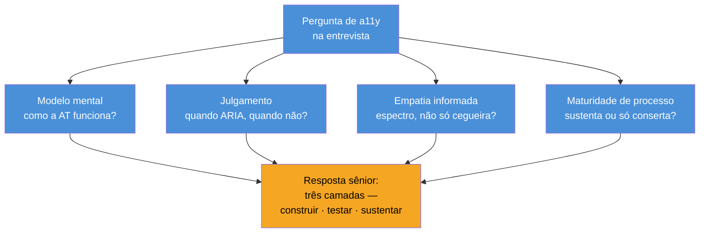

# A11y em entrevista

> [!abstract] TL;DR
> Acessibilidade é um dos poucos temas em que um candidato sênior se distingue de um pleno em **duas frases** — porque a maioria trata a11y como "adicionar ARIA" (o clichê que denuncia superficialidade), e você aprendeu o oposto: semântica primeiro, o accessibility tree por trás, a automação com teto, a lei com dente. Numa entrevista, o objetivo não é recitar critérios WCAG de cor — é demonstrar **modelo mental** (por que, não só o quê), **trade-offs** (quando ARIA, quando não) e **maturidade de processo** (como se sustenta, não só como se conserta). Esta nota destila o domínio inteiro em respostas prontas para as perguntas que caem, os red flags que afundam candidatos, e o vocabulário em inglês para articular tudo isso.

Última nota do domínio, e a que amarra o conhecimento ao objetivo de carreira. Acessibilidade aparece em entrevistas de frontend sênior com frequência crescente — parte porque a lei apertou (nota 18), parte porque é um excelente **filtro de profundidade**: a resposta a "como você garante acessibilidade?" separa em segundos quem entende de quem decorou. Vamos fazer você ficar do lado certo desse filtro.

## O que o entrevistador está realmente testando

Quando surge uma pergunta de a11y, raramente o objetivo é checar se você sabe o número de um critério. O que se avalia é mais profundo, e mapeia direto no que você estudou:

- **Modelo mental** — você entende *como* a tecnologia assistiva funciona (o accessibility tree, nota 02), ou só decorou atributos? Explicar o *mecanismo* é o sinal de senioridade.
- **Julgamento** — você sabe *quando* usar cada ferramenta? "ARIA sempre" é júnior; "semântica primeiro, ARIA só quando o HTML não alcança" (nota 05) é sênior.
- **Empatia informada** — você pensa em usuários reais e no espectro (nota 01), ou recita "pessoas cegas"?
- **Maturidade de processo** — você sabe que a11y se *sustenta* (nota 17), não só se *conserta*? Falar de CI, design system e Definition of Done mostra que você já operou isso em escala.

O entrevistador não soma pontos por critério citado — ele testa se as quatro dimensões colapsam numa única resposta coerente. É exatamente a estrutura de três camadas (construir → testar → sustentar) que aparece na resposta-modelo abaixo.

## As perguntas que caem, e como respondê-las como sênior

> [!example] "Como você garante que uma aplicação é acessível?"
> **Resposta júnior:** "Eu adiciono atributos ARIA e uso o axe." **Resposta sênior:** "Em três camadas. Primeiro, **construo certo**: HTML semântico antes de ARIA, porque o elemento nativo já entrega role, foco e teclado sem bugs — ARIA eu reservo para o que o HTML não tem, como um combobox. Segundo, **testo em duas frentes**: automação (axe no CI) para pegar a metade mecânica — contraste, labels — e teste manual com teclado e leitor de tela para a metade que a máquina não vê, como ordem de foco e qualidade de alt text. Terceiro, **sustento**: componentes acessíveis no design system e a11y na Definition of Done, para não regredir. A automação sozinha pega só cerca de metade dos problemas, então o manual não é opcional."

Repare no que a resposta sênior faz: dá **estrutura** (três camadas), justifica com **mecanismo** ("porque o nativo já entrega..."), e crava o **trade-off honesto** (o teto da automação). É o domínio inteiro em um parágrafo.

Outras que aparecem, com o ângulo-chave:

- **"Qual a diferença entre `aria-label` e `<label>`?"** — mostre que sabe a *cascata* do accessible name (nota 02): `<label>` é a associação nativa preferida para campos de formulário; `aria-label` é para quando não há texto visível (botão de ícone). Bônus sênior: "e prefiro o `<label>` porque também aumenta a área de clique."
- **"Como você testa acessibilidade?"** — a resposta é a nota 15/16: automático + as três passadas manuais (teclado, leitor de tela, zoom). Mencione desconectar o mouse — é concreto e memorável.
- **"O que é o accessibility tree?"** — se você explica que é o "DOM paralelo" que o browser deriva e que a AT lê, com role/name/state/value, você já está no top 10% dos candidatos. Quase ninguém sabe explicar isso.
- **"Por que não usar `
` para um botão?"** — enumere o que o `<button>` dá de graça (role, tab order, Enter/Espaço) e o que a div obriga a reimplementar (nota 05). É a pergunta-armadilha favorita, e você a domina.

## Os red flags que afundam candidatos

Tão importante quanto o que dizer é o que **não** dizer. Estas frases sinalizam superficialidade:

- **"Acessibilidade é para usuários cegos."** — revela o mito da nota 01. Corrija-se antes de dizer: fale do espectro (motora, cognitiva, situacional).
- **"É só adicionar ARIA."** — a frase que a nota 05 inteira desmonta. ARIA mal usado *piora* (o paradoxo do WebAIM); dizer isso mostra que você sabe.
- **"Rodamos o Lighthouse e deu 100, então está acessível."** — ignora o teto da automação (nota 13). Um sênior sabe que score alto é piso, não prova.
- **"A11y a gente faz no final."** — o reflexo-checklist. A resposta madura é shift-left (nota 17): quanto mais cedo, mais barato.
- **"Removo o outline do foco porque é feio."** — cega o usuário de teclado (nota 11). Diga `:focus-visible` melhorado, nunca `outline: none`.

## Como demonstrar, não só afirmar

O candidato mais forte **mostra**, quando o formato permite. Se houver um exercício de código ou um take-home:

- **Use elementos semânticos** sem que ninguém peça — `<button>`, `<nav>`, `<main>`, headings em ordem. O entrevistador nota.
- **Rode a passada de teclado** no seu próprio código e comente: "deixa eu conferir que isso funciona sem mouse." Ninguém faz isso; você fará.
- **Nomeie os ícones** — um `aria-label` num botão de ícone, espontaneamente, é um sinal claro de hábito.
- **Comente o trade-off** — "aqui eu usaria o `<dialog>` nativo em vez de escrever focus trap na mão." Mostra que você conhece as duas opções e escolheu.

## Como explicar em inglês

Numa entrevista internacional, articular a11y em inglês natural é o que converte conhecimento em avaliação positiva. Frases prontas:

> "My approach to accessibility is **semantics first, ARIA last**. Native HTML gives you the correct role, focus behavior, and keyboard handling for free, so I only reach for ARIA when the platform genuinely doesn't have the element I need — like a combobox or a tabs widget."

> "I test in two layers: **automated checks** with axe in CI catch the mechanical issues like contrast and missing labels, but automated tools only catch **roughly a third to half** of accessibility problems. The rest — focus order, meaningful alt text, whether the keyboard flow actually makes sense — needs **manual testing** with a keyboard and a screen reader."

> "The most impactful thing is building accessibility into the process: **accessible components in the design system**, an **axe gate in CI** so regressions can't merge, and a11y in the **Definition of Done** — so it's not a separate epic that never gets prioritized."

| PT | EN |
|----|----|
| leitor de tela | screen reader |
| árvore de acessibilidade | accessibility tree |
| nome acessível | accessible name |
| navegação por teclado | keyboard navigation |
| gestão de foco | focus management |
| tecnologia assistiva | assistive technology |
| conformidade | compliance / conformance |
| teste manual | manual testing |
| contraste de cor | color contrast |
| deficiência (situacional/temporária) | (situational/temporary) disability |

**A11y em entrevista em uma frase:** demonstre modelo mental (o accessibility tree, o porquê), julgamento (semântica antes de ARIA), o teto honesto da automação e maturidade de processo (shift-left) — e fuja dos clichês ("é só ARIA", "Lighthouse deu 100") que denunciam superfície.

> [!tip] Vídeo — 50 Accessibility Interview Questions That Actually Get You HIRED
> [**50 Accessibility Interview Questions That Actually Get You HIRED in 2026**](https://www.youtube.com/watch?v=K4VXa7OjpQE) (Skills Singh, 17 min) — bateria rápida de perguntas e respostas cobrindo WCAG, ARIA, leitores de tela, Axe/ANDI/NVDA e testes de a11y. Útil como simulado de múltipla-pergunta depois de internalizar o *porquê* desta nota: aqui você treina volume e velocidade de resposta, não profundidade.

## Armadilhas comuns

Além dos red flags de fala, há erros de **comportamento na entrevista** que denunciam superficialidade mesmo quando o candidato conhece o vocabulário certo:

> [!warning] Recitar critérios WCAG sem explicar o mecanismo
> **O que acontece:** o candidato cita "1.4.3 contraste mínimo" ou "4.1.2 nome, função, valor" de cabeça, mas trava quando perguntado *por que* aquele critério existe. **Por quê:** decorar números é fácil de simular com flashcard; explicar o mecanismo (o que a tecnologia assistiva lê, o que quebra sem ele) exige ter operado o problema de verdade — é exatamente o que o entrevistador está testando (seção acima). **Como evitar:** treine explicar o *efeito no usuário*, não o número do critério. Troque "1.4.3" por "sem contraste suficiente, quem tem baixa visão não distingue o texto do fundo — e isso nem sempre é achado pelo Lighthouse em elementos com opacidade ou gradiente."

> [!warning] Tratar a pergunta de a11y como pergunta de ferramenta
> **O que acontece:** a resposta vira uma lista de nomes — "uso axe, Lighthouse, WAVE, NVDA" — sem nunca chegar ao *processo* que decide quando cada uma entra. **Por quê:** ferramentas são o `quê`, não o `como`; listar nomes é o mesmo clichê de "é só adicionar ARIA" com roupa nova, porque não mostra julgamento nem sustentação (notas 13, 17). **Como evitar:** ancore a resposta na estrutura de três camadas (construir → testar → sustentar) e cite as ferramentas só como exemplo dentro de cada camada, nunca como a resposta inteira.

> [!warning] Sobrecorrigir e recusar automação
> **O que acontece:** para não soar como quem confia cegamente no Lighthouse, o candidato vai para o outro extremo e descarta a automação como "inútil" ou "não confio em ferramenta nenhuma". **Por quê:** isso é tão raso quanto o excesso de confiança — ignora que a automação pega a metade mecânica dos problemas de graça e a um custo de CI desprezível (nota 13); rejeitar automação por completo sinaliza falta de pragmatismo operacional, não rigor. **Como evitar:** posicione a automação como piso obrigatório e barato, não como solução — "eu rodo axe no CI porque pega metade dos problemas sem custo humano, e reservo o teste manual para a outra metade que só um humano percebe."

## O que vem a seguir

Isto fecha o SG4 e o conteúdo instrucional do domínio. Falta uma única peça: colocar tudo em prática num exercício integrador que costura os quatro sub-galhos — pegar um produto inacessível, auditar, priorizar, remediar e documentar, do começo ao fim. É o capstone.

- [[03-Dominios/Tecnologia/Acessibilidade/21 - Capstone - auditar e remediar um produto do zero|21 — Capstone: auditar e remediar um produto do zero]] — o exercício final do domínio.
- [[03-Dominios/Carreira/Entrevistas/index|Carreira — Entrevistas]] — onde a11y se junta ao repertório geral de entrevista sênior.
- [[03-Dominios/Tecnologia/Acessibilidade/Fundamentos e Modelo Mental/01 - A11y é ofício, não checklist|01 — A11y é ofício]] — a nota que abriu o domínio e que estas respostas destilam.

## Fontes

- **web.dev (Google)** — [*Learn Accessibility*](https://web.dev/learn/accessibility/) — curso que consolida o repertório técnico cobrado em entrevista.
- **WebAIM** — [*Introduction to Web Accessibility*](https://webaim.org/intro/) — a base conceitual (espectro, mitos) que sustenta as respostas maduras.
- **MDN Web Docs** — [*Accessibility*](https://developer.mozilla.org/en-US/docs/Web/Accessibility) — referência para as perguntas técnicas pontuais (ARIA, semântica, teclado).
- **Smashing Magazine** — [*Accessibility interview questions*](https://www.smashingmagazine.com/2021/03/complete-guide-accessible-front-end-components/) — panorama das perguntas recorrentes e do que denota profundidade.
