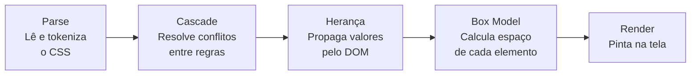
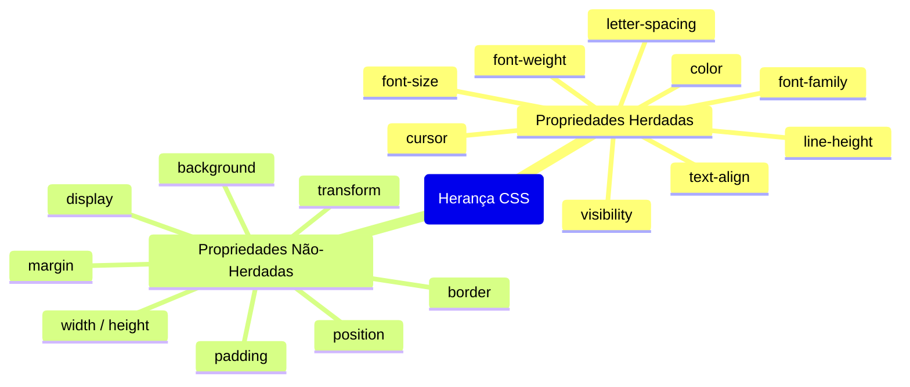
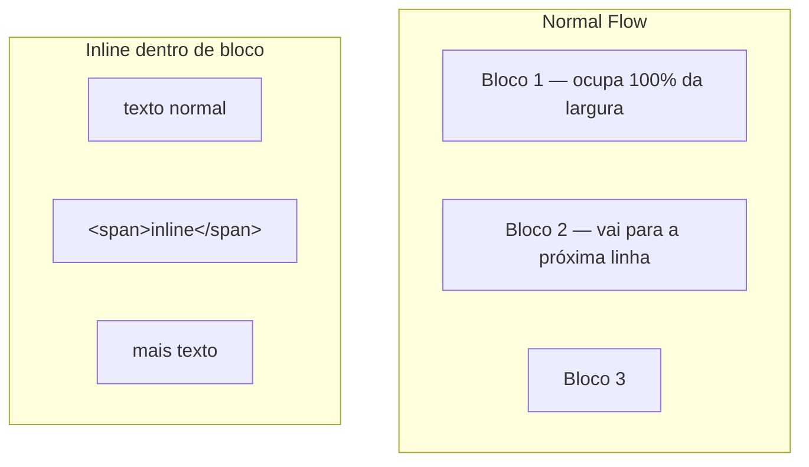

# O modelo mental do CSS: cascade, herança e box model

> [!abstract] TL;DR
> CSS não é uma coleção de propriedades decorativas — é um sistema com três mecanismos centrais: **cascade** (quem vence quando múltiplas regras conflitam), **herança** (quais propriedades descem pelo DOM automaticamente), e **box model** (como o espaço de cada elemento é calculado). Entender esses três mecanismos é entender por que o CSS se comporta do jeito que se comporta — e por que às vezes parece não funcionar.

---

## O que é CSS, de verdade

CSS (Cascading Style Sheets) é uma linguagem declarativa que descreve a apresentação de um documento HTML. A palavra "Cascading" no nome não é ornamental — ela descreve o mecanismo central: quando múltiplas regras tentam estilizar o mesmo elemento, um algoritmo decide qual vence. Esse algoritmo é a cascade.

O browser aplica CSS em quatro etapas:



---

## A cascade: quem vence em conflito

Quando múltiplas regras CSS tentam definir o mesmo valor de uma mesma propriedade para o mesmo elemento, a cascade decide qual vence. O algoritmo avalia na ordem:

1. **Origem e importância** — de onde vem a regra e se tem `!important`
2. **Especificidade** — quão preciso é o seletor
3. **Ordem** — qual declaração aparece por último no código

### Origem das regras

O browser tem três origens de estilos:

| Origem | Exemplo |
|---|---|
| **User-agent** | Estilos padrão do browser (`<h1>` é grande, `<a>` é azul) |
| **Author** | O CSS que você escreve (o mais importante normalmente) |
| **User** | Estilos aplicados pelo usuário via configuração do browser |

A ordem normal (sem `!important`): **author > user > user-agent**.

Com `!important`, a ordem inverte: `!important user-agent > !important user > !important author`. É por isso que `!important` no seu CSS pode ser sobrescrito pelos estilos `!important` do browser (acessibilidade em modo de alto contraste, por exemplo).

```css
/* ❌ !important como muleta — sinal de design de especificidade errado */
.btn { color: red !important; }

/* ✅ Resolver a especificidade na raiz */
.theme-dark .card .btn { color: red; }
```

### Especificidade

Cada seletor tem um peso. O mais pesado vence.

A notação é **(A, B, C)**:
- **A** — seletores de ID (`#header`)
- **B** — classes (`.btn`), pseudo-classes (`:hover`), atributos (`[type="text"]`)
- **C** — elementos (`div`, `p`, `h1`), pseudo-elements (`::before`)

O seletor universal (`*`) e combinadores (`>`, `+`, `~`, ` `) têm peso zero.

```css
div            /* (0, 0, 1) */
.btn           /* (0, 1, 0) */
.btn:hover     /* (0, 2, 0) — :hover é pseudo-classe */
#header        /* (1, 0, 0) */
#header .btn   /* (1, 1, 0) */
button.btn     /* (0, 1, 1) */
```

Comparação é da esquerda para a direita: `(1, 0, 0)` > `(0, 99, 0)` — um ID vence cem classes.

### Ordem

Em empate de especificidade, a regra que aparece **por último** no código vence:

```css
.btn { color: red; }
.btn { color: blue; }  /* esta vence */
```

Isso se aplica entre arquivos também — a ordem em que você importa CSS importa.

---

## Herança: o que desce pelo DOM

Algumas propriedades CSS são **herdadas** — quando você define no pai, todos os descendentes recebem automaticamente. Outras são **não-herdadas** — cada elemento começa do zero.



Regra geral (não absoluta): **propriedades de tipografia e cor** são herdadas; **propriedades de layout e caixa** não são.

```css
/* Define no pai — todos os textos dentro herdam */
body {
  font-family: 'Inter', system-ui, sans-serif;
  font-size: 1rem;
  color: #1a1a1a;
  line-height: 1.6;
}

/* Parágrafo herda tudo acima automaticamente */
p { /* não precisa repetir font-family, color, etc. */ }

/* h1 herda font-family mas redefine font-size */
h1 { font-size: 2rem; }
```

### Palavras-chave de herança

Você pode controlar a herança explicitamente com quatro palavras-chave:

```css
.elemento {
  color: inherit;   /* Força herdar do pai — mesmo em prop não-herdada */
  color: initial;   /* Valor inicial da propriedade (user-agent default) */
  color: unset;     /* inherit se herdada, initial se não */
  color: revert;    /* Reverte para o valor do user-agent stylesheet */
}

/* Útil para remover estilos específicos */
.reset {
  all: unset;       /* Remove TODOS os estilos do elemento */
}
```

---

## Box model: como o espaço é calculado

Todo elemento HTML é representado como uma caixa retangular. O box model define as quatro camadas dessa caixa:

```
┌──────────────────────────────────────────────┐
│                   margin                     │
│   ┌──────────────────────────────────────┐   │
│   │               border                 │   │
│   │   ┌──────────────────────────────┐   │   │
│   │   │           padding            │   │   │
│   │   │   ┌──────────────────────┐   │   │   │
│   │   │   │       content        │   │   │   │
│   │   │   └──────────────────────┘   │   │   │
│   │   └──────────────────────────────┘   │   │
│   └──────────────────────────────────────┘   │
└──────────────────────────────────────────────┘
```

- **content**: o conteúdo real (texto, imagem)
- **padding**: espaço interno entre o conteúdo e a borda
- **border**: a linha ao redor do padding e content
- **margin**: espaço externo — separa o elemento dos outros

### `box-sizing` — o problema herdado dos anos 90

O default do browser é `box-sizing: content-box` — herança da CSS 1.0 dos anos 90. Nesse modelo, `width` define apenas o content. Padding e border **aumentam** o tamanho total:

```css
/* content-box (default problemático) */
.box {
  box-sizing: content-box;
  width: 200px;      /* apenas o content */
  padding: 20px;     /* total: 240px */
  border: 2px solid; /* total: 244px */
}
```

Isso quebra layouts: você declara `width: 200px` mas o elemento ocupa 244px. O modelo `border-box` resolve isso — `width` inclui padding e border:

```css
/* border-box (moderno, sensato) */
.box {
  box-sizing: border-box;
  width: 200px;      /* total = 200px */
  padding: 20px;     /* content = 156px */
  border: 2px solid; /* content = 156px */
}
```

**Reset global recomendado em todo projeto:**

```css
*,
*::before,
*::after {
  box-sizing: border-box;
}
```

### Margin collapsing

Uma peculiaridade do box model que surpreende: margens **verticais** entre elementos de bloco colapsam — a maior prevalece, não somam.

```html
<p style="margin-bottom: 20px">Parágrafo 1</p>
<p style="margin-top: 30px">Parágrafo 2</p>
```

Espaço entre os dois: **30px** (a maior), não 50px.

Outro caso: filho com margin "escapa" para o pai quando o pai não tem border, padding ou formatting context próprio:

```css
.pai { /* sem padding, sem border */ }
.filho { margin-top: 30px; }
/* margin-top do filho "vaza" para o pai — pai parece ter margin-top */
```

A solução é criar um formatting context no pai:
```css
.pai {
  overflow: hidden;  /* cria block formatting context */
  /* ou */
  padding-top: 1px;
  /* ou */
  display: flow-root;  /* cria block formatting context explicitamente */
}
```

---

## Normal flow e como `display` o quebra

Por padrão, elementos HTML seguem o **normal flow**: elementos de bloco empilham verticalmente, elementos inline fluem horizontalmente dentro dos blocos.



`display` define como o elemento participa do fluxo:

```css
display: block;        /* empilha, 100% de largura */
display: inline;       /* flui com texto, não aceita width/height */
display: inline-block; /* flui com texto, aceita width/height */
display: flex;         /* cria flex container */
display: grid;         /* cria grid container */
display: none;         /* remove do fluxo e da árvore de acessibilidade */
display: contents;     /* remove a caixa mas mantém filhos no fluxo */
display: flow-root;    /* bloco que cria seu próprio block formatting context */
```

`display: none` vs `visibility: hidden`:
- `display: none`: elemento não ocupa espaço, não está na árvore de acessibilidade
- `visibility: hidden`: elemento ocupa espaço, não está visível, mas ainda está na árvore de acessibilidade

---

## Position: saindo do fluxo

```css
position: static;   /* default — no fluxo normal */
position: relative; /* no fluxo, mas pode ser deslocado; cria stacking context para filhos absolute */
position: absolute; /* removido do fluxo; posicionado relativo ao pai positioned mais próximo */
position: fixed;    /* removido do fluxo; posicionado relativo ao viewport */
position: sticky;   /* no fluxo até atingir o threshold; então fixa */
```

```css
/* Pai e filho posicionado */
.pai {
  position: relative; /* referência para o filho absolute */
}

.filho {
  position: absolute;
  top: 0;
  right: 0;
}

/* Sticky header */
.nav {
  position: sticky;
  top: 0;           /* fixa quando scroll atinge 0px do topo */
  z-index: 100;
}
```

> [!warning] `position: absolute` sem pai `relative`
> Se você usa `position: absolute` e o pai não tem `position` diferente de `static`, o elemento se posiciona relativo ao ancestral positioned mais próximo — ou ao `<body>` se nenhum existir. Isso causa o clássico "sumiu para fora da tela" em elementos absolutos.

---

## Stacking context e z-index

`z-index` só funciona em elementos com `position` diferente de `static` (ou em flex/grid items). Mas a parte que surpreende: cada stacking context é isolado — o `z-index` de um elemento só compete com elementos no mesmo stacking context.

```css
/* Contextos de empilhamento criados por: */
position: relative/absolute/fixed/sticky + z-index ≠ auto
opacity < 1
transform ≠ none
filter ≠ none
isolation: isolate  /* cria explicitamente sem outras alterações */
```

```html
<!-- z-index: 9999 em .filho não faz ele aparecer sobre .outro-modal
     porque .modal cria um stacking context com z-index: 1 -->
<div class="modal" style="position: relative; z-index: 1;">
  <div class="filho" style="position: absolute; z-index: 9999;">
    <!-- Limitado ao z-index do pai -->
  </div>
</div>
<div class="outro-modal" style="position: relative; z-index: 2;">
  <!-- Está acima do .modal inteiro, independente do z-index do .filho -->
</div>
```

> [!tip] `isolation: isolate`
> Quando você quer criar um stacking context sem mudar visual, use `isolation: isolate`. Isso contém os z-indexes dos filhos sem mudar opacidade, transform ou position do elemento.

---

> [!question] Para fixar
> 1. Dois seletores competem pelo mesmo elemento: `#header .nav a` e `.nav li a.active`. Qual tem maior especificidade?
> 2. `font-family` é herdada ou não? E `margin`? O que isso implica na prática?
> 3. Um elemento com `width: 300px; padding: 20px; border: 5px solid` — qual o tamanho total com `content-box`? E com `border-box`?
> 4. Por que a margem de um filho pode "vazar" para o pai? Como prevenir isso?
> 5. Qual a diferença entre `display: none` e `visibility: hidden` em termos de layout e acessibilidade?
> 6. Por que um `z-index: 9999` pode não trazer um elemento para o topo da pilha?

---

## Veja também

- [[03-Dominios/Tecnologia/CSS/02 - Unidades, cores e tipografia|02 — Unidades, cores e tipografia]] — próxima
- [[03-Dominios/Tecnologia/CSS/05 - Especificidade, cascade e layer|05 — Especificidade, cascade e @layer]] — cascade em profundidade
- [[03-Dominios/Tecnologia/HTML/01 - O modelo mental do HTML - semântica, árvore e o browser|HTML 01 — Modelo mental do HTML]] — o DOM que o CSS estiliza
