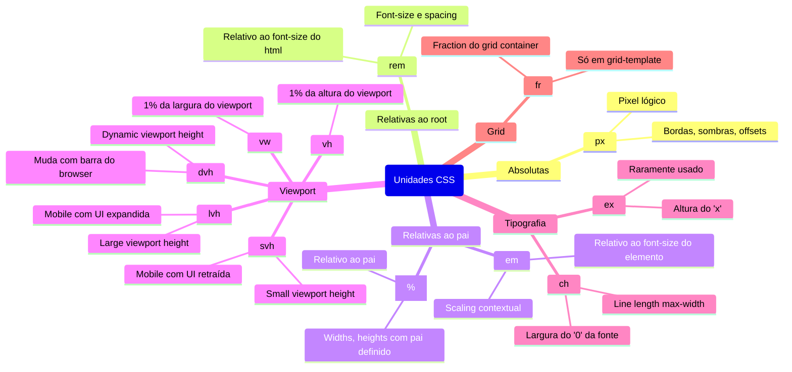
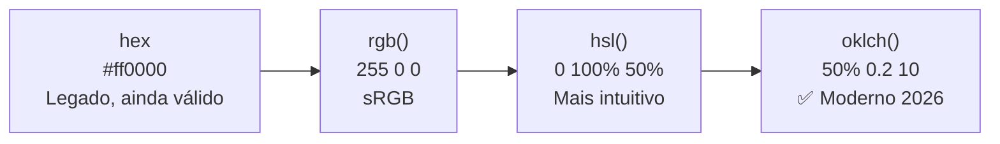

# Unidades, cores e tipografia

> [!abstract] TL;DR
> As unidades do CSS determinam se seu layout responde bem a diferentes contextos (tamanho de fonte do usuário, zoom, densidade de tela). A regra prática: **`rem` para font-size e spacing**, **`px` para bordas e sombras**, **`%` para larguras relativas ao pai**, **`fr` para grid**, **`ch` para line length**. Em cores, **`oklch`** é o padrão moderno — perceptualmente uniforme, animável, com acesso a wide-gamut. Em tipografia, `line-height` sem unidade e `font-display: swap` são os dois acertos mais impactantes.

---

## Unidades de comprimento

CSS tem dezenas de unidades. O mapa que realmente importa:



### `rem` vs `em` — a distinção que mais importa

`rem` (root em) é relativo ao `font-size` do elemento `<html>` — por padrão, 16px na maioria dos browsers. `em` é relativo ao `font-size` do próprio elemento (ou do pai, quando usado em `font-size`).

```css
html { font-size: 16px; } /* base */

.container {
  font-size: 1.25rem;  /* 20px — relativo ao root */
  padding: 1rem;       /* 16px — relativo ao root, previsível */
}

.texto {
  font-size: 1.2em;    /* 1.2 × 20px = 24px — relativo ao pai */
  padding: 1em;        /* 24px — relativo a si mesmo */
}

.nested {
  font-size: 1.2em;    /* 1.2 × 24px = 28.8px — compounding! */
}
```

O problema do `em`: em elementos aninhados, o tamanho da fonte **acumula** (compounding). Use `rem` para garantir que o tamanho seja sempre relativo ao root, independente da profundidade de aninhamento.

**Exceção legítima para `em`**: padding ou margin que devem escalar proporcionalmente ao `font-size` do componente:

```css
.badge {
  font-size: 0.75rem;    /* 12px */
  padding: 0.25em 0.5em; /* 3px 6px — escala com o texto do badge */
}

.badge--lg {
  font-size: 1rem;       /* 16px */
  /* padding: 4px 8px — o mesmo em, tamanho diferente */
}
```

### Viewport units modernas: `svh`, `dvh`, `lvh`

O problema clássico de `100vh` em mobile: a barra de endereço do browser ocupa espaço quando a página carrega, mas retrai ao rolar. `100vh` considera o viewport **sem** a barra, causando overflow ou elementos cortados.

```css
/* ❌ Problema clássico: element cortado em mobile */
.hero { height: 100vh; }

/* ✅ svh: small viewport height — viewport COM a barra visível */
/* Garante que o conteúdo nunca fique escondido atrás da barra */
.hero { height: 100svh; }

/* dvh: dynamic — muda enquanto a barra aparece/desaparece */
/* Pode causar layout shift ao rolar */
.sticky-panel { height: 100dvh; }

/* lvh: large viewport height — viewport SEM a barra (máximo) */
/* Para elementos que aparecem após a barra retrair */
.fullscreen { height: 100lvh; }
```

### `ch` para line length

A unidade `ch` representa a largura do caractere `0` na fonte atual. Ideal para limitar a largura de textos a uma linha legível:

```css
p {
  max-width: 65ch;   /* ~65 caracteres — linha ideal de leitura */
  /* Ajusta automaticamente se a fonte mudar de tamanho */
}
```

---

## Cores

### A evolução dos espaços de cor



### `oklch` — o padrão moderno

`oklch` (Oklch Lightness Chroma Hue) opera em um espaço **perceptualmente uniforme**: quando você aumenta lightness de 40% para 60%, a diferença visual é a mesma em qualquer matiz. Isso não acontece em `hsl`.

```css
/* oklch(lightness% chroma hue) */
color: oklch(60% 0.15 250);    /* azul médio */
color: oklch(80% 0.10 150);    /* verde claro */
color: oklch(40% 0.20 30);     /* laranja escuro */
color: oklch(95% 0.02 250);    /* quase branco azulado */

/* Com alpha */
color: oklch(60% 0.15 250 / 0.5);
```

Por que `oklch` ganha em 2026:
1. **Perceptualmente uniforme** — paletas de cor consistentes, gradientes suaves
2. **Animável** — funciona com `@property` (notas 07 e 09)
3. **Wide gamut** — acessa cores P3 e Rec2020 que `sRGB` não consegue
4. **Design tokens legíveis** — `oklch(40% 0.2 30)` diz "escuro, saturado, laranja"

```css
/* Design tokens modernos com oklch */
:root {
  --color-primary:       oklch(60% 0.18 250);
  --color-primary-light: oklch(75% 0.13 250);
  --color-primary-dark:  oklch(45% 0.20 250);
  --color-danger:        oklch(55% 0.22 25);
  --color-success:       oklch(65% 0.18 145);
  --color-bg:            oklch(98% 0.01 250);
  --color-text:          oklch(18% 0.02 250);
}
```

### Formatos legados (ainda válidos)

```css
/* Hex — mais compacto, mas opaco */
color: #ff0000;
color: #ff000080;   /* com alpha (últimos 2 dígitos) */
color: #f00;        /* shorthand */

/* RGB — familiar, mas não perceptual */
color: rgb(255 0 0);          /* sintaxe moderna sem vírgulas */
color: rgb(255 0 0 / 0.5);    /* com alpha */
color: rgba(255, 0, 0, 0.5);  /* legado com vírgulas */

/* HSL — intuitivo para humanos, mas não perceptual */
color: hsl(0 100% 50%);
color: hsl(0 100% 50% / 0.5);
```

### Propriedades de cor úteis

```css
.elemento {
  color: oklch(20% 0.02 250);      /* texto */
  background-color: oklch(98% 0.01 250);
  border-color: oklch(85% 0.03 250);
  outline-color: oklch(60% 0.18 250);
  text-decoration-color: currentColor; /* herda a cor do texto */

  /* Mistura de cores nativa */
  background: color-mix(in oklch, oklch(60% 0.18 250) 30%, white);
}

/* Contraste automático (CSS Color Level 6, suporte parcial) */
.btn {
  background: oklch(60% 0.18 250);
  color: color-contrast(oklch(60% 0.18 250) vs white, black);
}
```

---

## Tipografia

### A stack de fontes

```css
/* System font stack — zero latência, aparência nativa */
font-family: system-ui, -apple-system, BlinkMacSystemFont, 'Segoe UI', Roboto, sans-serif;

/* Stack monospace */
font-family: 'JetBrains Mono', ui-monospace, 'Cascadia Code', Menlo, monospace;

/* Fontes web + fallback genérico */
font-family: 'Inter', system-ui, sans-serif;
font-family: 'Playfair Display', Georgia, serif;
```

Os genéricos modernos (CSS Fonts Level 4):
- `system-ui` — fonte do sistema operacional
- `ui-sans-serif` — fonte sem-serifa do sistema
- `ui-serif` — fonte serifada do sistema
- `ui-monospace` — fonte monospace do sistema
- `math` — fonte para expressões matemáticas
- `emoji` — fonte de emoji

### `font-size` e escala tipográfica

```css
/* Base */
html { font-size: 16px; }  /* default do browser */

/* Escala fluida com clamp — responde ao viewport sem media queries */
h1 { font-size: clamp(1.75rem, 4vw + 1rem, 3rem); }
h2 { font-size: clamp(1.5rem, 3vw + 0.75rem, 2.25rem); }
h3 { font-size: clamp(1.25rem, 2vw + 0.5rem, 1.75rem); }
p  { font-size: clamp(1rem, 1vw + 0.875rem, 1.125rem); }
```

> [!warning] Não use `px` para `font-size`
> Se o usuário configurou o browser para fonte maior (acessibilidade), `px` ignora essa preferência. `rem` e `em` respeitam as configurações do browser. Use `px` apenas para bordas, sombras, e offsets mínimos.

### `font-weight` — pesos disponíveis

```css
font-weight: 100;   /* Thin */
font-weight: 200;   /* ExtraLight */
font-weight: 300;   /* Light */
font-weight: 400;   /* Regular (normal) */
font-weight: 500;   /* Medium */
font-weight: 600;   /* SemiBold */
font-weight: 700;   /* Bold */
font-weight: 800;   /* ExtraBold */
font-weight: 900;   /* Black */

/* Palavras-chave */
font-weight: normal;  /* = 400 */
font-weight: bold;    /* = 700 */

/* Fontes variáveis: qualquer valor entre 100-900 */
font-weight: 550;   /* só funciona se a fonte suportar */
```

### `line-height` — o mais impactante para legibilidade

```css
/* ✅ Sem unidade — multiplica pelo font-size atual */
p { line-height: 1.6; }

/* ❌ Com px — não escala com font-size */
p { line-height: 24px; }

/* ❌ Com em — compounding em elementos aninhados */
p { line-height: 1.6em; }
```

Referências de legibilidade:
- `1.4–1.6`: corpo de texto (parágrafos)
- `1.1–1.3`: headings (menos espaço entre linhas curtas)
- `1`: botões e labels (uma linha)

### Propriedades tipográficas essenciais

```css
.texto {
  /* Espaçamento */
  letter-spacing: 0.01em;     /* rastreamento (tracking) */
  word-spacing: 0.05em;

  /* Transformação */
  text-transform: uppercase;  /* lowercase, capitalize */
  text-decoration: underline; /* none, line-through, overline */
  text-decoration-color: currentColor;
  text-decoration-thickness: 2px;
  text-underline-offset: 3px; /* distância do texto */

  /* Alinhamento */
  text-align: left;           /* center, right, justify */
  text-align: start;          /* logical — left em LTR, right em RTL */

  /* Overflow */
  white-space: nowrap;
  overflow: hidden;
  text-overflow: ellipsis;    /* "..." ao truncar */

  /* Moderno */
  text-wrap: balance;         /* equilibra quebras de linha em headings (Chrome 114+) */
  text-wrap: pretty;          /* evita palavras órfãs (Chrome 117+) */
}
```

### `font-variant-numeric` — números em tabelas

```css
.tabela-numeros {
  font-variant-numeric: tabular-nums;  /* todos os dígitos têm a mesma largura */
}

/* Slashed zero para não confundir com "O" */
.codigo {
  font-variant-numeric: slashed-zero;
}
```

### `@font-face` e carregamento de fontes

```css
@font-face {
  font-family: 'Inter';
  src: url('/fonts/inter-variable.woff2') format('woff2');
  font-weight: 100 900;   /* fonte variável */
  font-style: normal;
  font-display: swap;     /* mostra fallback imediatamente, troca quando carrega */
}
```

`font-display` valores:

| Valor | Comportamento | Quando usar |
|---|---|---|
| `auto` | Browser decide | Nunca |
| `block` | FOIT por até 3s | Evitar |
| `swap` | FOUT imediato | Textos de conteúdo |
| `fallback` | 100ms invisível, depois FOUT | Fontes de UI |
| `optional` | 100ms invisível, sem troca | Máxima performance |

> [!tip] Preload + `font-display: swap`
> `font-display: swap` não elimina o FOUT — apenas o controla. Para reduzir o flash, combine com `<link rel="preload">` para que a fonte chegue mais cedo (ver [[03-Dominios/Tecnologia/HTML/10 - Performance em HTML - resource hints e critical path|HTML 10 — Performance]]).

---

## Tabela de referência rápida: quando usar cada unidade

| Propriedade | Unidade preferida | Motivo |
|---|---|---|
| `font-size` | `rem` | Respeita zoom do browser |
| `padding` / `margin` | `rem` | Consistência com a escala |
| `border` | `px` | Geralmente 1px absoluto |
| `border-radius` | `px` ou `rem` | Depende se deve escalar |
| `width` (layout) | `%`, `fr`, `rem` | Relativo ao contexto |
| `max-width` (texto) | `ch`, `rem` | Line length |
| `height` (viewport) | `svh`, `dvh`, `%` | Depende do contexto |
| `gap` (flex/grid) | `rem` | Consistência com escala |
| `animation` timings | `ms`, `s` | Absoluto é OK |
| `box-shadow` | `px` | Absoluto faz sentido |
| `z-index` | `<número>` | Sem unidade |

---

> [!question] Para fixar
> 1. Por que usar `rem` em vez de `px` para `font-size`? O que acontece se o usuário aumentou o tamanho de fonte no browser?
> 2. Qual o problema do `em` em elementos aninhados? Em que situação o `em` ainda é a escolha certa?
> 3. O que é `oklch` e por que é preferível a `hsl` para definir design tokens de cor?
> 4. Qual a diferença entre `100vh`, `100svh` e `100dvh`? Em qual cenário mobile cada um é adequado?
> 5. Por que `line-height` sem unidade (`1.6`) é preferível a `line-height: 24px`?
> 6. O que é `font-display: swap` e por que sozinho não é suficiente para evitar o FOUT?

---

## Veja também

- [[03-Dominios/Tecnologia/CSS/01 - O modelo mental do CSS - cascade, herança e box model|01 — Modelo mental do CSS]] — anterior
- [[03-Dominios/Tecnologia/CSS/03 - Flexbox - layout unidimensional|03 — Flexbox]] — próxima
- [[03-Dominios/Tecnologia/CSS/07 - Custom properties e design tokens|07 — Custom properties]] — tokens de cor em profundidade
- [[03-Dominios/Tecnologia/HTML/10 - Performance em HTML - resource hints e critical path|HTML 10 — Performance]] — preload de fontes
