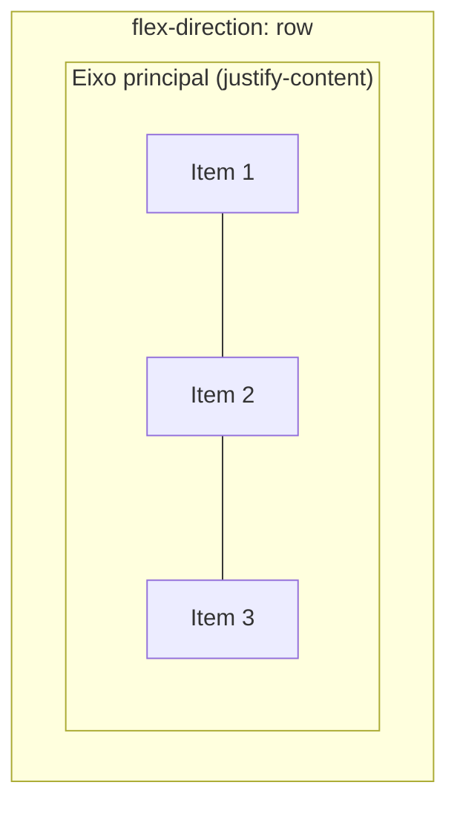
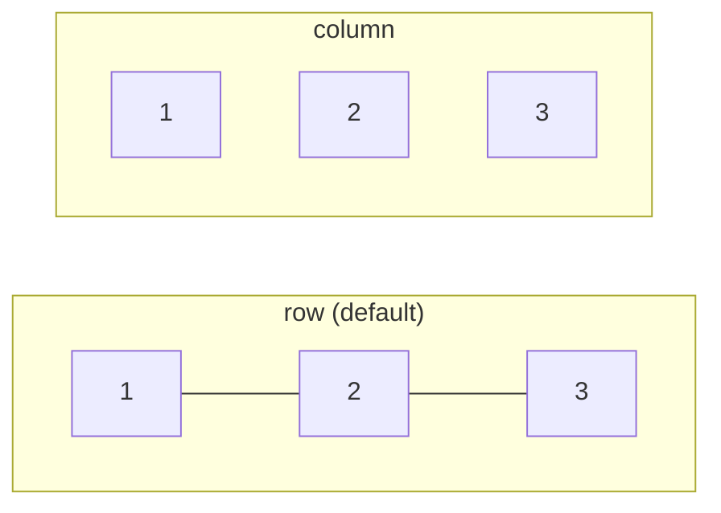
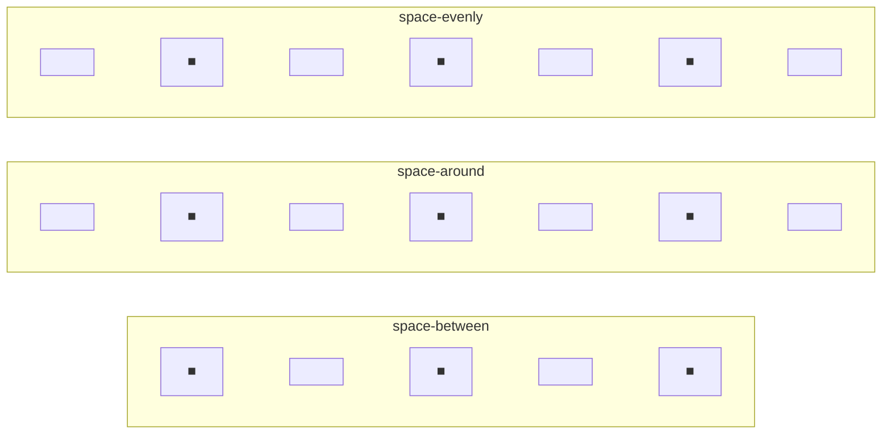
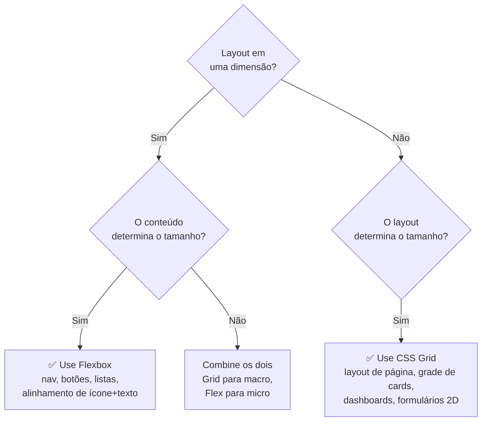

# Flexbox: layout unidimensional

> [!abstract] TL;DR
> Flexbox é o sistema de layout para **uma dimensão** — uma linha ou uma coluna. O container define a direção e o alinhamento; os itens definem como crescem, encolhem, e qual é seu tamanho base. A principal distinção com Grid: Flexbox parte do **conteúdo** (os itens determinam o espaço), enquanto Grid parte do **layout** (o template determina as células). Use Flexbox para navbars, listas de cards, botões com ícone, centering — qualquer coisa que precise alinhar elementos em uma direção.

---

## O modelo Flexbox

Ao declarar `display: flex`, você cria um **flex container** e todos os filhos diretos se tornam **flex items**. Dois eixos governam o posicionamento:



- **Eixo principal** (main axis): a direção do `flex-direction`. `justify-content` alinha aqui.
- **Eixo cruzado** (cross axis): perpendicular ao principal. `align-items` alinha aqui.

```css
/* Isso transforma o container em flex e todos os filhos em flex items */
.container {
  display: flex;         /* display: inline-flex para inline */
}
```

> [!tip] Somente filhos diretos são flex items
> Netos e descendentes mais profundos **não** são afetados pelo flex container. Se você precisa que eles participem do layout flex, crie um novo `display: flex` no elemento pai deles.

---

## Propriedades do container

### `flex-direction` — a direção do eixo principal

```css
flex-direction: row;            /* → esquerda para direita (default) */
flex-direction: row-reverse;    /* ← direita para esquerda */
flex-direction: column;         /* ↓ cima para baixo */
flex-direction: column-reverse; /* ↑ baixo para cima */
```



### `flex-wrap` — quebra de linha

```css
flex-wrap: nowrap;         /* Todos na mesma linha, comprimem se necessário (default) */
flex-wrap: wrap;           /* Quebra para a próxima linha quando não há espaço */
flex-wrap: wrap-reverse;   /* Quebra para a linha anterior */
```

O shorthand `flex-flow` combina direção e wrap:
```css
flex-flow: row wrap;
flex-flow: column nowrap;
```

### `gap` — espaçamento entre itens

```css
gap: 1rem;           /* igual em todos os lados */
gap: 1rem 2rem;      /* row-gap column-gap */
row-gap: 1rem;
column-gap: 2rem;
```

`gap` é superior a `margin` entre items porque não gera espaço nas bordas externas do container. Não precisa do truque de `margin: -1rem` que era comum.

### `justify-content` — alinhamento no eixo principal

```css
justify-content: flex-start;    /* itens no início (default) */
justify-content: flex-end;      /* itens no fim */
justify-content: center;        /* itens no centro */
justify-content: space-between; /* espaço entre, sem nas bordas */
justify-content: space-around;  /* espaço ao redor de cada item */
justify-content: space-evenly;  /* espaço igual entre todos (incluindo bordas) */
```



### `align-items` — alinhamento no eixo cruzado

```css
align-items: stretch;     /* esticam para a altura do container (default) */
align-items: flex-start;  /* topo (em row) */
align-items: flex-end;    /* fundo (em row) */
align-items: center;      /* centro */
align-items: baseline;    /* alinha pela baseline do texto */
```

### `align-content` — alinhamento de múltiplas linhas

Só tem efeito quando há `flex-wrap: wrap` e as linhas não preenchem todo o container:

```css
align-content: flex-start;
align-content: flex-end;
align-content: center;
align-content: space-between;
align-content: space-around;
align-content: stretch; /* default */
```

---

## Propriedades dos items

### `flex-grow`, `flex-shrink`, `flex-basis`

O trio que define como um item se comporta quando há espaço sobrando ou faltando:

```css
flex-grow: 0;     /* não cresce além do tamanho base (default) */
flex-grow: 1;     /* cresce proporcionalmente ao espaço disponível */

flex-shrink: 1;   /* encolhe proporcionalmente se não há espaço (default) */
flex-shrink: 0;   /* não encolhe nunca */

flex-basis: auto; /* tamanho base = tamanho do conteúdo (default) */
flex-basis: 200px;/* tamanho base fixo antes de crescer/encolher */
flex-basis: 0;    /* começa do zero — todo o espaço vem do flex-grow */
```

O shorthand `flex` com os valores mais úteis:

```css
flex: 1;        /* = flex: 1 1 0 — cresce, encolhe, começa do zero */
flex: auto;     /* = flex: 1 1 auto — cresce e encolhe a partir do tamanho natural */
flex: none;     /* = flex: 0 0 auto — não cresce nem encolhe */
flex: 0 0 200px; /* tamanho fixo de 200px */
```

> [!warning] `flex: 1` vs `flex: 1 1 auto`
> `flex: 1` define `flex-basis: 0` — todos os itens partem do zero e crescem igualmente. `flex: 1 1 auto` parte do tamanho natural do conteúdo. Com `flex: 1`, itens com conteúdo diferente ficam iguais em largura. Com `flex: auto`, itens maiores ficam maiores.

### `align-self` — override por item

```css
.item-especial {
  align-self: center;     /* sobrescreve align-items do container */
  align-self: flex-end;
  align-self: stretch;
}
```

### `order` — reordenação

```css
.primeiro { order: -1; }  /* antes de todos (default é 0) */
.ultimo   { order: 1; }   /* depois de todos */
```

> [!warning] `order` não muda a ordem no DOM
> A ordem visual muda, mas a ordem de leitura do leitor de tela e do Tab (teclado) seguem o DOM. Use com cuidado para não criar divergência entre visual e acessibilidade.

### `min-width: 0` — o bug mais comum de Flexbox

Por padrão, flex items não encolhem abaixo do tamanho mínimo de conteúdo (`min-width: auto`). Isso causa overflow quando você tem texto longo ou código dentro de um flex item:

```css
/* ❌ Flex item com texto longo causa overflow do container */
.item { flex: 1; /* min-width: auto por padrão */ }

/* ✅ Permite que o item encolha abaixo do conteúdo mínimo */
.item { flex: 1; min-width: 0; }
```

---

## Patterns clássicos

### Centralizar absolutamente

```css
.centralizar {
  display: flex;
  justify-content: center;
  align-items: center;
  min-height: 100svh;
}
```

### Navbar com logo + links + botão

```css
.navbar {
  display: flex;
  align-items: center;
  gap: 1rem;
  padding: 0 2rem;
}

.navbar__logo {
  margin-right: auto; /* empurra todo o resto para a direita */
}

/* Logo | ←espaço→ | links links links | botão */
```

### Card com footer colado ao fundo

```css
.card {
  display: flex;
  flex-direction: column;
  min-height: 300px; /* ou height fixo */
}

.card__content {
  flex: 1; /* cresce para preencher o espaço — empurra o footer para baixo */
}

.card__footer {
  /* Sempre fica no fundo */
}
```

### Sidebar + main content

```css
.layout {
  display: flex;
  gap: 2rem;
  min-height: 100svh;
}

.sidebar {
  flex: 0 0 280px; /* largura fixa, não cresce nem encolhe */
  min-width: 0;
}

.main {
  flex: 1;          /* ocupa todo o espaço restante */
  min-width: 0;     /* evita overflow de conteúdo */
}
```

### Botão com ícone e texto alinhados

```css
.btn {
  display: inline-flex;  /* inline: não ocupa 100% da linha */
  align-items: center;
  gap: 0.5rem;
  padding: 0.5rem 1rem;
}

/* Ícone e texto alinhados verticalmente automaticamente */
```

### Grid de cards responsivo com Flexbox

```css
/* Auto-ajuste: quantas colunas couberem em 280px */
.cards {
  display: flex;
  flex-wrap: wrap;
  gap: 1rem;
}

.card {
  flex: 1 1 280px; /* cresce, encolhe, base 280px */
  min-width: 0;
}

/* Funciona! Mas para esse caso, Grid com auto-fit é mais elegante */
```

---

## Flexbox vs Grid — a regra de ouro



- **Flexbox**: quando o layout surge naturalmente do conteúdo — os itens determinam quanto espaço ocupam, e você distribui o restante
- **Grid**: quando você tem um layout pré-definido e quer encaixar o conteúdo nele
- **Ambos**: na prática, use Grid para a estrutura macro da página e Flexbox para os componentes internos

---

> [!question] Para fixar
> 1. Qual a diferença entre `justify-content` e `align-items`? O que cada um alinha?
> 2. O que `flex: 1` significa em termos de `flex-grow`, `flex-shrink` e `flex-basis`? Como difere de `flex: auto`?
> 3. Por que `min-width: 0` é necessário em flex items que contêm texto longo?
> 4. Como você faria um layout de navbar com logo à esquerda e botão à direita usando Flexbox? (sem `justify-content: space-between`)
> 5. Qual a diferença entre `align-items` e `align-content`? Quando `align-content` tem efeito?
> 6. Um flex item tem `order: -1`. Qual o efeito visual e qual o efeito na navegação por teclado?

---

## Veja também

- [[03-Dominios/Tecnologia/CSS/02 - Unidades, cores e tipografia|02 — Unidades, cores e tipografia]] — anterior
- [[03-Dominios/Tecnologia/CSS/04 - CSS Grid - layout bidimensional|04 — CSS Grid]] — próxima
- [[03-Dominios/Tecnologia/CSS/06 - Design responsivo - media queries e container queries|06 — Design responsivo]] — Flexbox + media queries para responsividade
