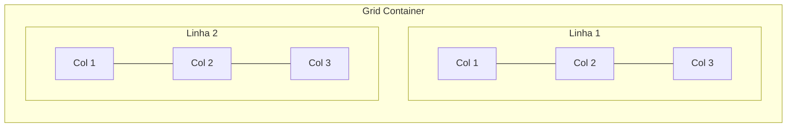

# CSS Grid: layout bidimensional

> [!abstract] TL;DR
> CSS Grid é o sistema de layout para **duas dimensões** — linhas e colunas simultaneamente. Ao contrário do Flexbox (onde o conteúdo determina o espaço), o Grid define o template e encaixa o conteúdo nele. A unidade `fr` (fraction), `repeat()` com `auto-fit`/`auto-fill`, e `minmax()` permitem layouts responsivos complexos sem uma única media query. Para layout de página: Grid. Para alinhamento de componentes internos: Flexbox.

---

## O modelo Grid

Ao declarar `display: grid`, você cria um **grid container** com uma grade de **linhas e colunas**. Os filhos diretos se tornam **grid items** e se posicionam automaticamente nas células.



Terminologia essencial:
- **Grid lines**: as linhas que dividem o grid. Uma grade 3×2 tem 4 linhas de coluna e 3 linhas de linha.
- **Grid track**: o espaço entre duas linhas adjacentes (uma coluna ou uma linha do grid)
- **Grid cell**: a intersecção de um track de coluna e um track de linha
- **Grid area**: uma ou mais células adjacentes formando um retângulo

---

## Definindo o template

### `grid-template-columns` e `grid-template-rows`

```css
.grid {
  display: grid;

  /* 3 colunas com tamanhos fixos */
  grid-template-columns: 200px 1fr 200px;

  /* 3 colunas iguais */
  grid-template-columns: 1fr 1fr 1fr;

  /* 4 linhas com alturas variadas */
  grid-template-rows: auto 1fr auto;
  /* auto = tamanho do conteúdo; 1fr = preenche o restante */
}
```

### A unidade `fr` — fraction

`fr` representa uma fração do espaço disponível **depois de subtrair tamanhos fixos**:

```css
/* 3 colunas: 200px fixa, restante dividido 2:1 */
grid-template-columns: 200px 2fr 1fr;

/* Se o container tem 800px: 200px + 400px + 200px */

/* Três colunas iguais */
grid-template-columns: 1fr 1fr 1fr;
```

### `repeat()` — evitar repetição

```css
/* Equivalentes */
grid-template-columns: 1fr 1fr 1fr 1fr;
grid-template-columns: repeat(4, 1fr);

/* 12 colunas (como Bootstrap) */
grid-template-columns: repeat(12, 1fr);

/* Repetição de padrão */
grid-template-columns: repeat(3, 100px 1fr);
/* Resultado: 100px 1fr 100px 1fr 100px 1fr */
```

### `minmax()` — tamanho mínimo e máximo

```css
/* Coluna entre 200px e 1fr */
grid-template-columns: minmax(200px, 1fr) minmax(200px, 1fr);

/* Linha que se expande mas tem no mínimo 100px */
grid-template-rows: minmax(100px, auto);
```

### `auto-fit` e `auto-fill` — responsividade sem media query

Essa combinação é um dos padrões mais poderosos do CSS Grid:

```css
/* auto-fit: colunas se expandem para preencher o espaço */
.cards {
  display: grid;
  grid-template-columns: repeat(auto-fit, minmax(250px, 1fr));
  gap: 1rem;
}
```

Como funciona: o browser cria quantas colunas couberem com pelo menos 250px. Se sobrar espaço, as colunas existentes se expandem (até `1fr`). Se não couber mais uma coluna de 250px, o item quebra para a próxima linha.

Diferença entre `auto-fit` e `auto-fill`:

```css
/* auto-fit: colunas vazias colapsam — existentes expandem */
grid-template-columns: repeat(auto-fit, minmax(250px, 1fr));
/* 3 items em container de 1200px: 3 colunas de 400px */

/* auto-fill: colunas vazias mantêm seu espaço */
grid-template-columns: repeat(auto-fill, minmax(250px, 1fr));
/* 3 items em container de 1200px: 4 colunas de 300px (1 vazia) */
```

**Use `auto-fit`** na maioria dos casos — você quer que os items preencham o espaço disponível.

---

## `grid-template-areas` — layout nomeado

`grid-template-areas` define um layout visual em ASCII:

```css
.layout {
  display: grid;
  grid-template-columns: 250px 1fr 200px;
  grid-template-rows: auto 1fr auto;
  grid-template-areas:
    "header  header  header"
    "sidebar main    aside"
    "footer  footer  footer";
  min-height: 100svh;
}

.header  { grid-area: header; }
.sidebar { grid-area: sidebar; }
.main    { grid-area: main; }
.aside   { grid-area: aside; }
.footer  { grid-area: footer; }
```

Para "pular" uma célula, use ponto `.`:
```css
grid-template-areas:
  "logo  .    nav"
  "hero  hero hero";
```

`grid-template` é o shorthand de colunas + linhas + areas:
```css
grid-template:
  "header header" auto
  "sidebar main" 1fr
  "footer footer" auto
  / 250px 1fr;
```

---

## Posicionamento de items

### Grid lines — posicionamento explícito

As linhas do grid são numeradas a partir de 1 (ou -1 a partir do fim):

```
|   |   |   |   |
1   2   3   4   (positivas, esquerda para direita)
-4 -3  -2  -1   (negativas, direita para esquerda)
```

```css
.item {
  /* Ocupa da coluna 1 até a coluna 3 (2 colunas) */
  grid-column: 1 / 3;

  /* Da primeira até a última coluna */
  grid-column: 1 / -1;

  /* Ocupa 2 colunas a partir da posição atual */
  grid-column: span 2;

  /* Posição da linha */
  grid-row: 2 / 4;
  grid-row: span 2;
}

/* Shorthand para os dois */
.item {
  grid-area: 1 / 1 / 3 / 4; /* row-start / col-start / row-end / col-end */
}
```

---

## `gap` — espaçamento no Grid

```css
.grid {
  gap: 1rem;           /* row e column iguais */
  gap: 1rem 2rem;      /* row-gap column-gap */
  row-gap: 1rem;
  column-gap: 2rem;
}
```

---

## Alinhamento

Grid tem dois eixos e duas camadas de alinhamento: **items dentro de suas células** e **o grid como um todo no container**.

```css
.grid {
  /* Items dentro de suas células */
  justify-items: start | end | center | stretch;   /* eixo inline (horizontal) */
  align-items: start | end | center | stretch;     /* eixo block (vertical) */
  place-items: center;                             /* shorthand: align justify */

  /* O grid inteiro dentro do container */
  justify-content: start | end | center | space-between | space-around | space-evenly;
  align-content: start | end | center | space-between | space-around | space-evenly;
  place-content: center;                           /* shorthand */
}

/* Por item */
.item {
  justify-self: center;
  align-self: end;
  place-self: center end;
}
```

---

## Subgrid (2023+)

Subgrid permite que um grid item herde as trilhas do grid pai — essencial para alinhamento de elementos em cards que precisam se alinhar entre si:

```css
.card-grid {
  display: grid;
  grid-template-columns: repeat(3, 1fr);
  gap: 1rem;
}

.card {
  display: grid;
  grid-template-rows: auto 1fr auto; /* header / content / footer */
}

/* Com subgrid: todos os cards compartilham as mesmas linhas */
.card {
  grid-row: span 3;               /* ocupa 3 linhas do grid pai */
  display: grid;
  grid-template-rows: subgrid;    /* herda as 3 linhas do pai */
}

/* Resultado: títulos de todos os cards na mesma linha,
   conteúdos na mesma linha, footers na mesma linha */
```

Subgrid de colunas:
```css
.card {
  grid-column: 1 / -1;            /* ocupa toda a largura */
  display: grid;
  grid-template-columns: subgrid; /* herda as colunas do pai */
}
```

---

## Patterns práticos

### Layout de página clássico

```css
.page {
  display: grid;
  grid-template-areas:
    "header"
    "main"
    "footer";
  grid-template-rows: auto 1fr auto;
  min-height: 100svh;
}

/* Com sidebar */
.page--with-sidebar {
  display: grid;
  grid-template-columns: 250px 1fr;
  grid-template-areas:
    "header  header"
    "sidebar main"
    "footer  footer";
  grid-template-rows: auto 1fr auto;
  min-height: 100svh;
}
```

### Grid de cards responsivo — o pattern mais pedido

```css
.cards {
  display: grid;
  grid-template-columns: repeat(auto-fit, minmax(280px, 1fr));
  gap: 1.5rem;
}

/* Zero media queries — adapta de 1 a N colunas automaticamente */
```

### Dashboard com itens de tamanhos variados

```css
.dashboard {
  display: grid;
  grid-template-columns: repeat(12, 1fr);
  gap: 1rem;
}

.widget--pequeno { grid-column: span 3; }  /* 25% da largura */
.widget--medio   { grid-column: span 6; }  /* 50% */
.widget--grande  { grid-column: span 12; } /* 100% */
.widget--destaque {
  grid-column: span 8;
  grid-row: span 2;
}
```

### Centralizar um item no Grid

```css
.container {
  display: grid;
  place-items: center; /* align-items + justify-items */
  min-height: 100svh;
}

/* Ou para um item específico */
.item {
  place-self: center;
}
```

---

## `minmax(0, 1fr)` vs `1fr` — a pegadinha de overflow

```css
/* ❌ Pode causar overflow — 1fr tem min-width implícito de auto */
grid-template-columns: 1fr 1fr;

/* ✅ Garante que a coluna pode encolher até 0 */
grid-template-columns: minmax(0, 1fr) minmax(0, 1fr);
```

Quando um item de grid contém conteúdo largo (tabela, código, imagem sem `max-width`), `1fr` não encolhe abaixo do tamanho mínimo do conteúdo. `minmax(0, 1fr)` força o encolhimento.

---

## Implícito vs explícito

O grid **explícito** é o que você define com `grid-template-*`. O grid **implícito** é criado automaticamente quando itens excebem o template:

```css
.grid {
  display: grid;
  grid-template-columns: repeat(3, 1fr);
  /* Se houver mais de 3 items, linhas extras são criadas implicitamente */

  /* Controlar o tamanho das linhas implícitas */
  grid-auto-rows: minmax(100px, auto);

  /* Fluxo do grid implícito */
  grid-auto-flow: row;    /* default: preenche linha por linha */
  grid-auto-flow: column; /* preenche coluna por coluna */
  grid-auto-flow: dense;  /* preenche buracos com itens menores */
}
```

---

## Flexbox vs Grid — resumo de decisão

| Situação | Melhor escolha |
|---|---|
| Navbar com logo + links + botão | Flexbox |
| Grid de cards sem saber quantos caberão | Grid + auto-fit |
| Card com header/conteúdo/footer | Flexbox (column) |
| Layout de página com header/sidebar/main/footer | Grid + areas |
| Lista de tags/chips | Flexbox + wrap |
| Dashboard com widgets de tamanhos variados | Grid + span |
| Centralizar um elemento | Grid + `place-items: center` ou Flex |
| Botão com ícone + texto alinhados | Flexbox |
| Formulário com campos em múltiplas colunas | Grid |

A regra prática: **Grid para a arquitetura, Flex para os componentes**. Em um projeto real você usa os dois — Grid no `<body>`, Flex dentro de `.card`.

---

> [!question] Para fixar
> 1. Qual a diferença entre `auto-fit` e `auto-fill` em `repeat(auto-fit, minmax(250px, 1fr))`? Quando usar cada um?
> 2. O que é `minmax(0, 1fr)` e por que é preferível a `1fr` em algumas situações?
> 3. Como você criaria um layout de 3 colunas onde a do meio ocupa 2/3 e as laterais 1/6 cada, sem calcular manualmente?
> 4. Um item de grid tem `grid-column: 2 / -1`. Em um grid de 4 colunas, da coluna 2 até qual ele vai?
> 5. O que é subgrid e qual problema ele resolve que a abordagem de `display: grid` aninhado não resolve?
> 6. Quando você prefere Grid com `grid-template-areas` em vez de posicionamento por linha?

---

## Veja também

- [[03-Dominios/Tecnologia/CSS/03 - Flexbox - layout unidimensional|03 — Flexbox]] — anterior (comparação com Grid)
- [[03-Dominios/Tecnologia/CSS/05 - Especificidade, cascade e layer|05 — Especificidade]] — próxima
- [[03-Dominios/Tecnologia/CSS/06 - Design responsivo - media queries e container queries|06 — Design responsivo]] — Grid + container queries para responsividade total
