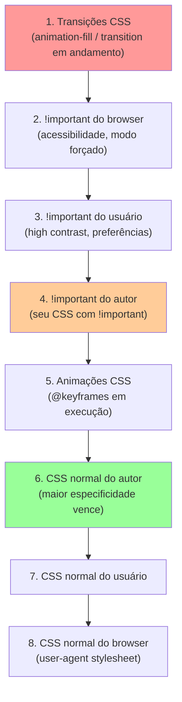
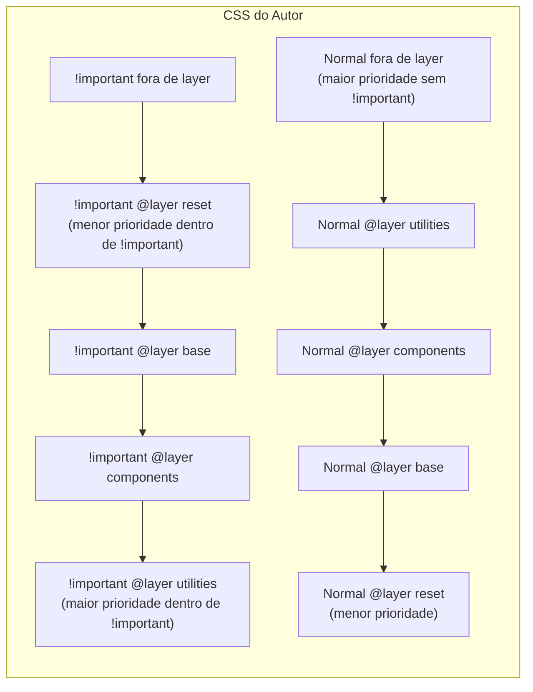

# Especificidade, cascade e @layer

> [!abstract] TL;DR
> Quando múltiplas regras CSS tentam definir o mesmo valor para o mesmo elemento, o algoritmo de **cascade** decide qual vence — avaliando na ordem: origem + importância → especificidade → posição no código. **`@layer`** é a ferramenta moderna que resolve wars de especificidade sem `!important`: você declara uma hierarquia explícita de camadas e regras em camadas superiores sempre vencem, independente da especificidade dos seletores.

---

## O algoritmo de cascade — completo

A nota 01 apresentou a cascade em alto nível. Aqui, o algoritmo completo, na ordem de prioridade decrescente:



Na prática do dia a dia: a maioria das decisões acontece no nível 6 — CSS normal do autor, resolvido por especificidade.

---

## Especificidade em profundidade

Especificidade é calculada como um trio **(A, B, C)**:

| Componente | O que conta | Valor |
|---|---|---|
| A | Seletores de ID | `#header` = (1, 0, 0) |
| B | Classes, pseudo-classes, atributos | `.btn`, `:hover`, `[type]` = (0, 1, 0) |
| C | Elementos, pseudo-elements | `div`, `::before` = (0, 0, 1) |

Comparação: da esquerda para a direita. (1, 0, 0) > (0, 99, 0). Um ID sempre vence, não importa quantas classes o rival tenha.

```css
/* Calculando especificidade */
div              /* (0, 0, 1) */
.btn             /* (0, 1, 0) */
.btn:hover       /* (0, 2, 0) — :hover é pseudo-classe */
div.btn          /* (0, 1, 1) */
#header          /* (1, 0, 0) */
#header .nav     /* (1, 1, 0) */
#header .nav > a /* (1, 1, 1) */

/* Pseudo-elements */
::before         /* (0, 0, 1) — como elemento */
.btn::before     /* (0, 1, 1) */
```

### Atributos `style` inline

Atributos de estilo inline têm especificidade ainda maior — `(1, 0, 0, 0)` em um esquema de 4 componentes — acima de qualquer seletor de ID:

```html
<!-- Este color: red VENCE qualquer seletor no stylesheet -->
<p style="color: red">Texto</p>
```

### O papel de `:is()`, `:not()`, `:has()` na especificidade

```css
/* :is() — a especificidade é do seletor mais específico dentro */
:is(h1, h2, .titulo) { color: blue; }
/* Especificidade: (0, 1, 0) — porque .titulo é mais específico */

/* :not() — mesma regra: especificidade do argumento */
:not(#header) { color: blue; }
/* Especificidade: (1, 0, 0) — porque #header é um ID */

/* :where() — especificidade ZERO, sempre */
:where(h1, h2, .titulo) { color: blue; }
/* Especificidade: (0, 0, 0) — ideal para resets e base styles */

/* :has() — especificidade do seletor dentro */
.card:has(img) { padding: 0; }
/* Especificidade: (0, 2, 0) — .card (0,1,0) + :has(img) conta img=(0,0,1)? */
/* Na prática: :has() contribui com a especificidade do seletor dentro */
```

> [!tip] `:where()` em reset e base styles
> Por ter especificidade zero, `:where()` é ideal para estilos base que devem ser fáceis de sobrescrever. Nenhum seletor específico do autor precisa lutar contra ela.

---

## `!important` — quando e por que evitar

`!important` eleva uma declaração acima de todas as declarações normais do autor. Vence especificidade. Mas:

1. Torna o código difícil de manter — para sobrescrever `!important`, você precisa de outro `!important`
2. Cria "wars de importante" — equipes adicionando `!important` em cima de `!important`
3. Sinal de design ruim de especificidade

```css
/* ❌ !important como muleta */
.modal button { background: blue !important; }
.theme-dark .modal button { background: darkblue !important; } /* guerra */

/* ✅ Resolver a raiz do problema */
.theme-dark .modal button { background: darkblue; }
/* Especificidade (0, 3, 1) > (0, 2, 1) — vence sem !important */
```

**Uso legítimo de `!important`**: estilos de utilitário que devem sempre vencer, como classes `.sr-only` (screen-reader only) ou classes de debug. E com `@layer`, você raramente precisa dele.

---

## BEM — nomenclatura para controlar especificidade

Antes de `@layer`, a solução mais adotada era BEM (Block Element Modifier): uma convenção de nomenclatura que mantém seletores em baixa especificidade:

```css
/* Block */
.card { }

/* Element (filho do block) */
.card__title { }
.card__content { }
.card__footer { }

/* Modifier (variação) */
.card--featured { }
.card--compact { }
.card__title--large { }
```

Todos os seletores BEM têm especificidade (0, 1, 0) — uma classe. Não há conflito de especificidade porque cada elemento tem uma classe única. A desvantagem é o HTML verboso e o naming estressante.

---

## `@layer` — o mecanismo moderno

`@layer` resolve wars de especificidade definitivamente: você declara uma hierarquia de camadas, e regras em uma camada superior **sempre vencem regras de camadas inferiores**, independente da especificidade dos seletores.

### Declaração e ordem

```css
/* Declarar a ordem no início — layers posteriores têm mais peso */
@layer reset, base, components, utilities;

/* A ordem de DECLARAÇÃO define a hierarquia, não onde as regras estão */
@layer reset {
  *, *::before, *::after {
    box-sizing: border-box;
    margin: 0;
    padding: 0;
  }
}

@layer base {
  body { font-family: system-ui, sans-serif; }
  h1 { font-size: 2rem; }
}

@layer components {
  .btn {
    padding: 0.5rem 1rem;
    border-radius: 0.25rem;
  }
  .btn--primary { background: blue; color: white; }
}

@layer utilities {
  .mt-4 { margin-top: 1rem; }
  .text-center { text-align: center; }
}
```

Resultado: `utilities` > `components` > `base` > `reset` — mesmo que `.btn` tenha especificidade (0, 1, 0) e `.mt-4` também. A camada `utilities` vence pela posição na hierarquia.

### Regras fora de layers

Estilos **sem** `@layer` têm prioridade acima de **todos** os layers:

```css
@layer components {
  .btn { color: blue; }
}

/* Esta regra vence — está fora de qualquer layer */
.btn { color: red; }
```

Use isso para override de emergência sem quebrar a arquitetura de layers.

### `!important` dentro de layers — a inversão

Dentro de layers, `!important` **inverte** a hierarquia:

```css
@layer reset, base, utilities;

@layer reset {
  p { color: black !important; }  /* !important em reset */
}

@layer utilities {
  .text-red { color: red; }  /* sem !important */
}

p.text-red { /* qual vence? */ }
/* Color: black — !important em reset vence utilities normais */
/* (layers !important: reset > base > utilities — ordem invertida) */
```

Esse comportamento raramente é necessário na prática. A regra: use `!important` dentro de layers só em casos extremos, como forçar acessibilidade.

### Importar CSS em uma layer

```css
/* Bootstrap em uma layer — suas classes não vencerão as suas */
@layer external {
  @import url('bootstrap.min.css');
}

/* Suas classes vencem automaticamente por estar fora de layer */
.btn { /* sempre vence .btn do Bootstrap */ }
```

Esse padrão é muito útil para isolar CSS de terceiros.

### Layers anônimos

```css
/* Layer sem nome — não pode ser referenciado depois */
@layer {
  .reset { margin: 0; }
}
```

Útil para encapsular estilos que nunca precisam de override.

---

## Ordem de cascade: o quadro completo



---

## Herança e `all`

A propriedade `all` aplica um valor a todas as propriedades de um elemento:

```css
/* Remove todos os estilos (inclusive herança) e usa os do user-agent */
.isolado { all: revert; }

/* Remove todos os estilos e usa initial de cada propriedade */
.reset-total { all: initial; }

/* Herda tudo do pai explicitamente */
.herdar-tudo { all: inherit; }

/* Mesmo que initial, mas mantém as animações */
.reset-sem-animation { all: unset; }
```

---

## Anti-padrões e soluções

```css
/* ❌ Seletores super específicos — difíceis de sobrescrever */
body > main > section > div.card > .title { color: blue; }

/* ✅ Uma classe focada */
.card__title { color: blue; }

/* ❌ !important em cascata */
.title { color: blue !important; }
.dark .title { color: white !important; }
.modal.dark .title { color: lightgray !important; } /* escala para sempre */

/* ✅ @layer resolve */
@layer base { .title { color: blue; } }
@layer themes { .dark .title { color: white; } }
@layer contexts { .modal.dark .title { color: lightgray; } }

/* ❌ ID em CSS de componente — muda especificidade do sistema inteiro */
#btn-principal { background: blue; }

/* ✅ Classe — mesmo resultado, especificidade controlada */
.btn--principal { background: blue; }
```

---

> [!question] Para fixar
> 1. Um seletor `#header .nav a` e outro `.nav li a.active` — qual tem maior especificidade? Calcule.
> 2. Qual é a especificidade de `:is(h1, .titulo, #destaque)`? E de `:where(h1, .titulo, #destaque)`?
> 3. Você declara `@layer reset, utilities`. Uma regra em `reset` tem um seletor com 3 IDs. Uma regra em `utilities` tem um seletor de uma classe. Qual vence?
> 4. O que acontece com `!important` dentro de layers? Por que a ordem é invertida?
> 5. CSS de um framework externo está sobrescrevendo suas classes. Você tem controle sobre o HTML mas não pode modificar o framework. Como você resolveria com `@layer`?
> 6. Por que `:where()` é preferível a seletores diretos em estilos de reset?

---

## Veja também

- [[03-Dominios/Tecnologia/CSS/04 - CSS Grid - layout bidimensional|04 — CSS Grid]] — anterior
- [[03-Dominios/Tecnologia/CSS/06 - Design responsivo - media queries e container queries|06 — Design responsivo]] — próxima
- [[03-Dominios/Tecnologia/CSS/01 - O modelo mental do CSS - cascade, herança e box model|01 — Modelo mental]] — cascade introdutório
- [[03-Dominios/Tecnologia/CSS/08 - Seletores modernos - has, is, where e nesting|08 — Seletores modernos]] — `:is()`, `:where()`, `:has()` em profundidade
