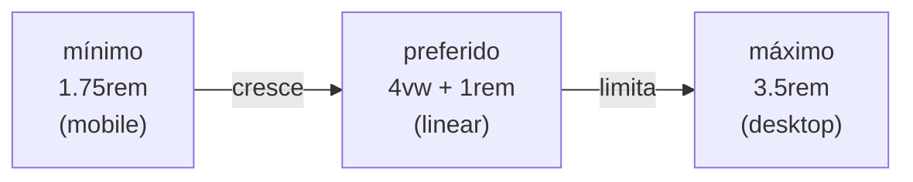
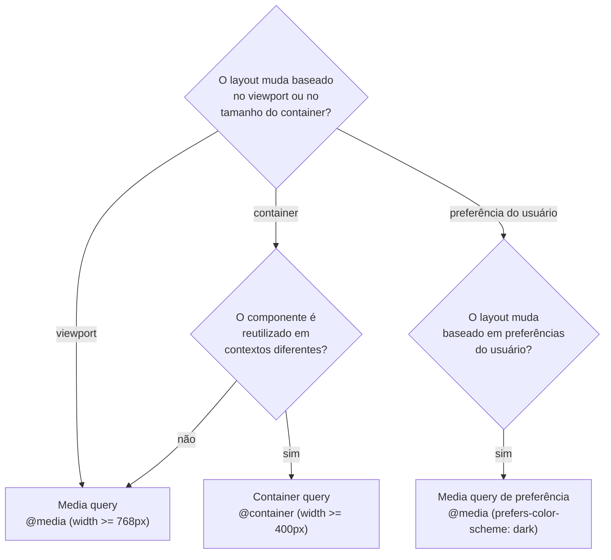

# Design responsivo: media queries e container queries

> [!abstract] TL;DR
> Design responsivo em 2026 usa **dois mecanismos**: media queries (respondem ao viewport) e container queries (respondem ao container do componente). A estratégia **mobile-first** — CSS base para mobile, `min-width` para expandir — produz código mais limpo e performance melhor. `clamp()` elimina breakpoints explícitos para tipografia e spacing. Container queries são o salto: permitem componentes verdadeiramente portáteis que se adaptam onde estiverem, não onde o viewport estiver.

---

## Mobile-first: a estratégia base

Mobile-first significa escrever o CSS base para a tela menor e usar media queries com `min-width` para adicionar estilos em viewports maiores:

```css
/* ✅ Mobile-first: base + expansão */
.card {
  padding: 1rem;
  display: block; /* uma coluna no mobile */
}

@media (width >= 768px) {
  .card {
    padding: 2rem;
    display: grid;
    grid-template-columns: 150px 1fr;
  }
}

/* ❌ Desktop-first: base + compressão — mais difícil de manter */
.card {
  padding: 2rem;
  display: grid;
  grid-template-columns: 150px 1fr;
}

@media (width < 768px) {
  .card {
    padding: 1rem;
    display: block;
  }
}
```

Por que mobile-first é melhor:
1. **Performance**: browsers mobile baixam o CSS base e aplicam menos overrides
2. **Progressão natural**: adicionar complexidade ao expandir é mais fácil que remover ao comprimir
3. **Cascade favorável**: `min-width` adiciona, `max-width` remove — adicionar é o que o cascade faz melhor

---

## Sintaxe moderna de media queries

CSS Media Queries Level 4 introduziu sintaxe de range:

```css
/* Legado (ainda válido) */
@media (min-width: 768px) { }
@media (max-width: 1023px) { }
@media (min-width: 768px) and (max-width: 1023px) { }

/* Moderno — sintaxe de range */
@media (width >= 768px) { }
@media (width < 1024px) { }
@media (768px <= width < 1024px) { } /* intervalo */
```

A sintaxe de range é mais legível e elimina o `and` para intervalos.

### Breakpoints comuns

```css
/* Sistema de breakpoints (baseado no Tailwind) */
@media (width >= 640px)  { /* sm — smartphones landscape */ }
@media (width >= 768px)  { /* md — tablets */ }
@media (width >= 1024px) { /* lg — laptops */ }
@media (width >= 1280px) { /* xl — desktops */ }
@media (width >= 1536px) { /* 2xl — telas grandes */ }
```

> [!tip] Breakpoints baseados no conteúdo
> Os valores exatos dos breakpoints são secundários. O que importa: onde o layout quebra visualmente. Teste no browser, não no spec sheet de devices específicos. Breakpoints baseados em iPhones são obsoletos — a diversidade de telas é enorme.

---

## Media features essenciais

### Preferências do usuário

```css
/* Esquema de cores do sistema */
@media (prefers-color-scheme: dark) {
  :root { --color-bg: #111; --color-text: #eee; }
}
@media (prefers-color-scheme: light) {
  :root { --color-bg: #fff; --color-text: #111; }
}

/* Reduzir movimento — OBRIGATÓRIO respeitar */
@media (prefers-reduced-motion: reduce) {
  *, *::before, *::after {
    animation-duration: 0.01ms !important;
    animation-iteration-count: 1 !important;
    transition-duration: 0.01ms !important;
    scroll-behavior: auto !important;
  }
}

/* Contraste alto */
@media (prefers-contrast: more) {
  :root {
    --color-border: black;
    --color-text: black;
    --color-bg: white;
  }
}

/* Dados reduzidos (modo economia de dados) */
@media (prefers-reduced-data: reduce) {
  .hero-image { display: none; }
  /* Não baixar imagens pesadas */
}
```

### Device capabilities

```css
/* Dispositivo de toque (sem hover preciso) */
@media (pointer: coarse) {
  .btn { min-height: 44px; min-width: 44px; } /* área de toque mínima */
}

/* Mouse com hover preciso */
@media (hover: hover) and (pointer: fine) {
  .card:hover { transform: translateY(-2px); }
}

/* Orientação */
@media (orientation: landscape) {
  .sidebar { display: block; }
}

/* Impressão */
@media print {
  nav, aside, footer { display: none; }
  body { font-size: 12pt; color: black; }
  a[href]::after { content: " (" attr(href) ")"; }
}
```

---

## `clamp()` — fluid scaling sem breakpoints

`clamp(mínimo, preferido, máximo)` retorna um valor que varia suavemente entre os extremos:

```css
/* Tipografia fluida */
h1 {
  font-size: clamp(1.75rem, 4vw + 1rem, 3.5rem);
  /* 1.75rem no mobile, cresce com viewport, máximo 3.5rem */
}

h2 { font-size: clamp(1.5rem, 3vw + 0.75rem, 2.5rem); }
p  { font-size: clamp(1rem, 1vw + 0.875rem, 1.2rem); }

/* Spacing fluido */
.section {
  padding: clamp(2rem, 5vw, 5rem);
}

.container {
  padding-inline: clamp(1rem, 5%, 3rem);
  /* padding-inline = padding-left + padding-right em LTR */
}
```

A expressão `4vw + 1rem` é a parte "preferida" — cresce linearmente com o viewport, mas é limitada pelos extremos. Isso substitui múltiplos breakpoints de tipografia por uma única linha.



---

## Container queries

Media queries têm um problema fundamental: respondem ao **viewport**, não ao contexto do componente. Um card que é sidebar em desktop pode ser coluna principal em mobile — mesmo card, contexto diferente, layout diferente. Com media queries, você precisaria de classes modificadoras ou lógica no componente. Container queries resolvem isso.

### `container-type` e `@container`

```css
/* 1. Declare o container */
.card-wrapper {
  container-type: inline-size; /* responde à largura */
  container-name: card;        /* opcional — para @container nomeado */
}

/* 2. Escreva regras que respondem ao container, não ao viewport */
@container (width >= 400px) {
  .card {
    display: grid;
    grid-template-columns: 150px 1fr;
  }
}

/* @container nomeado */
@container card (width >= 500px) {
  .card__title { font-size: 1.5rem; }
}
```

```html
<!-- O mesmo componente adapta em qualquer contexto -->
<aside class="card-wrapper">      <!-- 250px → layout vertical -->
  <div class="card">...</div>
</aside>

<main class="card-wrapper">       <!-- 800px → layout horizontal -->
  <div class="card">...</div>
</main>
```

### Tipos de container

```css
/* inline-size: responde à largura (mais comum) */
container-type: inline-size;

/* size: responde à largura E altura */
container-type: size;

/* normal: não cria containment dimensional (default) */
container-type: normal;
```

### Container query units

```css
@container (width >= 300px) {
  .card__title {
    font-size: 5cqi;  /* 5% do inline size do container */
  }
}
```

| Unidade | Significado |
|---|---|
| `cqw` | 1% da largura do container |
| `cqh` | 1% da altura do container |
| `cqi` | 1% do inline size (largura em LTR) |
| `cqb` | 1% do block size (altura em LTR) |
| `cqmin` | O menor entre cqw e cqh |
| `cqmax` | O maior entre cqw e cqh |

### Container queries de estilo (style queries)

```css
/* Consultar o valor de uma custom property */
@container style(--variant: compact) {
  .card { padding: 0.5rem; }
}

/* No HTML */
<div class="card-wrapper" style="--variant: compact">
```

---

## Media queries vs container queries — quando usar cada uma



Resumo prático:
- **Media query**: layout de página, breakpoints globais, preferências do usuário
- **Container query**: componentes reutilizáveis (cards, formulários, tabelas, widgets)

---

## Logical properties — internacionalização

CSS logical properties substituem as propriedades físicas (`left`, `right`, `top`, `bottom`) por equivalentes que respeitam a direção de escrita:

```css
/* Físico */
margin-left: 1rem;
padding-right: 0.5rem;
border-top: 1px solid;

/* Lógico (funciona em LTR e RTL) */
margin-inline-start: 1rem;   /* esquerda em LTR, direita em RTL */
padding-inline-end: 0.5rem;  /* direita em LTR, esquerda em RTL */
border-block-start: 1px solid; /* topo */

/* Shorthands */
margin-inline: 1rem;         /* left + right */
margin-block: 2rem;          /* top + bottom */
padding-inline: 1rem 2rem;   /* start end */
inset-inline: 0;             /* left: 0; right: 0 */
```

Para sites internacionais com RTL (árabe, hebraico), usar propriedades lógicas evita um segundo stylesheet:
```css
/* ❌ Precisa de override para RTL */
.nav { padding-left: 1rem; }
[dir="rtl"] .nav { padding-left: 0; padding-right: 1rem; }

/* ✅ Funciona em qualquer direção */
.nav { padding-inline-start: 1rem; }
```

---

## O pattern completo: responsivo moderno

```css
/* 1. Reset com box-sizing */
*, *::before, *::after { box-sizing: border-box; }

/* 2. Variáveis globais */
:root {
  --space-sm: clamp(0.5rem, 1.5vw, 1rem);
  --space-md: clamp(1rem, 3vw, 2rem);
  --space-lg: clamp(2rem, 5vw, 4rem);
}

/* 3. Tipografia fluida */
body { font-size: clamp(1rem, 1vw + 0.875rem, 1.125rem); }
h1   { font-size: clamp(1.75rem, 4vw + 0.5rem, 3rem); }

/* 4. Layout de página com Grid */
.page {
  display: grid;
  grid-template-areas: "header" "main" "footer";
  grid-template-rows: auto 1fr auto;
  min-height: 100svh;
}

@media (width >= 768px) {
  .page {
    grid-template-columns: 250px 1fr;
    grid-template-areas:
      "header  header"
      "sidebar main"
      "footer  footer";
  }
}

/* 5. Componentes com container queries */
.card-grid {
  container-type: inline-size;
}

.card { display: block; }

@container (width >= 400px) {
  .card {
    display: grid;
    grid-template-columns: 120px 1fr;
  }
}

/* 6. Preferências do usuário */
@media (prefers-color-scheme: dark) {
  :root { color-scheme: dark; }
}

@media (prefers-reduced-motion: reduce) {
  *, *::before, *::after {
    animation-duration: 0.01ms !important;
    transition-duration: 0.01ms !important;
  }
}
```

---

> [!question] Para fixar
> 1. Por que mobile-first com `min-width` é preferível a desktop-first com `max-width`? Qual é o impacto em performance?
> 2. O que `clamp(1rem, 4vw + 0.5rem, 2.5rem)` retorna em um viewport de 320px? E em 1440px? (Assuma 1rem = 16px)
> 3. Qual a diferença entre `@media (pointer: coarse)` e `@media (hover: hover)`? Dê um exemplo de uso de cada.
> 4. Um card component precisa ter layout vertical quando tem menos de 400px e horizontal quando tem mais. Ele é usado tanto em sidebars quanto em layouts de 3 colunas. Por que container query é melhor que media query aqui?
> 5. O que é `container-type: inline-size` e por que não usar `container-type: size` na maioria dos casos?
> 6. Qual a diferença entre `margin-left: 1rem` e `margin-inline-start: 1rem`? Quando a distinção importa?

---

## Veja também

- [[03-Dominios/Tecnologia/CSS/05 - Especificidade, cascade e layer|05 — Especificidade]] — anterior
- [[03-Dominios/Tecnologia/CSS/07 - Custom properties e design tokens|07 — Custom properties]] — próxima
- [[03-Dominios/Tecnologia/CSS/04 - CSS Grid - layout bidimensional|04 — CSS Grid]] — Grid + container queries
- [[03-Dominios/Tecnologia/CSS/02 - Unidades, cores e tipografia|02 — Unidades]] — `svh`, `dvh`, `clamp` em contexto
