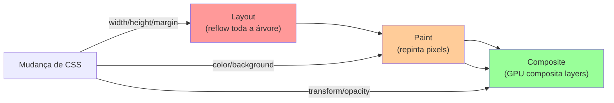

# Animações e transitions

> [!abstract] TL;DR
> CSS oferece dois mecanismos de movimento: `transition` (estado A → estado B, disparado por evento) e `@keyframes` + `animation` (sequência programada, independente de evento). A regra de performance é simples: anime apenas `transform` e `opacity` — eles rodam na GPU sem acionar layout. `prefers-reduced-motion` não é opcional: usuários com condições vestibulares e neurológicas dependem disso. `@property` (nota 07) desbloqueia animação de custom properties que normalmente não seriam animáveis.

---

## `transition` — animação de estado

`transition` suaviza a mudança de um valor CSS quando ele muda via CSS (`:hover`, `:focus`, mudança de classe via JS):

```css
.btn {
  background: var(--color-primary);
  transform: translateY(0);
  box-shadow: var(--shadow-sm);

  /* transition: propriedade duração easing delay */
  transition:
    background var(--duration-normal) ease,
    transform  var(--duration-fast)   ease,
    box-shadow var(--duration-normal) ease;
}

.btn:hover {
  background: var(--color-primary-hover);
  transform: translateY(-2px);
  box-shadow: var(--shadow-md);
}
```

### Shorthand e múltiplas propriedades

```css
/* Uma propriedade */
transition: color 200ms ease;

/* Múltiplas com timing diferente */
transition:
  color      200ms ease,
  background 300ms ease-in-out,
  transform  150ms ease-out 50ms; /* delay de 50ms */

/* Todas as propriedades — evite em performance crítica */
transition: all 200ms ease;
/* ❌ "all" inclui propriedades que causam layout reflow */
```

### Funções de easing

```css
/* Predefinidas */
transition-timing-function: ease;           /* slow-in, slow-out (default) */
transition-timing-function: ease-in;        /* começa devagar */
transition-timing-function: ease-out;       /* termina devagar */
transition-timing-function: ease-in-out;    /* devagar em ambos */
transition-timing-function: linear;         /* velocidade constante */
transition-timing-function: step-start;     /* pula para o estado final imediatamente */
transition-timing-function: step-end;       /* mantém estado inicial, pula no final */

/* Bezier customizado */
transition-timing-function: cubic-bezier(0.34, 1.56, 0.64, 1); /* spring */

/* Steps — útil para sprites */
transition-timing-function: steps(4, jump-end);
```

---

## `@keyframes` + `animation` — animação programada

`@keyframes` define os estados da animação; `animation` aplica em um elemento:

```css
/* Definir a sequência */
@keyframes fadeIn {
  from { opacity: 0; transform: translateY(8px); }
  to   { opacity: 1; transform: translateY(0); }
}

@keyframes pulse {
  0%, 100% { transform: scale(1); }
  50%       { transform: scale(1.05); }
}

@keyframes spin {
  from { transform: rotate(0deg); }
  to   { transform: rotate(360deg); }
}

/* Aplicar */
.toast {
  animation: fadeIn 300ms ease-out both;
  /* nome | duração | easing | fill-mode */
}

.loading-icon {
  animation: spin 1s linear infinite;
}

.badge--new {
  animation: pulse 2s ease-in-out infinite;
}
```

### Propriedades individuais de `animation`

```css
.elemento {
  animation-name:            fadeIn;
  animation-duration:        300ms;
  animation-timing-function: ease-out;
  animation-delay:           0ms;
  animation-iteration-count: 1;           /* ou: infinite */
  animation-direction:       normal;      /* ou: reverse, alternate, alternate-reverse */
  animation-fill-mode:       both;        /* ou: none, forwards, backwards */
  animation-play-state:      running;     /* ou: paused */
}
```

### `animation-fill-mode` — estado fora da animação

```css
/* none (default): elemento volta ao estado original antes e depois da animação */
animation-fill-mode: none;

/* forwards: mantém o estado final após terminar */
animation-fill-mode: forwards;

/* backwards: aplica o estado inicial (frame 0) durante o delay */
animation-fill-mode: backwards;

/* both: aplicação de forwards + backwards */
animation-fill-mode: both;
/* Recomendado para a maioria das animações de entrada */
```

### Múltiplas animações

```css
.elemento {
  animation:
    fadeIn    300ms ease-out both,
    pulse     2s    ease-in-out 300ms infinite;
  /* A segunda começa 300ms após o elemento aparecer */
}
```

---

## Regras de performance

### O que animar

A regra de ouro: anime apenas propriedades que o browser pode compositar na GPU sem acionar layout ou paint:

```css
/* ✅ Compositor-only — performático */
transform: translate(), rotate(), scale(), skew()
opacity: 0 → 1

/* ⚠️ Só paint — trigam repaint mas não layout */
color, background-color, border-color, box-shadow

/* ❌ Layout — trigam reflow de toda a árvore */
width, height, margin, padding, top, left, font-size
```



### `will-change` — dica para o browser

```css
/* Avisa o browser antes de animar — ele cria uma layer GPU */
.modal {
  will-change: transform, opacity;
}

/* ❌ Não use em tudo — cria layers desnecessárias, aumenta memória */
/* Use apenas em elementos que definitivamente vão animar */

/* Retire após a animação se possível */
elemento.addEventListener('animationend', () => {
  elemento.style.willChange = 'auto';
});
```

### `transform` vs `top/left`

```css
/* ❌ Mover com propriedades de posição — causa layout */
.elemento:hover {
  top: -2px; /* reflow */
}

/* ✅ Mover com transform — GPU, sem reflow */
.elemento:hover {
  transform: translateY(-2px);
}
```

---

## `prefers-reduced-motion` — obrigatório

Usuários com epilepsia fotossensível, vertigens vestibulares, TDAH, ou condições neurológicas podem ser prejudicados por animações. Respeitar `prefers-reduced-motion` não é acessibilidade opcional — é uma necessidade de saúde:

```css
/* Abordagem 1: desligar todas as animações */
@media (prefers-reduced-motion: reduce) {
  *, *::before, *::after {
    animation-duration:        0.01ms !important;
    animation-iteration-count: 1      !important;
    transition-duration:       0.01ms !important;
    scroll-behavior:           auto   !important;
  }
}

/* Abordagem 2 (melhor): motion-first em vez de motion-last */
/* Base: sem animação */
.card { transition: none; }

/* Adicionar animação apenas para quem quer */
@media (prefers-reduced-motion: no-preference) {
  .card { transition: transform 200ms ease; }
  .card:hover { transform: translateY(-4px); }
}
```

A abordagem 2 é melhor porque não precisa de `!important` e deixa o código mais legível — a animação é tratada como progressive enhancement.

Para loading spinners e elementos que indicam estado de carregamento, uma alternativa ao movimento pode ser necessária:

```css
/* Spinner que anima para quem aceita movimento */
@keyframes spin {
  to { transform: rotate(360deg); }
}

.spinner {
  /* Estado base: indicador visual estático */
  border: 3px solid var(--color-border);
  border-top-color: var(--color-primary);
  border-radius: 50%;
  width: 1.5rem;
  height: 1.5rem;
}

@media (prefers-reduced-motion: no-preference) {
  .spinner { animation: spin 0.8s linear infinite; }
}
```

---

## `@property` + animação

Como visto na nota 07, `@property` declara o tipo de uma custom property e permite animá-la:

```css
@property --hue {
  syntax: '<number>';
  inherits: false;
  initial-value: 250;
}

@keyframes rainbow {
  from { --hue: 0; }
  to   { --hue: 360; }
}

.gradient-text {
  background: linear-gradient(
    135deg,
    oklch(65% 0.2 var(--hue)),
    oklch(65% 0.2 calc(var(--hue) + 120))
  );
  background-clip: text;
  -webkit-background-clip: text;
  color: transparent;
  animation: rainbow 4s linear infinite;
}
```

Outro exemplo: barra de progresso animada via custom property:

```css
@property --progress {
  syntax: '<percentage>';
  inherits: false;
  initial-value: 0%;
}

.progress-bar {
  background: linear-gradient(to right, var(--color-primary) var(--progress), var(--color-border) 0);
  transition: --progress 500ms ease;
}
```

```javascript
// Atualizar a barra animadamente
progressBar.style.setProperty('--progress', `${percent}%`);
```

---

## Patterns de animação comuns

### Entrada suave (fadeIn + slide)

```css
@keyframes slide-up {
  from {
    opacity: 0;
    transform: translateY(16px);
  }
  to {
    opacity: 1;
    transform: translateY(0);
  }
}

.toast,
.modal,
.tooltip {
  animation: slide-up 250ms cubic-bezier(0.16, 1, 0.3, 1) both;
}
```

### Atenção / shake

```css
@keyframes shake {
  0%, 100% { transform: translateX(0); }
  20%       { transform: translateX(-8px); }
  40%       { transform: translateX(8px); }
  60%       { transform: translateX(-4px); }
  80%       { transform: translateX(4px); }
}

.input--error {
  animation: shake 400ms ease both;
}
```

### Skeleton loading

```css
@keyframes shimmer {
  from { background-position: -200% 0; }
  to   { background-position:  200% 0; }
}

.skeleton {
  background: linear-gradient(
    90deg,
    var(--color-border)   25%,
    var(--color-bg-raised) 50%,
    var(--color-border)   75%
  );
  background-size: 200% 100%;
  border-radius: var(--radius-sm);
}

@media (prefers-reduced-motion: no-preference) {
  .skeleton { animation: shimmer 1.5s ease-in-out infinite; }
}
```

### Hover lift com sombra

```css
.card {
  transition:
    transform  var(--duration-fast)   ease-out,
    box-shadow var(--duration-fast)   ease-out;
}

@media (prefers-reduced-motion: no-preference) and (hover: hover) {
  .card:hover {
    transform:  translateY(-4px);
    box-shadow: var(--shadow-lg);
  }
}
```

---

## Controle de animação via JavaScript

```javascript
// Pausar e retomar
elemento.style.animationPlayState = 'paused';
elemento.style.animationPlayState = 'running';

// Ouvir o fim de uma animação
elemento.addEventListener('animationend', (e) => {
  console.log(`Animação ${e.animationName} terminou`);
  elemento.classList.remove('animating');
});

// Ouvir o fim de uma transition
elemento.addEventListener('transitionend', (e) => {
  if (e.propertyName === 'opacity') {
    elemento.remove(); // remover após fade-out
  }
});

// Verificar preferência do usuário em JS
const reduced = window.matchMedia('(prefers-reduced-motion: reduce)').matches;
if (!reduced) {
  elemento.classList.add('animate');
}
```

---

## `scroll-behavior` e `scroll-driven animations`

```css
/* Scroll suave para âncoras */
html { scroll-behavior: smooth; }

/* Desligar para quem prefere menos movimento */
@media (prefers-reduced-motion: reduce) {
  html { scroll-behavior: auto; }
}

/* Scroll-driven animations (2023+) — animação ligada ao scroll */
@keyframes reveal {
  from { opacity: 0; transform: translateY(20px); }
  to   { opacity: 1; transform: translateY(0); }
}

.section {
  animation: reveal linear both;
  animation-timeline: view();           /* ativa quando entra no viewport */
  animation-range: entry 0% entry 50%; /* de 0% a 50% da entrada */
}
```

---

> [!question] Para fixar
> 1. Por que `transform: translateY(-4px)` é mais performático que `top: -4px` para uma animação de hover?
> 2. Qual a diferença entre `animation-fill-mode: forwards` e `both`? Quando cada um é necessário?
> 3. Um usuário reporta que a navbar piscante o causa tontura. Qual CSS implementa? E como você pode garantir que funciona sem quebrar a animação para outros usuários?
> 4. O que `will-change: transform` faz exatamente? Quando é uma boa ideia e quando é um abuso?
> 5. Como `@property` habilita a animação de custom properties? Por que sem `@property` uma `transition` em `--hue` é ignorada?
> 6. Qual a diferença entre `animation-direction: alternate` e duas animações separadas com `from/to` invertidos?

---

## Veja também

- [[03-Dominios/Tecnologia/CSS/08 - Seletores modernos - has, is, where e nesting|08 — Seletores modernos]] — anterior
- [[03-Dominios/Tecnologia/CSS/10 - Tailwind CSS 4 - utility-first na prática|10 — Tailwind CSS 4]] — próxima
- [[03-Dominios/Tecnologia/CSS/07 - Custom properties e design tokens|07 — Custom properties]] — `@property` animável
- [[03-Dominios/Tecnologia/CSS/06 - Design responsivo - media queries e container queries|06 — Design responsivo]] — `prefers-reduced-motion` em contexto
