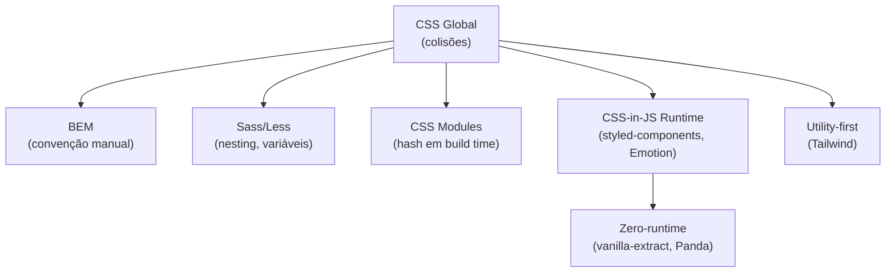
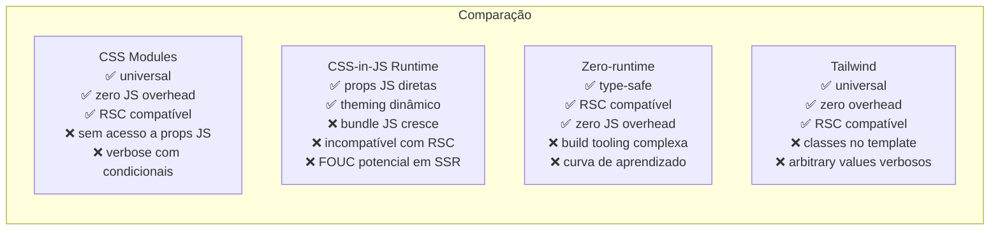

# Arquitetura de estilos: CSS Modules, CSS-in-JS e zero-runtime

> [!abstract] TL;DR
> O problema central em CSS em escala é **escopo** — um seletor em um arquivo pode afetar qualquer elemento no documento. Três soluções emergiram: CSS Modules (escopo em build time via hash de nomes), CSS-in-JS runtime (estilos em JS, injetados no browser — `styled-components`, `Emotion`), e zero-runtime (extração estática em build time — `vanilla-extract`, `Panda CSS`). Em 2025, CSS Modules permanece a escolha segura e universal; zero-runtime ganha terreno em RSC (React Server Components); CSS-in-JS runtime perde espaço por incompatibilidade com SSR e RSC.

---

## O problema: escopo global do CSS

CSS é global por design — qualquer regra pode afetar qualquer elemento. Em um projeto pequeno isso é conveniente; em escala é um vetor de bugs:

```css
/* componentes/button.css — alguém sobrescreve sem querer */
.title { font-size: 1.5rem; }  /* colide com .title em qualquer outro lugar */
```

As soluções ao longo do tempo:



---

## CSS Modules

CSS Modules transforma nomes de classes em identificadores únicos em build time — colisões se tornam impossíveis:

```css
/* Button.module.css */
.root {
  display: inline-flex;
  align-items: center;
  gap: 0.5rem;
  padding: 0.5rem 1rem;
  border-radius: var(--radius-md);
  font-weight: 500;
  transition: background-color 150ms ease;
}

.primary {
  background: var(--color-primary);
  color: white;
}

.primary:hover {
  background: var(--color-primary-hover);
}

.secondary {
  background: var(--color-bg);
  border: 1px solid var(--color-border);
}
```

```tsx
// Button.tsx
import styles from './Button.module.css';

function Button({ variant = 'primary', children, ...props }) {
  return (
    <button className={`${styles.root} ${styles[variant]}`} {...props}>
      {children}
    </button>
  );
}
```

No CSS gerado, os nomes viram hashes:

```html
<!-- HTML gerado -->
<button class="Button_root__xK9mP Button_primary__8qRt2">Enviar</button>
```

```css
/* CSS gerado — sem colisão possível */
.Button_root__xK9mP { ... }
.Button_primary__8qRt2 { ... }
```

### Classes condicionais com `clsx` / `classnames`

```tsx
import styles from './Button.module.css';
import clsx from 'clsx';

function Button({ variant = 'primary', size = 'md', disabled, children }) {
  return (
    <button
      className={clsx(
        styles.root,
        styles[variant],
        styles[size],
        disabled && styles.disabled
      )}
      disabled={disabled}
    >
      {children}
    </button>
  );
}
```

### Composição de módulos

```css
/* base.module.css */
.reset {
  all: unset;
  cursor: pointer;
  display: inline-flex;
}

/* Button.module.css */
.root {
  composes: reset from './base.module.css';
  /* Herda as regras de reset */
  padding: 0.5rem 1rem;
}
```

### Quando usar CSS Modules

- Projetos com Next.js, Vite, Create React App, Vue CLI (suporte nativo)
- Times que preferem separação de CSS e JS
- Migração gradual de CSS global existente
- Projetos sem RSC (ou com RSC, pois modules são estáticos)

---

## CSS-in-JS Runtime

CSS-in-JS runtime permite escrever CSS em JavaScript, com acesso direto a props e estado. O CSS é gerado e injetado no browser em runtime:

### `styled-components`

```tsx
import styled from 'styled-components';

// Template literal — CSS completo com interpolação de JS
const Button = styled.button<{ $variant: 'primary' | 'secondary' }>`
  display: inline-flex;
  align-items: center;
  gap: 0.5rem;
  padding: 0.5rem 1rem;
  border-radius: ${({ theme }) => theme.radii.md};
  font-weight: 500;
  cursor: pointer;

  ${({ $variant, theme }) =>
    $variant === 'primary'
      ? `
        background: ${theme.colors.primary};
        color: white;
        &:hover { background: ${theme.colors.primaryHover}; }
      `
      : `
        background: transparent;
        border: 1px solid ${theme.colors.border};
        &:hover { background: ${theme.colors.bgRaised}; }
      `
  }
`;

// Uso
<Button $variant="primary" onClick={handleSubmit}>Enviar</Button>

// Extender um componente
const LargeButton = styled(Button)`
  padding: 0.75rem 1.5rem;
  font-size: 1.125rem;
`;
```

### `Emotion`

```tsx
import { css } from '@emotion/react';
import styled from '@emotion/styled';

// css() helper — para className dinâmica
const buttonStyle = (primary: boolean) => css`
  padding: 0.5rem 1rem;
  background: ${primary ? 'var(--color-primary)' : 'transparent'};
`;

// Styled API (igual ao styled-components)
const Button = styled.button`
  padding: 0.5rem 1rem;
`;
```

### Problema com RSC e SSR

CSS-in-JS runtime injeta CSS no browser via `<style>` tags em JavaScript. Isso é incompatível com React Server Components (RSC):

- RSC rodam no servidor, sem acesso ao DOM
- CSS-in-JS runtime precisa de `useContext`, `useInsertionEffect` — hooks que não funcionam em RSC
- `styled-components` v6 tem suporte experimental a RSC via streaming, mas é instável

> [!warning] CSS-in-JS runtime e RSC não combinam
> Se o projeto usa Next.js App Router com RSC por padrão, evite styled-components e Emotion em componentes de servidor. Use CSS Modules, Tailwind, ou zero-runtime.

---

## Zero-runtime CSS-in-JS

Zero-runtime extrai o CSS em build time — sem JavaScript no browser para gerar estilos. Compatível com RSC.

### `vanilla-extract`

```ts
// button.css.ts — executado apenas em build time
import { style, styleVariants, createTheme } from '@vanilla-extract/css';

export const root = style({
  display: 'inline-flex',
  alignItems: 'center',
  gap: '0.5rem',
  padding: '0.5rem 1rem',
  borderRadius: 'var(--radius-md)',
  fontWeight: 500,
  cursor: 'pointer',
});

export const variants = styleVariants({
  primary: {
    background: 'var(--color-primary)',
    color: 'white',
    ':hover': { background: 'var(--color-primary-hover)' },
  },
  secondary: {
    background: 'transparent',
    border: '1px solid var(--color-border)',
    ':hover': { background: 'var(--color-bg-raised)' },
  },
});
```

```tsx
// Button.tsx
import { root, variants } from './button.css';
import clsx from 'clsx';

function Button({ variant = 'primary', children }) {
  return (
    <button className={clsx(root, variants[variant])}>
      {children}
    </button>
  );
}
```

O que o `vanilla-extract` gera: um CSS file estático com classes hashadas — exatamente como CSS Modules, mas com type-safety de TypeScript e receitas de design system.

### Sprinkles — atomic CSS com type-safety

```ts
// sprinkles.css.ts
import { defineProperties, createSprinkles } from '@vanilla-extract/sprinkles';

const properties = defineProperties({
  properties: {
    display: ['none', 'flex', 'grid', 'block', 'inline-flex'],
    flexDirection: ['row', 'column'],
    gap: {
      sm: '0.5rem',
      md: '1rem',
      lg: '2rem',
    },
    color: {
      primary: 'var(--color-primary)',
      text: 'var(--color-text)',
    },
  },
});

export const sprinkles = createSprinkles(properties);
```

```tsx
// Uso: type-safe, autocomplete no IDE
<div className={sprinkles({ display: 'flex', gap: 'md', flexDirection: 'column' })}>
```

### `Panda CSS`

```ts
// panda.config.ts
import { defineConfig } from '@pandacss/dev';

export default defineConfig({
  theme: {
    tokens: {
      colors: {
        primary: { value: 'oklch(60% 0.18 250)' },
      },
    },
  },
});
```

```tsx
// Uso com css() helper
import { css } from '../styled-system/css';
import { flex } from '../styled-system/patterns';

const button = css({
  display: 'inline-flex',
  bg: 'primary',
  color: 'white',
  px: '4',
  py: '2',
  rounded: 'md',
  _hover: { bg: 'primary.dark' },
});

<button className={button}>Enviar</button>

// Patterns — combinações pré-definidas
<div className={flex({ gap: 4, align: 'center' })}>
```

---

## Comparação das abordagens



| Critério | CSS Modules | styled-components | vanilla-extract | Tailwind |
|---|---|---|---|---|
| RSC compatível | ✅ | ⚠️ | ✅ | ✅ |
| JS no browser | nenhum | geração de estilos | nenhum | nenhum |
| Acesso a props JS | não | sim | não (build time) | não |
| TypeScript | classes como strings | genéricos | total | parcial |
| Theming dinâmico | via custom props | nativo | via custom props | via custom props |
| DX (autocomplete) | limitado | bom | excelente | excelente |
| Ecossistema | universal | maduro | crescente | líder |

---

## CSS Architecture patterns — ITCSS

Para projetos sem framework de componentes (ou complementando), ITCSS (Inverted Triangle CSS) define camadas por especificidade crescente:

```
1. Settings   — variáveis, tokens (@layer settings)
2. Tools      — mixins, funções (@layer tools)
3. Generic    — resets, normalize (@layer reset)
4. Elements   — estilos base de HTML (@layer base)
5. Objects    — layout sem decoração (@layer objects)
6. Components — UI components (@layer components)
7. Utilities  — classes de override (@layer utilities)
```

Com `@layer`, essa hierarquia se torna a arquitetura nativa:

```css
@layer settings, tools, reset, base, objects, components, utilities;

@layer settings {
  :root {
    --color-primary: oklch(60% 0.18 250);
    /* todos os tokens */
  }
}

@layer reset {
  *, *::before, *::after { box-sizing: border-box; margin: 0; }
}

@layer components {
  .card { /* estilos do card */ }
  .btn  { /* estilos do botão */ }
}

@layer utilities {
  .sr-only { /* screen-reader only */ }
  .text-center { text-align: center; }
}
```

---

> [!question] Para fixar
> 1. Por que CSS-in-JS runtime é problemático com React Server Components? O que causa a incompatibilidade?
> 2. Qual é a diferença entre CSS Modules e `vanilla-extract`? Por que alguém escolheria um sobre o outro?
> 3. O que o `.module.css` faz com os nomes das classes? O que o HTML gerado parece?
> 4. Em que situação você escolheria styled-components/Emotion sobre CSS Modules em 2025?
> 5. Como o ITCSS se relaciona com `@layer`? Mapeie as camadas ITCSS para `@layer` declarations.
> 6. Um projeto Next.js com App Router precisa de theming por tenant (cor primária diferente por cliente). Qual abordagem de estilização você usaria e por quê?

---

## Veja também

- [[03-Dominios/Tecnologia/CSS/10 - Tailwind CSS 4 - utility-first na prática|10 — Tailwind CSS 4]] — anterior
- [[03-Dominios/Tecnologia/CSS/12 - Performance CSS|12 — Performance CSS]] — próxima
- [[03-Dominios/Tecnologia/CSS/05 - Especificidade, cascade e layer|05 — Especificidade e @layer]] — base para arquitetura ITCSS
- [[03-Dominios/Tecnologia/CSS/07 - Custom properties e design tokens|07 — Custom properties]] — tokens que todas as abordagens usam
