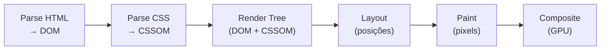
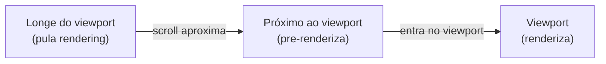

# Performance CSS

> [!abstract] TL;DR
> CSS bloqueia renderização — o browser não pinta nada até que todo o CSS seja baixado, parseado, e aplicado. A estratégia central é reduzir esse tempo: CSS crítico inline (above-the-fold), carregamento assíncrono do restante, uso de `@layer` para previsibilidade de cascade, e evitar seletores que forçam recálculos de layout. Em runtime, a regra é simples: propriedades que causam layout (`width`, `height`, `margin`) são ~10× mais custosas de animar do que `transform` e `opacity` que rodam na GPU.

---

## CSS no Critical Rendering Path

O browser segue uma sequência rígida antes de pintar a primeira página:



CSS é **render-blocking**: o browser para de construir a Render Tree até ter o CSSOM completo. Isso significa que um CSS de 1MB em uma conexão lenta atrasa o First Contentful Paint (FCP) em segundos.

```html
<!-- ❌ CSS grande em um arquivo — bloqueia FCP até baixar tudo -->
<link rel="stylesheet" href="/styles.css">

<!-- ✅ Estratégia: crítico inline + restante assíncrono -->
<style>
  /* Critical CSS: apenas o que aparece above-the-fold */
  *, *::before, *::after { box-sizing: border-box; margin: 0; }
  body { font-family: system-ui; }
  .header { display: flex; height: 64px; }
  .hero { min-height: 70vh; display: grid; place-items: center; }
</style>

<!-- CSS não-crítico: carrega sem bloquear -->
<link rel="preload" href="/styles.css" as="style" onload="this.onload=null;this.rel='stylesheet'">
<noscript><link rel="stylesheet" href="/styles.css"></noscript>
```

---

## CSS crítico vs não-crítico

**CSS crítico** (critical CSS / above-the-fold CSS): apenas os estilos necessários para renderizar o que o usuário vê imediatamente, sem scroll.

Ferramentas para extrair automaticamente:
- `critical` (npm) — analisa a URL e extrai o CSS necessário para o viewport
- Critters (usado pelo Angular CLI e Vite plugin)
- `penthouse` — alternativa mais configurável

Estratégia manual para projetos menores:

```css
/* critical.css — inline no <head> */
:root { /* apenas tokens usados above-the-fold */ }
*, *::before, *::after { box-sizing: border-box; margin: 0; }
body { font-family: var(--font-sans); color: var(--color-text); }

/* Nav, hero, fold — estilos específicos */
.nav { display: flex; align-items: center; height: 4rem; }
.hero { min-height: 80svh; display: grid; place-items: center; }
```

---

## Carregamento assíncrono de CSS

```html
<!-- 1. Preload + onload trick (mais compatível) -->
<link rel="preload" href="/app.css" as="style" 
      onload="this.onload=null;this.rel='stylesheet'">
<noscript><link rel="stylesheet" href="/app.css"></noscript>

<!-- 2. media trick — carrega mas não bloqueia -->
<link rel="stylesheet" href="/app.css" media="print" 
      onload="this.media='all'">

<!-- 3. módulos CSS carregados sob demanda (via JS) -->
```

```javascript
// Carregar CSS de uma rota sob demanda
async function loadRouteCSS(route) {
  const link = document.createElement('link');
  link.rel = 'stylesheet';
  link.href = `/routes/${route}.css`;
  document.head.appendChild(link);
  await new Promise(resolve => link.addEventListener('load', resolve));
}
```

---

## Seletores e performance de recálculo

O browser recalcula estilos quando o DOM ou CSSOM muda. Seletores complexos tornam esse recálculo mais caro:

```css
/* ❌ Seletor universal com qualificadores — lento */
*[data-active] > .item:nth-child(odd) { }

/* ❌ Seletor descendente profundo */
body > main section div.card > .title { }

/* ✅ Uma classe simples — O(1) lookup */
.card__title { }
```

A razão: browsers leem seletores da direita para a esquerda. O último seletor (key selector) é o mais importante para performance. `.card__title` é resolvido imediatamente. `body > main section div.card > .title` exige subir na árvore DOM várias vezes.

Na prática, a diferença de performance entre seletores é raramente o gargalo — o problema mais comum é volume de regras, não complexidade por regra.

---

## Layout thrashing

Layout thrashing ocorre quando JavaScript alterna entre leituras e escritas de propriedades de layout, forçando o browser a recalcular o layout múltiplas vezes por frame:

```javascript
// ❌ Layout thrashing — leitura/escrita intercaladas
for (const element of elements) {
  const height = element.offsetHeight; // leitura — força layout
  element.style.height = height + 10 + 'px'; // escrita
  // próxima iteração: offsetHeight é lido após uma escrita → reflow
}

// ✅ Batch: todas as leituras primeiro, depois todas as escritas
const heights = elements.map(el => el.offsetHeight); // todas as leituras
elements.forEach((el, i) => {
  el.style.height = heights[i] + 10 + 'px'; // todas as escritas
});
```

Propriedades que forçam layout (forçam reflow ao serem lidas):
- `offsetTop`, `offsetLeft`, `offsetWidth`, `offsetHeight`
- `scrollTop`, `scrollLeft`, `scrollWidth`, `scrollHeight`
- `clientTop`, `clientLeft`, `clientWidth`, `clientHeight`
- `getBoundingClientRect()`
- `getComputedStyle()`

Use `requestAnimationFrame` para agrupar escritas:

```javascript
// ✅ Escrever no próximo frame — evita thrashing
function update() {
  const measurements = elements.map(el => el.getBoundingClientRect());
  requestAnimationFrame(() => {
    elements.forEach((el, i) => {
      el.style.transform = `translateY(${measurements[i].top}px)`;
    });
  });
}
```

---

## `contain` — isolamento de layout

A propriedade `contain` diz ao browser que o elemento é independente do restante da página — mudanças dentro dele não afetam fora:

```css
/* contain: layout — layout deste elemento não vaza para fora */
.widget { contain: layout; }

/* contain: paint — elementos fora não são pintados dentro e vice-versa */
.dialog-backdrop { contain: paint; }

/* contain: size — tamanho do elemento não depende do conteúdo */
.fixed-size { contain: size; }

/* contain: strict — all: layout + paint + size */
.isolated-component { contain: strict; }

/* content: layout + paint (mais comum) */
.card { contain: content; }
```

`contain: content` é o mais usado: o browser pode pular o recálculo de layout e paint do resto da página quando este elemento muda.

---

## `content-visibility` — lazy rendering

`content-visibility: auto` diz ao browser para pular o rendering de elementos fora do viewport:

```css
/* O browser pula layout e paint de elementos fora do viewport */
.post {
  content-visibility: auto;
  contain-intrinsic-size: 0 800px; /* placeholder de altura */
}
```



`contain-intrinsic-size` é essencial: sem ele, o browser colapsa os elementos para `0px` de altura antes de renderizá-los, causando CLS.

Ganho típico: páginas com muito conteúdo below-the-fold (`<article>` longo, listas grandes) podem ter 50-80% de redução no tempo de renderização inicial.

---

## CSS e Core Web Vitals

| Métrica | O que mede | Impacto do CSS |
|---|---|---|
| LCP (Largest Contentful Paint) | Tempo até o maior elemento visível ser pintado | CSS render-blocking atrasa LCP; imagens como background não são descobertas pelo preloader |
| CLS (Cumulative Layout Shift) | Soma de shifts inesperados de layout | CSS sem dimensões explícitas, fontes que causam FOIT/FOUT, ads sem reserva de espaço |
| INP (Interaction to Next Paint) | Tempo de resposta a interações | Long tasks de recálculo de estilos; layout thrashing durante event handlers |

### CSS que causa CLS

```html
<!-- ❌ Imagem sem dimensões — shift quando carrega -->


<!-- ✅ Dimensões explícitas — reserva espaço -->

```

```css
/* ❌ Conteúdo dinâmico sem altura reservada */
.ad-banner { }

/* ✅ Reservar altura */
.ad-banner {
  min-height: 250px;
  aspect-ratio: 970 / 250; /* ou dimensões fixas */
}

/* ❌ Fonte externa sem font-display — FOIT/FOUT causa shift */
@font-face {
  src: url('font.woff2');
}

/* ✅ font-display: swap mantém text visível */
@font-face {
  src: url('font.woff2');
  font-display: swap;
}
```

### Animações e INP

```css
/* ❌ Transição em propriedades que causam layout */
.panel {
  transition: height 300ms ease; /* reflow a cada frame */
}

/* ✅ Transição em propriedades GPU-only */
.panel {
  transition: transform 300ms ease;
  /* Usar transform: scaleY() ou translateY() em vez de height */
}
```

---

## Bundle size e code splitting de CSS

```javascript
// Vite: CSS é importado com o JS do componente — split automático
import './button.css'; // bundled no chunk do Button

// CSS dinâmico com lazy loading de rota
const Dashboard = lazy(() => import('./Dashboard')); // carrega Dashboard.css também
```

```css
/* ❌ CSS monolítico — todo CSS baixado na primeira visita */
/* styles.css = 150KB */

/* ✅ Code splitting: CSS por rota/feature */
/* main.css = 20KB (crítico) */
/* routes/dashboard.css = 40KB (só na rota dashboard) */
/* routes/settings.css = 30KB (só em settings) */
```

---

## Checklist de performance CSS

```markdown
## Build time
- [ ] Critical CSS extraído e inline no <head>
- [ ] CSS não-crítico carregado assincronamente (preload + onload)
- [ ] Code splitting: CSS por rota (Vite/Next.js fazem automaticamente)
- [ ] Minificação ativa no build (Lightning CSS, cssnano)
- [ ] Purge de CSS não usado (Tailwind faz automaticamente; PurgeCSS para outros)
- [ ] Fontes com font-display: swap ou optional

## Runtime
- [ ] Animações apenas em transform e opacity (não width/height/margin)
- [ ] prefers-reduced-motion respeitado em todas as animações
- [ ] Sem layout thrashing (leituras e escritas de DOM separadas)
- [ ] will-change usado com moderação (só em elementos que definitivamente animam)
- [ ] contain: content em componentes isolados pesados

## CLS prevention
- [ ] Imagens com width/height explícito
- [ ] Espaço reservado para ads e conteúdo dinâmico
- [ ] content-visibility: auto em listas longas (com contain-intrinsic-size)
- [ ] Nenhuma mudança de layout em load (scrollbar, fontes, banners)
```

---

> [!question] Para fixar
> 1. O que é "CSS render-blocking" e por que o browser precisa de todo o CSSOM antes de renderizar?
> 2. Como você implementa carregamento assíncrono de CSS sem deixar a página sem estilos momentaneamente (FOUC)?
> 3. O que é layout thrashing? Escreva um exemplo de código que causa e outro que resolve.
> 4. Para que serve `contain: content`? Em que tipo de componente você adicionaria?
> 5. Como `content-visibility: auto` acelera o rendering inicial? Por que `contain-intrinsic-size` é necessário?
> 6. Um site tem CLS de 0.35 (acima do limite de 0.1). Quais são as causas mais comuns de CLS no CSS e como diagnosticá-las?

---

## Veja também

- [[03-Dominios/Tecnologia/CSS/11 - Arquitetura de estilos - CSS Modules, CSS-in-JS e zero-runtime|11 — Arquitetura de estilos]] — anterior
- [[03-Dominios/Tecnologia/CSS/13 - CSS em entrevista|13 — CSS em entrevista]] — próxima
- [[03-Dominios/Tecnologia/HTML/10 - Performance em HTML - resource hints e critical path|HTML 10 — Performance em HTML]] — preload/preconnect, Core Web Vitals
- [[03-Dominios/Tecnologia/CSS/09 - Animações e transitions|09 — Animações]] — transform vs propriedades de layout
