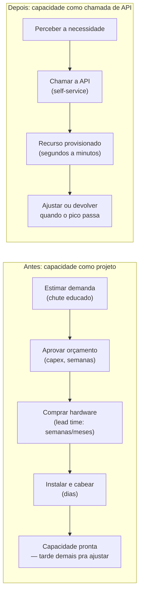
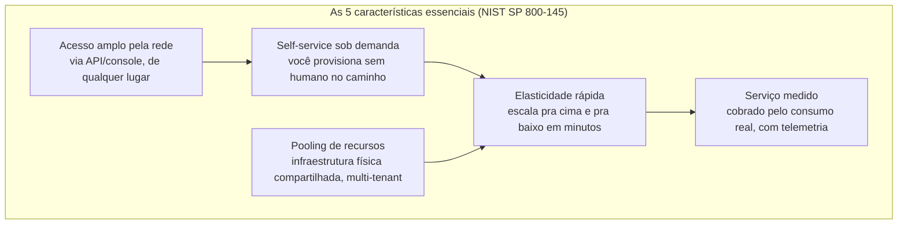
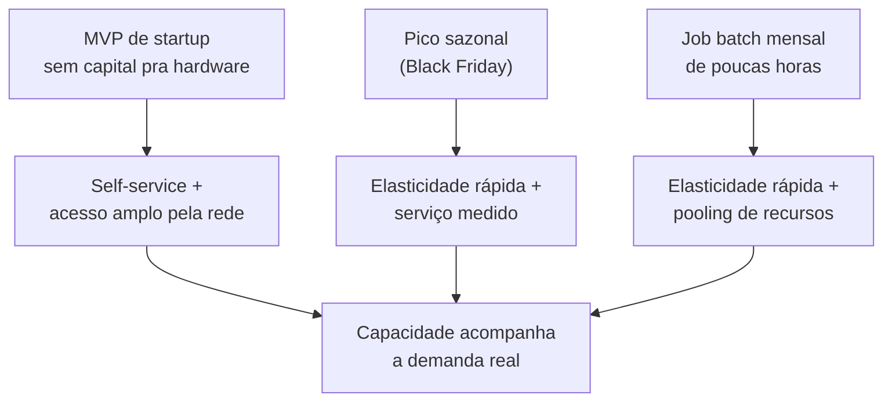

# O que é computação em nuvem

> [!abstract] TL;DR
> Nuvem não é "o computador de outra pessoa" — é a infraestrutura virada **software**: compute, rede e armazenamento provisionáveis em segundos por chamada de API, cobrados pelo uso, e devolvíveis quando você não precisa mais deles. O NIST formaliza isso em cinco características essenciais (SP 800-145): self-service sob demanda, acesso amplo pela rede, pooling de recursos, elasticidade rápida e serviço medido. O que muda de verdade em relação a comprar servidor não é onde a máquina fica fisicamente — é que provisionar capacidade deixou de ser um projeto de compras e virou uma linha de código.

## O servidor que você comprou errado

Imagine que é 2008. Você lidera o time de infra de um e-commerce e a Black Friday está chegando. Alguém pede uma estimativa: quantos servidores o site vai precisar no pico?

Você não sabe ao certo. Ninguém sabe ao certo — é a primeira Black Friday grande da empresa. Então você faz o que todo mundo fazia: chuta para cima. Se o tráfego normal usa 4 servidores, você compra 20, porque errar para baixo significa site fora do ar durante o único dia do ano em que isso é inaceitável. O pedido de compra vai para aprovação financeira (é `capex` — ativo de capital, entra no balanço, deprecia em anos). O fornecedor confirma prazo de entrega: 6 a 8 semanas, se não houver atraso na fábrica. Os racks chegam, alguém instala, cabeia, configura. Três meses depois de decidir, você finalmente tem capacidade para o pico.

E depois da Black Friday? Os 20 servidores continuam lá. Rodando, consumindo energia, ocupando espaço no datacenter, sendo pagos em prestações do financiamento — mas usados a 20% da capacidade pelos próximos 11 meses. Você não pode devolver hardware. Comprou um ativo, não alugou uma capacidade.

Esse é o problema que a nuvem resolve, e é importante ver a forma exata do problema antes de ver a solução. Não é "servidores são caros" — é que a decisão de quanto comprar acontece **semanas ou meses antes** de você saber quanto vai precisar, e a compra é **irreversível na direção errada**: fácil comprar demais e ficar com capacidade ociosa, muito difícil (e lento) comprar de menos e corrigir a tempo. O lead time — o tempo entre "preciso de mais capacidade" e "tenho mais capacidade" — é a variável que trava todo o resto: orçamento, arquitetura, e até que tipo de produto você ousa construir. Se subir uma nova feature significa esperar dois meses por hardware, você simplesmente não experimenta tanto.

> [!info] Caducidade
> Os prazos de aquisição de hardware físico ("6 a 8 semanas") são ilustrativos de um cenário pré-nuvem clássico, não uma cotação atual. Confira lead times reais na cadeia de suprimentos vigente antes de usar o número em qualquer decisão.

A pergunta que a computação em nuvem responde não é "onde os servidores ficam" — é **quem carrega o risco de errar a estimativa de capacidade**, e com que velocidade esse erro pode ser corrigido.



Esse é o salto que interessa: não é o preço por hora de uma máquina — é o **tempo entre perceber a necessidade e ter a capacidade em mãos**, e a capacidade de reverter a decisão sem custo irrecuperável. Foi essa dor, aliás, que a própria Amazon viveu internamente antes de vender a solução para o mercado: no início dos anos 2000, times de e-commerce da Amazon lutavam contra a mesma rigidez — infraestrutura interna difícil de compartilhar entre projetos, provisionamento lento, capacidade presa em silos. A resposta interna da empresa — modularizar e expor essa infraestrutura como serviços internos padronizados — virou, a partir de 2006, um produto: o Amazon S3 (armazenamento de objetos) foi lançado em março daquele ano, seguido pelo Amazon EC2 (máquinas virtuais sob demanda) em agosto. Esses dois lançamentos, historicamente, são o marco que a indústria costuma apontar como o nascimento da nuvem pública tal como a conhecemos hoje — não porque "hospedar coisas na internet" fosse novidade, mas porque foi a primeira vez que provisionar infraestrutura virou, de fato, uma chamada de API disponível para qualquer desenvolvedor com cartão de crédito, sem contrato, sem venda consultiva, sem lead time de compras.

A DigitalOcean nasceu do lado oposto desse espectro — não de dentro de uma gigante resolvendo o próprio problema de escala, mas de um punhado de fundadores decidido a simplificar o que a AWS tinha acabado de inventar. A empresa foi fundada em 2011 por Ben Uretsky, Moisey Uretsky, Jeff Carr, Alec Hartman e Mitch Wainer; os irmãos Uretsky já vinham de uma hospedagem gerenciada chamada ServerStack, fundada quase uma década antes, e queriam algo que combinasse hospedagem web tradicional com servidor virtual, mirando o desenvolvedor individual — não a empresa grande com time de compras. O produto saiu do papel em beta em janeiro de 2012, e a empresa passou pelo acelerador TechStars em Boulder, no Colorado, naquele mesmo ano; ao fim do programa, em agosto de 2012, já tinha cerca de 400 clientes e 10 mil instâncias de servidor rodando. A proposta declarada, desde o início, era a oposta da amplitude da AWS: poucas opções, preço previsível por hora, uma interface que qualquer desenvolvedor entende sem ler documentação. Se a AWS apostou em cobrir todo caso de uso imaginável — dezenas de tipos de instância, centenas de serviços —, a DigitalOcean apostou em cobrir bem a fatia de casos que a maioria dos desenvolvedores individuais e pequenas equipes de fato precisa. Essa aposta original — simplicidade como recurso deliberado, não como limitação temporária de quem ainda não cresceu — é a razão pela qual esta trilha usa a DigitalOcean como "o jeito que você já opera isso" e a AWS como o vocabulário-padrão que uma entrevista técnica sênior espera.

Vale registrar, com a ressalva devida, um episódio frequentemente citado sobre essa mesma transição dentro da Amazon. Em um post que circulou amplamente em 2011, o ex-engenheiro do Google (e ex-funcionário da Amazon) Steve Yegge relatou, como lembrança pessoal de sua época na empresa, um mandado interno atribuído a Bezos por volta de 2002: todas as equipes deveriam expor dados e funcionalidades exclusivamente via interfaces de serviço, desenhadas desde o início para poderem ser externalizadas a desenvolvedores de fora da empresa — sem link direto, sem leitura direta do banco de dados de outro time, só chamada de serviço pela rede. Não existe confirmação oficial da Amazon sobre o texto exato desse mandado; é relato de cultura do setor, vindo da memória de uma pessoa, não documento publicado pela empresa. Mesmo assim, é citado com tanta frequência justamente porque descreve, de dentro, o mesmo movimento que S3 e EC2 tornaram público poucos anos depois: tratar a própria infraestrutura como produto, acessível por interface, antes de vendê-la para fora.

## As cinco características que definem "nuvem"

Em 2011, o NIST (o instituto de padrões técnicos do governo americano) publicou uma definição curta e influente — a **SP 800-145**, "The NIST Definition of Cloud Computing" — que continua sendo a referência canônica do setor, citada em contratos, auditorias e provas de certificação. A definição central:

> "Um modelo para permitir acesso onipresente, conveniente e sob demanda, via rede, a um conjunto compartilhado de recursos computacionais configuráveis (...) que podem ser rapidamente provisionados e liberados com esforço mínimo de gerenciamento ou interação com o provedor de serviço."

Note o que essa frase não diz: não diz "em um datacenter de terceiros", não diz "com pagamento por uso" isolado, não diz "acessado pela internet". O núcleo é **provisionamento rápido com esforço mínimo**. O NIST decompõe isso em cinco características essenciais — um serviço só é "nuvem", nessa definição, se tiver as cinco. Vamos construir cada uma com um exemplo, não como lista para decorar.

Vale entender por que essa definição específica — duas páginas, escritas por um instituto de padrões técnicos, não por um provedor de nuvem — virou a referência dominante do setor em vez de qualquer definição de marketing da própria AWS, Microsoft ou Google. Justamente por ser neutra e curta, ela virou a base de programas de certificação governamental de segurança (como o FedRAMP americano), aparece como referência em contratos e auditorias de compliance, e é citada literalmente em provas de certificação de provedores — inclusive a AWS Certified Solutions Architect, que faz parte do galho 24 desta trilha. Quando alguém em entrevista pergunta "o que é cloud computing, tecnicamente?", a resposta que demonstra profundidade não é "é usar servidor de outra empresa" — é nomear as cinco características e mostrar, com um exemplo, por que cada uma importa. É exatamente essa habilidade que esta nota constrói.

Um teste útil para calibrar o que conta como "nuvem" nessa definição: pense num fornecedor de hardware tradicional que também oferece um portal web e uma API de pedidos. Você preenche um formulário online, escolhe as especificações, e um humano do lado deles ainda precisa aprovar o pedido, alocar o equipamento do estoque físico e agendar entrega — só que agora com uma interface bonita. Isso tem acesso amplo pela rede (é web), mas não tem self-service sob demanda de verdade (o humano continua no caminho), não tem elasticidade rápida (o lead time físico continua existindo) e não tem pooling dinâmico (o equipamento é alocado, não compartilhado e realocado em tempo real). Ter uma API não torna algo "cloud" — as cinco características precisam estar presentes juntas. É esse rigor que separa "tem uma API bonita" de "é nuvem de verdade".



Antes de abrir cada característica em detalhe, aqui está o mapa de referência rápida — o que cada uma significa, como reconhecê-la num serviço real, e o sintoma de sua ausência:

| Característica | O que significa | Como se observa na prática | Onde falha se ausente |
|---|---|---|---|
| Self-service sob demanda | Provisionar sem aprovação humana do lado do provedor | Você chama uma API e o recurso aparece, sem abrir ticket | Portal bonito, mas um humano ainda aprova o pedido manualmente |
| Acesso amplo pela rede | Interface padronizada (HTTP/API) acessível por qualquer cliente heterogêneo | O mesmo endpoint atende CI, notebook e Terraform | Cliente proprietário obrigatório, ou VPN configurada caso a caso |
| Pooling de recursos | Hardware físico compartilhado entre clientes, alocado dinamicamente | Sua VM divide a máquina física com dezenas de outros tenants, sem saber quem | Capacidade dedicada e fixa por cliente, sem folga compartilhada |
| Elasticidade rápida | Escalar pra cima e pra baixo em minutos, sem compromisso de longo prazo | Redimensionar ou multiplicar réplicas via API; a tarifa acompanha quase em tempo real | Contrato fixo, sem forma de devolver capacidade ociosa |
| Serviço medido | Consumo telemetrado automaticamente, usado pra cobrança e visibilidade | Fatura varia com o uso real; dashboards de custo por tag/projeto | Tarifa fixa mensal — escalar pra baixo não muda o que você paga |

### Self-service sob demanda

Voltando ao cenário da Black Friday: o problema não era só o preço do servidor, era que **alguém precisava aprovar, alguém precisava entregar, alguém precisava instalar**. Existia um humano — ou vários — no caminho crítico entre "eu decidi que preciso de capacidade" e "eu tenho capacidade".

Self-service sob demanda elimina esse humano do caminho. Você pede a máquina, o disco, o banco de dados — e o provedor entrega sem que ninguém do lado dele precise aprovar manualmente, negociar contrato ou agendar uma instalação. A "aprovação" já aconteceu uma vez, quando você criou a conta e configurou o método de pagamento; depois disso, o gargalo desaparece.

Isso não é sutileza — é a diferença entre capacidade ser um **projeto** (com prazo, orçamento, ticket) e capacidade ser uma **chamada de função**. E essa mudança se propaga para além da infraestrutura: quando provisionar não depende de aprovação humana, times de engenharia podem experimentar — subir um ambiente de teste às 22h de uma sexta, rodar um experimento de carga que precisa de 50 máquinas por 20 minutos, ou testar uma configuração de banco de dados diferente sem abrir chamado com ninguém. O NIST descreve isso como o consumidor conseguindo "provisionar unilateralmente capacidades computacionais (...) automaticamente, conforme necessário, sem exigir interação humana com cada provedor de serviço" — e o peso da frase está em "sem exigir interação humana", não em "automaticamente". A automação é consequência; a ausência de aprovação manual é a causa.

### Acesso amplo pela rede

Os recursos precisam estar acessíveis por mecanismos de rede padrão — HTTP, principalmente — de forma que qualquer cliente capaz de fazer uma chamada de API consiga provisionar e operar, seja um notebook, um pipeline de CI, ou um script rodando em outro provedor de nuvem.

Isso parece óbvio hoje — "claro que dá pra acessar pela internet" — mas o ponto não é só a conectividade: é que a **interface é padronizada e programável**. Você não precisa de um cliente proprietário instalado numa máquina específica, nem de VPN ponto a ponto configurada manualmente para cada novo consumidor. Uma chamada REST autenticada, de qualquer lugar com internet, e você está operando a infraestrutura.

Vale notar a palavra "amplo": o NIST fala em capacidades "acessadas através de mecanismos padrão que promovem o uso por plataformas de cliente heterogêneas, sejam elas fracas ou robustas" — o mesmo exemplo dado no documento original é notebooks, tablets e celulares. Traduzindo para o dia a dia de quem constrói software: o mesmo endpoint de API que sua pipeline de CI usa para subir infraestrutura em produção é, em geral, o mesmo que você usa manualmente do seu notebook para depurar um ambiente de teste. Não existe um "modo simplificado" para humanos e um "modo real" para máquinas — a interface é uma só, e isso é o que permite ferramentas de terceiros (Terraform, Pulumi, um script interno da sua empresa) se conectarem à infraestrutura do provedor sem precisar de acordo comercial nenhum além de uma credencial de API.

### Pooling de recursos (resource pooling)

Aqui está o "segredo" que faz o resto funcionar: o provedor **não compra um servidor físico para cada cliente**. Ele compra hardware em escala industrial — milhares de máquinas por datacenter — e usa virtualização e orquestração para fatiar essa capacidade física entre milhares de clientes diferentes, alocando dinamicamente conforme a demanda muda.

Isso é multi-tenancy: a máquina física embaixo da sua VM provavelmente hospeda dezenas de outros clientes, sem que vocês se vejam ou interfiram uns nos outros (essa isolação é responsabilidade do hypervisor do provedor — é parte do que você está comprando). O ganho de escala vem exatamente daqui: um provedor com milhões de clientes consegue estatisticamente prever a demanda agregada e manter uma margem de capacidade ociosa muito menor, proporcionalmente, do que cada empresa individual precisaria manter sozinha comprando hardware próprio. O desperdício dos 20 servidores ociosos da Black Friday é, em grande parte, **socializado e amortizado** entre todos os clientes do provedor — é assim que ele consegue vender capacidade elástica sem cobrar como se cada cliente tivesse hardware dedicado.

O NIST acrescenta um detalhe técnico importante nessa característica: o cliente, em geral, "não tem controle nem conhecimento sobre a localização exata dos recursos fornecidos", mas pode ter capacidade de especificar localização num nível mais alto de abstração — país, estado ou datacenter (region). Isso antecipa um conceito que só vai ganhar corpo no galho 2 desta trilha (regiões e zonas de disponibilidade): você escolhe *onde*, em termos amplos, seus recursos vivem — por latência, por soberania de dados, por disponibilidade — mas não escolhe *qual* servidor físico específico roda sua carga. Essa abstração é o preço que você paga pelo pooling: ganha elasticidade e escala, abre mão de controle granular sobre o hardware exato.

Compartilhar hardware físico com desconhecidos também é a origem de um fenômeno que todo engenheiro que já operou em nuvem eventualmente encontra: o "noisy neighbor" — outro cliente na mesma máquina física consumindo tanto I/O de disco ou rede que sua própria carga sente degradação de performance, sem que nada tenha mudado do seu lado. Provedores investem pesado em isolamento (limites de CPU, I/O, rede por VM, aplicados pelo hypervisor) justamente para minimizar esse efeito, e a engenharia deles é boa o suficiente para que, na prática, o problema seja raro — mas "raro" não é "impossível", e é uma das razões pelas quais cargas de trabalho muito sensíveis a latência às vezes optam por instâncias dedicadas, como a armadilha ao fim desta nota vai detalhar.

### Elasticidade rápida

Elasticidade é a característica mais visível — e a mais mal-entendida como sinônimo de "nuvem" quando é só uma consequência das três anteriores. Se você tem self-service (sem humano no caminho), acesso por API (chamada programática) e pooling (capacidade física de sobra em algum lugar do provedor), a consequência natural é que você consegue **escalar para cima em minutos e escalar para baixo — devolvendo recursos que não usa mais — igualmente rápido**.

Essa segunda metade é o que realmente quebra com o modelo antigo. Comprar mais servidor sempre foi possível, só era lento. O que era impossível, fisicamente, era **devolver** o servidor depois do pico e parar de pagar por ele imediatamente. Elasticidade rápida é bidirecional: sobe quando precisa, desce quando não precisa, e o custo acompanha em tempo quase real — sem o compromisso de longo prazo de um ativo comprado.

O texto do NIST é explícito sobre a percepção do cliente: "para o consumidor, as capacidades disponíveis para provisionamento muitas vezes parecem ser ilimitadas, e podem ser apropriadas em qualquer quantidade, a qualquer momento". Repare no verbo — "parecem". Nenhum provedor tem capacidade infinita de verdade; existem limites de conta (quotas), limites de região, e picos de demanda agregada que, em teoria, poderiam esgotar até a capacidade de um provedor gigante. Mas, na prática de um cliente individual, a experiência é de abundância — porque o provedor faz o trabalho pesado de garantir que a fatia que ele te vende esteja sempre disponível, sem que você precise negociar isso caso a caso.

Pense num padrão de tráfego bem comum: uma aplicação B2B cujo uso segue o horário comercial — pico das 9h às 18h, quase deserta à noite e nos fins de semana. Com hardware próprio, você dimensiona para o pico e paga por essa capacidade 24 horas por dia, 7 dias por semana, mesmo que ela fique 60-70% ociosa na maior parte do tempo. Com elasticidade rápida, a infraestrutura pode acompanhar essa curva diurna de verdade — mais capacidade ligada durante o expediente, menos (ou quase nada) de madrugada — e o custo segue a mesma curva. Esse tipo de padrão, previsível e repetitivo, é exatamente onde elasticidade converte-se em economia mensurável, não apenas conveniência operacional.

### Serviço medido (measured service)

A última peça fecha o ciclo: o provedor mede automaticamente o que cada cliente consumiu — CPU-hora, GB armazenado, GB transferido, requisições feitas — e usa essa telemetria tanto para cobrar quanto para dar transparência de uso ao cliente e ao provedor.

Sem medição granular, elasticidade não teria como virar economia real: se você paga uma tarifa fixa mensal independente do uso, escalar para baixo às 3h da manhã não economiza nada. Serviço medido é o que conecta "eu uso menos" a "eu pago menos" — e essa conexão é justamente o assunto da próxima nota desta trilha.

Essa telemetria também cumpre um segundo papel, menos falado mas igualmente importante: ela dá **visibilidade**. Antes da nuvem, "quanto cada time consome de infraestrutura" era, na melhor das hipóteses, uma estimativa feita a partir de alocação de rack; na nuvem, cada recurso carrega metadados de uso que, combinados com tags de organização (qual time, qual projeto, qual ambiente criou aquele recurso), permitem responder com precisão "quanto o time X gastou em compute no mês passado". Isso é o que torna possível toda uma disciplina de engenharia que vai aparecer mais à frente nesta trilha — FinOps, o casamento entre engenharia e finanças em torno do custo de nuvem — mas a raiz técnica dela é exatamente essa: sem serviço medido, não haveria dado nenhum para essa disciplina trabalhar em cima.

> [!info] Fronteira
> Esta nota não entra em capex vs. opex, TCO, nem no cálculo de economia da elasticidade — isso é o corpo da **nota 02**. Aqui, "serviço medido" fica só na definição.

> [!tip] Assista: [AWS] O que é Computação em Nuvem (Cloud Computing)? Entenda agora!
> **Canal:** Ka Solution Oficial | **Duração:** ~23min | **Idioma:** PT-BR
>
> O vídeo amarra as mesmas peças desta seção — self-service, elasticidade, capex virando opex — mas com um exemplo de varejo (Black Friday) que mostra a elasticidade bidirecional (sobe e desce) acontecendo na prática, não só na definição. Trecho de destaque [11:02]: *"que que você vai trazer para a gente agilidade elasticidade economia de custo e uma implantação rápida"*
>
> 🎬 [Assistir no YouTube](https://www.youtube.com/watch?v=hyttXdfae9w)

## O que a nuvem não é

Existe uma piada cansada no setor: "a nuvem é só o computador de outra pessoa". É verdadeira de um jeito raso e falsa do jeito que importa.

É verdade que, fisicamente, seus dados e sua VM rodam em hardware que pertence à AWS, à DigitalOcean, ou a outro provedor, num datacenter que você nunca vai visitar. Isso não é novidade — hospedagem terceirizada existe desde antes da nuvem (data centers colocation, hosting compartilhado). O que essa piada erra é achar que "terceirização de hardware" é o fato interessante.

O fato interessante é que a infraestrutura virou **API**. Antes da nuvem, mesmo alugando um servidor de terceiros, você ainda dependia de um humano do lado do provedor para provisionar, redimensionar ou desligar aquele servidor — um ticket, um telefonema, um SLA de horas ou dias. A nuvem move essa fronteira: rede, compute, armazenamento, banco de dados — tudo isso vira um **recurso que uma chamada de API cria, modifica e destrói em segundos**, e cujo estado você pode consultar programaticamente a qualquer momento.

Para sentir a diferença na pele, compare o mesmo pedido — "preciso de mais um servidor até sexta" — passando pelos dois modelos, etapa por etapa:

| Etapa | Hosting tradicional (fluxo de ticket) | Nuvem (fluxo de API) | Unidade de tempo |
|---|---|---|---|
| Solicitar o recurso | Abre chamado no portal do provedor, descreve a especificação | Chama `POST /v2/droplets` (DigitalOcean) ou `RunInstances` (AWS) | Minutos vs. segundos |
| Aprovação | Alguém do suporte confirma orçamento e detalhes técnicos | Nenhuma — a política já foi validada quando a conta foi criada | Horas/dias vs. inexistente |
| Provisionamento | Time de operações do provedor aloca e testa a máquina manualmente | Sistema provisiona automaticamente, sem intervenção humana | Dias vs. segundos |
| Entrega | Credenciais chegam por e-mail, depois de confirmação manual | IP e acesso SSH liberados na própria resposta da chamada | Dias vs. segundos |
| Tempo total até "servidor pronto" | ~4-5 dias úteis, se nada atrasar | ~1 minuto, do pedido ao `active`/`running` | Dias vs. minutos |

O ganho não é só velocidade — é que o primeiro fluxo tem, em cada etapa, um humano decidindo se sua solicitação é razoável, prioritária, dentro do escopo do contrato. O segundo fluxo não tem humano nenhum no caminho: a política já foi decidida uma vez, quando sua conta foi criada e seu método de pagamento validado; a partir daí, o sistema decide sozinho, seguindo regras já configuradas. É essa ausência de humano no meio do caminho — não a existência de um portal bonito — que separa hosting tradicional de nuvem, mesmo quando os dois oferecem "acesso pela web".

Essa "chamada de API" da linha 1 da tabela não é metáfora — console web, CLI e um `curl` cru batem literalmente no mesmo endpoint HTTP. `doctl` (a CLI da DigitalOcean) é, por baixo, um cliente HTTP que autentica com um token e chama a API REST pública; qualquer ferramenta capaz de montar essa mesma requisição consegue o mesmo resultado, sem instalar CLI nenhuma:

```bash
# Listar Droplets — o mesmo endpoint que o painel web e o doctl usam por baixo
curl -X GET \
  -H "Content-Type: application/json" \
  -H "Authorization: Bearer $DIGITALOCEAN_TOKEN" \
  "https://api.digitalocean.com/v2/droplets"
```

> [!info] Caducidade
> Base URL e formato de autenticação (Bearer token) da API v2 da DigitalOcean verificados pela referência oficial em 2026-07-20; a resposta exata dessa chamada não foi reconfirmada nesta revisão contra a doc mais recente — confira a API Reference oficial antes de automatizar algo em cima dela.

Essa diferença — infraestrutura como software, não como ativo físico gerenciado por processo humano — é o que a lista de cinco características do NIST está, na prática, descrevendo. E é por isso que a nuvem muda a arquitetura que você ousa construir: se subir uma máquina, criar um banco ou apagar um ambiente inteiro de teste custa uma chamada de API e alguns segundos, você programa contra a infraestrutura do mesmo jeito que programa contra qualquer outro serviço. Infraestrutura como código (que volta com mais profundidade lá no bloco 4 desta trilha) só é possível porque essa API existe.

Vale a pena separar dois fatos que costumam ser confundidos: **virtualização** e **nuvem** não são sinônimos, embora a primeira seja o alicerce técnico da segunda. Rodar múltiplas máquinas virtuais numa máquina física existe desde muito antes de 2006 — hypervisors como o Xen (o motor original por trás do EC2) já eram tecnologia madura em ambientes corporativos internos. O que faltava, antes da nuvem pública, não era a capacidade técnica de particionar hardware — era a **camada de API self-service** por cima dessa capacidade, aberta a qualquer desenvolvedor externo, sem processo de venda, sem contrato anual, sem um time de TI interno alocando a VM para você. A nuvem não inventou a virtualização; ela empacotou a virtualização atrás de uma interface programável e a vendeu por consumo. É essa combinação — tecnologia que já existia, mais um modelo de acesso e cobrança que não existia — que fez a diferença.

> [!info] Camadas
> Existem camadas diferentes de "quanto da pilha é gerenciada pelo provedor" — infraestrutura crua (IaaS), plataforma de aplicação (PaaS), função sob demanda (FaaS), software pronto (SaaS). Essa distinção é o assunto inteiro da **nota 03**; aqui, o ponto é só que essas camadas existem.

Uma pergunta natural, chegado até aqui: se a infraestrutura é compartilhada (pooling) e gerenciada em grande parte pelo provedor, quem é responsável por quê quando algo dá errado — uma vulnerabilidade, uma configuração exposta, uma indisponibilidade? A resposta tem nome formal (responsabilidade compartilhada) e não é a mesma para todo tipo de serviço — varia conforme a camada (IaaS, PaaS, FaaS) mencionada acima. Essa é, propositalmente, uma pergunta que esta nota levanta e não responde: ela pertence ao **galho 2**, junto com regiões e zonas de disponibilidade. O ponto, aqui, é só registrar que "infraestrutura como API" não significa "responsabilidade zero do seu lado" — significa que a fronteira de responsabilidade mudou de lugar, e mapear exatamente onde ela está é trabalho sério, não intuição.

## As cinco características na prática: subir uma máquina em dois provedores

A teoria fica abstrata até você ver o mesmo ato acontecendo de verdade. Pegue a ação mais básica que existe em cloud — "eu quero uma máquina rodando" — e observe as cinco características do NIST aparecerem, uma por uma, nos dois provedores desta trilha.

Em **AWS**, você chama a API do EC2 (via console, CLI ou SDK) pedindo uma instância: escolhe o tipo de máquina (vCPU, memória), a imagem do sistema operacional (AMI), e dispara. Em minutos — às vezes segundos — a instância está `running`, com um IP atribuído, pronta para receber conexão SSH. Você não falou com ninguém da AWS. Não assinou contrato novo. A cobrança começa a contar a partir do momento em que a instância liga, medida por segundo ou por hora dependendo do tipo, e para quando você a desliga.

Em **DigitalOcean**, o fluxo é o mesmo ato com nomes diferentes: você cria um **Droplet** — escolhe a imagem, o tamanho (vCPU/RAM/disco), a região — via painel, `doctl` (CLI) ou API REST, e em menos de um minuto o Droplet está ativo, com IP público, cobrando por hora até você destruí-lo.

Nos dois casos, as cinco características estão todas presentes: você mesmo provisionou (self-service), via chamada de rede padronizada (acesso amplo), numa máquina física que na verdade hospeda dezenas de outros clientes ao seu lado (pooling), que você pode multiplicar por dez ou apagar em minutos (elasticidade), e que só é cobrada enquanto existe, pelo tempo que existiu (serviço medido). A AWS tem um catálogo de tipos de instância e regiões ordens de grandeza maior; a DigitalOcean é deliberadamente mais simples, com menos opções e um preço mais previsível. Mas o **modelo mental é idêntico** — e é esse modelo, não o catálogo de um provedor específico, que esta trilha constrói primeiro.

Se você já roda alguma coisa em DigitalOcean, provavelmente já executou o equivalente informal disto. Lado a lado, com a sintaxe verificada nas referências oficiais de cada CLI:

```bash
# AWS — subir uma instância via CLI (flags verificadas na AWS CLI Reference)
aws ec2 run-instances \
  --image-id ami-0c55b159cbfafe1f0 \
  --instance-type t3.micro \
  --count 1 \
  --key-name minha-chave \
  --security-group-ids sg-0123456789abcdef0 \
  --subnet-id subnet-0123456789abcdef0
```

```json
// Saída (resumida) — trecho relevante do JSON de resposta do run-instances
{
  "Instances": [
    {
      "InstanceId": "i-0123456789abcdef0",
      "InstanceType": "t3.micro",
      "State": { "Name": "pending" },
      "PrivateIpAddress": "10.0.1.23"
    }
  ]
}
```

```bash
# DigitalOcean — subir um Droplet via doctl (flags verificadas na doctl Reference)
doctl compute droplet create meu-droplet \
  --image ubuntu-24-04-x64 \
  --size s-1vcpu-1gb \
  --region nyc3 \
  --ssh-keys 12345678 \
  --wait
```

```text
# Saída (resumida) — colunas retornadas depois do --wait, quando o Droplet fica "active"
ID           Name          Public IPv4       Memory    VCPUs   Disk   Region   Status
392704872    meu-droplet   164.90.XXX.XXX    1024      1       25     nyc3     active
```

O ponto de reparar não é decorar a sintaxe — é que, nos dois casos, você descreve *o que quer* (tamanho, imagem, região, chave de acesso) numa única chamada, e o provedor devolve um recurso identificável (`InstanceId` ou `ID`) já em estado de inicialização, sem que ninguém do lado de lá precise aprovar manualmente. Essa é a característica de self-service sob demanda, escrita em forma de comando de terminal — e o `--wait` do `doctl` é só conveniência de CLI: por baixo, é a mesma chamada de API assíncrona que o `curl` da seção anterior faz manualmente.

> [!info] Caducidade
> Flags e formato de saída verificados na AWS CLI Command Reference e na doctl Reference em 2026-07-20/21. IDs de imagem (`ami-...`), tipos de instância, slugs de tamanho e IDs de chave/grupo de segurança acima são ilustrativos — o seu ambiente terá valores diferentes. Confira a CLI reference oficial de cada provedor antes de rodar qualquer comando real.

> [!info] Fronteira
> Regiões, zonas de disponibilidade, a diferença entre console/CLI/SDK, e o modelo de responsabilidade compartilhada (o que é responsabilidade sua vs. do provedor) ficam para o **galho 2**. Aqui, EC2 e Droplet aparecem só como exemplo nomeado do conceito — não como algo a aprender a operar ainda.

| Conceito | AWS | Azure | GCP | DigitalOcean |
|---|---|---|---|---|
| Máquina virtual sob demanda | EC2 (Elastic Compute Cloud) | Virtual Machines | Compute Engine | Droplet |
| Interface programável | Console, AWS CLI, SDKs | Portal, Azure CLI, SDKs | Console, `gcloud`, SDKs | Painel, `doctl`, API REST |

> [!info] Caducidade
> Nomes de serviço, opções de tamanho de máquina e faixas de preço verificados em 2026-07-20. Confira a documentação oficial de cada provedor antes de decidir — esses detalhes mudam com frequência.

> [!tip] Assista: Computação em nuvem - O que é cloud computing
> **Canal:** Dias de Dev | **Duração:** ~13min | **Idioma:** PT-BR
>
> Um dev mostra a escalabilidade automática e o load balancer acontecendo de verdade num provedor — o mesmo self-service e elasticidade que esta nota descreve em prosa, só que como decisão técnica concreta ("quando o processamento bate 70%, cria um novo servidor"). Trecho de destaque [06:44]: *"você vai ter funcionalidades como por exemplo escalabilidade automática (...) sem o meu processamento bater em 70% cria um novo servidor automaticamente"*
>
> 🎬 [Assistir no YouTube](https://www.youtube.com/watch?v=eSrIV6BQ7Fs)

## Casos práticos

A definição fica mais concreta em três cenários que qualquer engenheiro sênior já viveu de um lado ou de outro.

**O MVP que não pode esperar hardware.** Dois desenvolvedores decidem validar uma ideia de produto B2B. A decisão concreta que eles enfrentam não é "cloud ou não" — é qual tamanho de instância pedir primeiro. Eles sobem a menor VM disponível (na ordem de 1 vCPU, 1 GB de RAM — o suficiente para uma API simples e um banco de dados pequeno), apontam o domínio, e o produto está no ar na mesma tarde, custando uma fração de dólar por hora enquanto praticamente ninguém usa. Três semanas depois, um post viral traz os primeiros mil usuários simultâneos; a API começa a devolver timeout. A resposta é redimensionar a instância para um tamanho maior — ou subir uma segunda atrás de um load balancer — em minutos, sem renegociar nada, e seguir em frente. Agora imagine a mesma dupla no mundo pré-nuvem, obrigada a decidir *antecipadamente* quanto comprar: subestimar significa não ter como validar a ideia (nenhum usuário real vê o produto); superestimar significa imobilizar capital que a startup provavelmente nem tem, num ativo que só vai ser usado à fração da capacidade nos primeiros meses. A nuvem não torna a decisão de dimensionamento desnecessária — ela só a torna **reversível em minutos** em vez de irreversível em meses, e é exatamente essa reversibilidade que permite adiar a decisão difícil até ter dado real para tomá-la.

**O pico sazonal que só dura um dia.** Volte à Black Friday do início desta nota, agora resolvida com nuvem. Em vez de comprar 20 servidores em outubro para usar um dia em novembro, o time configura escala automática com um limite simples — por exemplo, adicionar uma instância nova a cada faixa de requisições por segundo que a fila ultrapassa, entre um piso de 4 instâncias (a operação normal) e um teto de 40 (a margem de segurança para o pico). Na sexta-feira do evento, a contagem sobe de 4 para a casa das dezenas ao longo da manhã, se mantém lá durante o pico de tráfego, e desce de volta a 4 no fim de semana, sozinha, sem ninguém acordado às 3h monitorando dashboard. A fatura do mês reflete algumas dezenas de horas extras de instância, não um ano inteiro de capacidade ociosa. Agora o contraponto: se o time tivesse decidido *não* configurar escala automática — deixando fixas as 4 instâncias de sempre, por economia ou por falta de tempo — o resultado não seria "mais barato", seria o site fora do ar durante o único dia do ano em que isso dói mais. E se tivesse decidido manter fixas as 40 instâncias o ano inteiro "por segurança", o resultado seria pagar o pico de novembro nos outros onze meses — o mesmo desperdício do cenário de 2008, só que medido em cartão de crédito em vez de financiamento de hardware.

**O job pesado que roda três horas por mês.** Um time de dados precisa reindexar um catálogo grande ou retreinar um modelo — uma carga que consome bastante CPU e memória, mas só uma vez por mês, por poucas horas. A decisão concreta aqui é resistir à tentação de manter uma máquina grande ligada o tempo todo "para não ter que lembrar de subir e derrubar": isso custaria o equivalente a comprar hardware dedicado para rodar 3 horas de trabalho útil e passar 717 horas ocioso — uma taxa de aproveitamento inferior a 1%. Em vez disso, o time sobe uma instância otimizada para memória sob demanda, roda o job, e a derruba assim que termina — via um script agendado, não via lembrete manual, porque um humano vai esquecer de desligar em algum mês e a fatura vai denunciar isso. Um jeito de tornar esse erro caro impossível, aliás, é configurar o próprio destroy do recurso como parte do pipeline que executa o job — a devolução da capacidade fica automática, tanto quanto a criação dela. Se o time tivesse decidido manter a máquina grande ligada permanentemente "porque é mais simples", o custo mensal seria dezenas de vezes maior do que o das três horas realmente usadas — o mesmo tipo de desperdício que a elasticidade existe para eliminar, só que autoinfligido por preguiça operacional, não por limitação técnica do provedor.

Em todos os três, o denominador comum não é "economizou dinheiro" de forma automática — é que **a decisão de quanta capacidade manter deixou de precisar de uma resposta única, permanente, feita com meses de antecedência**. A capacidade agora acompanha a demanda real, subindo e descendo, em vez de ser fixada uma vez no orçamento anual.



## Onde isso aparece no dia a dia

Você provavelmente já viveu as cinco características sem nomeá-las assim. Sempre que subiu um ambiente de teste rapidamente e derrubou horas depois sem pedir permissão a ninguém, isso foi self-service sob demanda e elasticidade rápida juntas. Sempre que rodou `terraform apply` e viu recursos de infraestrutura nascerem programaticamente, isso foi acesso amplo pela rede combinado com uma API estável o suficiente para ferramentas de terceiros construírem em cima. Sempre que olhou a fatura no fim do mês e viu ela variar conforme o uso real — mais alto num mês de tráfego pesado, mais baixo num mês parado — isso foi serviço medido funcionando como projetado.

E sempre que uma decisão de arquitetura levou em conta "isso escala automaticamente ou preciso provisionar manualmente com antecedência?" — essa pergunta só existe porque a resposta, na nuvem, pode ser "escala sozinho". Isso é diferente o suficiente do mundo pré-nuvem para justificar todo o resto desta trilha: os primitivos que a nuvem oferece (compute, rede, armazenamento, bancos) só entregam esse valor porque foram desenhados sobre essas cinco características desde o início.

Pense também em como isso muda o comportamento de um time. Antes, testar uma hipótese de infraestrutura — "será que esse banco aguenta essa carga?", "será que vale a pena migrar esse serviço para uma máquina com mais memória?" — exigia negociar acesso a um servidor físico já existente, ou esperar compra de um novo. Hoje, a resposta para "eu não sei, vamos testar" é literalmente subir um ambiente descartável, rodar o teste, medir, e apagar tudo em minutos, pagando só pelo tempo de uso. O efeito colateral disso na cultura de engenharia é real: decisões que antes exigiam análise teórica cuidadosa (porque errar custava caro e demorado para corrigir) hoje podem ser resolvidas empiricamente, porque o custo de errar caiu de "semanas e um pedido de compra" para "alguns dólares e vinte minutos". Isso não torna a análise cuidadosa desnecessária — mas muda o cálculo de quando vale mais a pena simplesmente experimentar.

## Armadilhas comuns

> [!warning] Achar que "nuvem" é sinônimo de "elástico automaticamente"
> Nenhuma das cinco características do NIST diz que a infraestrutura escala sozinha por padrão. Uma instância EC2 ou um Droplet parado num tamanho fixo não vira elástico magicamente — elasticidade *rápida* (você consegue redimensionar em minutos, sob demanda) é diferente de elasticidade *automática* (o sistema se redimensiona sozinho baseado em métrica, o que é configuração adicional, como Auto Scaling Groups). A nuvem torna a automação possível; ela não vem ligada por padrão.

> [!warning] Confundir "self-service" com "sem custo de operação"
> Eliminar o humano do lado do provedor não elimina a necessidade de operação do lado do cliente. Alguém ainda precisa decidir tamanhos, configurar políticas de escala, monitorar custo e corrigir configuração errada — só que agora essas decisões acontecem via API, em minutos, em vez de via ticket, em semanas. Self-service move o trabalho, não o extingue.

> [!warning] Tratar "pooling de recursos" como garantia de isolamento perfeito
> Multi-tenancy funciona bem na prática, mas é isolamento lógico (por hypervisor/kernel), não isolamento físico. Cargas de trabalho com requisitos regulatórios ou de latência muito estritos às vezes precisam de instâncias dedicadas (hardware não compartilhado) — uma opção que existe, mas custa mais e é a exceção, não a regra.

## Em resumo

A definição do NIST parece burocrática à primeira vista — cinco frases secas de um documento de governo — mas ela é, na prática, uma ferramenta de diagnóstico. Da próxima vez que alguém disser "isso é cloud", vale perguntar: tem self-service, sem humano aprovando cada provisionamento? Tem acesso padronizado por rede, programável? Roda em cima de infraestrutura compartilhada, alocada dinamicamente? Escala em minutos, nas duas direções? É cobrado pelo que de fato se consome? Se a resposta for sim às cinco, é nuvem no sentido pleno do termo — e o modelo mental construído aqui (infraestrutura como API, não como ativo) vale para qualquer serviço específico que você for aprender daqui para frente nesta trilha, seja ele uma VM, um banco gerenciado ou uma função serverless.

Guarde também a distinção entre as duas metades da definição: as três primeiras características (self-service, acesso amplo, pooling) descrevem **como você chega até o recurso** — a interface e o modelo de acesso. As duas últimas (elasticidade e serviço medido) descrevem **o que essa interface te permite fazer com o custo** — ajustar capacidade em tempo real e pagar só pelo que usou. É essa segunda metade, especificamente, que muda a economia de construir software — e é para lá que esta trilha vai a seguir.

## O que vem a seguir

Esta nota estabeleceu o que muda estruturalmente com a nuvem: infraestrutura virou API, provisionável em segundos, elástica nas duas direções. Mas ainda não respondeu a pergunta que qualquer engenheiro sênior faz em seguida: **e daí, por que isso é mais barato — ou é mesmo?** A resposta não é óbvia; comprar hardware tem um custo por unidade de capacidade geralmente menor do que alugar da nuvem, hora a hora. O que muda é a forma como esse custo se comporta ao longo do tempo e sob incerteza. É exatamente esse cálculo — capex vs. opex, e por que elasticidade muda a economia de errar a estimativa — que a próxima nota, **"Capex, opex e a economia da elasticidade"**, desenvolve.

## Fontes

- [NIST SP 800-145 — The NIST Definition of Cloud Computing (documento oficial, página de publicação)](https://csrc.nist.gov/publications/detail/sp/800-145/final) — fonte canônica das cinco características essenciais; acessado em 2026-07-20.
- [NIST SP 800-145 — texto completo em PDF](https://nvlpubs.nist.gov/nistpubs/Legacy/SP/nistspecialpublication800-145.pdf) — documento original de duas páginas, setembro de 2011; acessado em 2026-07-20.
- [AWS — Our Origins (histórico oficial da AWS)](https://aws.amazon.com/about-aws/our-origins/) — origem interna do projeto na infraestrutura de e-commerce da Amazon; acessado em 2026-07-20.
- [Wikipedia — Timeline of Amazon Web Services](https://en.wikipedia.org/wiki/Timeline_of_Amazon_Web_Services) — datas de lançamento do S3 (março de 2006) e do EC2 (agosto de 2006); acessado em 2026-07-20.
- [AWS EC2 — documentação oficial](https://docs.aws.amazon.com/ec2/) — referência de produto e API.
- [DigitalOcean Droplets — documentação oficial](https://docs.digitalocean.com/products/droplets/) — referência de produto e API.
- [AWS vs DigitalOcean — comparação publicada pela própria DigitalOcean](https://www.digitalocean.com/blog/aws-vs-digitalocean-cloud-platform) — posicionamento de simplicidade vs. catálogo amplo, usado como contexto para a lente dupla desta trilha.
- [Wikipedia — DigitalOcean](https://en.wikipedia.org/wiki/DigitalOcean) — fundação em 2011, fundadores, beta em janeiro de 2012, passagem pelo TechStars e números de agosto de 2012 (400 clientes, ~10 mil instâncias); acessado em 2026-07-20.
- [Steve Yegge's Google Platforms Rant (cópia preservada, University of Washington)](https://courses.cs.washington.edu/courses/cse452/23wi/papers/yegge-platform-rant.html) — relato pessoal do "mandado" interno atribuído a Bezos por volta de 2002; tratado nesta nota como relato de cultura do setor, não fato documentado oficialmente pela Amazon; acessado em 2026-07-20.
