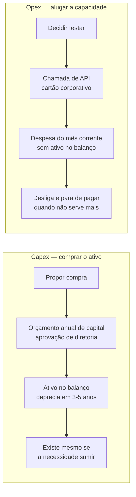
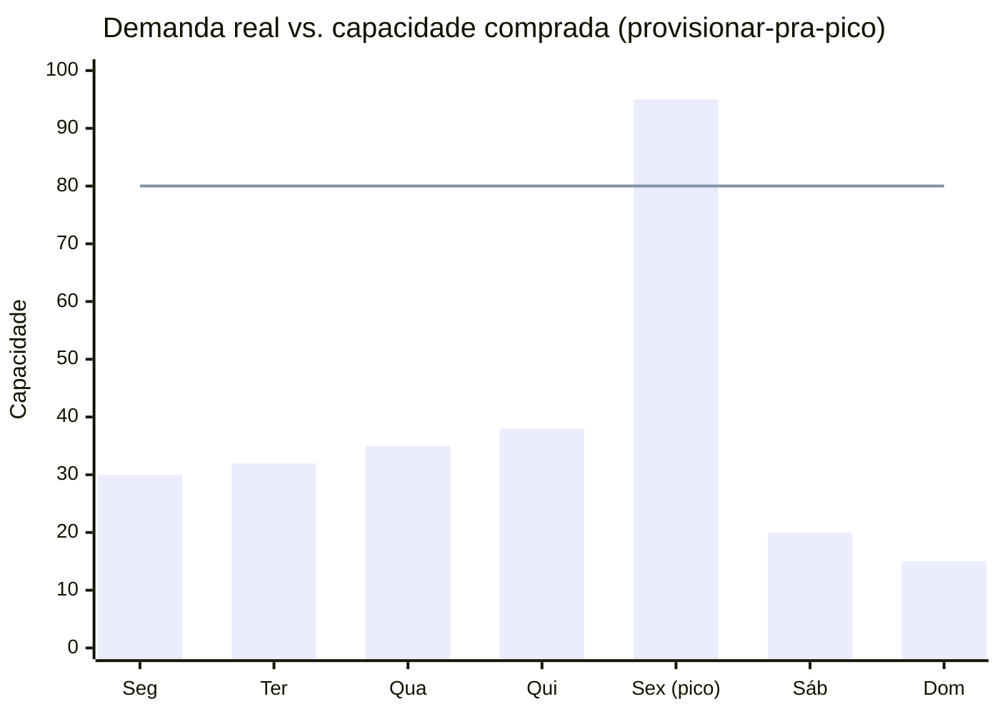
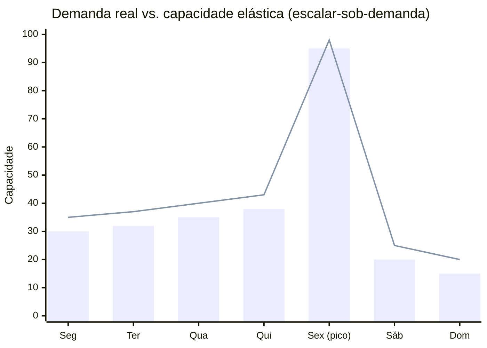
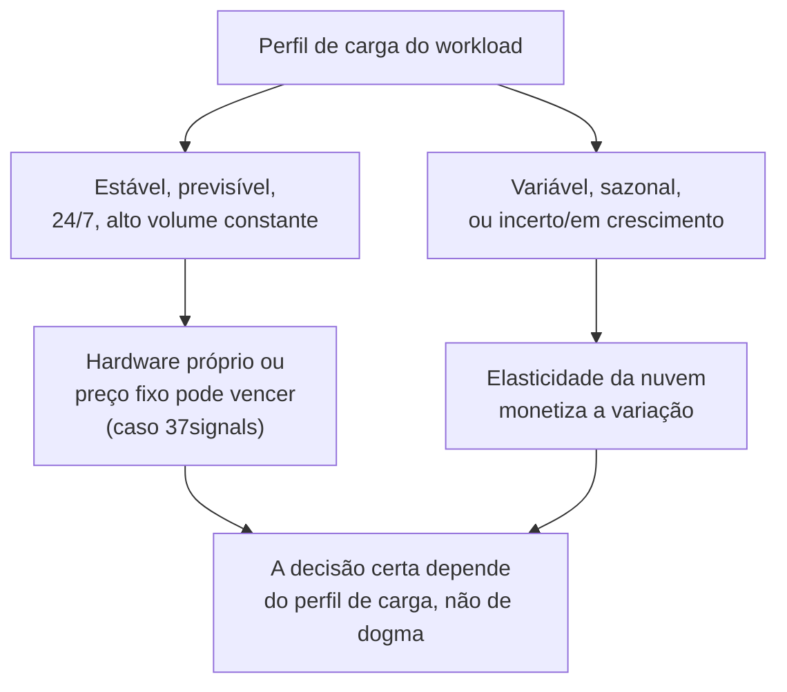

# Capex, opex e a economia da elasticidade

> [!abstract] TL;DR
> Comprar servidor é `capex` — um ativo que entra no balanço, deprecia em anos, e passa por comitê de orçamento anual antes de existir. Alugar capacidade de nuvem é `opex` — uma despesa operacional que passa por um cartão de crédito e uma chamada de API. Essa mudança de **quem aprova** é o motor real da velocidade que a nuvem entrega — mais até do que o preço por hora da máquina. Mas nuvem não é magicamente mais barata: o provedor compra hardware, energia e banda em escala que você nunca vai igualar, e ainda assim workloads estáveis e previsíveis 24/7 podem sair mais caros na nuvem do que em hardware próprio — a 37signals publicou números reais dessa conta. O efeito líquido é uma virada de mentalidade: na nuvem, custo deixa de ser item de planilha revisado uma vez por trimestre e vira **restrição de design**, tão presente numa decisão de arquitetura quanto latência ou disponibilidade.

## A reunião que não aconteceu

Imagine um time de engenharia de porte médio, ano corrente. O produto está crescendo, e alguém propõe adicionar uma camada de cache para tirar pressão do banco principal — uma instância de Redis, nada extravagante, algo na faixa de poucas dezenas de dólares por mês para começar.

No mundo pré-nuvem, mesmo essa decisão pequena tinha um caminho formal. Comprar um servidor dedicado para rodar cache era compra de ativo: entrava no orçamento de capital do trimestre, precisava de aprovação de alguém acima do tech lead — normalmente um diretor ou VP, às vezes um comitê —, e o ativo, uma vez comprado, ficava no balanço da empresa depreciando ao longo de três a cinco anos, existisse a necessidade dele ou não. Cancelar o projeto de cache depois de comprado o hardware não devolvia o dinheiro; o servidor virava um item de inventário ocioso, um problema de outra pessoa (o time de patrimônio, o financeiro, alguém que precisa decidir o que fazer com máquina parada).

Hoje, a mesma decisão passa pelo tech lead do time, sozinho, numa tarde. Ele sobe um Droplet gerenciado de Redis, ou um ElastiCache na AWS, testa a hipótese, e — se não funcionar como esperado — desliga no dia seguinte, tendo gasto o equivalente a um café. Ninguém do financeiro precisou aprovar nada, porque tecnicamente ninguém comprou um ativo: a empresa contraiu uma despesa operacional, do tipo que já existe em qualquer orçamento sob a rubrica "ferramentas e serviços" — a mesma categoria de uma assinatura de SaaS ou de uma conta de energia elétrica.

Aqui está o ponto que costuma passar despercebido: o que mudou não foi só o *preço*. Foi **quem tem autoridade para decidir**. Uma compra de capital, contabilmente, é chamada de `capex` (capital expenditure) — vira um ativo no balanço patrimonial, deprecia ao longo do tempo, e por regra de governança financeira normalmente exige aprovação de nível de diretoria, porque compromete capital da empresa por anos. Uma despesa operacional é `opex` (operating expenditure) — aparece na demonstração de resultado do mês em que ocorre, não vira ativo, e em geral cabe dentro do orçamento operacional que um gestor de time já controla. Transformar servidor em serviço não mudou só a forma de pagar — mudou o **nível hierárquico da aprovação necessária**, de "reunião de comitê trimestral" para "decisão de engenheiro sênior num cartão corporativo". É essa mudança de camada de decisão, mais do que qualquer desconto de volume, que destrava a velocidade de experimentação que a indústria associa à nuvem.

Vale registrar, para não simplificar demais: opex não é gratuito nem elimina a necessidade de controle. Uma empresa que deixa dezenas de times comprando recursos de nuvem livremente, sem nenhuma governança, descobre isso do jeito mais caro possível — na fatura do fim do mês. A disciplina que existia antes (aprovar antes de gastar) não desaparece; ela só muda de forma, de aprovação prévia obrigatória para monitoramento e alertas depois do fato. Esse é o assunto inteiro de **FinOps** — orçamentos, tags de custo, alertas, right-sizing, savings plans, análise de gasto por time — e fica de propósito fora desta nota; ele merece o **galho 19** completo desta trilha. Aqui, o ponto é só entender a lógica econômica por trás da mudança: por que opex é estruturalmente diferente de capex, não como otimizar o opex depois que ele já existe.

## O gráfico que qualquer engenheiro sênior já desenhou num quadro branco

Volte à Black Friday da nota anterior — 20 servidores comprados para um pico de um dia, 11 meses de ociosidade depois. Esse não é um caso isolado; é a forma geral de todo problema de capacidade sob demanda incerta, e vale desenhar o gráfico que explica por quê.

Imagine o eixo horizontal como tempo e o eixo vertical como capacidade necessária. A demanda real de um sistema quase nunca é uma linha reta — ela sobe e desce ao longo do dia, da semana, do mês, do ano, com picos previsíveis (Black Friday, horário comercial) e imprevisíveis (um post viral, uma falha em cascata que gera retry storm). Quando você compra hardware físico, você não compra uma curva — você compra um **degrau**: uma quantidade fixa de capacidade, definida uma vez, que fica constante até a próxima compra, meses ou anos depois.

O degrau na linha reta (80) é a capacidade que você comprou pensando no pico de sexta-feira. Repare nas duas áreas de desperdício que esse gráfico simples já revela:

- **Capacidade ociosa** — em todo dia que não é o pico (segunda a quinta, sábado e domingo), você está pagando por uma fatia de capacidade que não usa. É dinheiro parado, seja em prestação de financiamento de hardware, seja em depreciação contábil, seja simplesmente em energia e refrigeração de uma máquina ligada fazendo pouco.
- **Capacidade insuficiente** — se você errou a estimativa do pico para baixo (a barra de sexta ultrapassa a linha de 80), a consequência não é "só" desperdício financeiro — é perda de receita, usuários que não conseguem comprar, uma reputação manchada num dia que a empresa provavelmente não pode se dar ao luxo de errar.

O problema estrutural é que essas duas áreas de erro **empurram em direções opostas**, e você só escolhe uma vez, com meses de antecedência, sem saber a demanda real ainda. Subestimar é catastrófico (perde receita no pico); superestimar é caro mas tolerável (paga a mais o ano inteiro). A resposta racional, sob essa assimetria, é sempre superestimar — o que é exatamente o motivo pelo qual datacenters pré-nuvem rodavam, em média, a uma fração pequena da capacidade instalada. Não por incompetência de planejamento; por ser a decisão financeiramente mais segura diante de um lead time de compra medido em semanas.

A nuvem muda a forma do gráfico, não a existência da demanda variável:

A linha de capacidade agora acompanha a curva de demanda de perto, com uma margem pequena de segurança — porque o custo de errar para cima ficou baixo (você desliga o excesso em minutos) e o custo de corrigir um erro para baixo também ficou baixo (você sobe mais capacidade em minutos). As duas áreas de desperdício do primeiro gráfico praticamente somem, não porque a demanda ficou mais previsível, mas porque a **penalidade de errar a estimativa despencou**. Esse é o efeito, em forma de gráfico, do que a nota anterior descreveu como elasticidade rápida — só que agora conectado explicitamente a dinheiro, não só a tempo de provisionamento.

## Elasticidade não é sinônimo de escalabilidade

Aqui mora uma distinção que separa quem estudou cloud a sério de quem só decorou o vocabulário — e que aparece com frequência em entrevista técnica sênior, justamente porque é fácil confundir os dois termos.

**Escalabilidade** é a propriedade de um sistema conseguir crescer para atender mais carga — adicionando mais instâncias, mais nós, mais capacidade — sem reescrever a arquitetura do zero a cada novo patamar de tráfego. Um sistema escalável pode, em tese, atender dez vezes mais usuários amanhã do que atende hoje, desde que alguém aloque a capacidade extra.

**Elasticidade** é a propriedade adicional de essa capacidade **crescer e encolher automaticamente**, acompanhando a demanda real, sem intervenção manual em cada direção. Um sistema elástico não só aguenta o pico — ele devolve a capacidade sozinho quando o pico passa.

A confusão comum é achar que os dois sempre andam juntos. Não andam. Pense num sistema com 40 instâncias fixas, provisionadas manualmente para aguentar o pior pico do ano, e que nunca são desligadas — nem quando o tráfego cai para 10% da capacidade instalada às 3h da manhã. Esse sistema **é escalável** (ele aguenta o pico, tem capacidade de sobra) e **não é elástico** (a capacidade não acompanha a curva de demanda para baixo; alguém teria que desligar instâncias manualmente, e provavelmente ninguém faz isso porque dá trabalho e risco). É exatamente o cenário descrito na armadilha da nota anterior — "achar que nuvem é sinônimo de elástico automaticamente" — só que agora nomeado com precisão: rodar em cloud não torna um sistema elástico por padrão; torna-o *elasticamente capaz*, no sentido de que a infraestrutura subjacente permite configurar elasticidade real (Auto Scaling Groups na AWS, autoscaling de pools de Droplets ou de um cluster gerenciado na DigitalOcean), mas essa configuração é trabalho adicional, não um brinde.

O inverso também existe, embora seja mais raro: um sistema pode ter partes elásticas (a camada de compute escala para cima e para baixo sozinha) presas a um gargalo que não escala nem elasticamente nem de forma alguma — um banco de dados relacional único, sem réplicas, dimensionado para o pico e incapaz de crescer horizontalmente sem trabalho de engenharia significativo. Nesse caso, a elasticidade da camada de compute não compra escalabilidade de verdade para o sistema inteiro; o teto real é o do componente mais rígido.

> [!info] Fronteira
> Estratégias concretas de escalar (horizontal vs. vertical, sharding, réplicas de leitura, particionamento) pertencem ao domínio de arquitetura, não a este galho — veja [[03-Dominios/Engenharia/Arquitetura/index|Arquitetura / System Design]]. Aqui, o ponto é só a distinção conceitual entre "conseguir crescer" e "crescer e encolher sozinho, acompanhando a demanda".

## Por que a AWS compra mais barato que você — e por que isso não garante que ela sai mais barata

Existe uma razão estrutural, não apenas comercial, para a nuvem conseguir oferecer capacidade elástica a um preço que parece, à primeira vista, contraintuitivo: como é que alugar por hora pode competir com comprar uma vez?

A resposta é escala de compra. Um provedor como a AWS opera milhões de servidores fisicamente distribuídos em dezenas de regiões. Nessa escala, ela negocia preço de hardware com fabricantes de chip e servidor em volumes que nenhuma empresa individual, por maior que seja, vai igualar — e em muitos casos projeta e fabrica hardware próprio (é o caso dos processadores Graviton da AWS, projetados internamente para reduzir dependência e custo de fornecedores terceiros). Ela negocia contratos de energia de longo prazo, em escala industrial, incluindo geração renovável dedicada, com tarifas que uma empresa comum jamais acessaria diretamente. Ela constrói e opera a própria capacidade de rede de backbone entre datacenters e para a internet pública, em vez de comprar trânsito de terceiros no varejo. E ela amortiza tudo isso — hardware, energia, rede, o próprio custo de operar o datacenter (refrigeração, redundância, segurança física) — entre milhões de clientes, o que é exatamente o mecanismo de pooling de recursos descrito na nota anterior: o desperdício de capacidade ociosa de qualquer cliente individual é, na prática, socializado numa margem de segurança agregada muito menor, proporcionalmente, do que cada empresa manteria sozinha.

Isso é real e explica boa parte de por que a nuvem consegue ser competitiva. Mas não é a história completa, e um engenheiro sênior que só repete "a nuvem tem economia de escala, logo é mais barata" está simplificando demais uma conta que tem outro lado.

O outro lado é este: a AWS não repassa a economia de escala dela para o cliente de graça — ela cobra uma margem sobre isso, porque é uma empresa com investidores esperando lucro, não uma cooperativa de infraestrutura. Para um workload **estável e previsível**, rodando 24 horas por dia, 7 dias por semana, sem picos relevantes de demanda — o oposto exato do cenário de Black Friday que abriu esta trilha — a vantagem de elasticidade da nuvem simplesmente não se aplica, porque não existe pico nenhum para absorver de forma elástica. Nesse cenário, você está comparando o preço por hora que a AWS cobra (que já embute a margem dela, o custo de manter capacidade de sobra disponível para outros clientes elásticos, e o custo de todo o aparato de self-service e API que a nota anterior descreveu) contra o custo de comprar hardware equivalente uma vez e operá-lo você mesmo, amortizado ao longo de vários anos de uso constante. Para essa comparação específica — carga estável, sem elasticidade a monetizar —, hardware próprio ou um provedor de preço fixo pode, de fato, sair mais barato.

### O caso real: a 37signals saiu da nuvem e publicou os números

O exemplo mais citado e mais bem documentado desse debate é o da 37signals (empresa por trás do Basecamp e do serviço de e-mail HEY). Em outubro de 2022, a empresa anunciou publicamente que estava tirando suas principais aplicações da AWS e do Google Cloud para rodar em hardware próprio — um movimento que ficou conhecido no setor como "repatriação de nuvem" (*cloud repatriation*), o inverso do movimento de migração para a nuvem que dominou a década anterior.

Os números que a própria empresa publicou, em posts sucessivos no blog corporativo (`basecamp.com/cloud-exit`), contam a história com uma clareza rara: antes da saída, a 37signals gastava algo da ordem de **US$ 3,2 milhões por ano** em serviços de nuvem. Para migrar, a empresa investiu cerca de **US$ 600 mil em hardware Dell** próprio — um gasto de capital único, recuperado, segundo a própria empresa, dentro do primeiro ano de operação em hardware próprio, à medida que os compromissos contratuais de nuvem expiravam. A estimativa inicial de fevereiro de 2023 projetava algo em torno de **US$ 7 milhões de economia ao longo de cinco anos**; reportagens de outubro de 2024 (citando a própria empresa) atualizaram essa projeção para **cerca de US$ 10 milhões em cinco anos**, com a economia anual passando a girar perto de **US$ 2 milhões por ano** e a fatura remanescente de nuvem da empresa (que manteve alguns serviços específicos, como armazenamento de objetos em S3 para parte dos dados) caindo para cerca de US$ 1,3 milhão anuais.

> [!info] Caducidade
> Os números da 37signals (US$ 3,2M/ano antes, ~US$ 600 mil de hardware, US$ 7-10M projetados em 5 anos, ~US$ 2M/ano de economia recente) vêm de posts públicos da própria empresa e de reportagens de 2023-2024, verificados em 2026-07-20. São específicos do workload, da escala e das negociações contratuais **daquela empresa** — não são uma regra geral de "hardware próprio é X% mais barato". Não extrapole esses percentuais para qualquer outro contexto sem refazer a conta.

O que torna o caso da 37signals didaticamente valioso não é o valor exato economizado — é o **perfil de carga** que tornou a decisão racional. Basecamp e HEY são produtos maduros, com base de usuários estabelecida e padrão de tráfego relativamente estável ao longo do tempo — o oposto de uma startup em crescimento explosivo ou de um sistema com picos sazonais extremos tipo Black Friday. Para esse perfil específico — carga previsível, volume alto e constante, pouca variação a monetizar via elasticidade —, a conta pendeu para hardware próprio. David Heinemeier Hansson (DHH, cofundador e CTO da 37signals) argumentou publicamente, nos mesmos posts, que a "nuvem faz sentido quando sua carga é imprevisível ou está crescendo rápido — não quando ela já é grande e estável". É praticamente a definição inversa do cenário de MVP e do cenário de Black Friday explorados na nota anterior: lá, a incerteza e a variabilidade da demanda é que tornavam a nuvem vantajosa; aqui, a ausência de incerteza é que torna hardware próprio competitivo.

Vale registrar também o que o caso 37signals **não** prova: não prova que a nuvem "não vale a pena" em geral, nem que "repatriação é sempre a resposta certa". Prova que a economia da nuvem é uma função de **forma da curva de demanda**, não uma verdade universal — e que qualquer decisão de arquitetura de infraestrutura em escala precisa recalcular essa conta para o próprio perfil de carga, em vez de herdar a conclusão de outra empresa com um perfil diferente.

## A virada de mentalidade: custo como restrição de design

Junte as duas peças — a mudança de quem-aprova (capex→opex) e a mudança de forma-do-gráfico (degrau→curva elástica) — e chega-se à consequência que realmente importa para o dia a dia de quem projeta sistemas: na nuvem, **custo deixa de ser um item revisado no fechamento do trimestre e vira uma restrição de design**, presente em toda decisão de arquitetura, no mesmo nível que latência, disponibilidade ou consistência.

Antes da nuvem, a pergunta "quanto isso vai custar de infraestrutura?" era respondida uma vez, aproximadamente, no momento de dimensionar a compra de hardware — e depois disso, o custo estava essencialmente fixo, independente das decisões de arquitetura tomadas dali para frente (dentro da capacidade comprada, é claro). Na nuvem, cada decisão de arquitetura tem um custo marginal calculável, quase em tempo real: escolher entre um banco de dados gerenciado ou operar o próprio banco numa VM é uma decisão de custo mensurável. Escolher entre processar dados em lote uma vez por dia ou em streaming contínuo é uma decisão de custo. Escolher a topologia de rede entre serviços — se eles conversam dentro da mesma região ou atravessam regiões, se o tráfego sai para a internet pública ou fica dentro da rede privada do provedor — é uma decisão de custo, porque transferência de dados é, tipicamente, uma das dimensões cobradas separadamente.

Essa mudança tem uma implicação prática direta para quem projeta sistemas em nível sênior: arquitetura e FinOps deixam de ser disciplinas separadas, exercidas por pessoas diferentes em momentos diferentes (engenheiro desenha, financeiro audita a fatura no fim do mês), e passam a se sobrepor no momento do design. Um engenheiro sênior que propõe uma arquitetura sem nenhuma estimativa de custo associada está entregando um projeto incompleto — da mesma forma que entregaria um projeto incompleto se não tivesse pensado em disponibilidade. Isso não significa que toda decisão precisa de uma planilha detalhada antes de qualquer código ser escrito; significa que a pergunta "quanto isso custa, e como o custo se comporta se a demanda dobrar ou cair pela metade?" passa a fazer parte do vocabulário de design, ao lado de "isso escala?" e "isso é resiliente a falha?".

> [!info] Fronteira
> A prática operacional dessa virada de mentalidade — como estimar custo antes de construir, como monitorar gasto por serviço, como usar tags e orçamentos, como identificar right-sizing e capacidade reservada — é o corpo inteiro do **galho 19** desta trilha (FinOps). Esta nota entrega só a lógica: por que custo virou uma variável de design em primeiro lugar.

## Lente dupla: dois modelos de cobrança, dois jeitos de pensar sobre risco

A distinção entre "granular e difícil de prever" e "fixo e previsível" não é um detalhe de faturamento — é um trade-off de design que se manifesta de forma muito diferente entre os dois provedores desta trilha, e vale a pena sentir a diferença de perto.

A **AWS** cobra em dezenas de dimensões independentes, muitas vezes por segundo ou por requisição: compute (por segundo, desde 2017, com mínimo de 60 segundos), armazenamento (por GB-mês, mais operações de leitura/escrita cobradas separadamente), transferência de dados (que varia conforme sai para a internet, atravessa regiões, ou fica dentro da mesma zona), IPs elásticos ociosos, balanceadores de carga, e por aí adiante — um sistema de produção típico soma dezenas dessas linhas numa única fatura mensal. Essa granularidade é, ao mesmo tempo, o motivo pelo qual a AWS consegue cobrar de forma tão precisa pelo uso real (você paga pelo GB exato transferido, não por uma faixa arredondada) e o motivo pelo qual estimar a fatura de antemão é genuinamente difícil: uma estimativa de "compute custa X" facilmente vira uma fatura real bem maior quando se soma armazenamento, tráfego de rede, IP ocioso esquecido e um balanceador de carga que ninguém contabilizou na estimativa inicial.

A **DigitalOcean** faz a aposta oposta, deliberadamente: cada Droplet tem um preço mensal fixo, publicado, fácil de encontrar numa tabela — você sabe, antes de criar o recurso, exatamente quanto ele vai custar por mês se ficar ligado o mês inteiro. Historicamente, a cobrança era por hora, com um teto mensal (você nunca pagava mais do que o preço mensal anunciado, mesmo somando as horas); a partir de 1º de janeiro de 2026, a DigitalOcean passou a cobrar Droplets por segundo (mínimo de 60 segundos ou US$ 0,01, o que for maior), mantendo o mesmo teto mensal — ou seja, ganhou a granularidade fina que workloads curtos (jobs em lote, ambientes de teste) se beneficiam, sem abrir mão da previsibilidade do teto mensal fixo que sempre foi a proposta de valor da empresa.

> [!info] Caducidade
> O detalhe de "por segundo desde 1º de janeiro de 2026, com teto mensal" reflete a política de cobrança de Droplets vigente no momento em que esta nota foi escrita (2026-07-20). Confira a página de pricing oficial da DigitalOcean antes de basear qualquer decisão nesse detalhe — políticas de billing mudam.

O ponto didático aqui não é "um provedor é melhor que o outro" — é que **granularidade e previsibilidade são um trade-off genuíno, não um defeito de um dos dois lados**. A granularidade da AWS entrega precisão de cobrança (você paga exatamente pelo que consumiu, em cada dimensão separadamente) ao custo de previsibilidade (a fatura final é a soma de dezenas de variáveis, difícil de estimar sem ferramenta dedicada ou experiência acumulada). A simplicidade da DigitalOcean entrega previsibilidade (você sabe o teto antes de gastar um centavo) ao custo de granularidade (menos dimensões cobradas separadamente, menos controle fino sobre onde exatamente o dinheiro está indo dentro de um único recurso). Um time pequeno, sem tempo dedicado a observabilidade de custo, ganha mais com a previsibilidade do modelo DO. Uma operação grande, com um time de FinOps dedicado e ferramentas de análise de custo, consegue extrair vantagem real da granularidade da AWS — porque tem a capacidade de processar essa complexidade e converter em otimização fina. Nenhum dos dois modelos é "o certo"; cada um serve melhor a um perfil diferente de operação.

| Conceito | AWS | Azure | GCP | DigitalOcean |
|---|---|---|---|---|
| Granularidade de cobrança de compute | Por segundo, múltiplas dimensões cobradas separadamente (compute, storage, transferência, IP, LB...) | Por segundo/minuto, modelo de dimensões múltiplas semelhante à AWS | Por segundo, modelo de dimensões múltiplas semelhante à AWS | Por segundo (desde jan/2026) com teto mensal fixo por Droplet |
| Previsibilidade da fatura | Baixa sem ferramenta dedicada de FinOps | Baixa sem ferramenta dedicada de FinOps | Baixa sem ferramenta dedicada de FinOps | Alta — preço mensal publicado, teto garantido |

> [!info] Caducidade
> Modelos de cobrança de Azure e GCP resumidos aqui só como tradução de vocabulário — ambos seguem, em linhas gerais, a mesma lógica de múltiplas dimensões da AWS. Não use esta tabela como referência de pricing; confira a documentação oficial de cada provedor.

## Casos práticos

**A migração que a área financeira aprovou em uma tarde.** Um time de plataforma quer trocar o banco relacional autogerenciado, rodando numa VM cuidada manualmente havia anos, por um serviço de banco gerenciado do provedor de nuvem. No modelo antigo de capex, essa troca seria irrelevante para orçamento (o hardware já existe, já foi comprado, já deprecia sozinho) — mas trocar de fornecedor de hardware físico, se fosse o caso, ainda exigiria negociação, contrato, e aprovação de compra. No modelo opex, a decisão inteira se resume a comparar duas linhas de custo mensal recorrente — o custo atual de operar a VM (incluindo o tempo de engenheiro gasto em backup manual, patch, monitoramento) contra o custo do serviço gerenciado (que embute esse trabalho operacional no preço) — e submeter essa comparação, já em formato de opex mensal, para aprovação de um gestor de nível médio, não de um comitê de capital. A decisão que antes exigiria trâmite de meses de compra de hardware vira uma reunião de uma tarde com uma planilha de duas colunas.

**O job de fim de mês que só existe 40 horas por ano.** Uma fintech precisa rodar um processo de fechamento contábil pesado, uma vez por mês, por cerca de 40 horas corridas — um workload claramente elástico, não estável. Rodar esse processo em hardware próprio dedicado significaria manter capacidade cara ligada o ano inteiro para uso de menos de 5% do tempo — o oposto exato do perfil de carga que tornou a repatriação da 37signals racional. Aqui, a conta pende fortemente para a nuvem: a elasticidade paga por si mesma, porque o custo do restante do mês (quando a capacidade está desligada) é zero, não uma fração ociosa de um ativo já comprado.

**A auditoria de custo que virou requisito de design.** Um time de arquitetura, ao desenhar um novo serviço, passa a incluir, no mesmo documento de design que descreve componentes e fluxos de dados, uma seção de estimativa de custo mensal projetado — calculada antes de qualquer linha de código, com base no volume esperado de requisições, armazenamento e transferência de dados. Numa revisão de design, um custo estimado muito acima do esperado para o valor de negócio entregue vira motivo legítimo de retrabalho na arquitetura, do mesmo jeito que um gargalo de performance ou uma falha de disponibilidade seria. É a virada de mentalidade descrita acima, aplicada em processo real de engenharia — custo como requisito não-funcional, revisado no design, não descoberto na fatura.

## Armadilhas comuns

> [!warning] Tratar "a nuvem é mais barata" como verdade universal
> A vantagem de custo da nuvem vem, majoritariamente, de monetizar elasticidade — capacidade que sobe e desce com a demanda real. Para um workload estável, alto e constante, essa vantagem simplesmente não existe, e comparar preço por hora da nuvem contra hardware amortizado, sem levar em conta o perfil de carga, é comparar a coisa errada. O caso da 37signals é a prova documentada dessa exceção — não é dogma anti-nuvem, é matemática de perfil de carga.

> [!warning] Esquecer que capex também tem custo de oportunidade
> É fácil olhar só para o preço por hora da nuvem contra o preço de compra do hardware e concluir que hardware é "mais barato". Isso ignora o capital imobilizado (dinheiro que poderia estar em outro lugar do negócio), o custo de operar o próprio datacenter (energia, refrigeração, redundância, pessoal especializado), e o custo de oportunidade do tempo de lead time perdido enquanto o hardware não chega. A comparação honesta é custo total de propriedade (TCO) de um lado contra o outro — não só preço de tag.

> [!warning] Confundir "elástico" com "escalável" na entrevista
> Um erro comum sob pressão de entrevista técnica é usar os dois termos como sinônimos. Um sistema pode escalar (aguentar mais carga com mais capacidade alocada) sem ser elástico (a capacidade não recua sozinha quando a carga cai). Nomear a diferença com precisão — e citar Auto Scaling como o mecanismo que converte "capaz de ser elástico" em "elástico de fato" — é o tipo de detalhe que separa uma resposta de nível pleno de uma resposta de nível sênior.

## O que vem a seguir

Esta nota estabeleceu a lógica econômica: por que opex muda quem decide, por que elasticidade muda a forma do gráfico de capacidade, e por que custo virou restrição de design em vez de item de planilha trimestral. Mas ainda falta responder a uma pergunta prática que decorre diretamente disso: se você paga pelo que usa, e cada decisão de arquitetura tem um custo mensurável, **quanto da pilha de infraestrutura você realmente quer gerenciar você mesmo?** Rodar a própria VM dá controle total e responsabilidade total; usar um serviço totalmente gerenciado dá menos controle e menos trabalho operacional — e cada camada intermediária tem seu próprio perfil de custo e de responsabilidade. É exatamente esse espectro — infraestrutura crua, plataforma, funções sob demanda, software pronto — que a próxima nota, **"Modelos de serviço — IaaS, PaaS, CaaS, FaaS e SaaS"**, mapeia em detalhe.

## Fontes

- [37signals — Leaving the Cloud (página oficial de acompanhamento do cloud exit)](https://basecamp.com/cloud-exit) — números de gasto anterior (~US$ 3,2M/ano em nuvem), investimento em hardware (~US$ 600 mil), e projeções de economia (US$ 7M → US$ 10M em cinco anos); acessado em 2026-07-20.
- [DataCenterDynamics — 37signals claims it saved almost $2m last year from cloud repatriation](https://www.datacenterdynamics.com/en/news/37signals-claims-it-saved-almost-2m-last-year-from-cloud-repatriation/) — atualização de 2024 com economia anual recente e fatura remanescente de nuvem (~US$ 1,3M/ano); acessado em 2026-07-20.
- [The Register — Developer pockets $2M in savings from going cloud-free](https://www.theregister.com/2024/10/21/37signals_aws_savings/) — cobertura independente confirmando os números atualizados de 2024; acessado em 2026-07-20.
- [Slashdot — Basecamp-Maker 37Signals Says Its 'Cloud Exit' Will Save It $10 Million Over 5 Years](https://news.slashdot.org/story/24/10/21/2316217/basecamp-maker-37signals-says-its-cloud-exit-will-save-it-10-million-over-5-years) — projeção revisada de 5 anos; acessado em 2026-07-20.
- [AWS — Announcing Amazon EC2 per second billing](https://aws.amazon.com/about-aws/whats-new/2017/10/announcing-amazon-ec2-per-second-billing) — anúncio oficial da cobrança por segundo do EC2, com mínimo de 60 segundos, desde outubro de 2017; acessado em 2026-07-20.
- [DigitalOcean — Droplet Pricing (página oficial)](https://www.digitalocean.com/pricing/droplets) — modelo de cobrança por segundo com teto mensal, vigente desde 1º de janeiro de 2026; acessado em 2026-07-20.
- [DigitalOcean — AWS vs DigitalOcean: Which cloud platform is the best fit for you?](https://www.digitalocean.com/blog/aws-vs-digitalocean-cloud-platform) — posicionamento oficial da DigitalOcean sobre simplicidade e previsibilidade de preço frente à amplitude da AWS; acessado em 2026-07-20.
