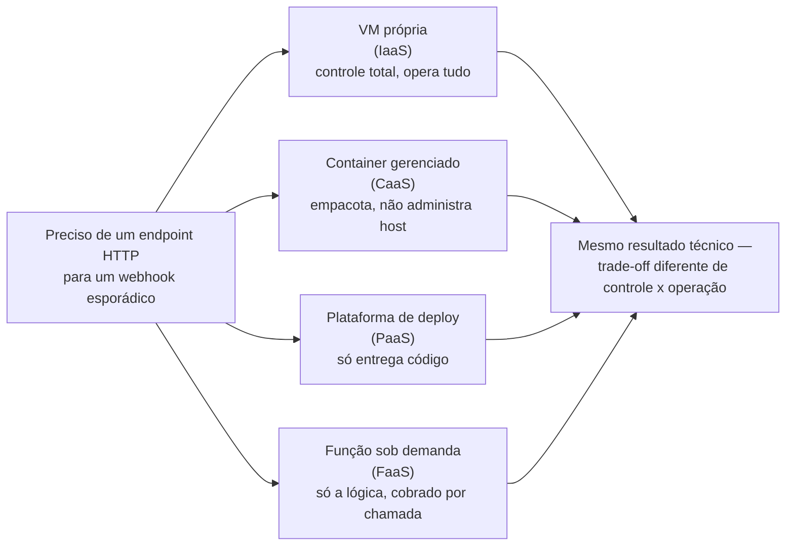
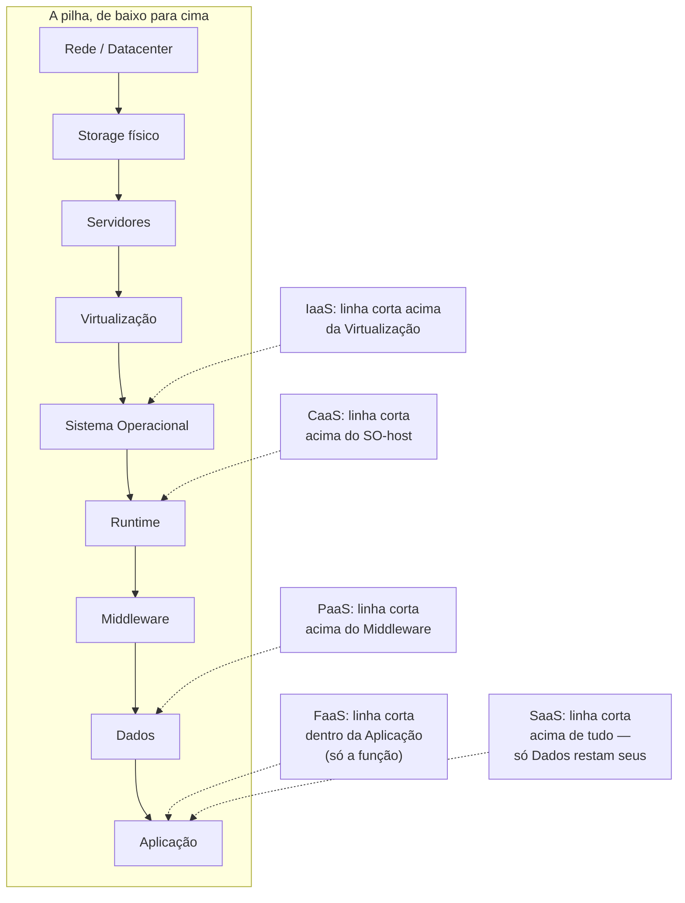
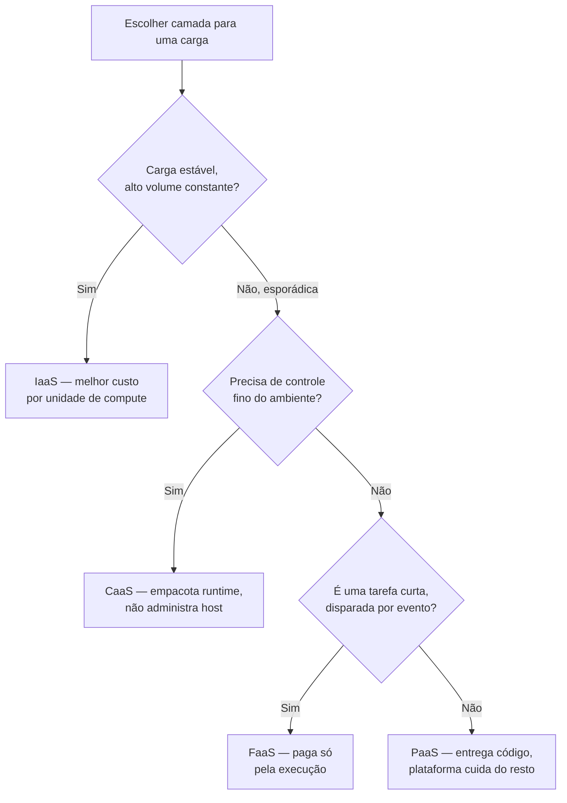

# Modelos de serviço — IaaS, PaaS, CaaS, FaaS e SaaS

> [!abstract] TL;DR
> Toda decisão de "onde rodar isso" é, na verdade, uma decisão de **quanto da pilha você quer operar**. IaaS te dá a máquina crua — você cuida do sistema operacional para cima. CaaS te dá um ambiente que só executa containers — você empacota o runtime, o provedor cuida do host. PaaS te dá até o runtime e o middleware prontos — você só entrega código. FaaS vai além: nem processo de longa duração existe, só função disparada por evento, cobrada por execução. SaaS não é nem sua aplicação — é a de outra empresa, e você só a usa. Não é uma escada de "mais moderno" — é um espectro de trade-off entre controle e conveniência, e a camada certa depende do formato da carga, não de qual é "a mais avançada". O custo real de cada camada não aparece só na fatura: aparece em horas de engenheiro gastas operando o que a camada de baixo não operou por você.

## A decisão que ninguém documenta

Um time de plataforma recebe um pedido simples: "precisamos de um endpoint HTTP que recebe um webhook de um parceiro de pagamento, valida a assinatura, grava um evento e devolve `200`". Chega uns 200 vezes por dia, em rajadas imprevisíveis — às vezes silêncio por horas, às vezes uma dezena em um minuto, sem padrão fixo.

A primeira reação de alguém que só conhece VM é a óbvia: sobe um Droplet ou uma instância EC2, instala runtime, escreve o serviço, configura HTTPS, coloca atrás de um load balancer, escreve um script de deploy, configura monitoramento, decide como fazer patch de segurança do sistema operacional, e — porque o tráfego é imprevisível e às vezes zero por horas — paga por uma máquina ligada 24 horas por dia para atender picos que somam, no total, poucos minutos de trabalho real por dia.

Só que essa não é a única forma de resolver o problema — é só a mais familiar para quem vem de um mundo onde "computação" sempre significou "uma máquina que eu ligo e administro". A mesma tarefa poderia rodar como uma função sob demanda, cobrada por invocação, sem servidor nenhum para o time gerenciar entre uma chamada e outra. Ou como um container atrás de um serviço gerenciado, que escala de zero a N conforme a fila de requisições cresce. Ou embutida direto numa plataforma que já sabe fazer deploy de código a partir de um repositório Git, sem o time nunca ver uma linha de configuração de servidor.

Cada uma dessas opções resolve o mesmo problema técnico. Nenhuma delas é "errada". A diferença entre elas não está em *se* o webhook funciona — está em **quanto trabalho de operação o time assume**, e em troca de quanto controle. É essa troca — não uma escada de sofisticação, mas um espectro genuíno de trade-off — que esta nota mapeia.

## O espectro controle ↔ conveniência

A definição formal desse espectro vem do mesmo documento que fundou a nota 01 desta trilha — a [[03-Dominios/Tecnologia/Cloud/01 - O que é a nuvem, de verdade/01 - O que é computação em nuvem|SP 800-145 do NIST]]. Além das cinco características essenciais, o documento define três "modelos de serviço" — SaaS, PaaS e IaaS — como as três formas canônicas de consumir nuvem. O texto original é preciso sobre onde cada linha de responsabilidade cai:

- **IaaS**: "a capacidade oferecida ao consumidor é provisionar processamento, armazenamento, redes e outros recursos computacionais fundamentais, onde o consumidor é capaz de implantar e rodar software arbitrário" — o consumidor "não gerencia nem controla a infraestrutura de nuvem subjacente, mas tem controle sobre sistemas operacionais, armazenamento e aplicações implantadas".
- **PaaS**: "a capacidade oferecida ao consumidor é implantar, na infraestrutura de nuvem, aplicações criadas ou adquiridas pelo consumidor, usando linguagens de programação e ferramentas suportadas pelo provedor" — o consumidor "não gerencia nem controla a infraestrutura subjacente (...) mas tem controle sobre as aplicações implantadas".
- **SaaS**: "a capacidade oferecida ao consumidor é usar as aplicações do provedor rodando numa infraestrutura de nuvem" — o consumidor "não gerencia nem controla a infraestrutura subjacente (...) nem mesmo as capacidades individuais da aplicação, com a possível exceção de configurações limitadas específicas do usuário".

Repare no padrão: cada modelo é definido por **onde a linha de "o consumidor não gerencia nem controla" começa a subir**. Em IaaS, a linha para logo acima do hardware — você ainda cuida do sistema operacional para cima. Em PaaS, a linha sobe até engolir o sistema operacional e o middleware — você só cuida da aplicação. Em SaaS, a linha engole a aplicação inteira — você só cuida de como a *usa*.

O NIST escreveu isso em 2011, quando containers em produção mal existiam e "função sem servidor" não era vocabulário do mercado — por isso o documento original só nomeia três camadas. A indústria, nos anos seguintes, encaixou mais dois degraus nesse espectro: **CaaS** (Container as a Service), entre IaaS e PaaS — você empacota o runtime da sua aplicação num container, mas não administra o servidor que o executa; e **FaaS** (Function as a Service), depois de PaaS — você nem entrega uma aplicação de longa duração, entrega uma função que roda só quando um evento a dispara. Nenhum desses dois é uma invenção de marketing sem lastro técnico: cada um resolve uma forma diferente e legítima de organizar responsabilidade, e cada um tem uma linha de "onde a sua responsabilidade começa" bem definida — mesmo que a indústria não concorde 100% sobre o nome exato da fronteira, como esta nota vai discutir mais adiante.

> [!info] Fronteira
> Esta nota não entra em capex/opex nem no cálculo de quando a elasticidade compensa financeiramente — isso é o corpo da **nota 02**. Aqui, o eixo é outro: dado que você já decidiu rodar na nuvem, quanto da pilha técnica você quer operar você mesmo.

## Quem gerencia o quê

A forma mais direta de ver o espectro é olhar, camada por camada da pilha de infraestrutura, onde a responsabilidade muda de mãos. A tabela a seguir usa nove camadas — da rede física até a aplicação — através de seis pontos do espectro, do "você compra e administra tudo" (on-premises) até "você só usa, sem administrar nada" (SaaS).

| Camada da pilha | On-premises | IaaS | CaaS | PaaS | FaaS | SaaS |
|---|---|---|---|---|---|---|
| Rede física / datacenter | **Você** | Provedor | Provedor | Provedor | Provedor | Provedor |
| Armazenamento físico | **Você** | Provedor | Provedor | Provedor | Provedor | Provedor |
| Servidores (hardware) | **Você** | Provedor | Provedor | Provedor | Provedor | Provedor |
| Virtualização (hypervisor) | **Você** | Provedor | Provedor | Provedor | Provedor | Provedor |
| Sistema operacional | **Você** | **Você** | Provedor* | Provedor | Provedor | Provedor |
| Runtime (linguagem/VM) | **Você** | **Você** | **Você** (na imagem) | Provedor | Provedor | Provedor |
| Middleware / orquestração | **Você** | **Você** | **Você** (parcial) | Provedor | Provedor | Provedor |
| Dados da aplicação | **Você** | **Você** | **Você** | **Você** | **Você** | **Você**† |
| Código / lógica da aplicação | **Você** | **Você** | **Você** | **Você** | **Você** | Provedor |

\* Em CaaS totalmente gerenciado (Fargate, App Platform), o provedor cuida do SO-host; você não escolhe nem faz patch dele — mas ainda escolhe a imagem-base *dentro* do container, o que é uma forma diferente (e mais estreita) de controle sobre o SO do que ter uma VM inteira.
† Em SaaS, os dados que *você* insere no aplicativo continuam sendo seus (e sua responsabilidade de proteger, no sentido de quem tem acesso) — mas você não controla como o provedor os processa, armazena ou estrutura internamente.

O padrão que a tabela revela é o mesmo em toda linha: **cada camada nova empurra a fronteira "provedor cuida disso" um degrau para cima**, e o que sobra abaixo da linha some do seu radar operacional — não porque deixou de existir, mas porque virou problema de outra pessoa, com um contrato (SLA) atrás dele em vez de um plantão seu.

## A analogia: como o jantar chega à sua mesa

A comparação mais usada nesse assunto é a "pizza as a service" — cunhada em 2014 por Albert Barron, arquiteto da IBM, num post que virou referência do setor. Ela é boa o suficiente para ter sobrevivido dez anos, mas cobre só quatro degraus (on-premises, IaaS, PaaS, SaaS) e deixa CaaS e FaaS de fora — exatamente as duas camadas mais relevantes para quem trabalha com containers e serverless hoje. Então vale esticar a mesma ideia — comida chegando à sua mesa — para os seis degraus completos, e ver onde ela aguenta o esticão e onde ela quebra.

**On-premises — você planta, colhe e cozinha.** Você compra a terra, planta os vegetais, cria o gado, constrói a cozinha, compra o fogão, e prepara a refeição do zero. Controle absoluto sobre cada etapa; responsabilidade absoluta também — se a colheita falhar, a culpa (e o conserto) são seus.

**IaaS — você aluga uma cozinha industrial equipada.** A cozinha já tem parede, encanamento de gás, fogão industrial, exaustor, pia — tudo instalado e mantido por quem administra o espaço. Mas você ainda traz os ingredientes, escolhe a receita, cozinha, lava a louça e decide o cardápio do dia. Se o prato sair salgado, a culpa é sua — a cozinha só te deu o ambiente. É o Droplet ou a instância EC2: o provedor cuida do hardware e da virtualização; você cuida de tudo que roda dentro da máquina, do sistema operacional para cima.

**CaaS — você usa um kit de refeição padronizado.** A empresa do kit te entrega ingredientes pré-porcionados e um passo a passo exato — o "container": tudo que precisa para o prato sair igual, não importa em qual fogão ele seja preparado. Você não escolhe o fogão (o host que vai executar), nem cuida da manutenção dele — só garante que o kit (a imagem do container) está correto e completo. O provedor garante que existe sempre um fogão disponível, funcionando, pronto para receber o próximo kit.

**PaaS — você contrata um chef particular.** Você entrega a receita (seu código) e as preferências alimentares (configuração, variáveis de ambiente) para um chef que providencia a cozinha, compra os ingredientes, cozinha, serve e lava a louça — e, se a festa crescer de repente, chama mais ajudantes sozinho, sem que você precise telefonar para ninguém. Você nunca vê a cozinha. Só entrega a receita e recebe o prato pronto.

**FaaS — você pede um prato específico por aplicativo de entrega, sob demanda.** Não existe reserva, não existe "sua mesa" persistente entre um pedido e outro. Você abre o aplicativo, pede exatamente um prato, paga só por aquele pedido, e o prato aparece minutos depois — preparado especificamente para essa ocasião, por uma cozinha que você nunca vê e da qual você não sabe nada além de que ela existe em algum lugar da cidade, pronta para preparar seu pedido a qualquer hora.

**SaaS — você janta num restaurante com cardápio fixo.** Você não escolhe o fornecedor dos ingredientes, não vê a cozinha, não escolhe o chef — só senta à mesa e escolhe entre as opções que já existem no cardápio. Quer um prato que não está lá? Não dá. É pegar o que foi construído, exatamente como foi construído.

Onde a analogia quebra, e vale nomear com honestidade: comida não tem *concorrência* — ninguém pede o mesmo prato mil vezes por segundo automaticamente disparado por um evento, e é exatamente isso que FaaS faz na prática (um evento dispara N execuções paralelas da mesma função, sem fila humana esperando a vez). Comida também não tem "cold start" — o conceito de uma função que precisa "esquentar" antes de responder à primeira chamada de um período (o runtime sobe, dependências carregam) não tem equivalente natural em pedir comida. E, mais fundamental: nenhuma camada de comida cobra por *milissegundo* de preparo — FaaS, sim. A analogia serve para o eixo controle-versus-conveniência; ela não serve para explicar concorrência, latência ou o modelo de cobrança fino que separa FaaS das camadas anteriores. Guarde a analogia para a intuição de "quem cozinha o quê" — não para raciocinar sobre performance.

> [!info] Fronteira
> Cold start, concorrência, limites de execução, triggers e o funcionamento interno de funções sob demanda são o assunto do **galho 11** desta trilha. Aqui, FaaS aparece só como um degrau do espectro — a mecânica fica para lá.

## Cada camada, na lente dupla

Vale ver cada degrau encarnado nos dois provedores desta trilha, porque os nomes comerciais são o vocabulário que qualquer entrevista técnica ou qualquer discussão de arquitetura vai assumir que você conhece.

**IaaS — a máquina crua.** Em AWS, isso é o **EC2**: você escolhe tipo de instância e imagem, e recebe uma VM onde o sistema operacional para cima é seu. Em DigitalOcean, é o **Droplet** — mesmo modelo mental, catálogo mais simples. Os dois já apareceram em detalhe na nota 01; aqui eles são só o ponto de partida do espectro. Quem cuida de patch de SO, runtime, configuração de firewall no nível do sistema, monitoramento de processo, é você — o provedor garante que a VM existe e que o hypervisor por baixo dela funciona.

**CaaS — o ambiente que só roda containers.** Em AWS, o par canônico é **Amazon ECS rodando no modo Fargate** — você empacota sua aplicação num container, especifica CPU e memória, e a AWS aloca a capacidade de execução sem que você jamais veja ou administre um servidor, um cluster de VMs, ou decida quando fazer scale de infraestrutura. (Vale notar que o próprio ECS também tem um modo "EC2 launch type", onde você administra o cluster de VMs por baixo — nesse modo, ECS te devolve pro território de IaaS+orquestração; é Fargate especificamente que entrega a experiência CaaS pura.) Em DigitalOcean, o equivalente depende do quanto de orquestração Kubernetes você quer expor: o **App Platform** roda containers (a partir de uma imagem ou de um Dockerfile) sem você jamais ver um nó de Kubernetes; já o **DOKS** (DigitalOcean Kubernetes) te entrega um cluster gerenciado onde o **control plane** — a parte que decide onde cada container roda, monitora saúde, agenda workloads — é mantido pela DigitalOcean, mas os **worker nodes** (as máquinas que efetivamente executam seus containers) ainda são recursos seus para dimensionar e (em parte) operar.

**PaaS — a plataforma que faz deploy do seu código.** Em AWS, é o **Elastic Beanstalk**: você envia o código-fonte (Java, .NET, PHP, Node.js, Python, Ruby, Go, ou um container Docker) e o Beanstalk provisiona as instâncias EC2, configura balanceamento de carga, escala automaticamente e monitora a saúde da aplicação — mas o recurso final ainda é seu, visível e ajustável no console, se você precisar. Em DigitalOcean, é o próprio **App Platform** de novo — o mesmo produto que serve como exemplo de CaaS também se qualifica, oficialmente, como PaaS na própria documentação da DigitalOcean, e é exatamente essa dupla identidade que a seção seguinte, sobre fronteiras borradas, vai desenrolar.

**FaaS — a função sem servidor.** Em AWS, é o **Lambda**: você escreve uma função, define o evento que a dispara (uma requisição HTTP, uma mensagem numa fila, um arquivo novo num bucket), e paga só pelo tempo de execução real — zero custo quando a função não está rodando. Em DigitalOcean, é o **DigitalOcean Functions**: mesmo modelo — código que roda sob demanda, sem servidor para gerenciar, com suporte a linguagens como Node.js, Python e Go.

**SaaS — o software que você não opera.** Aqui a lente dupla AWS/DigitalOcean não se aplica da mesma forma, porque SaaS não é um serviço que *você*, como engenheiro, provisiona dentro de uma conta de nuvem — é uma aplicação de terceiros que você (ou sua empresa) simplesmente usa. Exemplos de mercado: um CRM como Salesforce, uma ferramenta de gestão de projetos como o próprio Todoist ou Jira, um serviço de e-mail transacional como o SendGrid, um provedor de autenticação gerenciado como o Auth0. A AWS e a DigitalOcean também vendem alguns produtos que se encaixam na definição — um serviço de e-mail transacional gerenciado, por exemplo, tem um pé em SaaS — mas o grosso do catálogo dos dois provedores desta trilha está em IaaS, CaaS, PaaS e FaaS; SaaS, propriamente dito, é majoritariamente terreno de outras empresas.

> [!info] Caducidade
> Nomes de produto, modelos de suporte a linguagem e a forma exata de cobrança verificados em 2026-07-20. Confira a documentação oficial de cada serviço antes de decidir — nomes e ofertas mudam com frequência, principalmente em CaaS e FaaS, áreas onde os provedores lançam produtos novos com regularidade.

## Onde a régua borra: rótulo importa menos que a linha de responsabilidade

Chegado até aqui, vale confessar uma coisa que a tabela anterior escondeu por simplicidade: a fronteira entre essas camadas **não é tão limpa na prática quanto no papel**, e discutir isso não é pedantismo — é entender de verdade o que cada produto entrega.

**O App Platform da DigitalOcean é PaaS ou CaaS?** A própria documentação da DigitalOcean o descreve como "uma Platform-as-a-Service totalmente gerenciada" — mas, tecnicamente, o mecanismo por baixo empacota sua aplicação num container antes de rodá-la, e ele aceita tanto um repositório Git (você não vê container nenhum, é PaaS de manual) quanto uma imagem de container já pronta (você trouxe o container, é CaaS de manual). O produto é os dois, dependendo de como você o usa — a linha entre "eu entrego código-fonte" e "eu entrego um container" é uma escolha sua dentro do mesmo serviço, não uma característica fixa do produto.

**O Fargate é IaaS ou CaaS?** Tecnicamente ele roda em cima de instâncias EC2 geridas pela própria AWS — então, num sentido estrito, ele é "IaaS que a AWS opera para você, exposto como uma API de containers". Mas do ponto de vista de quem usa: você nunca escolhe um tipo de instância, nunca faz patch de SO, nunca decide quando fazer scale de servidor — a experiência inteira é "eu descrevo um container, ele roda". Isso é, na prática, exatamente o que CaaS promete entregar, mesmo que a implementação por baixo seja tecnicamente uma camada de IaaS que a AWS abstraiu de você.

O padrão nos dois casos é o mesmo: **a fronteira entre camadas é uma linha que a indústria desenha por convenção de marketing e didática, não uma lei física**. Um produto pode estar a cavalo entre duas camadas, ou mudar de categoria dependendo de como você o configura. Isso não é um defeito da taxonomia — é evidência de que a taxonomia é uma simplificação útil de uma realidade mais contínua. O que importa numa decisão de arquitetura real, ou numa entrevista técnica, não é conseguir rotular "isso é PaaS ou CaaS?" com 100% de certeza — é conseguir responder, para qualquer serviço específico, **a pergunta que a tabela "quem gerencia o quê" faz**: onde exatamente a sua responsabilidade começa, e onde ela termina. Um candidato sênior que hesita no rótulo mas sabe apontar a linha de responsabilidade está numa posição melhor do que um que decora rótulos sem entender a linha.

## Como escolher a camada

Não existe "a camada certa" de forma abstrata — existe a camada certa para uma carga de trabalho, um time e um momento específicos. Um framework simples de seis perguntas ajuda a decidir:

1. **Previsibilidade da carga.** Tráfego constante, alto volume, sem picos relevantes? Uma camada mais baixa (IaaS, ou até hardware dedicado, como a nota 02 discutiu com o caso da 37signals) tende a ter melhor custo por unidade de compute. Tráfego esporádico, imprevisível, ou com picos raros e curtos? FaaS ou CaaS com autoscaling agressivo evita pagar por capacidade ociosa.
2. **Necessidade de controle do ambiente.** Precisa de uma versão específica de kernel, de uma biblioteca de sistema pouco comum, de acesso root, de um daemon rodando em background junto da aplicação? Isso empurra para baixo no espectro — IaaS ou, no máximo, CaaS. Camadas mais altas abrem mão desse controle deliberadamente.
3. **Maturidade do time.** Um time pequeno, sem especialista em operação de infraestrutura, paga um preço real (em tempo, em incidentes, em rotatividade de plantão) por operar uma camada baixa. Camadas mais altas (PaaS, FaaS) tercerizam exatamente o trabalho que esse time não tem capacidade — nem deveria ter, necessariamente — de fazer bem.
4. **Custo operacional — não só a fatura.** A pergunta certa nunca é só "quanto custa por hora de compute". É "quanto custa por hora de compute, mais quantas horas de engenheiro por mês essa camada exige para continuar rodando com segurança". Uma VM barata que exige um engenheiro sênior dedicado a mantê-la em dia com patch de segurança pode ser, na conta completa, mais cara que uma camada gerenciada com preço por hora mais alto.
5. **Velocidade de entrega.** Quanto mais alta a camada, menos decisões de infraestrutura o time precisa tomar antes de entregar a primeira versão. Isso é vantagem real em fase de validação de produto — e desvantagem real quando o produto já provou que precisa de otimização fina que a camada alta não permite.
6. **Portabilidade.** Camadas mais baixas (uma VM rodando um binário próprio, um container padrão OCI) são mais fáceis de mover entre provedores. Camadas mais altas, principalmente FaaS e PaaS proprietários, tendem a acoplar seu código a APIs e convenções específicas do provedor — migrar um sistema inteiro de Lambda para outra nuvem é trabalho de reescrita, não de troca de configuração.

Nenhuma dessas seis perguntas, sozinha, decide a camada. Um sistema real, com múltiplos componentes, frequentemente mistura camadas — um monólito principal em CaaS, um job de processamento assíncrono em FaaS, um banco de dados como serviço totalmente gerenciado (que é, ele mesmo, uma forma de PaaS restrita a um único produto). A decisão sênior não é "qual camada escolher para a empresa inteira" — é qual camada escolher **para cada carga de trabalho específica**, com essas seis perguntas respondidas para ela.

| Conceito | AWS | Azure | GCP | DigitalOcean |
|---|---|---|---|---|
| IaaS (máquina virtual) | EC2 | Virtual Machines | Compute Engine | Droplet |
| CaaS (containers gerenciados) | ECS com Fargate | Azure Container Apps / AKS | Cloud Run / GKE | App Platform (via container) / DOKS |
| PaaS (deploy de código) | Elastic Beanstalk | App Service | App Engine | App Platform (via Git) |
| FaaS (função sob demanda) | Lambda | Azure Functions | Cloud Functions / Cloud Run functions | DigitalOcean Functions |
| SaaS | — (majoritariamente terceiros) | — (majoritariamente terceiros) | — (majoritariamente terceiros) | — (majoritariamente terceiros) |

> [!info] Caducidade
> Nomes de produto verificados em 2026-07-20 — em especial CaaS e FaaS de Azure e GCP, áreas onde os provedores reorganizam e renomeiam produtos com frequência (o Cloud Functions da GCP, por exemplo, já convive com o Cloud Run como opção de execução orientada a evento). Confira a documentação oficial antes de usar esta tabela como referência de nome atual.

## O custo escondido de cada camada

A nota 02 desta trilha estabeleceu que custo, na nuvem, virou uma restrição de design — presente em toda decisão de arquitetura, não só revisada uma vez no fechamento do trimestre. O espectro de camadas de serviço é onde essa restrição fica mais visível, porque existe uma relação quase mecânica entre "quanto o provedor faz por você" e "quanto isso custa por unidade de compute":

Uma VM crua (IaaS) é, tipicamente, a opção mais barata por hora de CPU — você está pagando, essencialmente, só pelo hardware virtualizado. Um serviço FaaS, por invocação, costuma custar mais por segundo de CPU efetivamente usado do que a mesma CPU rodando numa VM ligada o tempo todo — porque parte do preço embute o trabalho que o provedor faz para você (provisionar o ambiente de execução em milissegundos, isolar sua função de todas as outras que compartilham a mesma infraestrutura, escalar de zero a milhares de execuções simultâneas sem que você configure nada disso).

Só que essa comparação — preço por unidade de compute — é exatamente a comparação errada de se fazer sozinha, pelo mesmo motivo que a nota 02 já havia estabelecido: ela ignora o custo do lado humano. Uma VM que fica ociosa a maior parte do tempo (o cenário do webhook do início desta nota) paga o preço barato por hora, mas paga esse preço **24 horas por dia**, e ainda exige alguém para fazer patch de segurança, configurar TLS, monitorar disco cheio, reiniciar processo travado — trabalho de engenheiro que tem custo real, mesmo que não apareça na mesma linha da fatura de nuvem. Uma função FaaS para o mesmo webhook custa mais por segundo de execução, mas só é cobrada nos segundos em que de fato executa — e elimina inteiramente o trabalho de administrar sistema operacional, patch e capacidade ociosa.

O trade-off real, então, não é "camada baixa é mais barata" versus "camada alta é mais cara" — é **preço por unidade de compute** (que sobe conforme você sobe na pilha) contra **custo de operação humana** (que desce conforme você sobe na pilha). Para uma carga estável e de alto volume, o preço por unidade de compute domina a conta, e camadas baixas tendem a vencer — é o mesmo raciocínio que explicou a repatriação da 37signals na nota anterior, só que aplicado à escolha de camada em vez de à escolha entre nuvem e hardware próprio. Para uma carga esporádica, de baixo volume absoluto, o custo de operação humana domina, porque a fração do tempo em que a capacidade fica ociosa (e ainda assim precisa ser mantida, com patch e monitoramento) supera de longe a economia de um preço por hora mais baixo.

Nenhuma calculadora genérica resolve essa conta por você — ela depende do perfil real de carga, do tamanho do time, e de quanto uma hora de trabalho de engenheiro sênior efetivamente custa na sua organização. Mas a pergunta certa, na hora de escolher camada, nunca é só "quanto custa por hora rodando" — é "quanto custa por hora rodando, mais quanto custa manter isso rodando com segurança, ano após ano".

## Casos práticos

**O time que descobriu que "mais barato por hora" não era mais barato.** Um serviço interno, de baixo tráfego, roda havia dois anos numa instância EC2 `t3.small` ligada 24/7 — um custo mensal pequeno, na casa de poucas dezenas de dólares. Numa auditoria de segurança, descobre-se que o sistema operacional está com dezoito meses de patches de segurança atrasados, porque ninguém no time tinha a tarefa formalmente atribuída, e "atualizar aquela VM antiga" nunca virou prioridade suficiente para competir com entregas de produto. O tempo estimado para regularizar a situação — testar a atualização, aplicar, validar que nada quebrou — supera, sozinho, vários meses do custo da instância. A decisão que corrige o problema não é só aplicar o patch uma vez: é migrar o serviço para uma camada que elimina a categoria inteira de "patch de SO atrasado" — Fargate ou App Platform, onde o host é responsabilidade do provedor. O custo mensal de compute sobe um pouco; o custo de risco de segurança cai a praticamente zero, e a linha "alguém precisa lembrar de atualizar isso" some do backlog do time para sempre.

**A função que substituiu um cron job frágil.** Um relatório diário precisa rodar às 3h da manhã, processar alguns milhares de registros, e enviar um resumo por e-mail — uma tarefa que consome CPU intensamente por cerca de dois minutos e fica completamente ociosa no resto do dia. Rodar isso numa VM dedicada, mesmo pequena, significa pagar 24 horas por um trabalho de dois minutos, além de manter um agendador de cron funcionando de forma confiável (o que inclui monitorar se o cron falhou silenciosamente, um problema clássico de operação). Migrar para uma função FaaS disparada por um agendamento (EventBridge Scheduler na AWS, ou o próprio agendamento de DigitalOcean Functions) elimina a VM inteira: a função sobe, roda os dois minutos, desliga, e o time só paga por esses dois minutos — sem cron, sem SO para manter, sem plantão de "por que o relatório não chegou hoje" além do que a própria plataforma de FaaS já expõe em logs.

**O monólito que virou candidato a CaaS antes de virar candidato a microserviços.** Uma aplicação existente, rodando em algumas VMs administradas manualmente, começa a exigir deploys mais frequentes e escala mais dinâmica — mas o time não tem apetite (nem necessidade real, ainda) para quebrar o sistema em microserviços. A resposta intermediária, comum na prática, é empacotar a mesma aplicação monolítica num container e movê-la para um serviço gerenciado de containers (Fargate, App Platform, ou um cluster DOKS pequeno) — ganhando deploy padronizado, autoscaling e eliminação do trabalho de administrar SO de VM, sem precisar reescrever a arquitetura interna da aplicação. É um bom exemplo de como mudar de camada de serviço e mudar de arquitetura de aplicação são decisões independentes: você pode subir na pilha de responsabilidade sem necessariamente redesenhar o sistema.

## Armadilhas comuns

> [!warning] Escolher a camada mais alta "porque é mais moderna"
> FaaS não é upgrade de PaaS, que não é upgrade de IaaS. Cada camada é uma resposta a um formato de carga diferente. Forçar uma carga estável de alto volume para dentro de funções sob demanda, só porque "serverless é o estado da arte", costuma custar mais por unidade de compute do que a mesma carga numa VM ou num container de longa duração — sem ganho real de operação, porque uma carga estável não tem picos de ociosidade para uma função eliminar.

> [!warning] Achar que camada alta elimina responsabilidade, não só realoca
> PaaS e FaaS tiram de você a administração de sistema operacional e middleware — não tiram a responsabilidade sobre os dados que sua aplicação processa, sobre as permissões que ela concede, ou sobre a lógica de negócio que ela executa errado. "É gerenciado" não significa "não preciso pensar nisso" — significa que a fatia que sobrou para você pensar é menor e mais específica.

> [!warning] Confundir a taxonomia com uma verdade rígida
> Gastar energia debatendo se um produto específico "é realmente PaaS ou CaaS" é, na maioria das vezes, tempo mal investido. A pergunta que importa — que aparece inclusive em entrevista técnica sênior — não é o rótulo; é conseguir apontar, com precisão, onde a linha de responsabilidade cai para aquele serviço específico: o que o provedor garante, e o que sobra pra você garantir.

## O que vem a seguir

Esta nota respondeu *quanto* da pilha você quer gerenciar — o espectro de IaaS a SaaS, e como escolher o degrau certo para cada carga. Mas existe uma segunda pergunta, ortogonal a essa, que ainda não foi tocada: **onde** essa infraestrutura roda, e de quem é. Um IaaS pode rodar inteiramente na nuvem pública de um provedor, ou numa nuvem privada dentro do seu próprio datacenter, ou numa combinação planejada dos dois. Essa é a dimensão de **modelo de implantação** — público, privado, híbrido, multi-cloud — e é o assunto da próxima nota, **"Modelos de implantação — público, privado, híbrido e multi-cloud"**, que fecha o galho 1 desta trilha.

## Fontes

- [NIST SP 800-145 — texto completo em PDF](https://nvlpubs.nist.gov/nistpubs/Legacy/SP/nistspecialpublication800-145.pdf) — definições formais de IaaS, PaaS e SaaS (seção 2, "Service Models"); acessado em 2026-07-20.
- [NIST SP 800-145 — página de publicação oficial](https://csrc.nist.gov/publications/detail/sp/800-145/final) — fonte canônica; acessado em 2026-07-20.
- [AWS — Compute Services (whitepaper AWS Overview)](https://docs.aws.amazon.com/whitepapers/latest/aws-overview/compute-services.html) — descrições oficiais de EC2, Fargate, Elastic Beanstalk e Lambda lado a lado; acessado em 2026-07-20.
- [AWS — Architect for AWS Fargate for Amazon ECS (documentação oficial)](https://docs.aws.amazon.com/AmazonECS/latest/developerguide/AWS_Fargate.html) — modo Fargate vs. modo EC2 launch type do ECS; acessado em 2026-07-20.
- [AWS — What is AWS Elastic Beanstalk? (documentação oficial)](https://docs.aws.amazon.com/elasticbeanstalk/latest/dg/Welcome.html) — modelo de responsabilidade do Beanstalk, plataformas suportadas; acessado em 2026-07-20.
- [AWS Lambda — página oficial de produto](https://aws.amazon.com/lambda/) — modelo "zero infrastructure management" e cobrança por uso; acessado em 2026-07-20.
- [AWS — Shared Responsibility Model (documentação oficial)](https://aws.amazon.com/compliance/shared-responsibility-model/) — divisão "security of the cloud" vs. "security in the cloud", usada como referência para a lógica de "quem gerencia o quê" desta nota; acessado em 2026-07-20.
- [DigitalOcean — App Platform (documentação oficial)](https://docs.digitalocean.com/products/app-platform/) — descrição como PaaS totalmente gerenciada, com suporte tanto a deploy via Git quanto via imagem de container; acessado em 2026-07-20.
- [DigitalOcean — Kubernetes / DOKS (documentação oficial)](https://docs.digitalocean.com/products/kubernetes/) — control plane gerenciado pela DigitalOcean vs. worker nodes sob responsabilidade do usuário; acessado em 2026-07-20.
- [DigitalOcean — Functions (documentação oficial)](https://docs.digitalocean.com/products/functions/) — descrição explícita como oferta FaaS, linguagens suportadas; acessado em 2026-07-20.
- [Optimizely — Pizza as a Service analogy: On Prem, IaaS, PaaS & SaaS](https://www.optimizely.com/field-notes/articles/pizza-as-a-service) — origem da analogia "pizza as a service", atribuída a Albert Barron (IBM), usada aqui como ponto de partida e contraste para a analogia estendida desta nota; acessado em 2026-07-20. Atenção: esta página confirma a autoria, mas **não** data o post original — a datação em 2014 vem dos posts do próprio Barron no LinkedIn, e não desta fonte.
