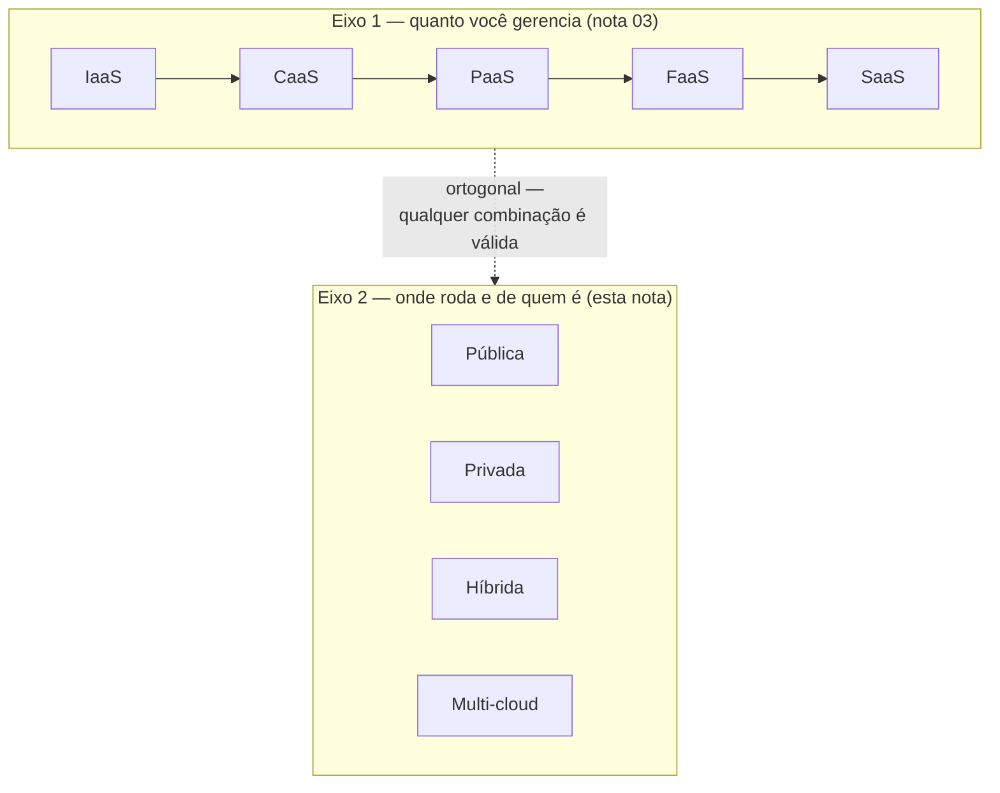
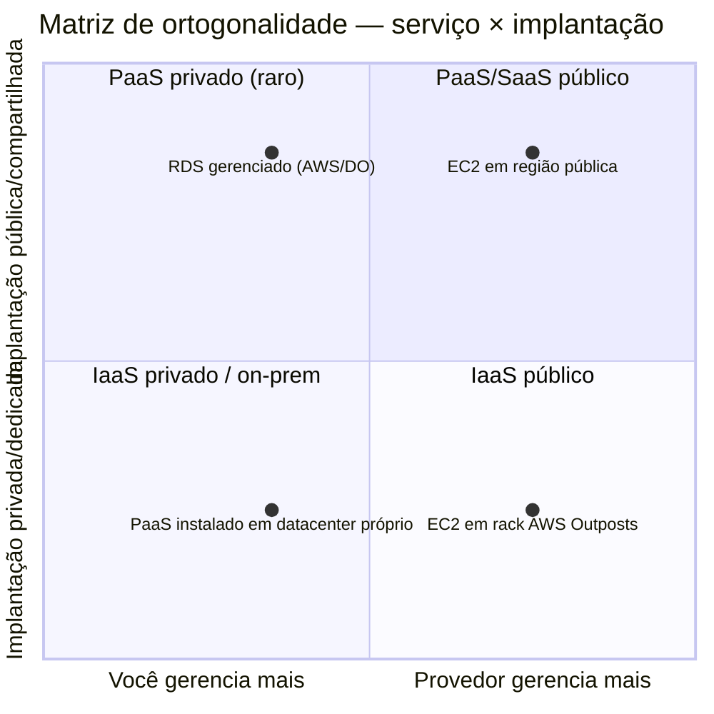
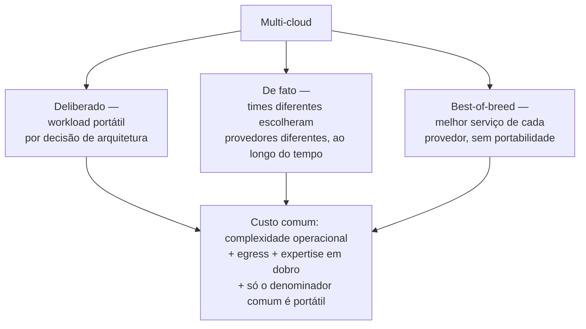
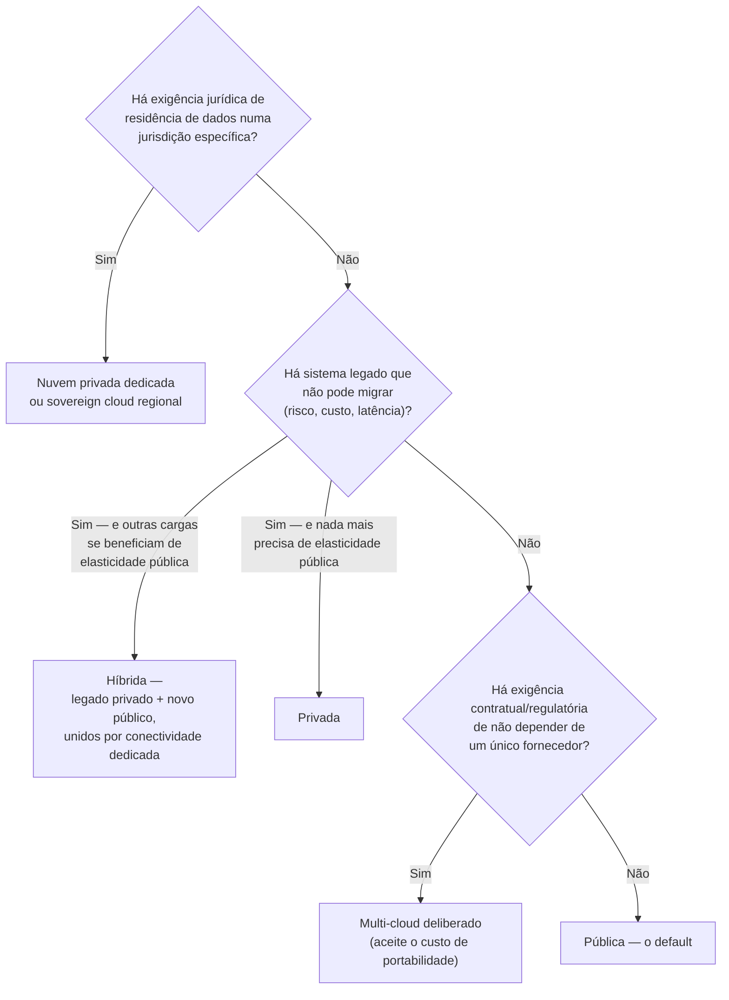

# Modelos de implantação — público, privado, híbrido e multi-cloud

> [!abstract] TL;DR
> "Onde a nuvem roda" é uma pergunta independente de "quanto você gerencia". Você pode ter IaaS numa nuvem privada ou PaaS numa nuvem pública — os dois eixos não se confundem. Nuvem pública é infraestrutura de terceiro, compartilhada entre inúmeros clientes, o default desta trilha. Nuvem privada é infraestrutura dedicada a uma única organização — e só merece o nome "nuvem" se entregar as mesmas características de self-service e elasticidade; senão é datacenter virtualizado com nome bonito. Nuvem híbrida combina as duas, e na prática empresarial madura costuma ser um estado *permanente*, não uma fase de transição, porque o legado que não migra nunca termina de não migrar. Multi-cloud tem três sabores raramente distinguidos — deliberado, acidental e best-of-breed — e o custo real dele nunca aparece na fatura de compute: aparece em complexidade operacional, em egress e em profundidade de expertise que o time precisa manter em dobro (ou em triplo).

## O mainframe que ninguém consegue desligar

Uma seguradora de médio porte decide, num certo ano, migrar seu novo produto de seguro digital inteiro para a nuvem pública: microsserviços em containers, banco de dados gerenciado, filas gerenciadas, tudo o que as notas anteriores desta trilha descreveram. O projeto é um sucesso — em dezoito meses, o produto novo está rodando 100% num provedor de nuvem pública, com deploy contínuo, autoscaling, e um time que nunca mais viu um datacenter físico por dentro.

Só que a seguradora tem outro sistema, muito mais antigo: o motor de cálculo atuarial que processa apólices existentes, escrito décadas atrás, rodando num mainframe dentro de um datacenter que a empresa é dona e opera desde sempre. Esse sistema processa bilhões em apólices ativas, está sob auditoria regulatória constante, e reescrevê-lo do zero é um projeto de anos que ninguém no orçamento está disposto a aprovar — o risco de erro numa reescrita de motor atuarial é medido em processos judiciais, não em bugs de produção. O mainframe não vai para a nuvem pública. Não este ano, provavelmente não na próxima década.

O resultado não é uma escolha entre "nuvem" e "não-nuvem" — é as duas coisas coexistindo, de propósito, indefinidamente: o produto novo na nuvem pública, o motor atuarial no datacenter próprio, e uma ponte entre os dois — o sistema novo consulta o motor atuarial via uma conexão dedicada, de baixa latência, que atravessa a fronteira entre "infraestrutura da seguradora" e "infraestrutura do provedor de nuvem" como se fosse uma rede só. Isso tem nome: **nuvem híbrida**. E a primeira coisa a desfazer sobre ela é a expectativa de que é temporária. Para essa seguradora, ela não é uma fase de transição rumo a "tudo na nuvem pública, um dia". É o estado final — porque o motivo que mantém o mainframe fora da nuvem pública (risco regulatório de reescrita, não custo de infraestrutura) não desaparece com o tempo; ele é estrutural ao negócio.

Esse cenário levanta a pergunta que esta nota resolve: se a nota 03 já respondeu *quanto* da pilha você gerencia (IaaS a SaaS), falta responder **onde** essa infraestrutura roda, e de quem ela é. É um eixo diferente — e, como o resto desta nota vai mostrar, genuinamente independente do primeiro.

## Dois eixos, não um

A confusão mais comum de quem está aprendendo cloud é tratar "modelo de serviço" e "modelo de implantação" como a mesma pergunta, só com nomes diferentes. Não são. São dois eixos **ortogonais** — você pode responder cada um deles de forma completamente independente do outro, e a combinação das duas respostas é que descreve por completo onde e como uma carga de trabalho roda.

O primeiro eixo — coberto na nota 03 — é **quanto da pilha técnica você opera**: da máquina crua (IaaS) até o software pronto de terceiro (SaaS), passando por CaaS, PaaS e FaaS no meio do caminho. O segundo eixo — o assunto desta nota — é **de quem é a infraestrutura física e quem mais a compartilha com você**: pública (de um provedor, compartilhada com outros clientes), privada (dedicada a uma única organização), híbrida (as duas coexistindo) ou distribuída entre múltiplos provedores públicos (multi-cloud).

Nada impede combinar qualquer ponto de um eixo com qualquer ponto do outro. Uma VM (IaaS) pode rodar numa nuvem pública comum ou dentro de uma nuvem privada corporativa. Uma plataforma de deploy de código (PaaS) pode ser oferecida por um provedor público ou instalada dentro do datacenter de uma empresa como produto privado. O erro de raciocínio mais comum de quem confunde os dois eixos é achar que "nuvem privada" significa necessariamente "IaaS" — como se privado fosse sinônimo de "só a VM, sem os serviços gerenciados de cima". Não é: existem ofertas de PaaS e até de banco de dados gerenciado (um serviço tipicamente associado a "camada alta" no eixo de serviço) rodando dentro de infraestrutura privada.



Um exemplo concreto ancora a ortogonalidade: uma instância EC2 (IaaS) rodando numa região pública comum da AWS está num ponto do mapa; a mesma instância EC2, rodando dentro de um rack AWS Outposts instalado fisicamente no datacenter do cliente, está em outro ponto do mesmo eixo de serviço (ainda IaaS — você ainda administra o sistema operacional para cima), mas num ponto diferente do eixo de implantação (híbrida em vez de pública). O modelo de serviço não mudou. O modelo de implantação, sim.

A matriz abaixo torna a ortogonalidade tangível: cada célula é uma combinação real, encontrável em produção, dos dois eixos.



Leia a matriz assim: mover no eixo horizontal responde "quanto eu opero" (nota 03); mover no eixo vertical responde "de quem é a infraestrutura e quem mais a compartilha comigo" (esta nota). Uma mesma carga pode se mover em qualquer uma das duas direções sem depender da outra — é exatamente isso que "eixos ortogonais" quer dizer na prática, não só na definição.

Antes de entrar em cada modelo em profundidade, a tabela abaixo serve de mapa de referência rápido — volte a ela sempre que precisar comparar dois modelos lado a lado:

| Modelo | Quem é dono da infra | Elasticidade real | Quando faz sentido | Armadilha típica |
|---|---|---|---|---|
| Pública | Provedor (AWS, DigitalOcean etc.), multi-tenant | Plena — pool compartilhado entre milhares de clientes | Default: startups, produtos novos, cargas variáveis | Assumir que "nuvem" resolve sozinho requisitos de soberania ou latência a legado |
| Privada | Organização (própria ou terceiro dedicado), single-tenant | Só se houver self-service + pool elástico interno de verdade | Regulação estrita, workload estável de larga escala, latência a sistema legado | Chamar de "nuvem privada" um datacenter virtualizado sem self-service nem elasticidade |
| Híbrida | Dividida — parte provedor, parte organização, unidas por conectividade dedicada | Plena no lado público; fixa no lado privado | Legado que não migra + necessidade real de elasticidade em outra parte do sistema | Tratar híbrido como fase de transição quando, na prática, é o desenho final |
| Multi-cloud | Múltiplos provedores públicos | Plena em cada provedor isoladamente; portabilidade entre eles é o que custa caro | Resiliência a fornecedor único, best-of-breed deliberado, ou herança de decisões de times diferentes | Adotar "estratégia multi-cloud" sem nomear qual dos três tipos, e pagar o custo sem ter escolhido conscientemente |

## Nuvem pública — o default desta trilha

A definição formal, de novo, vem do mesmo documento que fundou a nota 01: o [[03-Dominios/Tecnologia/Cloud/01 - O que é a nuvem, de verdade/01 - O que é computação em nuvem|NIST SP 800-145]]. O texto descreve nuvem pública como infraestrutura "provisionada para uso aberto pelo público em geral", que "pode ser de propriedade, gerenciada e operada por uma organização de negócios, acadêmica ou governamental, ou alguma combinação delas", e que "existe nas instalações do provedor de nuvem".

Isso significa, em termos práticos: a infraestrutura física — os datacenters, os servidores, os switches de rede — pertence ao provedor (AWS, DigitalOcean, ou qualquer outro), não a você. Você é um de muitos clientes compartilhando essa infraestrutura, isolados uns dos outros por virtualização e controles de segurança, mas fisicamente no mesmo hardware, ou no mesmo conjunto de datacenters, que centenas de milhares de outras organizações. É o modelo **multi-tenant**: múltiplos inquilinos (*tenants*), um único prédio.

É também o único modelo de implantação em que as cinco características do NIST — que a nota 01 já detalhou — aparecem na sua forma mais plena, sem ressalva. Self-service sob demanda funciona de verdade porque o provedor já tem a capacidade construída e ociosa, esperando ser alocada por qualquer cliente a qualquer momento — não depende de uma equipe interna aprovar compra de hardware. Elasticidade rápida funciona de verdade porque o pool de recursos compartilhado entre milhares de clientes absorve o pico de qualquer um deles sem que ninguém perceba — a escala agregada de todos os clientes do provedor é o que faz a elasticidade de cada cliente individual parecer infinita. Essa é a razão estrutural, não só histórica, de nuvem pública ser o *default* desta trilha: é o ponto do espectro onde a proposta de valor original da nuvem — pagar só pelo que usa, escalar sem esperar hardware novo — se realiza sem atenuação.

"Multi-tenant" não é abstrato — dá pra ver, na prática, o efeito colateral mais visível dele: um mesmo recurso lógico (uma VM, um droplet) pertence sempre a exatamente uma região física do provedor, e ambos os provedores desta trilha expõem um jeito de listar quais regiões existem e qual é a configurada por padrão na sua sessão. Do lado AWS:

```bash
# Lista todas as regiões da conta, incluindo as que exigem opt-in
aws ec2 describe-regions --all-regions --query "Regions[].{Nome:RegionName,Status:OptInStatus}" --output table
```

```
-------------------------------------------
|              DescribeRegions             |
+----------------+-------------------------+
|   Nome         |   Status                |
+----------------+-------------------------+
|  eu-north-1    |  opt-in-not-required    |
|  us-east-1     |  opt-in-not-required    |
|  sa-east-1     |  opt-in-not-required    |
|  eu-south-2    |  opted-in               |
+----------------+-------------------------+
```

Do lado DigitalOcean, o equivalente é mais direto — não existe conceito de opt-in por região:

```bash
# Lista as regiões (datacenters) disponíveis, só com o slug
doctl compute region list --format Slug,Name,Available
```

```
Slug    Name              Available
nyc1    New York 1        true
sfo3    San Francisco 3   true
ams3    Amsterdam 3       true
fra1    Frankfurt 1       true
```

Nenhum dos dois comandos fixa uma região — só listam o que existe. Fixar qual região seu trabalho usa é uma decisão separada, tipicamente feita uma vez por sessão ou por projeto:

```bash
# AWS — grava a região default no profile local (~/.aws/config)
aws configure set region eu-central-1

# Confirma o que ficou gravado
aws configure get region
```

```hcl
# Terraform — fixa a região no provider, para todo o projeto, versionado no código
provider "aws" {
  region = "eu-central-1"
}
```

A DigitalOcean não tem um "profile de região" global equivalente — a região é um parâmetro que cada comando de criação de recurso exige explicitamente, por exemplo `doctl compute droplet create meu-droplet --region fra1 --size s-1vcpu-1gb --image ubuntu-24-04-x64`. É uma escolha de produto coerente com a filosofia mais simples da DigitalOcean descrita mais adiante nesta nota: menos estado implícito para lembrar, mais explicitação no comando.

## Nuvem privada — quando o default não serve

A mesma definição do NIST descreve nuvem privada como infraestrutura "provisionada para uso exclusivo de uma única organização compreendendo múltiplos consumidores (por exemplo, unidades de negócio)", que "pode ser de propriedade, gerenciada e operada pela organização, por um terceiro, ou alguma combinação deles, e pode existir dentro ou fora das instalações" da organização.

Repare no detalhe que costuma escapar: nuvem privada **não significa necessariamente "no seu próprio prédio"**. A definição do NIST permite explicitamente que ela seja hospedada fora das instalações da organização, e até operada por um terceiro — desde que o uso continue exclusivo daquela organização. Existem provedores especializados que vendem exatamente isso: infraestrutura fisicamente separada, num datacenter de terceiro, mas dedicada a um único cliente, sem compartilhamento de hardware com mais ninguém.

Por que uma organização escolheria abrir mão da elasticidade e do modelo de custo variável da nuvem pública para isso? Quatro motivos aparecem com regularidade:

**Regulação.** Alguns setores — serviços financeiros, saúde, governo — operam sob regras que exigem controle direto sobre onde o dado fica e quem tem acesso físico à infraestrutura, de um jeito que contratos de nuvem pública nem sempre satisfazem sem customização pesada.

**Soberania de dados.** Uma variante mais específica da regulação: alguns governos e setores críticos exigem que dados sensíveis nunca saiam da jurisdição legal do país, e que a operação da infraestrutura não esteja sujeita a leis estrangeiras (o caso mais citado é a preocupação, na Europa, com o CLOUD Act americano permitir que autoridades dos EUA requisitem dados de empresas americanas mesmo quando os dados estão fisicamente fora do país). A seção seguinte desta nota volta a esse ponto.

**Workload estável de larga escala.** A nota 02 desta trilha já mostrou o caso da 37signals repatriando carga previsível de volta para hardware próprio — o mesmo raciocínio econômico se aplica aqui: quando a carga é constante, alta e previsível, a elasticidade da nuvem pública deixa de ser um benefício que você usa, porque você nunca desce, nunca sobe — você só paga o preço por unidade de compute de um provedor que precisa embutir margem e capacidade ociosa própria no preço.

**Latência a sistemas legados.** O caso da seguradora do início desta nota: quando um sistema novo precisa conversar constantemente, em baixa latência, com um sistema antigo que não pode migrar, manter os dois fisicamente próximos (ou na mesma rede privada) evita a latência de atravessar a internet pública a cada chamada.

Agora a parte que exige honestidade, e que a maioria dos materiais introdutórios sobre cloud evita dizer com todas as letras: **"nuvem privada" é um rótulo que qualquer datacenter virtualizado pode reivindicar, mas nem todo datacenter virtualizado merece o nome.** A diferença entre uma nuvem privada de verdade e um datacenter tradicional com marketing novo está exatamente nas características que o NIST definiu na nota 01 — self-service sob demanda, elasticidade rápida, pool de recursos compartilhado dinamicamente entre times internos, medição do uso. Se a infraestrutura "privada" de uma empresa continua exigindo um chamado ao time de infraestrutura, uma aprovação de compra e semanas de espera para provisionar uma VM nova, ela não tem self-service — é uma VM tradicional com um nome mais moderno na porta. Se a capacidade é fixa, comprada com um ano de antecedência, sem verdadeiro pool elástico compartilhado entre projetos, não há elasticidade — há capacidade planejada, o que é uma coisa genuinamente diferente. Chamar isso de "nuvem privada" não é mentira técnica categórica — a definição do NIST é ampla o suficiente para caber — mas é, com frequência, uma forma de vender internamente (para o orçamento, para a diretoria) uma modernização de infraestrutura que entrega bem menos elasticidade real do que o nome sugere. Vale perguntar, sempre que alguém descrever uma "nuvem privada": *dá pra provisionar um recurso novo sem falar com uma pessoa? A capacidade cresce e encolhe sozinha conforme a demanda, ou é só um limite fixo maior que o de antes?* Se a resposta às duas for "não", o nome está carregando mais do que a infraestrutura entrega.

> [!info] Fronteira
> Ferramentas específicas de nuvem privada — OpenStack, VMware Cloud, os detalhes de operar um datacenter privado — não são o assunto desta trilha, que é organizada em torno de AWS e DigitalOcean, dois provedores essencialmente públicos. Esta nota cobre o conceito; a operação de infraestrutura privada por si só pertence a [[03-Dominios/Engenharia/Operação/index|Operação (DevOps/SRE)]].

## Nuvem híbrida — o estado comum, não a fase de transição

A definição do NIST para híbrida é curta e mecânica: "a infraestrutura de nuvem é uma composição de duas ou mais infraestruturas de nuvem distintas (privada, comunitária ou pública) que permanecem entidades únicas, mas são unidas por tecnologia padronizada ou proprietária que permite a portabilidade de dados e aplicações (por exemplo, *cloud bursting* para balanceamento de carga entre nuvens)".

Repare que a definição não fala em "empresa migrando de A para B" — fala em duas infraestruturas distintas, **permanentemente** unidas por tecnologia que permite dados e aplicações atravessarem a fronteira. Isso é o ponto que a intuição de quem está aprendendo cloud costuma errar primeiro: híbrido soa como um estado transitório — "estamos migrando, por enquanto é híbrido, um dia vai ser tudo nuvem pública". Às vezes é exatamente isso: uma migração em andamento, com destino final definido. Mas, em empresas grandes e maduras — o caso da seguradora do início desta nota é típico, não excepcional —, híbrido é o desenho final, não uma etapa. O motivo é estrutural: o legado que fica de fora (mainframe, ERP monolítico rodando há vinte anos, banco de dados sob um regime regulatório específico) não fica de fora *temporariamente*. Fica de fora porque o custo e o risco de migrá-lo nunca justificam o esforço frente ao valor entregue — e essa conta não muda com o tempo, a menos que o próprio sistema legado seja aposentado por completo, o que costuma levar décadas, não trimestres.

O que faz um híbrido funcionar, em nível conceitual — os detalhes técnicos de cada mecanismo pertencem a galhos posteriores desta trilha, mas vale nomear os três pilares aqui:

**Conectividade dedicada ou privada.** Uma ligação entre a rede do datacenter próprio e a rede do provedor de nuvem que não passa pela internet pública — mais previsível em latência, mais segura por não estar exposta à internet aberta, e frequentemente mais barata em volume alto de tráfego do que pagar egress padrão. Existem produtos comerciais específicos para isso (AWS Direct Connect é o exemplo mais citado do lado AWS), mas o conceito — um "cabo dedicado" lógico entre dois ambientes — é o que importa aqui. As opções mais comuns, comparadas no nível de decisão (a mecânica de cada uma pertence ao galho 7):

| Opção | Latência típica | Previsibilidade | Custo relativo | Quando usar |
|---|---|---|---|---|
| VPN sobre internet | Variável — sujeita ao congestionamento da internet pública | Baixa — sem SLA de latência, rota compartilhada com todo o resto do tráfego da internet | Baixo — usa o link de internet que já existe | Prova de conceito, volume baixo de tráfego, tolerância a variação de latência |
| Conexão dedicada (ex.: AWS Direct Connect) | Baixa e estável | Alta — circuito físico dedicado, fora da internet pública | Alto — cobra por porta contratada + uso | Produção, workload sensível a latência (o caso do motor atuarial), alto volume constante |
| Peering privado (VPC/VNet peering) | Baixa, dentro do mesmo provedor | Alta — tráfego nunca sai da rede do provedor | Médio — geralmente mais barato que egress público entre contas | Conectar duas redes dentro do **mesmo** provedor; não resolve a ligação a um datacenter próprio |

**Identidade federada.** Um usuário ou serviço se autentica uma vez, e essa identidade é reconhecida tanto no lado privado quanto no lado público da infraestrutura, sem duplicar cadastro de usuário em dois sistemas separados que podem divergir com o tempo.

**Dados atravessando a fronteira.** O mecanismo que replica, sincroniza ou consulta dados de um lado a partir do outro — seja em tempo real (a aplicação nova consultando o motor legado a cada chamada, como no caso da seguradora) ou em lote (um pipeline noturno que copia dados do sistema legado para um data warehouse na nuvem pública, para análise).

O AWS Outposts, citado na seção de nuvem privada acima, é também o exemplo mais direto de híbrido encarnado em produto: um rack físico de hardware AWS, instalado dentro do datacenter do cliente, executando os mesmos serviços e a mesma API da nuvem pública AWS — mas fisicamente local, com conexão de volta à região AWS mais próxima para os serviços que precisam dela. É, literalmente, um pedaço da nuvem pública entregue para dentro das quatro paredes do cliente, unido ao resto por conectividade dedicada — a definição do NIST em forma de hardware.

O detalhe que revela a ortogonalidade de novo, agora em comando real: um Outpost aparece na mesma API e no mesmo tipo de resposta que qualquer outro recurso AWS — ele só carrega, a mais, a `AvailabilityZone` da região pública à qual está associado, e um `OutpostArn` que o distingue de qualquer coisa rodando fora dele:

```bash
# Lista os Outposts da conta — cada um "pertence" a uma AZ de uma região pública
aws outposts list-outposts
```

```json
{
    "Outposts": [
        {
            "OutpostId": "op-0ab23c4567EXAMPLE",
            "OwnerId": "123456789012",
            "OutpostArn": "arn:aws:outposts:us-west-2:123456789012:outpost/op-0ab23c4567EXAMPLE",
            "Name": "datacenter-seguradora-sp",
            "LifeCycleStatus": "ACTIVE",
            "AvailabilityZone": "us-west-2a"
        }
    ]
}
```

A instância EC2 que roda dentro desse Outpost aceita o mesmo `run-instances` de qualquer instância pública — a única diferença prática é o parâmetro que aponta para o hardware local em vez de para a nuvem pública: `aws ec2 run-instances --subnet-id <subnet-do-outpost> --instance-type m5.large ...`. O comando não muda de forma; só o destino muda.

> [!info] Fronteira
> Os mecanismos de VPN, VPC peering e conectividade dedicada entre redes, em profundidade técnica, pertencem ao **galho 7** desta trilha. Regions e availability zones — a mecânica de "onde fisicamente" um serviço roda dentro de um único provedor — pertencem ao **galho 2**. Aqui, os três pilares acima aparecem só como conceito, o suficiente para reconhecer um desenho híbrido quando você o encontrar.

## Multi-cloud — três coisas com um nome só

"Multi-cloud" é o termo mais mal-empregado deste eixo inteiro, porque cobre, na prática, três situações genuinamente diferentes que o vocabulário do dia a dia raramente distingue.

**Multi-cloud deliberado** é o que a maioria das pessoas imagina quando ouve o termo: uma decisão de arquitetura consciente de tornar um workload portátil entre dois ou mais provedores de nuvem pública, de propósito — seja para resiliência (se um provedor cair, o outro segue no ar), seja para negociar preço (ameaça crível de sair reduz alavancagem do fornecedor), seja para atender exigência regulatória de não depender de fornecedor único.

**Multi-cloud de fato** é, disparado, o caso mais comum na prática — e o que menos parece com uma estratégia. Uma empresa não "decide" multi-cloud num comitê; ela *acumula* multi-cloud com o tempo, porque o time de dados escolheu GCP para um projeto de analytics há três anos, o time de infraestrutura core sempre usou AWS, e um time novo, formado por gente que veio de outra empresa, trouxe preferência por DigitalOcean ou Azure para o produto que está construindo agora. Nenhuma dessas escolhas foi errada isoladamente — cada time resolveu bem o problema que tinha na frente, com a ferramenta que conhecia. O resultado agregado, porém, é uma empresa operando em três provedores diferentes sem nenhuma estratégia deliberada de portabilidade unindo as peças — só um conjunto de decisões locais, cada uma racional, que se acumulou num todo que ninguém desenhou.

**Best-of-breed** é a terceira variante: usar deliberadamente o melhor serviço específico de cada provedor para cada função — o serviço de machine learning mais maduro de um, o banco de dados gerenciado mais avançado de outro, o serviço de CDN mais barato de um terceiro — mesmo que isso signifique que nenhum workload individual é portátil entre eles. Diferente do multi-cloud deliberado (que otimiza para portabilidade), best-of-breed otimiza para capacidade — aceita o acoplamento a cada provedor específico em troca de usar o que cada um faz de melhor.

A tabela abaixo resume as três variantes lado a lado — vale voltar a ela sempre que alguém disser "somos multi-cloud" sem qualificar qual das três:

| Tipo | Como nasce | Otimiza para | Custo característico |
|---|---|---|---|
| Deliberado | Decisão de arquitetura consciente, com portabilidade como requisito desde o início | Resiliência a fornecedor único, poder de negociação, exigência regulatória | Denominador comum — abre mão dos serviços gerenciados mais avançados de cada provedor |
| De fato | Acúmulo de decisões locais de times diferentes, ao longo do tempo, sem coordenação | Nada — é subproduto, não estratégia | Contas de faturamento e modelos de IAM duplicados, sem ninguém sabendo o custo total até auditar |
| Best-of-breed | Decisão deliberada de usar o melhor serviço específico de cada provedor | Capacidade máxima por função | Acoplamento total a cada provedor — zero portabilidade entre workloads |

As três variantes compartilham a mesma etiqueta e o mesmo custo real — e é aqui que vale ser honesto sobre o preço que raramente aparece na conversa inicial sobre "estratégia multi-cloud":

**Complexidade operacional.** Cada provedor tem seu próprio console, sua própria API, seu próprio modelo de IAM, sua própria forma de configurar rede. Um time que opera em dois provedores não tem metade do trabalho de operação de cada um — tem, com frequência, mais do que o dobro, porque a sobreposição de conhecimento entre "como fazer X na AWS" e "como fazer X no GCP" costuma ser pequena, e o custo de contexto de alternar entre dois modelos mentais diferentes é real.

**Egress.** Mover dados de um provedor de nuvem para fora dele — inclusive para outro provedor de nuvem — costuma ter custo por gigabyte, e esse custo tende a ser assimétrico e nada trivial em volume alto. Uma arquitetura que constantemente move dados entre dois provedores paga esse pedágio a cada transferência, de um jeito que uma arquitetura de provedor único nunca vê.

**Profundidade de expertise em dobro.** Um engenheiro sênior em AWS não nasce sênior em GCP ou Azure de graça — o conhecimento profundo de cada provedor (os limites reais de cada serviço, as armadilhas de custo, os padrões de falha específicos) leva anos para se formar, e é específico o suficiente que raramente transfere de forma completa. Um time pequeno operando em três provedores, na prática, costuma ter conhecimento raso dos três em vez de profundo de um — porque o tempo de aprendizado disponível é o mesmo, dividido em mais frentes.

E o custo mais silencioso de todos: **você frequentemente perde os serviços gerenciados mais poderosos de cada provedor**, precisamente os que fazem a nuvem pública valer a pena. Se um workload precisa rodar igual em dois provedores, a única forma prática de garantir isso é restringir o que ele usa ao **denominador comum** entre os dois — o que costuma significar containers genéricos, um banco de dados relacional padrão, filas de mensageria com API razoavelmente portável. Os serviços mais avançados e mais diferenciados de cada provedor — o motor de machine learning proprietário, o banco de dados serverless com uma API específica, a ferramenta de orquestração nativa — ficam de fora, porque usá-los quebraria a portabilidade que motivou a escolha multi-cloud em primeiro lugar. Multi-cloud deliberado, levado a sério, tende a te devolver ao nível de abstração mais baixo do eixo de serviço da nota 03 — porque é lá, perto do hardware, que a portabilidade entre provedores é mais fácil de manter.

> [!info] Fronteira
> Esta nota apresenta multi-cloud como modelo de implantação e nomeia seu custo real. Estratégia de portabilidade, abstração de provedor, containers e Kubernetes como camada de portabilidade, e a comparação de filosofia entre AWS, Azure e GCP a fundo são o assunto do **galho 23** desta trilha ("Panorama multi-cloud e portabilidade").

> [!tip] Assista: Hybrid Cloud and MultiCloud | Why are companies adopting it?
> **Canal:** TechWorld with Nana | **Duração:** ~14min | **Idioma:** EN
>
> Cobre exatamente os dois modelos desta e da seção anterior lado a lado — híbrido (privada + uma pública) versus multi-cloud (duas ou mais públicas) — com os mesmos dois motivos de multi-cloud que esta nota nomeia: replicar o mesmo workload em vários provedores, ou dividir workloads diferentes entre eles. Trecho de destaque [06:07]: *"multi-cloud is essentially when you use two or more public clouds for your workloads and there are two main reasons why companies would want to use multi-cloud"*
>
> 🎬 [Assistir no YouTube](https://www.youtube.com/watch?v=qkj5W98Xdvw)



## Soberania de dados e residência — uma restrição jurídica, não técnica

Um ponto que costuma ser tratado como detalhe técnico, mas é, na origem, uma questão jurídica: onde um dado *fisicamente* fica pode ser uma exigência legal, não uma escolha de engenharia.

O caso mais citado é o europeu. O GDPR, no Capítulo V, estabelece um princípio geral (Artigo 44) de que a transferência de dados pessoais para um país terceiro só pode ocorrer se as condições daquele capítulo forem satisfeitas — o que, na prática, significa que mover dados pessoais de cidadãos europeus para fora da União Europeia (por exemplo, para um datacenter nos Estados Unidos) exige uma base legal específica: uma decisão de adequação da Comissão Europeia sobre aquele país, cláusulas contratuais padrão, ou outro mecanismo de salvaguarda reconhecido. Não é proibido por padrão — mas não é livre por padrão, e a inadequação desses mecanismos foi, historicamente, motivo de litígio de alto perfil entre reguladores europeus e provedores americanos.

A LGPD brasileira segue uma lógica equivalente. O Artigo 33 da Lei nº 13.709/2018 trata como "transferência internacional de dados" qualquer operação que envolva o fluxo de dados pessoais para país estrangeiro ou organismo internacional, e só a permite em hipóteses específicas — quando o país de destino tem grau de proteção adequado, quando o controlador oferece garantias contratuais específicas, quando o titular consente de forma destacada, entre outras hipóteses listadas na lei.

O ponto que interessa a um arquiteto de sistemas, sem virar aula de direito, é este: **a localização física de um dado é, em muitos casos, uma restrição imposta de fora do desenho técnico — não uma preferência de performance ou de custo.** Uma decisão de arquitetura que ignora isso pode ser tecnicamente elegante e legalmente inviável ao mesmo tempo. Escolher a região onde um banco de dados roda não é só uma decisão de latência — é, com frequência, também uma decisão de conformidade regulatória, tomada em conjunto com jurídico e compliance, não isoladamente pela engenharia.

A tabela abaixo resume os dois regimes citados nesta nota, lado a lado, no nível que importa para uma decisão de arquitetura — não como substituto de parecer jurídico:

| Regime | O que restringe | Efeito prático no desenho |
|---|---|---|
| GDPR (UE), Art. 44 | Transferência de dados pessoais para país terceiro só com base legal específica (decisão de adequação, cláusulas contratuais padrão, ou outra salvaguarda do Capítulo V) | Escolher região fora da UE para dados de titulares europeus exige checar a base legal antes, não depois, de provisionar |
| LGPD (Brasil), Art. 33 | Transferência internacional só nas hipóteses listadas (país com proteção adequada, garantias contratuais, consentimento destacado, entre outras) | Mesma lógica da UE, aplicada a dados de titulares no Brasil — região do provedor escolhida deve ter base legal documentada, não só menor latência |

Restrição jurídica, no arquiteto sênior, costuma virar controle técnico enforçável — não só uma cláusula de contrato que ninguém audita. Do lado AWS, o mecanismo mais direto é uma *service control policy* (SCP) no nível da organização, negando qualquer ação fora das regiões aprovadas:

```json
{
  "Version": "2012-10-17",
  "Statement": [
    {
      "Sid": "NegaForaDaRegiaoUE",
      "Effect": "Deny",
      "NotAction": [
        "iam:*",
        "organizations:*",
        "route53:*",
        "cloudfront:*",
        "support:*"
      ],
      "Resource": "*",
      "Condition": {
        "StringNotEquals": {
          "aws:RequestedRegion": ["eu-central-1", "eu-west-1"]
        }
      }
    }
  ]
}
```

A condição usa a chave global `aws:RequestedRegion` — qualquer chamada de API que peça um recurso fora de `eu-central-1` ou `eu-west-1` é negada antes de executar, para qualquer conta dentro da organização onde a SCP está anexada. Isso transforma "nossos dados ficam na Europa" de uma promessa em texto de contrato para uma barreira que o provedor impõe estruturalmente, no nível de política — o tipo de controle que auditoria de compliance sabe verificar de fato, em vez de confiar na palavra do time de engenharia.

O mercado respondeu a essa pressão regulatória com um produto novo: **sovereign clouds** — nuvens fisicamente e logicamente isoladas do resto da infraestrutura global de um provedor, operadas sob a legislação e a governança de uma jurisdição específica. O exemplo mais recente e mais citado é a AWS European Sovereign Cloud, lançada com região principal em Brandenburgo, na Alemanha, desenhada para que os dados nunca saiam fisicamente da União Europeia, que os metadados de controle (identidade, faturamento, medição de uso) permaneçam inteiramente europeus, e que a operação da infraestrutura fique sob entidades legais e liderança europeias — uma resposta direta à preocupação, recorrente em discussões regulatórias europeias, de que leis extraterritoriais de outros países pudessem, em tese, alcançar dados armazenados por empresas americanas mesmo fora dos Estados Unidos.

> [!info] Caducidade
> A AWS European Sovereign Cloud e sua região de Brandenburgo foram anunciadas e lançadas em geral disponibilidade em janeiro de 2026, verificado em 2026-07-20. Expansão para outros países europeus, novos players de sovereign cloud e mudanças na regulação de proteção de dados são esperados — confira o estado mais recente antes de tomar qualquer decisão de arquitetura baseada nisso.

> [!info] Fronteira
> Compliance e controles de segurança em profundidade — certificações, auditoria, os frameworks regulatórios setoriais além da menção de soberania de dados feita aqui — são o assunto do **galho 18** desta trilha. Aqui, soberania de dados aparece só como uma restrição que molda onde a infraestrutura pode existir, não como um guia de conformidade completo.

## A lente dupla neste eixo: AWS e DigitalOcean se posicionam de forma diferente

Vale nomear, com honestidade, que os dois provedores desta trilha não têm a mesma ambição neste eixo — e essa diferença é informação, não lacuna de uma das duas.

**AWS tem uma oferta explícita e madura para híbrido e soberania.** O AWS Outposts, já descrito nesta nota, estende a infraestrutura AWS para dentro do datacenter do cliente. A AWS European Sovereign Cloud, também já descrita, é uma resposta de produto inteira dedicada à exigência de soberania regulatória europeia — com governança, entidades legais e operação local dedicadas. Isso reflete o porte e o público da AWS: entre seus clientes estão bancos multinacionais, governos, seguradoras e empresas com décadas de sistemas legados — o tipo de cliente para quem "híbrido permanente" e "soberania regulatória" não são casos de borda, são requisito recorrente de contrato.

**DigitalOcean é, essencialmente, uma nuvem pública — sem pretensão de oferecer híbrido ou sovereign cloud como produto.** Não há um "DigitalOcean Outposts" nem uma oferta de infraestrutura dedicada instalável dentro do datacenter de um cliente. Isso não é uma deficiência a ser lida como "DigitalOcean é menos completa" — é uma **escolha de produto** coerente com o público que a DigitalOcean atende: desenvolvedores, startups e times pequenos e médios que querem provisionar infraestrutura rápido, com um catálogo simples de entender, sem o overhead conceitual de negociar contratos de soberania de dados ou integrar hardware físico ao datacenter próprio — um público que, na esmagadora maioria dos casos, não tem mainframe legado nenhum para conectar. Uma empresa que precisa de nuvem híbrida de verdade, com hardware estendido para dentro das próprias paredes, provavelmente não é o público-alvo natural da DigitalOcean — e a DigitalOcean parece confortável com isso, em vez de tentar competir em cada ponto do mapa que a AWS cobre.

O padrão vale a pena guardar, porque ele não é exclusivo deste eixo: cada provedor faz escolhas deliberadas sobre que fatia do mercado atender, e simplicidade de catálogo não é ausência de capacidade — é, com frequência, o próprio produto.

| Conceito | AWS | Azure | GCP | DigitalOcean |
|---|---|---|---|---|
| Nuvem pública | Regiões AWS padrão | Azure Regions | Google Cloud Regions | Regiões DigitalOcean |
| Extensão híbrida on-premises | AWS Outposts | Azure Stack (HCI/Hub/Edge) | Google Distributed Cloud | — (sem oferta híbrida) |
| Sovereign cloud regional | AWS European Sovereign Cloud | Microsoft Cloud for Sovereignty | Google Cloud sovereign controls (parceiros regionais) | — (sem oferta de sovereign cloud dedicada) |
| Conectividade dedicada ao datacenter próprio | Direct Connect | ExpressRoute | Cloud Interconnect | — (conectividade padrão via VPC/rede pública) |

> [!info] Caducidade
> Nomes de produto e disponibilidade regional verificados em 2026-07-20 — esta é uma área onde os quatro provedores lançam e reposicionam ofertas de soberania e híbrido com regularidade, motivados por pressão regulatória em constante mudança. Confira a documentação oficial de cada provedor antes de decidir.

## Qual modelo escolher, na prática

Tudo o que esta nota cobriu até aqui — soberania, legado, custo de multi-cloud — converge nas mesmas três perguntas, feitas nesta ordem, sempre que uma carga de trabalho nova precisa de um lar:



A ordem importa: soberania vem primeiro porque é a única restrição desta lista que **não é negociável por engenharia** — nenhuma elasticidade ou economia de custo justifica ignorar uma exigência jurídica. Legado vem em seguida porque, como a seguradora do início desta nota mostrou, ele raramente desaparece com uma decisão de arquitetura melhor. Multi-fornecedor vem por último de propósito: é a única das três perguntas cuja resposta "sim" custa caro o suficiente (a tabela de custo do multi-cloud, mais atrás nesta nota, detalha exatamente onde) para merecer ser a última linha de defesa, não a primeira escolha por precaução.

## Casos práticos

**O varejista que descobriu multi-cloud de fato tarde demais.** Uma rede de varejo de porte médio, ao consolidar seu inventário de infraestrutura pela primeira vez numa auditoria de segurança, descobre que está pagando por contas ativas em três provedores de nuvem pública diferentes — nenhuma decisão formal de arquitetura levou a isso; cada uma nasceu de um projeto específico, aprovado isoladamente, ao longo de quatro anos. O time de e-commerce está na AWS desde o início. Um projeto de analytics, tocado por uma consultoria externa contratada dois anos depois, foi entregue no GCP, porque era a preferência da consultoria — e ninguém formalizou a migração de volta depois que o contrato terminou. Um app interno de logística, construído por um time menor mais recentemente, foi lançado na DigitalOcean, porque era rápido de provisionar e o orçamento do time era pequeno. Nenhuma dessas decisões foi tecnicamente errada no momento em que foi tomada — cada time resolveu bem seu problema imediato. O custo agregado só ficou visível quando alguém precisou somar: três contas de faturamento separadas, três modelos de IAM diferentes para auditar, e nenhum engenheiro na empresa com profundidade real em mais de um dos três provedores. A correção não foi "migrar tudo para um só" — o custo de migração dos três sistemas já em produção seria maior que o custo de continuar operando os três — mas formalizar o que já existia: documentar por que cada sistema está onde está, padronizar práticas de segurança mínimas comuns aos três, e, daqui para frente, exigir que qualquer conta nova de provedor passe por uma decisão explícita, não por escolha individual de projeto.

**O banco que manteve o híbrido de propósito, não por atraso.** Uma instituição financeira migra a maior parte de seus sistemas voltados ao cliente — app mobile, site, APIs de consulta de saldo — para a nuvem pública ao longo de alguns anos, com ganhos claros de velocidade de entrega e elasticidade em picos sazonais. O núcleo de processamento de transações — o sistema que efetivamente debita e credita contas, sob regras regulatórias estritas de auditoria e continuidade — permanece em infraestrutura própria, conectada ao restante via conectividade dedicada e identidade federada. Anos depois, esse desenho permanece exatamente assim, sem plano formal de migrar o núcleo — não porque a migração seja tecnicamente impossível, mas porque o risco regulatório e operacional de uma migração completa nunca supera, na avaliação da diretoria, o ganho esperado. É um híbrido estável, deliberado, revisitado periodicamente e reafirmado — não uma pendência esquecida na lista de tarefas.

**A startup que escolheu nuvem pública única de propósito, e considerou isso uma vantagem.** Uma startup em estágio inicial avalia, num certo momento, se deveria adotar uma estratégia multi-cloud "para não depender de um fornecedor só" — um conselho comum, mas nem sempre aplicável ao estágio da empresa. A equipe de engenharia, pequena, decide que o risco de dependência de um único provedor é, para o tamanho e a fase da empresa, muito menor do que o risco concreto e imediato de dividir seu tempo de engenharia (escasso) entre dois modelos de infraestrutura diferentes. A empresa permanece deliberadamente em nuvem pública única, revisita a decisão a cada rodada de investimento relevante, e trata "considerar multi-cloud" como algo a reavaliar quando a escala e o risco de negócio justificarem o custo de complexidade — não como um requisito de maturidade que toda empresa "séria" precisa ter desde o primeiro dia.

## Armadilhas comuns

> [!warning] Tratar "híbrido" como sinônimo de "migração incompleta"
> Nem todo híbrido é uma etapa a caminho de "tudo na nuvem pública". Para muitas organizações grandes — bancos, seguradoras, governos — híbrido é o desenho final, sustentado por um motivo estrutural (regulação, risco de reescrita, latência a um sistema que não vai a lugar nenhum) que não desaparece com o tempo. Perguntar "quando terminamos a migração?" pode ser a pergunta errada; a pergunta certa às vezes é "esse híbrido está bem desenhado para durar?".

> [!warning] Chamar datacenter virtualizado sem self-service de "nuvem privada"
> Se provisionar um recurso novo ainda exige um chamado, uma aprovação e uma espera de dias, não é nuvem privada no sentido do NIST — é infraestrutura virtualizada tradicional com um nome mais moderno. Isso não é errado por si só (pode ser exatamente o que a organização precisa), mas prometer as características de elasticidade da nuvem sem entregá-las gera expectativa que a operação não vai cumprir.

> [!warning] Adotar multi-cloud sem nomear qual dos três tipos é, e por quê
> "Vamos ser multi-cloud" sem distinguir deliberado, de fato ou best-of-breed é uma frase sem conteúdo acionável. Cada um tem um custo e um benefício diferentes. Multi-cloud de fato, em particular, raramente é decidido — ele se acumula, e vale auditar periodicamente se ele ainda faz sentido ou se é só uma dívida técnica organizacional que ninguém formalizou.

## O que vem a seguir

Esta nota fechou o galho 1 respondendo o segundo eixo fundamental: depois de saber *quanto* da pilha você gerencia (nota 03) e *onde* essa infraestrutura roda e de quem é (esta nota), falta conhecer os próprios jogadores — quem são os provedores de nuvem que existem, que filosofia de produto cada um carrega, e por que esta trilha escolheu especificamente AWS e DigitalOcean como sua coluna prática, em vez de qualquer outra combinação possível. Essa é a próxima nota, **"O panorama dos provedores"**.

## Fontes

- [NIST SP 800-145 — texto completo em PDF](https://nvlpubs.nist.gov/nistpubs/Legacy/SP/nistspecialpublication800-145.pdf) — definições formais de Public Cloud, Private Cloud, Community Cloud e Hybrid Cloud (seção 3, "Deployment Models"); acessado em 2026-07-20.
- [NIST SP 800-145 — página de publicação oficial](https://csrc.nist.gov/pubs/sp/800/145/final) — fonte canônica; acessado em 2026-07-20.
- [AWS Outposts — página oficial de produto](https://aws.amazon.com/outposts/) — descrição de Outposts como extensão de infraestrutura e serviços AWS para ambientes on-premises e edge; acessado em 2026-07-20.
- [AWS — AWS European Sovereign Cloud (comunicado oficial)](https://press.aboutamazon.com/aws/2026/1/aws-launches-aws-european-sovereign-cloud-and-announces-expansion-across-europe) — lançamento, região de Brandenburgo, isolamento físico e lógico, governança europeia dedicada; acessado em 2026-07-20.
- [DigitalOcean — Multi-Cloud vs Hybrid Cloud Computing (blog oficial)](https://www.digitalocean.com/blog/multi-cloud-vs-hybrid-cloud-computing) — definições de híbrido (inclui componente privado) e multi-cloud (múltiplos provedores públicos) na perspectiva da DigitalOcean; acessado em 2026-07-20.
- [GDPR — Artigo 44, princípio geral para transferências (gdpr-info.eu)](https://gdpr-info.eu/art-44-gdpr/) — texto do Capítulo V do GDPR sobre transferência internacional de dados pessoais; acessado em 2026-07-20.
- [LGPD — Lei nº 13.709/2018, texto oficial (Planalto)](https://www.planalto.gov.br/ccivil_03/_ato2015-2018/2018/lei/l13709.htm) — fonte primária; o Artigo 33 lista as hipóteses de transferência internacional de dados pessoais. **Fonte primária de referência, não relida na verificação de 2026-07-20** — o domínio `planalto.gov.br` recusou conexão nas tentativas feitas. Consulte-a como autoridade final.
- [LGPD — Artigo 33 (lgpd-brasil.info)](https://lgpd-brasil.info/capitulo_05/artigo_33) — espelho acessível do dispositivo, usado para conferir a redação em 2026-07-20. Agregador de terceiro: bom para leitura, **não** é fonte oficial.
