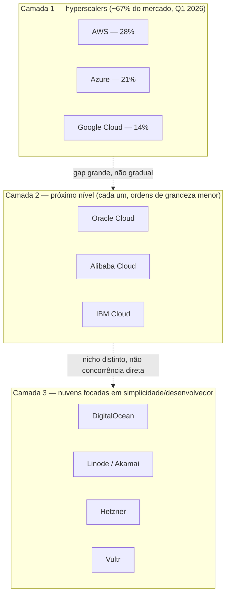
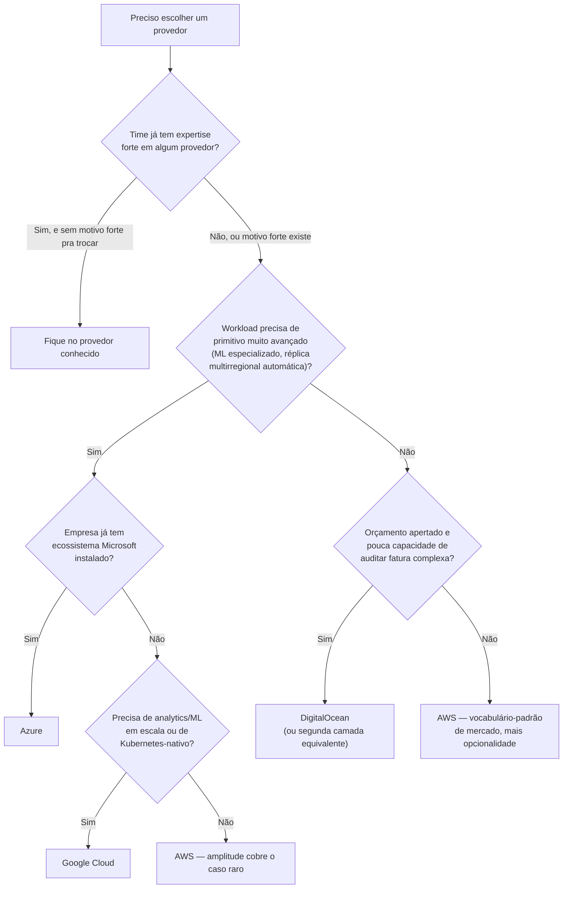

# O panorama dos provedores

> [!abstract] TL;DR
> O mercado de nuvem tem uma forma bem definida: três hyperscalers (AWS, Azure, Google Cloud) concentram a maior parte do gasto global, e abaixo deles existe uma segunda camada — DigitalOcean, Linode/Akamai, Hetzner, Vultr, Oracle Cloud, Alibaba Cloud — que não compete em amplitude de catálogo, e não devia. Cada provedor grande carrega uma filosofia de produto que explica seu catálogo mais do que qualquer tabela de preço: AWS venceu pela primazia e pela granularidade; Azure venceu pelo comprador corporativo já refém do ecossistema Microsoft; Google Cloud venceu pela engenharia — Kubernetes nasceu de dentro da própria infraestrutura do Google. DigitalOcean não está tentando vencer nesse jogo: ela aposta que uma fatia enorme de workloads nunca precisou de duzentos serviços, e que atender bem quem quer vinte é uma estratégia, não uma limitação. Esta trilha usa AWS como vocabulário-padrão de entrevista e DigitalOcean como o chão onde o leitor já pisa; Azure e GCP entram só como tradução.

## A pergunta que ninguém faz no dia a dia — até fazer

Um desenvolvedor sênior, com anos de DigitalOcean nas costas, se prepara para uma entrevista técnica internacional. O recrutador pergunta: "me fala da sua experiência com cloud". Ele começa a descrever Droplets, Managed Databases, Spaces — e percebe, no meio da frase, que o entrevistador está fazendo uma cara de quem está traduzindo mentalmente cada termo. Não porque DigitalOcean seja obscura — é uma empresa de capital aberto, com centenas de milhares de clientes — mas porque o vocabulário-padrão da indústria, o que aparece em vagas, em livros, em certificações, em conversas de corredor entre engenheiros de empresas diferentes, é o vocabulário de um provedor específico: EC2, S3, Lambda, IAM. Não porque esses nomes sejam tecnicamente superiores aos equivalentes de outros provedores — são, na maioria dos casos, a mesma ideia com um nome diferente — mas porque esse provedor chegou primeiro, cresceu mais, e seu vocabulário virou o esperanto acidental da profissão.

Essa cena é o motivo real de existir uma nota como esta. As quatro anteriores desta trilha já equiparam o leitor com os conceitos:

- **Nota 01** — o que é a computação em nuvem.
- **Nota 02** — por que ela é economicamente diferente de comprar servidor (capex vs opex, elasticidade).
- **Nota 03** — quanto da pilha cada modelo de serviço (IaaS/PaaS/CaaS/FaaS/SaaS) tira das suas mãos.
- **Nota 04** — onde essa infraestrutura fisicamente mora, e de quem ela é (público/privado/híbrido/multi-cloud).

Falta uma peça que não é conceitual — é de contexto de mercado: **quem são os jogadores**, por que o catálogo de cada um parece do jeito que parece, e por que, especificamente, esta trilha decidiu ensinar tudo através da lente de dois provedores — AWS e DigitalOcean — e não de outra combinação qualquer.

## O mercado tem uma forma, e ela é bem desigual

Comece pelo tamanho relativo, porque ele explica muita coisa antes mesmo de entrar em filosofia de produto. Segundo a Synergy Research Group — a consultoria de referência mais citada para esse número específico, porque rastreia receita trimestral reportada pelos próprios provedores — o gasto empresarial mundial em infraestrutura de nuvem no primeiro trimestre de 2026 somou US$ 129 bilhões, com participação de mercado de **28% para AWS, 21% para Microsoft Azure e 14% para Google Cloud**. Juntos, os três somam 67% do mercado de nuvem pública nesse mesmo trimestre — o número que a própria Synergy usa ("the top three account for 67% of the market") ao descrever o "Big Three": não porque sejam os únicos provedores de peso, mas porque a distância entre eles e o quarto colocado é desproporcional ao resto da lista. Num levantamento anterior da mesma consultoria, referente ao terceiro trimestre de 2025, o combinado dos três era de 63% — a diferença entre os dois números, de um trimestre de referência para outro, já é a prova de que vale mais memorizar a ordem de grandeza do que o dígito exato. Naquele levantamento anterior, a distância entre o terceiro colocado (Google) e o quarto (Alibaba Cloud) já era descrita como "quase quatro vezes" — um salto muito maior do que o intervalo entre primeiro e terceiro lugar.



> [!info] Caducidade
> Números de participação de mercado verificados em 2026-07-20, com base em dados da Synergy Research Group para o **primeiro trimestre de 2026** (28% AWS / 21% Azure / 14% Google Cloud, sobre gasto empresarial em infraestrutura de nuvem; combinado de 67% para o "Big Three", número que a própria Synergy usa para o segmento de nuvem pública desse mesmo trimestre). Esse número **envelhece rápido** — trimestre a trimestre, e mudou de forma perceptível mesmo entre o terceiro trimestre de 2025 (29%/20%/13% individual, 63% combinado, segundo a mesma fonte) e o primeiro de 2026. Trate como ordem de grandeza — "AWS lidera com folga, Azure em segundo, Google crescendo mais rápido que os dois em termos percentuais" — não como número a decorar. Confira o trimestre mais recente antes de citar isso em entrevista ou decisão de arquitetura.

Vale notar o que esse número mede e o que ele não mede. "Participação de mercado" aqui é gasto em infraestrutura de nuvem (IaaS/PaaS, essencialmente) — não conta SaaS, não conta a base instalada de pequenos desenvolvedores que rodam um punhado de VMs para projetos pessoais ou side businesses, e não captura DigitalOcean, Hetzner, Vultr ou Linode como fatias individuais visíveis, porque cada uma delas, isoladamente, é pequena demais frente aos hyperscalers para aparecer como linha própria nesse tipo de levantamento — elas entram, quando entram, dentro de agregados residuais como "outros". Isso não é acidente editorial: é o retrato exato do tamanho relativo. Para dar um número concreto e sourced dessa disparidade, sem inventar percentual que a consultoria não divulga: a DigitalOcean fechou o ano fiscal de 2025 inteiro com receita de US$ 901 milhões (alta de 15% ano a ano, segundo o próprio relatório de resultados da empresa) — a AWS sozinha reporta, num único trimestre, receita da ordem de dezenas de bilhões de dólares. Não são concorrentes no mesmo campeonato de receita; e, como a seção seguinte vai argumentar, tudo bem — porque não é esse o jogo que a DigitalOcean está jogando.

> [!info] Caducidade
> Receita da DigitalOcean referente ao ano fiscal de 2025 (US$ 901 milhões, +15% ano a ano), conforme divulgação oficial de resultados de fevereiro de 2026, verificada em 2026-07-20. Números trimestrais e anuais mudam a cada divulgação de resultado — confira o relatório mais recente antes de citar.

> [!tip] Assista: AWS vs Azure vs GCP - Which One Should You Choose?
> **Canal:** Tech With Soleyman | **Duração:** ~13min | **Idioma:** EN
>
> O vídeo cita percentuais de mercado diferentes dos desta nota (32%/23%/10%, de outra fonte e período) — o que, por si só, ilustra o alerta de caducidade acima: a ordem de grandeza (AWS lidera com folga, Azure em segundo, Google mais novo e menor) se mantém entre fontes; o dígito exato, não.
> Trecho de destaque [01:48]: *"the cloud computing market is booming and expected to reach a 2,432 billion market by 2030. AWS, Azure and GCP are the three big players in this market and collectively they hold 64% of the total market share"*
>
> 🎬 [Assistir no YouTube](https://www.youtube.com/watch?v=A1lIxZ0AZEE)

## AWS — amplitude e primazia

A Amazon Web Services nasceu na primavera de 2006, com dois serviços lançados com meses de diferença: S3 (armazenamento de objetos) e EC2 (máquinas virtuais sob demanda). Segundo o próprio relato oficial da empresa sobre sua origem, a ideia fundadora era permitir que qualquer desenvolvedor — nas palavras usadas pela própria AWS, "até um estudante num quarto de dormitório universitário" — tivesse acesso ao mesmo tipo de infraestrutura de computação que as maiores empresas do mundo, sem precisar comprar, instalar e operar hardware físico primeiro. O ponto de partida foi a própria dor da Amazon.com: construir e operar infraestrutura era caro, lento e distraía times de engenharia do problema de negócio real.

Essa combinação — pioneirismo real (não é *marketing* dizer que a AWS chegou primeiro; a nota 01 desta trilha já registrou 2006 como o ano-marco do IaaS moderno) mais quase duas décadas de reinvestimento contínuo — é o que explica a característica mais citada da AWS por quem já usou o console dela: a **amplitude**. Ela raramente resolve um problema com um serviço só:

- Fila de mensagens: não é um serviço — são vários (SQS, SNS, EventBridge, MQ), cada um otimizado para um padrão de uso diferente.
- Rodar código sem gerenciar servidor: não é um jeito — são vários (Lambda, Fargate, opções híbridas entre os dois).
- Banco de dados gerenciado: não é um jeito — são muitos (RDS com cinco engines diferentes, Aurora, DynamoDB, DocumentDB, Keyspaces).

Essa amplitude é, ao mesmo tempo, a maior força e o maior custo de entrada da AWS: o catálogo é tão granular que a curva de aprendizado de "qual serviço eu deveria escolher aqui" vira, ela mesma, uma habilidade a dominar — e a superfície de decisões de configuração (e, por consequência, de cobrança) é proporcional a essa granularidade. Um engenheiro que já trabalhou fundo com AWS reconhece o padrão: raramente existe "o jeito" de fazer algo — existem cinco jeitos, cada um com um trade-off de custo, latência, operação e limite diferente, e escolher entre eles é parte do trabalho.

## Azure — o caminho da empresa

A Microsoft não entrou em nuvem para competir com startups. Entrou para não perder o cliente que já tinha. A força estrutural do Azure não é (e nunca foi primariamente) a elegância técnica de um serviço isolado — é a integração profunda com um ecossistema corporativo que já dominava o mundo empresarial antes da nuvem existir: Windows Server, Active Directory, Office/Microsoft 365, licenciamento corporativo negociado por décadas com departamentos de TI. A peça mais ilustrativa disso é a identidade: o Microsoft Entra ID (o nome atual do que era Azure Active Directory) é hoje descrito pela própria Microsoft como o núcleo de identidade que conecta Azure, Microsoft 365 e Windows — e a maioria das organizações de porte médio a grande que já rodavam Active Directory local, para autenticação de estações de trabalho e servidores, consegue estender essa mesma identidade para a nuvem via sincronização, sem reconstruir de novo o cadastro de usuários e permissões, num modelo que a própria documentação da Microsoft chama de **identidade híbrida** e trata como padrão corrente de TI empresarial, não como caso de borda.

Some a isso a força histórica do Azure em híbrido — a nota 04 já citou o Azure Stack como concorrente direto do AWS Outposts — e o resultado é um provedor cuja proposta de valor central não é "o catálogo mais largo" nem "o preço mais previsível", mas "o caminho de menor atrito para a empresa que já vive dentro do mundo Microsoft". Isso explica por que o Azure aparece, com frequência desproporcional ao seu market share isolado, em conversas de CIOs e diretores de TI de empresas tradicionais — bancos, seguradoras, governo, manufatura — que têm décadas de investimento em infraestrutura Microsoft e um comprador corporativo que já confia (e já paga licenciamento) para essa marca.

## Google Cloud — engenharia de dados, Kubernetes e rede

Se a força da AWS é ter chegado primeiro e a força do Azure é o comprador cativo, a força do Google Cloud é a mais tecnicamente carregada das três: o Google construiu, para operar sua própria escala interna — busca, Gmail, YouTube, Google Maps —, um sistema de gerenciamento de containers chamado **Borg**, rodando em produção desde o início dos anos 2000, muito antes de "container" virar palavra comum fora do Google. Em 2014, o Google abriu ao mundo uma versão reformulada, open source, dessas ideias: o Kubernetes. A documentação oficial do projeto Kubernetes é explícita sobre a linhagem — muitos dos engenheiros que construíram o Kubernetes vieram diretamente do time do Borg, e conceitos centrais do Kubernetes de hoje (Pods, Services, o próprio modelo de agendamento de containers) têm equivalentes diretos e rastreáveis no Borg. Não é força de marketing — é a experiência de operar containers em escala planetária, por mais de uma década, virando produto público.

Essa origem explica onde o Google Cloud historicamente concentra sua vantagem percebida — em cada área, o padrão se repete: experiência interna, resolvida em escala planetária antes de qualquer concorrente ter o problema, depois transbordando para produto público:

- **Orquestração de containers** — o serviço gerenciado de Kubernetes do Google, GKE, carrega a herança direta do Borg.
- **Engenharia e análise de dados em larga escala** — BigQuery, um dos serviços mais citados da casa, nasceu da mesma cultura interna de processar volumes de dados que poucas empresas no mundo já tiveram que resolver antes do Google.
- **Rede** — o backbone de fibra privada do Google, construído para conectar seus próprios datacenters ao redor do mundo, também sustenta parte da proposta de rede do Google Cloud.
- **Machine learning** — pesquisa interna do Google (papers, frameworks, hardware especializado como as TPUs) transbordou para produto público.

O padrão fica visível: o Google Cloud vende, com mais legitimidade que qualquer concorrente, a experiência de quem já resolveu o problema em casa antes de vender a solução.

## DigitalOcean — simplicidade como estratégia de produto, não como versão menor da AWS

Aqui é onde vale mais cuidado, porque a armadilha de raciocínio mais comum é ler o catálogo pequeno da DigitalOcean como "o que ainda falta construir" — como se a empresa estivesse numa corrida atrás da AWS e simplesmente não tivesse chegado lá ainda. Essa leitura está errada, e a própria declaração de missão da empresa deixa isso claro: **simplificar a computação em nuvem para que desenvolvedores e empresas gastem mais tempo criando software, e menos tempo administrando infraestrutura.** Não é ausência de ambição — é uma ambição diferente da ambição da AWS.

Pense no problema que a DigitalOcean resolveu resolver. Um time pequeno, ou um desenvolvedor solo, que precisa subir uma API, um banco de dados e um bucket de armazenamento não precisa escolher entre doze tipos de instância de computação, cada um com uma tabela de preço diferente por hora, por segundo, por reserva antecipada — precisa de **um** jeito de fazer isso, bem documentado, com preço fixo e previsível, sem surpresa na fatura no fim do mês.

A DigitalOcean apostou — e continua apostando, como mostra sua trajetória de produto — em manter o catálogo deliberadamente pequeno e a experiência deliberadamente simples, mesmo enquanto cresce em capacidade:

1. **Droplets** — VMs simples, primeiro produto da empresa.
2. **Managed Databases** — bancos gerenciados, preço previsível.
3. **App Platform** — PaaS para quem não quer nem administrar a VM.
4. **Managed Kubernetes (DOKS)** — orquestração, para quem já cresceu o suficiente para precisar dela.

Isso é uma decisão de produto ativa, revisitada a cada lançamento novo, não um limite técnico: a empresa poderia, em tese, replicar cada nicho de serviço da AWS um a um — e conscientemente não faz isso, porque cada serviço novo adicionado é também complexidade nova imposta sobre o cliente que só queria simplicidade.

A documentação da DigitalOcean, com frequência elogiada mesmo por quem não usa a plataforma no dia a dia, é parte da mesma estratégia, não um adicional cosmético: documentação notável reduz o tempo entre "eu quero fazer X" e "X está funcionando" — que é exatamente a métrica que a DigitalOcean otimiza. Uma forma útil de guardar essa diferença: a AWS vende **opcionalidade** — cem jeitos de fazer a mesma coisa, cada um afinado para um caso de uso específico. A DigitalOcean vende **decisão já tomada** — um jeito bom o suficiente para a grande maioria dos casos, sem pedir que você primeiro se torne especialista em avaliar as outras noventa e nove opções.

## A filosofia de cada provedor, num único quadro

As quatro seções anteriores contaram a origem de cada provedor em prosa. Vale destilar isso numa tabela de consulta rápida — não repete o argumento, resume ele para referência futura:

| Provedor | Aposta central | Força | Custo dessa escolha | Perfil de quem se dá bem |
|---|---|---|---|---|
| AWS | Amplitude de catálogo, granularidade máxima | Sempre existe um serviço afinado para o seu caso de uso específico | Curva de decisão íngreme — "qual dos cinco jeitos eu uso aqui" vira habilidade própria | Times com engenharia de plataforma dedicada, ou que precisam de um primitivo muito específico |
| Azure | Integração com o ecossistema Microsoft já instalado | Caminho de menor atrito para quem já vive em Active Directory / Microsoft 365 | Menos vantagem se a empresa não tem esse legado Microsoft para começo de conversa | Empresas tradicionais (bancos, seguradoras, manufatura) com décadas de infraestrutura Microsoft |
| Google Cloud | Engenharia interna transbordando para produto público (Borg → Kubernetes, dados em escala, ML) | Referência em orquestração de containers, analytics (BigQuery) e machine learning | Presença de mercado e ecossistema de parceiros menor que AWS/Azure | Times de dados/ML, ou qualquer time que já pensa "Kubernetes-nativo" |
| DigitalOcean | Simplicidade deliberada — decisão já tomada em vez de opcionalidade | Menor tempo entre "eu quero X" e "X funcionando"; fatura previsível | Catálogo não cobre primitivos muito avançados (replicação multirregional automática, hardware de ML especializado) | Times pequenos, produtos com perfil de carga estável, orçamento apertado para auditar fatura |

## Por que existe uma segunda camada — e por que ela não é caridade

A pergunta honesta que fica depois de ver o tamanho relativo do mercado é: por que qualquer empresa escolheria um provedor de segunda camada, se os hyperscalers têm mais serviço, mais região, mais gente contratada trabalhando em confiabilidade?

A resposta séria tem dois lados, e os dois merecem peso — não é uma questão de qual lado está "certo" em abstrato, é uma questão de qual lado descreve o workload real que está na sua frente.

**O lado que favorece o hyperscaler:** para uma organização que já opera em escala, a amplitude de catálogo deixa de ser ruído e vira ferramenta. Os sinais mais comuns de que esse é o caso:

- Centenas de microsserviços e times de plataforma dedicados a operá-los.
- Exigência regulatória de certificações específicas que só o catálogo mais amplo cobre.
- Necessidade de serviços gerenciados muito avançados — bancos de dados serverless com replicação global, machine learning com hardware especializado, redes privadas complexas atravessando múltiplas regiões.

O custo de aprender um serviço a mais é pequeno frente ao valor de ter exatamente o primitivo certo disponível quando a necessidade aparece.

**O lado que favorece a segunda camada:** a maior parte dos workloads do mundo real — a nota 02 desta trilha já tocou nesse ponto ao falar de elasticidade e carga previsível — nunca chega perto de precisar dessa amplitude. Alguns perfis típicos:

- Um SaaS B2B de porte médio.
- Um e-commerce regional.
- Um produto interno de uma empresa que não é, ela mesma, uma empresa de tecnologia.
- Um MVP de startup em validação.

A lista de primitivos que esses workloads realmente usam — VM, banco relacional gerenciado, armazenamento de objetos, um load balancer, um serviço de cache — cabe, quase sempre, dentro do catálogo pequeno e simples de um provedor de segunda camada. Pagar a "taxa cognitiva" de aprender e operar um catálogo de duzentos serviços para usar cinco deles é custo puro, não investimento — o equivalente arquitetural de comprar um avião para atravessar a rua.

A DigitalOcean é a mais conhecida dessa segunda camada voltada a desenvolvedores, mas não está sozinha nela — e vale nomear quem mais divide esse espaço, porque cada um chegou lá por um caminho ligeiramente diferente. Nenhuma dessas empresas está tentando ser "a próxima AWS" — as quatro primeiras competem no mesmo território conceitual da DigitalOcean (previsibilidade, simplicidade, preço claro); as duas últimas jogam um jogo distinto:

| Provedor | Categoria | O que a diferencia |
|---|---|---|
| Linode / Akamai | Segunda camada, simplicidade | Adquirida pela Akamai, opera como "Akamai Cloud Computing" — soma a rede de borda global da Akamai à mesma lógica de simplicidade |
| Hetzner | Segunda camada, simplicidade | Origem alemã, preço agressivo, forte presença de rede europeia, catálogo ainda mais enxuto que o da DigitalOcean |
| Vultr | Segunda camada, simplicidade | Cobertura global de datacenters e opções de bare metal |
| Oracle Cloud | Ambição de catálogo mais próxima do hyperscaler | Aposta pesado em cargas de banco de dados corporativo — herança direta do próprio negócio histórico da empresa |
| Alibaba Cloud | Ambição de catálogo mais próxima do hyperscaler | Domina o mercado chinês e o Sudeste Asiático de um jeito que os hyperscalers ocidentais não replicam com a mesma força |

Todas, das seis, ainda são ordens de grandeza menores que o "Big Three" em participação de mercado global.

## Por que esta trilha escolheu AWS e DigitalOcean

Duas escolhas, dois motivos diferentes — e vale nomeá-los com honestidade, porque nenhum dos dois é "porque é o melhor provedor em abstrato".

**AWS entra porque é o vocabulário-padrão de entrevista técnica e o catálogo mais completo.** A cena do início desta nota — o desenvolvedor sênior tropeçando na tradução mental durante uma entrevista — é exatamente o problema que essa escolha resolve. Aprender os conceitos através da lente AWS significa que o vocabulário aprendido aqui **traduz** para qualquer conversa técnica no mercado internacional: quem entende o que é EC2, S3, Lambda, IAM e VPC entende, por extensão direta, o que Compute Engine, Cloud Storage, Cloud Functions e IAM fazem no Google Cloud, e o que Virtual Machines, Blob Storage, Functions e o Entra ID fazem no Azure — os conceitos por trás dos nomes raramente mudam de um provedor hyperscaler para outro; muda o rótulo. Além disso, a amplitude de catálogo da AWS significa que, quando esta trilha precisar mostrar um primitivo mais avançado ou mais específico — coisas que a DigitalOcean, por decisão de produto, simplesmente não oferece —, a AWS quase sempre tem alguma versão dele para servir de exemplo concreto.

**DigitalOcean entra porque é onde o leitor já trabalha, e porque a simplicidade dela deixa o conceito visível.** Essa segunda razão é tão importante pedagogicamente quanto a primeira, e fácil de subestimar: quando um conceito é ensinado através de um provedor com vinte opções de configuração para a mesma decisão, uma fração real do esforço de aprendizado vai para navegar as opções — não para entender o conceito em si. A DigitalOcean, ao reduzir cada decisão a "aqui está o jeito bom o suficiente", deixa o conceito nu, sem o ruído de configuração ao redor. Isso não substitui o aprendizado da amplitude AWS — substitui o primeiro contato, tornando-o mais rápido e menos frustrante, antes de escalar para a versão mais rica e mais granular do mesmo conceito.

**Azure e GCP entram só como tradução** — a tabela abaixo, e menções pontuais de vocabulário ao longo da trilha, quando ajudam a situar um conceito no panorama mais amplo do mercado. Esta trilha não ensina passo a passo, console ou precificação de Azure ou GCP; o objetivo, nesse eixo, é só garantir que o leitor reconheça o nome equivalente quando aparecer numa vaga, numa entrevista, ou numa arquitetura existente que usa outro provedor.

## A tabela de tradução

Esta é a tabela mais completa da trilha até aqui, porque cobre os primitivos que os próximos galhos vão desenvolver em profundidade. Os nomes aparecem só como **vocabulário** — o que cada um faz, em profundidade técnica, é assunto dos blocos 2 e 3 desta trilha.

| Conceito | AWS | Azure | GCP | DigitalOcean |
|---|---|---|---|---|
| Compute (VM) | EC2 | Virtual Machines | Compute Engine | Droplets |
| Serverless / FaaS | Lambda | Azure Functions | Cloud Functions / Cloud Run functions | Functions (App Platform) |
| Containers gerenciados | ECS / Fargate | Container Apps / Container Instances | Cloud Run | App Platform (containers) |
| Kubernetes gerenciado | EKS | AKS | GKE | DOKS (DigitalOcean Kubernetes) |
| Object storage | S3 | Blob Storage | Cloud Storage | Spaces |
| Block storage | EBS | Managed Disks | Persistent Disk | Volumes (Block Storage) |
| Banco relacional gerenciado | RDS | Azure SQL Database / Database for PostgreSQL, MySQL | Cloud SQL | Managed Databases (Postgres/MySQL) |
| NoSQL | DynamoDB | Cosmos DB | Firestore / Bigtable | Managed MongoDB (engine nativo) / Valkey |
| Cache | ElastiCache | Azure Cache for Redis | Memorystore | Managed Valkey (ex-Redis) |
| Load balancer | Elastic Load Balancing (ALB/NLB) | Azure Load Balancer / Application Gateway | Cloud Load Balancing | Load Balancers |
| CDN | CloudFront | Azure CDN / Front Door | Cloud CDN | Spaces CDN |
| DNS | Route 53 | Azure DNS | Cloud DNS | DigitalOcean DNS |
| Rede privada | VPC | Virtual Network (VNet) | VPC | VPC (DigitalOcean) |
| Identidade / IAM | IAM | Microsoft Entra ID | Cloud IAM | IAM (papéis customizados por tipo de recurso) + Teams + API Tokens |

Repare na última linha: é a diferença mais estrutural da tabela inteira, e vale dizer com precisão, porque é nuance, não ausência de produto. A DigitalOcean tem IAM de verdade, com papéis customizados — desde 2024, dá para montar um papel que escolhe, dentre o conjunto completo de permissões da plataforma, exatamente quais ações (criar, ler, atualizar, excluir) um usuário pode executar sobre quais **tipos** de recurso: por exemplo, permitir que alguém gerencie Droplets mas não toque em Databases, ou dar acesso só de leitura a dados de uso sem permissão de alteração. Isso já é RBAC real, não apenas Times e tokens de API com escopo — a diferença de fato para os três hyperscalers está um nível abaixo: AWS, Azure e GCP conseguem escrever uma política que mira uma **instância individual** de recurso (este bucket específico, nunca aquele outro; este funcionário só pode ler este objeto, nunca escrever nele), via políticas endereçadas por ARN ou escopo equivalente — a DigitalOcean, por ora, granula por categoria de recurso, não por recurso individual dentro da categoria. Isso não é uma falha da DigitalOcean esperando para ser corrigida — é, de novo, a mesma decisão de produto: granularidade por instância individual custa complexidade de configuração adicional, e a DigitalOcean escolheu, até aqui, não empurrar esse custo extra para todo cliente que nunca vai precisar dele.

Vale ver essa diferença em código, não só em prosa. Uma política IAM da AWS pode mirar um **bucket S3 específico** — nunca um vizinho dele — via ARN (Amazon Resource Name), o identificador único de cada instância de recurso:

```json
{
    "Version": "2012-10-17",
    "Statement": [
        {
            "Sid": "ListObjectsInBucket",
            "Effect": "Allow",
            "Action": ["s3:ListBucket"],
            "Resource": ["arn:aws:s3:::nome-do-bucket"]
        },
        {
            "Sid": "AllObjectActions",
            "Effect": "Allow",
            "Action": "s3:*Object",
            "Resource": ["arn:aws:s3:::nome-do-bucket/*"]
        }
    ]
}
```

Repare no `Resource`: é um bucket nomeado, não "todo bucket do tipo S3". Um papel customizado da DigitalOcean, por comparação, não desce a esse nível — ele escolhe ações sobre a **categoria** "Databases" ou "Droplets" inteira, não sobre um banco de dados nomeado dentro dela. É a mesma lacuna descrita em prosa acima, agora visível na forma do JSON: a AWS precisa de um `Resource` com ARN porque o modelo dela é "granularidade por instância"; a DigitalOcean não tem esse campo porque o modelo dela é "granularidade por categoria" — não é um campo que falta por limitação técnica, é um campo que o modelo de produto não pede.

> [!info] Fronteira
> Cada linha desta tabela aparece aqui só como nome. O que cada serviço faz, como se configura, seus limites reais e suas armadilhas de custo são o assunto dos blocos 2 e 3 desta trilha — compute, storage, rede, banco de dados, containers e identidade cada um em seu próprio galho dedicado. O retrato de família traçado nesta nota — AWS, Azure, GCP e DigitalOcean lado a lado, provedor por provedor — também vira retrato individual mais à frente: o **galho 21** ("AWS a fundo — consolidação") e o **galho 22** ("DigitalOcean a fundo — consolidação") juntam tudo o que os galhos anteriores ensinaram sobre cada provedor específico numa visão consolidada única, depois que os primitivos já foram todos vistos em profundidade.

## As CLIs lado a lado — a mesma operação, quatro provedores

A tabela de tradução mostra os nomes. Nada ancora um nome melhor do que ver o comando de verdade. As quatro CLIs abaixo — `aws`, `az`, `gcloud`, `doctl` — resolvem a mesma pergunta duas vezes: "quais instâncias de computação eu tenho rodando?" e "quais regiões esse provedor oferece?". Repare no padrão comum apesar do vocabulário diferente: verbo de listagem, escopo do recurso, e quase sempre uma forma de filtrar a saída.

**Autenticar a CLI — o primeiro comando antes de qualquer um dos outros:**

Antes de listar qualquer coisa, cada CLI precisa saber quem você é. O padrão se repete: um comando interativo de login (ou um jeito de injetar uma credencial não-interativa, para automação), e o resto dos comandos passa a assumir uma identidade já resolvida.

```bash
# AWS — configura access key, secret key, região e formato de saída padrão
aws configure
```

```bash
# Azure — abre o navegador para login interativo (ou --use-device-code em ambiente sem navegador)
az login
```

```bash
# GCP — mesmo padrão: login interativo via navegador
gcloud auth login
```

```bash
# DigitalOcean — pede um token de API pessoal gerado no painel
doctl auth init
```

**Listar instâncias de computação:**

```bash
# AWS — lista todas as instâncias EC2 da conta na região configurada
aws ec2 describe-instances
```

```bash
# Azure — lista todas as VMs; -d traz IP público, FQDN e estado de energia
az vm list -d
```

```bash
# GCP — lista todas as instâncias do Compute Engine no projeto ativo
gcloud compute instances list
```

```bash
# DigitalOcean — lista todos os Droplets da conta
doctl compute droplet list
```

**Listar regiões disponíveis:**

```bash
# AWS — regiões habilitadas para a conta atual
aws ec2 describe-regions
```

```bash
# Azure — todas as localizações (regiões) do Azure
az account list-locations
```

```bash
# GCP — todas as regiões do Compute Engine
gcloud compute regions list
```

```bash
# DigitalOcean — datacenters disponíveis, com slug (usado em outros comandos doctl)
doctl compute region list
```

**Filtrar a saída para só o essencial:**

A saída bruta de qualquer um desses comandos é um despejo de JSON com dezenas de campos. Todas as quatro CLIs têm um jeito de recortar isso — e o jeito escolhido por cada uma já é uma pista da filosofia do provedor: AWS e Azure usam JMESPath na flag `--query` (a mesma linguagem de consulta nas duas CLIs), GCP usa seu próprio formato de template na flag `--format`, e a DigitalOcean resolve com um nome de coluna simples, também em `--format`.

```bash
# AWS — JMESPath: nome da tag "Name" + estado, em tabela
aws ec2 describe-instances --query "Reservations[].Instances[].{Nome:Tags[?Key=='Name']|[0].Value,Estado:State.Name}" --output table
```

```bash
# Azure — --query é uma flag global do az, também JMESPath
az vm list -d --query "[].{Nome:name,Estado:powerState}" --output table
```

```bash
# GCP — --format aceita um template próprio, não JMESPath
gcloud compute instances list --format="table(name,zone,status)"
```

```bash
# DigitalOcean — --format seleciona colunas pelo nome, sem linguagem de consulta separada
doctl compute droplet list --format Name,Region,Status
```

> [!info] Caducidade
> Sintaxe de CLI muda entre versões — flags são adicionadas, renomeadas ou depreciadas. Os comandos acima foram conferidos contra a documentação oficial de cada provedor em 2026-07-21, mas rode `--help` (ou `-h`) antes de colar qualquer um deles num terminal de produção: `aws ec2 describe-instances help`, `az vm list --help`, `gcloud compute instances list --help`, `doctl compute droplet list --help`.

> [!info] Fronteira
> Estes comandos só listam. Criar, redimensionar e destruir recursos via CLI — e o `doctl` e o `aws` no dia a dia de operação — é assunto dos galhos de compute mais à frente. Aqui o objetivo é só provar, na prática, que a tabela de tradução não é abstrata: o mesmo verbo (`list`/`describe`) aparece nas quatro CLIs, só o substantivo muda.

## Como escolher um provedor — critérios honestos

Fora do contexto de aprendizado desta trilha, uma pergunta prática real aparece com frequência: como uma equipe decide, de verdade, em qual provedor construir algo novo? Alguns critérios costumam pesar mais do que a comparação de preço linha a linha que domina a conversa inicial:

| Critério | Pergunta a se fazer | Quando pesa mais |
|---|---|---|
| Expertise do time | Quanto conhecimento operacional acumulado (padrões de falha, truques de configuração) o time já tem num provedor específico? | Sempre — migrar sem motivo forte descarta capital acumulado que raramente transfere entre provedores |
| Dados e integrações existentes | Onde já vivem sua base de clientes, parceiros e sistemas legados? | Empresas com ecossistema já instalado (o caso Azure/Microsoft é o mais claro) — sair tem custo organizacional e contratual, não só técnico |
| Presença regional | O provedor tem datacenter real nas regiões que sua arquitetura ou sua exigência legal de soberania de dados exigem? | Workloads com requisito legal de onde o dado fica (a nota 04 já cobriu isso) |
| Previsibilidade de custo | O time tem capacidade de auditar fatura complexa toda semana, ou precisa de preço fixo e simples? | Times pequenos, orçamento apertado — mesmo que o preço nominal por unidade pareça mais competitivo do outro lado |
| Profundidade de serviço gerenciado | O workload precisa de um primitivo muito avançado (réplica multirregional automática, hardware de ML especializado)? | Workloads que já sabem, com certeza, que vão precisar desse primitivo — não "pode ser que precise" |



> [!info] Fronteira
> Esta árvore é um ponto de partida, não uma fórmula fechada — a seção anterior sobre "por que existe uma segunda camada" já mostrou que a resposta certa depende do perfil real de carga, não só destes cinco critérios isolados.

**O peso real do lock-in — nem zero, nem infinito.** É tentador tratar lock-in como um monstro a evitar a qualquer custo, ou como algo que simplesmente não importa. Nenhuma das duas posturas é honesta. Lock-in tem peso real quando o serviço usado é altamente proprietário e o custo de troca é alto — mas também tem peso zero, na prática, para a fatia enorme de decisões que usam primitivos padronizados (uma VM é uma VM, um banco Postgres gerenciado fala o mesmo protocolo Postgres em qualquer provedor). Avaliar lock-in caso a caso, serviço a serviço, é mais honesto do que uma regra geral de "sempre evite" ou "nunca importa".

> [!info] Fronteira
> Lock-in, portabilidade e comparação de catálogo Azure/GCP em profundidade são o assunto do **galho 23** desta trilha ("Panorama multi-cloud e portabilidade"). Esta nota nomeou o critério; o galho 23 desenvolve a estratégia.

## Casos práticos

**A startup que escolheu DigitalOcean e nunca se arrependeu, porque nunca precisou do que não tinha.** Uma equipe pequena, construindo um produto SaaS B2B de nicho, avalia provedores no início do projeto. A lista de necessidades reais — VM para a aplicação, banco Postgres gerenciado, um bucket de armazenamento de objetos para uploads de usuário, um load balancer simples — cabe inteira dentro do catálogo da DigitalOcean. Dois anos depois, com o produto em produção e crescendo, a equipe ainda não encontrou uma necessidade real que a DigitalOcean não atenda — porque o perfil de carga do produto nunca saiu do território que o catálogo enxuto cobre bem. A decisão nunca precisou ser revisitada, não por sorte, mas porque o catálogo escolhido combinava com o problema real.

**O time de dados que escolheu Google Cloud especificamente pelo BigQuery, mesmo com o resto da empresa na AWS.** Uma empresa de porte médio, com sua infraestrutura de produção inteira na AWS, decide colocar seu pipeline de analytics e data warehouse no Google Cloud especificamente, aceitando conscientemente operar em dois provedores (o "multi-cloud de fato" descrito na nota 04) porque a maturidade do BigQuery para consultas analíticas em grande volume superava, na avaliação técnica do time, qualquer ganho de simplicidade operacional de manter tudo num único provedor. A decisão foi deliberada, documentada e revisitada periodicamente — não um acidente de escolhas locais não coordenadas.

**O engenheiro que passou na entrevista porque sabia traduzir, não porque sabia decorar.** Um candidato, com anos de experiência prática em DigitalOcean, se prepara para entrevistas em empresas que operam AWS. Em vez de tentar aprender AWS do zero decorando nomes de serviço, ele investe em entender os **conceitos** por trás de cada camada — o que um object storage faz, por que um load balancer existe, como um banco relacional gerenciado tira operação das suas mãos — e treina a tradução consciente: "isso que eu já fiz com Spaces é a mesma ideia do S3; isso que eu já fiz com Managed Database é a mesma ideia do RDS". A entrevista corre bem não porque ele fingiu ter experiência que não tinha, mas porque demonstrou exatamente a habilidade que interessa a um time sênior: entender o conceito profundamente o suficiente para reconhecê-lo debaixo de qualquer nome.

**O time de plataforma que descobriu o custo real de operar duas CLIs.** Uma empresa que cresceu rápido acabou com produção na AWS e o pipeline de dados no Google Cloud — a mesma situação descrita no segundo caso acima. Meses depois, um novo engenheiro de plataforma nota algo que ninguém tinha formalizado: o time gasta tempo real, toda semana, alternando contexto mental entre `aws ec2 describe-instances --query "..."` e `gcloud compute instances list --format="..."` — duas sintaxes de filtro diferentes para a mesma pergunta. A solução não foi abandonar nenhum dos dois provedores (o BigQuery continuava justificando a escolha) — foi documentar, num runbook interno, a tabela de tradução de comandos mais usados no dia a dia, exatamente no formato que esta nota usou acima. O ponto pedagógico: a "taxa cognitiva" de operar múltiplos provedores, mencionada mais cedo nesta nota como argumento a favor da segunda camada, também se aplica dentro do próprio mundo hyperscaler — não é exclusiva de comparar hyperscaler com provedor simples.

## Armadilhas comuns

> [!warning] Tratar o catálogo pequeno da DigitalOcean como "DigitalOcean ainda não chegou lá"
> O catálogo enxuto é decisão de produto, revisitada a cada lançamento, não uma corrida atrás da AWS em que a DigitalOcean está perdendo. Julgar um provedor pela contagem de serviços no catálogo, sem perguntar que público ele está deliberadamente servindo, é comparar duas estratégias diferentes como se fossem a mesma competição.

> [!warning] Decorar market share como se fosse um número fixo
> Participação de mercado muda a cada trimestre, e a diferença entre os relatórios de dois trimestres consecutivos da mesma consultoria já mostrada nesta nota (29%/20%/13%, combinado 63%, no terceiro trimestre de 2025 contra 28%/21%/14%, combinado 67%, no primeiro de 2026) é prova de que não vale a pena memorizar o número exato — vale memorizar a ordem de grandeza e a forma do mercado (hyperscalers concentrados, segunda camada bem menor, gap grande entre os dois grupos).

> [!warning] Confundir "provedor mais popular" com "provedor certo para este workload"
> A AWS ser o vocabulário-padrão de entrevista não significa que ela é sempre a escolha técnica certa para um projeto real. Os critérios da seção anterior — expertise do time, presença regional, previsibilidade de custo, profundidade de serviço necessária — importam mais, na prática, do que popularidade de mercado na hora de escolher onde construir algo de verdade.

## O que vem a seguir

Esta nota mapeou os jogadores — quem são, que filosofia carregam, e por que esta trilha escolheu ensinar através de AWS e DigitalOcean, com Azure e GCP como tradução. Mas conhecer o mapa do mercado não é o mesmo que saber pensar como alguém que projeta para a nuvem. Falta a mudança mais difícil de todas — não uma peça de conhecimento nova, mas uma reforma na cabeça de quem já sabe projetar sistemas do jeito antigo: a virada de pensar em servidores fixos, que você aloca e mantém, para pensar em serviços elásticos, que aparecem e desaparecem conforme a demanda pede.

O vocabulário desta nota — EC2, Droplets, GKE, Azure VMs — descreve **onde** os primitivos moram em cada provedor. A próxima nota muda o eixo: não é mais "qual provedor tem o quê", é "como eu penso sobre capacidade quando ela deixa de ser um servidor fixo que eu ligo e desligo, e passa a ser um número que sobe e desce sozinho". Essa é a última nota do galho 1, **"A virada mental — pensar em serviços, não em servidores"**.

## Fontes

- [Synergy Research Group — Cloud Market Annual Revenue Run Rate Topped Half a Trillion Dollars in Q1 as Growth Surge Continues](https://www.srgresearch.com/articles/cloud-market-annual-revenue-run-rate-topped-half-a-trillion-dollars-in-q1-as-growth-surge-continues) — participação de mercado do primeiro trimestre de 2026 (AWS 28%, Azure 21%, Google Cloud 14%; "Big Three" com 67% do segmento de nuvem pública nesse trimestre); acessado em 2026-07-20.
- [Synergy Research Group — Cloud Market Share Trends: Big Three Together Hold 63% While Oracle and the Neoclouds Inch Higher](https://www.srgresearch.com/articles/cloud-market-share-trends-big-three-together-hold-63-while-oracle-and-the-neoclouds-inch-higher) — dado comparativo do terceiro trimestre de 2025 (AWS 29%, Azure 20%, Google 13%) e comentário sobre o gap entre o terceiro e o quarto colocado; acessado em 2026-07-20.
- [DigitalOcean — Announces Fourth Quarter and Fiscal Year 2025 Financial Results (Investor Relations oficial)](https://investors.digitalocean.com/news/news-details/2026/DigitalOcean-Announces-Fourth-Quarter-and-Fiscal-Year-2025-Financial-Results/) — receita do ano fiscal de 2025 (US$ 901 milhões, +15% ano a ano); acessado em 2026-07-20.
- [AWS — Our Origins (página oficial)](https://aws.amazon.com/about-aws/our-origins) — data de lançamento (2006), primeiros serviços (S3 e EC2) e filosofia fundadora da AWS; acessado em 2026-07-20.
- [Kubernetes — Borg: The Predecessor to Kubernetes (blog oficial do projeto)](https://kubernetes.io/blog/2015/04/borg-predecessor-to-kubernetes/) — linhagem direta entre o sistema interno Borg do Google e o design do Kubernetes; acessado em 2026-07-20.
- [Microsoft Learn — Hybrid identity with Active Directory and Microsoft Entra ID in Azure landing zones](https://learn.microsoft.com/en-us/azure/cloud-adoption-framework/ready/landing-zone/design-area/identity-access-active-directory-hybrid-identity) — modelo de identidade híbrida como padrão corrente de TI empresarial e papel central do Entra ID na integração com o ecossistema Microsoft; acessado em 2026-07-20.
- [DigitalOcean — Identity & Access Management (página oficial de produto)](https://www.digitalocean.com/products/identity-access-management) — papéis customizados por tipo de recurso, papéis predefinidos e tokens de API com escopo; acessado em 2026-07-20.
- [DigitalOcean Docs — Managed Databases](https://docs.digitalocean.com/products/databases/) — engines nativos do Managed Databases, incluindo MongoDB como oferta de primeira classe (não via parceiros); acessado em 2026-07-20.
- [AWS CLI — ec2 describe-instances / describe-regions (referência oficial)](https://docs.aws.amazon.com/cli/latest/reference/ec2/) — sintaxe verificada dos comandos usados na seção "As CLIs lado a lado"; acessado em 2026-07-21.
- [Microsoft Learn — Azure CLI reference (az vm, az account list-locations, --query)](https://learn.microsoft.com/en-us/cli/azure/) — sintaxe verificada dos comandos `az` usados nesta nota; acessado em 2026-07-21.
- [Google Cloud — gcloud CLI reference (compute instances list, compute regions list)](https://docs.cloud.google.com/sdk/gcloud/reference/compute) — sintaxe verificada dos comandos `gcloud` usados nesta nota; acessado em 2026-07-21.
- [DigitalOcean — doctl reference (compute droplet list, compute region list)](https://docs.digitalocean.com/reference/doctl/reference/compute/) — sintaxe verificada dos comandos `doctl` usados nesta nota; acessado em 2026-07-21.
