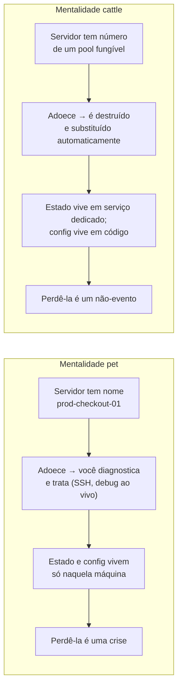
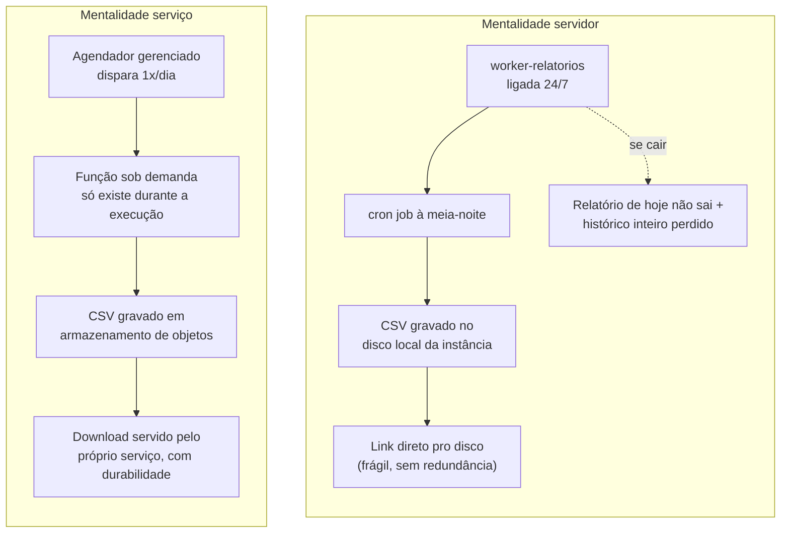

# A virada mental — pensar em serviços, não em servidores

> [!abstract] TL;DR
> As cinco notas anteriores descreveram *o que* muda com a nuvem — infraestrutura vira API, capex vira opex, você escolhe quanto da pilha gerencia, onde roda, e quem vende o quê. Esta nota fecha o galho descrevendo a mudança que importa mais e é a mais difícil de instalar: o que muda **na cabeça de quem projeta**. Servidores deixam de ter nome próprio e viram gado descartável (*cattle, not pets* — a metáfora, nascida numa apresentação de Bill Baker sobre SQL Server e popularizada para cloud por Randy Bias por volta de 2011-2012). Falha deixa de ser exceção e vira condição de operação — "everything fails all the time", frase de Werner Vogels, CTO da Amazon, dita já em 2008. Gerenciado vira o padrão, não a exceção — mas só até você ter um motivo concreto de sobra pra desobedecer. E duas dimensões que antes eram revisão pós-projeto — custo e segurança — viram parte do desenho desde a primeira linha. Nada disso substitui os fundamentos de engenharia que você já tem; a nuvem não te salva de arquitetura ruim, só te deixa errar (e acertar) mais rápido.

## O incidente que devolve, em vez de reparar

São três da manhã de uma terça-feira qualquer. Um alerta dispara: a instância que serve o endpoint de checkout parou de responder. Duas equipes, duas respostas possíveis.

Na primeira, o engenheiro de plantão acorda, entra por SSH na máquina — vamos chamá-la de `prod-checkout-01`, porque ela tem nome, tem duas anotações antigas no wiki interno sobre uma vez em que um disco encheu, e um certificado TLS instalado manualmente há oito meses por alguém que já não está mais no time. Ele olha os logs, encontra um processo travado, mata o processo, reinicia o serviço, confirma que o endpoint voltou a responder, e volta a dormir. A máquina sobreviveu. O incidente foi tratado como se fosse um paciente: diagnosticar, medicar, monitorar a recuperação.

Na segunda equipe, o mesmo alerta dispara — mas a resposta automática já rodou antes de qualquer humano acordar. Um health check do balanceador de carga marcou a instância como não-saudável, ela foi removida do pool de tráfego, e um grupo de autoscaling já subiu uma instância nova a partir de uma imagem padronizada, aplicou a configuração via script de inicialização, e a reinseriu no pool assim que os health checks passaram a responder. A instância doente nem chegou a ser diagnosticada — foi destruída. O engenheiro de plantão recebe uma notificação informativa às 8h, não um alerta às 3h: "uma instância foi substituída automaticamente por falha de health check; nenhuma ação necessária."

A diferença entre essas duas equipes não é ferramenta — as duas rodam na mesma nuvem, com o mesmo provedor, potencialmente com o mesmo orçamento. A diferença é **o que cada uma decidiu que uma máquina individual vale**. Para a primeira, `prod-checkout-01` é um ativo que carrega estado, história e configuração irrepetível — perdê-la seria um problema sério, então ela precisa ser curada. Para a segunda, aquela instância específica não vale nada além da capacidade que ela fornecia enquanto existiu — perdê-la é um evento sem importância, porque a configuração que importa está em outro lugar (código, imagem, script), não dentro daquela máquina.

Essa segunda postura tem nome, e é o ponto de partida de tudo que esta nota vai desenvolver.

## Cattle, not pets

A metáfora é simples o bastante para caber numa frase e profunda o bastante para mudar como você desenha sistemas: **trate servidores como gado, não como bichos de estimação**.

Um bicho de estimação tem nome. Quando adoece, você o leva ao veterinário, cuida dele, torce para que sare — porque ele é único, insubstituível, e sua morte é uma perda que dói. Gado, numa operação pecuária, não tem nome individual — tem número de identificação. Quando um animal do rebanho adoece de forma grave, a resposta não é uma cirurgia cara e demorada para salvar aquele animal específico; é substituí-lo, porque o que importa é a produtividade do rebanho como um todo, não a sobrevivência de um membro particular dele.

Aplicada a infraestrutura, a virada é exatamente essa: uma instância individual não deveria ter identidade que importe. Ela não deveria ter um nome de host que alguém memorizou, um histórico de patches aplicados manualmente ao longo de meses, um arquivo de configuração editado à mão numa sexta-feira à noite e nunca mais documentado em lugar nenhum. Ela deveria ser **fungível**: indistinguível de qualquer outra instância criada a partir da mesma definição, e substituível a qualquer momento sem cerimônia, sem drama, sem reunião de causa-raiz para explicar "por que perdemos aquela máquina específica".

> [!info] De onde vem a metáfora
> A comparação pet-versus-cattle não nasceu na nuvem. Ela é atribuída a **Bill Baker**, à época *Distinguished Engineer* na Microsoft, que a usou numa apresentação sobre como escalar SQL Server — contrastando arquiteturas de *scale-up* (uma máquina grande e cuidada, o "pet") com *scale-out* (muitas máquinas menores e substituíveis, o "cattle"). O foco original de Baker era escalabilidade de banco de dados, não cloud computing. Foi **Randy Bias**, fundador da Cloudscaling, quem encontrou a apresentação de Baker por volta de 2011-2012 e a adaptou especificamente para explicar computação em nuvem a clientes — deslocando a ênfase de "escalar para cima ou para os lados" para "descartabilidade do gado versus unicidade do bicho de estimação". Foi essa versão, apresentada por Bias e amplificada por outros praticantes (como Tim Bell, do CERN), que virou o meme dominante da indústria. Vale registrar a atribuição correta: a ideia nasceu com Baker num contexto de banco de dados; foi Bias quem a transformou na lente de cloud que hoje todo engenheiro sênior reconhece.

O que essa mentalidade implica, na prática, é uma lista curta de disciplinas que parecem óbvias ditas em voz alta e que, mesmo assim, são violadas com frequência em sistemas reais:

- **Nada de estado que só existe no disco local da instância.** Se a única cópia de um dado importante mora no disco de uma máquina específica, essa máquina virou um pet por definição — perdê-la significa perder o dado. Estado vive em serviços desenhados para guardar estado (banco de dados gerenciado, armazenamento de objetos, um volume de rede persistente e anexável), nunca no disco efêmero de uma instância de compute.
- **Nada de configuração manual que não esteja em código.** Se alguém precisa entrar na máquina e editar um arquivo à mão para ela funcionar corretamente, essa configuração é conhecimento tribal, não reproduzível, e desaparece junto com a máquina. Ela precisa estar num script de inicialização, numa imagem versionada, ou numa ferramenta de gestão de configuração — algo que uma máquina nova consiga aplicar sozinha, sem intervenção humana.
- **Nenhuma máquina que não possa ser destruída e recriada sem cerimônia.** Esse é o teste definitivo: se destruir uma instância específica agora, sem avisar ninguém, causaria pânico — ela é um pet, e o sistema tem uma dívida de arquitetura para pagar. Se destruí-la é um não-evento, absorvido automaticamente pelo resto do sistema, ela é gado de verdade.

Vale uma ressalva honesta antes de seguir adiante: "cattle, not pets" é a mentalidade-alvo, não uma descrição de como todo sistema em produção realmente funciona. Bancos de dados com estado, por natureza, resistem a ser totalmente descartáveis — mesmo um banco gerenciado tem uma instância primária que precisa de cuidado no failover. A prática real de tornar infraestrutura verdadeiramente descartável — imagens imutáveis, infraestrutura como código, pipelines que recriam ambientes inteiros do zero — é o corpo do **galho 16** desta trilha. Aqui, o ponto é só instalar a mentalidade: mesmo onde a implementação completa ainda não existe, a pergunta "e se eu perder isso agora, sem aviso?" já deveria orientar toda decisão de desenho.

## Projetar para a falha, não contra ela

A metáfora do gado resolve o problema de uma instância individual morrer. Mas ela levanta uma pergunta maior: por que instâncias morrem tanto assim, a ponto de merecer uma filosofia inteira dedicada a isso?

A resposta é desconfortável e é o segundo pilar desta virada mental: **na nuvem, falha não é evento excepcional — é condição normal de operação**. Hardware físico falha (discos morrem, memória degrada, placas de rede têm mau contato) numa taxa que, em qualquer datacenter de escala suficiente, garante que *alguma coisa* está falhando *agora mesmo*, o tempo todo, só que você normalmente não vê porque o provedor absorve isso silenciosamente. Uma instância pode ser encerrada sem aviso prévio — seja por falha de hardware embaixo dela, seja porque o provedor precisou realocar a carga física por manutenção. Uma zona de disponibilidade inteira — um conjunto de datacenters fisicamente isolado, conceito que o **galho 2** desta trilha vai detalhar — pode, em teoria e ocasionalmente na prática, ficar indisponível por completo.

> [!info] A frase que resume a postura
> "Everything fails, all the time" — atribuída a **Werner Vogels**, VP e CTO da Amazon, numa fala já em 2008 (conferência The Next Web), na qual ele completou: "we lose whole datacenters! Those things happen." O ponto de Vogels não era alarmar quem ouvia — era o oposto: a Amazon lida com essa realidade dentro da própria infraestrutura, para que o cliente da AWS não precise. A frase circula amplamente atribuída a ele desde então; é seguro citá-la como uma postura de engenharia consistentemente associada a Vogels e à cultura de confiabilidade da AWS, mais do que como uma citação de fonte única e datada com precisão cirúrgica.

O que isso muda no julgamento de um arquiteto sênior é sutil, mas decisivo. A pergunta deixa de ser **"como eu evito que esse componente falhe?"** — pergunta que, em hardware próprio de baixa escala, ainda fazia algum sentido, porque cada servidor era caro e raro o suficiente para valer a pena proteger com redundância cara. A pergunta vira **"quando esse componente falhar — porque vai falhar —, o que acontece com o sistema como um todo?"**.

Essa é uma mudança de local onde você investe esforço de engenharia. Em vez de gastar energia tentando tornar uma instância individual "à prova de falha" (o que é caro, imperfeito, e ainda assim eventualmente falha), você gasta energia projetando o sistema para que a falha de um componente **não se propague** para uma falha do sistema inteiro. Concretamente, isso significa: nenhum componente sem redundância que, sozinho, derruba tudo (ponto único de falha); estado replicado, não concentrado numa única instância; tráfego distribuído entre múltiplas instâncias e múltiplas zonas, de forma que perder uma não tire o serviço do ar; timeouts e circuit breakers que evitam que a lentidão de uma dependência vire lentidão em cascata pelo sistema inteiro.

> [!info] Fronteira
> Os mecanismos concretos dessa disciplina — multi-AZ, estratégias de disaster recovery, RTO e RPO como métricas formais de quanto tempo e quantos dados você está disposto a perder num desastre — são o corpo inteiro do **galho 20** desta trilha. Autoscaling e os tipos de instância que participam desse pool substituível ficam para os **galhos 5 e 6**. Esta nota entrega só a postura mental: falha é normal, não exceção, e o desenho responde a ela antecipadamente, não depois que ela acontece.

> [!info] Ponte
> A disciplina de **operar** sistemas desenhados para falhar bem — SLOs, orçamento de erro, resposta a incidente, chaos engineering como prática de validar essa resiliência de propósito — já tem casa própria neste vault: [[03-Dominios/Engenharia/Operação/index|Operação (DevOps/SRE)]]. O que esta nota constrói é o pré-requisito mental para aquela trilha fazer sentido: só vale a pena medir orçamento de erro se você já aceitou, de saída, que erro vai acontecer.

## Managed-first como default — e quando desobedecer a regra

As duas primeiras viradas mudam como você trata a infraestrutura que você opera. A terceira muda uma pergunta anterior: **você deveria estar operando essa infraestrutura, para início de conversa?**

A regra prática que orienta um arquiteto sênior maduro em nuvem é: **prefira o serviço gerenciado, por padrão**. Não porque gerenciado seja sempre tecnicamente superior — muitas vezes não é, no sentido estrito de desempenho bruto ou controle fino — mas porque o que você economiza ao usar um serviço gerenciado não é dinheiro de fatura. É **atenção de engenheiro**, e atenção de engenheiro sênior é o recurso mais escasso e mais caro de qualquer time, muito mais do que o preço por hora de uma instância.

Pense no que "operar seu próprio banco de dados numa VM" realmente significa, além de instalar o software: alguém precisa aplicar patch de segurança no sistema operacional e no motor do banco, regularmente, sem quebrar produção. Alguém precisa configurar backup, testar que o backup realmente restaura (não só que ele roda), e cuidar da rotação e retenção. Alguém precisa monitorar métricas de saúde do próprio banco — não só "a VM está de pé", mas "as réplicas estão sincronizadas", "o WAL não está acumulando", "o índice não fragmentou". Alguém precisa saber operar o failover manualmente às três da manhã, se a réplica primária cair. Nenhuma dessas tarefas é o produto que a empresa vende — é trabalho de manutenção de propriedade, e ele consome exatamente o tipo de atenção sênior que poderia estar resolvendo um problema de negócio.

Um serviço gerenciado de banco de dados não elimina esse trabalho — ele o transfere para o provedor, que o faz em escala, para milhares de clientes, com uma equipe dedicada e especializada nisso, pelo mesmo motivo de pooling de recursos discutido na **nota 01** desta trilha. Você paga uma margem por cima do preço bruto do hardware — mas o que você compra com essa margem é a atenção sênior do seu próprio time de volta, disponível para o problema que só a sua empresa sabe resolver.

Dito isso — e aqui está a parte que separa conselho honesto de propaganda de provedor de nuvem — **managed-first é um default, não um dogma**. Existem motivos legítimos, e recorrentes o suficiente para merecerem nome, de desobedecer a essa regra:

- **Custo desproporcional em escala.** A margem que você paga por um serviço gerenciado é aceitável em volumes moderados e pode se tornar proibitiva em volumes muito grandes. É essencialmente a mesma lógica por trás do caso da 37signals discutido na **nota 02**: para uma carga estável, alta e previsível, a economia de escala que o provedor tem sobre você deixa de compensar a margem cobrada — só que aqui aplicada a um serviço gerenciado específico, não à infraestrutura inteira.
- **Necessidade real de controle fino.** Alguns workloads exigem ajuste de parâmetro que o serviço gerenciado simplesmente não expõe — uma extensão específica de banco de dados, uma configuração de kernel de rede, um patch experimental de motor de armazenamento. Se esse controle é genuinamente necessário para o problema de negócio (não "seria legal ter"), operar você mesmo pode ser a única opção viável.
- **Requisito de portabilidade.** Um serviço totalmente gerenciado, por natureza, tende a amarrar você à API e ao comportamento específico daquele provedor — é o *lock-in* que a **nota 04** já tocou, discutindo modelos de implantação. Se a estratégia de negócio exige rodar em múltiplos provedores, ou manter a opção real de migrar, abrir mão de parte da conveniência gerenciada em favor de algo mais portável (contêineres, um motor de banco de dados padrão em vez de um serviço proprietário) pode ser uma escolha deliberada, feita de olhos abertos.
- **Serviço gerenciado imaturo.** Nem todo serviço gerenciado de um provedor é igualmente maduro. Um serviço lançado recentemente pode ter limitações, bugs, ou lacunas de funcionalidade que tornam a versão auto-operada, paradoxalmente, mais confiável no curto prazo — até o serviço gerenciado amadurecer.

O critério, então, não é "gerenciado sempre" nem "eu prefiro controlar tudo porque confio mais em mim mesmo" — é perguntar, caso a caso: **esse motivo específico de desobedecer o default é real e mensurável, ou é só desconforto com perder controle?** Um arquiteto sênior maduro sabe nomear qual dos quatro motivos acima se aplica, com números ou requisitos concretos por trás — e, na ausência de um motivo nomeável, volta para o default gerenciado sem drama.

## O servidor como detalhe de implementação

As três viradas anteriores — gado não bicho de estimação, falha como condição normal, gerenciado como default — convergem para uma mudança mais ampla na unidade de raciocínio de quem projeta.

Um arquiteto que ainda pensa em termos de servidor faz perguntas como: "quantas máquinas eu preciso?", "que tamanho de instância essa máquina deveria ter?", "onde essa máquina específica vai rodar?". Essas perguntas não são erradas — elas só estão na camada errada de abstração para a maior parte das decisões de desenho.

Um arquiteto que pensa em termos de serviço faz perguntas diferentes: "que capacidade esse componente precisa sustentar, sob que padrão de carga?", "que contrato esse serviço expõe para quem consome dele — latência esperada, formato de dado, garantia de entrega?", "que limite esse serviço impõe, e o que acontece quando esse limite é atingido?". Repare que nenhuma dessas perguntas menciona uma máquina. Elas mencionam fluxo (como a carga se move pelo sistema), contrato (o que cada parte promete à outra) e limite (onde a capacidade acaba e o que acontece então) — e é exatamente nesse vocabulário que o **galho 3** desta trilha, sobre o framework formal de arquitetura bem-desenhada, vai construir em cima.

O servidor não desaparece — ele continua existindo, fisicamente, embaixo de tudo. Mas ele vira **detalhe de implementação**: algo que o serviço gerenciado, ou o grupo de autoscaling, ou o orquestrador de contêineres, decide por você, dentro de parâmetros que você configurou. Da mesma forma que um desenvolvedor sênior de aplicação não pensa em termos de registrador de CPU ao escrever uma função — ele pensa na função, e confia que o compilador cuida do resto —, um arquiteto sênior de nuvem não pensa em termos de instância individual ao desenhar um serviço. Ele pensa no serviço, e confia que a camada de orquestração cuida de quantas instâncias, de que tamanho, rodando onde.

## Custo e segurança como restrições de design de primeira classe

Existe uma última mudança de hábito que fecha o círculo desta nota, e ela conecta diretamente com o que a **nota 02** já estabeleceu sobre custo: na nuvem, custo e segurança não são revisão que acontece *depois* que a arquitetura está desenhada — são parte do desenho, desde a primeira decisão.

A razão é estrutural, não só de boas práticas. Cada escolha de arquitetura, na nuvem, *é* simultaneamente uma escolha de custo — a **nota 02** já mostrou isso: escolher entre banco gerenciado e VM própria, entre processamento em lote e streaming, entre tráfego que atravessa regiões ou fica confinado numa só, todas essas são decisões com um número de custo mensal associado, calculável antes de escrever a primeira linha de código. E cada escolha de arquitetura também *é*, ao mesmo tempo, uma escolha de superfície de ataque: cada serviço gerenciado exposto à internet é uma porta de entrada potencial; cada permissão concedida a um recurso é um raio de explosão potencial se aquela credencial vazar; cada dado replicado entre regiões é uma cópia adicional que precisa ser protegida e, em alguns casos, uma pergunta de soberania de dados que a **nota 04** já tocou.

Um arquiteto sênior que desenha um sistema inteiro — fluxos, componentes, contratos entre serviços — sem, ao mesmo tempo, ter uma estimativa de custo mensal e uma resposta para "qual é a superfície de ataque disso" está entregando um projeto pela metade, do mesmo jeito que entregaria um projeto pela metade se não tivesse pensado em disponibilidade ou em consistência de dados. Essas duas dimensões deixam de ser trabalho de outra pessoa, revisado num comitê de segurança ou numa auditoria financeira de fim de trimestre, e passam a ser vocabulário de design, ao lado de "isso escala?" e "isso é resiliente?".

> [!info] Fronteira
> O framework formal que organiza custo, segurança e as demais dimensões de qualidade arquitetural — os pilares nomeados de uma arquitetura bem desenhada — é o assunto inteiro do **galho 3** desta trilha. Esta nota não antecipa esses pilares pelo nome; ela só prepara o terreno, mostrando por que essas duas dimensões específicas (custo e segurança) precisam entrar cedo no processo de desenho, não no fim dele. A prática de FinOps propriamente dita — como estimar, monitorar e otimizar esse custo — é o **galho 19**.

## O que NÃO muda

É tentador, depois de quatro seções de virada de mentalidade, sair achando que a nuvem reescreve as regras da engenharia de sistemas. Não reescreve — e um sênior que trata a nuvem como se ela fosse mágica está prestes a aprender essa lição do jeito caro.

**Latência de rede continua sendo física.** Uma chamada entre dois serviços que atravessa um oceano ainda carrega o tempo que a luz leva para percorrer aquela distância, mais o processamento em cada ponta. A nuvem não revoga a velocidade da luz — ela só te dá mais opções de onde colocar as coisas para minimizar a distância que importa (é o assunto de regiões e zonas do **galho 2**).

**Consistência distribuída continua sendo difícil.** Ter dados replicados em múltiplas zonas ou regiões, gerenciados por um serviço totalmente automatizado, não elimina o trade-off fundamental entre consistência forte e disponibilidade sob partição de rede — só move a complexidade de "você implementa isso" para "você escolhe entre as opções que o serviço gerenciado oferece", que ainda exige entender o trade-off para escolher certo.

**Uma query ruim continua sendo uma query ruim.** Um serviço gerenciado de banco de dados escala a infraestrutura embaixo dele automaticamente até um certo ponto — mas ele não reescreve uma consulta sem índice, não resolve um N+1 escondido numa camada de ORM, não conserta um esquema de dados mal desenhado. Ele só torna mais fácil (e mais caro, se você não perceber) jogar mais capacidade em cima do sintoma em vez de corrigir a causa.

**Acoplamento continua custando caro.** Dois serviços fortemente acoplados — que compartilham banco de dados diretamente, que dependem de deploy sincronizado, que quebram um ao outro em cascata quando um deles muda de contrato — continuam pagando o mesmo preço de fragilidade e lentidão de evolução que pagavam antes da nuvem existir. Nenhum serviço gerenciado desacopla sistema mal desenhado por você.

A forma mais honesta de resumir esta seção: **a nuvem não te salva de arquitetura ruim — ela só te deixa errar mais rápido e mais barato (ou mais caro, se você não olhar a fatura)**. A velocidade de provisionar (a virada da **nota 01**) corta os dois lados: ela deixa você corrigir um erro de dimensionamento em minutos, mas também deixa você escalar um erro de design em minutos, atingindo mais usuários, gerando mais fatura, antes que alguém perceba que o problema nunca foi de infraestrutura.

## Um problema, duas mentalidades: o job de exportação que ninguém queria manter

A teoria fica abstrata sem um exemplo trabalhado até o fim. Pegue um requisito bem comum, sem nada de exótico: uma aplicação de gestão precisa gerar, uma vez por dia, um relatório de exportação em CSV com os dados do dia anterior, e disponibilizar esse arquivo para o cliente baixar. O requisito é simples de enunciar. A forma de resolvê-lo revela a diferença entre as duas mentalidades desta nota com uma nitidez que nenhuma definição abstrata consegue.

**Resolvido com a mentalidade "servidor":** o time sobe uma instância — vamos chamá-la `worker-relatorios` — e instala nela um cron job que roda todo dia à meia-noite, lê o banco de dados, gera o CSV, e grava o arquivo no disco local da própria instância, servindo-o depois por um link direto para aquele caminho de disco. A instância fica ligada 24 horas por dia, 7 dias por semana, mesmo que o trabalho real dela consista em alguns minutos de processamento por dia — o resto do tempo, ela está ociosa, esperando a meia-noite chegar de novo. Se essa instância cair, dois problemas simultâneos: o relatório do dia não é gerado (ninguém está rodando o cron), e todo o histórico de relatórios já gerados desaparece com ela, porque estava no disco local — exatamente o antipadrão de estado-em-disco-local que a metáfora do gado avisou para evitar. Alguém do time precisa lembrar de aplicar patch de segurança no sistema operacional dessa máquina, monitorar se o disco não está enchendo (relatório acumula, disco é finito), e — se o volume de dados crescer e a geração do relatório começar a demorar mais do que a janela disponível — redimensionar a instância manualmente, torcendo para lembrar de fazer isso antes que o relatório comece a atrasar de verdade.

**Resolvido com a mentalidade "serviço":** o time usa um agendador gerenciado (uma regra de agendamento que dispara um evento) para invocar, uma vez por dia, uma função sob demanda (compute que só existe, e só é cobrada, enquanto está executando) que lê o banco, gera o CSV, e grava o arquivo diretamente num serviço de armazenamento de objetos — não em disco de máquina nenhuma. O armazenamento de objetos já cuida de durabilidade (múltiplas cópias, em múltiplas instalações físicas, como parte do próprio serviço) e de servir o arquivo para download, sem que nenhuma instância precise ficar de pé esperando alguém baixar. Não existe instância "ligada o tempo todo" nesse desenho — existe capacidade que aparece por alguns minutos, uma vez por dia, executa, e desaparece, cobrada apenas pelo tempo real de execução. Ninguém aplica patch de sistema operacional, porque não existe sistema operacional que o time gerencia nessa equação. Se o volume de dados crescer, a função sob demanda tipicamente escala sozinha dentro de limites configuráveis, sem que ninguém precise redimensionar manualmente uma instância.

Comparando as consequências lado a lado, quatro dimensões se destacam:

- **Operação.** No desenho servidor, existe uma máquina para aplicar patch, monitorar disco e manter viva 24 horas por dia — trabalho contínuo por um resultado que só acontece alguns minutos por dia. No desenho serviço, não existe sistema operacional para o time gerenciar; a superfície de manutenção encolheu para o código da função em si.
- **Falha.** No desenho servidor, a instância é um ponto único de falha que carrega tanto a execução quanto o histórico — perdê-la é perder os dois. No desenho serviço, a execução é efêmera e sem estado (perdê-la a meio de uma execução só significa que o agendador tenta de novo no próximo disparo), e o histórico vive num serviço desenhado, desde a origem, para não perder dado.
- **Custo.** No desenho servidor, a fatura reflete 720 horas de instância ligada por mês, para um trabalho que consome, no total, talvez uma hora de processamento real — a mesma matemática de desperdício que a **nota 02** já expôs no caso do job batch mensal. No desenho serviço, a fatura reflete, aproximadamente, os minutos reais de execução — potencialmente uma fração pequena do custo da instância sempre-ligada.
- **Tempo de entrega.** No desenho servidor, adicionar um segundo tipo de relatório significa, tipicamente, editar o cron job existente, testar na mesma máquina que já roda o relatório original (risco de quebrar os dois ao mexer num), e coordenar o deploy da mudança na instância viva. No desenho serviço, geralmente significa adicionar uma segunda função independente, com seu próprio ciclo de deploy, sem risco de um relatório quebrar o outro.

O ponto didático não é "função sob demanda sempre vence cron job" — existem cargas de trabalho para as quais uma instância sempre-ligada continua sendo a escolha certa, especialmente quando o trabalho é praticamente contínuo, não esporádico como neste exemplo (é, aliás, o mesmo raciocínio de perfil de carga que a **nota 02** já aplicou à decisão nuvem-versus-hardware-próprio). O ponto é que a **pergunta que o arquiteto faz primeiro** já revela qual mentalidade ele está usando. Quem pensa em servidor pergunta "que máquina eu preciso subir para isso?". Quem pensa em serviço pergunta "que capacidade eu preciso invocar, por quanto tempo, e onde o resultado precisa durar?" — e só depois disso, se depois disso, a pergunta sobre máquina aparece, como detalhe de implementação que a camada de orquestração resolve.

> [!info] Fronteira
> Serverless a fundo — modelo de execução, cold start, limites práticos, quando ele é a escolha certa versus quando não é — é o assunto do **galho 11** desta trilha. Este exemplo aparece aqui só como veículo para mostrar a diferença de mentalidade, não como introdução técnica ao modelo.

## Lente dupla: por que a DigitalOcean te empurra pra pets, e a AWS te empurra pra cattle

Vale um ponto honesto, direcionado especificamente a quem — como o leitor típico desta trilha — vem de dois anos de DigitalOcean e está aprendendo o vocabulário formal agora: **a ferramenta que você usa hoje molda, de forma silenciosa, qual das duas mentalidades vira hábito primeiro**.

A experiência canônica de começar na **DigitalOcean** é criar um Droplet, dar um nome a ele, e entrar nele por SSH para instalar o que for preciso — um fluxo deliberadamente simples, que é justamente a proposta de valor que a **nota 01** já descreveu (poucas opções, interface que qualquer desenvolvedor entende sem ler documentação extensa). Esse fluxo, por ser tão direto, empurra naturalmente para a mentalidade servidor: você cria *uma* máquina, dá nome a ela, instala coisas nela manualmente na primeira vez, e — se não houver disciplina deliberada em contrário — acaba tratando aquele Droplet como um pet sem perceber, porque o caminho de menor resistência da ferramenta é exatamente esse.

A experiência canônica de começar na **AWS** é diferente logo na largada: o catálogo de dezenas de serviços — bancos gerenciados, filas, funções sob demanda, orquestradores de contêiner, cada um com seu próprio console e sua própria API — empurra, mais cedo, para pensar em termos de "que serviço resolve essa parte do problema" em vez de "que máquina eu preciso configurar". Não é que a AWS torne impossível criar uma instância EC2 e tratá-la como pet — é perfeitamente possível, e muita gente faz exatamente isso — mas a amplitude do catálogo convida, com mais frequência, a considerar a alternativa gerenciada antes de sair configurando uma máquina à mão.

Nenhuma das duas posturas é "errada" — a DigitalOcean não fez nada de errado ao priorizar simplicidade, e é exatamente por isso que ela continua sendo, para times pequenos, uma escolha racional. Mas o leitor que vem de DO precisa reconhecer isso com clareza: **a mentalidade de servidor não é um traço de personalidade seu — é um hábito que a ferramenta que você usa há dois anos reforça estruturalmente**, todo santo dia, cada vez que o caminho mais rápido para resolver um problema é "criar um Droplet e entrar nele". Saber disso é o primeiro passo para desobedecer o hábito deliberadamente quando o caso pedir — usando, por exemplo, um Managed Database em vez de instalar Postgres num Droplet à mão, ou App Platform em vez de um Droplet gerenciado manualmente — mesmo continuando a operar dentro do catálogo mais enxuto da DigitalOcean.

## Casos práticos

**A instância que ninguém sabia que existia.** Um time descobre, numa auditoria de custo, uma instância rodando havia mais de um ano, sem tag, sem dono claro, cujo nome sugere que foi criada para um teste pontual. Ninguém se arrisca a desligá-la, porque ninguém sabe o que quebra se ela sumir — é o sintoma clínico de um pet: uma máquina cuja existência carrega risco desconhecido, precisamente porque ninguém a tratou, desde o início, como algo destinado a ser recriável e descartável.

**O deploy que vira um evento de sistema, não um comando manual.** Um time maduro em mentalidade cattle não faz deploy conectando numa máquina de produção e atualizando código nela ao vivo — ele constrói uma imagem nova, sobe instâncias novas a partir dela, redireciona o tráfego para as novas, e destrói as antigas. Se o deploy falhar, a resposta não é "consertar a máquina que está com problema" — é "destruir as instâncias novas com defeito e manter as antigas rodando", porque nenhuma das duas gerações de máquina, em nenhum momento, precisou ser tratada como insubstituível.

**A revisão de arquitetura que já chega com número de custo.** Um time de plataforma, ao propor a introdução de um novo serviço gerenciado no desenho de um sistema, inclui na mesma proposta uma estimativa de custo mensal projetado e uma lista curta de quais credenciais e permissões esse serviço vai exigir — antes de qualquer aprovação. É a virada "custo e segurança como restrição de design" aplicada como processo real de engenharia, não como slogan.

## Armadilhas comuns

> [!warning] Aplicar "cattle, not pets" só à infraestrutura e esquecer dos dados
> É fácil declarar vitória porque as instâncias de compute são todas descartáveis e recriáveis — e esquecer que o banco de dados, se auto-operado numa única instância sem replicação, continua sendo o pet mais crítico do sistema inteiro. A disciplina de "sem estado local, sem configuração manual, substituível sem cerimônia" vale para *todo* componente com estado que importa, não só para os componentes de compute que já são naturalmente fáceis de tornar descartáveis.

> [!warning] Confundir "managed-first" com "nunca opere nada você mesmo"
> Managed-first é um default sensato, não uma proibição. Um sênior que trata qualquer sugestão de operar algo próprio como heresia, sem examinar se um dos quatro motivos legítimos (custo em escala, controle fino, portabilidade, imaturidade do serviço) se aplica ao caso concreto, está substituindo julgamento por dogma — o mesmo erro, na direção oposta, de quem nunca considera gerenciado.

> [!warning] Achar que pensar em "serviço" elimina a necessidade de entender o que roda por baixo
> Tratar o servidor como detalhe de implementação não significa que entender o que acontece por baixo do serviço gerenciado deixou de ser valioso. Um sênior que não faz ideia de como uma função sob demanda escala, ou de que um banco gerenciado ainda tem limite de conexões simultâneas, vai ser pego de surpresa exatamente no momento em que esse "detalhe" deixa de ser transparente — normalmente sob carga, em produção, na pior hora possível.

## Fechando o galho 1

Este é o fim do primeiro galho desta trilha, e vale nomear o que ele construiu, ponta a ponta. A **nota 01** estabeleceu o fato central: infraestrutura virou API, provisionável em segundos. A **nota 02** mostrou como isso muda a economia — capex vira opex, e elasticidade converte incerteza em economia mensurável. A **nota 03** mapeou quanto da pilha você gerencia versus quanto o provedor gerencia por você. A **nota 04** mostrou onde essa infraestrutura roda — público, privado, híbrido, multi-cloud. A **nota 05** apresentou quem são os provedores que competem para vender essa capacidade. E esta nota, a sexta e última do galho, fechou com a peça que amarra todas as outras: a mudança que precisa acontecer na cabeça de quem projeta, para que todo o resto — a API, a economia, as camadas, os provedores — vire julgamento de engenharia aplicado, e não só vocabulário decorado.

## O que vem a seguir

O galho 1 respondeu "o que é a nuvem, de verdade" e "o que muda em quem projeta para ela". Mas ainda ficou em aberto uma pergunta prática que qualquer engenheiro precisa responder antes de tocar num provedor de verdade: **como essa infraestrutura é organizada, por dentro?** Onde uma conta termina e outra começa, o que é uma região e o que é uma zona de disponibilidade, quem decide o quê no modelo de responsabilidade compartilhada que a **nota 01** já havia levantado sem responder, e que caminhos existem — console, CLI, SDK, API — para operar tudo isso. É exatamente essa mecânica concreta que o **galho 2, "Anatomia de um provedor"**, começa a construir a seguir.

## Fontes

- [Cloudscaling — The History of Pets vs Cattle (and How to Use the Analogy Properly)](http://cloudscaling.com/blog/cloud-computing/the-history-of-pets-vs-cattle/) — relato de Randy Bias sobre a origem da metáfora com Bill Baker (Microsoft, apresentação sobre escalar SQL Server) e sua própria adaptação para cloud computing por volta de 2011-2012; acessado em 2026-07-20.
- [SlideShare — The History of Pets vs. Cattle... And Using It Properly (Randy Bias)](https://www.slideshare.net/randybias/the-history-of-pets-vs-cattle-and-using-it-properly) — versão em slides da mesma retrospectiva histórica, publicada pelo próprio Randy Bias.
- [The Register — Are your servers PETS or CATTLE?](https://www.theregister.com/2013/03/18/servers_pets_or_cattle_cern/) — cobertura de 2013 documentando a popularização da metáfora, incluindo a adoção por Tim Bell no CERN; acessado em 2026-07-20.
- [TheNextWeb — Werner Vogels: "Everything fails all the time"](https://thenextweb.com/news/werner-vogels-everything-fails-all-the-time) — registro da fala de Vogels (VP e CTO da Amazon) em conferência de 2008, com a citação completa "Everything fails all the time. We lose whole datacenters! Those things happen."; acessado em 2026-07-20.
- [basecamp.com/cloud-exit — 37signals](https://basecamp.com/cloud-exit) — já citado na nota 02 desta trilha; referenciado aqui apenas como pano de fundo do trade-off custo/controle discutido na seção de managed-first.
- [AWS EC2 Auto Scaling — documentação oficial](https://docs.aws.amazon.com/autoscaling/ec2/userguide/what-is-amazon-ec2-auto-scaling.html) — referência técnica sobre substituição automática de instâncias não-saudáveis, usada como base do cenário de abertura desta nota.
- [DigitalOcean — App Platform (documentação oficial)](https://docs.digitalocean.com/products/app-platform/) — referência da alternativa gerenciada mencionada na lente dupla, para quem já opera Droplets manualmente.
