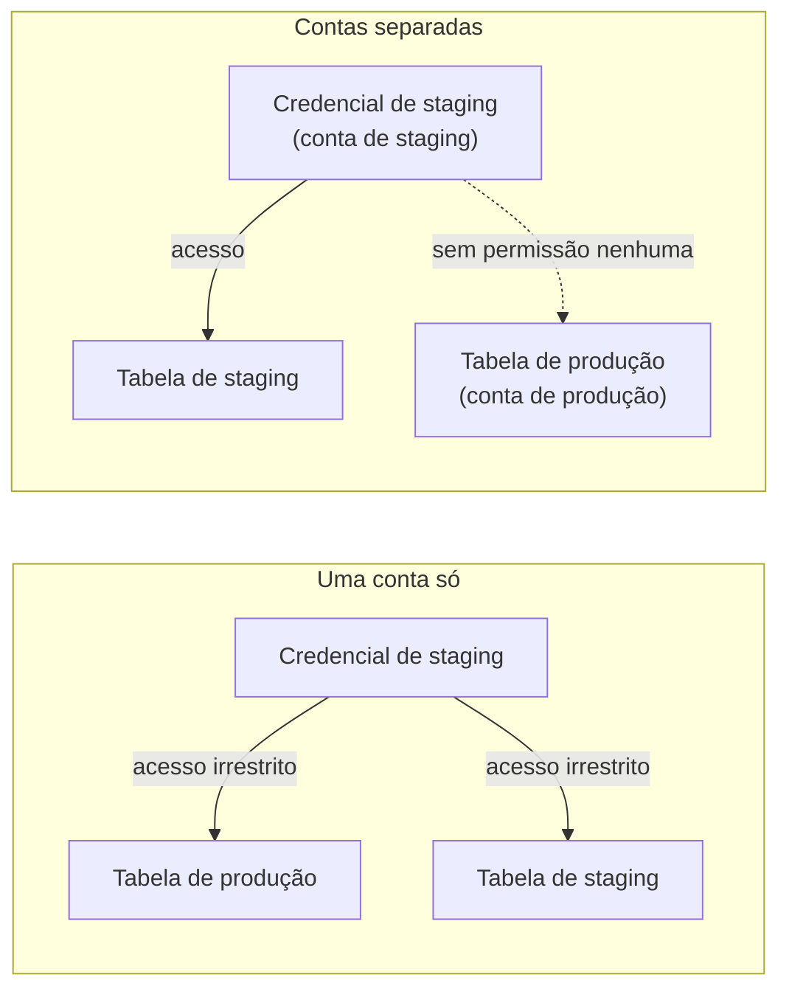
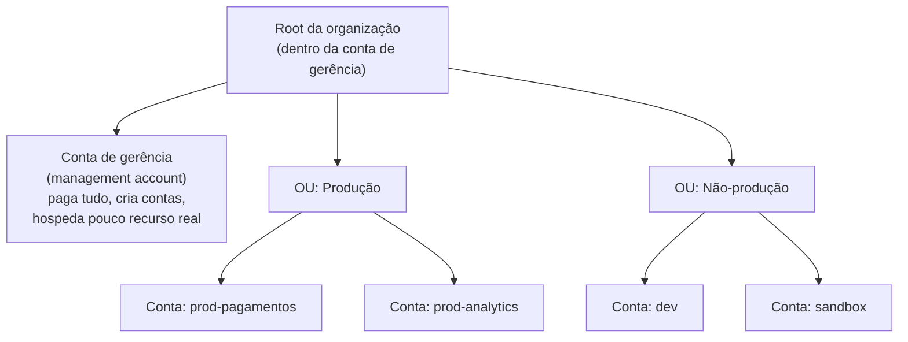
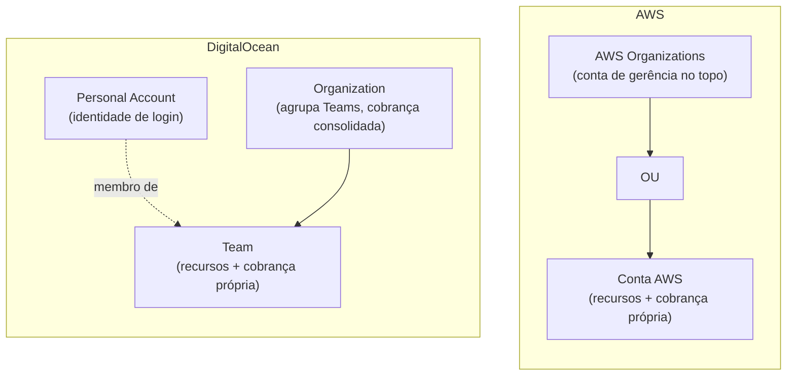

# A conta e a organização

> [!abstract] TL;DR
> A **conta** é a unidade fundamental de um provedor de nuvem — não o Droplet, não a instância EC2, não o bucket. É ela que isola recursos, delimita cobrança e, principalmente, contém o dano quando algo dá errado. Todo provedor nasce com um usuário todo-poderoso (o **root user** na AWS) que deveria ser trancado num cofre e nunca usado no dia a dia — porque ele não tem limite de permissão nenhum. Times que crescem rapidamente descobrem, cedo ou tarde, que uma conta única vira um único **blast radius**: um erro, uma credencial vazada ou um script mal escrito em qualquer canto da conta pode alcançar tudo o mais que mora nela. A resposta da indústria é multiplicar contas — uma por ambiente, por time, por nível de sensibilidade — e depois amarrar essas contas soltas numa hierarquia gerenciável, com uma fatura só no fim do mês. Na AWS, essa hierarquia se chama **Organizations**; na DigitalOcean, o mesmo problema é resolvido com **Teams** agrupados em **Organizations**. Os nomes coincidem por acidente; o problema que resolvem é o mesmo.

## O script que devia ter rodado só em staging

Um time de dados mantém um pipeline batch que roda todo domingo de manhã: lê uma tabela inteira, recalcula um conjunto de métricas, e sobrescreve o resultado. Alguém decide testar uma mudança no algoritmo de agregação e escreve um script rápido, sem revisão de código — "é só um teste, vou rodar local e depois formalizo". O script lê as credenciais de um arquivo `.aws/credentials` que a pessoa já tinha configurado havia meses, de um trabalho anterior de debug em produção, e nunca removeu.

O script tem um bug: em vez de ler da tabela de staging, ele lê — e sobrescreve — a tabela de produção que alimenta o dashboard executivo. O erro só aparece na segunda-feira de manhã, quando o dashboard mostra números absurdos e ninguém sabe explicar por quê. A investigação leva duas horas só para descobrir *o que* mudou; recuperar os dados a partir de backups leva o resto do dia.

O detalhe que devia ter impedido esse incidente não é "revisar o script antes de rodar" — isso é verdade, mas é a lição óbvia, a que todo mundo já sabe e mesmo assim não segue sob pressão de prazo. O detalhe estrutural é outro: **a credencial daquela pessoa tinha acesso à tabela de produção porque staging e produção viviam na mesma conta**. Não havia fronteira nenhuma entre "ambiente onde eu posso experimentar sem medo" e "ambiente onde um erro custa caro" além da disciplina de cada engenheiro em usar a tabela certa. Numa conta só, essa disciplina é a *única* linha de defesa — e linhas de defesa que dependem só de disciplina humana falham, mais cedo ou mais tarde, porque humano erra.

Se staging e produção estivessem em **contas separadas**, a credencial de staging simplesmente não teria permissão nenhuma de tocar em nada dentro da conta de produção — nem por acidente, nem por bug, nem por má intenção. O erro ainda teria acontecido (o script ainda tinha o bug), mas o dano ficaria contido dentro da fronteira errada em vez de vazar para a fronteira certa. Essa contenção — não a prevenção do erro, mas a limitação de até onde ele alcança — é o que a conta, como unidade de isolamento, existe para fazer.



## A conta como unidade de isolamento e de cobrança

Toda a mecânica que os próximos galhos desta trilha vão explorar — regiões, redes virtuais, permissões, cotas de serviço — vive **dentro** de uma conta. A conta é o container mais externo: o espaço com um ID único, um método de pagamento associado, e uma fronteira de segurança que, por padrão, nada de fora enxerga e nada de dentro alcança para fora, a menos que alguém explicitamente conceda essa ponte.

Isso não é um detalhe administrativo — é a peça central de como a nuvem pública consegue hospedar milhões de clientes diferentes na mesma infraestrutura física sem que um cliente jamais veja ou toque nos recursos de outro. A conta é o mesmo mecanismo, só que aplicado *dentro* da sua própria organização: cada conta nova que você cria é, para efeitos de isolamento, tratada com a mesma seriedade que a AWS trata o isolamento entre você e um concorrente que nunca ouviu falar da sua empresa.

Concretamente, uma conta AWS carrega, por padrão:

- **Um ID numérico único** (12 dígitos) que identifica a conta em qualquer chamada de API, política ou ARN (o identificador de recurso da AWS).
- **Um método de pagamento próprio** e uma fatura própria — a menos que essa conta seja explicitamente ligada a uma cobrança consolidada, assunto de duas seções à frente.
- **Um espaço de nomes de recursos isolado** — dois buckets S3 podem ter nomes parecidos em contas diferentes sem colidir; permissões de uma conta não vazam para outra por padrão.
- **Cotas de serviço próprias** (quantas instâncias EC2 você pode ligar simultaneamente, quantas funções Lambda pode invocar por segundo) — a nota 06 deste galho aprofunda esse ponto, mas vale registrar aqui que a cota é *por conta*, não *por empresa*: espalhar cargas entre contas também espalha o limite.

A AWS documenta isso com uma frase direta: uma conta é "diferente de um usuário" — um usuário é uma identidade que você cria *dentro* de uma conta (tema do galho 4 desta trilha), enquanto a conta é o container que hospeda potencialmente muitos usuários e papéis. Confundir os dois é um erro comum de quem vem de sistemas onde "conta" e "usuário" são sinônimos — numa nuvem pública, não são.

Um jeito rápido de nunca perder essa distinção de vista é perguntar, a qualquer momento, "em qual conta minhas credenciais atuais estão operando agora?" — os dois provedores respondem a essa pergunta com um comando de uma linha:

```bash
# AWS — identifica a conta e a identidade (usuário ou papel) por trás
# das credenciais ativas no momento
aws sts get-caller-identity
```

```json
{
    "UserId": "AIDAEXAMPLE123456789",
    "Account": "123456789012",
    "Arn": "arn:aws:iam::123456789012:user/josenaldo"
}
```

```bash
# DigitalOcean — mostra os detalhes do perfil da conta autenticada
# (não existe um comando doctl equivalente a "quem eu sou dentro
# de qual Team"; o token da API já está ligado a um Team específico)
doctl account get
```

O `Account` da AWS (12 dígitos) e o e-mail retornado pelo `doctl account get` cumprem o mesmo papel: confirmar, antes de rodar qualquer coisa destrutiva, que você está apontando para a conta que pensa que está.

## O usuário raiz: todo-poderoso e, por isso, perigoso

Quando você cria uma conta AWS nova, o primeiro identificador que existe dentro dela é o **root user** — o e-mail e a senha que você usou para se cadastrar. E aqui está o ponto que surpreende quem chega de fora: esse usuário raiz tem acesso irrestrito a absolutamente tudo dentro daquela conta, sem exceção, sem limite configurável, sem política que consiga restringi-lo. Não existe, dentro de uma conta standalone, nenhuma trava que impeça o root user de deletar qualquer recurso, fechar a conta inteira, ou mudar qualquer configuração.

A própria documentação da AWS é enfática sobre isso: "recomendamos fortemente que você não use o usuário raiz para as tarefas do seu dia a dia" — reservando-o só para uma lista curta e específica de operações que *exigem* privilégio de root e não podem ser delegadas a nenhuma identidade comum, mesmo uma com permissões administrativas amplas. Essa lista inclui coisas como mudar as configurações fundamentais da própria conta (e-mail, senha do root, chaves de acesso do root em contas standalone), fechar a conta, ou destravar um bucket S3 que ficou acidentalmente configurado para negar acesso a todo mundo — inclusive a quem tentaria consertá-lo.

Por que essa separação importa tanto? Porque uma identidade sem limite de permissão é, ao mesmo tempo, a ferramenta mais poderosa e o alvo mais valioso que existe dentro de uma conta. Se a credencial do root vaza — num commit acidental, num laptop roubado, num phishing bem-feito — o atacante não precisa escalar privilégio nenhum: já chegou no topo. Comparado a isso, uma identidade comum com permissões cuidadosamente restritas (o assunto do galho 4) limita o estrago possível mesmo que a credencial vaze, porque ela simplesmente não tem poder para fazer certas coisas, não importa quão comprometida esteja.

A prática recomendada, então, não é "nunca usar o root" — é usá-lo raramente, protegê-lo com múltiplos fatores de autenticação, e fazer o trabalho do dia a dia através de identidades com permissão desenhada para a tarefa em questão. Essa é justamente a fronteira que esta nota respeita: o *conceito* de que existe uma identidade-raiz todo-poderosa, e por que ela é perigosa, pertence aqui — a mecânica de *como* desenhar permissões para identidades comuns (políticas, papéis, o princípio do menor privilégio) é o assunto do galho 4 desta trilha.

> [!info] Vale registrar
> Em contas que fazem parte de uma AWS Organizations, é possível ir além de "usar pouco" e efetivamente **remover** as credenciais do root user de contas-membro — senha, chaves de acesso, MFA — deixando só a conta de gerência (management account) com capacidade de recuperar acesso root quando estritamente necessário. É o equivalente institucional de trancar a chave-mestra num cofre físico em vez de deixá-la no chaveiro de cada funcionário.

## Multiplicar contas para conter o dano: o blast radius

O incidente do início desta nota ilustra um princípio que a própria AWS documenta como um dos benefícios centrais de operar com múltiplas contas: **limitar o alcance de eventos adversos**. A conta, sendo uma fronteira de isolamento por padrão, funciona como uma parede corta-fogo — se um problema começa dentro de uma conta (uma configuração errada, uma credencial comprometida, um script com bug, uma ação maliciosa), o dano tende a ficar contido dentro daquela conta, a menos que alguém tenha explicitamente construído uma ponte para fora dela.

O termo que a indústria usa para descrever esse alcance potencial de dano é **blast radius** — literalmente, "raio da explosão": o quanto uma falha, um comprometimento ou um erro consegue alcançar antes de parar. Uma conta única, hospedando dev, staging, produção, dados sensíveis e experimentos de sandbox todos juntos, tem um blast radius do tamanho da conta inteira — qualquer coisa que dê errado em qualquer canto dela pode, em princípio, alcançar qualquer outro canto. Múltiplas contas, cada uma hospedando uma fatia menor e mais homogênea da operação, reduzem esse raio: um problema na conta de sandbox de um time de experimentação não tem *caminho técnico* para alcançar a conta onde vive o banco de dados de produção que processa pagamentos — porque, por padrão, as duas contas não se enxergam.

Esse não é um argumento abstrato de manual — é o motivo prático por trás de padrões que aparecem repetidamente em organizações que operam nuvem em escala:

- **Uma conta (ou grupo de contas) para produção**, separada de uma conta para não-produção — evita que um erro em ambiente de teste alcance o que está no ar.
- **Contas de sandbox isoladas** para experimentação livre, sem acesso a dados internos ou a serviços corporativos.
- **Contas dedicadas para dados especialmente sensíveis**, com o menor número possível de pessoas e processos com permissão de tocá-las.
- **Contas por unidade de negócio ou por aquisição**, alinhando quem decide com quem sofre as consequências de uma decisão errada.

O objetivo comum a todos esses padrões não é burocracia — é fazer com que, quando (não *se*) algo der errado, o estrago fique pequeno o suficiente para ser absorvido sem virar incidente de manchete. A tabela abaixo resume o critério de separação mais comum, o que cada um efetivamente isola, e a armadilha de quem aplica o critério errado:

| Critério de separação | O que isola | Armadilha comum |
|---|---|---|
| Ambiente (prod / staging / dev) | Dados e configuração de produção contra erro de experimentação | Deixar staging "quase igual" a produção e esquecer que as credenciais também precisam ser diferentes |
| Time / unidade de negócio | Decisão e responsabilidade — quem configura é quem sofre a consequência | Compartilhar uma conta entre times "por enquanto" e nunca migrar |
| Sensibilidade do dado | Superfície de exposição de dado regulado ou confidencial | Misturar dado sensível com carga geral só porque "já tem uma conta pronta" |
| Blast radius / criticidade | Alcance de um incidente de segurança ou de disponibilidade | Achar que uma tag ou um Project substitui a fronteira de conta (ver seção abaixo) |
| Cobrança / centro de custo | Rastreabilidade de gasto por time ou por cliente | Depender de tags de custo em vez de conta separada, e perder rastreabilidade quando alguém esquece de taguear |
| Cota de serviço (Service Quotas) | Limite de recursos simultâneos por conta — evita que uma carga esgote a cota de outra | Concentrar cargas de alto volume na mesma conta e descobrir o limite em produção |

Vale uma ressalva de honestidade: multiplicar contas sem gerenciamento também tem custo — mais contas para monitorar, mais lugares para configurar corretamente, mais superfície para esquecer alguma coisa. É exatamente esse custo de gerenciamento que a próxima seção resolve.

## Organizando contas em hierarquia: AWS Organizations

Se cada conta nova exigisse um método de pagamento próprio, um cadastro próprio e nenhuma visão consolidada do conjunto, multiplicar contas seria impraticável além de um punhado. A AWS resolve isso com o **AWS Organizations**: um serviço que agrupa contas numa estrutura hierárquica em árvore, com uma **conta de gerência** (management account) no topo e quantas **contas-membro** (member accounts) forem necessárias penduradas embaixo dela — organizadas, se fizer sentido, em **unidades organizacionais** (organizational units, ou OUs), que por sua vez podem conter outras OUs. A documentação oficial é precisa sobre o limite: contando o root e as contas nas OUs mais baixas, a hierarquia inteira pode ter até cinco níveis de profundidade.

Criar e listar contas-membro são operações de API de primeira classe — é assim que empresas automatizam a criação de "uma conta nova por time" sem passar pelo console a cada vez:

```bash
# AWS — cria uma conta-membro nova dentro da organização
# (só pode ser rodado a partir da conta de gerência)
aws organizations create-account \
  --email time-dados@example.com \
  --account-name "prod-dados"
```

```json
{
    "CreateAccountStatus": {
        "Id": "car-exampleaccountrequestid111",
        "AccountName": "prod-dados",
        "State": "IN_PROGRESS",
        "RequestedTimestamp": "2026-07-20T14:03:00Z"
    }
}
```

```bash
# AWS — lista todas as contas da organização, com status e método
# de ingresso (CREATED direto pela Organizations, ou INVITED de
# uma conta standalone que aceitou o convite)
aws organizations list-accounts \
  --query 'Accounts[].{Id:Id,Name:Name,Status:Status,Joined:JoinedMethod}'
```

O lado DigitalOcean da mesma operação — criar um Team novo, convidar alguém para ele — **não tem equivalente em `doctl`**: o `doctl` não expõe nenhum grupo de comando para Teams ou Organizations (a lista completa de grupos do `doctl` cobre contas, apps, compute, Kubernetes, bancos de dados etc., mas não gestão de Team). Criar um Team novo e convidar membros é, hoje, uma operação exclusiva do Control Panel web — uma diferença real de maturidade de automação entre os dois provedores, não um detalhe estético.

A criação de conta pela API é assíncrona — a resposta chega com `"State": "IN_PROGRESS"` antes mesmo de a conta existir de fato, e o `Id` retornado serve para consultar o andamento com `describe-create-account-status` até o estado virar `SUCCEEDED` (ou `FAILED`, com um `FailureReason` explicando o motivo).

A conta de gerência é a que cria a organização, convida ou cria contas-membro, e — ponto central para esta nota — é a **pagadora**: ela é responsável por toda a cobrança acumulada por todas as contas-membro, através de um mecanismo chamado **cobrança consolidada** (consolidated billing). Em vez de uma fatura por conta, a organização inteira recebe uma única fatura, emitida no nome da conta de gerência, com o detalhamento de gasto por conta-membro disponível para análise. Isso não é só conveniência financeira — muitos descontos por volume da AWS são calculados sobre o uso agregado de *toda* a organização, não conta por conta, o que significa que uma organização com dez contas pequenas pode qualificar para descontos que nenhuma delas sozinha alcançaria.

A prática recomendada, aliás, é que a conta de gerência hospede o mínimo possível de recursos reais — ela deveria ser, majoritariamente, um ponto de controle administrativo e de cobrança, não um lugar onde produção roda. A razão é sutil, mas importante: mecanismos de política central que a Organizations oferece (como as *service control policies*, que ficam para o galho 4) não restringem identidades dentro da própria conta de gerência — então misturar cargas de produção com a conta de gerência tira dela justamente a camada de proteção que ela concede a todas as outras.

Vale registrar um detalhe que pega muita gente de surpresa da primeira vez: **a conta de gerência não pode ser trocada depois**. Uma vez que uma conta cria a organização e assume esse papel, não existe operação que a "rebaixe" a conta-membro nem que promova outra conta a gerência no lugar dela — a decisão de qual conta funda a organização é, na prática, permanente. É mais um motivo para escolher com cuidado, desde o início, uma conta que sirva só para governança, em vez de reaproveitar a primeira conta AWS que a empresa já tinha, cheia de recursos de produção históricos.



As unidades organizacionais existem para aplicar controles em grupo em vez de conta por conta — uma política anexada a uma OU se aplica a todas as contas dentro dela, e a todas as OUs aninhadas embaixo. O mecanismo mais comum para isso é a **service control policy (SCP)**: um documento JSON, anexado a uma OU, a uma conta ou à raiz da organização, que define o **teto** de permissão disponível para qualquer usuário ou papel nas contas afetadas — uma SCP nunca *concede* permissão por si só, ela só limita o que uma política de identidade dentro da conta pode conceder. Um exemplo adaptado da própria documentação da AWS, restringindo ações a duas regiões aprovadas:

```json
{
    "Version": "2012-10-17",
    "Statement": [
        {
            "Sid": "DenyOutsideApprovedRegions",
            "Effect": "Deny",
            "NotAction": [
                "iam:*",
                "organizations:*",
                "support:*"
            ],
            "Resource": "*",
            "Condition": {
                "StringNotEquals": {
                    "aws:RequestedRegion": [
                        "us-east-1",
                        "sa-east-1"
                    ]
                }
            }
        }
    ]
}
```

Anexada a uma OU inteira, essa política vale para toda conta-membro dentro dela — inclusive contas criadas depois, sem precisar tocar em nada manualmente. Repare no detalhe que já apareceu nesta nota: SCPs **não afetam a conta de gerência**, só as contas-membro — mais um motivo para mantê-la vazia de recursos reais. O *conteúdo* completo dessas políticas — quem pode fazer o quê, dentro de qual conta, com que exceções — é o assunto de identidade e permissões que fica para o galho 4. Aqui, a OU e a SCP importam só como a peça de organização que evita que uma empresa com cinquenta contas precise configurar cinquenta políticas idênticas manualmente.

> [!warning] Nunca anexar uma SCP nova direto na raiz da organização
> A própria documentação da AWS recomenda fortemente não testar uma SCP nova anexando-a direto ao root — o alcance é a organização inteira de uma vez, e um erro de sintaxe ou de escopo pode travar acesso de serviços essenciais em todas as contas simultaneamente. A prática segura é criar uma OU de teste, mover uma conta não crítica para dentro dela, validar o comportamento, e só então propagar a política para OUs maiores.

## O mesmo problema, outro vocabulário: Teams e Organizations na DigitalOcean

A DigitalOcean resolve exatamente o mesmo problema — multiplicar unidades de isolamento e cobrança sem perder visão consolidada — com uma hierarquia mais enxuta, coerente com a filosofia mais simples do produto como um todo. A unidade fundamental não se chama "conta" da forma como a AWS usa o termo; chama-se **Team**. Um Team é, segundo a própria documentação da DigitalOcean, a unidade com que "você gerencia sua infraestrutura e cobrança" — e cada Team tem, por padrão, **cobrança própria e separada**, com seu próprio método de pagamento.

Ao se cadastrar na DigitalOcean, você automaticamente se torna membro de um Team padrão — pode trabalhar sozinho nele, ou convidar outras pessoas para colaborar, cada uma com um **papel** (role) que determina o nível de acesso aos recursos compartilhados, às informações de cobrança e às configurações daquele Team. Isso é conceitualmente equivalente a uma conta AWS: um espaço isolado de recursos com sua própria fatura.

Onde a DigitalOcean diverge da AWS é na camada de agrupamento acima disso. Assim como a AWS agrupa contas dentro de uma Organizations, a DigitalOcean agrupa Teams dentro de uma **Organization**: a documentação oficial descreve isso como o mecanismo que permite "cobrança, pagamento e faturamento consolidados" (*consolidated billing, payment, and invoicing*) através de múltiplos Teams relacionados, com o detalhamento de gasto quebrado por Team — exatamente o mesmo papel que a conta de gerência cumpre para a AWS Organizations, só que sem o vocabulário de "unidade organizacional" ou hierarquia em árvore profunda: uma Organization DigitalOcean agrupa Teams num único nível, sem OUs aninhadas. Assim como a AWS Organizations, criar uma Organization na DigitalOcean não tem custo adicional — a lógica dos dois provedores é a mesma: a estrutura de agrupamento em si não é o que se cobra, os recursos dentro das contas ou dos Teams é que são.

Há também uma camada abaixo de tudo isso que não tem equivalente direto na AWS: a **Personal Account**. Ela não guarda recursos de infraestrutura nem cobrança própria — só gerencia sua identidade de login, seus dados pessoais e a lista de Teams dos quais você é membro. É o "você" que atravessa Teams diferentes, não um container de recursos.

A tabela a seguir traduz o vocabulário de um lado para o outro, termo a termo — vale guardar como referência rápida antes de ler documentação de qualquer um dos dois provedores:

| Conceito | AWS | DigitalOcean | Para que serve |
|---|---|---|---|
| Unidade de isolamento + cobrança própria | Conta (AWS account) | Team | Container de recursos com fatura separada |
| Identidade que atravessa múltiplos containers | Usuário/papel IAM (por conta) | Personal Account | "Você", não um container de recursos |
| Agrupador de múltiplas unidades | AWS Organizations | Organization | Cobrança consolidada + visão agregada |
| Subgrupo hierárquico dentro do agrupador | Organizational Unit (OU), até 5 níveis | — (sem equivalente; Organization agrupa Teams num nível só) | Aplicar política a um subconjunto de contas de uma vez |
| Container que paga por todo o agrupador | Conta de gerência (management account) | Organization (via seus owners) | Fatura única, detalhamento por unidade |
| Identidade todo-poderosa de emergência | Root user | — (sem equivalente; o Owner do Team já é o papel cotidiano de maior privilégio) | Tarefas que exigem privilégio máximo |
| Teto central de permissão | Service control policy (SCP) | — (controle fica nos papéis/roles do Team) | Limitar o que qualquer identidade pode fazer, mesmo com política permissiva local |
| Organização visual de recursos (não isola) | Tags / Resource Groups | Project | Navegação e foco no painel — nunca fronteira de acesso |
| Papel de maior privilégio para trabalho cotidiano | Identidade IAM com política administrativa ampla | Owner do Team | Fazer o trabalho do dia a dia sem depender da identidade de emergência |

Duas linhas dessa tabela merecem destaque porque é onde a paridade *não* existe: a AWS separa root user de trabalho cotidiano de um jeito que a DigitalOcean não replica, e a AWS tem um mecanismo de política central (SCP) que restringe identidades em qualquer conta-membro — a DigitalOcean não tem um equivalente documentado de "teto de permissão aplicado de cima para baixo" sobre um Team inteiro; o controle fica concentrado nos papéis atribuídos a cada membro.



Onde a AWS não tem equivalente direto do lado DigitalOcean: não existe, na DigitalOcean, um conceito de "usuário raiz" separado que precise ser trancado num cofre — a pessoa que cria o Team é, naturalmente, o Owner, com o papel de maior privilégio dentro daquele Team, mas o modelo de papéis (roles) da DigitalOcean é desenhado desde o início para ser a forma cotidiana de trabalhar, não uma identidade de emergência isolada da operação diária. É uma diferença de filosofia coerente com o resto da plataforma: onde a AWS separa explicitamente "identidade de emergência todo-poderosa" de "identidade de trabalho do dia a dia", a DigitalOcean simplifica isso num único sistema de papéis graduados.

## Projects: organização visual, não fronteira de isolamento

Há uma armadilha conceitual específica de quem já usa DigitalOcean há algum tempo e vale desarmar aqui: o recurso de **Projects**. Um Project na DigitalOcean deixa você agrupar Droplets, Spaces, load balancers, domínios e outros recursos em coleções que fazem sentido para o seu trabalho — por aplicação, por cliente, por ambiente. Todo recurso da sua conta começa dentro de um Project padrão, e você pode mover recursos entre Projects livremente, um a um ou em lote, à medida que a organização evolui.

A armadilha é tratar Project como se fosse uma fronteira de segurança ou de cobrança equivalente a uma conta, um Team, ou uma OU da AWS. Não é. A documentação da DigitalOcean é clara: Projects são uma ferramenta de organização de alto nível, para facilitar a navegação e o foco no painel de controle à medida que a infraestrutura cresce — não um mecanismo de isolamento de acesso nem de segregação de cobrança. Dois Projects dentro do mesmo Team compartilham a mesma cobrança, o mesmo conjunto de membros com acesso, as mesmas permissões de fundo. Mover um recurso de um Project para outro é uma operação puramente organizacional, sem efeito nenhum sobre quem consegue acessá-lo.

Isso significa que "separar produção e staging em Projects diferentes" dá **organização visual**, mas não dá **isolamento** — se você quer a garantia de que uma credencial de staging não consiga tocar em produção, a fronteira que faz esse trabalho é o Team (ou, na AWS, a conta), não o Project. É o mesmo tipo de confusão, em espelho, de achar que uma pasta separada no seu sistema de arquivos protege um arquivo contra um processo com permissão de leitura em todo o disco — a organização visual e o controle de acesso são camadas diferentes, e só uma delas contém dano de verdade.

## Casos práticos

**Uma consultoria que atende múltiplos clientes na DigitalOcean.** Em vez de hospedar a infraestrutura de todos os clientes dentro do mesmo Team — o que misturaria cobrança, permissões e, principalmente, o risco de um erro de configuração em um cliente vazar para outro — a consultoria cria um Team por cliente. Cada Team tem seu próprio método de pagamento (repassado diretamente ao cliente, se for o caso), sua própria lista de membros com acesso, e nenhum vazamento acidental de recurso entre clientes. Para a própria consultoria acompanhar o gasto agregado sem perder essa separação, os Teams entram numa Organization única — um painel, uma cobrança consolidada, detalhamento por cliente.

**Uma startup migrando de "uma conta AWS para tudo" para múltiplas contas.** No começo, uma única conta AWS hospeda desenvolvimento, staging e produção — típico de fase inicial, quando o time é pequeno e a velocidade de entrega importa mais do que qualquer outra coisa. Ao crescer e contratar o primeiro engenheiro de segurança, a empresa cria uma AWS Organizations, migra a conta existente para virar a conta de produção, e cria contas novas para não-produção e para sandbox de experimentação. A partir desse ponto, um script de teste rodando na conta errada simplesmente não tem como alcançar dados de produção — o incidente do início desta nota deixa de ser possível por construção, não por disciplina.

**Uma auditoria de segurança que encontra o root user sendo usado semanalmente.** Um time descobre, ao revisar logs de acesso, que alguém está entrando com as credenciais do root user da conta de produção toda sexta-feira para rodar uma tarefa de manutenção manual — porque, em algum momento, essa foi a forma mais rápida de resolver um problema pontual, e ninguém nunca voltou para consertar isso direito. A correção não é técnica complexa:

- Criar uma identidade com a permissão específica necessária para aquela tarefa (assunto do galho 4), em vez de root.
- Ativar múltiplos fatores de autenticação no root — a AWS já torna o MFA obrigatório por padrão em contas novas, mas ainda exige que a pessoa efetivamente cadastre o segundo fator na criação da conta ou no primeiro login; contas antigas podem ter ficado para trás.
- Se a conta já fizer parte de uma Organizations, remover as credenciais do root daquela conta-membro, deixando a recuperação centralizada na conta de gerência.

## Armadilhas comuns

> [!warning] Usar o root user (ou o equivalente de maior privilégio) para tarefas do dia a dia
> É a credencial mais poderosa e mais visada que existe dentro da conta — reservá-la para o punhado de operações que realmente exigem privilégio total, proteger com múltiplos fatores de autenticação, e fazer o trabalho cotidiano com uma identidade de permissão restrita à tarefa em questão.

> [!warning] Achar que "Project" (DigitalOcean) ou uma tag/etiqueta qualquer substitui uma fronteira de conta
> Projects organizam a visão, não o acesso. Se a exigência é "essa credencial não pode, sob hipótese alguma, tocar naquele recurso", a resposta é uma conta (ou Team) separado — não uma pasta lógica dentro da mesma conta.

> [!warning] Deixar tudo numa conta só até que um incidente force a separação
> Multiplicar contas tem custo de gerenciamento real, e é tentador adiar essa decisão indefinidamente enquanto "está funcionando". O problema é que o custo de migrar *depois* de um incidente — sob pressão, com dados já misturados — é muito maior do que o custo de desenhar a separação cedo, mesmo que pequena no início (uma conta de produção, uma de tudo o mais, já é um ganho real sobre uma conta só).

## O que vem a seguir

Esta nota estabeleceu a conta como a unidade que isola e cobra — o container mais externo de tudo o que existe dentro de um provedor. Mas uma conta, sozinha, não diz *onde* fisicamente os recursos dentro dela rodam, nem por que essa localização importa para latência, preço e até para leis de residência de dados. Essa é a próxima peça da anatomia de um provedor: **"Geografia da nuvem — regions, zonas e edge"**.

## Fontes

- [AWS Organizations — What is AWS Organizations? (documentação oficial)](https://docs.aws.amazon.com/organizations/latest/userguide/orgs_introduction.html) — visão geral de contas, agrupamento, políticas e cobrança consolidada; acessado em 2026-07-20.
- [AWS Organizations — Terminology and concepts (documentação oficial)](https://docs.aws.amazon.com/organizations/latest/userguide/orgs_getting-started_concepts.html) — definições formais de organização, root, OU, conta de gerência e conta-membro; acessado em 2026-07-20.
- [AWS IAM — AWS account root user (documentação oficial)](https://docs.aws.amazon.com/IAM/latest/UserGuide/id_root-user.html) — o que é o root user, tarefas que exigem privilégio root, e gerenciamento centralizado de root em contas-membro via Organizations; acessado em 2026-07-20.
- [AWS Whitepaper — Benefits of using multiple AWS accounts](https://docs.aws.amazon.com/whitepapers/latest/organizing-your-aws-environment/benefits-of-using-multiple-aws-accounts.html) — fonte do conceito de blast radius, isolamento por ambiente, cotas por conta e gestão de custo; acessado em 2026-07-20.
- [DigitalOcean — Teams (documentação oficial)](https://docs.digitalocean.com/platform/teams/) — definição de Team, papéis, cobrança separada por Team; acessado em 2026-07-20.
- [DigitalOcean — Organizations (documentação oficial)](https://docs.digitalocean.com/platform/organizations/) — agrupamento de Teams, cobrança consolidada, faturamento e detalhamento de gasto por Team; acessado em 2026-07-20.
- [DigitalOcean — Projects (documentação oficial)](https://docs.digitalocean.com/products/projects/) — Projects como organização de recursos, não como fronteira de acesso ou cobrança; acessado em 2026-07-20.
- [AWS CLI — organizations create-account (referência de comando)](https://docs.aws.amazon.com/cli/latest/reference/organizations/create-account.html) — sintaxe e saída de `aws organizations create-account`; acessado em 2026-07-22.
- [AWS CLI — organizations list-accounts (referência de comando)](https://docs.aws.amazon.com/cli/latest/reference/organizations/list-accounts.html) — sintaxe e saída de `aws organizations list-accounts`; acessado em 2026-07-22.
- [AWS CLI — sts get-caller-identity (referência de comando)](https://docs.aws.amazon.com/cli/latest/reference/sts/get-caller-identity.html) — sintaxe e saída de `aws sts get-caller-identity`; acessado em 2026-07-22.
- [AWS Organizations — Service control policies (SCPs)](https://docs.aws.amazon.com/organizations/latest/userguide/orgs_manage_policies_scps.html) — mecânica e escopo de SCPs, recomendação de não testar direto no root; acessado em 2026-07-22.
- [AWS Organizations — SCP syntax](https://docs.aws.amazon.com/organizations/latest/userguide/orgs_manage_policies_scps_syntax.html) — estrutura JSON de uma SCP e exemplo de restrição por região, base do exemplo adaptado nesta nota; acessado em 2026-07-22.
- [DigitalOcean — doctl reference](https://docs.digitalocean.com/reference/doctl/reference/) — lista de grupos de comando do `doctl`, confirma ausência de comandos para Teams/Organizations; acessado em 2026-07-22.
