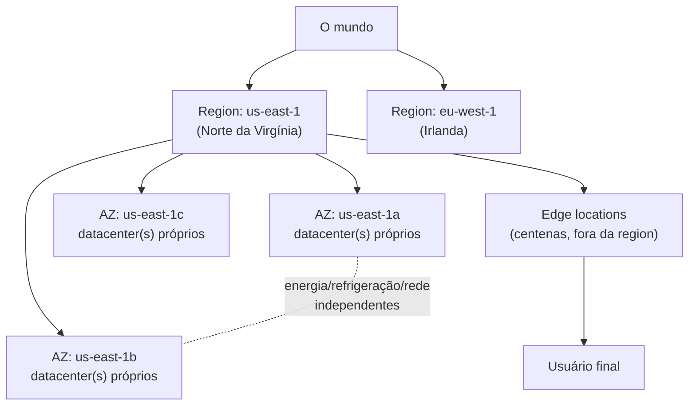
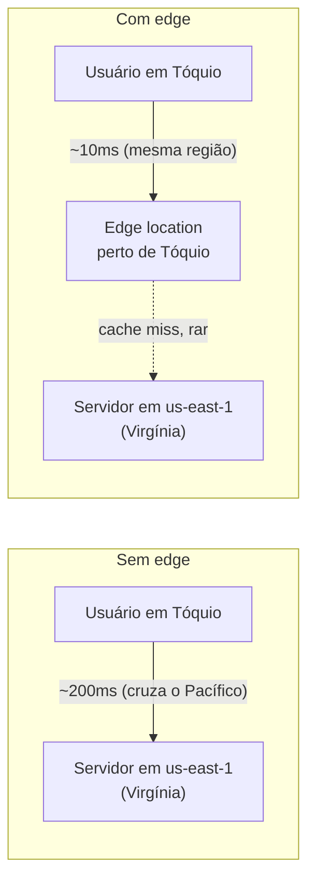
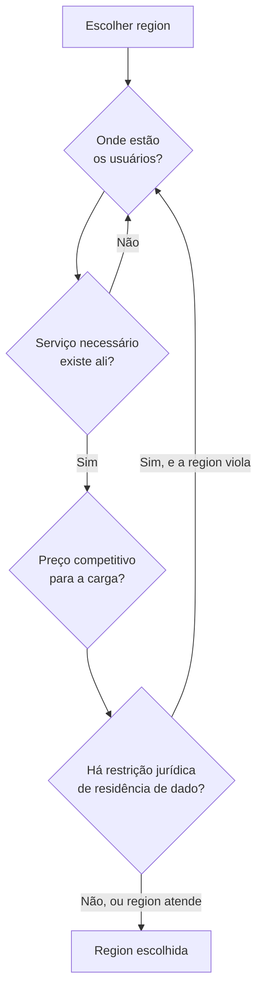

# Geografia da nuvem — regions, zonas e edge

> [!abstract] TL;DR
> "A nuvem" não é um lugar só — é um mapa. **Region** é a unidade geográfica e de preço: um conjunto de datacenters numa área do planeta, com seu próprio catálogo de serviços e sua própria fatura. Dentro de uma region, a **availability zone (AZ)** é a unidade de falha isolada — um ou mais datacenters com energia, refrigeração e rede próprias, de forma que um incêndio, uma queda de energia ou um cabo de rede cortado numa AZ não derruba as outras. **Edge locations** são um terceiro nível, menor e mais numeroso, que não roda sua aplicação — só entrega conteúdo cacheado o mais perto fisicamente do usuário final possível. Escolher region não é escolher "onde a nuvem fica" — é decidir, de uma vez, latência ao usuário, preço da conta, quais serviços vão estar disponíveis, e se você tem permissão legal de colocar aquele dado ali.

## O deploy que funcionou nos testes e caiu na primeira falha real

Um time sobe a primeira versão em produção de um sistema novo. Segue o tutorial, cria duas instâncias para redundância — "se uma cair, a outra segura" — e deixa por lá. Meses depois, um datacenter físico do provedor sofre um problema de energia numa manhã de terça-feira. As duas instâncias caem juntas, ao mesmo tempo, e o sistema fica fora do ar por quase duas horas até o provedor restaurar o serviço.

A pergunta óbvia do post-mortem é "por que ter duas instâncias não bastou?". A resposta chega quando alguém verifica onde, exatamente, cada uma das duas instâncias estava rodando: as duas no mesmo datacenter, ligadas ao mesmo quadro de energia, atrás do mesmo roteador de borda. Redundância de máquina não é redundância de falha — se as duas máquinas compartilham a mesma fonte de energia, o mesmo sistema de refrigeração e o mesmo ponto de rede, elas têm exatamente o mesmo ponto único de falha, só que disfarçado atrás de dois números de instância diferentes.

O que faltou não foi mais máquina. Foi entender que a infraestrutura de um provedor de nuvem tem uma **geografia interna** — camadas com propriedades de isolamento diferentes — e que "redundante" só significa alguma coisa quando as réplicas estão em lugares que não compartilham o mesmo ponto de falha. Essa geografia é o assunto desta nota: três camadas, cada uma resolvendo um problema diferente — onde os dados moram (region), o que falha independentemente (availability zone), e o que fica perto do usuário (edge).

## Region: a unidade geográfica e de preço

Uma **region** é uma área geográfica onde o provedor concentra um conjunto de datacenters — pense em "leste dos Estados Unidos" ou "Europa Ocidental", não numa cidade específica (o endereço físico exato dos datacenters costuma ser confidencial, por razões de segurança). Cada region é, na prática, uma instalação quase completa da nuvem inteira: tem seu próprio conjunto de serviços disponíveis (nem todo serviço existe em toda region, principalmente os mais novos), sua própria tabela de preços (o mesmo tipo de máquina pode custar de forma diferente em duas regions diferentes, porque energia, terreno e mão de obra local variam), e sua própria fronteira de dados — por padrão, o que você cria numa region fica ali, e não atravessa para outra sem uma ação explícita sua.

A AWS opera hoje dezenas de regions espalhadas pelo mundo — o número exato muda com o tempo, porque a AWS abre regions novas com regularidade (confira a contagem atual na documentação oficial antes de decidir). Cada region tem um código curto que vira parte de praticamente todo identificador técnico que você vai encontrar: `us-east-1` (Norte da Virgínia), `eu-west-1` (Irlanda), `sa-east-1` (São Paulo) são exemplos. Esse código aparece na URL de endpoints de API, em nomes de recursos, em mensagens de erro — é vocabulário que qualquer engenheiro que trabalha com AWS internaliza rápido.

> [!info] Caducidade
> Contagem exata de regions e nomes de códigos verificados em 2026-07-20. A AWS abre regions novas com regularidade — confira o número atual em [AWS Global Infrastructure](https://aws.amazon.com/about-aws/global-infrastructure/) antes de usar um número específico como referência.

## Availability zone: a unidade de falha isolada

Dentro de uma region, a AWS garante um mínimo de três **availability zones (AZs)** — a documentação oficial é explícita: "Each AWS Region consists of a minimum of three, isolated, and physically separate AZs." Algumas regions maiores e mais antigas têm mais — `us-east-1`, por exemplo, chega a seis. Cada AZ é definida como "one or more discrete data centers with redundant power, networking, and connectivity" — ou seja, uma AZ pode ser um único prédio ou vários, mas o que importa é que ela tem **energia, refrigeração e conectividade de rede independentes** das outras AZs da mesma region.

Essa independência é física, não lógica. Se um transformador queima numa AZ, as outras AZs da mesma region continuam de pé, porque não compartilham o mesmo circuito elétrico. Se um cabo de fibra é cortado por um trabalho de construção civil perto de uma AZ, as outras continuam se comunicando pela rede, porque cada AZ tem seu próprio caminho de conectividade até a rede principal do provedor. É o mesmo princípio de "não guarde os ovos todos na mesma cesta" — só que a cesta, aqui, é um datacenter físico inteiro.

Ao mesmo tempo, as AZs de uma mesma region não estão isoladas geograficamente ao ponto de virar um problema de latência: a AWS documenta que estão "physically separated by a meaningful distance, many kilometers, from any other AZ, although all are within 100 km (60 miles) of each other", conectadas por rede de "high-bandwidth, low-latency networking" — banda suficiente para replicação **síncrona** entre AZs, algo que só é viável quando a latência de ida e volta fica na casa de milissegundos, não dezenas deles. É esse equilíbrio — perto o bastante para replicar em tempo real, longe o bastante para não cair junto num desastre físico local — que faz da AZ a unidade natural de alta disponibilidade dentro de uma region: distribuir réplicas entre AZs diferentes dá redundância real, sem pagar o preço de latência que replicar entre regions inteiras cobraria.

> [!info] Fronteira
> Esta nota define o que é uma AZ e por que ela isola falha. **Como** desenhar uma arquitetura resiliente usando múltiplas AZs — padrões de failover, replicação síncrona vs. assíncrona, quando vale ir além de multi-AZ para multi-region — é estratégia de disponibilidade, e é o assunto do **galho 20** desta trilha. Aqui, o objetivo é só entender a peça geográfica que essas estratégias usam.

## Edge locations: perto do usuário, não do seu servidor

Region e AZ resolvem "onde a minha aplicação roda". Edge location resolve um problema diferente: "onde o **conteúdo** chega perto de quem o consome". Uma edge location — ou *point of presence* (POP), no vocabulário da AWS — não é um datacenter completo capaz de rodar sua aplicação; é um ponto de rede menor, geralmente numa cidade grande, cuja única função é guardar uma cópia em cache de conteúdo estático (imagens, vídeos, arquivos JavaScript e CSS, respostas de API que mudam pouco) e servir essa cópia para quem está fisicamente perto.

A escala é o que separa edge de region: enquanto a AWS opera dezenas de regions, o serviço de CDN da AWS, o CloudFront, opera mais de 750 pontos de presença em mais de 100 cidades e 50 países — uma malha muito mais densa e muito mais próxima geograficamente do usuário final do que qualquer region poderia ser. A ideia central: se seu servidor de aplicação fica na Virgínia mas seu usuário está em Tóquio, uma requisição direta cruza o Pacífico duas vezes (ida e volta) antes de responder. Se o mesmo conteúdo está cacheado numa edge location perto de Tóquio, a resposta vem do outro lado da cidade, não do outro lado do planeta — a diferença de latência não é sutil, costuma ser de centenas de milissegundos para poucos milissegundos, para conteúdo que já está no cache.

Edge location não substitui region — ela complementa. A aplicação em si, com sua lógica de negócio e seu banco de dados, continua rodando numa (ou mais) region específica; a edge location só guarda uma cópia do que pode ser cacheado, e é transparente para o resto da arquitetura. É por isso que um serviço de CDN não aparece como "onde minha aplicação roda" em nenhuma discussão de arquitetura — ele aparece como uma camada extra na frente da region, otimizando a última milha da entrega.

> [!info] Fronteira
> O conceito abstrato de CDN, cache e como ele se encaixa numa arquitetura de sistema mais ampla (invalidação de cache, cache-aside, TTL) pertence a [[03-Dominios/Engenharia/Arquitetura/index|Arquitetura / System Design]]. Aqui, edge location é tratado só como a terceira camada geográfica do provedor — perto do usuário, não uma unidade de computação de propósito geral.

## Region, AZ e edge na lente dupla

Region e AZ, na AWS, são conceitos explícitos e nomeados: você escolhe `us-east-1` como region e `us-east-1a`, `us-east-1b`, `us-east-1c` como AZs específicas ao criar praticamente qualquer recurso — uma instância EC2, um bucket replicado, um banco RDS multi-AZ. A letra no final do nome da AZ (`a`, `b`, `c`) não é sequencial de forma consistente entre contas diferentes — a AWS embaralha a correspondência entre a letra visível e o datacenter físico real por conta, justamente para distribuir carga de forma mais uniforme entre AZs físicas ao longo de todos os clientes.

A DigitalOcean organiza o mundo de forma mais simples, e é aqui que a diferença de modelo mental fica mais visível: ela **não expõe availability zone como conceito de primeira classe**. O que existe é o **datacenter** — a documentação da DigitalOcean descreve hoje 15 datacenters espalhados por 12 regions geográficas (o número muda; confira a contagem atual antes de decidir). Uma region com mais de um datacenter, como Nova York — que tem NYC1, NYC2 e NYC3 — tem, na prática, múltiplos pontos físicos independentes, parecido em espírito com AZs da AWS. Mas a DigitalOcean não documenta, publicamente, as garantias de isolamento de energia/refrigeração/rede entre esses datacenters da mesma forma explícita que a AWS documenta para AZs — e não oferece, nativamente, o mesmo tipo de recurso "multi-AZ automático" (como o RDS Multi-AZ da AWS) que replica e faz failover entre zonas de forma gerenciada. Isso não significa que a DigitalOcean seja menos confiável — significa que a responsabilidade de desenhar redundância entre datacenters, quando ela existe, fica mais nas mãos de quem projeta a arquitetura, e menos automatizada pela plataforma.

Do lado de edge, a comparação também é assimétrica em escala, não em princípio: a DigitalOcean oferece um CDN embutido no Spaces (seu produto de armazenamento de objetos), com cache distribuído em mais de 200 servidores geograficamente espalhados — uma malha bem menor que os 750+ pontos de presença do CloudFront, mas o mesmo princípio: cachear conteúdo estático perto do usuário final, sem que isso vire uma region ou um datacenter novo para você gerenciar.

| Camada | AWS | DigitalOcean |
|---|---|---|
| Unidade geográfica/preço | Region (`us-east-1`) | Region (`nyc`, `ams`, `sfo`...) |
| Unidade de falha isolada | Availability Zone (`us-east-1a`) — explícita, com garantia documentada de energia/refrigeração/rede independentes | Datacenter (`nyc1`, `nyc3`) — múltiplos por region em alguns casos, mas sem o mesmo contrato público de isolamento nem failover automático nativo |
| Camada de borda/cache | CloudFront — 750+ pontos de presença, 100+ cidades | CDN do Spaces — 200+ servidores distribuídos |

> [!info] Caducidade
> Números de datacenters, regions e pontos de presença verificados em 2026-07-20 nas páginas oficiais de cada provedor. São os números que mais envelhecem rápido nesta nota — confira a contagem atual antes de citar um número específico em decisão de arquitetura ou entrevista.

Azure e GCP seguem o mesmo padrão conceitual de region + zona isolada, com nomes próprios:

| Conceito | AWS | Azure | GCP | DigitalOcean |
|---|---|---|---|---|
| Unidade geográfica | Region | Region | Region | Region |
| Unidade de falha isolada | Availability Zone | Availability Zone | Zone | Datacenter (sem contrato público de isolamento) |
| Camada de borda/cache | CloudFront (edge location) | Azure Front Door / Azure CDN (edge site) | Cloud CDN (edge node/Google Global Cache) | CDN do Spaces |

> [!info] Caducidade
> Nomenclatura de Azure e GCP verificada em 2026-07-20 — confira a documentação oficial de cada provedor antes de tratar estes nomes como definitivos; a indústria reorganiza produtos de CDN e edge com frequência.

## Como escolher uma region

Escolher region não é uma decisão técnica isolada — é, na prática, quatro decisões diferentes empacotadas numa única escolha, e vale desembaraçá-las:

**1. Latência ao usuário.** A física não negocia: quanto mais longe fisicamente a region está do usuário, maior o tempo mínimo de ida e volta de qualquer requisição, e nenhuma otimização de código reduz isso — a velocidade da luz numa fibra óptica é um limite duro. Um sistema com usuários majoritariamente na Europa, rodando numa region nos Estados Unidos, carrega uma penalidade de latência estrutural em toda requisição, não só nas primeiras. A escolha de region geralmente começa aqui: onde estão os usuários que a aplicação vai servir a maior parte do tempo.

**2. Preço.** O mesmo recurso — o mesmo tipo de máquina, o mesmo volume de armazenamento, a mesma transferência de dados — pode custar de forma visivelmente diferente entre regions, porque cada region reflete o custo local de energia, terreno, mão de obra e a maturidade da infraestrutura naquela área. Regions mais antigas e com mais capacidade instalada tendem a ser mais baratas que regions mais novas ou menores. Para uma carga sensível a custo e sem restrição forte de latência, comparar o preço do mesmo recurso entre regions candidatas antes de decidir é rotina, não exceção.

**3. Disponibilidade do serviço.** Nem todo serviço, nem toda versão de um serviço, existe em toda region. Serviços mais novos costumam lançar primeiro numa ou duas regions "principais" e se espalhar ao longo dos meses seguintes. Escolher uma region sem antes checar se o serviço específico que a arquitetura depende existe ali é um erro descoberto tarde demais — geralmente na hora de provisionar, não na hora de planejar.

**4. Restrição jurídica de residência de dados.** Esta é a que engenheiros sem histórico de compliance mais frequentemente esquecem, e a que tem a consequência mais séria: alguma legislação (GDPR na União Europeia é o exemplo mais citado, mas não o único — várias jurisdições têm regras próprias de residência de dados para setores como saúde e finanças) pode exigir que dados de cidadãos ou clientes de determinada região geográfica **fisicamente não saiam** dela. Guardar dado de usuário europeu numa region nos Estados Unidos, sem uma base legal específica para essa transferência, não é um problema de performance — é um problema jurídico, com multa possível, e a correção depois do fato (migrar dados de region) é trabalho caro e arriscado. A pergunta "esse dado pode legalmente estar nesta region?" precisa ser respondida antes de provisionar o primeiro recurso, não descoberta numa auditoria.

Nenhuma dessas quatro perguntas, isolada, decide a region sozinha — elas competem entre si na prática. A region mais barata pode não ter o serviço necessário; a region mais próxima do usuário pode ter uma restrição legal que impede guardar aquele dado específico ali. A decisão sênior é responder as quatro perguntas explicitamente para a carga em questão, não escolher a region "padrão" do tutorial e seguir em frente sem revisar.

## Casos práticos

**A instância multi-AZ que parou de ser redundante quando alguém mudou uma configuração.** Um banco de dados gerenciado é criado com a opção de alta disponibilidade ativada — o provedor mantém uma réplica síncrona numa AZ diferente da AZ principal, pronta para assumir em caso de falha. Meses depois, durante uma limpeza de custo, alguém desativa essa opção para economizar, sem perceber que ela era a única coisa mantendo o banco resiliente a uma falha de datacenter — o provedor volta a rodar tudo numa única AZ. A falha física que a arquitetura original foi desenhada para tolerar volta a ser um ponto único de falha, silenciosamente, sem que nenhum alarme dispare — porque "o banco está no ar" continua verdadeiro até o dia em que a AZ específica onde ele mora tem um problema.

**O time que descobriu a restrição de dados tarde demais.** Uma aplicação SaaS, construída para o mercado americano, cresce e ganha o primeiro cliente corporativo europeu. O contrato desse cliente exige, explicitamente, que os dados dos usuários dele fiquem armazenados dentro da União Europeia — uma cláusula de residência de dados comum em contratos enterprise europeus. Só que a aplicação inteira, desde o primeiro dia, roda numa única region nos Estados Unidos, com o banco de dados principal compartilhado entre todos os clientes, sem segmentação por geografia. Atender esse contrato não é uma questão de configuração — é um projeto de meses: criar infraestrutura espelhada numa region europeia, decidir como segmentar (ou migrar) os dados desse cliente especificamente, e garantir que nenhum caminho de código escreva o dado dele de volta na region errada. O custo de ter pensado nisso desde o início — uma decisão de arquitetura de multi-region por segmento — teria sido uma fração do custo de retrofitar depois.

**A CDN que economizou uma migração de region inteira.** Um serviço de conteúdo estático — imagens de produto de um catálogo de e-commerce — começa a receber tráfego de usuários em vários continentes, e o time cogita replicar a aplicação inteira em múltiplas regions só para reduzir a latência de carregamento dessas imagens. Antes de embarcar nesse projeto caro, alguém percebe que o problema não é onde a *aplicação* roda — é onde o *conteúdo estático* é servido. Colocar as imagens atrás de uma CDN, mantendo a aplicação numa única region, resolve a latência percebida pelo usuário (que é o que mais importa para a experiência de navegar um catálogo) sem replicar banco de dados, sem lidar com consistência entre regions, sem o custo operacional de uma arquitetura multi-region completa. A lição: nem todo problema de latência percebida pelo usuário exige mover a region da aplicação — às vezes exige só mover o conteúdo estático para mais perto, o que é um problema mais barato de resolver.

## Armadilhas comuns

> [!warning] Redundância "de instância" sem redundância "de AZ"
> Ter duas ou mais instâncias não protege contra falha de datacenter se todas estiverem na mesma AZ. Ao desenhar qualquer coisa que precise sobreviver a uma falha física, confira explicitamente em qual AZ cada réplica está — a maioria dos provedores permite (e alguns serviços gerenciados fazem por padrão) espalhar réplicas entre AZs diferentes automaticamente, mas isso não é automático em toda configuração.

> [!warning] Escolher region só pela latência e esquecer da jurisdição
> Latência é o critério mais intuitivo e o mais frequentemente usado sozinho — mas uma region rápida que viola uma exigência legal de residência de dados não é uma opção válida, por mais rápida que seja. Verifique restrição jurídica antes de provisionar, não depois que um cliente ou auditor perguntar onde o dado está.

> [!warning] Tratar edge location como se fosse mais uma region para rodar aplicação
> Edge locations cacheiam conteúdo; elas não rodam sua lógica de negócio nem seu banco de dados completo (ainda que algumas ofertas de "computação na borda" — fora do escopo desta nota — comecem a borrar essa linha para funções bem específicas e leves). Pensar numa edge location como "mais uma region pequena" leva a expectativas erradas sobre o que pode ser processado ali.

## O que vem a seguir

Esta nota mapeou o **onde**: region, AZ e edge, e como escolher entre elas. Mas existe uma segunda geografia, menos visível e mais fundamental para entender por que a nuvem se comporta do jeito que se comporta operacionalmente — não uma geografia de lugar, mas de **função**. Todo provedor de nuvem separa, internamente, a API que gerencia seus recursos (criar, alterar, destruir uma máquina) do sistema que efetivamente serve o tráfego da sua aplicação em produção. São dois sistemas com características de confiabilidade, escala e limite completamente diferentes — e entender essa distinção explica por que o console pode cair enquanto seu site continua no ar, e por que um deploy pode falhar sem que nenhum usuário perceba. É o assunto da próxima nota, **Plano de controle e plano de dados**.

## Fontes

- [AWS — Regions and Availability Zones (página oficial)](https://aws.amazon.com/about-aws/global-infrastructure/regions_az/) — definição oficial de Region e AZ, número mínimo de AZs por region, distância e latência entre AZs; acessado em 2026-07-20.
- [AWS Global Infrastructure (página oficial)](https://aws.amazon.com/about-aws/global-infrastructure/) — contagem atual de regions e AZs da AWS; acessado em 2026-07-20.
- [AWS Whitepaper — AWS Fault Isolation Boundaries: Global Infrastructure](https://docs.aws.amazon.com/whitepapers/latest/aws-fault-isolation-boundaries/global-infrastructure.html) — modelo de isolamento de falha entre AZs e edge locations; acessado em 2026-07-20.
- [AWS Whitepaper — AWS Overview: Global Infrastructure](https://docs.aws.amazon.com/whitepapers/latest/aws-overview/global-infrastructure.html) — definição consolidada de region e AZ como unidades de disponibilidade e escalabilidade; acessado em 2026-07-20.
- [AWS CloudFront — Features (página oficial)](https://aws.amazon.com/cloudfront/features/) — número de pontos de presença (POPs), regional edge caches, arquitetura de três camadas do CloudFront; acessado em 2026-07-20.
- [DigitalOcean — Regional Availability (documentação oficial)](https://docs.digitalocean.com/platform/regional-availability/) — número de datacenters e regions da DigitalOcean, ausência de conceito explícito de availability zone, recomendação sobre datacenters legados vs. modernos; acessado em 2026-07-20.
- [DigitalOcean Spaces — página de produto](https://www.digitalocean.com/products/spaces) — descrição do CDN do Spaces, número de servidores de cache distribuídos; acessado em 2026-07-20.
