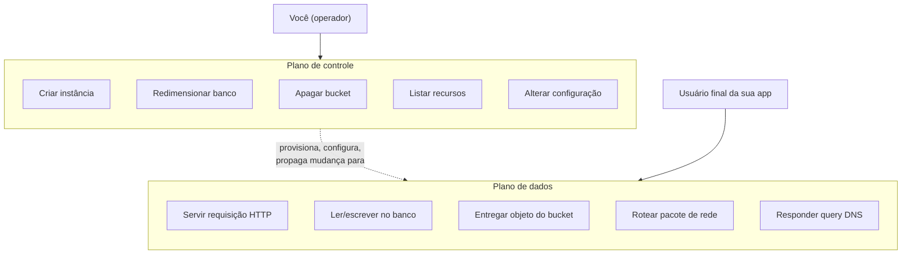
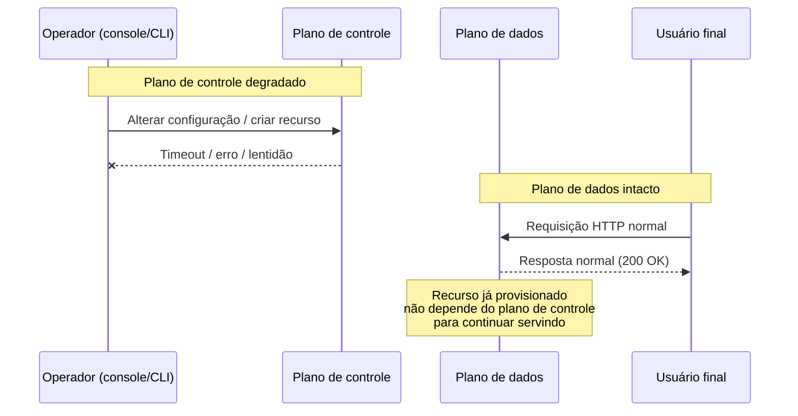
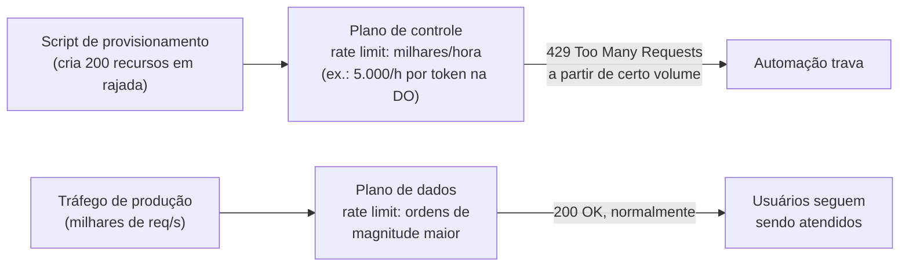

# Plano de controle e plano de dados

> [!abstract] TL;DR
> Todo provedor de nuvem é, por dentro, dois sistemas com propriedades opostas rodando lado a lado. O **plano de controle** é a burocracia — a API que cria, altera, lista e destrói recursos; ele é complexo, orquestra dezenas de subsistemas, e é otimizado para consistência, não para disponibilidade máxima. O **plano de dados** é o trabalho — a instância rodando, o objeto sendo servido, a query respondendo; ele é deliberadamente simples, com poucas peças móveis, e otimizado para ficar de pé o tempo todo. A consequência prática: o console pode cair enquanto sua aplicação continua servindo tráfego sem interrupção; um `deploy` pode travar enquanto o site que já estava no ar segue no ar; e a automação mais perigosa que você pode escrever é a que bate o plano de controle em rajada, porque é ele — não o seu tráfego de produção — que tem rate limit baixo e é o primeiro a cair de joelhos.

## O incidente que confunde gente sênior

Uma manter-o-serviço-de-pé de rotina: sexta-feira, 16h, alguém abre o console da AWS para checar o status de uma instância antes do fim do expediente. O console não carrega — fica girando, depois devolve um erro genérico. Painico imediato: "a AWS caiu, nossa aplicação deve estar fora do ar". A pessoa abre o site de produção numa outra aba, torcendo para confirmar o desastre e já preparando a mensagem no canal de incidentes.

O site carrega normalmente. Rápido, sem erro, como se nada tivesse acontecido. A API que os clientes usam responde nos mesmos milissegundos de sempre. O banco de dados aceita conexões, o load balancer distribui tráfego, os workers processam a fila. Nada, absolutamente nada do que o usuário final experimenta, está degradado.

O que caiu foi só a **capacidade de gerenciar** a infraestrutura — não a infraestrutura em si. E é exatamente esse fato, contraintuitivo para quem nunca parou para pensar na anatomia de um provedor, que esta nota existe para explicar: por que "o console caiu" e "meu site caiu" são, tecnicamente, dois eventos independentes, que podem — e frequentemente ocorrem — sem qualquer relação de causa entre eles.

A resposta está numa distinção que a própria AWS documenta formalmente como fundamento de como constrói seus serviços para alta disponibilidade: todo serviço de nuvem é dividido, por design, em dois planos com propósitos, arquiteturas e garantias de disponibilidade completamente diferentes[^1].

## Duas máquinas dentro de um serviço

Pega qualquer serviço de nuvem — Amazon EC2, S3, um banco gerenciado, um Droplet da DigitalOcean — e ele é, por dentro, a soma de dois sistemas que raramente aparecem separados na documentação de marketing, mas que qualquer engenheiro do próprio provedor trata como entidades distintas.

O **plano de controle** (control plane) é a API administrativa: o conjunto de operações que criam, leem/descrevem, atualizam, deletam e listam recursos — o padrão que a própria documentação da AWS resume pela sigla CRUDL (create, read, update, delete, list)[^1]. Lançar uma instância nova, criar um bucket, descrever uma fila, redimensionar um banco, apagar um volume: tudo isso é plano de controle. E lançar uma instância, especificamente, não é uma operação simples — o provedor precisa encontrar um host físico com capacidade disponível, alocar interface de rede, preparar um volume de armazenamento, gerar credenciais IAM, aplicar regras de firewall, e mais uma dúzia de passos coordenados[^1]. Não é à toa que a própria AWS descreve planos de controle como "sistemas complicados de orquestração e agregação"[^1].

O **plano de dados** (data plane) é a função primária do serviço — o trabalho de verdade. A instância EC2 já rodando o seu processo. A leitura e escrita num volume EBS. Colocar e buscar um objeto num bucket S3. Responder uma query DNS[^1]. É o que o cliente final da sua aplicação efetivamente toca, mesmo sem saber que esse nome existe.

A diferença não é só de vocabulário — é de arquitetura, e ela existe por um motivo deliberado. O plano de controle carrega lógica de negócio, workflows de múltiplas etapas, bancos de dados internos de metadados, verificação de cota, orquestração entre dezenas de subsistemas. O plano de dados é, de propósito, **mais simples, com menos peças móveis** — e a própria AWS é explícita sobre a consequência disso: "isso faz com que eventos de falha sejam estatisticamente menos prováveis no plano de dados do que no plano de controle"[^1]. Um sistema com menos partes tem menos formas de quebrar. Essa não é uma coincidência de engenharia — é a razão pela qual o provedor separa os dois planos como componentes distintos: **o plano de controle é otimizado para consistência forte; o plano de dados é otimizado para disponibilidade**.

## Por que o console pode cair e a app continuar no ar

Agora o incidente da abertura desta nota faz sentido técnico. O console web é só mais um cliente do plano de controle — uma interface gráfica que, por baixo, chama exatamente as mesmas APIs administrativas que uma automação chamaria. Quando o console fica lento ou fora do ar, o que degradou foi a capacidade de **consultar e alterar** o estado dos seus recursos — não o funcionamento dos recursos que já existem e já estão configurados.

Uma vez que uma instância está no ar, um bucket está criado, um registro DNS está propagado — o plano de dados que serve esse recurso **não depende mais do plano de controle para continuar funcionando**. É esse desacoplamento que a AWS chama de "estabilidade estática" (*static stability*): o sistema em produção continua respondendo com a configuração que já tinha, mesmo que o sistema que criou aquela configuração esteja temporariamente impedido de fazer qualquer mudança nova[^2].

O caso mais didático disso, documentado explicitamente pela própria AWS, é o Route 53 — o serviço de DNS. As APIs de gerência do Route 53 (criar, atualizar, apagar registros — e o próprio console) rodam num plano de controle que fica concentrado numa única region, US East (N. Virginia), porque essa concentração é o que garante a consistência forte que gerenciar DNS exige. Já o plano de dados do Route 53 — o sistema que efetivamente **responde às queries DNS e executa health checks** — é distribuído globalmente e desenhado para um SLA de 100% de disponibilidade[^2]. A própria documentação da AWS admite que podem existir "eventos raros nos quais o desenho resiliente do plano de dados permite que ele mantenha disponibilidade enquanto o plano de controle não consegue"[^2] — ou seja: o cenário "não consigo mudar meu DNS agora, mas todo mundo continua resolvendo o domínio normalmente" não é hipotético, é o comportamento que o próprio design pretende garantir.

> [!info] Fronteira
> Multi-AZ, failover entre regions e as estratégias de projetar para resistir a esse tipo de degradação são assunto da trilha [[03-Dominios/Engenharia/Operação/index|Operação (DevOps/SRE)]] e do bloco 20 desta trilha (Multi-AZ/DR como estratégia). Aqui, o objetivo é só entender por que a separação existe e o que ela implica no seu dia a dia.

## Por que um deploy pode travar com o site no ar

O mesmo raciocínio explica um segundo cenário, ainda mais comum no cotidiano de quem opera aplicações: você dispara um deploy — trocar a versão de uma aplicação rodando num serviço gerenciado de containers, redimensionar um cluster, atualizar a configuração de um load balancer — e a operação trava. A barra de progresso do pipeline de CI/CD para em "atualizando", sem avançar. Nesse meio-tempo, os usuários continuam acessando a versão **anterior** da aplicação, sem qualquer interrupção perceptível.

Isso acontece porque um deploy é, do início ao fim, uma sequência de operações de **plano de controle**: criar uma nova revisão do serviço, provisionar as novas instâncias ou containers, atualizar o registro de destinos do load balancer, drenar conexões da versão antiga, decidir quando considerar o rollout concluído. Se qualquer etapa dessa orquestração travar — por um problema temporário no plano de controle do provedor, por uma cota que você não sabia que existia, por uma dependência interna do serviço de deploy que está lenta — o efeito não é "o site cai". O efeito é "a versão antiga continua servindo, porque ela é plano de dados, e o plano de dados não pede permissão ao plano de controle para continuar rodando o que já estava rodando".

Essa mesma lógica é, aliás, a base de uma prática de resiliência que o Well-Architected Framework da AWS recomenda explicitamente: durante uma recuperação de incidente, prefira ações de plano de dados a ações de plano de controle. A recomendação chega a dar exemplos concretos de substituição — trocar "escalar via Auto Scaling" (controle) por "manter capacidade pré-provisionada e ociosa" (dados); trocar "escalar instâncias EC2" (controle) por "deixar o Lambda escalar sozinho" (dados, porque invocar uma função já provisionada é ação de dados, não de controle)[^3]. O princípio geral, nas palavras do próprio framework: minimize o número de operações de plano de controle necessárias para recuperar, redimensionar, curar ou fazer failover de um serviço durante uma degradação — porque é justamente nesses momentos de estresse que o plano de controle, sobrecarregado por todo mundo tentando reagir ao mesmo tempo, é o que tem mais chance de estar indisponível[^3].

> [!warning] Deploy travado não é "o provedor caiu"
> Antes de escalar um incidente como "a nuvem está fora do ar", cheque separadamente: (1) a aplicação em produção está respondendo normalmente aos usuários? (2) só a operação de gerência — deploy, scaling manual, alteração de configuração — está travada? Se a resposta for "sim" para as duas, você tem uma degradação de plano de controle, não de plano de dados. O playbook de resposta é diferente: não adianta reiniciar a aplicação (ela está bem); o gargalo está na camada que orquestra mudanças, e insistir nela em loop tende a piorar, não a resolver.

## Por que a automação agressiva esbarra no plano de controle primeiro

O terceiro padrão de falha é o inverso dos dois primeiros: em vez do provedor degradar o plano de controle, é **você** quem o derruba — sem querer, com uma automação bem-intencionada.

O cenário é recorrente: um time escreve um script que, ao subir um ambiente novo, cria dezenas de recursos em sequência apertada — uma VM, um volume, uma regra de firewall, um registro DNS, um banco, repetido para cada um de vinte microsserviços, tudo disparado quase ao mesmo tempo por um pipeline de CI que roda em paralelo. Ou um job de limpeza que varre milhares de recursos órfãos e tenta apagar todos de uma vez. Ou um sistema de auto-scaling mal calibrado que, numa rajada de tráfego, tenta provisionar centenas de instâncias novas em segundos. Em algum ponto, as chamadas começam a voltar com erro `429 Too Many Requests`, e a automação trava inteira, mesmo que o tráfego de produção que a motivou continue sendo perfeitamente absorvível pela infraestrutura já existente.

Isso acontece porque **o plano de controle é rate-limited de forma muito mais agressiva que o plano de dados** — e por um motivo estrutural, não arbitrário: como cada chamada de controle pode disparar uma cascata de trabalho interno (o exemplo de "lançar uma instância" que envolve achar host, alocar rede, gerar credenciais, aplicar regras), o provedor precisa proteger esse subsistema de ser inundado, sob pena de o próprio mecanismo de orquestração degradar para todos os clientes da region, não só para quem está gerando a rajada. O plano de dados, por servir uma unidade de trabalho muito mais previsível e barata (uma requisição HTTP, uma leitura de bloco), tolera volumes ordens de magnitude maiores antes de precisar throttlar.

A AWS documenta esse desenho explicitamente no API Gateway, que é ele mesmo dividido em plano de controle (as APIs que criam e configuram APIs) e plano de dados (as APIs que você mesmo publica e que seus clientes chamam). O throttling do plano de dados do API Gateway usa um algoritmo de *token bucket*: cada requisição consome um token de um balde que se reabastece numa taxa fixa (o limite "steady-state") e tem uma capacidade máxima (o limite de *burst*) — por padrão, a conta inteira numa region é limitada a um patamar de milhares de requisições por segundo, ajustável mediante pedido de aumento de cota[^4]. Já as operações de plano de controle — criar, atualizar, deletar uma API, um recurso, um método — têm cotas próprias, tipicamente bem mais baixas, e nomeadamente pensadas para o ritmo de "alguém configurando infraestrutura", não para o ritmo de "milhares de usuários finais batendo no endpoint por segundo"[^5]. Ultrapassar qualquer um dos dois devolve o mesmo `429`, mas o teto que você bate primeiro, numa automação de provisionamento, quase sempre é o do plano de controle.

Na DigitalOcean, esse mesmo desenho aparece de forma mais simples e mais visível: a API de gerência (criar Droplet, listar Spaces, redimensionar banco — tudo plano de controle) é limitada, por padrão, a 5.000 requisições por hora por token OAuth, um número que você pode inspecionar diretamente com `doctl account ratelimit`, que devolve o limite, quanto ainda resta na janela atual, e quando o contador reseta[^6]. Isso é uma ordem de grandeza menor do que qualquer serviço de dados — um Droplet já rodando aceita muito mais de 5.000 conexões TCP por hora sem imprimir nem um alerta.

O padrão prático que emerge: **plano de controle se trata como um recurso escasso e caro de chamar; plano de dados se trata como o motor que efetivamente sustenta a carga de produção**. Uma automação bem escrita para provisionamento em massa não dispara centenas de chamadas de controle em paralelo sem controle de fluxo — ela introduz *backoff* exponencial, respeita os cabeçalhos de rate limit que o provedor devolve, e trata `429` como sinal esperado de operação normal em escala, não como bug a ser silenciado com retry imediato em loop.

## Casos práticos

**A migração que falhou "sem motivo aparente".** Um time decide migrar duzentos bancos de dados gerenciados de uma region para outra, escrevendo um script que dispara a operação de criação da réplica de destino para todos de uma vez, em paralelo, via SDK. Depois de algumas dezenas de chamadas bem-sucedidas, o restante começa a falhar com erro de limite de taxa. A primeira suspeita é "o provedor está com capacidade insuficiente na region de destino" — uma leitura errada. O que aconteceu foi o plano de controle da API de bancos gerenciados throttlando a conta, porque duzentas operações de "criar réplica" (cada uma envolvendo provisionamento de storage, rede e credenciais) disparadas em rajada excedem, de longe, o volume que esse endpoint específico foi dimensionado para absorver por minuto. A correção não é abrir um chamado pedindo mais capacidade de compute — é reescrever o script para enfileirar as chamadas com um limite de concorrência baixo (cinco ou dez por vez) e um backoff que respeita o cabeçalho de "tentar de novo em N segundos" que a API já devolve.

**O "provedor caiu" que era só o console.** Durante uma manutenção não programada, o console de gerência de um provedor fica intermitente por cerca de quarenta minutos — carrega parcialmente, alguns painéis retornam erro, login demora. Um time, ao ver isso, declara incidente de severidade máxima e começa a preparar comunicação para clientes, assumindo que a aplicação está fora do ar. Só que o dashboard de monitoramento de uptime da própria aplicação — que mede a aplicação real, não o console do provedor — não registra nenhuma queda de disponibilidade nem aumento de latência durante essa janela. O incidente correto a declarar era "console do provedor instável, sem impacto identificado em produção; monitorando" — uma severidade completamente diferente, que não exige acordar ninguém fora do horário comercial. A lição prática: **tenha um jeito de checar a saúde real da sua aplicação que não dependa do console do provedor** — um endpoint de health check próprio, batido de fora, é a fonte de verdade; o console é só uma ferramenta de operação, não um proxy confiável para "meu sistema está de pé".

**O auto-scaling que amplificou, em vez de resolver, um pico de tráfego.** Um serviço configurado para escalar agressivamente — adicionando instâncias novas a cada poucos segundos enquanto a métrica de CPU estiver acima do limiar — enfrenta um pico de tráfego real e dispara dezenas de chamadas de "criar instância" em sequência apertada. O plano de controle de compute da conta começa a throttlar essas chamadas específicas, e o grupo de auto-scaling entra num estado de "tentando escalar, falhando, tentando de novo" que consome tempo e não adiciona capacidade nova na velocidade que o pico exigiria. A causa raiz não foi falta de capacidade de VM na region — foi a velocidade da própria tentativa de escalar batendo no teto do plano de controle. A correção que o próprio Well-Architected recomenda é rigorosamente essa: manter uma margem de capacidade **já provisionada e ociosa** para absorver o pico inicial via plano de dados (instâncias que já existem, só recebem mais tráfego), em vez de depender inteiramente do plano de controle para reagir em tempo real ao pico[^3].

## Armadilhas comuns

> [!warning] Confundir "console lento" com "aplicação fora do ar"
> São dois sistemas diferentes. Antes de escalar um incidente, verifique separadamente a saúde da aplicação (idealmente via um monitor externo, independente do console) e a saúde do console/API de gerência. Um não implica o outro.

> [!warning] Retry agressivo em loop contra um `429` de plano de controle
> Repetir a mesma chamada de controle imediatamente após um `429` piora o problema — você continua consumindo o orçamento de rate limit que está tentando se recuperar. A resposta correta é *backoff* exponencial com jitter, e, quando o provedor expõe um cabeçalho de "tentar novamente em N segundos" (como o `Retry-After` ou equivalente), respeitá-lo em vez de decidir o intervalo por conta própria.

> [!warning] Projetar failover que depende do plano de controle para funcionar
> Um plano de disaster recovery que assume "na hora do desastre, eu crio réplicas novas e redireciono DNS via API" está apostando exatamente no sistema que tem mais chance de estar degradado durante um evento amplo de indisponibilidade. Failover robusto prioriza mecanismos de plano de dados (capacidade já provisionada, health checks que já existem e já decidem sozinhos) sobre criar recursos novos sob pressão.

## O que vem a seguir

Entender que console, CLI, SDK e chamadas diretas de API são, todos eles, formas diferentes de falar com o **mesmo plano de controle** — e que nenhuma delas tem acesso a um caminho especial ou mais rápido — é o próximo passo. A próxima nota, **"As quatro portas — console, CLI, SDK e API"**, mostra por que "cliquei no console" e "chamei a API" são, tecnicamente, a mesma operação vista por duas portas diferentes, e por que essa equivalência é a base de tudo que vem depois nesta trilha.

## Fontes

[^1]: [AWS — Control planes and data planes (AWS Fault Isolation Boundaries whitepaper)](https://docs.aws.amazon.com/whitepapers/latest/aws-fault-isolation-boundaries/control-planes-and-data-planes.html) — definição formal de plano de controle (CRUDL) e plano de dados, e a explicação de por que planos de dados falham com menos frequência; acessado em 2026-07-20.
[^2]: [AWS — REL11-BP04 Rely on the data plane and not the control plane during recovery (Well-Architected Framework, Reliability Pillar)](https://docs.aws.amazon.com/wellarchitected/latest/framework/rel_withstand_component_failures_avoid_control_plane.html) — caso do Route 53 (plano de controle concentrado em us-east-1, plano de dados global com SLA de 100%), recomendações de preferir ações de plano de dados durante recuperação; acessado em 2026-07-20.
[^3]: [AWS — REL11-BP04, mesma página acima, seção "Implementation guidance" e "Implementation steps"](https://docs.aws.amazon.com/wellarchitected/latest/framework/rel_withstand_component_failures_avoid_control_plane.html) — exemplos de substituir ação de controle por ação de dados (Auto Scaling → capacidade pré-provisionada; scaling de EC2 → scaling de Lambda); acessado em 2026-07-20.
[^4]: [AWS — Throttle requests to your REST APIs for better throughput in API Gateway (documentação oficial)](https://docs.aws.amazon.com/apigateway/latest/developerguide/api-gateway-request-throttling.html) — algoritmo de token bucket, limites de conta por region, resposta `429 Too Many Requests`; acessado em 2026-07-20.
[^5]: [AWS — Amazon API Gateway quotas (documentação oficial)](https://docs.aws.amazon.com/apigateway/latest/developerguide/limits.html) — cotas de operações de plano de controle (gerência de APIs) separadas das cotas de plano de dados; acessado em 2026-07-20.
[^6]: [DigitalOcean — doctl account ratelimit (documentação oficial)](https://docs.digitalocean.com/reference/doctl/reference/account/ratelimit/) — limite padrão de 5.000 requisições por hora por token OAuth, campos Limit/Remaining/Reset; acessado em 2026-07-20.

