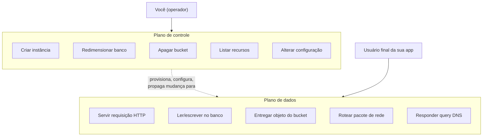
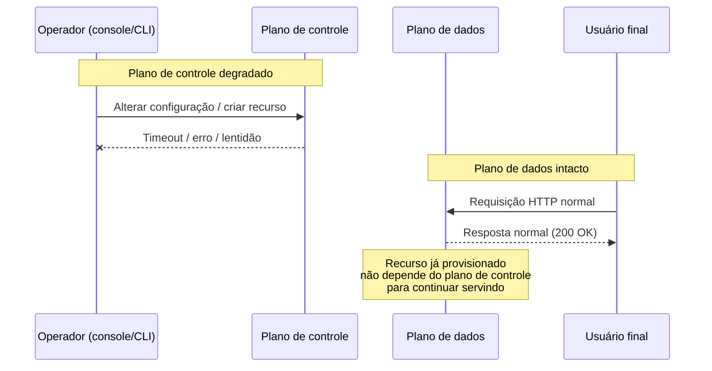
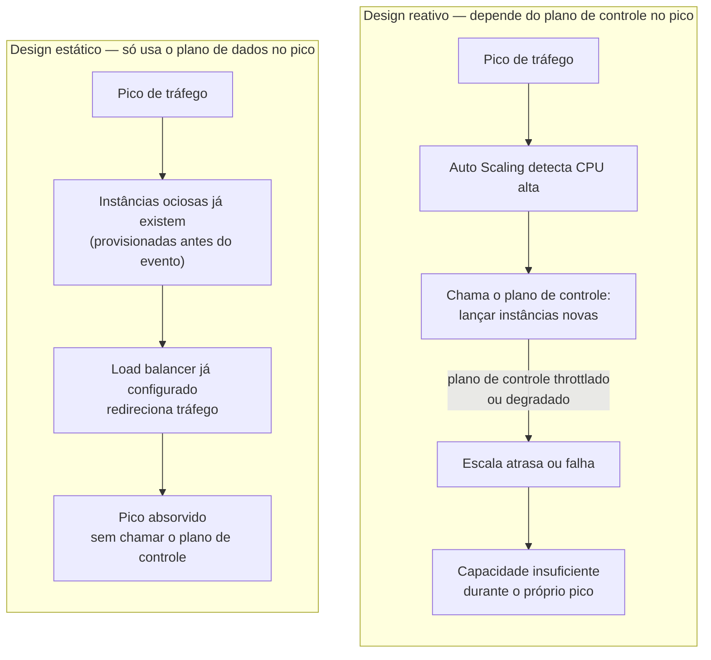
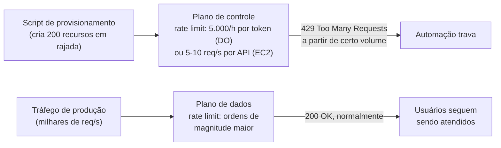

# Plano de controle e plano de dados

> [!abstract] TL;DR
> Todo provedor de nuvem é, por dentro, dois sistemas com propriedades opostas rodando lado a lado. O **plano de controle** é a burocracia — a API que cria, altera, lista e destrói recursos; ele é complexo, orquestra dezenas de subsistemas, e é otimizado para consistência, não para disponibilidade máxima. O **plano de dados** é o trabalho — a instância rodando, o objeto sendo servido, a query respondendo; ele é deliberadamente simples, com poucas peças móveis, e otimizado para ficar de pé o tempo todo. A consequência prática: o console pode cair enquanto sua aplicação continua servindo tráfego sem interrupção; um `deploy` pode travar enquanto o site que já estava no ar segue no ar; e a automação mais perigosa que você pode escrever é a que bate o plano de controle em rajada, porque é ele — não o seu tráfego de produção — que tem rate limit baixo e é o primeiro a cair de joelhos.

## O incidente que confunde gente sênior

É sexta-feira, 16h. Alguém abre o console da AWS só para checar o status de uma instância antes de fechar o notebook. O console não carrega — fica girando, depois devolve um erro genérico. Pânico imediato: "a AWS caiu, nossa aplicação deve estar fora do ar". A pessoa abre o site de produção numa outra aba, torcendo para confirmar o desastre e já preparando a mensagem no canal de incidentes.

O site carrega normalmente. Rápido, sem erro, como se nada tivesse acontecido. A API que os clientes usam responde nos mesmos milissegundos de sempre. O banco de dados aceita conexões, o load balancer distribui tráfego, os workers processam a fila. Nada, absolutamente nada do que o usuário final experimenta, está degradado.

O que caiu foi só a **capacidade de gerenciar** a infraestrutura — não a infraestrutura em si. E é exatamente esse fato, contraintuitivo para quem nunca parou para pensar na anatomia de um provedor, que esta nota existe para explicar: por que "o console caiu" e "meu site caiu" são, tecnicamente, dois eventos independentes, que podem — e frequentemente ocorrem — sem qualquer relação de causa entre eles.

A resposta está numa distinção que a própria AWS documenta formalmente como fundamento de como constrói seus serviços para alta disponibilidade: todo serviço de nuvem é dividido, por design, em dois planos com propósitos, arquiteturas e garantias de disponibilidade completamente diferentes[^1].

## Duas máquinas dentro de um serviço

Pega qualquer serviço de nuvem — Amazon EC2, S3, um banco gerenciado, um Droplet da DigitalOcean — e ele é, por dentro, a soma de dois sistemas que raramente aparecem separados na documentação de marketing, mas que qualquer engenheiro do próprio provedor trata como entidades distintas.

O **plano de controle** (control plane) é a API administrativa: o conjunto de operações que criam, leem/descrevem, atualizam, deletam e listam recursos — o padrão que a própria documentação da AWS resume pela sigla CRUDL (create, read, update, delete, list)[^1]. Lançar uma instância nova, criar um bucket, descrever uma fila, redimensionar um banco, apagar um volume: tudo isso é plano de controle. E lançar uma instância, especificamente, não é uma operação simples — o provedor precisa encontrar um host físico com capacidade disponível, alocar interface de rede, preparar um volume de armazenamento, gerar credenciais IAM, aplicar regras de firewall, e mais uma dúzia de passos coordenados[^1]. Não é à toa que a própria AWS descreve planos de controle como "sistemas complicados de orquestração e agregação"[^1].

O **plano de dados** (data plane) é a função primária do serviço — o trabalho de verdade. A instância EC2 já rodando o seu processo. A leitura e escrita num volume EBS. Colocar e buscar um objeto num bucket S3. Responder uma query DNS[^1]. É o que o cliente final da sua aplicação efetivamente toca, mesmo sem saber que esse nome existe.



| Dimensão | Plano de controle | Plano de dados |
|---|---|---|
| O que faz | Cria, lê/descreve, atualiza, apaga e lista recursos (CRUDL)[^1] | Executa a função primária do serviço — serve tráfego real |
| Otimizado para | Consistência forte | Disponibilidade máxima |
| Complexidade interna | Orquestração entre dezenas de subsistemas (rede, storage, IAM, cota, billing) | Poucas peças móveis, por design[^1] |
| Escopo típico | Frequentemente concentrado numa única region — ex.: as APIs de gerência do Route 53 rodam só em US East (N. Virginia)[^2] | Distribuído globalmente, redundante entre AZs/regions |
| Rate limit típico | Baixo, pensado para "alguém configurando infraestrutura" — ex.: `RunInstances` aceita só 5 requisições/segundo (bucket de requisição) na EC2[^7], ou 5.000 req/hora por token na DigitalOcean[^6] | Alto, pensado para o volume de produção — ex.: 10.000 requisições/segundo por conta/region no API Gateway[^4][^5] |
| O que acontece quando cai | Você não consegue criar, mudar ou apagar nada; o que já existe continua rodando sem depender dele[^2] | A aplicação para de responder aos usuários finais — impacto direto e imediato |
| Exemplos de operação | `aws ec2 run-instances`, `doctl compute droplet create`, um clique no console | Uma requisição HTTP à API pública, uma leitura no banco, uma resposta de query DNS |

A diferença não é só de vocabulário — é de arquitetura, e ela existe por um motivo deliberado. O plano de controle carrega lógica de negócio, workflows de múltiplas etapas, bancos de dados internos de metadados, verificação de cota, orquestração entre dezenas de subsistemas. O plano de dados é, de propósito, **mais simples, com menos peças móveis** — e a própria AWS é explícita sobre a consequência disso: "isso faz com que eventos de falha sejam estatisticamente menos prováveis no plano de dados do que no plano de controle"[^1]. Um sistema com menos partes tem menos formas de quebrar. Essa não é uma coincidência de engenharia — é a razão pela qual o provedor separa os dois planos como componentes distintos: **o plano de controle é otimizado para consistência forte; o plano de dados é otimizado para disponibilidade**.

Isso não é abstrato — dá para ver a diferença de natureza comparando os comandos lado a lado. Criar um recurso, na AWS e na DigitalOcean, é sempre uma chamada ao plano de controle:

```bash
# Plano de controle — cria um recurso (AWS)
aws ec2 run-instances \
  --image-id ami-0abcdef1234567890 \
  --instance-type t3.micro \
  --count 1 \
  --key-name minha-chave \
  --security-group-ids sg-0123456789abcdef0
```

```bash
# Plano de controle — cria um recurso (DigitalOcean)
doctl compute droplet create meu-servidor \
  --region nyc3 \
  --size s-1vcpu-1gb \
  --image ubuntu-22-04-x64
```

Depois que a instância ou o Droplet existe, servir tráfego para ela é uma operação de natureza completamente diferente — não fala mais com a API de gerência do provedor, fala direto com a aplicação:

```bash
# Plano de dados — serve o tráfego real da aplicação já provisionada
curl -i https://api.minhaaplicacao.com/v1/pedidos/8231

# HTTP/1.1 200 OK
# Content-Type: application/json
#
# {"id": 8231, "status": "confirmado"}
```

O primeiro par de comandos pode falhar por throttling, por falta de cota, por uma dependência interna do provedor lenta — e a instância continua não existindo. O terceiro comando não tem nenhuma dessas dependências: uma vez que o recurso existe, ele responde sozinho.

## Por que o console pode cair e a app continuar no ar

Agora o incidente da abertura desta nota faz sentido técnico. O console web é só mais um cliente do plano de controle — uma interface gráfica que, por baixo, chama exatamente as mesmas APIs administrativas que uma automação chamaria. Quando o console fica lento ou fora do ar, o que degradou foi a capacidade de **consultar e alterar** o estado dos seus recursos — não o funcionamento dos recursos que já existem e já estão configurados.

Uma vez que uma instância está no ar, um bucket está criado, um registro DNS está propagado — o plano de dados que serve esse recurso **não depende mais do plano de controle para continuar funcionando**. É esse desacoplamento que a AWS chama de "estabilidade estática" (*static stability*): o sistema em produção continua respondendo com a configuração que já tinha, mesmo que o sistema que criou aquela configuração esteja temporariamente impedido de fazer qualquer mudança nova[^2].

O caso mais didático disso, documentado explicitamente pela própria AWS, é o Route 53 — o serviço de DNS. As APIs de gerência do Route 53 (criar, atualizar, apagar registros — e o próprio console) rodam num plano de controle que fica concentrado numa única region, US East (N. Virginia), porque essa concentração é o que garante a consistência forte que gerenciar DNS exige. Já o plano de dados do Route 53 — o sistema que efetivamente **responde às queries DNS e executa health checks** — é distribuído globalmente e desenhado para um SLA de 100% de disponibilidade[^2]. A própria documentação da AWS admite que podem existir "eventos raros nos quais o desenho resiliente do plano de dados permite que ele mantenha disponibilidade enquanto o plano de controle não consegue"[^2] — ou seja: o cenário "não consigo mudar meu DNS agora, mas todo mundo continua resolvendo o domínio normalmente" não é hipotético, é o comportamento que o próprio design pretende garantir.



> [!info] Fronteira
> Multi-AZ, failover entre regions e as estratégias de projetar para resistir a esse tipo de degradação são assunto da trilha [[03-Dominios/Engenharia/Operação/index|Operação (DevOps/SRE)]] e do bloco 20 desta trilha (Multi-AZ/DR como estratégia). Aqui, o objetivo é só entender por que a separação existe e o que ela implica no seu dia a dia.

## Estabilidade estática: projetar assumindo que o plano de controle pode sumir

"Estabilidade estática" não é só um nome bonito para "o plano de dados continua rodando" — é uma decisão de arquitetura que você toma **antes** do incidente, não durante. E a decisão mais comum onde ela aparece é em como um sistema reage a um pico de tráfego.

Pega um serviço de checkout que processa, em dia normal, 200 requisições por segundo, com picos sazonais que podem triplicar esse volume por algumas horas. Há duas formas de projetar a capacidade para esse pico — e elas têm relação completamente diferente com o plano de controle no momento em que o pico realmente acontece.

**Design reativo.** Um Auto Scaling Group configurado com capacidade mínima de 4 instâncias e máxima de 20, escalando por CPU: quando a média ultrapassa 60%, o ASG chama o plano de controle para lançar mais instâncias, duas de cada vez. Funciona bem em testes de carga controlados. O problema aparece quando o pico de tráfego coincide com algum tipo de degradação regional mais ampla — porque nesses eventos, é comum um volume grande de contas tentando escalar ao mesmo tempo, e é exatamente esse tipo de rajada coordenada que mais pressiona o plano de controle de compute de uma region. Se as chamadas de "lançar instância" começarem a ser throttladas ou atrasarem, o ASG fica preso num ciclo de "detectou CPU alta → tentou escalar → não conseguiu a tempo → CPU continua alta", e a capacidade nova simplesmente não chega na velocidade que o pico está exigindo. A ironia: o sistema foi desenhado para reagir a picos, e é justamente durante o pico que o mecanismo de reação tem mais chance de falhar.

**Design estático.** A alternativa que o Well-Architected recomenda explicitamente é inverter a lógica: manter o ASG com capacidade mínima já igual à máxima esperada — os mesmos 20 instâncias, ociosas na maior parte do tempo, sempre no ar[^3]. Quando o pico chega, não existe nenhuma chamada ao plano de controle no caminho crítico: o load balancer, que já está configurado com essas 20 instâncias no seu target group, simplesmente distribui mais tráfego para elas. É uma operação de plano de dados do início ao fim. O mesmo princípio, em Kubernetes, vira "adicionar pods em nós que já existem é ação de plano de dados; adicionar nós novos ao cluster é ação de plano de controle" — e a prática recomendada para absorver picos é manter nós **superprovisionados** de propósito, para que o scheduler só precise agendar pods novos, nunca esperar por infraestrutura nova[^3].



O trade-off é honesto e vale nomear: capacidade ociosa custa dinheiro o tempo todo, não só durante o pico. A decisão de manter 20 instâncias em vez de 4 é uma aposta de que o custo de ficar fora do ar durante um evento de alta demanda é maior que o custo de pagar por capacidade parada — e essa é, especificamente, a pergunta que separa "escalar sob demanda" de "projetar para estabilidade estática": não é sobre qual técnica é melhor em abstrato, é sobre em qual momento você quer pagar o custo — sempre um pouco, ou tudo de uma vez, na hora em que o plano de controle é o recurso mais escasso do sistema inteiro.

| Dimensão | Design reativo (escala sob demanda) | Design estático (capacidade pré-provisionada) |
|---|---|---|
| Depende do plano de controle no pico? | Sim — precisa criar recursos novos na hora exata do pico | Não — a capacidade já existe, só recebe mais tráfego |
| Custo em dia normal | Menor — paga só pela capacidade mínima | Maior — paga pela capacidade máxima o tempo todo |
| Risco num evento amplo de indisponibilidade | Alto — é justamente quando o plano de controle tem mais chance de estar congestionado | Baixo — a recuperação inteira é uma operação de plano de dados |
| Equivalente em Kubernetes | Cluster Autoscaler adicionando nós novos | Nós superprovisionados absorvendo pods sem esperar infraestrutura nova[^3] |
| Recomendação do Well-Architected | Evitar como único mecanismo de recuperação num incidente[^3] | Preferir para os componentes mais críticos[^3] |

> [!tip] Assista: Beyond five 9s — Lessons from our highest available data planes
> **Canal:** AWS Events | **Duração:** ~48min | **Idioma:** EN
>
> Talk de re:Invent de um engenheiro que trabalha nos data planes mais críticos da AWS: mostra por que a fronteira control plane/data plane às vezes é "fuzzy" na prática, e detalha o conceito de estabilidade estática do ponto de vista de quem projeta esses sistemas — inclusive a redução de blast radius como ferramenta complementar. Trecho de destaque [41:09]: *"static stability which just means if something were to fail if we turn it back on again it should just come to a working state"*
>
> 🎬 [Assistir no YouTube](https://www.youtube.com/watch?v=2L1S0zfnIzo)

## Por que um deploy pode travar com o site no ar

O mesmo raciocínio explica um segundo cenário, ainda mais comum no cotidiano de quem opera aplicações: você dispara um deploy — trocar a versão de uma aplicação rodando num serviço gerenciado de containers, redimensionar um cluster, atualizar a configuração de um load balancer — e a operação trava. A barra de progresso do pipeline de CI/CD para em "atualizando", sem avançar. Nesse meio-tempo, os usuários continuam acessando a versão **anterior** da aplicação, sem qualquer interrupção perceptível.

Isso acontece porque um deploy é, do início ao fim, uma sequência de operações de **plano de controle**: criar uma nova revisão do serviço, provisionar as novas instâncias ou containers, atualizar o registro de destinos do load balancer, drenar conexões da versão antiga, decidir quando considerar o rollout concluído. Se qualquer etapa dessa orquestração travar — por um problema temporário no plano de controle do provedor, por uma cota que você não sabia que existia, por uma dependência interna do serviço de deploy que está lenta — o efeito não é "o site cai". O efeito é "a versão antiga continua servindo, porque ela é plano de dados, e o plano de dados não pede permissão ao plano de controle para continuar rodando o que já estava rodando".

Essa mesma lógica é, aliás, a base de uma prática de resiliência que o Well-Architected Framework da AWS recomenda explicitamente: durante uma recuperação de incidente, prefira ações de plano de dados a ações de plano de controle. A recomendação chega a dar exemplos concretos de substituição — trocar "escalar via Auto Scaling" (controle) por "manter capacidade pré-provisionada e ociosa" (dados); trocar "escalar instâncias EC2" (controle) por "deixar o Lambda escalar sozinho" (dados, porque invocar uma função já provisionada é ação de dados, não de controle)[^3]. O princípio geral, nas palavras do próprio framework: minimize o número de operações de plano de controle necessárias para recuperar, redimensionar, curar ou fazer failover de um serviço durante uma degradação — porque é justamente nesses momentos de estresse que o plano de controle, sobrecarregado por todo mundo tentando reagir ao mesmo tempo, é o que tem mais chance de estar indisponível[^3].

> [!warning] Deploy travado não é "o provedor caiu"
> Antes de escalar um incidente como "a nuvem está fora do ar", cheque separadamente: (1) a aplicação em produção está respondendo normalmente aos usuários? (2) só a operação de gerência — deploy, scaling manual, alteração de configuração — está travada? Se a resposta for "sim" para as duas, você tem uma degradação de plano de controle, não de plano de dados. O playbook de resposta é diferente: não adianta reiniciar a aplicação (ela está bem); o gargalo está na camada que orquestra mudanças, e insistir nela em loop tende a piorar, não a resolver.

## Por que a automação agressiva esbarra no plano de controle primeiro

O terceiro padrão de falha é o inverso dos dois primeiros: em vez do provedor degradar o plano de controle, é **você** quem o derruba — sem querer, com uma automação bem-intencionada.

O cenário é recorrente: um time escreve um script que, ao subir um ambiente novo, cria dezenas de recursos em sequência apertada — uma VM, um volume, uma regra de firewall, um registro DNS, um banco, repetido para cada um de vinte microsserviços, tudo disparado quase ao mesmo tempo por um pipeline de CI que roda em paralelo. Ou um job de limpeza que varre milhares de recursos órfãos e tenta apagar todos de uma vez. Ou um sistema de auto-scaling mal calibrado que, numa rajada de tráfego, tenta provisionar centenas de instâncias novas em segundos. Em algum ponto, as chamadas começam a voltar com erro `429 Too Many Requests`, e a automação trava inteira, mesmo que o tráfego de produção que a motivou continue sendo perfeitamente absorvível pela infraestrutura já existente.

Isso acontece porque **o plano de controle é rate-limited de forma muito mais agressiva que o plano de dados** — e por um motivo estrutural, não arbitrário: como cada chamada de controle pode disparar uma cascata de trabalho interno (o exemplo de "lançar uma instância" que envolve achar host, alocar rede, gerar credenciais, aplicar regras), o provedor precisa proteger esse subsistema de ser inundado, sob pena de o próprio mecanismo de orquestração degradar para todos os clientes da region, não só para quem está gerando a rajada. O plano de dados, por servir uma unidade de trabalho muito mais previsível e barata (uma requisição HTTP, uma leitura de bloco), tolera volumes ordens de magnitude maiores antes de precisar throttlar.

A AWS documenta esse desenho explicitamente no API Gateway, que é ele mesmo dividido em plano de controle (as APIs que criam e configuram APIs) e plano de dados (as APIs que você mesmo publica e que seus clientes chamam). O throttling do plano de dados do API Gateway usa um algoritmo de *token bucket*: cada requisição consome um token de um balde que se reabastece numa taxa fixa (o limite "steady-state") e tem uma capacidade máxima (o limite de *burst*) — por padrão, a conta inteira numa region é limitada a **10.000 requisições por segundo em regime permanente, com um balde de burst de até 5.000 requisições** (em algumas regions menores, como África/Cidade do Cabo ou Ásia-Pacífico/Jacarta, o padrão cai para 2.500 RPS / 1.250 de burst); o limite de conta é ajustável mediante pedido de aumento de cota[^4][^5]. Já as operações de plano de controle — criar, atualizar, deletar uma API, um recurso, um método — têm cotas próprias e **fixas, que não podem ser aumentadas**: `CreateRestApi` para API regional aceita 1 requisição a cada 3 segundos por conta; `UpdateAccount` aceita 1 a cada 20 segundos; o total de operações de gerência da conta é limitado a 10 requisições/segundo com burst de 40[^5]. Ultrapassar qualquer um dos dois devolve o mesmo `429`, mas o teto que você bate primeiro, numa automação de provisionamento, quase sempre é o do plano de controle — porque ele é ordens de grandeza mais baixo e, ao contrário do limite de dados, não dá para pedir aumento.

```bash
# Plano de controle do API Gateway — cria a API (não serve tráfego nenhum)
aws apigateway create-rest-api --name "minha-api"
# Limite fixo: 1 requisição a cada 3 segundos por conta (API regional/privada)

# Plano de dados do API Gateway — invoca o endpoint já publicado
curl -s https://abc123.execute-api.us-east-1.amazonaws.com/prod/pedidos/8231
# Limite padrão da conta: 10.000 req/s em regime permanente,
# balde de burst de até 5.000 requisições (algoritmo token bucket)
```

Na DigitalOcean, esse mesmo desenho aparece de forma mais simples e mais visível: a API de gerência (criar Droplet, listar Spaces, redimensionar banco — tudo plano de controle) é limitada, por padrão, a 5.000 requisições por hora por token OAuth, um número que você pode inspecionar diretamente com `doctl account ratelimit`, que devolve o limite, quanto ainda resta na janela atual, e quando o contador reseta[^6]. Isso é uma ordem de grandeza menor do que qualquer serviço de dados — um Droplet já rodando aceita muito mais de 5.000 conexões TCP por hora sem imprimir nem um alerta.

```bash
$ doctl account ratelimit
Limit    Remaining    Reset
5000     4998         2026-07-22 16:00:00 +0000 UTC
```

A EC2 mostra o mesmo desenho de outro ângulo: `RunInstances` (a chamada de plano de controle por trás do primeiro comando desta nota) tem **dois** buckets de token separados e independentes — um pelo volume de *chamadas* que você faz, outro pelo volume de *instâncias* que você pede para criar[^7]:

| Bucket do `RunInstances` | Capacidade máxima | Reabastecimento |
|---|---|---|
| Bucket de requisição (nº de chamadas à API) | 5 tokens | 2 tokens/segundo |
| Bucket de recurso (nº de instâncias pedidas) | 1.000 tokens | 2 tokens/segundo |

Na prática: dá para lançar 1.000 instâncias de uma vez (o bucket de recurso aguenta), mas não dá para fazer isso chamando o `RunInstances` seis vezes seguidas no mesmo segundo (o bucket de requisição, de só 5 tokens, estoura antes). Isso não é peculiaridade do `RunInstances` — a EC2 agrupa toda chamada de controle numa de quatro categorias, cada uma com seu próprio orçamento[^7]:

| Categoria de chamada | Exemplos | Capacidade máxima | Reabastecimento |
|---|---|---|---|
| Não-mutante (`Describe*`, `List*`, `Get*`) | `DescribeInstances`, `DescribeVolumes` | 100 tokens | 20/segundo |
| Mutante (cria/altera/apaga) | `CreateVolume`, `ModifyInstanceMetadataOptions` | 50 tokens | 5/segundo |
| Intensiva em recursos | Operações que consomem mais trabalho interno | 50 tokens | 5/segundo |
| Não-mutante via console | As mesmas consultas, quando disparadas pelo console web | 100 tokens | 10/segundo |

O padrão é consistente com tudo que esta nota já mostrou: **ler é mais barato que escrever**, mesmo dentro do próprio plano de controle — consultar o estado de um recurso (não-mutante) tem um orçamento bem maior do que mudar esse estado (mutante), porque só a segunda dispara a cascata de orquestração que o provedor precisa proteger. Ultrapassar qualquer um dos dois devolve o mesmo erro documentado pela AWS:

```bash
$ aws ec2 run-instances --image-id ami-0abcdef1234567890 --count 1
An error occurred (RequestLimitExceeded) when calling the RunInstances operation:
The maximum request rate permitted by the Amazon EC2 APIs has been exceeded for your account.
```

A resposta correta não é tentar de novo imediatamente — é *backoff* exponencial com jitter, que dá tempo para o balde reabastecer antes da próxima tentativa:

```python
import random
import time

def chamar_com_backoff(fn, tentativas=5):
    for i in range(tentativas):
        try:
            return fn()
        except RequestLimitExceeded:
            if i == tentativas - 1:
                raise
            espera = min(2 ** i, 30) + random.uniform(0, 1)  # exponencial + jitter
            time.sleep(espera)
```

Vale visualizar por que isso funciona: a espera base dobra a cada tentativa, e o jitter (o `random.uniform(0, 1)`) evita que várias chamadas que falharam juntas voltem a tentar exatamente no mesmo instante — o que, sozinho, já recriaria a rajada que causou o throttling em primeiro lugar.

| Tentativa | Espera base (2^i) | Espera com jitter (exemplo) |
|---|---|---|
| 0 | 1s | 1,3s |
| 1 | 2s | 2,7s |
| 2 | 4s | 4,1s |
| 3 | 8s | 8,9s |
| 4 | 16s | 16,4s |

Cinco tentativas assim custam, no pior caso, pouco mais de 30 segundos até desistir — tempo suficiente para o bucket de tokens (que reabastece 2 por segundo, neste exemplo do `RunInstances`) se recuperar sozinho, sem que a automação precise saber, em código, qual é exatamente a taxa de reabastecimento do provedor.



O padrão prático que emerge: **plano de controle se trata como um recurso escasso e caro de chamar; plano de dados se trata como o motor que efetivamente sustenta a carga de produção**. Uma automação bem escrita para provisionamento em massa não dispara centenas de chamadas de controle em paralelo sem controle de fluxo — ela introduz *backoff* exponencial, respeita os cabeçalhos de rate limit que o provedor devolve, e trata `429` como sinal esperado de operação normal em escala, não como bug a ser silenciado com retry imediato em loop.

## A mesma distinção, em nomes diferentes: Azure e GCP

Até aqui, os exemplos concretos vieram de AWS e DigitalOcean — os dois provedores que ancoram esta trilha. Mas a separação entre plano de controle e plano de dados não é peculiaridade da AWS: é um padrão de arquitetura que qualquer provedor de nuvem de porte adota, ainda que com nomes e desenhos próprios.

A Azure documenta essa separação de forma quase idêntica, só que com um detalhe extra que a torna ainda mais visível: o plano de controle inteiro tem uma **URL fixa e única** — `https://management.azure.com` — enquanto cada instância de recurso do plano de dados tem seu próprio endpoint. Criar uma conta de armazenamento é uma chamada ao plano de controle; ler e escrever dados nela usa um endereço inteiramente diferente, específico daquela conta (algo como `https://minhaconta.blob.core.windows.net`), que a própria documentação da Microsoft afirma continuar acessível "mesmo quando `https://management.azure.com` não está disponível"[^8]. É a mesma garantia estrutural que o Route 53 oferece — só que exposta de um jeito ainda mais literal: dois hostnames diferentes para dois planos diferentes.

| Conceito | AWS | DigitalOcean | Azure |
|---|---|---|---|
| Criar/listar/apagar um recurso | `aws ec2 run-instances`, console, SDK | `doctl compute droplet create`, console, SDK | Chamada ao Azure Resource Manager, sempre via `management.azure.com`[^8] |
| Usar o recurso já criado | Conectar via SSH, servir tráfego HTTP | Conectar via SSH, servir tráfego HTTP | Endpoint próprio do recurso — ex.: RDP na VM, ou `*.blob.core.windows.net` no storage[^8] |
| Rate limit do plano de controle | 5-10 req/s por API na EC2, dependendo da operação[^7] | 5.000 req/hora por token OAuth[^6] | Cotas do Resource Manager por assinatura/região (fora do escopo desta nota) |
| O que sobrevive a uma degradação do plano de controle | Instâncias e recursos já provisionados[^1][^2] | Droplets e recursos já provisionados | Dados já gravados, acessíveis pelo endpoint próprio do recurso[^8] |

O GCP segue o mesmo princípio de fundo — a API do Compute Engine que cria e configura VMs é uma coisa, servir tráfego a partir de uma VM já rodando é outra —, mas, diferente da AWS e da Azure, não tem uma página de documentação única e formal batizando essa separação de "control plane vs. data plane" no nível de conta/recurso. O termo aparece de forma explícita em contextos mais específicos — no GKE, por exemplo, onde o control plane do cluster Kubernetes é, literalmente, um componente gerenciado separado dos nós que executam as cargas de trabalho. O padrão estrutural é o mesmo dos outros três provedores; só a documentação formal, no caso do GCP, é menos unificada.

> [!info] Fronteira
> Uma comparação campo a campo entre os quatro provedores — IAM, rede, billing — foge do escopo desta nota. O objetivo aqui foi só confirmar que a distinção controle/dados não é jargão específico da AWS: é como qualquer provedor de porte precisa se organizar internamente para sustentar alta disponibilidade.

## Diagnóstico rápido: qual plano está degradado

Antes de escalar qualquer coisa, esta tabela resume os sintomas mais comuns e para qual plano eles apontam:

| Sintoma | O que ainda funciona | O que está degradado | Causa raiz |
|---|---|---|---|
| Console não carrega / erro genérico ao abrir | Aplicação em produção, API pública, banco de dados | Visualização e edição via console | Plano de controle |
| `run-instances`/`droplet create` retorna `429`/`RequestLimitExceeded` | Instâncias já rodando continuam servindo tráfego normalmente | Criação de recursos novos | Plano de controle (rate limit) |
| Deploy trava em "atualizando" no pipeline de CI/CD | Versão anterior da aplicação, ainda no ar e servindo usuários | Rollout da nova versão | Plano de controle |
| Auto-scaling não consegue subir instâncias durante um pico | Instâncias já existentes continuam atendendo o tráfego | Capacidade adicional sob demanda | Plano de controle (throttling em cascata) |
| Console/API de gerência do Route 53 fora do ar | Resolução de DNS para registros já existentes e propagados | Criar, atualizar ou apagar registros DNS | Plano de controle (concentrado em US East/N. Virginia)[^2] |

## Casos práticos

**A migração que falhou "sem motivo aparente".** Um time decide migrar duzentos bancos de dados gerenciados de uma region para outra, escrevendo um script que dispara a operação de criação da réplica de destino para todos de uma vez, em paralelo, via SDK. Depois de algumas dezenas de chamadas bem-sucedidas, o restante começa a falhar com erro de limite de taxa. A primeira suspeita é "o provedor está com capacidade insuficiente na region de destino" — uma leitura errada. O que aconteceu foi o plano de controle da API de bancos gerenciados throttlando a conta, porque duzentas operações de "criar réplica" (cada uma envolvendo provisionamento de storage, rede e credenciais) disparadas em rajada excedem, de longe, o volume que esse endpoint específico foi dimensionado para absorver por minuto. A correção não é abrir um chamado pedindo mais capacidade de compute — é reescrever o script para enfileirar as chamadas com um limite de concorrência baixo (cinco ou dez por vez) e um backoff que respeita o cabeçalho de "tentar de novo em N segundos" que a API já devolve.

**O "provedor caiu" que era só o console.** Durante uma manutenção não programada, o console de gerência de um provedor fica intermitente por cerca de quarenta minutos — carrega parcialmente, alguns painéis retornam erro, login demora. Um time, ao ver isso, declara incidente de severidade máxima e começa a preparar comunicação para clientes, assumindo que a aplicação está fora do ar. Só que o dashboard de monitoramento de uptime da própria aplicação — que mede a aplicação real, não o console do provedor — não registra nenhuma queda de disponibilidade nem aumento de latência durante essa janela. O incidente correto a declarar era "console do provedor instável, sem impacto identificado em produção; monitorando" — uma severidade completamente diferente, que não exige acordar ninguém fora do horário comercial. A lição prática: **tenha um jeito de checar a saúde real da sua aplicação que não dependa do console do provedor** — um endpoint de health check próprio, batido de fora, é a fonte de verdade; o console é só uma ferramenta de operação, não um proxy confiável para "meu sistema está de pé".

**O health check que confundiu os dois planos.** Um time constrói um script de saúde de fleet para decidir, a cada minuto, quais instâncias ficam no target group do load balancer: em vez de bater no `/healthz` de cada instância — o endpoint da própria aplicação, que é plano de dados —, o script chama a API de gerência do provedor (`describe-instances` ou equivalente) para confirmar que o estado de cada instância está `running`, e usa isso como proxy de "está saudável". Funciona meses a fio, porque a API de gerência quase sempre responde rápido. No dia em que o plano de controle da conta fica lento — por uma degradação regional, ou por outra automação da própria empresa consumindo o rate limit em paralelo —, o script de saúde começa a estourar timeout em várias chamadas de `describe-instances`. Sem confirmação fresca de que as instâncias estão `running`, a automação assume o pior e remove essas instâncias do target group. O load balancer passa a rejeitar tráfego para máquinas que, na realidade, nunca pararam de responder a uma única requisição HTTP — o outage foi inteiramente causado pela automação, não por nenhuma falha real de infraestrutura. A correção estrutural: um health check nunca deve depender do plano de controle para decidir sobre o plano de dados; ele precisa bater diretamente no que o usuário final bate, porque é a única fonte de verdade sobre se a aplicação está de fato servindo.

**O auto-scaling que amplificou, em vez de resolver, um pico de tráfego.** Um serviço configurado para escalar agressivamente — adicionando instâncias novas a cada poucos segundos enquanto a métrica de CPU estiver acima do limiar — enfrenta um pico de tráfego real e dispara dezenas de chamadas de "criar instância" em sequência apertada. O plano de controle de compute da conta começa a throttlar essas chamadas específicas, e o grupo de auto-scaling entra num estado de "tentando escalar, falhando, tentando de novo" que consome tempo e não adiciona capacidade nova na velocidade que o pico exigiria. A causa raiz não foi falta de capacidade de VM na region — foi a velocidade da própria tentativa de escalar batendo no teto do plano de controle. A correção que o próprio Well-Architected recomenda é rigorosamente essa: manter uma margem de capacidade **já provisionada e ociosa** para absorver o pico inicial via plano de dados (instâncias que já existem, só recebem mais tráfego), em vez de depender inteiramente do plano de controle para reagir em tempo real ao pico[^3].

## Como monitorar cada plano separadamente

O caso do health check acima aponta para um problema mais geral: a maioria dos times monitora só um dos dois planos — normalmente o de dados, porque é o que afeta o usuário — e fica cega para degradações do outro até esbarrar nelas no meio de uma operação crítica, como um deploy ou uma recuperação de incidente. Vale tratar os dois como superfícies de observabilidade **separadas**, com fontes de verdade diferentes:

| O que monitorar | Plano de controle | Plano de dados |
|---|---|---|
| Pergunta que a métrica responde | "Eu consigo mudar minha infraestrutura agora?" | "Meus usuários estão sendo atendidos agora?" |
| Métrica principal | Taxa de erro e latência das chamadas de API de gerência (`RequestLimitExceeded`, `429`, timeouts) | Taxa de erro e latência percebidas pelo cliente final da aplicação |
| Fonte de verdade | Métricas de API do próprio provedor — a AWS recomenda explicitamente usar o CloudWatch para rastrear throttling da API da EC2[^7] | Health check HTTP próprio, batido de fora, independente do console do provedor |
| Onde costuma faltar visibilidade | Times raramente têm alarme dedicado para throttling de API — só percebem quando um deploy trava | Geralmente já existe (APM, uptime monitor), mas às vezes é substituído por proxy indireto (como no caso do health check acima) |

A implicação prática: se o único jeito que seu time tem de saber que "o plano de controle está degradado" é um deploy travando ao vivo, vocês estão descobrindo o problema tarde demais — no meio da operação que mais precisava dele funcionando. Um alarme dedicado para taxa de erro nas chamadas de gerência (throttling, timeout, erro 5xx do provedor) dá o mesmo tipo de aviso antecipado que um alarme de CPU dá para o plano de dados — só que apontando para uma causa raiz completamente diferente.

## Armadilhas comuns

> [!warning] Confundir "console lento" com "aplicação fora do ar"
> São dois sistemas diferentes. Antes de escalar um incidente, verifique separadamente a saúde da aplicação (idealmente via um monitor externo, independente do console) e a saúde do console/API de gerência. Um não implica o outro.

> [!warning] Retry agressivo em loop contra um `429` de plano de controle
> Repetir a mesma chamada de controle imediatamente após um `429` piora o problema — você continua consumindo o orçamento de rate limit que está tentando se recuperar. A resposta correta é *backoff* exponencial com jitter, e, quando o provedor expõe um cabeçalho de "tentar novamente em N segundos" (como o `Retry-After` ou equivalente), respeitá-lo em vez de decidir o intervalo por conta própria.

> [!warning] Projetar failover que depende do plano de controle para funcionar
> Um plano de disaster recovery que assume "na hora do desastre, eu crio réplicas novas e redireciono DNS via API" está apostando exatamente no sistema que tem mais chance de estar degradado durante um evento amplo de indisponibilidade. Failover robusto prioriza mecanismos de plano de dados (capacidade já provisionada, health checks que já existem e já decidem sozinhos) sobre criar recursos novos sob pressão.

## O padrão por trás de tudo isso

Os quatro cenários desta nota — console fora do ar, deploy travado, automação esbarrando em rate limit, health check confundindo os planos — são, no fundo, a mesma pergunta feita de ângulos diferentes: **o que este sistema precisa que o plano de controle esteja funcionando, exatamente no momento em que eu mais preciso que ele funcione?**

É essa pergunta, feita de forma sistemática, que separa um design ingênuo de um design de arquiteto sênior. Não é sobre nunca usar o plano de controle — toda infraestrutura precisa ser criada, configurada e mudada em algum momento. É sobre reconhecer que existe uma classe inteira de decisões — como escalar sob pressão, como fazer failover, como decidir se um recurso está saudável — em que colocar o plano de controle no caminho crítico é apostar contra as próprias probabilidades: é precisamente durante incidentes amplos, picos de tráfego e momentos de reação coletiva que esse plano tende a estar mais carregado, porque é nesses momentos que todo mundo tenta mudar alguma coisa ao mesmo tempo.

O padrão de resposta se repete em cada caso desta nota: prefira o que já existe (capacidade pré-provisionada) a criar algo novo sob pressão; prefira medir o sintoma real (a aplicação responde?) a medir um proxy que passa pelo plano de controle (a API de gerência confirma o estado?); e, quando não tiver escolha a não ser chamar o plano de controle, trate-o como um recurso escasso — com fila, com *backoff*, nunca em rajada.

Essa não é uma lição só de infraestrutura de nuvem: postmortems de incidentes de larga escala, em praticamente qualquer provedor, mostram com frequência a mesma dinâmica — um evento inicial gera uma onda de tentativas de remediação automática, e é essa onda batendo no plano de controle, não o evento original, que transforma uma degradação parcial numa indisponibilidade mais ampla e mais demorada de resolver. O nome técnico da causa muda de incidente para incidente; a anatomia — controle sobrecarregado por quem está tentando corrigir o problema — se repete.

## O que vem a seguir

Entender que console, CLI, SDK e chamadas diretas de API são, todos eles, formas diferentes de falar com o **mesmo plano de controle** — e que nenhuma delas tem acesso a um caminho especial ou mais rápido — é o próximo passo. A próxima nota, **"As quatro portas — console, CLI, SDK e API"**, mostra por que "cliquei no console" e "chamei a API" são, tecnicamente, a mesma operação vista por duas portas diferentes, e por que essa equivalência é a base de tudo que vem depois nesta trilha.

## Fontes

[^1]: [AWS — Control planes and data planes (AWS Fault Isolation Boundaries whitepaper)](https://docs.aws.amazon.com/whitepapers/latest/aws-fault-isolation-boundaries/control-planes-and-data-planes.html) — definição formal de plano de controle (CRUDL) e plano de dados, e a explicação de por que planos de dados falham com menos frequência; acessado em 2026-07-20. [^2]: [AWS — REL11-BP04 Rely on the data plane and not the control plane during recovery (Well-Architected Framework, Reliability Pillar)](https://docs.aws.amazon.com/wellarchitected/latest/framework/rel_withstand_component_failures_avoid_control_plane.html) — caso do Route 53 (plano de controle concentrado em us-east-1, plano de dados global com SLA de 100%), recomendações de preferir ações de plano de dados durante recuperação; acessado em 2026-07-20. [^3]: [AWS — REL11-BP04, mesma página acima, seção "Implementation guidance" e "Implementation steps"](https://docs.aws.amazon.com/wellarchitected/latest/framework/rel_withstand_component_failures_avoid_control_plane.html) — exemplos de substituir ação de controle por ação de dados (Auto Scaling → capacidade pré-provisionada; scaling de EC2 → scaling de Lambda); acessado em 2026-07-20. [^4]: [AWS — Throttle requests to your REST APIs for better throughput in API Gateway (documentação oficial)](https://docs.aws.amazon.com/apigateway/latest/developerguide/api-gateway-request-throttling.html) — algoritmo de token bucket, limites de conta por region, resposta `429 Too Many Requests`; acessado em 2026-07-20. [^5]: [AWS — Amazon API Gateway quotas (documentação oficial)](https://docs.aws.amazon.com/apigateway/latest/developerguide/limits.html) — cotas de operações de plano de controle (gerência de APIs) separadas das cotas de plano de dados; acessado em 2026-07-20. [^6]: [DigitalOcean — doctl account ratelimit (documentação oficial)](https://docs.digitalocean.com/reference/doctl/reference/account/ratelimit/) — limite padrão de 5.000 requisições por hora por token OAuth, campos Limit/Remaining/Reset; acessado em 2026-07-20. [^7]: [AWS — Request throttling for the Amazon EC2 API (documentação oficial)](https://docs.aws.amazon.com/ec2/latest/devguide/ec2-api-throttling.html) — algoritmo de token bucket, buckets de requisição e de recurso do `RunInstances` (5 e 1.000 tokens, reabastecimento de 2/segundo cada), erro `RequestLimitExceeded`; acessado em 2026-07-22. [^8]: [Microsoft — Control plane and data plane operations, Azure Resource Manager (documentação oficial)](https://learn.microsoft.com/en-us/azure/azure-resource-manager/management/control-plane-and-data-plane) — definição formal, URL única do plano de controle (`management.azure.com`), exemplos de VM/RDP e storage account/blob endpoint, confirmação de que o plano de dados permanece acessível durante indisponibilidade do plano de controle; acessado em 2026-07-22.

