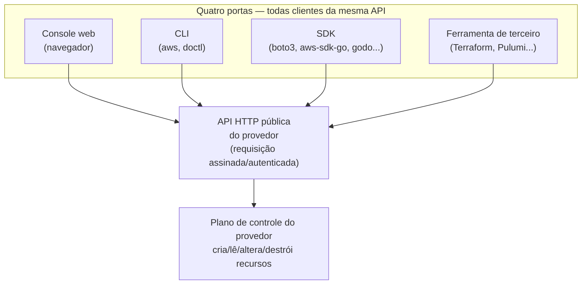
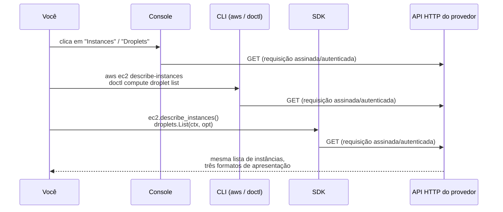

# As quatro portas — console, CLI, SDK e API

> [!abstract] TL;DR
> Console, CLI, SDK e API não são quatro formas *diferentes* de falar com um provedor de nuvem — são quatro clientes diferentes da **mesma** API HTTP. O console é só o mais visual dos quatro: um site que, nos bastidores, faz as mesmas chamadas assinadas que o `aws` CLI, o `doctl`, ou o código do seu SDK fariam. Entender isso muda como você trabalha: qualquer coisa que o console faz, você pode reproduzir por script; e qualquer coisa que você fizer só clicando no console, sem registrar em lugar nenhum, é trabalho que ninguém mais vai conseguir repetir exatamente igual. Essa última frase é a semente de um problema que só se resolve de verdade com infraestrutura como código.

## O droplet que ninguém sabia como tinha sido criado

Um incidente comum em times que ainda não amadureceram a disciplina de infraestrutura: uma instância de produção precisa ser recriada — talvez porque o disco corrompeu, talvez porque o time está migrando de região. Alguém abre o histórico do repositório de infraestrutura procurando o script ou o arquivo de configuração que criou aquela máquina originalmente. Não encontra nada. A instância existe, está rodando, tem um IP, tem tags, tem um tipo específico de CPU e memória — mas **não existe registro de como ela chegou a esse estado**. A conclusão, depois de perguntar a cada pessoa do time, é sempre a mesma: alguém abriu o console num dia qualquer, meses atrás, clicou em "Create", preencheu um formulário com a memória do que "parecia certo" na época, e apertou o botão. Funcionou. Ninguém guardou o que foi digitado em cada campo.

Reproduzir aquela máquina agora significa **adivinhar** — abrir o console de novo, tentar lembrar (ou inferir, olhando os detalhes da instância existente) qual tipo de instância, qual imagem, quais tags, qual configuração de rede foram escolhidas da primeira vez. Às vezes acerta. Às vezes não — e o erro só aparece semanas depois, quando alguma diferença sutil de configuração causa um comportamento diferente em produção.

O problema aqui não é o console. O console é uma ferramenta legítima, e usá-lo não é um erro em si. O problema é que a ação foi tomada por um caminho que **não deixa rastro reproduzível** — e isso é uma escolha de *como* você usa a nuvem, não uma limitação da nuvem. Para entender por que isso é uma escolha, e não uma fatalidade, é preciso primeiro entender uma coisa que a maioria de quem começa em cloud não percebe de cara: por baixo de qualquer clique, de qualquer comando, de qualquer linha de SDK, existe **uma única coisa** conversando com o provedor — uma chamada HTTP autenticada a uma API pública.

## Quatro portas, uma única sala

Todo provedor de nuvem expõe seus serviços através de uma **API HTTP pública** — um conjunto de endpoints que aceitam requisições autenticadas e devolvem respostas estruturadas (normalmente JSON). Essa API é a *única* forma real de o mundo exterior interagir com os recursos da sua conta. Não existe um caminho "de verdade" que o console usa e outro caminho "de mentira" que a CLI usa — existe uma porta, e quatro maneiras diferentes de bater nela.



> [!info] Fronteira
> A distinção entre o plano de controle (que atende essas chamadas de gerência) e o plano de dados (que serve o tráfego da sua aplicação) é o assunto da **nota 03** desta trilha. Aqui, o que importa é que as quatro portas batem todas na mesma fachada de API — não na mecânica interna de como o provedor processa o pedido depois de recebê-lo.

Pense nisso como um banco com um único sistema central de contas. Você pode sacar dinheiro falando com um caixa (o console — interface humana, visual, guiada), usando um aplicativo de linha de comando que seu banco disponibiliza para automatizar transferências recorrentes (a CLI), ou escrevendo um programa que se conecta diretamente ao sistema do banco via uma biblioteca oficial (o SDK). Em todos os três casos, a mesma conta é debitada, a mesma regra de negócio é aplicada, o mesmo sistema central registra a operação. O caixa não tem um saldo "diferente" do que o aplicativo vê. Ele só é uma interface diferente para o mesmo sistema.

Vale detalhar cada uma das quatro portas — o que ela é, e para quem ela foi desenhada — antes de comparar diretamente as quatro.

| Porta | Quando usar | Reproduzível por script? | Curva de aprendizado | Exemplo típico |
|---|---|---|---|---|
| Console | Explorar uma conta desconhecida; mudança pontual e de baixo risco | Não — depende de alguém lembrar exatamente quais campos preencheu | Baixa — visual, guiada por formulários | Primeira olhada numa conta nova, para entender o que já existe |
| CLI | Automação, scripts, pipelines de CI/CD | Sim — o comando salvo é o próprio registro | Média — exige aprender a sintaxe de cada subcomando | `aws ec2 describe-instances`, `doctl compute droplet list` |
| SDK | Lógica que faz parte do comportamento da aplicação | Sim — o código-fonte é o registro | Média-alta — exige a linguagem de programação além da biblioteca | Provisionar um bucket no momento em que um cliente se cadastra |
| API direta | Integrar uma linguagem sem SDK oficial; depurar a chamada exata | Sim, mas verboso — cada chamada exige montar a requisição à mão | Alta — exige entender autenticação e formato do payload | `curl` contra um endpoint específico, para ver exatamente o que trafega |
| Ferramenta de terceiro (Terraform, Pulumi) | Descrever o estado desejado da infraestrutura, não os passos para chegar lá | Sim — o arquivo declarativo é o registro, versionável em Git | Alta — exige aprender a linguagem/DSL da ferramenta além da API | Recriar exatamente a mesma infraestrutura em outra conta ou região |

### O console — a interface visual

O **console** é a interface web do provedor: o site onde você faz login, navega por menus, preenche formulários e clica em botões para criar, ver e destruir recursos. É a porta desenhada para **exploração e operações pontuais** — descobrir o que existe numa conta, entender a relação entre recursos através de uma visualização gráfica, fazer uma mudança única e de baixo risco sem escrever nenhum código. Por trás de cada botão, o navegador está montando e enviando a mesma requisição HTTP autenticada que qualquer outro cliente enviaria — só que a partir de JavaScript rodando no seu navegador, não de um script no seu terminal.

Prova disso: a AWS documenta explicitamente que o **CloudTrail**, o serviço de auditoria da AWS, registra "um histórico tanto de atividade de API quanto de atividade que não é de API feita através do AWS Management Console, dos SDKs da AWS, de ferramentas de linha de comando, e de outros serviços da AWS". Console e CLI não geram dois tipos diferentes de rastro — os dois caem no mesmo modelo de evento do CloudTrail, com o mesmo nome de ação de API por trás (`DescribeInstances`, `RunInstances`, e assim por diante), só variando a origem registrada da chamada. Não existe rota especial "clique de console" no backend do provedor; existe uma chamada de API, de origem console, registrada como qualquer outra chamada de API.

### A CLI — o terminal como cliente

A **CLI** (interface de linha de comando) é um programa que roda no seu terminal, aceita comandos como texto, monta a requisição HTTP correspondente, assina-a com suas credenciais, envia, e imprime a resposta formatada de volta pra você. Ela existe para **automação e scripting** — qualquer coisa que você queira repetir, encadear com outros comandos, ou rodar dentro de um pipeline de CI/CD.

A CLI da AWS (`aws`) e a CLI da DigitalOcean (`doctl`) são exemplos diretos disso. Um comando como `aws ec2 describe-instances` não é uma linguagem especial que só a AWS entende internamente — é uma chamada de conveniência que a própria documentação da AWS descreve como equivalente a montar e assinar a requisição HTTP manualmente: a documentação da AWS é explícita ao dizer que, se você usa a AWS CLI (ou um SDK), "você pode pular o processo de assinatura, já que o cliente CLI (ou SDK) autentica suas requisições usando as chaves de acesso que você fornece" — a assinatura acontece de qualquer forma, só que a CLI faz esse trabalho por você.

### O SDK — a API dentro do seu código

O **SDK** (kit de desenvolvimento de software) é uma biblioteca que você importa no seu código-fonte — Python, Go, Java, Node, o que for — e que expõe funções e classes que, por baixo, fazem exatamente a mesma coisa que a CLI faz: montam a requisição, assinam, enviam, desserializam a resposta em objetos da sua linguagem. A diferença para a CLI não é *o que* é feito — é *onde* é feito: a CLI é um programa terminado, pronto para chamar do terminal ou de um script shell; o SDK é uma peça que você integra dentro de uma aplicação maior, escrita na sua linguagem de preferência, com tratamento de erro, tipos e testes como qualquer outra dependência do seu projeto.

Exemplos: `boto3` para Python na AWS, `aws-sdk-go` para Go na AWS, `godo` para Go na DigitalOcean. Se o seu backend precisa criar um recurso de nuvem como parte de um fluxo de negócio — por exemplo, provisionar um bucket de armazenamento na hora em que um novo cliente se cadastra — é o SDK que você embute no código do serviço, não a CLI (que existe para ser chamada por um humano ou por um script, não importada como dependência de biblioteca).

### A API — a porta que todas as outras usam

E, por fim, a própria **API** — você também pode falar com ela diretamente, sem console, sem CLI, sem SDK: montando a requisição HTTP você mesmo, com `curl` ou qualquer cliente HTTP, assinando-a manualmente (ou usando um token, dependendo do provedor), e interpretando a resposta JSON. Ninguém faz isso no dia a dia para tarefas comuns — é trabalho redundante quando a CLI e o SDK já fazem isso por você — mas é a prova mais direta de que as outras três portas não passam por nenhum caminho especial: elas fazem exatamente isso, com mais conveniência em cima.

> [!tip] Assista: AWS APIs, AWS Management Console, CLI & SDKs in 7 Minutes
> **Canal:** NextWork | **Duração:** ~7min | **Idioma:** EN
>
> Versão curta e direta da mesma ideia central desta seção — usando a analogia de um garçom de restaurante para explicar API, e depois mostrando console, CLI e SDK como três formas de chegar na mesma cozinha (a mesma API), sem reinventar o cardápio a cada porta.
> Trecho de destaque [06:22]: *"you can either do it through the AWS Management console through the command line interface which goes through your terminal or through"*
>
> 🎬 [Assistir no YouTube](https://www.youtube.com/watch?v=9LUKktlsv1Y)

> [!info] "Instância" e "droplet" são o mesmo conceito, com nomes diferentes
> AWS chama uma máquina virtual de "instância" (EC2 *instance*); DigitalOcean chama a mesma coisa de "droplet". A ação de API por trás muda de nome entre provedores (`DescribeInstances` vs. `GET /v2/droplets`), mas a estrutura da tarefa — listar, filtrar, criar, consultar um recurso específico — é idêntica nas quatro portas, em qualquer um dos dois. Vocabulário muda; o padrão de interação, não.

## A mesma operação, pelas quatro vias

A melhor forma de fixar essa ideia é ver a mesma operação — **listar as instâncias de computação da sua conta** — passando pelas quatro portas, nos dois provedores desta trilha.

### Em AWS: listar instâncias EC2

**Console:** você faz login no AWS Management Console, navega até o serviço EC2, e a página de "Instances" te mostra uma tabela com todas as instâncias da região selecionada — ID, tipo, estado, IP. Cada carregamento dessa página dispara, nos bastidores, a mesma chamada de API que você veria em qualquer outra porta.

**CLI:** o comando equivalente é

```bash
aws ec2 describe-instances --region us-east-1 --output table
```

`describe-instances` aceita, entre outras opções, `--instance-ids` (para restringir a instâncias específicas), `--filters` (para filtrar por atributos como tipo de instância ou availability zone), `--region` (a região a consultar) e `--output` (o formato da resposta — `json`, `text`, `table`, entre outros). Sem `--instance-ids`, o comando descreve todas as instâncias da conta na região.

**SDK (Python, `boto3`):**

```python
import boto3

ec2 = boto3.client("ec2", region_name="us-east-1")
response = ec2.describe_instances()
for reservation in response["Reservations"]:
    for instance in reservation["Instances"]:
        print(instance["InstanceId"], instance["State"]["Name"])
```

Repare no nome: `describe_instances()` no SDK Python é a mesma ação `DescribeInstances` que a CLI chama e que o console dispara ao carregar a lista de instâncias — só que empacotada como um método Python, com o resultado já desserializado num dicionário. Repare também no aninhamento de `response["Reservations"]` seguido de `["Instances"]`: isso não é uma peculiaridade do SDK Python — é a própria API do EC2 que agrupa instâncias por "reserva" (o pedido de `RunInstances` que as criou), então toda resposta de `DescribeInstances`, em qualquer porta, carrega essa mesma estrutura de dois níveis. A CLI só a acha e imprime achatada quando você usa `--output table`.

**API diretamente:** a chamada HTTP subjacente usa a ação `DescribeInstances` da API do EC2, autenticada com **AWS Signature Version 4 (SigV4)** — o protocolo de assinatura da AWS. A documentação oficial da AWS descreve o processo em três passos: (1) criar uma "requisição canônica" a partir dos detalhes da chamada, (2) calcular uma assinatura usando suas credenciais (access key ID + secret access key), e (3) adicionar essa assinatura à requisição como um cabeçalho `Authorization`. Você **não precisa fazer isso manualmente** na prática — a própria documentação recomenda usar a CLI ou um SDK justamente para não precisar implementar SigV4 à mão — mas é esse processo, feito por baixo dos panos, que autentica cada uma das outras três portas.

### Em DigitalOcean: listar droplets

**Console:** login no painel da DigitalOcean, a aba "Droplets" mostra a lista de instâncias da conta com nome, IP, região e status — de novo, uma página que carrega esses dados fazendo, por baixo, uma chamada à API pública da DigitalOcean.

**CLI (`doctl`):**

```bash
doctl compute droplet list --region nyc1
```

O comando aceita flags como `--region` (filtra por região), `--format` (define quais colunas aparecem na saída — ID, Name, PublicIPv4, Region, Status, entre outras) e `--output` (ou `-o`, para escolher entre saída em texto ou JSON). Um exemplo pedindo colunas específicas em JSON: `doctl compute droplet list --format ID,Name,Region --output json`.

**SDK (Go, `godo`):** o SDK oficial da DigitalOcean para Go expõe um `DropletsService` cujo método `List` faz a chamada equivalente — você passa um cliente autenticado com seu token e recebe de volta uma slice de structs `Droplet`, sem nunca montar a requisição HTTP você mesmo:

```go
tokenSource := &oauth2.StaticTokenSource{
    AccessToken: "SEU_TOKEN_DE_ACESSO",
}
oauthClient := oauth2.NewClient(context.Background(), tokenSource)
client := godo.NewClient(oauthClient)

droplets, _, err := client.Droplets.List(context.Background(), nil)
```

De novo, o mesmo padrão dos outros dois SDKs: `client.Droplets.List(...)` não é uma operação nova — é `GET /v2/droplets` empacotado como método Go, do mesmo jeito que `describe_instances()` empacota `DescribeInstances` no `boto3`. (O trecho acima omite os `import` de `context`, `github.com/digitalocean/godo` e `golang.org/x/oauth2` por brevidade — são as três dependências que o exemplo completo da documentação do `godo` declara no topo do arquivo.)

**API diretamente:** a API da DigitalOcean é bem mais simples de observar "por fora" do que a da AWS, porque sua autenticação não usa um processo de assinatura criptográfica como o SigV4 — ela usa um **token de acesso pessoal** (Personal Access Token). A documentação oficial da DigitalOcean é explícita sobre o mecanismo: "você usa [o token] para se autenticar na API incluindo-o num cabeçalho `Authorization` do tipo bearer, junto com sua requisição". Aplicando esse padrão à listagem de droplets, a chamada correspondente é:

```bash
curl -X GET "https://api.digitalocean.com/v2/droplets" \
  -H "Authorization: Bearer SEU_TOKEN_DE_ACESSO"
```

Note a URL: `https://api.digitalocean.com/v2/...` — é a mesma base que o `doctl` e o `godo` usam por baixo dos panos, só que aqui explícita.

### Consultar não é a única operação — criar também atravessa as quatro portas

O mesmo raciocínio vale para **criar** um recurso, não só listar. Em AWS, o equivalente por CLI de apertar "Launch instance" no console é:

```bash
aws ec2 run-instances \
  --image-id ami-0123456789abcdef0 \
  --instance-type t3.micro \
  --key-name minha-chave \
  --count 1
```

`run-instances` é a ação de API `RunInstances` — a mesma que o console dispara ao final do assistente de criação e que o método `create_instances()` do `boto3` chama por baixo. `--image-id` identifica a AMI (a imagem de disco a usar), `--instance-type` o tamanho da instância, `--key-name` o par de chaves SSH a associar, e `--count` quantas instâncias criar de uma vez.

Antes de rodar um comando de criação de verdade, a própria AWS CLI oferece uma forma de testar sem efeito colateral: `describe-instances` e `run-instances` (entre outros comandos de escrita) aceitam a flag `--dry-run`, que verifica se você teria permissão para executar a chamada, sem de fato criar ou alterar nada. É uma forma barata de validar um comando novo antes de apontá-lo para produção — algo que nem o console, nem a chamada crua de API, oferecem de graça.

Em DigitalOcean, a operação equivalente por `doctl` é:

```bash
doctl compute droplet create meu-droplet \
  --size s-1vcpu-1gb \
  --image ubuntu-22-04-x64 \
  --region nyc1
```

Os dois únicos parâmetros obrigatórios são `--size` (o slug que descreve vCPUs, RAM e disco) e `--image` (o slug ou ID da imagem base); `--region` é opcional — sem ele, a DigitalOcean usa a região padrão da conta.

### E consultar um recurso específico, depois de criado

Depois que o recurso existe, "listar tudo" raramente é a pergunta certa — a pergunta costuma ser "qual é o estado *deste* recurso agora?". Em AWS, restringir `describe-instances` a uma instância específica é passar o ID pelo mesmo `--instance-ids` já mencionado:

```bash
aws ec2 describe-instances --instance-ids i-0123456789abcdef0
```

Em DigitalOcean, o subcomando muda de `list` para `get`, e recebe o identificador — numérico ou pelo nome do droplet — como argumento posicional:

```bash
doctl compute droplet get 386734086 --format Name,ID,PublicIPv4
```

Repare no padrão: nos dois provedores, "consultar um" não é uma operação conceitualmente diferente de "listar todos" — é a mesma ação de API (`DescribeInstances`, `GET /v2/droplets/{id}`), só que com um filtro mais estreito. O console faz exatamente a mesma coisa quando você clica no nome de uma instância específica para abrir a página de detalhes dela.

### `aws` vs `doctl`, lado a lado

A mesma tarefa administrativa, nas duas CLIs, revela o quanto elas seguem a mesma lógica por trás de vocabulários diferentes:

| Tarefa | AWS CLI (`aws`) | DigitalOcean CLI (`doctl`) |
|---|---|---|
| Autenticar pela primeira vez | `aws configure` (grava em `~/.aws/credentials`) | `doctl auth init` (pede o token, grava localmente) |
| Listar recursos de computação | `aws ec2 describe-instances --region us-east-1` | `doctl compute droplet list --region nyc1` |
| Filtrar por atributo | `aws ec2 describe-instances --filters Name=instance-type,Values=t2.micro` | `doctl compute droplet list --tag-name producao` |
| Escolher colunas da saída | `aws ec2 describe-instances --query 'Reservations[*].Instances[*].InstanceId' --output text` | `doctl compute droplet list --format ID,Name,Region --output json` |
| Criar um recurso | `aws ec2 run-instances --image-id ami-xxxx --instance-type t3.micro --key-name minha-chave` | `doctl compute droplet create meu-droplet --size s-1vcpu-1gb --image ubuntu-22-04-x64` |
| Consultar um recurso específico | `aws ec2 describe-instances --instance-ids i-xxxx` | `doctl compute droplet get 386734086` |
| Destruir um recurso | `aws ec2 terminate-instances --instance-ids i-xxxx` | `doctl compute droplet delete 386734086 --force` |
| Ver a ajuda de um comando | `aws ec2 describe-instances help` | `doctl compute droplet list --help` |



## Assinatura e credenciais: o que autentica cada porta

Um detalhe que costuma passar despercebido: as quatro portas não têm quatro sistemas de autenticação diferentes — elas compartilham o mesmo par de credenciais de fundo, só apresentado de formas distintas.

Na **AWS**, toda chamada autenticada — não importa se veio do console, da CLI ou do SDK — precisa ser assinada com SigV4, usando um **access key ID** e uma **secret access key** (ou credenciais temporárias, quando você assume uma role). Quando você roda `aws configure`, está gravando essas credenciais em `~/.aws/credentials`, para que a CLI as use automaticamente em toda chamada seguinte. O SDK lê o mesmo arquivo, pelo mesmo mecanismo de precedência de configuração. O console usa um mecanismo próprio de sessão autenticada por login (usuário e senha, ou federação via IAM Identity Center) — mas, uma vez autenticado, o navegador ainda assina as chamadas subsequentes à API por baixo, seguindo o mesmo protocolo.

A documentação oficial da AWS CLI é explícita sobre a ordem de precedência quando mais de uma fonte de credenciais está disponível: opções passadas na linha de comando (como `--profile`) vêm primeiro, seguidas por variáveis de ambiente, depois a configuração de assumir uma role, depois o arquivo de credenciais gravado por `aws configure`, e por último credenciais entregues automaticamente por um papel de instância EC2 ou de tarefa ECS. Na prática, isso significa que exportar `AWS_ACCESS_KEY_ID` e `AWS_SECRET_ACCESS_KEY` no shell — comum em pipelines de CI/CD — sobrepõe silenciosamente o que estiver gravado em `~/.aws/credentials`, o que costuma confundir quem está depurando "por que a CLI está usando uma conta diferente da que eu configurei".

Na **DigitalOcean**, o modelo é mais simples: um **token de acesso pessoal**, gerado no console, enviado num cabeçalho `Authorization: Bearer`. O `doctl` pede esse token na primeira vez que você roda `doctl auth init`, e o guarda localmente para reutilizar em cada comando seguinte. O SDK espera o mesmo token, passado explicitamente ao inicializar o cliente. O console, de novo, usa login por sessão — mas a API que ele consome por baixo é a mesma que aceita o token Bearer.

O padrão, nos dois provedores, é idêntico: **existe um jeito canônico de provar quem você é para a API**, e as quatro portas são só quatro formas diferentes de apresentar essa prova antes de fazer a chamada.

### A quinta porta que não é bem uma porta

O diagrama de fluxo mais acima já deixou um quinto nó pendurado: "Ferramenta de terceiro (Terraform, Pulumi...)". Vale nomear por que ele está ali e por que esta nota não vai desenvolvê-lo. Terraform, Pulumi e ferramentas parecidas não inventam um quinto jeito de falar com o provedor — elas são, debaixo do capô, mais um cliente da mesma API HTTP, geralmente implementado sobre o próprio SDK oficial do provedor. A diferença que elas trazem não é *como* a chamada é feita, é *o que* dispara a chamada: em vez de você rodar um comando ou clicar um botão, você descreve o estado desejado num arquivo de texto, e a ferramenta calcula e executa as chamadas de API necessárias para levar a conta até aquele estado — de forma repetível, revisável em Pull Request, e reaplicável sempre que o arquivo for reexecutado. É exatamente a peça que falta na história do droplet perdido do início desta nota. Como ela funciona por dentro é assunto do **galho 16** desta trilha; aqui, o que importa reter é que ela também bate na mesma porta que as outras quatro.

## Quando usar cada porta

Não existe uma porta "certa" universal — existe a porta certa para a tarefa:

- **Console** — para explorar uma conta que você não conhece, entender visualmente a relação entre recursos, ou fazer uma mudança pontual, de baixo risco, que não precisa ser repetida. Também é, frequentemente, o lugar mais rápido para descobrir *que* opções existem antes de escrever o comando ou o código equivalente.
- **CLI** — para automação de scripts, tarefas repetitivas, pipelines de CI/CD, ou qualquer operação que você queira poder repetir exatamente igual mais tarde, com histórico no seu shell ou no seu repositório.
- **SDK** — quando a lógica de criar, ler ou modificar um recurso de nuvem precisa fazer parte do comportamento da sua própria aplicação — não uma tarefa administrativa isolada, mas parte do fluxo de negócio do sistema que você está construindo.
- **API diretamente** — raramente, na prática do dia a dia; principalmente quando você está integrando uma linguagem ou ferramenta sem SDK oficial, ou depurando um problema e precisa ver exatamente o que está sendo trocado entre cliente e servidor.

## Casos práticos

**O onboarding que vira tutorial de console.** Um time que está adotando um provedor novo normalmente começa pelo console — é o caminho de menor fricção para entender o catálogo de serviços, ver como os recursos se relacionam visualmente, e aprender vocabulário. Isso é legítimo e até recomendável nas primeiras semanas. O problema aparece quando o time nunca migra dali: seis meses depois, toda a infraestrutura de produção ainda é fruto de cliques manuais, sem nenhum script ou arquivo que a descreva. A porta certa para aprender (console) não é a porta certa para operar em produção de forma sustentável (CLI, SDK, ou — como a nota seguinte a este galho vai apontar — arquivos de configuração declarativa).

**O script de provisionamento que substitui um checklist manual.** Um time que abre um ticket toda vez que precisa de um ambiente de teste, com um checklist de "criar instância, anexar volume, configurar firewall, atribuir IP" repetido manualmente no console a cada novo pedido, converte esse checklist em um script simples de CLI — uma sequência de chamadas `aws` ou `doctl` encadeadas. O que antes levava vinte minutos de cliques e estava sujeito a esquecer um passo do checklist vira um comando de trinta segundos, sempre idêntico. A operação em si não mudou — só a porta usada para executá-la.

**O serviço que provisiona recursos como parte do seu próprio fluxo.** Uma aplicação SaaS multi-tenant precisa criar um bucket de armazenamento isolado para cada cliente novo, no momento em que o cliente se cadastra — não é uma tarefa administrativa que um humano executa, é parte do comportamento do backend. Isso só faz sentido pelo SDK: o código do serviço de cadastro, na mesma linguagem do resto da aplicação, chama a função de criar bucket como chamaria qualquer outra dependência, com tratamento de erro e testes automatizados cobrindo o caminho.

**O bug que só aparece quando você olha a requisição crua.** O SDK devolveu um erro genérico — "requisição inválida" — sem detalhe suficiente para saber qual campo do payload estava errado. Em vez de continuar adivinhando por tentativa e erro nas mesmas chamadas de alto nível do SDK, reproduzir a chamada com `curl`, escrevendo o cabeçalho de autenticação e o corpo JSON manualmente, expõe exatamente o que está sendo enviado e a mensagem de erro completa que o provedor devolve — sem a camada de abstração do SDK escondendo (ou reformatando) o problema. É o único cenário do dia a dia em que vale a pena descer até a porta mais crua: quando as outras três já não estão dando visibilidade suficiente.

## Armadilhas comuns

> [!warning] Achar que o console "sabe" coisas que a CLI não sabe, ou vice-versa
> Console, CLI e SDK são clientes da mesma API — nenhum deles tem acesso privilegiado a um estado que os outros não veem. Se um recurso existe, aparece em qualquer uma das três portas (respeitando a região consultada). Se você "só vê" algo no console e não consegue reproduzir via CLI, o problema quase sempre é um parâmetro diferente na chamada (região errada, filtro errado) — não uma limitação real da CLI.

> [!warning] Misturar credenciais de forma displicente entre portas
> Como as quatro portas compartilham o mesmo mecanismo de fundo de autenticação, uma credencial vazada (uma secret key exposta num repositório, um token colado num script público) dá acesso pela CLI e pelo SDK exatamente como daria pelo console — não existe "canal mais seguro" entre eles. Tratar a chave de API com o mesmo cuidado que uma senha de login não é exagero; é a mesma superfície de ataque.

> [!warning] Fazer tudo pelo console "porque é mais rápido agora" sem perceber o custo composto
> Uma configuração pontual pelo console é inofensiva isoladamente. O problema é cumulativo: cada decisão tomada só por clique, sem registro em texto em algum lugar, é uma peça a mais que ninguém vai conseguir reconstruir com certeza depois — nem você mesmo, meses adiante. Não é proibido usar o console para mudanças reais; é arriscado usá-lo como a *única* forma de registrar como a infraestrutura ficou configurada.

> [!warning] Assumir que a paginação e os limites de taxa se comportam igual nas quatro portas
> `describe-instances` sem `--instance-ids` retorna todas as instâncias da conta na região — mas em contas grandes, tanto a CLI quanto o SDK paginam a resposta por baixo dos panos, e é fácil escrever um script que só processa a primeira página sem perceber. O console cuida disso por você, com rolagem ou paginação visual; a CLI tem `--no-paginate` para desligar a paginação automática; o SDK exige que você mesmo trate o token de continuação (ou use o paginator, quando o SDK oferecer um). Testar um script contra uma conta pequena, onde tudo cabe numa página só, é como esse tipo de bug passa despercebido até chegar em produção.

Some-se essas quatro portas ao quinto nó do diagrama — a ferramenta de terceiro — e o padrão fica completo: qualquer coisa que você automatiza hoje, por qualquer uma delas, é candidata a ser descrita em texto amanhã. É essa progressão — console para aprender, CLI/SDK para automatizar, arquivo declarativo para tornar reproduzível de ponta a ponta — que a seção seguinte retoma.

## O que vem a seguir

Esta nota mostrou que as quatro portas convergem para a mesma API — e isso já entrega uma pista sobre por que "cliquei no console e configurei assim" nunca é uma resposta satisfatória quando alguém pergunta como um recurso de produção chegou ao estado em que está: um clique não deixa um arquivo de texto que você possa versionar, revisar, comparar ou reaplicar. Um comando de CLI, salvo num script, chega perto — mas ainda depende de alguém lembrar de rodá-lo, na ordem certa, sempre que o recurso precisar existir de novo. A solução completa para esse problema — descrever a infraestrutura desejada em arquivos declarativos que uma ferramenta aplica de forma idempotente — é o assunto do **galho 16** desta trilha, sobre infraestrutura como código. Por ora, guarde a pergunta que este capítulo plantou: toda vez que você clicar em algo no console, pergunte-se se alguém mais vai conseguir reproduzir aquele clique exatamente.

Antes disso, porém, falta fechar uma pergunta mais urgente sobre a própria mecânica do provedor: até aqui, você viu *como* falar com a API — mas quem garante a segurança do que está do outro lado dela? A resposta não é "o provedor cuida de tudo", nem "você cuida de tudo" — é uma linha que se move conforme a camada de serviço que você usa. Essa linha é **O modelo de responsabilidade compartilhada**, o assunto da próxima nota.

## Fontes

- [AWS CLI — describe-instances (referência oficial de comando)](https://docs.aws.amazon.com/cli/latest/reference/ec2/describe-instances.html) — sintaxe completa, opções `--instance-ids`, `--filters`, `--output`, `--region`; acessado em 2026-07-22.
- [AWS — Signature Version 4 for API requests (documentação oficial)](https://docs.aws.amazon.com/IAM/latest/UserGuide/reference_aws-signing.html) — processo de assinatura SigV4 (requisição canônica, chave de assinatura, cabeçalho Authorization) e a nota explícita de que CLI e SDKs assinam as requisições por você usando suas access keys; acessado em 2026-07-22.
- [AWS — Configuring settings for the AWS CLI (documentação oficial)](https://docs.aws.amazon.com/cli/latest/userguide/cli-chap-configure.html) — `aws configure`, arquivos `~/.aws/credentials` e `~/.aws/config`, ordem de precedência de credenciais; acessado em 2026-07-22.
- [AWS CloudTrail — CloudTrail concepts (documentação oficial)](https://docs.aws.amazon.com/awscloudtrail/latest/userguide/cloudtrail-concepts.html) — confirma que CloudTrail registra atividade feita via console, SDKs, ferramentas de linha de comando e outros serviços da AWS sob o mesmo modelo de evento de API; acessado em 2026-07-22.
- [DigitalOcean — doctl compute droplet list (referência oficial)](https://docs.digitalocean.com/reference/doctl/reference/compute/droplet/list/) — sintaxe do comando, flags `--region`, `--format`, `--output`; acessado em 2026-07-22.
- [DigitalOcean — Create a Personal Access Token (documentação oficial)](https://docs.digitalocean.com/reference/api/create-personal-access-token/) — confirma a autenticação via cabeçalho `Authorization: Bearer`; acessado em 2026-07-22.
- [DigitalOcean API Reference (documentação oficial)](https://docs.digitalocean.com/reference/api/digitalocean/) — referência de endpoints da API pública, incluindo Droplets; página redireciona para conteúdo renderizado via JavaScript, não relida em detalhe na verificação de 2026-07-22.
- [AWS CLI — run-instances (referência oficial de comando)](https://docs.aws.amazon.com/cli/latest/reference/ec2/run-instances.html) — sintaxe e flags `--image-id`, `--instance-type`, `--key-name`, `--count`; acessado em 2026-07-22.
- [DigitalOcean — doctl compute droplet create (referência oficial)](https://docs.digitalocean.com/reference/doctl/reference/compute/droplet/create/) — flags obrigatórias `--size` e `--image`, `--region` opcional; acessado em 2026-07-22.
- [DigitalOcean — doctl compute droplet get (referência oficial)](https://docs.digitalocean.com/reference/doctl/reference/compute/droplet/get/) — sintaxe do argumento posicional (ID ou nome) e flag `--format`; acessado em 2026-07-22.
- [DigitalOcean — doctl compute droplet delete (referência oficial)](https://docs.digitalocean.com/reference/doctl/reference/compute/droplet/delete/) — argumento obrigatório e flag `--force`; acessado em 2026-07-22.
- [AWS CLI — terminate-instances (referência oficial de comando)](https://docs.aws.amazon.com/cli/latest/reference/ec2/terminate-instances.html) — sintaxe e flag `--instance-ids`; acessado em 2026-07-22.
- [Package godo — pkg.go.dev (referência oficial do SDK Go da DigitalOcean)](https://pkg.go.dev/github.com/digitalocean/godo) — assinatura de `DropletsService.List` e padrão de inicialização do cliente via `oauth2.StaticTokenSource`; acessado em 2026-07-22.
