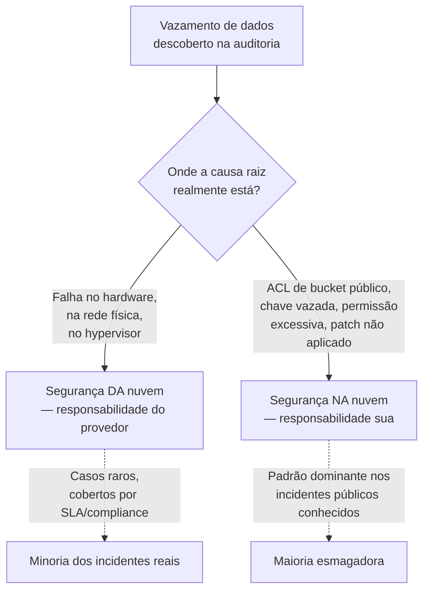
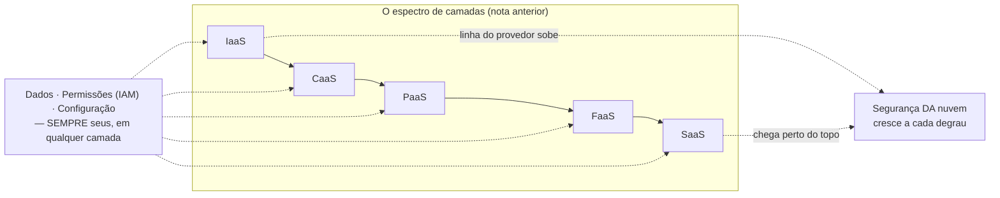

# O modelo de responsabilidade compartilhada

> [!abstract] TL;DR
> "A nuvem é segura" é uma frase incompleta — segura pra quê, e segura por conta de quem. O provedor garante a segurança **da** nuvem: datacenter, hardware, virtualização, e — dependendo da camada de serviço — sistema operacional e runtime. Você garante a segurança **na** nuvem: seus dados, suas permissões, sua configuração, seu código. Essa linha não é fixa: ela sobe conforme você sobe na pilha de IaaS para SaaS, exatamente como a nota anterior mapeou camada por camada. Mas uma fatia nunca se move, não importa quão alto você suba: dados, permissões (IAM) e configuração são sempre seus. E é justamente aí, nessa fatia fixa, que praticamente todo vazamento de nuvem conhecido acontece — não porque o provedor falhou, mas porque alguém deixou uma porta configurada errado do lado de dentro.

## O bucket que ninguém trancou

Um time sobe um ambiente de staging numa tarde de sexta-feira. Precisa de um lugar rápido para guardar exports de banco de dados — nada crítico, só um snapshot temporário para debugar um bug de produção replicado localmente. Alguém cria um bucket de armazenamento de objetos, sobe os arquivos, e — pressionado pelo prazo, testando localmente, sem VPN configurada ainda — marca o bucket como acesso público "só por enquanto, depois eu tranco". A tarefa de "trancar depois" vai para o fim de uma lista de pendências que nunca mais sobe de prioridade.

Seis meses depois, uma ferramenta automatizada de terceiros — dessas que varrem a internet inteira catalogando endpoints de armazenamento em nuvem abertos — encontra o bucket. Os exports de banco, que continham nomes, e-mails e alguns campos que deveriam estar mascarados antes de sair de produção, ficam expostos publicamente por meses antes de alguém do time notar, numa auditoria de rotina que nunca deveria ter sido "de rotina" para um achado desse tamanho.

A pergunta que decide o que aconteceu a seguir — investigação interna, comunicado a clientes, eventual multa regulatória — não é "o provedor de nuvem foi invadido?". Não foi. Nenhuma credencial da AWS ou da DigitalOcean vazou, nenhum hypervisor foi comprometido, nenhum datacenter teve uma falha física. O provedor fez exatamente o que prometeu: manteve o hardware, a rede física e o software de virtualização de pé, disponíveis, sem interrupção, sem falha nenhuma do lado dele. A causa raiz inteira do incidente foi uma configuração de acesso — um ACL de bucket marcado como público — que só uma pessoa do lado do cliente tinha o poder de mudar, e ninguém mudou.

Esse é o padrão que esta nota existe para nomear com precisão: existe uma linha, documentada e formal, que separa o que o provedor garante do que você garante — e a imensa maioria dos incidentes de segurança "de nuvem" que você já ouviu falar, sob qualquer nome de empresa que o noticiário tenha usado, cai do lado de baixo dessa linha: do seu lado.

## A linha formal: "of the cloud" versus "in the cloud"

A AWS foi quem melhor cunhou o vocabulário que o mercado inteiro hoje usa para essa distinção, num documento formal chamado *Shared Responsibility Model*. A formulação central é curta e vale memorizar literalmente, porque aparece em entrevista técnica sênior com frequência:

> AWS é responsável pela segurança **da** nuvem — protegendo a infraestrutura que roda todos os serviços oferecidos na AWS Cloud, composta por hardware, software, rede e instalações físicas. O cliente é responsável pela segurança **na** nuvem — e o quanto disso recai sobre o cliente depende de quais serviços da AWS ele escolhe usar.

Repare na segunda frase: "depende de quais serviços o cliente escolhe usar". Não é um corte fixo, com uma lista estática do que é seu e do que é do provedor — é uma linha que **se desloca conforme a camada de serviço**, exatamente o eixo que a nota anterior desta trilha mapeou em detalhe, camada por camada, da infraestrutura crua até o software pronto para uso.

A própria AWS confirma isso na letra da documentação, dividindo os serviços em dois grandes grupos com responsabilidades bem diferentes:

- **Serviços de infraestrutura (IaaS), como o EC2** — aqui, o cliente assume "a gestão do sistema operacional convidado (incluindo atualizações e patches de segurança), qualquer software de aplicação ou utilitário instalado pelo cliente nas instâncias, e a configuração do firewall fornecido pela AWS". A fatia de responsabilidade do cliente é grande: ele administra tudo do sistema operacional para cima.
- **Serviços abstraídos, como o S3 e o DynamoDB** — aqui, "a AWS opera a camada de infraestrutura, o sistema operacional e as plataformas", e a responsabilidade do cliente encolhe para "gerenciar seus dados (incluindo opções de criptografia), classificar seus ativos, e usar ferramentas de IAM para aplicar as permissões apropriadas".

Essa é a mesma tabela "quem gerencia o quê" da nota anterior — só que aplicada especificamente ao eixo de segurança, e não ao eixo de operação em geral. Em EC2 (IaaS), você paga o preço de administrar mais, e também assume a responsabilidade de proteger mais: um patch de segurança do kernel que você não aplica é uma vulnerabilidade que só você deixou aberta. Em S3 ou DynamoDB (serviços abstraídos, mais próximos de PaaS na lógica da camada), a AWS tira de você a responsabilidade sobre o sistema operacional e o middleware — mas a fatia que sobra, dados e permissões, continua inteiramente sua, e é justamente aí que o incidente do bucket público do início desta nota aconteceu: um serviço de armazenamento gerenciado, onde a AWS cuidou de tudo que prometeu cuidar, e o cliente configurou mal a única coisa que sobrou para ele configurar.

## A linha se move — mas nunca desaparece

A DigitalOcean formaliza a mesma lógica com um vocabulário ligeiramente diferente, mas o mesmo esqueleto conceitual: a DigitalOcean protege os "ativos da instância de nuvem" — segurança física, virtualização — e o cliente protege os "ativos dentro da instância" — sistema operacional instalado no Droplet, controle de acesso, conteúdo. E, de forma explícita, a documentação da DigitalOcean reconhece que "cada tipo de produto tem uma separação diferente de responsabilidades", agrupando o catálogo em três grandes faixas — Infraestrutura (Droplets), Plataforma (App Platform) e Software gerenciado (Functions) — cada uma com seu próprio documento de responsabilidade compartilhada.

Vale ver essa variação lado a lado com o espectro de camadas que a nota anterior já detalhou, porque a correspondência é quase direta:

| Camada de serviço | O que o provedor passa a assumir (segurança) | O que continua seu, sempre |
|---|---|---|
| **IaaS** (EC2 / Droplet) | Hardware, rede física, hypervisor | SO, patches, firewall de instância, runtime, middleware, dados, permissões, código |
| **CaaS** (Fargate / App Platform via container, DOKS) | + SO do host, patch do host | Imagem do container, dependências dentro dela, dados, permissões, código |
| **PaaS** (Elastic Beanstalk / App Platform via Git) | + runtime, middleware | Código da aplicação, dados, permissões, configuração de variáveis sensíveis |
| **FaaS** (Lambda / DigitalOcean Functions) | + o próprio processo de execução, isolamento entre invocações | Lógica da função, permissões da role de execução, dados que ela manipula |
| **SaaS** (CRM, ferramenta de gestão, e-mail transacional) | + a aplicação inteira, incluindo a lógica de negócio do produto | Quem tem acesso à sua conta, como você configura o produto, os dados que você insere nele |

O padrão salta aos olhos: a cada degrau que você sobe — do jeito que a nota anterior descreveu, de IaaS a SaaS — o provedor assume mais uma fatia da pilha técnica, e a linha "segurança da nuvem" sobe junto. Mas repare na última coluna: três itens aparecem em **toda** linha da tabela, sem exceção, do IaaS mais cru ao SaaS mais gerenciado — **dados, permissões e configuração**. Essa fatia nunca cruza para o lado do provedor, não importa quão alto você suba na pilha. Mesmo usando um SaaS pronto, onde você não vê uma linha de infraestrutura, você ainda decide quem tem uma conta ativa naquele SaaS, que nível de acesso cada pessoa tem, e que dados você optou por colocar lá dentro. Isso não é uma falha da abstração — é o núcleo do que "responsabilidade compartilhada" quer dizer: **compartilhada não é dividida meio a meio, é dividida por natureza da tarefa**, e a tarefa de "decidir quem pode ver o quê" é, por definição, uma decisão que só quem é dono do dado pode tomar.

> [!info] Fronteira
> Esta nota não ensina *como* implementar controle de acesso — políticas, roles, princípio do menor privilégio. Isso é o corpo inteiro do **galho 4** desta trilha. Aqui, IAM aparece só como a categoria de responsabilidade que nunca sai das suas mãos, não como mecânica de implementação.

O vocabulário exato muda de provedor para provedor, mas o conceito é o mesmo em toda a indústria — o que ajuda a reconhecer a ideia mesmo trocando de nuvem no meio de uma carreira ou de uma entrevista técnica:

| Conceito | AWS | Azure | GCP | DigitalOcean |
|---|---|---|---|---|
| Nome do modelo | Shared Responsibility Model | Shared responsibility model | Shared responsibility model (Shared fate, para GKE) | Shared Responsibility Model |
| "Segurança da nuvem" | Security **of** the cloud | Security **of** the cloud | Provedor cuida da infraestrutura subjacente | DigitalOcean protege os "ativos da instância" |
| "Segurança na nuvem" | Security **in** the cloud | Security **in** the cloud | Cliente configura e usa os controles do serviço | Cliente protege os "ativos dentro da instância" |
| Documento por camada de serviço | Sim (IaaS vs. serviços abstraídos) | Sim (IaaS/PaaS/SaaS) | Sim (varia por produto) | Sim, um documento por produto (Droplets, App Platform, Functions, Databases…) |

A GCP soma a esse vocabulário um termo próprio, *shared fate* ("destino compartilhado"), usado especificamente em produtos como o GKE — a ideia é que o provedor não só divide responsabilidades formalmente, mas também assume um papel mais ativo de ajudar o cliente a operar com segurança (recomendações automáticas, configurações seguras por padrão), em vez de simplesmente documentar a linha e esperar que o cliente a leia. É uma nuance de postura, não uma mudança na divisão de fundo — a fatia de dados, permissões e configuração continua do lado do cliente também na terminologia da GCP.

> [!info] Caducidade
> Nomenclatura e existência de documentos por produto verificadas em 2026-07-20. Provedores reorganizam e renomeiam essas páginas de segurança com alguma frequência — confira a documentação oficial de cada um antes de citar um trecho específico em produção ou em entrevista.

## O que o provedor nunca assume por você

Vale nomear essa fatia fixa com mais precisão, porque é ela que decide onde investigar quando algo dá errado — e é ela que aparece, quase sempre, na causa raiz de um incidente real:

**Seus dados.** O provedor criptografa o disco onde seus dados ficam gravados, e garante que ninguém de fora do seu ambiente acesse o hardware físico. Mas ele não decide o que você grava, quanto tempo mantém, se anonimiza informação sensível antes de gravar, nem se aplica criptografia adicional em nível de aplicação para dados particularmente críticos. Um export de banco de produção com dados pessoais, gravado sem nenhum tratamento num bucket de staging, é uma decisão sua — o provedor nunca teve a chance de intervir nela.

**Suas permissões (IAM).** Uma credencial com escopo mais amplo do que a tarefa exige, uma chave de acesso de longa duração que nunca é rotacionada, uma conta de serviço automatizada com permissão de administrador porque "é mais simples assim" — nada disso é o provedor decidindo por você. IAM é, por definição, o mecanismo através do qual **você** decide quem pode fazer o quê, e o provedor só executa fielmente a política que você configurou, mesmo quando essa política é perigosamente ampla.

**Sua configuração.** Um bucket marcado como público, um banco de dados gerenciado exposto à internet sem lista de IPs permitidos, um security group liberando todas as portas "para não travar durante o desenvolvimento" e nunca revertido — cada um desses é um botão, um checkbox, uma linha de configuração que existia disponível, documentada, e que alguém do lado do cliente ligou (ou esqueceu de desligar).

**Seu código.** Uma vulnerabilidade de injeção na sua aplicação, uma dependência desatualizada com uma falha conhecida, uma lógica de autorização que esquece de checar se o usuário logado é dono do recurso que está pedindo — nenhum provedor de nuvem audita a lógica de negócio do seu código. Ele garante que o ambiente onde esse código roda está isolado e íntegro; a correção do código em si é inteiramente sua.

Essas quatro categorias — dados, permissões, configuração, código — têm uma coisa em comum: são exatamente as decisões que exigem contexto de negócio para tomar corretamente. O provedor não sabe se aquele bucket deveria ser público (às vezes deveria — pense em assets estáticos de um site) ou privado (quase sempre, para dados de clientes). Só quem entende o propósito do dado consegue tomar essa decisão com segurança — e é por isso, estruturalmente, que ela nunca poderia ser terceirizada para o provedor, em nenhuma camada de serviço.

## Casos práticos

**O bucket de armazenamento com ACL pública.** É o padrão mais comum de vazamento de nuvem relatado publicamente ao longo da última década, em incidentes envolvendo praticamente todos os grandes provedores em algum momento — não por falha da plataforma de armazenamento, mas porque a opção "tornar este objeto ou bucket público" existe, é legítima para casos de uso reais (hospedar um site estático, servir assets), e alguém a marca por engano ou por pressa num recurso que continha dados sensíveis. A configuração default de buckets recém-criados, hoje, tende a ser privada em praticamente todo provedor sério — o que reduz a chance do erro, mas não a elimina quando alguém muda a permissão deliberadamente e esquece de reverter.

**A chave de acesso commitada num repositório.** Uma credencial de API — de um provedor de nuvem, de um serviço de terceiros, de um banco de dados gerenciado — acaba dentro de um arquivo de configuração que vai parar num repositório Git, às vezes público, às vezes privado mas com acesso mais amplo do que deveria. Ferramentas automatizadas varrem repositórios públicos constantemente atrás desse padrão específico; uma chave exposta pode ser encontrada e usada em minutos. O provedor de nuvem nunca teve controle sobre onde você optou por colar aquela credencial — a superfície de ataque inteira é uma decisão de engenharia do lado do cliente, sobre como gerenciar segredos.

**A função com permissão de execução ampla demais.** Numa arquitetura FaaS, cada função roda com uma role de execução que define o que ela pode fazer — a quais outros recursos ela pode acessar, ler, escrever, apagar. É comum, sob pressão de prazo, uma função ganhar uma permissão ampla ("acesso total ao bucket", "acesso total ao banco") só para não precisar debugar um erro de permissão negada durante o desenvolvimento — e essa permissão ampla nunca ser reduzida depois que a função entra em produção. Se essa função tiver qualquer vulnerabilidade explorável (uma dependência desatualizada, uma validação de entrada fraca), o escopo do dano que um atacante consegue causar é exatamente do tamanho da permissão que a role tem — não do tamanho do que a função realmente precisava.

**A conta de SaaS sem autenticação de dois fatores.** Numa ferramenta de gestão de projetos, um CRM, um provedor de e-mail transacional — o fornecedor cuida da infraestrutura, do código da aplicação, da disponibilidade. Mas quem tem uma sessão ativa naquela conta, com que senha, protegida por que segundo fator, é inteiramente uma decisão do cliente. Uma conta comprometida por reuso de senha vazada em outro serviço não é uma falha do SaaS — é a fatia fixa da responsabilidade compartilhada aparecendo até na camada mais alta e mais gerenciada do espectro inteiro.

## Armadilhas comuns

> [!warning] Achar que "gerenciado" quer dizer "seguro por padrão"
> Um banco de dados gerenciado, um serviço PaaS, uma função FaaS — todos tiram de você a administração de sistema operacional e patch de infraestrutura. Nenhum deles decide sozinho se a rede que expõe esse recurso está corretamente restrita, se as permissões concedidas são as mínimas necessárias, ou se os dados armazenados ali deveriam estar lá sem tratamento adicional. "Gerenciado" reduz a fatia técnica que você opera; não reduz a fatia de julgamento que você precisa exercer.

> [!warning] Confundir responsabilidade de segurança com garantia de disponibilidade
> O modelo de responsabilidade compartilhada trata de **quem protege o quê contra acesso indevido, vazamento e comprometimento** — não de quem garante que o serviço vai continuar no ar. Essa segunda pergunta, sobre limites, cotas e o que o contrato do provedor efetivamente promete quando algo falha, é o assunto da próxima nota desta trilha; misturar as duas discussões numa auditoria de segurança tende a diluir as duas.

> [!warning] Tratar a fatia fixa (dados, permissões, configuração) como um checklist único, feito uma vez
> Permissões concedidas hoje, corretas para a necessidade de hoje, se tornam permissões excessivas amanhã quando a tarefa que as justificava termina e ninguém revoga o acesso. Configuração correta no deploy inicial se torna configuração desatualizada seis meses depois, quando o time cresce e novas pessoas herdam acessos antigos sem revisão. A fatia que é sempre sua não é um item que se resolve uma vez — é uma responsabilidade contínua, tão operacional quanto qualquer patch de infraestrutura que o provedor aplica automaticamente do lado dele.

## O que vem a seguir

Esta nota separou o que o provedor garante do que sobra pra você — e mostrou que essa linha se move com a camada de serviço, mas nunca elimina a fatia de dados, permissões e configuração que é sempre sua. Existe, porém, uma pergunta adjacente que a responsabilidade compartilhada não responde sozinha: mesmo fazendo tudo certo do seu lado, **o que o provedor efetivamente promete** quando as coisas saem dos trilhos — que limites técnicos existem, que garantias um contrato de nível de serviço realmente cobre, e o que significa, na prática, quando uma cota que você nunca configurou decide travar sua aplicação em produção. É o assunto da próxima nota, **Limites, cotas e o contrato do provedor**, que fecha este galho.

## Fontes

- [AWS — Shared Responsibility Model (documentação oficial)](https://aws.amazon.com/compliance/shared-responsibility-model/) — definição formal de "security of the cloud" vs. "security in the cloud", e a divisão entre serviços de infraestrutura (IaaS) e serviços abstraídos; acessado em 2026-07-20.
- [DigitalOcean — Shared Responsibility Model (visão geral)](https://www.digitalocean.com/security/shared-responsibility-model) — framework geral de responsabilidades DigitalOcean vs. cliente, e a divisão em três faixas de produto (IaaS/PaaS/SaaS); acessado em 2026-07-20.
- [DigitalOcean — Shared Responsibility Model for Functions](https://www.digitalocean.com/security/shared-responsibility-model-functions) — responsabilidades específicas de FaaS: infraestrutura, criptografia em trânsito e em repouso a cargo da DigitalOcean; credenciais, autenticação e dados a cargo do cliente; acessado em 2026-07-20.
- [DigitalOcean — Shared Responsibility Model for Droplets](https://www.digitalocean.com/security/shared-responsibility-model-droplets) — responsabilidades específicas de IaaS (Droplets); acessado em 2026-07-20.
- [DigitalOcean — Shared Responsibility Model for App Platform](https://www.digitalocean.com/security/shared-responsibility-model-app-platform) — responsabilidades específicas de PaaS/CaaS via App Platform; acessado em 2026-07-20.
- [DigitalOcean — Shared Responsibility Model for Managed Databases](https://www.digitalocean.com/security/shared-responsibility-model-managed-databases) — responsabilidades específicas de bancos de dados gerenciados; acessado em 2026-07-20.
- [DigitalOcean — What is the Shared Responsibility Model in Cloud Computing? (artigo)](https://www.digitalocean.com/resources/articles/shared-responsibility-model) — explicação introdutória do conceito com exemplos práticos; acessado em 2026-07-20.
