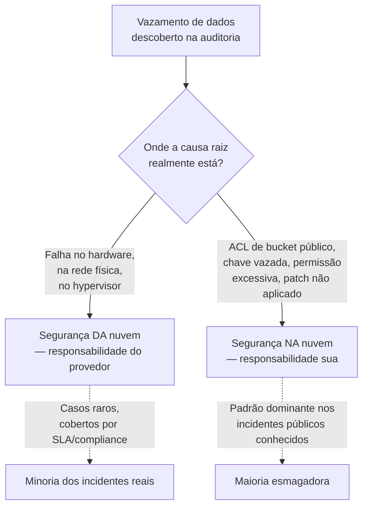
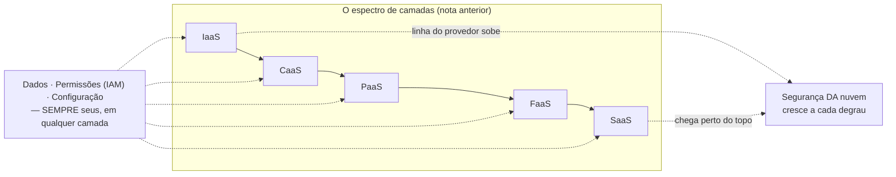
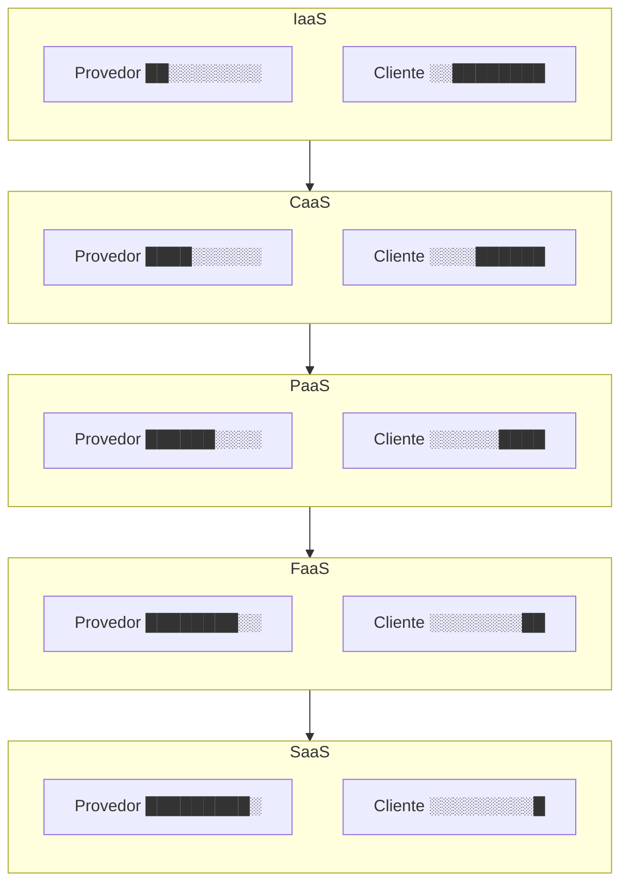

# O modelo de responsabilidade compartilhada

> [!abstract] TL;DR
> "A nuvem é segura" é uma frase incompleta — segura pra quê, e segura por conta de quem. O provedor garante a segurança **da** nuvem: datacenter, hardware, virtualização, e — dependendo da camada de serviço — sistema operacional e runtime. Você garante a segurança **na** nuvem: seus dados, suas permissões, sua configuração, seu código. Essa linha não é fixa: ela sobe conforme você sobe na pilha de IaaS para SaaS, exatamente como a nota anterior mapeou camada por camada. Mas uma fatia nunca se move, não importa quão alto você suba: dados, permissões (IAM) e configuração são sempre seus. E é justamente aí, nessa fatia fixa, que praticamente todo vazamento de nuvem conhecido acontece — não porque o provedor falhou, mas porque alguém deixou uma porta configurada errado do lado de dentro.

## O bucket que ninguém trancou

Um time sobe um ambiente de staging numa tarde de sexta-feira. Precisa de um lugar rápido para guardar exports de banco de dados — nada crítico, só um snapshot temporário para debugar um bug de produção replicado localmente. Alguém cria um bucket de armazenamento de objetos, sobe os arquivos, e — pressionado pelo prazo, testando localmente, sem VPN configurada ainda — marca o bucket como acesso público "só por enquanto, depois eu tranco". A tarefa de "trancar depois" vai para o fim de uma lista de pendências que nunca mais sobe de prioridade.

Seis meses depois, uma ferramenta automatizada de terceiros — dessas que varrem a internet inteira catalogando endpoints de armazenamento em nuvem abertos — encontra o bucket. Os exports de banco, que continham nomes, e-mails e alguns campos que deveriam estar mascarados antes de sair de produção, ficam expostos publicamente por meses antes de alguém do time notar, numa auditoria de rotina que nunca deveria ter sido "de rotina" para um achado desse tamanho.

A pergunta que decide o que aconteceu a seguir — investigação interna, comunicado a clientes, eventual multa regulatória — não é "o provedor de nuvem foi invadido?". Não foi. Nenhuma credencial da AWS ou da DigitalOcean vazou, nenhum hypervisor foi comprometido, nenhum datacenter teve uma falha física. O provedor fez exatamente o que prometeu: manteve o hardware, a rede física e o software de virtualização de pé, disponíveis, sem interrupção, sem falha nenhuma do lado dele. A causa raiz inteira do incidente foi uma configuração de acesso — um ACL de bucket marcado como público — que só uma pessoa do lado do cliente tinha o poder de mudar, e ninguém mudou.

Esse é o padrão que esta nota existe para nomear com precisão: existe uma linha, documentada e formal, que separa o que o provedor garante do que você garante — e a imensa maioria dos incidentes de segurança "de nuvem" que você já ouviu falar, sob qualquer nome de empresa que o noticiário tenha usado, cai do lado de baixo dessa linha: do seu lado.



## A linha formal: "of the cloud" versus "in the cloud"

A AWS foi quem melhor cunhou o vocabulário que o mercado inteiro hoje usa para essa distinção, num documento formal chamado *Shared Responsibility Model*. A formulação central é curta e vale memorizar literalmente, porque aparece em entrevista técnica sênior com frequência:

> AWS é responsável pela segurança **da** nuvem — protegendo a infraestrutura que roda todos os serviços oferecidos na AWS Cloud, composta por hardware, software, rede e instalações físicas. O cliente é responsável pela segurança **na** nuvem — e o quanto disso recai sobre o cliente depende de quais serviços da AWS ele escolhe usar.

Repare na segunda frase: "depende de quais serviços o cliente escolhe usar". Não é um corte fixo, com uma lista estática do que é seu e do que é do provedor — é uma linha que **se desloca conforme a camada de serviço**, exatamente o eixo que a nota anterior desta trilha mapeou em detalhe, camada por camada, da infraestrutura crua até o software pronto para uso.

A própria AWS confirma isso na letra da documentação, dividindo os serviços em dois grandes grupos com responsabilidades bem diferentes:

- **Serviços de infraestrutura (IaaS), como o EC2** — aqui, o cliente assume "a gestão do sistema operacional convidado (incluindo atualizações e patches de segurança), qualquer software de aplicação ou utilitário instalado pelo cliente nas instâncias, e a configuração do firewall fornecido pela AWS". A fatia de responsabilidade do cliente é grande: ele administra tudo do sistema operacional para cima.
- **Serviços abstraídos, como o S3 e o DynamoDB** — aqui, "a AWS opera a camada de infraestrutura, o sistema operacional e as plataformas", e a responsabilidade do cliente encolhe para "gerenciar seus dados (incluindo opções de criptografia), classificar seus ativos, e usar ferramentas de IAM para aplicar as permissões apropriadas".

> [!tip] Assista: AWS Shared Responsibility Model Explained
> **Canal:** Go Cloud Architects | **Duração:** ~9min | **Idioma:** EN
>
> Percorre a mesma linha "of the cloud" vs. "in the cloud" com exemplos práticos por tipo de serviço (EC2, containers, Lambda), reforçando visualmente por que a fatia do cliente encolhe conforme o serviço fica mais gerenciado — sem nunca chegar a zero. Trecho de destaque [00:53]: *"the cloud provider is responsible for their stuff"*
>
> 🎬 [Assistir no YouTube](https://www.youtube.com/watch?v=GseJ2wkhrs0)

Essa é a mesma tabela "quem gerencia o quê" da nota anterior — só que aplicada especificamente ao eixo de segurança, e não ao eixo de operação em geral. Em EC2 (IaaS), você paga o preço de administrar mais, e também assume a responsabilidade de proteger mais: um patch de segurança do kernel que você não aplica é uma vulnerabilidade que só você deixou aberta. Em S3 ou DynamoDB (serviços abstraídos, mais próximos de PaaS na lógica da camada), a AWS tira de você a responsabilidade sobre o sistema operacional e o middleware — mas a fatia que sobra, dados e permissões, continua inteiramente sua, e é justamente aí que o incidente do bucket público do início desta nota aconteceu: um serviço de armazenamento gerenciado, onde a AWS cuidou de tudo que prometeu cuidar, e o cliente configurou mal a única coisa que sobrou para ele configurar.

## A linha se move — mas nunca desaparece

A DigitalOcean formaliza a mesma lógica com um vocabulário ligeiramente diferente, mas o mesmo esqueleto conceitual: a DigitalOcean protege os "ativos da instância de nuvem" (*assets of your cloud instance*) — segurança física, virtualização — e o cliente protege os "ativos dentro da instância" (*assets in your cloud instance*) — sistema operacional instalado no Droplet, controle de acesso, conteúdo. A documentação organiza o catálogo nas mesmas três categorias conceituais da indústria — IaaS, PaaS e SaaS — e publica um documento de responsabilidade compartilhada por produto (Droplets, Kubernetes, App Platform, Functions, Managed Databases, entre outros), sem prender cada produto a uma única categoria fixa na página geral do modelo.

Vale ver essa variação lado a lado com o espectro de camadas que a nota anterior já detalhou, porque a correspondência é quase direta:

| Camada de serviço | O que o provedor passa a assumir (segurança) | O que continua seu, sempre |
|---|---|---|
| **IaaS** (EC2 / Droplet) | Hardware, rede física, hypervisor | SO, patches, firewall de instância, runtime, middleware, dados, permissões, código |
| **CaaS** (Fargate / App Platform via container, DOKS) | + SO do host, patch do host | Imagem do container, dependências dentro dela, dados, permissões, código |
| **PaaS** (Elastic Beanstalk / App Platform via Git) | + runtime, middleware | Código da aplicação, dados, permissões, configuração de variáveis sensíveis |
| **FaaS** (Lambda / DigitalOcean Functions) | + o próprio processo de execução, isolamento entre invocações | Lógica da função, permissões da role de execução, dados que ela manipula |
| **SaaS** (CRM, ferramenta de gestão, e-mail transacional) | + a aplicação inteira, incluindo a lógica de negócio do produto | Quem tem acesso à sua conta, como você configura o produto, os dados que você insere nele |

O padrão salta aos olhos: a cada degrau que você sobe — do jeito que a nota anterior descreveu, de IaaS a SaaS — o provedor assume mais uma fatia da pilha técnica, e a linha "segurança da nuvem" sobe junto. Mas repare na última coluna: três itens aparecem em **toda** linha da tabela, sem exceção, do IaaS mais cru ao SaaS mais gerenciado — **dados, permissões e configuração**. Essa fatia nunca cruza para o lado do provedor, não importa quão alto você suba na pilha. Mesmo usando um SaaS pronto, onde você não vê uma linha de infraestrutura, você ainda decide quem tem uma conta ativa naquele SaaS, que nível de acesso cada pessoa tem, e que dados você optou por colocar lá dentro. Isso não é uma falha da abstração — é o núcleo do que "responsabilidade compartilhada" quer dizer: **compartilhada não é dividida meio a meio, é dividida por natureza da tarefa**, e a tarefa de "decidir quem pode ver o quê" é, por definição, uma decisão que só quem é dono do dado pode tomar.



> [!info] Fronteira
> Esta nota não ensina *como* implementar controle de acesso — políticas, roles, princípio do menor privilégio. Isso é o corpo inteiro do **galho 4** desta trilha. Aqui, IAM aparece só como a categoria de responsabilidade que nunca sai das suas mãos, não como mecânica de implementação.

## Responsabilidade item por item, não só camada por camada

A tabela anterior lê por camada inteira. Vale reler o mesmo espectro pelo ângulo oposto — pegando seis itens concretos de segurança e perguntando, para cada um, quem responde por ele em cada modelo de serviço:

| Item de segurança | IaaS | CaaS | PaaS | FaaS | SaaS |
|---|---|---|---|---|---|
| Segurança física do datacenter | Provedor | Provedor | Provedor | Provedor | Provedor |
| Patch do sistema operacional | Cliente | Provedor (host) / Cliente (imagem) | Provedor | Provedor | Provedor |
| Criptografia em repouso (habilitar/configurar) | Cliente | Cliente | Cliente ou default do serviço | Provedor (dados internos do runtime) | Provedor |
| Configuração de firewall / rede | Cliente | Cliente | Cliente (parcial) | Cliente (permissões de rede da função) | Provedor |
| Gestão de permissões (IAM) | Cliente | Cliente | Cliente | Cliente | Cliente |
| Log de acesso / trilha de auditoria | Cliente (habilitar e reter) | Cliente (habilitar e reter) | Provedor gera, cliente decide reter e monitorar | Provedor gera, cliente decide reter e monitorar | Depende do plano contratado |

Três linhas contam a história inteira. **Segurança física** é sempre do provedor, em qualquer camada — nenhum cliente jamais entra num datacenter da AWS ou da DigitalOcean para trocar um disco. **Gestão de permissões** é o oposto exato: sempre do cliente, mesmo no SaaS mais gerenciado, porque só quem é dono da conta decide quem tem acesso a ela. E **log de acesso** mostra um terceiro padrão, mais sutil que os dois extremos: o provedor frequentemente já *gera* o log (CloudTrail, Activity Log da DigitalOcean) desde a camada mais crua até a mais gerenciada — mas gerar o log não é a mesma coisa que alguém olhar para ele. Habilitar a trilha, decidir por quanto tempo reter, e configurar um alerta que dispara quando o padrão foge do esperado continuam sendo, em toda camada, uma tarefa que o cliente precisa ativamente assumir — outro exemplo de como "o provedor oferece a ferramenta" e "o provedor resolve o problema" são frases bem diferentes. Entre as linhas fixas, tudo o mais — patch, criptografia, firewall — desliza de cliente para provedor conforme a camada sobe, exatamente como a coluna "sempre seu" da tabela anterior já mostrava, só que agora item a item em vez de camada a camada.



*(Cada bloco cheio representa uma fatia técnica que o provedor passou a operar; cada bloco vazio, uma fatia que continua sob gestão do cliente. A proporção é ilustrativa — o ponto é a tendência, não um percentual medido.)*

### CaaS na prática: a role que roda dentro do container

A camada CaaS costuma confundir mais que as outras, porque parece que "o provedor cuida de tudo" — ele empacota o container, agenda a execução, cuida do host. Mas o que roda **dentro** do container continua sob permissão que só o cliente concede, e os dois provedores desta trilha modelam isso de formas diferentes, mesmo cuidando do mesmo problema.

No ECS/Fargate da AWS, a distinção é explícita em duas roles separadas: a *task execution role* dá ao agente da AWS permissão para puxar a imagem do ECR e mandar log para o CloudWatch — o cliente nunca usa essa role diretamente. Já a *task role* é a que o código da sua aplicação usa em tempo de execução para chamar outros serviços da AWS (um bucket S3, uma fila SQS) — e é exatamente essa role que sofre o mesmo erro do caso da função FaaS: ganhar `s3:*` "para não travar" e nunca ser revisada.

No App Platform da DigitalOcean, não existe uma role IAM por componente da mesma forma — o controle equivalente passa por variáveis de ambiente marcadas como `SECRET` (criptografadas em repouso, ocultas de log) e pelo escopo de cada componente dentro do app spec, que por padrão só enxerga as variáveis daquele componente, a menos que a variável seja declarada no nível do app inteiro.

| | AWS (ECS/Fargate) | DigitalOcean (App Platform) |
|---|---|---|
| Quem executa o agente do provedor | Task execution role | Gerenciado pela plataforma, sem role exposta ao cliente |
| Quem seu código usa para chamar outro serviço | Task role, anexada à task definition | Credencial injetada via variável `SECRET`, escopada por componente |
| Erro clássico | Task role com `Resource: "*"` | Segredo declarado no nível do app inteiro quando só um componente precisava dele |

O nome do mecanismo muda — role vs. variável de ambiente — mas a pergunta que decide se um incidente vai acontecer é sempre a mesma: **o escopo concedido é do tamanho da tarefa, ou do tamanho de "resolve por hoje"?**

O vocabulário exato muda de provedor para provedor, mas o conceito é o mesmo em toda a indústria — o que ajuda a reconhecer a ideia mesmo trocando de nuvem no meio de uma carreira ou de uma entrevista técnica:

| Conceito | AWS | Azure | GCP | DigitalOcean |
|---|---|---|---|---|
| Nome do modelo | Shared Responsibility Model | Shared responsibility model | Shared responsibility model (Shared fate, para GKE) | Shared Responsibility Model |
| "Segurança da nuvem" | Security **of** the cloud | Security **of** the cloud | Provedor cuida da infraestrutura subjacente | DigitalOcean protege os "ativos da instância" |
| "Segurança na nuvem" | Security **in** the cloud | Security **in** the cloud | Cliente configura e usa os controles do serviço | Cliente protege os "ativos dentro da instância" |
| Documento por camada de serviço | Sim (IaaS vs. serviços abstraídos) | Sim (IaaS/PaaS/SaaS) | Sim (varia por produto) | Sim, um documento por produto (Droplets, App Platform, Functions, Databases…) |

A GCP soma a esse vocabulário um termo próprio, *shared fate* ("destino compartilhado"), usado especificamente em produtos como o GKE — a ideia é que o provedor não só divide responsabilidades formalmente, mas também assume um papel mais ativo de ajudar o cliente a operar com segurança (recomendações automáticas, configurações seguras por padrão), em vez de simplesmente documentar a linha e esperar que o cliente a leia. É uma nuance de postura, não uma mudança na divisão de fundo — a fatia de dados, permissões e configuração continua do lado do cliente também na terminologia da GCP.

> [!info] Caducidade
> Nomenclatura e existência de documentos por produto verificadas em 2026-07-22, junto com os comandos de configuração citados nesta nota. Provedores reorganizam e renomeiam essas páginas de segurança com alguma frequência — confira a documentação oficial de cada um antes de citar um trecho específico em produção ou em entrevista.

## O que o provedor nunca assume por você

Vale nomear essa fatia fixa com mais precisão, porque é ela que decide onde investigar quando algo dá errado — e é ela que aparece, quase sempre, na causa raiz de um incidente real:

**Seus dados.** O provedor criptografa o disco onde seus dados ficam gravados, e garante que ninguém de fora do seu ambiente acesse o hardware físico. Mas ele não decide o que você grava, quanto tempo mantém, se anonimiza informação sensível antes de gravar, nem se aplica criptografia adicional em nível de aplicação para dados particularmente críticos. Um export de banco de produção com dados pessoais, gravado sem nenhum tratamento num bucket de staging, é uma decisão sua — o provedor nunca teve a chance de intervir nela.

**Suas permissões (IAM).** Uma credencial com escopo mais amplo do que a tarefa exige, uma chave de acesso de longa duração que nunca é rotacionada, uma conta de serviço automatizada com permissão de administrador porque "é mais simples assim" — nada disso é o provedor decidindo por você. IAM é, por definição, o mecanismo através do qual **você** decide quem pode fazer o quê, e o provedor só executa fielmente a política que você configurou, mesmo quando essa política é perigosamente ampla.

**Sua configuração.** Um bucket marcado como público, um banco de dados gerenciado exposto à internet sem lista de IPs permitidos, um security group liberando todas as portas "para não travar durante o desenvolvimento" e nunca revertido — cada um desses é um botão, um checkbox, uma linha de configuração que existia disponível, documentada, e que alguém do lado do cliente ligou (ou esqueceu de desligar).

**Seu código.** Uma vulnerabilidade de injeção na sua aplicação, uma dependência desatualizada com uma falha conhecida, uma lógica de autorização que esquece de checar se o usuário logado é dono do recurso que está pedindo — nenhum provedor de nuvem audita a lógica de negócio do seu código. Ele garante que o ambiente onde esse código roda está isolado e íntegro; a correção do código em si é inteiramente sua.

Essas quatro categorias — dados, permissões, configuração, código — têm uma coisa em comum: são exatamente as decisões que exigem contexto de negócio para tomar corretamente. O provedor não sabe se aquele bucket deveria ser público (às vezes deveria — pense em assets estáticos de um site) ou privado (quase sempre, para dados de clientes). Só quem entende o propósito do dado consegue tomar essa decisão com segurança — e é por isso, estruturalmente, que ela nunca poderia ser terceirizada para o provedor, em nenhuma camada de serviço.

## Fechando a fatia fixa: comandos do lado do cliente

Nomear a responsabilidade não fecha o gap sozinho — o que fecha é configurar. Os oito exemplos abaixo mostram, com comando real, como cobrir as quatro categorias que acabaram de ser nomeadas — dados, permissões, configuração e o hábito de auditar em vez de assumir — nos dois provedores desta trilha.

**1. Bloquear acesso público a um bucket S3 (AWS).** Desde 2023 buckets S3 novos já nascem privados por padrão, mas ambientes mais antigos, ou buckets que alguém marcou como públicos "só por enquanto", precisam do bloqueio explícito nas quatro dimensões que a AWS expõe:

```shell
aws s3api put-public-access-block \
  --bucket meu-bucket-staging \
  --public-access-block-configuration \
  "BlockPublicAcls=true,IgnorePublicAcls=true,BlockPublicPolicy=true,RestrictPublicBuckets=true"
```

Verificar que o bloqueio pegou — nunca assuma, confira:

```shell
aws s3api get-public-access-block --bucket meu-bucket-staging
```

A resposta é um JSON com as mesmas quatro flags — e o ponto de leitura é simples: qualquer `false` aqui é uma porta que ainda está aberta, não uma formalidade:

```json
{
  "PublicAccessBlockConfiguration": {
    "BlockPublicAcls": true,
    "IgnorePublicAcls": true,
    "BlockPublicPolicy": true,
    "RestrictPublicBuckets": true
  }
}
```

**2. O mesmo problema num Space da DigitalOcean.** Spaces é compatível com a API do S3, mas o `doctl` **não** expõe controle de listagem de arquivo — a própria documentação da DigitalOcean recomenda usar um cliente compatível com S3. Duas formas equivalentes:

```shell
# Via AWS CLI apontado para o endpoint da região do Space
aws s3api put-bucket-acl \
  --bucket meu-space-staging \
  --acl private \
  --endpoint-url https://nyc3.digitaloceanspaces.com
```

```shell
# Via s3cmd, recursivo, cobrindo todos os objetos já publicados por engano
s3cmd setacl s3://meu-space-staging/ --acl-private --recursive
```

**3. Criptografia em repouso — confirmar, não assumir.** A AWS aplica SSE-S3 (AES-256) por padrão em todo bucket novo desde janeiro de 2023, mas subir o nível para chaves gerenciadas por você (SSE-KMS) ainda é uma decisão do cliente:

```shell
aws s3api put-bucket-encryption \
  --bucket meu-bucket-staging \
  --server-side-encryption-configuration \
  '{"Rules": [{"ApplyServerSideEncryptionByDefault": {"SSEAlgorithm": "aws:kms", "KMSMasterKeyID": "alias/meu-alias-kms"}}]}'
```

Confirmar que a configuração pegou segue o mesmo hábito do item anterior — verificar, não assumir:

```shell
aws s3api get-bucket-encryption --bucket meu-bucket-staging
```

Já em Droplets da DigitalOcean o disco de boot **não** vem criptografado em repouso por padrão — diferente de Spaces, que já grava tudo com AES-256 automaticamente. Se o Droplet guarda dado sensível fora de um Space, a criptografia de disco é uma tarefa que sobra inteira para o cliente configurar no nível do sistema operacional, não algo que ligar num painel.

**4. Política de bucket recusando tráfego sem TLS.** Um bucket privado ainda aceita conexão HTTP simples se ninguém proibir — a AWS documenta esta política como padrão para forçar HTTPS em qualquer chamada:

```json
{
  "Version": "2012-10-17",
  "Statement": [
    {
      "Sid": "RestrictToTLSRequestsOnly",
      "Effect": "Deny",
      "Principal": "*",
      "Action": "s3:*",
      "Resource": [
        "arn:aws:s3:::meu-bucket-staging",
        "arn:aws:s3:::meu-bucket-staging/*"
      ],
      "Condition": {
        "Bool": { "aws:SecureTransport": "false" }
      }
    }
  ]
}
```

**5. Restringir a superfície de rede de um Droplet.** O equivalente a um security group na DigitalOcean é o Cloud Firewall, criado e anexado por `doctl` — sem ele, a porta que a imagem do sistema operacional abriu por padrão fica exposta à internet inteira até alguém fechar manualmente:

```shell
doctl compute firewall create \
  --name "staging-web" \
  --inbound-rules "protocol:tcp,ports:22,address:203.0.113.0/24 protocol:tcp,ports:443,address:0.0.0.0/0,address:::/0" \
  --outbound-rules "protocol:tcp,ports:all,address:0.0.0.0/0,address:::/0" \
  --droplet-ids "SEU_DROPLET_ID"
```

**6. Restringir um banco de dados gerenciado a IPs conhecidos.** Um banco gerenciado (RDS, DigitalOcean Managed Databases) tira do cliente a administração do motor e do patch, mas nunca decide sozinho quem tem permissão de rede para conectar nele — isso continua sendo uma linha de firewall que alguém precisa configurar:

```shell
doctl databases firewalls append <id-do-cluster> \
  --rule ip_addr:203.0.113.10
```

**7. Habilitar a trilha de auditoria — o item da tabela anterior que costuma ficar esquecido.** A AWS gera eventos de API o tempo todo; sem um *trail* do CloudTrail configurado para persistir esses eventos, eles somem depois de uma janela curta e nenhuma investigação pós-incidente encontra o "quem fez o quê":

```shell
aws cloudtrail create-trail \
  --name auditoria-staging \
  --s3-bucket-name meu-bucket-logs-cloudtrail \
  --is-multi-region-trail \
  --enable-log-file-validation

aws cloudtrail start-logging --trail-name auditoria-staging
```

**8. Auditar todos os buckets de uma conta de uma vez, em vez de confiar na memória.** Uma auditoria pontual, feita manualmente bucket por bucket, é exatamente o tipo de tarefa que alguém pula "por falta de tempo" — e é aí que um bucket que ficou público seis meses atrás continua público. Encadear a listagem com a checagem de bloqueio público transforma isso numa rotina de minutos:

```shell
for bucket in $(aws s3api list-buckets --query "Buckets[].Name" --output text); do
  echo "== $bucket =="
  aws s3api get-public-access-block --bucket "$bucket" \
    --query "PublicAccessBlockConfiguration" --output json \
    || echo "SEM bloqueio configurado — investigar"
done
```

Nenhum desses oito comandos é opcional "quando sobrar tempo" — cada um fecha exatamente a fatia que a tabela da seção anterior já apontava como sempre sua, em qualquer camada de serviço.

Repare no padrão que os oito têm em comum: nenhum deles muda o que o provedor faz. A AWS já cuidava do hypervisor antes do primeiro comando e continua cuidando dele depois do oitavo — o que muda, em cada um, é só a decisão que estava esperando por você do outro lado da linha.

E repare também no que os oito têm em comum com a tabela de itens de segurança vista antes: cada comando fecha exatamente uma célula "Cliente" daquela tabela — nunca uma célula "Provedor". Não existe comando de cliente que assuma segurança física, porque essa célula nunca foi sua para começo de conversa.

## Casos práticos

**O bucket de armazenamento com ACL pública.** É o padrão mais comum de vazamento de nuvem relatado publicamente ao longo da última década, em incidentes envolvendo praticamente todos os grandes provedores em algum momento — não por falha da plataforma de armazenamento, mas porque a opção "tornar este objeto ou bucket público" existe, é legítima para casos de uso reais (hospedar um site estático, servir assets), e alguém a marca por engano ou por pressa num recurso que continha dados sensíveis. A configuração default de buckets recém-criados, hoje, tende a ser privada em praticamente todo provedor sério — o que reduz a chance do erro, mas não a elimina quando alguém muda a permissão deliberadamente e esquece de reverter.

**A chave de acesso commitada num repositório.** Uma credencial de API — de um provedor de nuvem, de um serviço de terceiros, de um banco de dados gerenciado — acaba dentro de um arquivo de configuração que vai parar num repositório Git, às vezes público, às vezes privado mas com acesso mais amplo do que deveria. Ferramentas automatizadas varrem repositórios públicos constantemente atrás desse padrão específico; uma chave exposta pode ser encontrada e usada em minutos. O provedor de nuvem nunca teve controle sobre onde você optou por colar aquela credencial — a superfície de ataque inteira é uma decisão de engenharia do lado do cliente, sobre como gerenciar segredos.

**A função com permissão de execução ampla demais.** Numa arquitetura FaaS, cada função roda com uma role de execução que define o que ela pode fazer — a quais outros recursos ela pode acessar, ler, escrever, apagar. É comum, sob pressão de prazo, uma função ganhar uma permissão ampla ("acesso total ao bucket", "acesso total ao banco") só para não precisar debugar um erro de permissão negada durante o desenvolvimento — e essa permissão ampla nunca ser reduzida depois que a função entra em produção. Se essa função tiver qualquer vulnerabilidade explorável (uma dependência desatualizada, uma validação de entrada fraca), o escopo do dano que um atacante consegue causar é exatamente do tamanho da permissão que a role tem — não do tamanho do que a função realmente precisava.

A diferença entre as duas versões da mesma role de execução é puramente uma decisão do cliente — a AWS executa qualquer uma das duas com a mesma fidelidade. A versão "resolve rápido", que vira permanente:

```json
{
  "Version": "2012-10-17",
  "Statement": [
    { "Effect": "Allow", "Action": "s3:*", "Resource": "*" }
  ]
}
```

Contra a versão de escopo mínimo — só a ação e o bucket que a função realmente usa:

```json
{
  "Version": "2012-10-17",
  "Statement": [
    {
      "Effect": "Allow",
      "Action": ["s3:GetObject"],
      "Resource": ["arn:aws:s3:::relatorios-producao/*"]
    }
  ]
}
```

**A conta de SaaS sem autenticação de dois fatores.** Numa ferramenta de gestão de projetos, um CRM, um provedor de e-mail transacional — o fornecedor cuida da infraestrutura, do código da aplicação, da disponibilidade. Mas quem tem uma sessão ativa naquela conta, com que senha, protegida por que segundo fator, é inteiramente uma decisão do cliente. Uma conta comprometida por reuso de senha vazada em outro serviço não é uma falha do SaaS — é a fatia fixa da responsabilidade compartilhada aparecendo até na camada mais alta e mais gerenciada do espectro inteiro.

**O banco de dados gerenciado sem lista de IPs.** Um banco gerenciado tira do cliente a administração do motor, do patch e do backup — mas a regra de firewall que decide quais endereços conseguem sequer tentar uma conexão continua sendo uma configuração que existe, é opcional, e alguém precisa ativamente restringir. Um cluster criado sem regra de firewall específica, deixado com a configuração mais aberta "só até terminar de testar a integração", é um alvo que ferramentas de varredura encontram do mesmo jeito que encontram bucket público — só que a porta de entrada aqui é uma porta de banco de dados, não um endpoint HTTP.

Os cinco casos, lado a lado com a categoria de responsabilidade e o comando que fecha a brecha:

| Erro comum | De quem é a responsabilidade | Como prevenir |
|---|---|---|
| Bucket ou Space com ACL pública | Cliente — configuração | `put-public-access-block` (AWS) / `s3cmd setacl --acl-private` (Spaces) |
| Chave de acesso commitada em repositório | Cliente — gestão de segredo, fora do escopo do provedor | Secret scanning no CI, rotação de credencial, cofre de segredos em vez de arquivo de configuração |
| Role de função com permissão ampla demais | Cliente — permissões (IAM) | Política de execução restrita ao recurso específico, revisada antes do deploy em produção |
| Conta de SaaS sem segundo fator | Cliente — controle de acesso à própria conta | 2FA obrigatório para todos os usuários, aplicado a nível de organização quando o produto permitir |
| Banco de dados gerenciado sem lista de IPs | Cliente — configuração de rede | `doctl databases firewalls append` (DO) / security group do RDS restrito às origens conhecidas (AWS) |

## Armadilhas comuns

> [!warning] Achar que "gerenciado" quer dizer "seguro por padrão"
> Um banco de dados gerenciado, um serviço PaaS, uma função FaaS — todos tiram de você a administração de sistema operacional e patch de infraestrutura. Nenhum deles decide sozinho se a rede que expõe esse recurso está corretamente restrita, se as permissões concedidas são as mínimas necessárias, ou se os dados armazenados ali deveriam estar lá sem tratamento adicional. "Gerenciado" reduz a fatia técnica que você opera; não reduz a fatia de julgamento que você precisa exercer.

> [!warning] Confundir responsabilidade de segurança com garantia de disponibilidade
> O modelo de responsabilidade compartilhada trata de **quem protege o quê contra acesso indevido, vazamento e comprometimento** — não de quem garante que o serviço vai continuar no ar. Essa segunda pergunta, sobre limites, cotas e o que o contrato do provedor efetivamente promete quando algo falha, é o assunto da próxima nota desta trilha; misturar as duas discussões numa auditoria de segurança tende a diluir as duas.

> [!warning] Tratar a fatia fixa (dados, permissões, configuração) como um checklist único, feito uma vez
> Permissões concedidas hoje, corretas para a necessidade de hoje, se tornam permissões excessivas amanhã quando a tarefa que as justificava termina e ninguém revoga o acesso. Configuração correta no deploy inicial se torna configuração desatualizada seis meses depois, quando o time cresce e novas pessoas herdam acessos antigos sem revisão. A fatia que é sempre sua não é um item que se resolve uma vez — é uma responsabilidade contínua, tão operacional quanto qualquer patch de infraestrutura que o provedor aplica automaticamente do lado dele.

> [!warning] Confundir a role que o provedor usa com a role que seu código usa
> No ECS/Fargate, dar permissão ampla à *task execution role* achando que "é só o agente da AWS, não meu código" não é um erro de segurança em si — mas confundir as duas roles e colar as mesmas permissões amplas na *task role*, que é a que a sua aplicação realmente usa em runtime, transforma um agente de infraestrutura confiável num vetor de ataque do tamanho do bucket inteiro. O nome muda por provedor (role de execução, variável `SECRET` por componente), mas o princípio nunca muda: identifique exatamente qual identidade seu código usa em runtime antes de decidir o escopo dela.

## O que vem a seguir

Esta nota separou o que o provedor garante do que sobra pra você — e mostrou que essa linha se move com a camada de serviço, mas nunca elimina a fatia de dados, permissões e configuração que é sempre sua. Existe, porém, uma pergunta adjacente que a responsabilidade compartilhada não responde sozinha: mesmo fazendo tudo certo do seu lado, **o que o provedor efetivamente promete** quando as coisas saem dos trilhos — que limites técnicos existem, que garantias um contrato de nível de serviço realmente cobre, e o que significa, na prática, quando uma cota que você nunca configurou decide travar sua aplicação em produção. É o assunto da próxima nota, **Limites, cotas e o contrato do provedor**, que fecha este galho.

## Fontes

- [AWS — Shared Responsibility Model (documentação oficial)](https://aws.amazon.com/compliance/shared-responsibility-model/) — definição formal de "security of the cloud" vs. "security in the cloud", e a divisão entre serviços de infraestrutura (IaaS) e serviços abstraídos; acessado em 2026-07-22.
- [DigitalOcean — Shared Responsibility Model (visão geral)](https://www.digitalocean.com/security/shared-responsibility-model) — framework geral de responsabilidades DigitalOcean vs. cliente, e as três categorias conceituais IaaS/PaaS/SaaS (a página não amarra cada produto a uma categoria fixa); acessado em 2026-07-22.
- [DigitalOcean — Shared Responsibility Model for Functions](https://www.digitalocean.com/security/shared-responsibility-model-functions) — responsabilidades específicas de FaaS: infraestrutura, criptografia em trânsito e em repouso a cargo da DigitalOcean; credenciais, autenticação e dados a cargo do cliente; acessado em 2026-07-22.
- [DigitalOcean — Shared Responsibility Model for Droplets](https://www.digitalocean.com/security/shared-responsibility-model-droplets) — responsabilidades específicas de IaaS (Droplets), incluindo a nota de que o disco de boot não vem criptografado em repouso por padrão; acessado em 2026-07-22.
- [DigitalOcean — Shared Responsibility Model for App Platform](https://www.digitalocean.com/security/shared-responsibility-model-app-platform) — responsabilidades específicas de PaaS/CaaS via App Platform; acessado em 2026-07-22.
- [DigitalOcean — Shared Responsibility Model for Managed Databases](https://www.digitalocean.com/security/shared-responsibility-model-managed-databases) — responsabilidades específicas de bancos de dados gerenciados; acessado em 2026-07-22.
- [DigitalOcean — What is the Shared Responsibility Model in Cloud Computing? (artigo)](https://www.digitalocean.com/resources/articles/shared-responsibility-model) — explicação introdutória do conceito com exemplos práticos; acessado em 2026-07-22.
- [AWS CLI — put-public-access-block](https://docs.aws.amazon.com/cli/latest/reference/s3api/put-public-access-block.html) — sintaxe do comando usado para bloquear acesso público em bucket S3; acessado em 2026-07-22.
- [AWS CLI — put-bucket-encryption](https://docs.aws.amazon.com/cli/latest/reference/s3api/put-bucket-encryption.html) — sintaxe do comando usado para configurar SSE-KMS no bucket; acessado em 2026-07-22.
- [AWS CLI — get-bucket-encryption / get-public-access-block](https://docs.aws.amazon.com/cli/latest/reference/s3api/get-bucket-encryption.html) — sintaxe dos comandos de verificação usados nesta nota; acessado em 2026-07-22.
- [Amazon S3 — Amazon S3 now automatically encrypts all new objects](https://aws.amazon.com/about-aws/whats-new/2023/01/amazon-s3-automatically-encrypts-new-objects) — anúncio oficial da criptografia SSE-S3 por padrão desde 5 de janeiro de 2023; acessado em 2026-07-22.
- [AWS — Examples of Amazon S3 bucket policies](https://docs.aws.amazon.com/AmazonS3/latest/userguide/example-bucket-policies.html) — modelo oficial de política com `aws:SecureTransport` para negar tráfego sem TLS, base do JSON usado nesta nota; acessado em 2026-07-22.
- [DigitalOcean — How to Set File Listing Permissions for Spaces](https://docs.digitalocean.com/products/spaces/how-to/set-file-listing-permissions/) — confirma que o `doctl` não configura permissão de listagem de Spaces, e mostra o comando `aws s3api put-bucket-acl` equivalente; acessado em 2026-07-22.
- [DigitalOcean — Examples of s3cmd 2.x Usage with DigitalOcean Spaces](https://docs.digitalocean.com/products/spaces/reference/s3cmd-usage/) — sintaxe de `s3cmd setacl --acl-private` usada nesta nota; acessado em 2026-07-22.
- [DigitalOcean — doctl compute firewall create](https://docs.digitalocean.com/reference/doctl/reference/compute/firewall/create/) — sintaxe do comando de criação de Cloud Firewall usado nesta nota; acessado em 2026-07-22.
- [DigitalOcean — doctl databases firewalls append](https://docs.digitalocean.com/reference/doctl/reference/databases/firewalls/append/) — sintaxe do comando usado para restringir acesso de rede a um banco de dados gerenciado; acessado em 2026-07-22.
- [AWS Lambda — Developing least privilege IAM roles](https://docs.aws.amazon.com/lambda/latest/dg/least-privilege-iam.html) — padrão oficial de escopo mínimo em role de execução, base do exemplo de política restrita usado nesta nota; acessado em 2026-07-22.
- [AWS CloudTrail — Using create-trail](https://docs.aws.amazon.com/awscloudtrail/latest/userguide/cloudtrail-create-and-update-a-trail-by-using-the-aws-cli-create-trail.html) — sintaxe do comando usado para habilitar a trilha de auditoria nesta nota; acessado em 2026-07-22.
- [Amazon ECS — task IAM role](https://docs.aws.amazon.com/AmazonECS/latest/developerguide/task-iam-roles.html) e [task execution IAM role](https://docs.aws.amazon.com/AmazonECS/latest/developerguide/task_execution_IAM_role.html) — distinção oficial entre as duas roles usada na seção sobre CaaS; acessado em 2026-07-22.
- [DigitalOcean — How to Use Environment Variables in App Platform](https://docs.digitalocean.com/products/app-platform/how-to/use-environment-variables/) — escopo por componente e variáveis `SECRET` criptografadas, usado na comparação com a task role da AWS; acessado em 2026-07-22.
