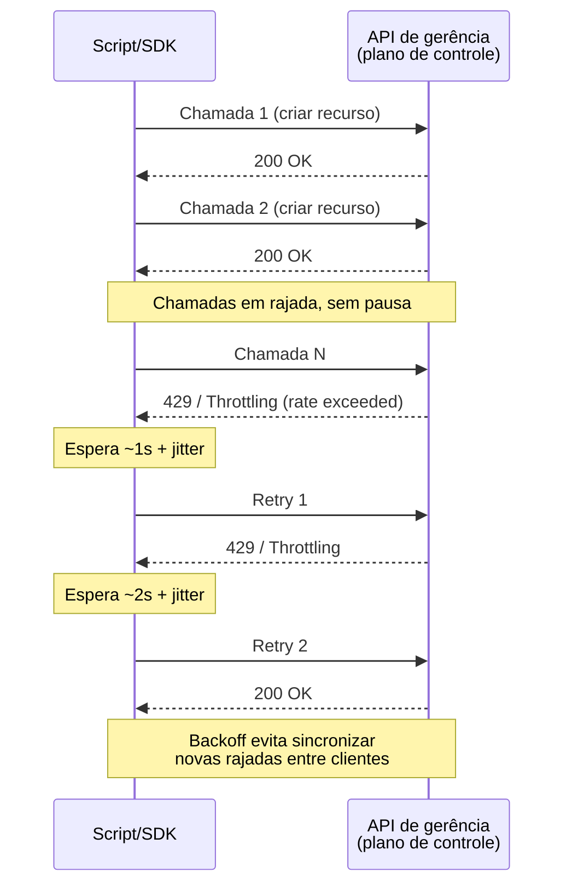
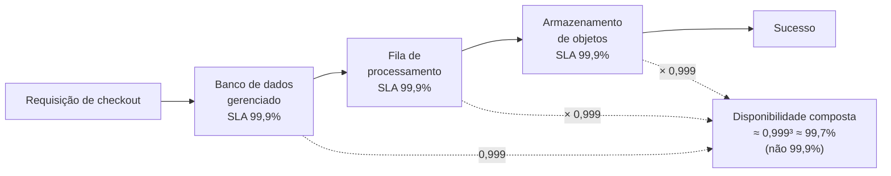

# Limites, cotas e o contrato do provedor

> [!abstract] TL;DR
> Tudo na nuvem tem um teto — cota de recursos, taxa de chamadas de API, e uma promessa contratual de disponibilidade que é mais estreita do que parece. Cotas são, em grande parte, ajustáveis, mas o ajuste não é instantâneo — quem espera o pico de tráfego para descobrir o teto já perdeu a corrida. Rate limit é o plano de controle se defendendo de você, e a resposta correta é recuo exponencial com jitter, não insistência. O SLA de um provedor garante crédito na fatura, proporcional e que **você precisa reivindicar** — não continuidade do seu negócio, e a disponibilidade composta de vários serviços encadeados é sempre pior do que a de cada um isoladamente. Status pages atrasam por desenho, não por acidente: são atualizadas por gente, sob incentivo de não admitir problema antes de entender o problema. Esta nota fecha o galho 2 entregando a mecânica que separa quem lê contrato de provedor por obrigação de quem projeta em cima dela.

## A Black Friday que parou às 20 instâncias

Um time de e-commerce passa meses preparando a Black Friday. O código está testado, o banco de dados foi dimensionado para o pico esperado, o grupo de autoscaling está configurado com uma política agressiva: adicionar instâncias sempre que a CPU média ultrapassar 60%, sem teto explícito além de "o quanto for preciso". Às 20h, o tráfego começa a subir como previsto — e continua subindo além do previsto, porque a campanha de marketing performou acima da meta. O grupo de autoscaling tenta responder: solicita a décima nona instância, a vigésima. Na vigésima primeira, a chamada de API que deveria criar a instância volta com um erro que ninguém no time nunca tinha visto em produção: `VcpuLimitExceeded`.

Não é falta de dinheiro. O cartão de crédito da empresa aceitaria pagar por cem instâncias a mais sem pestanejar. É uma cota — um teto numérico, silencioso até o momento em que é atingido, que a conta carregava desde o dia em que foi criada e que ninguém tinha motivo prévio para notar, porque o tráfego normal nunca chegou perto dele. O autoscaling não trava com um alarme vermelho gritando "cota estourada" — ele simplesmente para de conseguir o que pediu, silenciosamente, uma tentativa fracassada atrás da outra, enquanto o tráfego real continua batendo num pool de instâncias que parou de crescer. A CPU das instâncias existentes sobe para 100%, a latência do checkout dispara, uma fração de clientes desiste da compra no momento exato em que a empresa mais precisava deles.

Ninguém decidiu impor esse teto no meio da Black Friday. Ele estava lá o tempo todo — só nunca tinha sido testado sob a carga que finalmente chegou. É essa a primeira lição desta nota, e ela é desconfortável o bastante para merecer ser dita sem rodeio: **a cota que você nunca olhou não deixou de existir só porque você nunca bateu nela.**

## Cotas: o teto que quase sempre é negociável — mas nunca na hora

Todo provedor de nuvem impõe limites numéricos sobre quantos recursos uma conta pode ter, ou quantas operações ela pode realizar num intervalo de tempo. A AWS chama isso formalmente de **service quotas** (o termo "limits" ainda circula informalmente, mas foi substituído no vocabulário oficial); a ideia existe igualmente na DigitalOcean e em qualquer provedor sério, ainda que com menos aparato de auto-atendimento em torno dela.

A primeira distinção que importa é entre dois tipos de teto, porque eles pedem estratégias diferentes:

- **Cotas ajustáveis (soft limits).** A maioria dos limites de recursos — quantas instâncias de um certo tipo você pode ter rodando simultaneamente numa região, quantos buckets de armazenamento, quantas funções sob demanda concorrentes — tem um valor padrão conservador, pensado para proteger tanto o provedor quanto contas novas contra erro (uma credencial vazada que tenta subir mil instâncias, por exemplo). Esse valor pode ser aumentado mediante solicitação. A documentação da AWS é explícita: pedidos de aumento de cota **não são aprovados instantaneamente** — "pode levar alguns dias" para o time de suporte revisar, aprovar (total ou parcialmente) ou negar o pedido.
- **Cotas rígidas (hard limits).** Um número menor de limites não é ajustável de jeito nenhum, por decisão de arquitetura do próprio provedor — geralmente porque violá-los quebraria alguma garantia estrutural do serviço, não porque o provedor "não quer liberar mais". Esses você não negocia; você projeta em torno deles.

O erro de quem nunca leu essa distinção com atenção é tratar toda cota como um número fixo e universal, igual para toda conta e toda região — quando na prática cada cota é, tipicamente, por conta **e** por região, e o valor real que sua conta específica tem pode já ter sido silenciosamente reduzido ou ampliado com base em tempo de vida e histórico de uso da conta. Uma conta nova, criada há uma semana, frequentemente começa com cotas mais conservadoras do que uma conta de três anos com histórico de pagamento limpo — o provedor está, ali, fazendo a mesma leitura de risco que um banco faz ao decidir o limite inicial de um cartão de crédito novo.

> [!info] Caducidade
> Valores exatos de cota (quantas instâncias, qual limiar de vCPU, qual quantidade de buckets) variam por serviço, região, tipo de conta e mudam com o tempo — a AWS revisa defaults periodicamente. Não memorize um número específico; memorize o hábito de checar a cota real da sua conta, no console de Service Quotas ou equivalente, antes de projetar para um pico. Verificado em 2026-07-20 contra a documentação oficial da AWS.

A implicação de projeto é direta e é o núcleo prático desta seção: **cota não é um detalhe operacional que se resolve depois — é uma restrição de arquitetura, do mesmo tipo que orçamento ou latência de rede, e precisa entrar na conversa antes do dia do pico, não durante ele.** Um arquiteto sênior que está desenhando para um evento de tráfego previsível — uma campanha de marketing, um lançamento, uma Black Friday — trata "verificar e, se preciso, solicitar aumento das cotas relevantes com folga de dias" como um item de checklist tão obrigatório quanto testar o autoscaling em si. A cota que seria suficiente ontem pode não ser suficiente amanhã; o pedido de aumento tem lead time; então o pedido acontece na semana anterior, não na noite do evento.

## Rate limiting: o plano de controle se defendendo de você

Existe um segundo tipo de teto, de natureza diferente da cota de recursos, e a nota 03 deste galho já deu o vocabulário para entendê-lo: é o **plano de controle** — a API de gerência que cria, altera e destrói recursos — se protegendo de ser sobrecarregado por um cliente (você) fazendo chamadas rápido demais. Isso é **rate limiting** (ou *throttling*), e ele é ortogonal à cota: você pode estar bem abaixo do seu limite de quantas instâncias pode ter e, ainda assim, ser recusado numa chamada de API específica, simplesmente porque fez chamadas demais num intervalo de tempo curto demais.

O cenário clássico onde isso aparece é automação agressiva: um script de migração que percorre uma lista de mil recursos e chama a API de criação ou atualização num laço apertado, sem pausa entre chamadas. As primeiras dezenas de chamadas passam. Em algum ponto, a resposta muda — um código de erro específico do tipo *rate exceeded* — e o script, se não foi escrito para lidar com isso, simplesmente falha no meio do trabalho, deixando o sistema num estado parcialmente migrado que ninguém planejou.

A resposta correta a isso, documentada e recomendada por praticamente todo provedor sério, não é "chamar de novo imediatamente" — isso só piora o problema, porque adiciona mais chamadas exatamente no momento em que o plano de controle já sinalizou que está sobrecarregado. A resposta é **recuo exponencial com jitter** (*exponential backoff with jitter*): ao ser recusado, espere um tempo antes de tentar de novo; se for recusado outra vez, dobre (ou mais) esse tempo de espera; e adicione uma variação aleatória pequena a cada espera, para que múltiplos clientes que foram todos recusados ao mesmo tempo não sincronizem suas tentativas seguintes e recriem o mesmo pico de chamadas simultâneas que causou o problema original.

Vale registrar por que isso não é só cortesia com o provedor — é autoproteção. A maioria dos SDKs oficiais (o da AWS incluso) já implementa recuo exponencial automaticamente nas chamadas de API, o que esconde o problema em uso normal — mas um script que chama a API HTTP diretamente, ou que desabilita o retry padrão do SDK por engano, perde essa rede de segurança sem perceber. E há uma segunda leitura, mais arquitetural: automação agressiva demais contra o plano de controle é, na prática, uma forma de negação de serviço que você mesmo aplica na sua própria conta — o mesmo plano de controle que seu pipeline de deploy usa é o que seu time de operação também vai precisar usar, na mesma janela de tempo, se algo der errado.

> [!info] Fronteira
> Infraestrutura como código — Terraform, e como ferramentas de IaC lidam (ou não) com rate limiting em aplicações de grande escala — é o assunto do **galho 16** desta trilha. Aqui a ideia é só o mecanismo: por que o plano de controle throttling existe e como reagir a ele com correção.

## O SLA: o que ele promete de verdade, e o que você acha que ele promete

Chegamos à peça que dá nome ao "contrato do provedor" no título desta nota — e é aqui que a maioria dos engenheiros, mesmo sêniores, carrega uma suposição errada nunca examinada de perto.

Pergunte a um time de engenharia o que significa "esse serviço tem SLA de 99,99%" e a resposta mais comum, mesmo vinda de gente experiente, é algo como: "o provedor garante que o serviço vai estar disponível 99,99% do tempo". Essa resposta está sutilmente errada, de um jeito que só fica visível quando você lê o texto real do SLA — e a diferença entre a leitura popular e a leitura literal do contrato é exatamente o que separa quem confia cegamente de quem sabe negociar risco.

**O que um SLA de nuvem realmente é: uma promessa financeira, condicional, que você precisa acionar.** Tome o SLA de computação da própria AWS como exemplo concreto e verificável. O compromisso de EC2 tem duas camadas: no nível de **região**, a AWS se compromete com um *Monthly Uptime Percentage* de pelo menos 99,99% para instâncias distribuídas por múltiplas zonas de disponibilidade; no nível de **instância individual**, o compromisso cai para pelo menos 99,5%. Se esse compromisso não for cumprido num ciclo de faturamento, o cliente tem direito a um **crédito de serviço** — não a dinheiro de volta, não a compensação por perda de receita, um crédito aplicado à fatura futura — numa escala proporcional ao tamanho da falha:

| Uptime mensal no nível instância | Crédito de serviço |
|---|---|
| Abaixo de 99,5%, mas ≥ 99,0% | 10% |
| Abaixo de 99,0%, mas ≥ 95,0% | 30% |
| Abaixo de 95,0% | 100% |

O mesmo desenho de tabela, com os limiares deslocados para o compromisso de 99,99%, vale para o SLA no nível de região. Há também uma cláusula específica e pouco conhecida: a AWS não cobra por uma instância individual que ficou indisponível por mais de seis minutos dentro de uma hora-relógio — um mecanismo automático, sem necessidade de reivindicação, mas que só cobre aquela hora específica, não o incidente inteiro.

> [!info] Caducidade
> Os percentuais e faixas de crédito acima refletem o texto do SLA de computação (EC2) da AWS publicado em `aws.amazon.com/compute/sla/`, verificado em 2026-07-20. Cada serviço tem seu próprio SLA, com seu próprio texto — não assuma que o SLA de um serviço se aplica a outro do mesmo provedor. Sempre confira o SLA específico do serviço antes de tomar uma decisão de arquitetura baseada nele.

A DigitalOcean segue a mesma lógica estrutural, com um desenho mais simples: o SLA de CPU Droplets (publicado em `digitalocean.com/sla/cpu-droplets`) compromete um *Monthly Uptime Percentage* de 99,99% por Droplet individual, e a tabela de crédito, ao contrário da AWS, não é escalonada em faixas — é uma única linha: qualquer uptime abaixo de 99,99% dá direito a 100% de crédito sobre a cobrança daquele Droplet específico no período afetado. A letra miúda importa tanto quanto o número: o crédito **não é automático** — o cliente precisa contatar o suporte dentro de duas faturas do mês do incidente, informando conta, Droplet afetado e datas/horários exatos da indisponibilidade, e a DigitalOcean verifica antes de emitir o crédito. E o SLA explicitamente **não cobre** manutenção programada, indisponibilidade causada pelo próprio cliente, eventos fora do controle razoável do provedor, nem — ponto relevante para quem usa banco gerenciado ou Kubernetes gerenciado — clusters de DBaaS ou de controle do DOKS, que têm SLAs próprios e separados.

Três verdades incômodas emergem quando você lê esses textos com atenção, em vez de confiar no resumo de uma linha:

1. **O crédito é proporcional ao seu próprio gasto, não ao seu prejuízo.** Se o checkout do seu e-commerce ficou fora do ar durante três horas na Black Friday por causa de uma falha do provedor, o crédito que você recebe é uma fração da fatura daquele recurso específico — potencialmente algumas dezenas ou centenas de dólares — não uma fração da receita que você deixou de faturar naquelas três horas, que pode ser ordens de grandeza maior. O SLA nunca prometeu cobrir isso. Ele nunca teve essa ambição.
2. **Você precisa pedir.** Nenhum dos dois provedores credita automaticamente (com a exceção pontual da regra de seis minutos por hora da AWS). Se sua equipe não tem um processo — documentar o incidente, registrar horários, abrir o pedido dentro do prazo — o crédito a que você tem direito contratual simplesmente não acontece, porque ninguém pediu.
3. **As exclusões são amplas e reais.** "Fatores fora do controle razoável do provedor" é uma cláusula elástica; má configuração do próprio cliente é excluída por definição; manutenção programada, avisada com antecedência, não conta como indisponibilidade nenhuma das duas SLAs analisadas.

A conclusão prática, dita sem rodeio, é a que deveria orientar todo desenho de sistema crítico: **um SLA de provedor não é uma estratégia de continuidade de negócio — é, na melhor das hipóteses, um desconto parcial e burocrático sobre um problema que você ainda vai ter que absorver de outras formas.** A continuidade de negócio real vem de arquitetura — redundância entre zonas e regiões, planos de disaster recovery, degradação graciosa — não de uma cláusula contratual. É exatamente por isso que a **nota 20** desta trilha, sobre estratégia multi-AZ e disaster recovery, existe: ela é a resposta de engenharia para um problema que o SLA, sozinho, nunca resolveu.

## A matemática que ninguém faz: disponibilidade composta

Existe uma armadilha aritmética adicional, sutil o suficiente para escapar até de gente que já leu o SLA com atenção: **a disponibilidade do seu sistema não é a disponibilidade do serviço mais frágil que ele usa — é o produto das disponibilidades de todos os serviços que precisam funcionar, em sequência, para uma requisição ter sucesso.**

Imagine um fluxo de checkout que depende, em cadeia, de três serviços gerenciados independentes: o banco de dados gerenciado, o serviço de fila para processar o pagamento de forma assíncrona, e um serviço de armazenamento de objetos para gravar o recibo. Suponha, para simplificar, que os três tenham o mesmo compromisso de SLA de 99,9% cada (um número redondo escolhido só para ilustrar a mecânica — confira sempre os números reais dos serviços específicos que você usa). A tentação é somar mentalmente "cada peça é 99,9%, então o sistema também é, mais ou menos, 99,9%". A aritmética real é outra: como as três dependências precisam **todas** funcionar para a requisição ter sucesso, a disponibilidade composta é o produto das três — 0,999 × 0,999 × 0,999 ≈ 0,997, ou seja, aproximadamente 99,7%, não 99,9%. Cada dependência adicional na cadeia crítica multiplica o risco, nunca o dilui.

A diferença entre 99,9% e 99,7% parece pequena escrita assim, lado a lado — mas em minutos de indisponibilidade por mês, ela é a diferença entre algo em torno de 43 minutos e mais de duas horas. E o exemplo acima usa só três dependências: um sistema real, com um banco, um cache, uma fila, uma função sob demanda e um serviço de terceiro para envio de e-mail transacional, facilmente encadeia cinco ou seis dependências críticas — e cada uma multiplicando o risco composto, silenciosamente, sem que nenhum SLA individual tenha mentido em nenhum momento.

A lição de projeto que sai dessa aritmética é dupla. Primeiro: ao ler o SLA de um serviço isolado, pergunte sempre "de quantas outras coisas essa chamada depende para ter sucesso?" — o número do SLA do serviço individual nunca é o número real de disponibilidade que o seu usuário experimenta. Segundo, e é o gancho direto para o próximo galho desta trilha: reduzir a **quantidade** de dependências síncronas na cadeia crítica de uma requisição — via cache, via processamento assíncrono desacoplado, via degradação graciosa quando uma dependência não crítica falha — é, matematicamente, uma das formas mais diretas de melhorar disponibilidade, independente de qualquer SLA que qualquer provedor individual ofereça.

> [!info] Fronteira
> A modelagem formal de disponibilidade composta, pontos únicos de falha e os padrões de resiliência (circuit breaker, retry com timeout, bulkhead) que mitigam esse risco em sistemas distribuídos têm casa própria em [[03-Dominios/Engenharia/Arquitetura/index|Arquitetura / System Design]]. Esta nota entrega só o gatilho: por que ler um SLA isolado, sem pensar na cadeia, é ler apenas metade da história.

## Status pages: por que a luz verde atrasa

A última peça do "contrato" de um provedor não é escrita — é operacional: a página pública de status, aquela que mostra bolinhas verdes ou amarelas por serviço e região, e para a qual todo mundo olha nos primeiros segundos de um incidente para perguntar "sou só eu, ou é o provedor?".

A resposta honesta e desconfortável, documentada por relatos recorrentes de engenheiros que já trabalharam do lado de dentro de operações de nuvem, é que **status pages atrasam a realidade por desenho estrutural, não por falha técnica pontual.** Há três forças que empurram nessa direção, e nenhuma delas é incompetência:

- **A atualização costuma ser um julgamento humano, não uma métrica automática.** Um ex-engenheiro da AWS relatou publicamente que publicar um status "não-verde" na página era, na prática, uma decisão de gerência — alguém precisa avaliar severidade e assinar embaixo, o que introduz latência de aprovação antes de qualquer atualização visível ao público.
- **O status publicado alimenta cláusulas contratuais de SLA.** Cada mudança de cor na página é um timestamp que pode ser usado depois, por advogados e por clientes corporativos grandes, para calcular exatamente quantos minutos de crédito são devidos — o que cria um incentivo real, documentado por mais de um praticante do setor, para adiar a confirmação pública até que o time tenha certeza plena do que está acontecendo e de quanto tempo já durou.
- **Escala torna o status binário inadequado.** Num provedor operando em dezenas de regiões com milhares de clientes simultâneos, "está tudo bem" ou "está tudo quebrado" raramente descreve a realidade — uma falha específica pode afetar uma fração pequena de contas numa zona específica, enquanto a esmagadora maioria dos clientes não percebe nada. Reduzir isso a um indicador de cor única, para todo mundo, embute uma perda de informação estrutural.

O efeito medido, relatado por análises independentes de incidentes reais, é que status pages tipicamente atrasam entre 15 e 45 minutos em relação ao início real de um incidente — e há registros documentados de casos em que reclamações de usuários em redes sociais precederam a confirmação oficial em mais de dez minutos, mesmo durante interrupções de grande porte.

A implicação prática para quem opera um sistema em produção: **a página de status do provedor não é sua primeira fonte de verdade durante um incidente — é, na melhor das hipóteses, uma confirmação tardia.** Seus próprios sinais — health checks falhando, latência subindo, taxa de erro subindo nos seus próprios dashboards — chegam antes, quase sempre. Esperar a bolinha verde virar amarela antes de começar a investigar é, na prática, atrasar sua própria resposta a incidente pelo mesmo intervalo que o provedor levou para admitir o problema.

> [!info] Ponte
> A disciplina de detectar, triar e responder a incidentes usando seus próprios sinais — em vez de esperar confirmação externa — é o corpo inteiro da nota "Anatomia de um incidente de produção" e do galho 4 da trilha [[03-Dominios/Engenharia/Operação/index|Operação (DevOps/SRE)]]. O que esta nota estabelece é só o motivo estrutural de não confiar cegamente na página do provedor como gatilho de resposta.

## Lente dupla e tradução AWS ↔ Azure ↔ GCP ↔ DigitalOcean

O vocabulário muda de provedor para provedor, mas os conceitos — cota, throttling do plano de controle, SLA com crédito, status page — são universais o suficiente para valer a pena traduzir de saída.

| Conceito | AWS | Azure | GCP | DigitalOcean |
|---|---|---|---|---|
| Painel de cotas | Service Quotas | Quotas (Azure Portal) | Quotas & System Limits (Cloud Console) | Sem painel de auto-atendimento equivalente; limites geralmente tratados via suporte |
| Pedido de aumento de cota | Request quota increase (console/API/CLI) | Request quota increase (blade de suporte) | Request higher quota | Contato direto com suporte |
| Erro de throttling da API | `RequestLimitExceeded` / `ThrottlingException` | HTTP 429 com `Retry-After` | HTTP 429 / `RESOURCE_EXHAUSTED` | HTTP 429 |
| Página de status pública | AWS Health Dashboard / Service Health | Azure Status | Google Cloud Service Health | DigitalOcean Status |
| SLA — unidade de compensação | Service Credit (crédito na fatura) | Service Credit | Service Level Credit | Service Credit |

Para quem vem de dois anos de DigitalOcean, vale nomear a diferença de postura estrutural entre os dois provedores nesse tema específico: a AWS expõe cotas, throttling e SLA como **superfície explícita de auto-atendimento** — painéis, APIs, documentação detalhada por serviço, porque o catálogo é grande o bastante para que isso seja inevitável. A DigitalOcean, fiel à filosofia de simplicidade que a **nota 01** do galho 1 já descreveu, expõe menos desse aparato — os limites existem igualmente (nenhum provedor de infraestrutura escala sem impor algum teto), mas descobri-los tende a passar mais por contato direto com suporte do que por um painel self-service. Isso não é uma lacuna: é a mesma filosofia de "menos opções, menos para gerenciar" se manifestando aqui também. A implicação prática é que, em DO, vale a pena estabelecer contato com o suporte **antes** de um evento de tráfego previsto, em vez de confiar num painel que talvez não exista para o recurso específico que você precisa escalar.

## Casos práticos

**O pedido de aumento de cota que chegou tarde.** Um time planeja o lançamento de uma nova funcionalidade que vai gerar um pico de processamento em lote, calcula quantas instâncias vai precisar, e só descobre — dois dias antes do lançamento — que a cota atual da conta não comporta esse número. O pedido de aumento é aberto, mas o prazo de aprovação do suporte não é instantâneo; o lançamento precisa ser adiado alguns dias, não por falha técnica nenhuma, mas por não ter tratado a cota como parte do planejamento de capacidade desde o início.

**O script de sincronização que travou o pipeline de deploy dos outros.** Um engenheiro escreve um script que sincroniza tags em centenas de recursos, chamando a API de gerência em laço apertado sem pausa. O script começa a ser throttled, e — porque o plano de controle é compartilhado pela conta inteira — o pipeline de deploy de outro time, rodando ao mesmo tempo, também começa a receber erros de throttling em chamadas completamente não relacionadas. A causa raiz do post-mortem não é "o provedor está com problema" — é "nosso próprio script consumiu a cota de taxa da API que todo mundo compartilha".

**A reclamação de crédito de SLA que nunca foi aberta.** Uma equipe sofre uma indisponibilidade real, documentada nos próprios logs, que qualificaria para crédito de serviço segundo o SLA do provedor — mas ninguém no time sabia que existia um processo formal de reivindicação com prazo, e a janela para pedir o crédito se fecha sem que ninguém tenha aberto o chamado. O crédito contratual a que a empresa tinha direito nunca chegou, não porque o provedor recusou, mas porque ninguém pediu.

## Armadilhas comuns

> [!warning] Tratar o percentual do SLA como uma garantia de disponibilidade do seu produto
> "O provedor tem SLA de 99,99%, então nosso produto tem 99,99% de disponibilidade" ignora duas coisas ao mesmo tempo: o SLA cobre só aquele serviço específico, com exclusões amplas, e seu sistema real quase sempre encadeia múltiplos serviços — cuja disponibilidade composta é sempre igual ou pior do que a de cada peça isolada, nunca melhor. A disponibilidade do seu produto é uma propriedade que você projeta, não uma que você herda automaticamente do contrato do provedor.

> [!warning] Assumir que a cota atual vai bastar porque bastou até agora
> Cotas foram dimensionadas para o padrão de uso histórico da conta, não para o próximo pico. Um time que só verifica cotas quando algo já falhou está, por definição, descobrindo o teto no pior momento possível — durante o evento que mais precisava de capacidade extra, não numa janela tranquila de planejamento com dias de antecedência para pedir aumento.

> [!warning] Usar a página de status do provedor como gatilho para começar a investigar um incidente
> Esperar a confirmação oficial antes de agir atrasa a resposta pelo mesmo intervalo — tipicamente entre quinze e quarenta e cinco minutos — que a página de status historicamente leva para refletir a realidade. Seus próprios sinais de observabilidade são, quase sempre, mais rápidos e mais confiáveis do que aguardar uma bolinha mudar de cor.

## Fechando o galho 2

Este é o fim do segundo galho da trilha, e vale nomear, ponta a ponta, o que ele construiu. A **nota 01** estabeleceu a conta como unidade de isolamento e cobrança, e por que ela precisa de fronteiras deliberadas. A **nota 02** mapeou a geografia — regiões, zonas de disponibilidade, edge — e os critérios reais para escolher onde rodar. A **nota 03** entregou a distinção entre plano de controle e plano de dados, que explica por que um console pode cair sem derrubar sua aplicação. A **nota 04** mostrou que console, CLI, SDK e API são só quatro portas para a mesma conversa HTTP, e por que isso importa para reprodutibilidade. A **nota 05** traçou a linha móvel do modelo de responsabilidade compartilhada, camada por camada. E esta nota, a sexta e última, fechou entregando os limites reais dessa mecânica: cotas que mordem sob pico, rate limiting que pune automação sem recuo, e um contrato de SLA cuja letra miúda promete muito menos do que a intuição sugere. Juntas, essas seis notas entregam o que qualquer engenheiro precisa saber **antes** de tocar num serviço específico de compute, armazenamento ou banco de dados — a anatomia por dentro de como um provedor é montado, opera e se protege.

## O que vem a seguir

Até aqui, esta trilha tratou o provedor como uma máquina a ser entendida — sua geografia, seus planos internos, suas portas de acesso, seus limites. Mas conhecer a mecânica não é a mesma coisa que saber julgar uma arquitetura: dada a mecânica inteira que os galhos 1 e 2 entregaram, como um arquiteto sênior decide, com critério e não por instinto, se um desenho específico é *bom*? Que dimensões formais — além de custo e segurança, que esta trilha já tocou de leve — merecem entrar na avaliação de toda decisão relevante? É exatamente essa pergunta que o **galho 3, "Well-Architected Framework"**, começa a responder: ele pega a mecânica que este galho 2 entregou e a transforma em critério de julgamento arquitetural, nomeado e repetível.

## Fontes

- [AWS Service Quotas — What Is Service Quotas?](https://docs.aws.amazon.com/servicequotas/latest/userguide/intro.html) — definição oficial de cota ajustável vs não-ajustável, terminologia e processo de solicitação de aumento; acessado em 2026-07-20.
- [AWS General Reference — AWS service quotas](https://docs.aws.amazon.com/general/latest/gr/aws_service_limits.html) — como consultar cotas via console, CLI e API, e prazo de aprovação de pedidos de aumento; acessado em 2026-07-20.
- [Amazon EC2 Service Level Agreement](https://aws.amazon.com/compute/sla/) — texto oficial do SLA de EC2: compromissos de 99,99% (região) e 99,5% (instância), tabela de crédito de serviço, e a cláusula de isenção de cobrança por indisponibilidade acima de seis minutos por hora; acessado em 2026-07-20.
- [DigitalOcean — CPU Droplet SLA](https://www.digitalocean.com/sla/cpu-droplets) — texto oficial do SLA de CPU Droplets: compromisso de 99,99%, crédito de 100% abaixo do limiar, processo de reivindicação em duas faturas, e exclusões (manutenção programada, DOKS control plane, DBaaS); acessado em 2026-07-20.
- [OneUptime — Your Status Page Is a Lie (And Your Customers Know It)](https://oneuptime.com/blog/post/2026-03-08-your-status-page-is-a-lie/view) — análise de lag entre início real de incidente e atualização da página de status (15-45 minutos), e os incentivos organizacionais por trás do atraso; acessado em 2026-07-20.
- [The Register — Why cloud platform status pages may not reflect reality](https://www.theregister.com/2022/02/24/cloud_service_status_pages_fail/) — relatos de praticantes (incluindo ex-engenheiro da AWS) sobre a natureza manual e sujeita a aprovação gerencial das atualizações de status page, com exemplo documentado de fevereiro de 2022; acessado em 2026-07-20.
