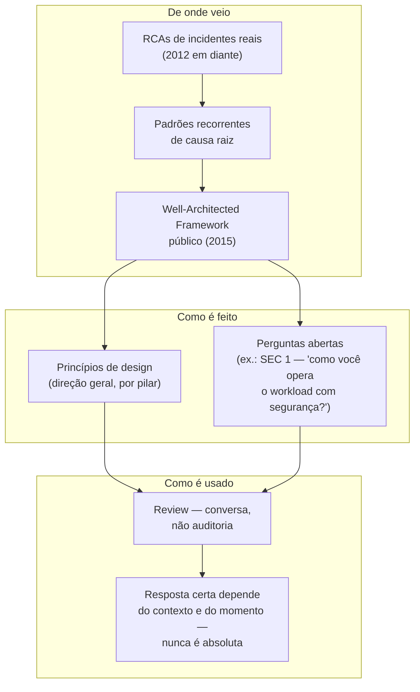
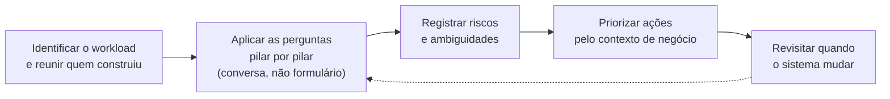
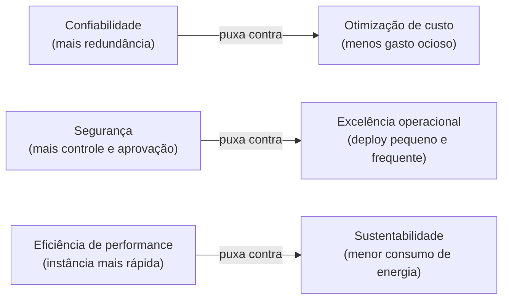

# Por que existe um framework de arquitetura

> [!abstract] TL;DR
> O AWS Well-Architected Framework não nasceu como uma lista de conformidade para auditor marcar "sim/não" — nasceu como um conjunto de **perguntas** que arquitetos da AWS já faziam informalmente, comparando o que dava errado (Root Cause Analysis) com o que uma arquitetura deveria ter garantido desde o início. Formalizado em 2015 a partir de práticas internas que já rodavam desde 2012, ele hoje tem seis pilares — excelência operacional, segurança, confiabilidade, eficiência de performance, otimização de custo e sustentabilidade — cada um com seus próprios princípios de design e sua própria lista de perguntas. Uma review "bem-arquitetada" de verdade é uma conversa sem culpa, de horas, não uma auditoria de dias. E aqui já vale plantar a semente que fecha este galho: os seis pilares **puxam a arquitetura em direções que se contradizem entre si** — não existe uma resposta que maximize todos ao mesmo tempo, só um trade-off explícito e defensável.

## A pergunta que ninguém sabe responder direito

Um time termina de subir uma nova versão do sistema de pagamentos: microsserviços em containers, banco gerenciado, fila entre os componentes, autoscaling configurado, HTTPS em todo lugar, backups automáticos. Funciona. Os testes passam. A demo para o time de produto foi um sucesso. Alguém do lado de negócio, satisfeito, pergunta uma coisa aparentemente simples: "então, está tudo certo? Isso está bem arquitetado?"

E aí a sala fica quieta.

Ninguém sabe responder com confiança, porque "está tudo certo" não é uma pergunta técnica — é um julgamento de valor que depende de critério, e ninguém no time definiu, por escrito, qual é esse critério antes de começar a construir. "Funciona" e "está bem arquitetado" não são a mesma coisa. Um sistema pode passar em todos os testes de integração e ainda assim ter um único ponto de falha que derruba tudo numa manhã de sexta-feira; pode estar seguro contra os ataques óbvios e mesmo assim conceder permissões amplas demais a um serviço que só precisava ler um bucket; pode escalar bonito sob carga simulada e ainda assim custar três vezes o necessário porque ninguém revisou o tamanho das instâncias desde o protótipo.

O mesmo silêncio acontece, com uma tensão diferente, numa entrevista técnica sênior. O entrevistador desenha um sistema no quadro e pergunta: "o que você mudaria nessa arquitetura?" Um candidato júnior aponta um ou dois problemas óbvios — "eu adicionaria um cache aqui", "isso parece um single point of failure". Um candidato sênior faz outra coisa: organiza a crítica em eixos — "do ponto de vista de confiabilidade, isso é um problema; do ponto de vista de custo, essa escolha é razoável; do ponto de vista de segurança, eu questionaria essa permissão" — e, principalmente, é honesto sobre o fato de que melhorar um eixo frequentemente piora outro. Essa organização em eixos não é um talento inato do candidato sênior. É um framework que ele aprendeu a usar, tantas vezes, que virou reflexo.

Esse framework existe, tem nome, e é o assunto desta nota e do galho inteiro que ela abre: o **AWS Well-Architected Framework**. E a primeira coisa a entender sobre ele é de onde veio — porque a origem explica por que ele é feito de perguntas, e não de uma lista de caixinhas para marcar.

## De onde veio: uma prática interna que virou framework público

O Well-Architected Framework não foi desenhado numa sala de reunião de marketing para lançar um produto. Ele nasceu de uma prática interna da AWS que já existia informalmente desde 2012, dentro do próprio trabalho dos Solutions Architects da empresa — as pessoas que, todos os dias, ajudavam clientes (e a própria AWS) a revisar arquiteturas em produção.

A lógica por trás dessa prática é simples e um pouco desconfortável: toda vez que um sistema falha de um jeito significativo — um incidente sério, uma reclamação de cliente, uma vulnerabilidade explorada — alguém escreve uma **Root Cause Analysis** (RCA, análise de causa raiz), documentando o que deu errado e por quê. A AWS, ao longo de anos revisando milhares de arquiteturas de clientes e sistemas próprios, percebeu um padrão: as mesmas categorias de pergunta apareciam, de novo e de novo, nas RCAs de incidentes completamente diferentes. "Vocês tinham um plano de recuperação testado?" "Quem tinha acesso a esse recurso, e por quê?" "Isso escalava automaticamente, ou alguém precisava intervir manualmente?" Essas perguntas recorrentes, quando reunidas, viraram literalmente o esqueleto do framework: não é uma lista de "boas práticas" abstratas importadas de um livro-texto — é uma coleção destilada de "isso já causou um incidente antes, então perguntamos sempre".

O framework foi ao público na conferência re:Invent, quando o CTO da Amazon, Werner Vogels, anunciou o whitepaper "AWS Well-Architected Framework". Naquele primeiro lançamento público, existiam quatro pilares — segurança, confiabilidade, eficiência de performance e otimização de custo. Em 2016, a AWS adicionou um quinto pilar, excelência operacional — reconhecendo que arquitetura não é só o desenho estático do sistema, mas também a disciplina de operá-lo e evoluí-lo com segurança ao longo do tempo. O sexto e mais recente pilar, sustentabilidade, chegou em 2021, ampliando o critério de "bem-arquitetado" para incluir o impacto ambiental de rodar aquele sistema — região escolhida, eficiência de recursos, desperdício de capacidade.

| Ano | Marco |
|---|---|
| 2012 | Prática interna de review nasce entre os Solutions Architects da AWS |
| Outubro de 2015 | Publicação inicial do whitepaper — quatro pilares (Segurança, Confiabilidade, Eficiência de Performance, Otimização de Custo) |
| Novembro de 2016 | Pilar de Excelência Operacional adicionado — cinco pilares |
| Novembro de 2021 | Pilar de Sustentabilidade adicionado — seis pilares, a composição atual |
| Novembro de 2024 | Revisão major mais recente: atualizações em Confiabilidade, Segurança, Excelência Operacional, Sustentabilidade e Eficiência de Performance |

A data exata do anúncio no re:Invent 2015 varia entre fontes secundárias; a documentação oficial de revisões registra a publicação inicial do whitepaper em 1º de outubro de 2015, com uma atualização menor já em 1º de novembro do mesmo ano.

> [!info] A origem, segundo uma fonte secundária
> A documentação oficial da AWS não associa a origem do framework a uma pessoa específica — só descreve a prática interna dos Solutions Architects desde 2012. Uma fonte secundária (não AWS, usada aqui só como complemento e sinalizada como tal) atribui o pontapé inicial desse movimento a Philip "Fitz" Fitzsimons, que teria se inspirado no arquiteto romano Vitrúvio Polião para propor que a AWS reunisse e reutilizasse boas práticas de arquitetura entre seus próprios Solutions Architects. Trate essa atribuição de nome como plausível, não como fato confirmado pela AWS.

> [!info] Caducidade
> A publicação atual do AWS Well-Architected Framework tem data de revisão de 6 de novembro de 2024, segundo a documentação oficial. O histórico oficial de revisões lista mais de quinze atualizações desde a publicação inicial do whitepaper em outubro de 2015 — a mais recente delas, uma atualização "major" em Confiabilidade, Segurança, Excelência Operacional, Sustentabilidade e Eficiência de Performance, é justamente a de novembro de 2024. Confira a data de revisão mais recente na documentação antes de citar qualquer detalhe como definitivo.

Esse histórico importa porque explica uma decisão de design que, de outra forma, pareceria arbitrária: por que o framework é feito de **perguntas** — "como você opera o workload com segurança?", "como você recupera de falha?" — e não de uma lista de "faça X, não faça Y"? Porque uma pergunta força quem está revisando a pensar no contexto específico daquele sistema, enquanto uma regra fixa tenta empurrar todo sistema para a mesma resposta, mesmo quando o contexto não pede aquela resposta. A AWS documenta isso explicitamente: o framework é "premised on a set of design principles that influences architectural approach, and questions that verify that people don't neglect areas that often featured in Root Cause Analysis". Tradução prática: os princípios de design dizem a direção geral; as perguntas garantem que ninguém esqueça de olhar para uma área que, historicamente, é onde as coisas quebram.

## Um corpo de perguntas, não um checklist de conformidade

Aqui está a distinção que separa quem usa o framework bem de quem o usa mal, e ela é sutil o suficiente para escapar de quem só ouviu falar dele de longe: **o Well-Architected Framework não é um checklist de conformidade**. Não existe uma pontuação de aprovação, não existe um "selo" que uma arquitetura ganha ao passar em todas as perguntas, e — isso é dito explicitamente na documentação oficial — o processo de revisão **não é um mecanismo de auditoria**.

A diferença entre checklist e corpo de perguntas não é semântica, é estrutural. Um checklist tem itens binários: "criptografia em trânsito habilitada? sim/não." Uma pergunta do Well-Architected Framework é aberta e força uma resposta contextualizada: "**como você opera o workload com segurança?**" (essa é, literalmente, a primeira pergunta do pilar de Segurança, "SEC 1", no texto oficial). Não existe resposta única certa para essa pergunta — a resposta certa para um serviço interno de baixo risco, mantido por dois engenheiros, é diferente da resposta certa para um sistema de pagamentos regulado, com dezenas de pessoas tocando o código. O checklist trataria os dois sistemas igual; a pergunta obriga quem responde a justificar a escolha para o contexto daquele sistema específico.

| Dimensão | Checklist de conformidade | Framework de perguntas |
|---|---|---|
| Formato da resposta | Binário — sim/não por item | Aberto — obriga a justificar a escolha para o contexto |
| Resultado esperado | Pontuação ou selo de aprovação | Lista de riscos priorizados, não uma nota |
| Quem conduz | Um auditor externo ao time | O próprio time que constrói, de forma contínua |
| Trata sistemas diferentes | Com a mesma régua para todos | Com a resposta certa dependendo de risco e contexto |
| Validade no tempo | Um evento pontual, depois arquivado | Revisitado sempre que o contexto do sistema muda |

Vale ver a estrutura de uma pergunta real do framework, porque ela mesma já é uma pista da diferença. Cada pergunta numerada vem acompanhada de uma lista de práticas recomendadas, também numeradas, que servem de material de apoio — não de gabarito. É assim que a pergunta "SEC 1" aparece na documentação oficial, na íntegra:

```text
SEC 1: How do you securely operate your workload?

Best practices:
- SEC01-BP01 Separate workloads using accounts
- SEC01-BP02 Secure account root user and properties
- SEC01-BP03 Identify and validate control objectives
- SEC01-BP04 Stay up to date with security threats and recommendations
- SEC01-BP05 Reduce security management scope
- SEC01-BP06 Automate deployment of standard security controls
- SEC01-BP07 Identify threats and prioritize mitigations using a threat model
- SEC01-BP08 Evaluate and implement new security services and features regularly
```

Repare no que essa lista não é: não é uma lista de oito caixinhas que, marcadas todas, dão uma workload como "aprovada" em segurança. É uma lista de direções possíveis de investigação para responder à pergunta-mãe — algumas mais relevantes para um sistema do que para outro. Um serviço interno pequeno pode, com razão, não separar contas por workload (SEC01-BP01) e ainda assim estar respondendo bem à pergunta, se o risco daquele serviço específico não justifica a complexidade extra.

Isso tem uma consequência direta sobre o que significa "bem-arquitetado": **a expressão é sempre relativa ao contexto e ao momento**, nunca um estado absoluto que um sistema atinge de uma vez por todas. Um sistema que estava bem-arquitetado há dois anos pode não estar mais — porque a carga cresceu dez vezes, porque um novo requisito regulatório apareceu, porque a equipe que o mantém mudou de três pessoas seniores para uma pessoa júnior sozinha, ou simplesmente porque a AWS lançou um serviço gerenciado novo que torna obsoleta a solução caseira que o time construiu em 2019. Um sistema "bem-arquitetado" em 2020 pode estar "mal-arquitetado" hoje sem que uma única linha de código nele tenha mudado — porque o contexto ao redor dele mudou, e a barra do que conta como bom se moveu junto.

O contexto que muda a resposta certa não é só temporal — também é o tipo de sistema. Um mesmo workload pode passar pelas perguntas genéricas dos seis pilares e sair "bem-arquitetado" nesse nível, e ainda assim ter lacunas sérias que só aparecem sob um recorte mais específico: um SaaS multi-tenant que nunca foi avaliado pela SaaS Lens pode estar perfeitamente sólido em confiabilidade genérica e, mesmo assim, ter um problema de isolamento entre clientes que a pergunta genérica de Segurança nunca foi desenhada para capturar. A seção sobre a ferramenta, mais adiante nesta nota, retoma essa ideia de lens com mais detalhe.



## Os seis pilares — nomeados aqui, desenvolvidos nas próximas notas

O framework organiza suas perguntas e princípios de design em seis categorias, chamadas de **pilares** — esses são os nomes oficiais, na ordem em que a própria documentação os lista. Esta nota só os nomeia e aponta a tensão entre eles; cada um ganha sua própria nota no restante deste galho, onde a mecânica é desenvolvida em profundidade:

| Pilar | A pergunta central que ele faz | Um trade-off que ele tensiona |
|---|---|---|
| Excelência operacional | Como você opera e evolui o sistema com segurança, aprendendo com falha sem cultura de culpa? | Mais processo de mudança reduz risco, mas reduz velocidade de entrega |
| Segurança | Como você opera o workload com segurança — da conta ao dado? | Mais camada de aprovação e controle reduz risco, mas aumenta fricção |
| Confiabilidade | O sistema cumpre sua função de forma consistente e se recupera de falha sem herói de plantão? | Redundância entre zonas e testes de recuperação custam dinheiro |
| Eficiência de performance | Os recursos computacionais estão sendo bem usados diante da carga e da tecnologia disponíveis agora? | A opção mais rápida nem sempre é a mais barata ou eficiente |
| Otimização de custo | De onde vem cada centavo da fatura, e esse gasto é mesmo necessário? | Cortar gasto pode cortar junto a folga que sustenta confiabilidade |
| Sustentabilidade | Qual é o impacto ambiental de rodar esse sistema — região, eficiência de recurso, capacidade ociosa? | A instância mais rápida nem sempre é a mais eficiente em energia |

Cada pilar tem sua própria lista de perguntas numeradas — como "SEC 1", "REL 2", "COST 3" — e seus próprios princípios de design, que são recomendações de direção (por exemplo, "implemente uma base de identidade forte" é um dos princípios de design do pilar de Segurança). Nenhum desses seis pilares será desenvolvido em profundidade aqui — essa é, literalmente, a razão de existir das próximas seis notas deste galho.

> [!info] Fronteira
> Excelência operacional, na prática de SRE — SLOs, postmortems, incident response — já tem casa própria no vault: [[03-Dominios/Engenharia/Operação/index|Operação (DevOps/SRE)]]. O pilar de excelência operacional, aqui, é o *critério de arquitetura* que justifica investir nessas práticas — não uma reexplicação delas.

## Como uma review acontece de verdade

Vale desfazer, com algum detalhe, a imagem que a palavra "review" costuma evocar em quem vem de processos de auditoria formal — sala fechada, checklist impresso, um avaliador de fora marcando itens em silêncio. Não é assim que uma Well-Architected Review funciona, e a documentação oficial é explícita sobre isso: deve ser "**lightweight** (hours not days)" e conduzida com "**blame-free approach that encourages diving deep**" — leve, de horas e não de dias, sem cultura de culpa, e que encoraja mergulhar fundo nos detalhes em vez de ficar na superfície.

Na prática, o formato recomendado é quase o oposto de uma auditoria: uma série de **conversas informais** sobre a arquitetura, onde a maior parte das respostas às perguntas do framework emerge naturalmente da discussão — seguida, se necessário, de uma ou duas reuniões focadas para esclarecer pontos de ambiguidade ou risco percebido. O material recomendado para essas reuniões também é revelador do tom pretendido: uma sala com quadro branco, impressões dos diagramas de arquitetura, e uma lista de ações para perguntas que precisam de pesquisa fora da reunião ("ativamos criptografia ou não? vamos confirmar e responder depois"). É trabalho de engenharia colaborativo, não interrogatório — o que também molda quem precisa estar na sala:

| Quem participa | O que essa pessoa traz |
|---|---|
| Quem construiu e opera o sistema | O conhecimento real de como ele funciona hoje, não como foi desenhado no papel |
| Quem facilita a conversa | Conduz pelas perguntas do framework, sem deixar a discussão virar interrogatório |
| Quem decide pelo negócio | Ajuda a priorizar os riscos encontrados pelo impacto real, não só pelo técnico |
| Quem vai herdar o sistema depois | Traz a pergunta que só quem sustenta algo a longo prazo costuma fazer |



Esse ciclo — identificar, perguntar, registrar, priorizar, revisitar — não termina numa reunião só. Ele se repete à medida que o sistema evolui, o que é exatamente o ponto do próximo parágrafo.

O "registrar riscos" do meio do ciclo não é abstrato — é uma anotação simples, ligada à pergunta que a revelou, com dono e prazo. Uma entrada real de uma review costuma se parecer com isto:

```text
Pilar: Confiabilidade
Pergunta: como você recupera de falha nesse componente?
Risco encontrado: procedimento de recuperação existe no runbook,
                   mas nunca foi exercitado em ambiente real.
Ação: agendar um game day para testar o failover do componente X.
Dono: time de pagamentos.
Prazo: antes do próximo go-live.
```

Não é burocracia — é a diferença entre um risco que fica só na cabeça de quem falou dele na reunião e um risco que alguém é responsável por fechar.

Um detalhe conceitual que vale carregar para qualquer decisão de arquitetura, não só para reviews formais, é a distinção entre **decisões de mão única e decisões de mão dupla** ("one-way doors" e "two-way doors", no vocabulário da própria AWS):

| Tipo de decisão | É reversível? | Exemplo | Processo recomendado |
|---|---|---|---|
| Mão dupla (two-way door) | Sim, com baixo custo de voltar atrás | Ajustar o tamanho de uma instância | Leve — decida, teste, corrija se precisar |
| Mão única (one-way door) | Não, ou só com custo alto | Trocar o banco de dados principal em produção | Mais inspeção *antes* de decidir |

Uma boa review acontece cedo o suficiente na fase de design para pegar decisões de mão única antes que elas se tornem irreversíveis na prática, e de novo antes do go-live — e depois, de forma contínua, à medida que o sistema evolui em produção:

| Momento do ciclo de vida | Por que revisar exatamente aí |
|---|---|
| Fase de design, cedo | Pega decisões de mão única antes que fiquem irreversíveis na prática |
| Antes do go-live | Última janela para agir antes que o sistema receba tráfego real |
| Continuamente, em produção | O sistema muda; "bem-arquitetado" de ontem não garante o de hoje |
| Depois de um incidente sério | Fecha o ciclo — é daqui que vêm as próprias perguntas do framework |

E aqui há outro ponto que a documentação oficial recomenda explicitamente, e que contraria a intuição de quem imagina o Well-Architected Framework como um evento único: o ideal não é uma "reunião de review" formal e pontual, marcada uma vez no calendário — é que os próprios membros do time usem o framework **continuamente**, revisando a arquitetura à medida que ela evolui, em vez de esperar por um evento formal. Uma review de verdade não termina com um relatório arquivado; termina com uma lista de ações priorizadas, e a expectativa de que a próxima review vai medir se essas ações realmente melhoraram alguma coisa.

Times que ainda não passaram por uma review costumam resistir com objeções previsíveis. A documentação oficial já antecipa as três mais comuns, com a resposta institucional da AWS para cada uma:

| Objeção do time | Resposta institucional da AWS |
|---|---|
| "Estamos ocupados demais com o lançamento" | Exatamente por isso — a review revela problemas que passariam despercebidos até o lançamento sair errado |
| "Não temos tempo para agir em tudo que a review encontrar" | Mesmo sem resolver tudo, ter um playbook pronto para os riscos identificados já vale a review |
| "Não queremos expor os segredos da nossa implementação" | As perguntas do framework, por desenho, nunca pedem informação técnica ou comercial proprietária |

## A ferramenta que apoia a conversa, sem substituí-la

Vale encaixar uma peça que a documentação oficial menciona logo na abertura, porque ela é fonte comum de confusão: a AWS oferece um serviço gratuito, o **AWS Well-Architected Tool** (AWS WA Tool), que estrutura o processo de review descrito acima dentro do console da AWS. Ele não é a review — é o formulário que apoia a conversa.

| O que o AWS WA Tool oferece | O que isso significa na prática |
|---|---|
| As perguntas do framework organizadas por pilar e por workload | A mesma pergunta que sairia numa conversa, agora num formulário rastreável |
| Um relatório de milestone a cada revisão | Uma fotografia do estado da arquitetura naquele momento, para comparar depois |
| Recomendações vinculadas a cada resposta | Aponta para documentação e práticas — não decide o trade-off por você |
| Integração com AWS Well-Architected Labs e parceiros do programa | Material de apoio para implementar o que a review revelou |

A armadilha aqui é previsível: um time pode preencher o formulário sozinho, sem a conversa entre as pessoas que construíram o sistema, e devolver o framework exatamente ao estado de checklist de conformidade que a seção anterior desta nota descreveu como o uso errado. A ferramenta ajuda a rastrear respostas ao longo do tempo; ela não substitui o julgamento contextualizado que só emerge de gente discutindo a arquitetura junta.

Uma peça a mais do vocabulário oficial que vale reconhecer, já que aparece dentro do próprio AWS WA Tool: uma **lens** (lente) é um conjunto adicional de perguntas e práticas, encaixado nos mesmos pilares, mas focado num tipo específico de workload — a Serverless Lens cobre considerações de funções Lambda e arquitetura orientada a evento; a SaaS Lens cobre multi-tenancy e isolamento entre clientes; a IoT Lens cobre conectividade de dispositivo e ingestão de dado em escala. Uma lens não substitui os seis pilares — ela os estende para um contexto mais específico do que o framework genérico cobre.

Na prática, conversa e ferramenta servem a momentos diferentes do mesmo ciclo:

| Cenário | Melhor abordagem |
|---|---|
| Primeira review de um workload novo | Conversa com quadro branco, sem o formulário ainda no meio |
| Acompanhar progresso entre uma review e a próxima | AWS WA Tool — milestones comparáveis ao longo do tempo |
| Comunicar um risco para quem não estava na sala | O relatório do AWS WA Tool como registro, nunca como substituto da conversa que o gerou |

## O teaser que fecha esta nota: os pilares não convivem em paz

Aqui vale nomear, sem ainda desenvolver, a tensão mais importante que existe dentro do framework — e que a nota 07 deste galho vai desenrolar por completo. Os seis pilares não são seis dimensões independentes que uma boa arquitetura simplesmente maximiza todas ao mesmo tempo. Eles **empurram em direções que se contradizem**, com frequência.

Confiabilidade, levada ao extremo, custa dinheiro: réplicas redundantes em múltiplas zonas de disponibilidade, testes de recuperação de desastre regulares, capacidade extra reservada para absorver picos sem degradar — tudo isso é exatamente o tipo de gasto que o pilar de otimização de custo pede para questionar. Segurança, levada ao extremo, custa velocidade: cada camada extra de aprovação, cada controle adicional de acesso, cada etapa de validação antes de um deploy é fricção a mais entre "o código está pronto" e "o código está em produção" — o tipo de fricção que o pilar de excelência operacional, com sua ênfase em mudanças pequenas e frequentes, tenta minimizar. Eficiência de performance, levada ao extremo, pode entrar em tensão direta com sustentabilidade — a instância mais rápida nem sempre é a mais eficiente em consumo de energia por unidade de trabalho útil entregue.



Nenhuma dessas setas é um veredito — são apenas as tensões mais comuns entre pilares vizinhos. Uma arquitetura real convive com todas as seis ao mesmo tempo, não só com essas três.

Nenhuma dessas tensões tem uma resposta universal certa. Um sistema de pagamentos regulado vai, com razão, priorizar segurança e confiabilidade mesmo pagando o preço em custo e velocidade. Um protótipo em fase de validação de produto vai, com igual razão, priorizar velocidade de entrega mesmo aceitando risco maior em confiabilidade. A pergunta que separa uma decisão de arquitetura sênior de uma decisão ingênua nunca é "qual pilar eu maximizo" — é "qual trade-off eu estou fazendo, explicitamente, e consigo justificar por que essa é a prioridade certa para este sistema, agora". Fazer esse trade-off de forma explícita e documentada — em vez de fingir, para si mesmo ou para o time, que dá para maximizar os seis pilares ao mesmo tempo — é exatamente a habilidade que a nota 07 vai ensinar a exercitar.

## Well-Architected além da AWS

O Well-Architected Framework, como produto com esse nome específico, é uma criação da AWS — não existe um "framework Well-Architected" genérico e vendor-neutro que todo provedor de nuvem implemente da mesma forma. Dito isso, a ideia central — organizar critério de arquitetura em pilares nomeados, cada um com seus próprios princípios — não ficou restrita à AWS. A Microsoft mantém o próprio **Azure Well-Architected Framework**, com cinco pilares. O Google Cloud mantém o próprio **Google Cloud Well-Architected Framework**, com seis pilares e nomes quase espelhados nos da AWS. A tabela abaixo é só vocabulário de tradução — não uma equivalência perfeita de conteúdo, já que cada provedor detalha os princípios por trás de cada pilar à sua maneira:

| Pilar (AWS) | Azure Well-Architected | Google Cloud Well-Architected |
|---|---|---|
| Excelência operacional | Operational Excellence | Operational excellence |
| Segurança | Security | Security, privacy, and compliance |
| Confiabilidade | Reliability | Reliability |
| Eficiência de performance | Performance Efficiency | Performance optimization |
| Otimização de custo | Cost Optimization | Cost optimization |
| Sustentabilidade | Sem pilar dedicado — tema aparece como categoria de "workload" transversal | Sustainability |

Vale reconhecer esse vocabulário se ele aparecer numa conversa sobre Azure ou GCP — mas o corpo desta trilha usa a versão AWS como referência canônica, porque é o vocabulário-padrão que aparece com mais frequência em entrevista técnica sênior e em discussões cross-cloud.

Na DigitalOcean, não existe um framework nomeado equivalente — e isso é informação, não lacuna: DigitalOcean se posiciona como uma nuvem mais simples, com um catálogo de produtos menor e menos superfície de decisão arquitetural para cobrir com um framework formal de pilares. Isso não significa que os critérios do Well-Architected Framework não se apliquem a um sistema rodando em DigitalOcean — significa apenas que não existe um documento oficial da própria DigitalOcean organizando esses critérios em pilares nomeados. As perguntas continuam valendo; só o "selo" institucional que as organiza é específico da AWS.

Isso importa na prática: alguém migrando um sistema de AWS para DigitalOcean não perde a necessidade de perguntar "como recuperamos de falha?" ou "quem tem acesso a isso?" — perde só o documento formal que organizava essas perguntas em pilares nomeados. O critério continua valendo mesmo sem o rótulo institucional que o acompanha na AWS.

## Casos práticos

Os quatro casos abaixo são situações genéricas de mercado, não relatos de um sistema específico — servem para mostrar como as ideias desta nota aparecem fora do texto da documentação.

**A pergunta que a review revela antes do incidente revelar.** Um time está prestes a lançar uma funcionalidade nova, sob pressão de prazo. Alguém sugere uma review rápida antes do go-live — duas horas, não dois dias. Durante a conversa, ao passar pela pergunta "como você recupera de falha nesse componente?" (uma das perguntas centrais do pilar de Confiabilidade), o time percebe que ninguém testou, de fato, o procedimento de recuperação documentado — ele foi escrito, mas nunca exercitado. A review não impede o lançamento; ela transforma um risco invisível em um item de ação explícito, com prazo, antes que ele vire um incidente às três da manhã. É exatamente o tipo de registro que a entrada de risco mostrada mais acima, na seção sobre como uma review acontece, exemplifica.

**A tensão entre pilares aparecendo numa decisão concreta.** Um time discute se deve adicionar uma camada extra de aprovação manual antes de qualquer deploy em produção, motivado por um requisito de segurança levantado numa auditoria externa. Um membro do time, aplicando o vocabulário do framework, nomeia a tensão em vez de só discordar: "isso melhora segurança, mas empurra contra excelência operacional — vai reduzir a frequência de deploys pequenos, que é exatamente o que reduz risco de mudança grande". A decisão final — manter a aprovação manual só para mudanças em componentes que tocam dados sensíveis, liberando o resto do pipeline — nasce de nomear o trade-off, não de fingir que ele não existe. Repare que essa decisão final nem sequer aparece nas seis células da tabela de pilares lá em cima: ela é o produto de cruzar duas linhas dessa tabela, uma discussão que nenhuma tabela sozinha faz por quem está na sala.

**A review usada como ferramenta de aprendizado de equipe, não de fiscalização.** Um engenheiro sênior, ao revisar a arquitetura de um time júnior pela primeira vez usando as perguntas do framework, descobre — e essa é uma experiência documentada como comum — que o próprio time que construiu o sistema nunca havia parado para responder, de forma explícita, várias das perguntas básicas sobre ele. A review não vira uma lista de erros do time júnior; vira o primeiro momento em que aquele time entende, de fato, o que construiu.

**A ferramenta preenchida sem a conversa.** Um gerente de projeto, sob pressão de mostrar progresso, pede para uma única pessoa preencher sozinha as perguntas do AWS WA Tool para um workload inteiro, sem reunir o resto do time que o construiu. O relatório de milestone sai bonito, com a maioria das perguntas respondidas. Mas boa parte das respostas reflete só a perspectiva de quem preencheu — não o conhecimento distribuído de quem realmente opera cada parte do sistema. Meses depois, um incidente expõe exatamente um dos pontos que o formulário marcou como "resolvido", porque a resposta registrada nunca foi confrontada com a realidade de quem mexe naquele componente todo dia.

## Armadilhas comuns

> [!warning] Tratar o framework como checklist de conformidade
> Se uma review termina em "22 de 30 perguntas com 'sim'", alguém perdeu o ponto. As perguntas do framework existem para provocar julgamento contextualizado, não para gerar uma pontuação. Um sistema pode responder "não" honestamente a uma pergunta e ainda assim ser uma escolha correta para o contexto dele — desde que essa escolha seja consciente e documentada, não um "esquecemos disso".

> [!warning] Fazer a review uma vez e arquivar o resultado
> "Bem-arquitetado" não é um estado permanente — é relativo ao contexto e ao momento. Uma arquitetura revisada há dois anos, sem revisão desde então, provavelmente já desalinhou de alguma coisa: carga mudou, requisitos mudaram, serviços gerenciados novos apareceram. O framework foi desenhado para uso contínuo pelo próprio time que constrói, não para um evento único conduzido por um auditor externo.

> [!warning] Achar que existe uma resposta que maximiza todos os pilares
> Confiabilidade custa dinheiro. Segurança custa velocidade. Performance pode custar sustentabilidade. Qualquer decisão de arquitetura que pretenda "otimizar tudo ao mesmo tempo" está, na prática, escondendo um trade-off em vez de decidir sobre ele. A habilidade sênior não é evitar o trade-off — é nomeá-lo, documentá-lo, e revisitá-lo quando o contexto mudar. A nota 07 deste galho é inteiramente sobre como fazer isso bem.

> [!warning] Confundir a ferramenta com a review
> O AWS WA Tool rastreia respostas e gera relatórios, mas quem responde às perguntas com julgamento contextualizado é gente — não o formulário. Um relatório de milestone bonito, cheio de perguntas "respondidas", não vale nada se ninguém teve, de fato, a conversa que a resposta deveria refletir.

Estas quatro armadilhas puxam para o mesmo lugar: tratar como mecânico o que o framework desenhou para ser um julgamento humano, feito por quem conhece o sistema, revisitado sempre que o contexto dele mudar.

## O que vem a seguir

Esta nota respondeu *por que* esse framework existe e *o que* ele é, no nível mais alto: um corpo de perguntas nascido de incidentes reais, organizado em seis pilares, usado como conversa contínua em vez de auditoria pontual — apoiada, mas nunca substituída, por uma ferramenta gratuita que rastreia essa conversa ao longo do tempo. Mas nomear os seis pilares não é o mesmo que entendê-los — cada um tem seus próprios princípios de design, suas próprias perguntas numeradas, e sua própria forma de aparecer numa arquitetura real. A próxima nota entra no primeiro deles: **Excelência operacional** — o pilar sobre operar e evoluir sistemas com segurança, e a razão pela qual "infraestrutura como código" e "mudança pequena e reversível" não são só bordões de DevOps, são critério de arquitetura.

Vale guardar, antes de seguir, a ordem em que o vocabulário desta nota se encaixa: primeiro vêm os **princípios de design**, que dão a direção geral de cada pilar; depois as **perguntas numeradas**, tipo SEC 1, que forçam a verificação contextualizada; e só então, opcionalmente, uma **lens** que estende essas perguntas para um tipo específico de workload. As próximas seis notas deste galho — uma por pilar — vão usar exatamente essa mesma estrutura de três camadas para cada um deles.

## Fontes

- [AWS Well-Architected Framework — Welcome (documentação oficial)](https://docs.aws.amazon.com/wellarchitected/latest/framework/welcome.html) — definição do framework, publication date 6 de novembro de 2024, papel do AWS Well-Architected Tool como serviço gratuito; acessado em 2026-07-22.
- [AWS Well-Architected Framework — The review process (documentação oficial)](https://docs.aws.amazon.com/wellarchitected/latest/framework/the-review-process.html) — como uma review acontece de verdade: leve, sem culpa, conversa não auditoria, decisões de mão única vs. mão dupla, objeções comuns de times; acessado em 2026-07-22.
- [AWS Well-Architected Framework — The pillars of the framework (documentação oficial)](https://docs.aws.amazon.com/wellarchitected/latest/framework/the-pillars-of-the-framework.html) — nomes oficiais dos seis pilares; acessado em 2026-07-22.
- [AWS Well-Architected Framework — Security pillar, Security foundations (documentação oficial)](https://docs.aws.amazon.com/wellarchitected/latest/framework/sec-security.html) — texto verbatim da pergunta "SEC 1: How do you securely operate your workload?"; acessado em 2026-07-22.
- [AWS Well-Architected Framework — SEC 1, best practices (documentação oficial)](https://docs.aws.amazon.com/wellarchitected/latest/framework/sec-01.html) — lista verbatim das oito best practices (SEC01-BP01 a BP08) sob a pergunta SEC 1; acessado em 2026-07-22.
- [AWS Well-Architected Framework — Document revisions (documentação oficial)](https://docs.aws.amazon.com/wellarchitected/latest/framework/document-revisions.html) — histórico completo de revisões do whitepaper, usado para confirmar a data de publicação inicial (1º de outubro de 2015) e a contagem de atualizações; acessado em 2026-07-22.
- [AWS — Well-Architected Tool](https://aws.amazon.com/well-architected-tool/) — o que o AWS WA Tool oferece: perguntas por pilar, milestones, recomendações, lentes customizadas; acessado em 2026-07-22.
- [AWS Well-Architected Framework — Lenses (documentação oficial)](https://docs.aws.amazon.com/wellarchitected/latest/framework/lenses.html) — definição de lens e exemplos oficiais (Serverless, SaaS, IoT); acessado em 2026-07-22.
- [AWS Architecture Blog — Announcing updates to the AWS Well-Architected Framework guidance](https://aws.amazon.com/blogs/architecture/announcing-updates-to-the-aws-well-architected-framework-guidance/) — linha do tempo oficial: origem em 2012, whitepaper em 2015, pilar de Excelência Operacional em 2016, pilar de Sustentabilidade em 2021; acessado em 2026-07-22.
- [History of AWS Well-Architected (Bram Verhagen, dev.to)](https://dev.to/bramverhagen/history-of-aws-well-architected-3k2k) — detalhamento da origem em 2012 com Philip "Fitz" Fitzsimons e o anúncio do whitepaper por Werner Vogels no re:Invent 2015; fonte secundária, não oficial da AWS, usada só para a atribuição de nome, sinalizada como não confirmada pela AWS; acessado em 2026-07-22.
- [Microsoft — Azure Well-Architected Framework](https://learn.microsoft.com/en-us/azure/well-architected/) — cinco pilares do framework equivalente da Microsoft, usado só como vocabulário de tradução; acessado em 2026-07-22.
- [Google Cloud — Well-Architected Framework](https://cloud.google.com/architecture/framework) — seis pilares do framework equivalente do Google Cloud, usado só como vocabulário de tradução; acessado em 2026-07-22.
