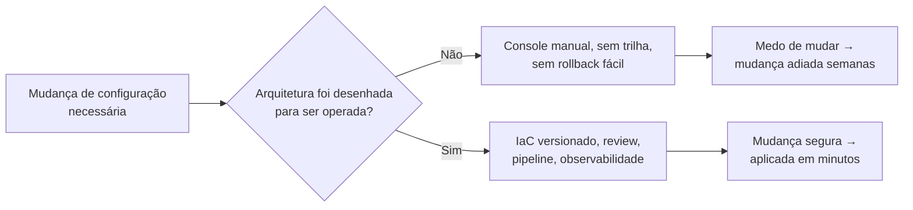
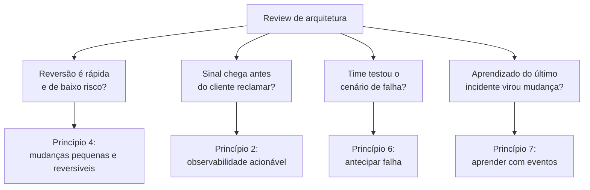

# Excelência operacional

> [!abstract] TL;DR
> Excelência operacional não é "ter um bom time de SRE" — é um **critério de projeto**: a arquitetura em si precisa ser desenhada para ser operada, observada e mudada com segurança, antes de qualquer plantão existir para operá-la. O pilar da AWS parte de oito princípios — organizar times por resultado de negócio, observabilidade acionável, automação segura, mudanças pequenas e reversíveis, refinar procedimentos com frequência, antecipar falha, aprender com todo evento, e usar serviços gerenciados — e os organiza em quatro fases contínuas: Organização, Preparação, Operação e Evolução. Numa review de arquitetura, "excelência operacional" nunca pergunta "seu time sabe fazer deploy?" — pergunta "se este componente falhar às 3h da manhã, o próprio desenho da arquitetura ajuda ou atrapalha quem estiver de plantão?".

## A mudança que ninguém queria fazer

Um serviço crítico precisa de uma correção simples: um parâmetro de configuração errado, identificado havia semanas, mas nunca corrigido. Por quê? Porque a única forma de aplicar a mudança é entrar manualmente no console do provedor, editar o valor numa instância de produção, e reiniciar o processo — sem trilha de auditoria clara sobre quem mudou o quê, sem forma automática de reverter se algo quebrar, e sem ambiente de teste que reproduza fielmente a produção. O engenheiro responsável sabe exatamente qual é o problema e exatamente qual é a correção. O que falta não é conhecimento técnico — é **confiança de que a mudança pode ser feita, observada e revertida com segurança**. Então a correção fica na fila, atrás de tarefas menos importantes mas menos assustadoras, semana após semana.

Esse é o sintoma clássico de uma arquitetura que não foi desenhada para ser operada. Não é falta de disciplina do time — é ausência de infraestrutura que torna mudança segura o caminho mais fácil, e não o mais arriscado. Um sistema de excelência operacional real resolveria isso de um jeito completamente diferente: a mudança de configuração viraria uma linha em um arquivo versionado, revisada por outro engenheiro, aplicada por um pipeline automatizado, visível num diff, reversível com um `git revert`, e acompanhada por um dashboard que mostra, em segundos, se o comportamento do sistema mudou como esperado depois do deploy. A correção que ficou parada por semanas levaria minutos — não porque o time ficou mais corajoso, mas porque a arquitetura parou de exigir coragem para ser mudada.

É essa distinção — arquitetura que **precisa** de heroísmo operacional versus arquitetura que **dispensa** heroísmo operacional — que o pilar de excelência operacional do AWS Well-Architected Framework tenta capturar como critério avaliável, e é o assunto desta nota.

## O que o pilar realmente pergunta

Antes de entrar nos princípios, vale reafirmar o que a nota 01 desta trilha já estabeleceu: um pilar do Well-Architected Framework não é um checklist de conformidade — é um conjunto de **perguntas** que uma review de arquitetura faz, e a excelência operacional formula as suas em torno de um objetivo específico: colocar funcionalidade nova e correção de bug na mão do cliente, de forma rápida e confiável, e continuar fazendo isso conforme o sistema evolui. O documento oficial da AWS define excelência operacional como "um compromisso de construir software corretamente enquanto se entrega, de forma consistente, uma ótima experiência para o cliente" — e organiza esse compromisso em quatro áreas de prática que se repetem em ciclo, não em sequência única:

- **Organização** — como o time se estrutura e prioriza em torno dos resultados de negócio que o workload precisa entregar.
- **Preparação** — o que precisa estar pronto (design, telemetria, procedimentos, ambientes de teste) antes de uma mudança ir para produção.
- **Operação** — como o dia a dia de rodar o sistema em produção é conduzido: monitorar saúde, responder a eventos, gerenciar e priorizar o trabalho operacional.
- **Evolução** — como aprender com o que aconteceu (sucessos e falhas) e alimentar esse aprendizado de volta no design, nos procedimentos e na organização.

Repare que essas quatro áreas formam um ciclo, não uma linha reta: o que se aprende na fase de Evolução realimenta a Organização e a Preparação da próxima rodada de mudanças. É a mesma lógica de melhoria contínua que aparece em qualquer disciplina madura de engenharia — só que aqui ela é tratada como parte do **desenho da arquitetura**, não como um processo à parte que existe fora dela.

## Os oito princípios de design

O whitepaper oficial lista oito princípios de design para excelência operacional na nuvem. Vale ler cada um não como uma frase de efeito, mas como uma pergunta implícita que uma review de arquitetura faz sobre o seu sistema.

**1. Organizar times em torno de resultados de negócio.** A pergunta por trás: o time que opera este componente entende *por que* ele existe, ou só sabe *como* mantê-lo rodando? Um time organizado por resultado de negócio (ex.: "time de checkout", que é dono do fluxo de compra de ponta a ponta) toma decisões operacionais melhores do que um time organizado por camada técnica (ex.: "time de banco de dados", que não vê o impacto de negócio de uma query lenta) — porque o primeiro sabe medir se a mudança que fez ajudou ou atrapalhou o objetivo real.

**2. Implementar observabilidade para insight acionável.** A pergunta: se este componente começar a se comportar mal, alguém vai saber **antes** do cliente reclamar, e vai saber **o suficiente** para agir — não só que "algo está errado", mas o quê, onde, e provavelmente por quê? Observabilidade aqui não é "ter um dashboard" — é ter telemetria desenhada para responder às perguntas operacionais certas, não só as que são fáceis de medir.

**3. Automatizar com segurança sempre que possível.** A pergunta: as operações rotineiras deste sistema (deploy, escala, resposta a um tipo conhecido de falha) dependem de uma pessoa lembrar de fazer a coisa certa, ou o sistema faz sozinho, com guardrails (limites de taxa, thresholds de erro, aprovações onde fazem sentido)? Automação aqui não é "eliminar humanos da operação" — é eliminar a dependência de memória humana para tarefas repetitivas, para que o julgamento humano fique reservado para o que realmente precisa dele.

**4. Fazer mudanças frequentes, pequenas e reversíveis.** A pergunta: se este deploy quebrar algo, o raio de impacto é pequeno e a reversão é rápida — ou uma mudança ruim vira um incidente de horas porque o deploy empacotou três semanas de trabalho de uma vez? Esse princípio é o motivo técnico por trás de uma prática que a trilha Operação já cobre em detalhe: deploys incrementais, com blast radius controlado, batem sistematicamente deploys grandes e raros em confiabilidade percebida.

**5. Refinar procedimentos operacionais com frequência.** A pergunta: o runbook que o time usa para responder a um incidente foi escrito uma vez, há dois anos, e nunca mais revisado — ou existe um hábito real de revisar procedimentos à luz do que realmente aconteceu na última vez que foram usados? Procedimento que não evolui vira ficção documentada.

**6. Antecipar falha.** A pergunta: o time sabe, com alguma confiança, o que acontece quando uma dependência específica cai — ou essa é a primeira vez que alguém vai descobrir, ao vivo, em produção? Antecipar falha significa simular cenários de falha deliberadamente, antes que eles aconteçam por acidente, para entender o comportamento real do sistema sob estresse.

**7. Aprender com todos os eventos e métricas operacionais.** A pergunta: quando algo dá errado (ou dá certo de um jeito inesperado), esse aprendizado vira conhecimento compartilhado pela organização, ou fica só na cabeça de quem estava de plantão naquela noite? Esse princípio é a base conceitual do que a trilha Operação chama de postmortem sem culpa — aqui ele aparece como *critério de arquitetura*: o sistema expõe dados suficientes (logs, métricas, traces) para que o aprendizado seja possível, ou o incidente vira uma história contada de memória, sem evidência?

**8. Usar serviços gerenciados.** A pergunta: o time está gastando esforço de engenharia mantendo algo que um serviço gerenciado do provedor já resolve — patch de sistema operacional, replicação de banco, escala de fila — quando esse esforço poderia estar indo para o diferencial real do produto? Esse princípio conecta diretamente com a nota 02 do galho 1 desta trilha, sobre elasticidade e o custo de "heavy lifting indiferenciado": manter você mesmo o que o provedor já opera bem é, quase sempre, o uso menos produtivo do tempo de um time de engenharia.

> [!info] Caducidade
> A lista de oito princípios reflete a revisão do whitepaper "Operational Excellence Pillar" publicada pela AWS em novembro de 2024. O framework é revisado periodicamente; confira a documentação oficial antes de citar a lista como definitiva num contexto formal (ex.: certificação).

## Como isso aparece numa review de arquitetura

Uma review de arquitetura real não pede para o time recitar os oito princípios — ela faz perguntas concretas sobre o desenho do sistema, e cada pergunta rastreia até um ou mais princípios. Vale um exemplo trabalhado, porque é assim que o pilar realmente é usado.

Imagine que o sistema em revisão é uma API de processamento de pedidos. Um revisor experiente, aplicando a lente de excelência operacional, não pergunta "vocês têm CI/CD?" como pergunta binária de sim/não — pergunta coisas como:

- "Se uma mudança de configuração precisar ser revertida às 3h da manhã, quanto tempo leva, e quantas pessoas precisam estar acordadas para fazer isso acontecer?" (mudanças pequenas e reversíveis, automação segura)
- "Quando a taxa de erro deste endpoint sobe 5%, existe um sinal que chega a alguém antes que o volume de tickets de suporte chegue primeiro?" (observabilidade acionável)
- "Da última vez que a dependência de pagamento externa ficou indisponível por 10 minutos, o que o sistema fez — e o que o time aprendeu disso que mudou o design?" (antecipar falha, aprender com eventos)
- "Quem é dono desta fila de mensagens — alguém que entende o impacto de negócio de uma mensagem perdida, ou só quem configurou o serviço originalmente?" (organizar por resultado de negócio)

Nenhuma dessas perguntas tem uma resposta técnica isolada — cada uma exige que a arquitetura já tenha sido desenhada, de antemão, para que a resposta exista. Um sistema que só tem "sim, fazemos deploy automatizado" como resposta pronta, mas nenhuma resposta para "quanto tempo leva reverter", passou no teste errado — o pilar não está interessado em saber se existe automação; está interessado em saber se a automação reduz o tempo entre "algo deu errado" e "voltamos ao normal".

## O que muda de verdade quando a nuvem entra na conta

Vale marcar uma diferença específica em relação a operar hardware próprio, porque é aqui que "excelência operacional" ganha um sentido diferente do que tinha antes da nuvem existir como opção séria. Em infraestrutura própria, boa parte do trabalho operacional era, necessariamente, trabalho de baixo nível: substituir disco com falha, aplicar patch de firmware, gerenciar capacidade física com meses de antecedência porque comprar e instalar hardware novo levava semanas. Esse trabalho consumia uma fatia enorme do tempo operacional de qualquer time de infraestrutura séria, e boa parte dele não diferenciava o produto de ninguém — dois times concorrentes, cuidando dos mesmos discos com falha, não estavam competindo em nada que importasse para o cliente final.

O que a nuvem muda — e é isso que o princípio "usar serviços gerenciados" está apontando — não é que operação deixou de importar. É que a fatia de operação que exige atenção humana se desloca: some o trabalho de baixo nível que o provedor já resolve em escala (hardware, virtualização, patch de infraestrutura física), e sobra — com mais tempo disponível para receber atenção real — o trabalho de alto nível que só o próprio time pode fazer: desenhar boa observabilidade para *este* sistema específico, decidir o tamanho certo de um deploy, entender o que realmente falha na *sua* arquitetura, treinar as pessoas certas para responder ao incidente certo. A promessa da excelência operacional na nuvem não é "trabalhar menos" — é "trabalhar no que só você pode fazer, porque o provedor já está fazendo o resto".

> [!info] Ponte com a trilha Operação
> Esta nota trata excelência operacional como **critério de arquitetura** — as perguntas que uma review faz sobre o desenho de um sistema. A prática do dia a dia que responde a essas perguntas — SLO e error budget, estratégias de deploy (blue-green, canary, rolling), resposta a incidentes, postmortem sem culpa, GitOps — já tem casa própria e detalhada no vault: [[03-Dominios/Engenharia/Operação/index|Operação (DevOps/SRE)]]. Se você chegou aqui querendo aprender *como* fazer um canary deploy ou *como* escrever um postmortem, é lá que essa mecânica é ensinada; aqui, o pilar só estabelece *por que* essas práticas são o critério pelo qual uma arquitetura é julgada madura ou não.

## Encarnação nos provedores: onde o pilar vira ferramenta

O pilar em si é provider-neutro — as perguntas que ele faz valem para qualquer arquitetura, em qualquer nuvem, e até fora da nuvem. Mas os dois provedores desta trilha oferecem ferramentas concretas que existem, em boa parte, exatamente para responder às perguntas que a excelência operacional levanta.

Em **AWS**, a ferramenta mais diretamente ligada ao pilar é o próprio **AWS Well-Architected Tool** — um serviço gratuito, disponível no console, que guia um time por um questionário estruturado alinhado aos seis pilares e gera um plano de melhoria com os riscos identificados. Para infraestrutura como código — o princípio "mudanças pequenas e reversíveis" começa aqui — a AWS oferece o **CloudFormation** (nativo) e integra bem com **Terraform**, ferramenta open-source amplamente usada tanto em AWS quanto em outros provedores. Para observabilidade, o par nativo é **CloudWatch** (métricas e logs) e **X-Ray** (tracing distribuído).

Em **DigitalOcean**, a filosofia é a mesma, com catálogo mais enxuto: infraestrutura como código costuma passar pelo **Terraform** (a DigitalOcean mantém um provider oficial), e observabilidade nativa vem do **DigitalOcean Monitoring**, com métricas e alertas integrados ao painel de cada recurso — mais simples que CloudWatch, mas cobrindo o mesmo território conceitual: saber o estado do sistema sem depender de alguém olhar manualmente.

| Conceito | AWS | Azure | GCP | DigitalOcean |
|---|---|---|---|---|
| Questionário guiado de arquitetura | AWS Well-Architected Tool | Azure Well-Architected Review | Google Cloud Architecture Framework (assessment) | — (sem ferramenta equivalente nativa) |
| Infraestrutura como código nativa | CloudFormation | Bicep / ARM Templates | Deployment Manager | — (Terraform é o caminho padrão) |
| Observabilidade nativa | CloudWatch + X-Ray | Azure Monitor + Application Insights | Cloud Monitoring + Cloud Trace | DigitalOcean Monitoring |

> [!info] Caducidade
> Nomes de produto e ferramentas verificados em 2026-07-20. Confira a documentação oficial de cada provedor antes de tomar decisão de arquitetura com base nesta tabela — nomes e ofertas de observabilidade e IaC mudam com frequência.

## Casos práticos

**O deploy que ninguém tinha coragem de reverter.** Um sistema de e-commerce tem um processo de deploy que empacota, em média, duas semanas de mudanças de vários times diferentes numa janela única, às sextas à noite (para "não atrapalhar o horário comercial"). Quando algo dá errado depois do deploy — o que acontece com frequência incômoda, porque duas semanas de mudanças interagem de formas imprevisíveis — reverter significa desfazer o trabalho de várias equipes de uma vez, o que ninguém quer fazer sozinho às 22h de sexta. O time aprende, depois de meses desse padrão, a aplicar o princípio 4 diretamente: quebrar o deploy monolítico em deploys menores, por serviço, disparados por cada time de forma independente e frequente (várias vezes por dia, não uma vez por duas semanas). O efeito colateral mais valioso não é a velocidade — é que reverter um deploy pequeno, de um serviço, feito há vinte minutos, deixa de ser um evento assustador e vira uma operação rotineira.

**A métrica que existia, mas ninguém olhava até o incidente acontecer.** Um serviço interno registra logs detalhados de erro havia anos, mas ninguém configurou um alerta que dispare quando a taxa de erro passa de um limite aceitável — os logs existem, mas só são consultados *depois* que alguém de fora do time já percebeu o problema. Aplicar o princípio 2 (observabilidade para insight acionável) aqui não significa coletar mais dados — significa transformar dados que já existem em sinal que chega a alguém antes do cliente. A mudança de arquitetura é pequena (configurar um alerta sobre uma métrica que já era coletada); o efeito prático é que o tempo entre "algo quebrou" e "alguém sabe" cai de horas (até um ticket de suporte chegar) para minutos.

**O runbook que só existia na cabeça de uma pessoa.** Um procedimento de recuperação para um tipo específico de falha de banco de dados nunca foi escrito — funcionava porque uma única pessoa sênior do time sabia exatamente o que fazer, de memória, toda vez que acontecia. Quando essa pessoa sai de férias durante um incidente real, o tempo de recuperação mais que triplica, porque o resto do time reconstrói o procedimento por tentativa e erro. O princípio 5 (refinar procedimentos com frequência) pressupõe que o procedimento existe documentado, em primeiro lugar — e o princípio 7 (aprender com eventos) é exatamente o que devolve, depois desse incidente, um runbook escrito, testado e acessível para qualquer pessoa do plantão, não só para quem "já viu isso antes".

## Armadilhas comuns

> [!warning] Confundir "ter uma ferramenta de observabilidade" com "ter observabilidade acionável"
> Instalar um agente de métricas ou assinar uma ferramenta de APM não é, sozinho, o princípio 2. A pergunta real é se os dados coletados respondem à pergunta operacional certa, e se alguém é notificado a tempo de agir. Um dashboard bonito que ninguém olha até o incidente já ter estourado é teatro de observabilidade, não excelência operacional.

> [!warning] Tratar excelência operacional como responsabilidade exclusiva do time de operações
> O princípio 1 (organizar por resultado de negócio) é, em parte, uma resposta direta a esse erro: quando "operação" é um time isolado, separado de quem desenha e escreve o código, a arquitetura tende a ser desenhada sem pensar em como será operada — e o time de operação herda o problema depois, sem poder de mudar o design que o causou. Excelência operacional que funciona é responsabilidade compartilhada desde o desenho, não um departamento que aparece depois do deploy.

> [!warning] Achar que "mudanças pequenas e frequentes" significa "sem processo de revisão"
> O princípio 4 não é licença para pular code review ou aprovação onde ela genuinamente reduz risco. O ponto é reduzir o **blast radius** de cada mudança individual — não eliminar julgamento humano do processo. Automação segura (princípio 3) inclui, explicitamente, guardrails como aprovações onde fazem sentido; o objetivo é remover trabalho manual repetitivo, não remover revisão criteriosa.

## O que vem a seguir

Excelência operacional respondeu a uma pergunta: a arquitetura ajuda ou atrapalha quem precisa operá-la e mudá-la com segurança? Mas existe uma pergunta vizinha, igualmente central em qualquer review séria, e que às vezes entra em tensão direta com a primeira: quem pode acessar o quê, e como isso é garantido, auditado e limitado ao mínimo necessário? Essa é a pergunta do próximo pilar, e a próxima nota desta trilha — **"Segurança"**.

## Fontes

- [AWS Well-Architected Framework — Operational Excellence Pillar (whitepaper completo)](https://docs.aws.amazon.com/wellarchitected/latest/operational-excellence-pillar/welcome.html) — documento oficial, publicado em 6 de novembro de 2024; acessado em 2026-07-20.
- [AWS Well-Architected Framework — Operational excellence: definição e princípios de design](https://docs.aws.amazon.com/wellarchitected/latest/operational-excellence-pillar/operational-excellence.html) — fonte dos oito princípios de design citados nesta nota, e das quatro áreas (Organização, Preparação, Operação, Evolução); acessado em 2026-07-20.
- [AWS Well-Architected Framework — página oficial dos seis pilares](https://aws.amazon.com/architecture/well-architected/) — visão geral do framework completo; acessado em 2026-07-20.
- [AWS Well-Architected Tool — página oficial de produto](https://aws.amazon.com/well-architected-tool/) — ferramenta gratuita de review guiada pelos pilares; acessado em 2026-07-20.
- [DigitalOcean — Monitoring (documentação oficial)](https://docs.digitalocean.com/products/monitoring/) — observabilidade nativa da DigitalOcean, métricas e alertas; acessado em 2026-07-20.
- [Terraform Provider for DigitalOcean (Terraform Registry, documentação oficial)](https://registry.terraform.io/providers/digitalocean/digitalocean/latest/docs) — provider oficial usado para infraestrutura como código em DigitalOcean; acessado em 2026-07-20.
